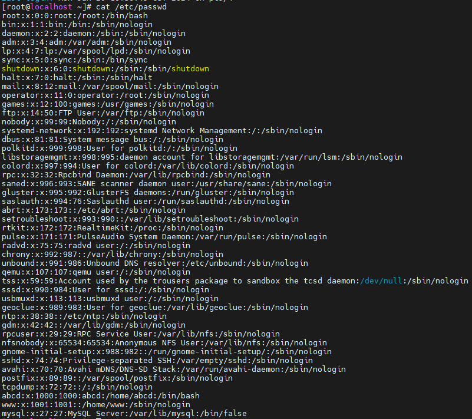
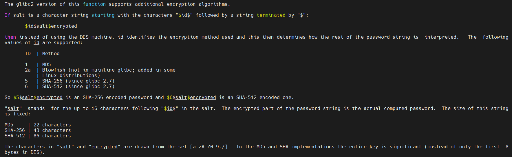
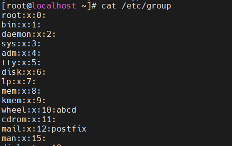

---
title:1-Linux权限提升
---

# 1-Linux权限提升

> [[Linux 安全运维\] 第三章 Linux 用户以及权限管理 - 知乎 (zhihu.com)](https://zhuanlan.zhihu.com/p/428433013?utm_id=0)

## 1. Linux中的用户和组

### 1.1 用户和组概念

- 超级管理员（root）
- 系统用户
- 普通用户

```text
[root@localhost ~]# id root
uid=0(root) gid=0(root) groups=0(root)
[root@localhost ~]#
```

每个用户被分配一个唯一的用户标识符（UID），用于标识和管理用户。

| 用户分类   | UID                                             |
| ---------- | ----------------------------------------------- |
| 超级管理员 | 0                                               |
| 系统用户   | 1-499（CentOS6及以前），1-999（CentOS7及以后）  |
| 普通用户   | >=500（CentOS6及以前），>=1000（CentOS7及以后） |

GID（组标识符）用于标识和管理用户所属的组。每个用户可以属于一个或多个组，而每个组也有一个唯一的GID。

| 用户组 | GID    |
| ------ | ------ |
| root组 | 0      |
| 系统组 | 1-999  |
| 普通组 | >=1000 |

先有组，再有用户：

- 用户必须有且只有一个基本组。
- 当创建一个用户时，如果没有指定基本组，会先创建一个与该用户同名的组，再创建用户。
- 一个用户可以有多个附加组。
- 基本组内没有任何用户，才能被删除。

### 1.2 相关文件

`/etc/passwd` 文件中存储了所有用户信息。



该文件每一行是一个用户信息，并且以`:` 为分隔符，一共7 段内容。

```text
root:x:0:0:root:/root:/bin/bash
[--] - - - [--] [---] [--------]
 |   | | |   |    |        |
 |   | | |   |    |        +-> 7. Login shell
 |   | | |   |     +---------> 6. Home directory
 |   | | |   +---------------> 5. GECOS
 |   | | +-------------------> 4. GID
 |   | +---------------------> 3. UID
 |   +-----------------------> 2. Password
 +---------------------------> 1. Username
```

| 字段序号 | 示例      | 解释                              | 说明                                                 |
| -------- | --------- | --------------------------------- | ---------------------------------------------------- |
| 1        | root      | 用户名                            |                                                      |
| 2        | x         | 密码占位符                        | 用户的密码 x 代表有密码 无内容，用户登录系统无需密码 |
| 3        | 0         | UID                               | 当前用户的身份标识 0 就是超级管理员                  |
| 4        | 0         | GID                               | 当前用户的基本组ID                                   |
| 5        | root      | 用户的身份信息 大名               | 现已废弃                                             |
| 6        | /root     | 用户家目录                        | 超管：/root 普通用户：/home/用户名                   |
| 7        | /bin/bash | 用户登录系统后 （默认）命令解释器 | /sbin/nologin 不允许登录系统 /bin/sh                 |

------

`/etc/shadow` 记录了系统中用户的密码信息。


该文件每一行记录一个用户的密码信息，并且以`:` 作为分隔符，一共9 段内容。

```text
root:$6$T07ge8Py$.tZXOZIOpWq2sGZKEkKn2KMahL.mcyNrQrd3C3PIqNt8kA0p/K3JtG4Dwn4vyU2kSvyEg1K2xArTs61AG1Qo1/:18766:0:99999:7:::
```

| 字段序号 | 示例      | 含义           | 说明                                                         | 可登录 |
| -------- | --------- | -------------- | ------------------------------------------------------------ | ------ |
| 1        | root      | 用户名         |                                                              |        |
| 2        | $6$T07ge8 | 密码密文       | sha-512 HASH 散列算法 salt 值 加密后的密文                   |        |
| 3        | 18766     | 密码修改时间   | 距离1970 年1 月1 日 密码最近一次的修改时间（天）             |        |
| 4        | 0         | 密码最短有效期 | 在最短有效期之内不能修改密码 3：三天之内不可以修改自己的密码 root 用户不受此限制 |        |
| 5        | 99999     | 密码最长有效期 | 密码可以使用多长时间 建议设置成90 天                         |        |
| 6        | 7         | 密码过期时间   | 密码过期前7 天会有警告提示                                   |        |
| 7        |           | 密码的不活跃期 | 过了密码有效期没有修改密码， 处于不活跃期，仍然可以登录系统。 |        |
| 8        |           | 账户失效时间   | 密码距离1970 年1 月1 日的失效时间（天）                      |        |
| 9        |           | 未分配功能     |                                                              |        |

密码密文结构

密码密文：

```text
$6$T07ge8Py$.tZXOZIOpWq2sGZKEkKn2KMahL.mcyNrQrd3C3PIqNt8kA0p/K3JtG4Dwn4vyU2kSvyEg1K2xArTs61AG1Qo1/

$id$salt$encrypted

$加密方式$盐值（随机的）$密码密文
```

执行命令`man crypt`可以看到加密方式分别为什么



攻击者可能会先获取这个密文，然后爆破出服务器密码。

------

`/etc/group` 保存了组信息。



该文件的每一行记录了每一个组的信息，并且以`:` 作为分隔符，一共4 段内容。

```text
abcd:x:1000:
```

| 字段数 | 示例 | 含义     | 说明                                                  |
| ------ | ---- | -------- | ----------------------------------------------------- |
| 1      | abcd | 组名     | 用户组的名称，由字母或数字构成。                      |
| 2      | x    | 密码     | x 是密码标识， 组密码默认保存在 /etc/gshadow 文件中。 |
| 3      | 1000 | GID      | Group ID                                              |
| 4      | abcd | 群组用户 |                                                       |


## 2. Linux中的权限

### 2.1 权限分类

在Linux中，权限被分为三个类型：读、写和执行。通过`ls -lh` 命令查看文件或目录的权限。

`ls -lh` 命令结果中，每一行以空格为分隔符分为9 个字段（列）。

| 字段数 | 例子         | 说明                                                         |
| ------ | ------------ | ------------------------------------------------------------ |
| 1      | drwxr-xr-x.  | 文件或目录权限                                               |
| 2      | 2            | 如果文件类型是文件，表示文件的节点数 如果文件类型是目录，表示子目录的个数 |
| 3      | root         | 所有者的名字                                                 |
| 4      | root         | 所有组的名字                                                 |
| 5      | 137          | 文件大小 注意：不是目录的大小。                              |
| 6 7 8  | Feb 23 10:25 | 文件最后一次修改时间                                         |
| 9      | Desktop      | 文件或者目录的名字                                           |

第一个字段中，文件或目录权限分为5 个字段（列）。

```text
d rwx r-x r-x .
```

| 字段数 | 示例 | 含义           | 说明                                           |
| ------ | ---- | -------------- | ---------------------------------------------- |
| 1      | d    | 文件类型       | - 文件 d 目录 l 符号链接 c 字符型设备 b 块设备 |
| 2      | rwx  | 所有者权限     | u 所有者                                       |
| 3      | r-x  | 所属组的权限   | g 所属组                                       |
| 4      | r-x  | 其他用户的权限 | o 其他用户                                     |
| 5      | .    |                |                                                |

权限表达方式说明：

| 权限 | 文件           | 目录                   |
| ---- | -------------- | ---------------------- |
| r    | 读取文件内容   | 列出目录内容           |
| w    | 修改文件内容   | 创建、删除目录中的文件 |
| x    | 执行程序或脚本 | 可以进入该目录         |

### 2.2 八进制赋权法

八进制赋权法，即用八进制数表达文件或者目录的权限，这种表达方式精炼方便。

- 给读权限赋值为4，即`r = 4`；
- 写权限赋值为2，即`w = 2`；
- 执行权限赋值为1，即`x = 1`。

| 权限位 | 2 进制 | 8 进制 |
| ------ | ------ | ------ |
| ---    | 000    | 0      |
| --x    | 001    | 1      |
| -w-    | 010    | 2      |
| -wx    | 011    | 3      |
| r--    | 100    | 4      |
| r-x    | 101    | 5      |
| rw-    | 110    | 6      |
| rwx    | 111    | 7      |

常见权限：

- 777，最高权限；
- 755，可执行文件；
- 644，文档文件。

### 权限修改

- 对文件或目录进行权限设置，一定程度上保证安全性。
- 只有文件或者目录的所有者才能赋权，root 除外。
- 一般情况下，通过chmod 命令进行权限修改或调整。

chmod 命令有固定的使用格式，如下：

```text
chmod 对象 运算符号 权限 文件或者目录
```

例如

```
chmod u+w ./aaa.txt
```

权限运算说明：

| 对象    | 运算符号 | 权限      |
| ------- | -------- | --------- |
| u g o a | + - =    | r w x t s |

