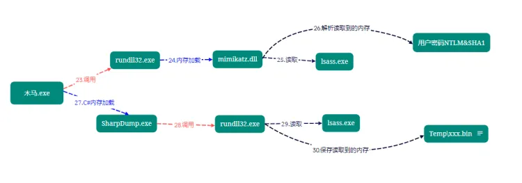

udf webshell SQL注入拿shell

# CS

进去文件夹，调teamserver

删除shell的话，先点退出，再删除，要不一直弹shell。

有shell了 先sleep 0，会话时间（last）变小，实时交互

视图--目标列表--除了扫描到的，还可以手动添加--右键 横向移动

可以右键--浏览探测

当前主机，点会话交互 ，就可以直接收集密码了

视图---密码凭证

插件

### CS梼杌插件里两个抓密码功能区别

`Mimikatz Logon Passwords` ：内存加载mimikatz到目标主机，然后执行`sekurlsa::logonpasswords`

`DumpLsass SharpDump`：先内存加载一个SharpDump.exe，然后调用rundll32执行，把从内存里抓到的内容保存在xxx.out文件里，然后gz压缩成.bin文件，这个文件会留在靶机上，下载下来解压，用mimakatz读就行了。

