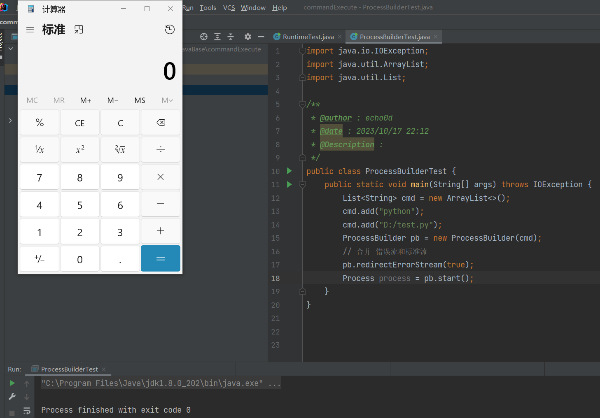
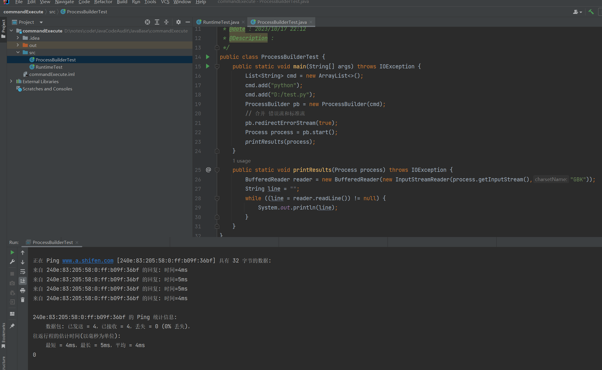

# 2-命令执行

Java调用外部可执行程序或系统命令，主要有以下两种调用方式

```java
1、Runtime.getRuntime().exec

2、new ProcessBuilder().start()
```

## 1、Runtime

### 1.1 简介

`Runtime.getRuntime().exec`用于调用外部可执行程序或系统命令，并重定向外部程序的标准输入、标准输出和标准错误到缓冲池。功能和windows“运行”类似。

- `Runtime`是一个单例的实例
- `Runtime`运行应用程序与运行应用程序的环境进行交互
- `Runtime`是Java运行时环境，应用程序不能创建属于自己的实例，需要通过`getRuntime()`方法获取

调用方式如下：

```java
private Process exec(String command) throws IOException {
	Runtime runtime = Runtime.getRuntime();
	Process process = runtime.exec(command);
    return process;
}
```

`command`是要执行的命令，`Runtime.getRuntime()`返回当前应用程序的`Runtime`对象，该对象的`exec()`方法指示Java虚拟机创建一个子进程执行指定的可执行程序，并返回与该子进程对应的`Process`对象实例。通过`Process`可以控制该子进程的执行或获取该子进程的信息。`Procss`类将持有该程序返回Java VM的引用。这个`Procss`类是一个抽象类，具体子类的实现依赖于不同的底层操作系统。

> `Runtime.exec()`不是`cmd`或`shell`环境，因此无法直接调用`dir`等命令，需要在程序中读取运行的操作系统平台，以调用不同的命令解释器（NT：cmd.exe，windows 95/98：command.exe，linux：/bin/sh）


### 1.2 方法API

`Runtime.getRuntime().exec`共有六个重载方法：

1. `public Process exec(String command)`// 在单独的进程中执行指定的外部可执行程序的启动路径或字符串命令
2. `public Process exec(String[] cmdArray)`// 在单独的进程中执行指定命令和变量
3. `public Process exec(String command, String[] envp)`// 在指定环境的独立进程中执行指定命令和变量
4. `public Process exec(String[] cmdArray, String[] envp)`// 在指定环境的独立进程中执行指定的命令和变量
5. `public Process exec(String command, String[] envp, File dir)`// 在指定环境和工作目录的独立进程中执行指定的字符串命令
6. `public Process exec(String[] cmdarray, String[] envp, File dir)`// 在指定环境和工作目录的独立进程中执行指定的命令和变量

`cmdarray`：包含所调用命令及其参数的数组。数组第一个元素是命令，其余是参数
`envp`：字符串数组，其中每个元素的环境变量的设置格式为 name=value，如果子进程应该继承当前进程的环境，则该参数为null
`dir`：子进程的工作目录；如果子进程应该继承当前进程的工作目录，则该参数为null

参数`cmdArray`示例：

```java
String arr[] = {"shutdown","-s","-t","3600"};
Process process = Runtime.getRuntime().exec(arr[]);
```

注意：在调用这个方法时，不能将命令和参数放在一起，eg：`String arr[] = {"shutdown -s -t 3600"};`这样会导致程序把`“shutdown -s -t 3600”`当成是一条命令的名称，然后去查找`“shutdown -s -t 3600”`这条命令，它当然会找不到，所以就会报错。

具体示例：

```java
import java.io.IOException;
import java.io.InputStream;

/**
 * @author : echo0d
 * @date : 2023/10/17 21:43
 * @Description :
 */
public class RuntimeTest {

    public static void test1() throws IOException {
        Runtime runtime = Runtime.getRuntime();
        runtime.exec(new String[]{"cmd", "/c", "calc", "&", "notepad"});
    }

    public static void test2() throws IOException{
        Runtime runtime = Runtime.getRuntime();
        runtime.exec("cmd /c calc & notepad");
    }

    public static void test3() throws IOException{
        Runtime runtime = Runtime.getRuntime();
        runtime.exec("cmd.exe /k calc & notepad");
    }

    public static void test4() throws IOException{
        Runtime runtime = Runtime.getRuntime();
        runtime.exec(new String[]{"cmd.exe", "/k", "calc", "&", "notepad"});
    }

    public static void test5() throws IOException, InterruptedException {
        Runtime runtime = Runtime.getRuntime();
        Process start = runtime.exec("ping www.baidu.com");
        start.waitFor();
        InputStream inputStream = start.getInputStream();
        byte[] res = new byte[1024];
        inputStream.read(res);
        System.out.println(new String(res, "GBK"));
    }

    public static void main(String[] args) throws IOException, InterruptedException {
//        test1();
//        test2();
//        test3();
//        test4();
        test5();
    }
}

```


## 2、ProcessBuilder

### 2.1 简介

`ProcessBuilder`类用于创建操作系统进程，它提供一种启动和管理进程（也就是应用程序）的方法，是J2SE 1.5在`java.lang`中新添加的一个新类，之前都是由Process类处理实现进程的控制管理。

每个`ProcessBuilder`实例管理一个进程属性集合。`start()`方法使用这些属性创建一个新的流程实例。可以从同一个实例多次调用start()方法，以创建具有相同或相关属性的新子进程。`ProcessBuilder`的构造方法接收一个命令参数的数组形式，其中，第一个元素代表要执行的系统命令，后面的元素代表要传给该命令的参数。

例如

```java
import java.io.BufferedReader;
import java.io.IOException;
import java.io.InputStreamReader;
import java.io.PrintStream;
import java.nio.charset.StandardCharsets;
import java.util.ArrayList;
import java.util.List;

/**
 * @author : echo0d
 * @date : 2023/10/17 22:12
 * @Description :
 */
public class ProcessBuilderTest {
    public static void main(String[] args) throws IOException {
        List<String> cmd = new ArrayList<>();
        cmd.add("python");
        cmd.add("D:/test.py");
        ProcessBuilder pb = new ProcessBuilder(cmd);
        // 合并 错误流和标准流
        pb.redirectErrorStream(true);
        Process process = pb.start();
        printResults(process);
    }
    public static void printResults(Process process) throws IOException {
        BufferedReader reader = new BufferedReader(new InputStreamReader(process.getInputStream(),"GBK"));
        String line = "";
        while ((line = reader.readLine()) != null) {
            System.out.println(line);
        }
    }
}

```

test.py如下

```python
import os

def runcmd(cmd):
    result = os.system(cmd)
    return result

if __name__ == '__main__':
    result = runcmd("calc") 
    print(result)
```

运行结果



或者cmd改成ipconfig



### 2.2 方法API

构造方法

- `ProcessBuilder(List<String> command) `利用指定的操作系统程序和参数构造一个进程生成器。 
- `ProcessBuilder(String… command) `利用指定的操作系统程序和参数构造一个进程生成器。

- 方法摘要 
  `command() `返回此进程生成器的操作系统程序和参数。设置此过程构建器的操作系统程序和参数。此方法不会复制命令列表。该列表的后续更新将反映在流程构建器的状态中。不检查命令是否对应于有效的操作系统命令。
- `command(List<String> command) `设置此进程生成器的操作系统程序和参数。 
- `command(String… command) `设置此进程生成器的操作系统程序和参数。 
- `directory() `返回此进程生成器的工作目录。 
-  `directory(File directory) `设置此进程生成器的工作目录。 
-  `environment() `返回此进程生成器环境的字符串映射视图。 environment方法获得运行进程的环境变量,得到一个Map,可以修改环境变量 
- `redirectErrorStream() `通知进程生成器是否合并标准错误和标准输出。如果该属性为真，则由该对象的`start()`方法启动的子进程生成的任何错误输出都将与标准输出合并，以便两者都可以使用`Process.getInputStream()`方法读取。这使得将错误消息与相应的输出关联起来更容易,而从 `Process.getErrorStream()`返回的流读取将直接到达文件尾，初始值为false。
- `redirectErrorStream(boolean redirectErrorStream) `设置此进程生成器的 redirectErrorStream 属性。 
- `start()`使用此进程生成器的属性启动一个新进程。

完整例子：

```java
public class ProcessBuilderTest {
    public static void main(String[] args) {
        List<String> params = new ArrayList<String>();
        params.add("java");
        params.add("-jar");
        params.add("ProcessJar.jar");
        params.add("args1");
        params.add("args2");
        params.add("args3");

        ProcessBuilder processBuilder = new ProcessBuilder(params);
//        System.out.println(processBuilder.directory());
//        System.out.println(processBuilder.environment());
        processBuilder.redirectErrorStream(true);
        try {
            Process process = processBuilder.start();
            BufferedReader br = new BufferedReader(new InputStreamReader(process.getInputStream()));
            String line;
            while ((line = br.readLine()) != null) {
                System.out.println(line);
            }
            int exitCode = process.waitFor();
            System.out.println("exitCode = "+exitCode);
        } catch (IOException e) {
            e.printStackTrace();
        } catch (InterruptedException e) {
            e.printStackTrace();
        }
    }
}
```

