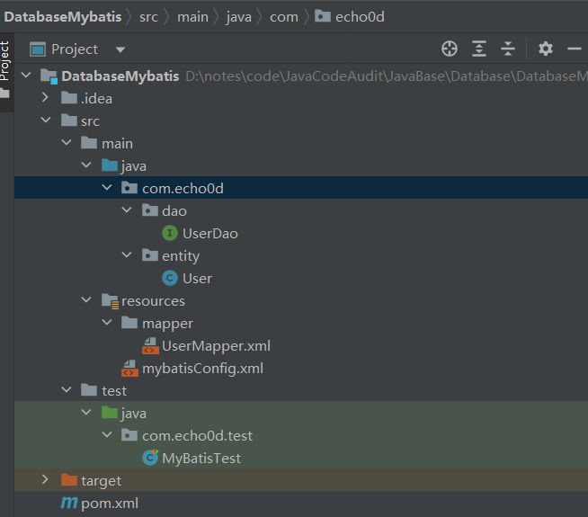

# Java代码审计-数据库

执行sql语句的几种方式：JDBC、Hibernate、Mybatis，三者区别如下：

- jdbc是较底层的持久化操作方式，而hibernate和mybatis都是在jdbc的基础上进行了封装使其更加方便程序运对持久层的操作。
- jdbc就是先创建connection连接数据库，然后创建statement对象，通过statement对象执行sql语句，得到resultSet对象，通过对resultSet对象的遍历操作来获取数据并手动转为javaBean，最后关闭resultSet、statement、connection释放资源；hibernate是将数据库中的数据表映射为持久层的java对象，对sql语句修改和优化困难；mybatis将sql语句的输入参数和输出参数映射为java对象，sql语句修改和优化方便；
- 若进行底层编程，且对性能要求极高的话，应采用jdbc方式；若对数据库进行完整性控制的话建议使用hibernate；若灵活使用sql语句的话建议使

## 1、JDBC

JDBC(Java Database Connectivity)，是Java连接数据库操作的原生接口。JDBC是所有框架操作数据库所必须的，是数据库的统一接口标准。

### 1.1 一般步骤

1. 使用JDBC编程需要链接数据库，注册驱动和数据库信息。
2. 操作Connection，打开Statement对象。
3. 通过Statement执行SQL语句，返回结果放到ResultSet对象。
4. 使用ResultSet读取数据。
5. 关闭数据库相关的资源。

数据库：

```
CREATE DATABASE IF NOT EXISTS CodeAudit;
use CodeAudit;
CREATE TABLE users (
  ID INT,
  name VARCHAR(50),
  phone VARCHAR(20)
);
INSERT INTO users (ID, name, phone) VALUES
(1, 'John Doe', '123-456-7890'),
(2, 'Jane Smith', '987-654-3210'),
(3, 'Alice Johnson', '555-123-4567'),
(4, 'Bob Thompson', '888-999-0000');
```

先添加pom依赖

```
    <dependencies>
        <dependency>
            <groupId>mysql</groupId>
            <artifactId>mysql-connector-java</artifactId>
            <version>5.1.47</version>
        </dependency>
    </dependencies>
```

然后按照上面的步骤

```java
/**
 * @author : echo0d
 * @date : 2023/12/31 11:41
 * @Description :
 */
import java.sql.*;

public class JDBCTestMain {
    public static void main(String[] args) {

        final String JDBC_DRIVER = "com.mysql.jdbc.Driver";
        final String DB_URL = "jdbc:mysql://localhost/CodeAudit";
        final String USER = "root";
        final String PASS = "123456";
        Connection connection = null;
        Statement statement = null;
        ResultSet resultSet = null;
        try {
            Class.forName(JDBC_DRIVER); //注册驱动，Class.forName("数据库驱动的类名")。
//            Driver driver = new com.mysql.jdbc.Driver(); //实例化com.mysql.jdbc.Driver，类加载即会执行静态代码块
//            DriverManager.registerDriver(new com.mysql.jdbc.Driver()); //使用 `DriverManager` 类的 `registerDriver` 方法来实例化驱动程序：
            System.out.println("Connecting to database...");
            connection = DriverManager.getConnection(DB_URL, USER, PASS); //获取连接，DriverManager.getConnection(xxx)。
            System.out.println("Creating statement...");
            statement = connection.createStatement(); //操作Connection，打开Statement对象。
            String sql;
            sql = "SELECT * from users";
            resultSet = statement.executeQuery(sql); //通过Statement执行SQL语句，返回结果放到ResultSet对象。
            while (resultSet.next()) {
                // 下面使用ResultSet读取数据。
                int PKey = resultSet.getInt("id");
                String name = resultSet.getString("name");
                String phone = resultSet.getString("phone");
                System.out.print("PKey: " + PKey);
                System.out.print(", name: " + name);
                System.out.print(", phone: " + phone);
                System.out.println("\n");
            }
        } catch (SQLException se) {
            se.printStackTrace();
        } catch (Exception e) {
            e.printStackTrace();
        } finally {
            // 关闭数据库相关的资源
            close(resultSet);
            close(statement);
            close(connection);
        }
    }

    public static void close(AutoCloseable autoCloseable) {
        if (autoCloseable != null) {
            try {
                autoCloseable.close();
            } catch (Exception e) {
                throw new RuntimeException(e);
            }
        }
    }
}
```

上图代码里面有一个`Class.forName("com.mysql.jdbc.Driver")`实际上会触发类加载，`com.mysql.jdbc.Driver`类将会被初始化，所以`static静态语句块`中的代码也将会被执行，如下图源码：


其实也可以换个方法触发类加载，即实例化`com.mysql.cj.jdbc.Driver`或`com.mysql.jdbc.Driver`类加载即会执行静态代码块，如上面代码中注释掉的部分。
> 如果反射某个类又不想初始化类方法有两种途径：
>
> 1. 使用`Class.forName("xxxx", false, loader)`方法，将第二个参数传入false。
> 2. ClassLoader.load("xxxx");

**删掉Class.forName()反射会发现依旧正常执行不报错：**

这里利用了Java的一大特性:`Java SPI(Service Provider Interface)`，因为`DriverManager`在初始化的时候会调用`java.util.ServiceLoader`类提供的SPI机制，Java会自动扫描jar包中的`META-INF/services`目录下的文件，并且还会自动的`Class.forName(文件中定义的类)`，这也就解释了为什么不需要`Class.forName`也能够成功连接数据库的原因了

### 1.2 数据源

虽然可以直接使用 JDBC 驱动程序来创建和管理数据库连接，但使用数据源（DataSource）提供了更好的连接管理和资源控制的机制。以下是 JDBC 使用 DataSource 的一些好处：

1. 连接池管理：数据源提供了连接池的功能，可以在应用程序启动时创建一组数据库连接并放入连接池中。这样，在需要连接数据库时，可以从连接池中获取连接，而不是每次都创建新的连接和断开连接。连接池可以有效地管理和重用连接，提高性能和响应速度。
2. 连接参数配置：数据源允许你将连接参数配置在一个地方，而不是在每个数据库连接的地方单独设置。这样可以简化代码，并提供一种集中管理连接参数的方式，方便进行统一的配置和修改。
3. 连接错误处理：数据源可以处理连接错误和异常情况，例如网络中断、数据库崩溃等。当连接发生错误时，数据源可以自动处理连接的关闭和重新建立，确保应用程序的稳定性和可靠性。
4. 并发控制：数据源可以提供并发控制机制，以限制同时使用的数据库连接数。这样可以避免过多的连接导致数据库性能下降，并提供一种资源控制的方式，确保数据库连接的合理使用。
5. 支持事务管理：数据源可以与事务管理器（如 JavaEE 中的 JTA）集成，提供对事务的支持。它可以管理连接的事务性，包括事务的开始、提交和回滚，确保数据的一致性和完整性

> 以上来自chatGPT

常见的数据源有：`DBCP`、`C3P0`、`Druid`、`Mybatis DataSource`，他们都实现于`javax.sql.DataSource`接口。

如下为druid数据源的一个例子: pom.xml

```xml
<?xml version="1.0" encoding="UTF-8"?>
<project xmlns="http://maven.apache.org/POM/4.0.0"
         xmlns:xsi="http://www.w3.org/2001/XMLSchema-instance"
         xsi:schemaLocation="http://maven.apache.org/POM/4.0.0 http://maven.apache.org/xsd/maven-4.0.0.xsd">
    <modelVersion>4.0.0</modelVersion>

    <groupId>org.example</groupId>
    <artifactId>Database</artifactId>
    <version>1.0-SNAPSHOT</version>

    <properties>
        <maven.compiler.source>8</maven.compiler.source>
        <maven.compiler.target>8</maven.compiler.target>
        <project.build.sourceEncoding>UTF-8</project.build.sourceEncoding>
    </properties>
    <parent>
        <groupId>org.springframework.boot</groupId>
        <artifactId>spring-boot-starter-parent</artifactId>
        <version>1.5.2.RELEASE</version>
        <relativePath/> <!-- lookup parent from repository -->
    </parent>
    <dependencies>
        <dependency>
            <groupId>org.springframework.boot</groupId>
            <artifactId>spring-boot-starter-thymeleaf</artifactId>
        </dependency>
        <dependency>
            <groupId>org.springframework.boot</groupId>
            <artifactId>spring-boot-starter-jdbc</artifactId>
        </dependency>
        <dependency>
            <groupId>mysql</groupId>
            <artifactId>mysql-connector-java</artifactId>
        </dependency>
        <dependency>
            <groupId>com.alibaba</groupId>
            <artifactId>druid</artifactId>
            <version>1.0.19</version>
        </dependency>

        <dependency>
            <groupId>org.springframework.boot</groupId>
            <artifactId>spring-boot-starter-test</artifactId>
            <scope>test</scope>
        </dependency>
    </dependencies>

</project>
```

然后是配置文件application.properties

```
# 数据源配置
spring.thymeleaf.cache=false
spring.datasource.url=jdbc:mysql://localhost:3306/CodeAudit?useUnicode=true&characterEncoding=utf-8
spring.datasource.username=root
spring.datasource.password=123456
spring.datasource.driver-class-name=com.mysql.jdbc.Driver

# Druid 连接池配置
spring.datasource.type=com.alibaba.druid.pool.DruidDataSource
spring.datasource.initial-size=5
spring.datasource.min-idle=5
spring.datasource.max-active=20
spring.datasource.max-wait=60000
spring.datasource.time-between-eviction-runs-millis=60000
spring.datasource.min-evictable-idle-time-millis=300000
spring.datasource.validation-query=SELECT 1
spring.datasource.test-while-idle=true
spring.datasource.test-on-borrow=false
spring.datasource.test-on-return=false
spring.datasource.pool-prepared-statements=true
spring.datasource.max-pool-prepared-statement-per-connection-size=20
spring.datasource.filters=stat,wall,log4j
spring.datasource.connection-properties=druid.stat.mergeSql=true;druid.stat.slowSqlMillis=5000

# 其他应用配置...
```

> 此处配置文件如果没写这么多，可以在后面代码注释掉的地方进行数据源的配置

spring的启动函数

```
package com.echo0d;

/**
 * @author : echo0d
 * @date : 2023/12/31 14:07
 * @Description :
 */
import com.alibaba.druid.pool.DruidDataSource;
import org.springframework.beans.factory.annotation.Autowired;
import org.springframework.boot.SpringApplication;
import org.springframework.boot.autoconfigure.SpringBootApplication;
import org.springframework.context.annotation.Bean;
import org.springframework.core.env.Environment;

import javax.sql.DataSource;

@SpringBootApplication
public class Application {
    public static void main(String[] args) {
        SpringApplication.run(Application.class, args);
    }
//    @Autowired
//    private Environment env;
//
//    //destroy-method="close"的作用是当数据库连接不使用的时候,就把该连接重新放到数据池中,方便下次使用调用.
//    @Bean(destroyMethod =  "close")
//    public DataSource dataSource() {
//        DruidDataSource dataSource = new DruidDataSource();
//        dataSource.setUrl(env.getProperty("spring.datasource.url"));
//        dataSource.setUsername(env.getProperty("spring.datasource.username"));//用户名
//        dataSource.setPassword(env.getProperty("spring.datasource.password"));//密码
//        dataSource.setDriverClassName(env.getProperty("spring.datasource.driver-class-name"));
//        dataSource.setInitialSize(2);//初始化时建立物理连接的个数。初始化发生在显示调用init方法，或者第一次getConnection时
//        dataSource.setMaxActive(20);//最大连接池数量
//        dataSource.setMinIdle(0);//最小连接池数量
//        dataSource.setMaxWait(60000);//获取连接时最大等待时间，单位毫秒。配置了maxWait之后，缺省启用公平锁，并发效率会有所下降，如果需要可以通过配置useUnfairLock属性为true使用非公平锁。
//        dataSource.setValidationQuery("SELECT 1");//用来检测连接是否有效的sql，要求是一个查询语句，常用select 'x'。如果validationQuery为null，testOnBorrow、testOnReturn、testWhileIdle都不会其作用。
//        dataSource.setTestOnBorrow(false);//申请连接时执行validationQuery检测连接是否有效，做了这个配置会降低性能。
//        dataSource.setTestWhileIdle(true);//建议配置为true，不影响性能，并且保证安全性。申请连接的时候检测，如果空闲时间大于timeBetweenEvictionRunsMillis，执行validationQuery检测连接是否有效。
//        dataSource.setPoolPreparedStatements(false);//是否缓存preparedStatement，也就是PSCache。PSCache对支持游标的数据库性能提升巨大，比如说oracle。在mysql下建议关闭。
//        return dataSource;
//    }
}

```

## 2、Mybatis

JDBC缺点：

- 数据库连接的频繁创建、释放浪费资源进而影响系统性能。
- sql代码写在 Java文件当中，如果在开发过程中我们改动某个sql，就需要去修改Java代码，改完之后还需要重新编译。
- 对结果集的解析也是硬编码，sql变化会导致解析结果的代码也跟着变化，系统不易维护

### 2.1 一般步骤

先建表

```
CREATE TABLE `user` (
`id` int(11) NOT NULL auto_increment,
`username` varchar(32) NOT NULL COMMENT '用户名称',
`birthday` datetime default NULL COMMENT '生日',
`sex` char(1) default NULL COMMENT '性别',
`address` varchar(256) default NULL COMMENT '地址',
PRIMARY KEY (`id`)
) ENGINE=InnoDB DEFAULT CHARSET=utf8;
 
insert into `user`(`id`,`username`,`birthday`,`sex`,`address`) values (1,'老王','2018-02-27
17:47:08','男','北京'),(2,'熊大','2018-03-02 15:09:37','女','上海'),(3,'熊二','2018-03-04
11:34:34','女','深圳'),(4,'光头强','2018-03-04 12:04:06','男','广州');
```

整体项目结构如下



添加maven依赖

```xml
    <dependencies>
        <!--mybatis核心包-->
        <dependency>
            <groupId>org.mybatis</groupId>
            <artifactId>mybatis</artifactId>
            <version>3.4.5</version>
        </dependency>
        <!--mysql驱动包-->
        <dependency>
            <groupId>mysql</groupId>
            <artifactId>mysql-connector-java</artifactId>
            <version>5.1.6</version>
        </dependency>
        <!-- 单元测试 -->
        <dependency>
            <groupId>junit</groupId>
            <artifactId>junit</artifactId>
            <version>4.10</version>
        </dependency>
    </dependencies>
```

编写User的实体类

```
package com.echo0d.entity;
import java.util.Date;

public class User  {
    private Integer id;
    private String username;
    private Date birthday;
    private String sex;
    private String address;
    public Integer getId() {
        return id;
    }
    public void setId(Integer id) {
        this.id = id;
    }
    public String getUsername() {
        return username;
    }
    public void setUsername(String username) {
        this.username = username;
    }
    public Date getBirthday() {
        return birthday;
    }
    public void setBirthday(Date birthday) {
        this.birthday = birthday;
    }
    public String getSex() {
        return sex;
    }
    public void setSex(String sex) {
        this.sex = sex;
    }
    public String getAddress() {
        return address;
    }
    public void setAddress(String address) {
        this.address = address;
    }
    @Override
    public String toString() {
        return "User{" +
                "id=" + id +
                ", username='" + username + '\'' +
                ", birthday=" + birthday +
                ", sex='" + sex + '\'' +
                ", address='" + address + '\'' +
                '}';
    }
}


```

编写UserDao的接口和方法

```
package com.echo0d.dao;
import com.echo0d.entity.User;
import java.util.List;
/**
 * 查询用户,两个方法对应两个sql语句，在UserMapper.xml文件中配置sql
 */
public interface UserDao {
    public List<User> findAll();

    User find();
}
```

在resources目录下，创建mapper文件夹。编写UserDao.xml的配置文件，导入约束文件。

```
<?xml version="1.0" encoding="UTF-8"?>
<!DOCTYPE mapper
        PUBLIC "-//mybatis.org//DTD Mapper 3.0//EN"
        "http://mybatis.org/dtd/mybatis-3-mapper.dtd">
<mapper namespace="com.echo0d.dao.UserDao">
    <select id="find" resultType="com.echo0d.entity.User">
        select * from user where id = 1
    </select>


    <select id ="findAll" resultType="com.echo0d.entity.User">
        select * from user
    </select>
</mapper>
<!-- 1. mapper namespace="com.echo0d.dao.UserDao"，叫名称空间，表明以后查找UserDao接口中的findAll的方法。-->
<!-- 2. select id="findAll"中的id属性编写的UserDao接口中的方法的名称，固定的。-->
<!-- 3. resultType="com.echo0d.entity.User"表明的是find和findAll方法的返回值类型-->
```

在resources文件夹下创建mybatis的配置文件，这个文件后面需要在使用mybatis时候引入，例如下面的测试类中

```
<configuration>
    <environments default="mysql">
        <environment id="mysql">
            <!--配置事务的类型，使用本地事务策略-->
            <transactionManager type="JDBC"></transactionManager>
            <!--是否使用连接池 POOLED表示使用链接池，UNPOOLED表示不使用连接池-->
            <dataSource type="POOLED">
                <property name="driver" value="com.mysql.jdbc.Driver"/>
                <property name="url" value="jdbc:mysql://localhost:3306/codeaudit"/>
                <property name="username" value="root"/>
                <property name="password" value="123456"/>
            </dataSource>
        </environment>
    </environments>
    <mappers>
<!--        此处填入mapper的配置文件-->
        <mapper resource="mapper/UserMapper.xml"></mapper>
    </mappers>
</configuration>
```

**注意**：一定要完成两个绑定

```
（1）Mapper 接口与 Mapper 映射文件的绑定，在 Mapper 映射文件中的 <mapper> 标签中的 namespace 中必须指定 Mapper 接口的全类名

（2）Mapper 映射文件中的增删改查标签的 id 必须指定 Mapper 接口中的方法名；
```

测试类MyBatisTest.java

```
/**
 * @author : echo0d
 * @date : 2024/1/8 21:14
 * @Description :
 */
package com.echo0d.test;

import com.echo0d.dao.UserDao;
import com.echo0d.entity.User;
import org.apache.ibatis.io.Resources;
import org.apache.ibatis.session.SqlSession;
import org.apache.ibatis.session.SqlSessionFactory;
import org.apache.ibatis.session.SqlSessionFactoryBuilder;
import org.junit.After;
import org.junit.Before;
import org.junit.Test;

import java.io.IOException;
import java.io.InputStream;
import java.util.List;

public class MyBatisTest {

    private InputStream in = null;
    private SqlSession session = null;
    private UserDao mapper = null;

    @Before  //前置通知, 在方法执行之前执行
    public void init() throws IOException {
        //加载主配置文件，目的是为了构建SqlSessionFactory对象
        in = Resources.getResourceAsStream("mybatisConfig.xml");
        //创建SqlSessionFactory对象
        SqlSessionFactory factory = new SqlSessionFactoryBuilder().build(in);
        //通过SqlSessionFactory工厂对象创建SqlSesssion对象
        session = factory.openSession();
        //通过Session创建UserDao接口代理对象
        mapper = session.getMapper(UserDao.class);
    }

    @After  //@After: 后置通知, 在方法执行之后执行 。
    public void destroy() throws IOException {
        //释放资源
        session.close();
        in.close();
    }

    @Test
    public void find(){
        User user = mapper.find();
        System.out.println(user);
    }
    @Test
    public void findAll(){
        List<User> users = mapper.findAll();
        for(User user:users){
            System.out.println(user.toString());
        }
    }

}
```

根据全局配置文件得到 sqlSessionFactory；

使用sqlSession工程，获取到 sqlSession 对象使用他来执行增删改查，一个 sqlSession 就是代表和数据库的一次会话，用完关闭；

使用 SQL 的唯一标识来告诉 MyBatis 执行那个 SQL，SQL都在保存在 SQL 映射文件中；
