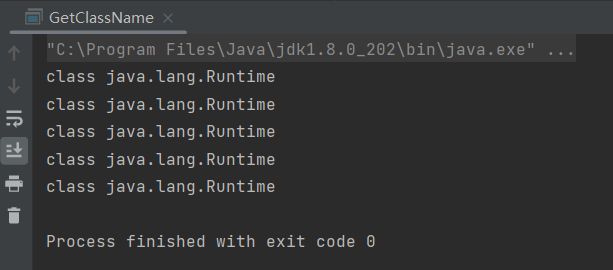
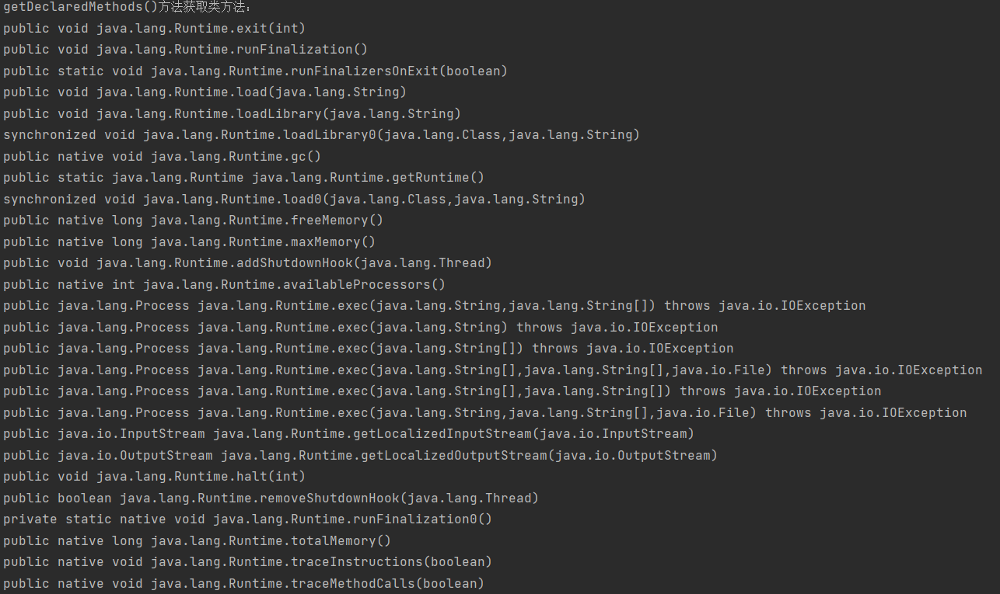
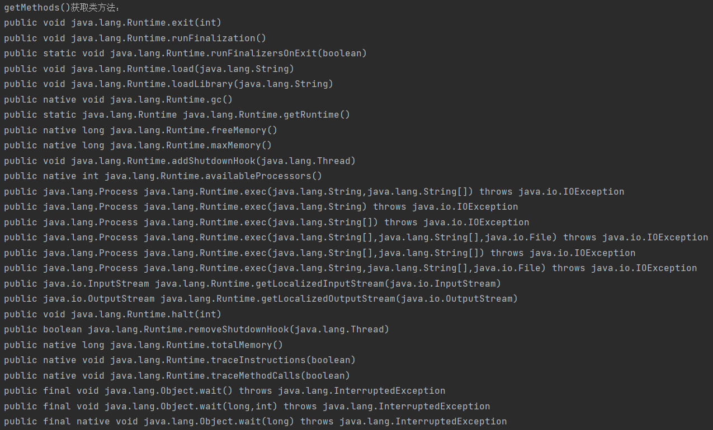
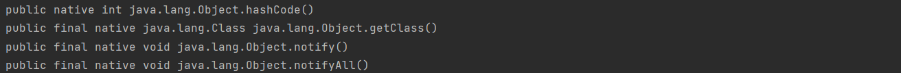
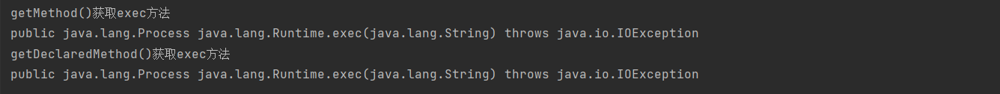
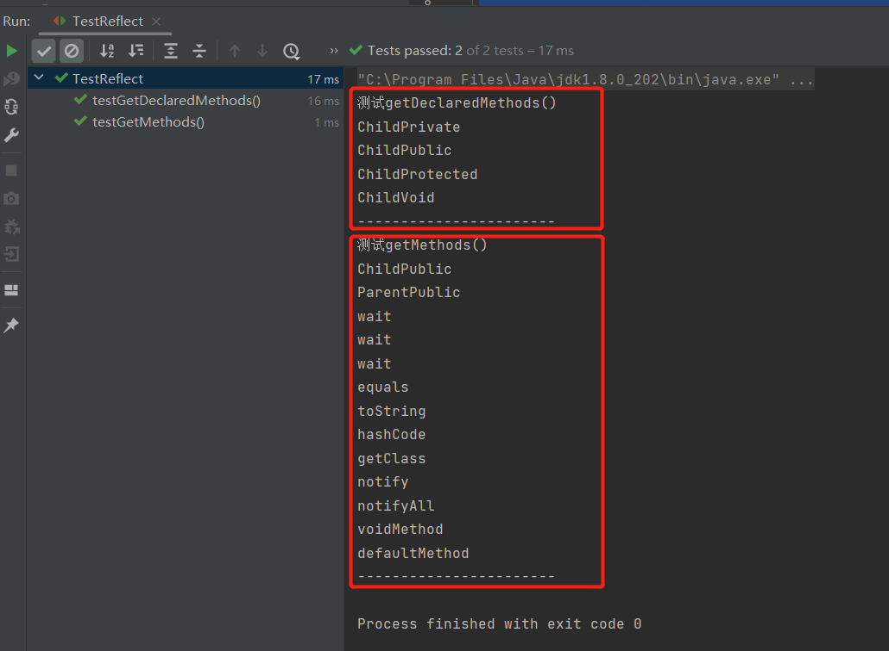
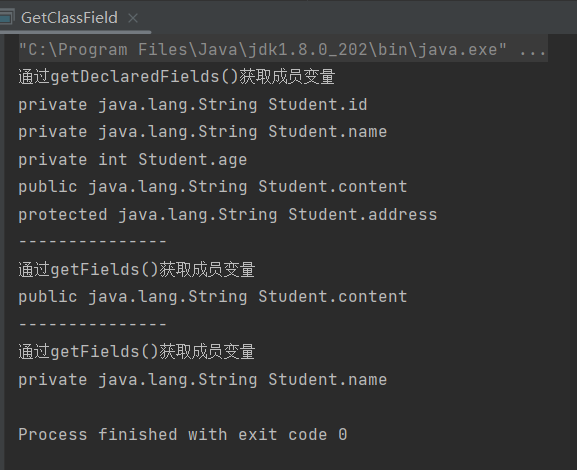

# 5-Java代码审计基础-反射

> Java-Reflection（JAVA反射）是在运行状态中，对于任意一个类，都能够知道这个类的所有属性和方法；对于任意一个对象，都能够通过Java-Reflection来调用它的任意方法和属性（不管是公共的还是私有的），这种动态获取信息以及动态调用对象方法的行为被称为java的反射机制。


> Java反射机制是Java动态性中最为重要的体现，利用反射机制我们可以轻松的实现Java类的动态调用。Java的大部分框架都是采用了反射机制来实现的(如:`Spring MVC`、`ORM框架`等)，Java反射在编写漏洞利用代码、代码审计、绕过RASP方法限制等中起到了至关重要的作用。


> 反射的用途很广泛。在开发过程中使用Eclipse、IDEA等开发工具时，当我们输入一个对象或类并想调用它的属性或方法时，编译器会自动列出它的属性或方法，这是通过反射实现的；再如，JavaBean和JSP之间的调用也是通过反射实现的。反射最重要的用途是开发各种通用框架，如上文中提到的Spring框架以及ORM框架，都是通过反射机制来实现的。


## 1、反射获取类对象

获取类对象的方式有如下四种：

1. `Class.forName`

   如果要使用`Class`类中的方法获取类对象，就需要使用`forName() `方法，只要有类名称即可，使用更为方便，扩展性更强。例如在配置JDBC的时候，经常采用这种方法。

2. `类名.class `直接获取

   任何数据类型都具备静态的属性，因此可以使用`.class`直接获取其对应的Class对象。这种方法相对简单，但要用到类中的静态成员

3. `类名.getClass `

   可以通过 `Object `类中的 `getClass() `方法来获取字节码对象，不过这种方法较为烦琐，必须要明确具体的类，然后创建对象。

4. `classLoader.loadClass("完整类名");  ` 

   其中`classloader`需要继承了`ClassLoader`的类实例化。`loadClass() `方法与` forName() `方法类似，只要有类名称即可，区别在于`forName()`的静态方法 JVM 会装载类，并且执行` static() `中的代码；而`loadClass() `不会执行`static()`中的代码。

以上四种方法的具体实现代码如下：

**ps** 继承`ClassLoder`是为了第四种方法的name5，其余方法不需要继承

```java
/**
 * @author : echo0d
 * @date : 2023/7/29 17:50
 * @Description: 获取类对象
 */


public class GetClassName extends ClassLoader{

    public static void main(String[] args)  throws ClassNotFoundException {
//        1: forname()
        Class name1 = Class.forName("java.lang.Runtime");
        System.out.println(name1);
//        2: .class
        Class name2 = Runtime.class;
        System.out.println(name2);
//        3: getClass()
        Runtime rt = Runtime.getRuntime();
        Class name3 = rt.getClass();
        System.out.println(name3);
//        4: loadClass()
        Class name4 = ClassLoader.getSystemClassLoader().loadClass("java.lang.Runtime");
        System.out.println(name4);
        GetClassName TestClassLoader = new GetClassName();
        Class name5 = TestClassLoader.loadClass("java.lang.Runtime");
        System.out.println(name5);
        
    }
}

```

执行结果如下：




## 2、反射获取类方法

反射获取类方法的方式：

1. `getDeclaredMethods()`方法

   `getDeclaredMethods() `方法返回类自身或接口自身声明的所有方法，包括public、protected、private和默认方法，但**不包括继承的方法**。

2. `getMethods()`方法

   `getMethods()`方法返回某个类的所有public方法，**包括其继承类的public方法**。

3. `getMethod()`方法

   `getMethod() `方法只能返回一个特定的方法（如`Runtime` 类中的`exec()`方法），该方法的第一个参数为方法名称，后面的参数为方法的参数对应Class的对象。

4. `getDeclaredMethod()`方法。

   `getDeclaredMethod()`方法与`getMethod()`类似，也只能返回一个特定的方法，参数同上。

具体代码如下：

```java
/**
 * @author : echo0d
 * @date : 2023/7/29 18:55
 * @Description : 获取类方法
 */

import java.lang.reflect.Method;

public class GetClassMethod {
    public static void main(String[] args) throws ClassNotFoundException, NoSuchMethodException {
        Class name = Class.forName("java.lang.Runtime");
//        1. getDeclaredMethods()
        Method[] declaredMethods = name.getDeclaredMethods();
        System.out.println("getDeclaredMethods()方法获取类方法：");
        for (Method m:declaredMethods)
            System.out.println(m);
//        2. getMethods()
        Method[] methods = name.getMethods();
        System.out.println("getMethods()获取类方法：");
        for (Method m:methods)
            System.out.println(m);
//        3. getMethod()
        Method method = name.getMethod("exec", String.class);
        System.out.println("getMethod()获取exec方法");
        System.out.println(method);
//        4. getDeclaredMethod
        Method declaredMethod = name.getDeclaredMethod("exec",String.class);
        System.out.println("getDeclaredMethod()获取exec方法");
        System.out.println(declaredMethod);
    }

}

```

执行结果：

`getDeclaredMethods()`方法



`getMethods()`方法





`getDeclaredMethod()`方法与`getMethod()`




**下面对`getMethods()`与`getDeclaredMethods()`的区别进行代码验证**，首先明确二者区别：

`getMethods()`：获取当前类或父类或父接口的 public 修饰的字段（JDK1.8中还包含接口中 default 修饰的方法，因为在JDK1.8环境下，接口中使用 default 修饰的方法，在编译后会变成 public 修饰的，可用反编译进行验证。）

`getDeclaredMethods()`： 获取当前类的所有方法(包括 protected/默认/private 修饰的方法；不包括父类 、接口 public 修饰的方法)

**1、创建接口和类**

创建一个ReflectInterface接口，里面有3个方法：

```java
public interface ReflectInterface {
    
	default void defaultMethod() {}
	static void staticMethod() {}
	void voidMethod();
 }
```

创建一个Parent类，有四种Java权限修饰的方法（以 p**11 格式）：

```java
public class Parent {
	public void ParentPublic() {
	}
	protected void ParentProtected() {
	}
	void ParentVoid() {
	}
	private void ParentPrivate() {
	}
}
```

创建一个Child类，实现ReflectInterface接口，继承Parent 类， 同时有四种Java权限修饰的方法（以 c**22 格式）：

```java
public abstract class Child extends Parent implements ReflectInterface {
	public void ChildPublic() {
	}
	protected void ChildProtected() {
	}
	void ChildVoid() {
	}
	private void ChildPrivate() {
	}
}
```

**2、测试类**

```java
/**
 * @author : echo0d
 * @date : 2023/7/30 10:30
 * @Description : 
 */

import org.junit.jupiter.api.Test;

import java.lang.reflect.Method;
public class TestReflect {
    @Test
    public void testGetMethods(){
        Class<Child> childClass = Child.class;
        Method[] methods = childClass.getMethods();
        System.out.println("测试getMethods()");
        for (Method m:methods) {
            System.out.println(m.getName());
        }
        System.out.println("-----------------------");
    }
    @Test
    public void testGetDeclaredMethods(){
        Class<Child> childClass = Child.class;
        Method[] methods = childClass.getDeclaredMethods();
        System.out.println("测试getDeclaredMethods()");
        for (Method m:methods) {
            System.out.println(m.getName());
        }
        System.out.println("-----------------------");
    }


}

```

输出结果如下：




`getMethods()`方法输出结果：共有13个。

- 第1个为当前类 public方法
- 第2个为`Parent`类即父类的public方法
- 第3至11 共9个方法为 `Object`类的public方法
- 第12至13个为`ReflectInterface`接口的pubilc和default方法

`getDeclaredMethods()`方法输出结果：当前类的全部方法，


## 3、反射获取类成员变量

反射获取类成员变量的方式：

1. `getDeclaredFields()`方法

   `getDeclaredFields()`方法能够获得类的成员变量数组，包括`public`、`private`和`proteced`，但是不包括父类的申明字段。

2. `getFields()`方法

   `getFields()`能够获得某个类的所有的`public`字段，包括父类中的字段。

3. `getDeclaredField()`方法

   该方法与`getDeclaredFields`的区别是只能获得类的单个成员变量，这里我们仅想获得Student 类中的name 变量。

具体代码如下：

```java
import java.lang.reflect.Field;

/**
 * @author : echo0d
 * @date : 2023/8/1 21:30
 * @Description : 获取类成员变量
 */
public class GetClassField {
    public static void main(String[] args) throws NoSuchFieldException {
        Student student = new Student();
        Class name = student.getClass();
        
        // 实例化类对象后开始获取类成员变量
        Field[] declaredFields = name.getDeclaredFields();
        System.out.println("通过getDeclaredFields()获取成员变量");
        for(Field m:declaredFields)
            System.out.println(m);
        System.out.println("---------------");
        Field[] fields = name.getFields();
        System.out.println("通过getFields()获取成员变量");
        for(Field m:fields)
            System.out.println(m);
        System.out.println("---------------");
        Field declaredField = name.getDeclaredField("name");
        System.out.println("通过getFields()获取成员变量");
        System.out.println(declaredField);
    }
}

```

运行结果如下：




## 4、不安全的反射

如前所述，利用Java的反射机制，我们可以无视类方法、变量访问权限修饰符，调用任何类的任意方法、访问并修改成员变量值，但是这样做可能导致安全问题。如果一个攻击者能够通过应用程序创建意外的控制流路径，就有可能绕过安全检查发起相关攻击。

假设有一段代码如下：

```java
String name = request.getParameter("name");
 Command command = null;
   if (name.equals("Delect")) {
       command = new DelectCommand();
   } else if (ctl.equals("Add")) {
   command = new AddCommand();
    } else {
       ...
   }
 command.doAction(request);
```

其中存在一个字段`name`，当获取用户请求的`name`字段后进行判断时，如果请求的是 `Delect` 操作，则执行`DelectCommand `函数；如果执行的是 `Add` 操作，则执行 `AddCommand` 函数；如果不是这两种操作，则执行其他代码。假如有开发者看到了这段代码，他认为可以使用Java 的反射来重构此代码以减少代码行，如下所示。

```java
String name = request.getParameter("name");
Class ComandClass = Class.forName(name + "Command");
Command command = (Command) CommandClass.newInstance();
command.doAction(request);
```

这样的重构看起来使代码行减少，消除了`if/else`块，而且可以在不修改命令分派器的情况下添加新的命令类型，但是如果没有对传入的`name`字段进行限制，就会实例化实现`Command`接口的任何对象，从而导致安全问题。

实际上，攻击者甚至不局限于本例中的`Command`接口对象，而是使用任何其他对象来实现，如调用系统中任何对象的默认构造函数，或者调用`Runtime`对象去执行系统命令，这可能导致远程命令执行出现漏洞，因此不安全的反射的危害性极大。

