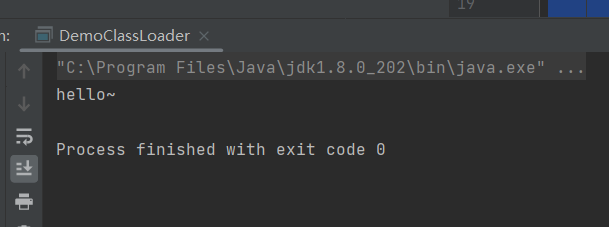
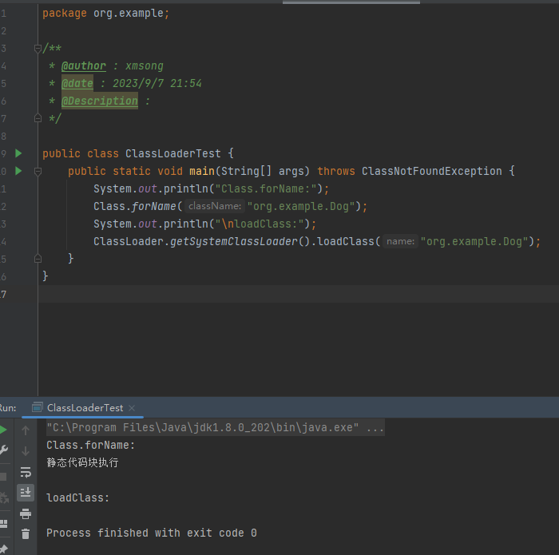
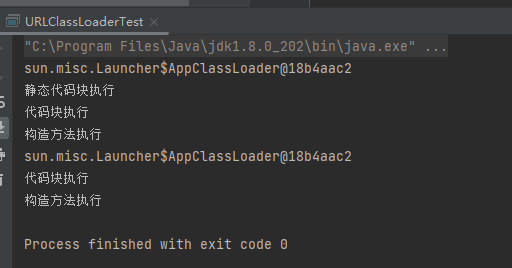

# 6-ClassLoader类加载机制

Java程序是由class文件组成的一个完整的应用程序。在程序运行时，并不会一次性加载所有的class文件进入内存，而是通过Java的类加载机制`ClassLoader`进行动态加载，从而转换成`java.lang.Class `类的一个实例。

## 1、ClassLoader类

`ClassLoader`是一个抽象类，主要的功能是通过指定的类的名称，找到或生成对应的字节码，返回一个`java.lang.Class `类的实例。开发者可以继承`ClassLoader`类来实现自定义的类加载器。`ClassLoader`类中加载类相关的方法如表所示。

| 方法                                                 | 说明                                                         |
| ---------------------------------------------------- | ------------------------------------------------------------ |
| getParent()                                          | 返回该类加载器的父类加载器                                   |
| loadClass(String name)                               | 加载名称为name的类，返回结果是`java.lang.Class `类实例       |
| findClass(String name)                               | 查找名称为name的类，返回结果是`java.lang.Class `类实例       |
| findLoadedClass(String name)                         | 查找名称为name的已经被加载过的类，返回结果是`java.lang.Class `类实例 |
| defineClass(String name, byte[] b, int off, int len) | 把字节数组b中的内容转换成Java类，返回结果是`java.lang.Class `类实例，该方法声明为final |
| resolveClass(Class<?> c)                             | 链接指定的Java类                                             |

## 2、loadClass()方法的流程

前面曾介绍过`loadClass()`方法可以加载类并返回一个`java.lang.Class`类对象。该方法的代码如下所示：

```java
protected Class<?> loadClass(String name, boolean resolve)
        throws ClassNotFoundException
    {
        synchronized (getClassLoadingLock(name)) {
            Class<?> c = findLoadedClass(name);
            if (c == null) {
                long t0 = System.nanoTime();
                try {
                    if (parent != null) {
                        c = parent.loadClass(name, false);
                    } else {
                        c = findBootstrapClassOrNull(name);
                    }
                } catch (ClassNotFoundException e) {
                    //省略
                }
                if (c == null) {
                    //省略
                    c = findClass(name);
                    //省略
                }
            }
            if (resolve) {
                resolveClass(c);
            }
            return c;
        }
    }
```

当`loadClass()`方法被调用时，会首先使用`findLoadedClass()`方法判断该类是否已经被加载，如果未被加载，则优先使用加载器的父类加载器进行加载。当不存在父类加载器，无法对该类进行加载时，则会调用自身的`findClass()`方法，因此可以重写`findClass()`方法来完成一些类加载的特殊要求。


## 3、自定义的类加载器

根据`loadClass()`方法的流程，可以发现通过重写`findClass()`方法，利用`defineClass()`方法来将字节码转换成`java.lang.class`类对象，就可以实现自定义的类加载器。示例代码如下:

```java
package org.example;

/**
 * @author : echo0d
 * @date : 2023/8/31 22:22
 * @Description :
 */
public class Hello {

    public void sayHello() {
        System.out.println("hello~");
    }
}

```

```java
package org.example;

import java.lang.reflect.Constructor;
import java.lang.reflect.InvocationTargetException;
import java.lang.reflect.Method;

/**
 * @author : echo0d
 * @date : 2023/8/31 22:20
 * @Description :
 */
public class DemoClassLoader extends ClassLoader {
    private byte[] bytes ;
    private String name = "";
    public static void main(String[] args) throws Exception {
        String clzzName = "org.example.Hello";
        byte[] testBytes = new byte[]{
                -54, -2, -70, -66, 0, 0, 0, 52, 0, 28, 10, 0, 6, 0, 14, 9, 0, 15, 0, 16, 8, 0, 17, 10, 0, 18, 0, 19, 7,
                0, 20, 7, 0, 21, 1, 0, 6, 60, 105, 110, 105, 116, 62, 1, 0,3, 40,
                //省略
        };
        DemoClassLoader demo =  new DemoClassLoader(clzzName,testBytes);
        Class clazz = demo.loadClass(clzzName);
        Constructor constructor = clazz.getConstructor();
        Object obj = constructor.newInstance();
        Method method = clazz.getMethod("sayHello");
        method.invoke(obj);
    }
    public DemoClassLoader(String name, byte[] bytes){
        this.name = name;
        this.bytes = bytes;
    }
    @Override
    protected Class<?> findClass(String name) throws ClassNotFoundException {
        if(name.equals(this.name)) {
            defineClass(name, bytes, 0, bytes.length);
        }
        return super.findClass(name);
    }
}

```

运行结果如下



## 4、loadClass()与Class.forName()的区别

`loadClass()`方法只对类进行加载，不会对类进行初始化。`Class.forName`会默认对类进行初始化。当对类进行初始化时，静态的代码块就会得到执行，而代码块和构造函数则需要适合的类实例化才能得到执行，示例代码如下所示。

有一个Dog类

```java
package org.example;

public class Dog {
    static {
        System.out.println("静态代码块执行");
    }

    {
        System.out.println("代码块执行");
    }

    public Dog() {
        System.out.println("构造方法执行");
    }
}

```

用两种方式加载类：

```java
package org.example;

public class ClassLoaderTest {
    public static void main(String[] args) throws ClassNotFoundException {
        System.out.println("Class.forName:");
        Class.forName("org.example.Dog");
        System.out.println("\nloadClass:");
        ClassLoader.getSystemClassLoader().loadClass("org.example.Dog");
    }
}

```

结果如图， `Class.forName`会执行静态的代码块。



## 5、URLClassLoader

`URLClassLoader`类是`ClassLoader`的一个实现，拥有从远程服务器上加载类的能力。通过`URLClassLoader`可以实现对一些WebShell的远程加载、对某个漏洞的深入利用。`ClassLoader`只能加载`classpath`下面的类，而`URLClassLoader`可以加载任意路径下的类。

他们的继承关系如下：

```java
public class URLClassLoader extends SecureClassLoader {}
public class SecureClassLoader extends ClassLoader {}
```

`URLClassLoader`是在`java.net`包下的一个类。一般动态加载类都是直接用`Class.forName()`这个方法，但这个方法只能创建程序中已经引用的类，并且只能用包名的方法进行索引，比如Java.lang.String，不能对一个.class文件或者一个不在程序引用里的.jar包中的类进行创建。
URLClassLoader提供了这个功能，它让我们可以通过以下几种方式进行加载：

文件: (从文件系统目录加载)
jar包: (从Jar包进行加载)
Http: (从远程的Http服务进行加载)

```java
package org.example;

/**
 * @author : echo0d
 * @date : 2023/9/7 22:39
 * @Description :
 */
import java.io.File;
import java.net.URI;
import java.net.URL;
import java.net.URLClassLoader;


public class URLClassLoaderTest {
    public static void main(String[] args) throws Exception {
//        案例1：加载磁盘上的类
        File file = new File("d:/");
        URI uri = file.toURI();
        URL url1 = uri.toURL();
        URLClassLoader urlClassLoader1 = new URLClassLoader(new URL[]{url1});
        System.out.println(urlClassLoader1.getParent());
        Class loadClassDog1 = urlClassLoader1.loadClass("org.example.Dog");
        loadClassDog1.newInstance();
        
//        案例2：加载网络上的类
        URL url2 = new URL("http://localhost:8080/examples/");
        URLClassLoader urlClassLoader2 = new URLClassLoader(new URL[]{url2});
        System.out.println(urlClassLoader2.getParent());
        Class loadClassDog2 = urlClassLoader2.loadClass("org.example.Dog");
        loadClassDog2.newInstance();
    }
}
```

结果如下


