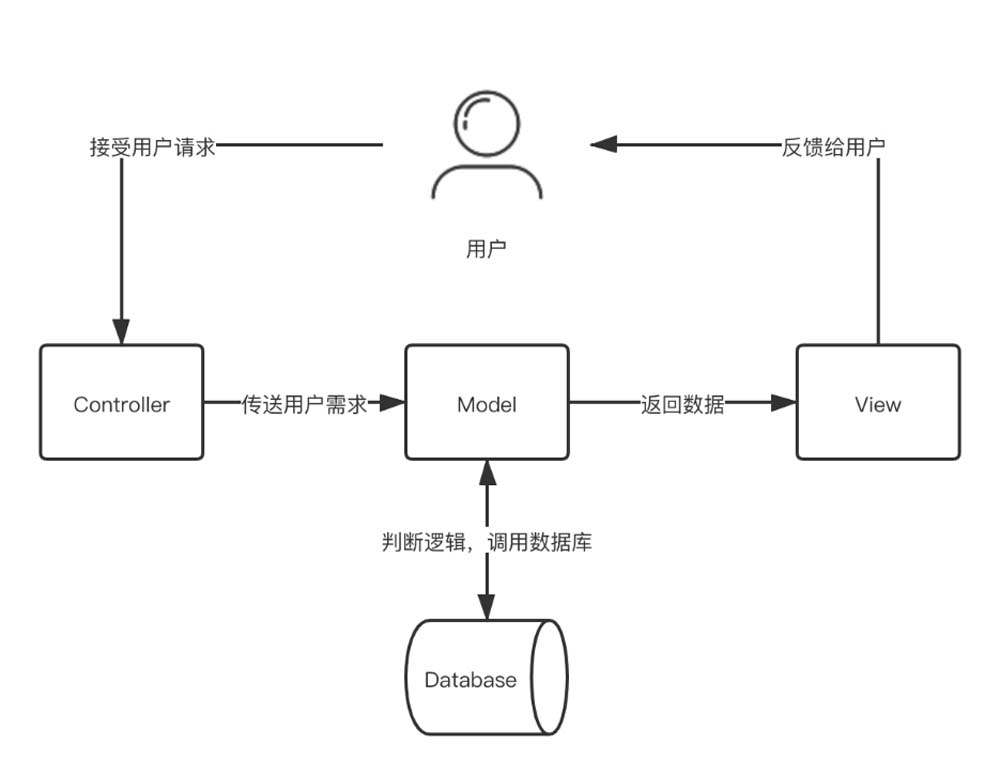

# 2-JavaMVC

>**Java MVC的框架**有很多，如比较经典的Struts1框架、Struts2 框架、Spring MVC框架，此外还有小众的JSF框架以及Tapestry 框架。

## 1、MVC的概念

MVC 全名是 Model View Controller，M（Model）是指数据模型，V（View）是指用户界面，C（Controller）是控制器。使用 MVC 最直接的目的就是将M和V实现代码分离，C 则是确保 M 和 V 的同步，一旦 M 改变，V就应该同步更新。简单来说，MVC是一个设计模式，它强制性地使应用程序的输入、处理和输出分开。

MVC应用程序被分成3个核心部件：**Model**、**View**、**Controller**。它们独立处理各自的任务。具体如下：

1. 模型（Model）：表示携带数据的对象或Java POJO。即使模型内的数据改变，它也具有逻辑来更新控制器。
2. 控制器（Controller）：表示逻辑控制，控制器对模型和视图都有作用，控制数据流进入模型对象，并在数据更改时更新视图，是视图和模型的中间层。
3. 视图（View）：表示模型包含的数据的可视化层。

## 2、MVC工作流程

首先，Controller层接收用户的请求，并决定应该调用哪个Model来进行处理；

然后，由Model使用逻辑处理用户的请求并返回数据；

最后，返回的数据通过View层呈现给用户。具体流程如图所示。

MVC模式使视图层和业务层分离，以便更改View层代码时，不用重新编译Model和Controller代码。同样，当某个应用的业务流程或者业务规则发生改变时，只需要改动Model层即可实现需求。

