# Java代码审计-Servlet

Servlet其实是在 Java Web容器中运行的小程序。用户通常使用 Servlet 来处理一些较为复杂的服务器端的业务逻辑。

Servlet原则上可以通过任何客户端-服务器协议进行通信，但是它们常与HTTP一起使用，因此，“Servlet”通常用作“HTTP servlet”的简写。

Servlet 是 Java EE的核心，也是所有MVC框架实现的根本。

## 1、Servlet的配置

HTTPServlet使用一个 HTML 表单来发送和接收数据。要创建一个 HTTPServlet，需要继承`javax.servlet.http.HttpServlet`类并重写`doXXX`(如`doGet、doPost`)方法或者`service`方法，该类是用专门的方法来处理 HTML表单的 GenericServlet 的一个子类。

Servlet 3.0之前的版本都是在web.xml中配置的，而Servlet 3.0之后的版本则使用更为便捷的注解方式来配置。

不同版本的Servlet所需的Java/JDK版本也不相同。

| Servlet版本 | Java版本         | Tomcat版本   |
| ----------- | ---------------- | ------------ |
| Servlet 2.0 | Java 1.1         |              |
| Servlet 2.1 | 未指定           |              |
| Servlet 2.2 | Java 1.1         | Tomcat 3.3.X |
| Servlet 2.3 | Java 1.3         | Tomcat 4.1.X |
| Servlet 2.4 | Java 1.4         | Tomcat 5.5.X |
| Servlet 2.5 | Java 5 / JDK 1.5 | Tomcat 6.0.X |
| Servlet 3.0 | Java 6 / JDK 1.6 | Tomcat 7.0.X |
| Servlet 3.1 | Java 7 / JDK 1.7 | Tomcat 8.5.X |
| Servlet 4.0 | Java 8 / JDK 1.8 | Tomcat 9.0.X |

### 1.1 基于web.xml

> 在 web.xml 中，Servlet的配置在 Servlet 标签中，Servlet标签是由Servlet和Servlet-mapping标签组成，两者通过在Servlet和Servlet-mapping标签中相同的 Servlet-name名称实现关联：
>
> `<servlet>`：声明 Servlet 配置入口。
>
> `<description>`：声明Servlet描述信息。
>
> `<display-name>`：定义Web应用的名字。
>
> `<servlet-name>`：声明Servlet名称以便在后面的映射时使用。
>
> `<servlet-class>`：指定当前servlet对应的类的路径。
>
> `<servlet-mapping>`：注册组件访问配置的路径入口。
>
> `<servlet-name>`：指定上文配置的Servlet的名称。
>
> `<url-pattern>`：指定配置这个组件的访问路径。


**1. 首先新建一个Java项目并引入依赖包**

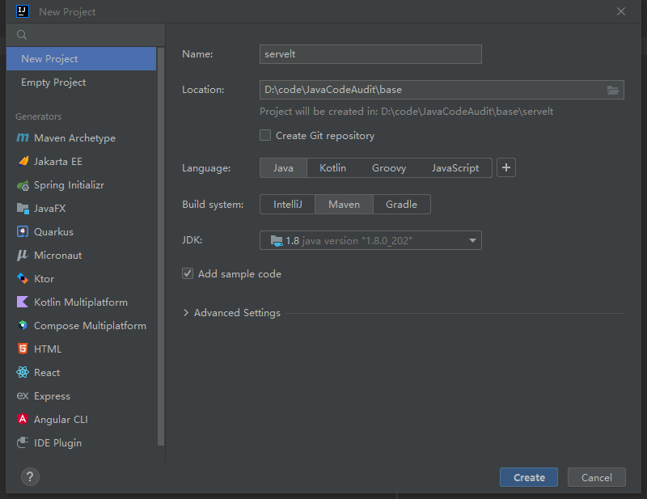

为这个项目添加Web框架支持，右键单击创建的项目，点击Add Framework Support，在弹出的对话框中勾选Web Application(4.0)及Create web.xml复选框，单击“OK”按钮，完成添加。

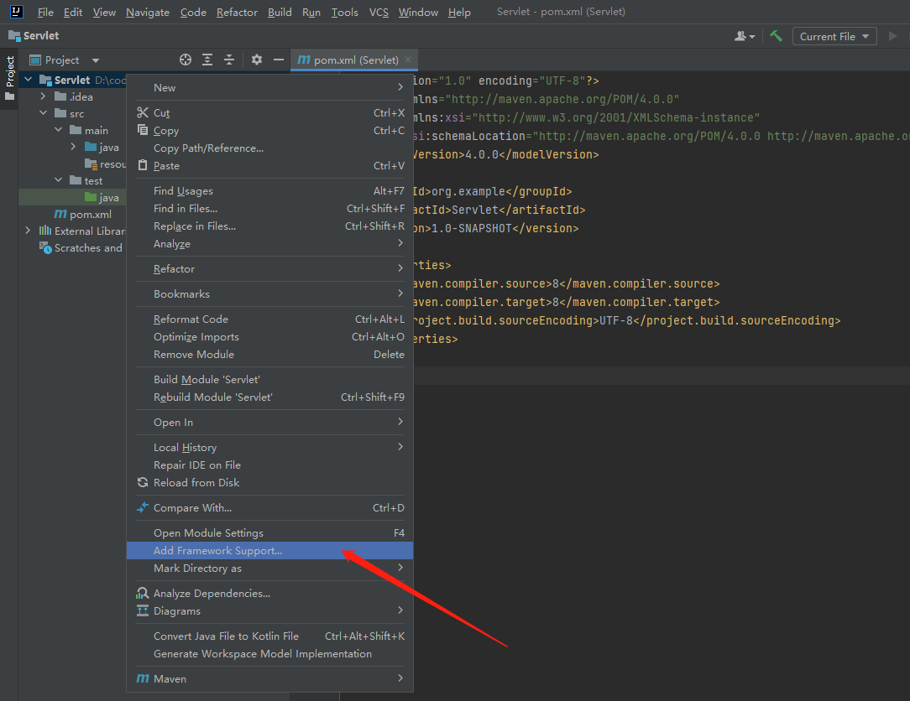

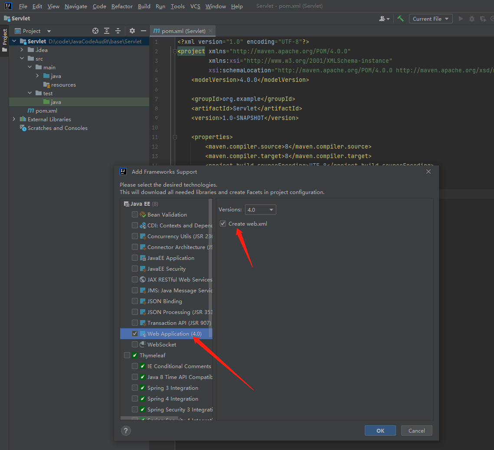

然后添加依赖包，可以添加Maven依赖，如下

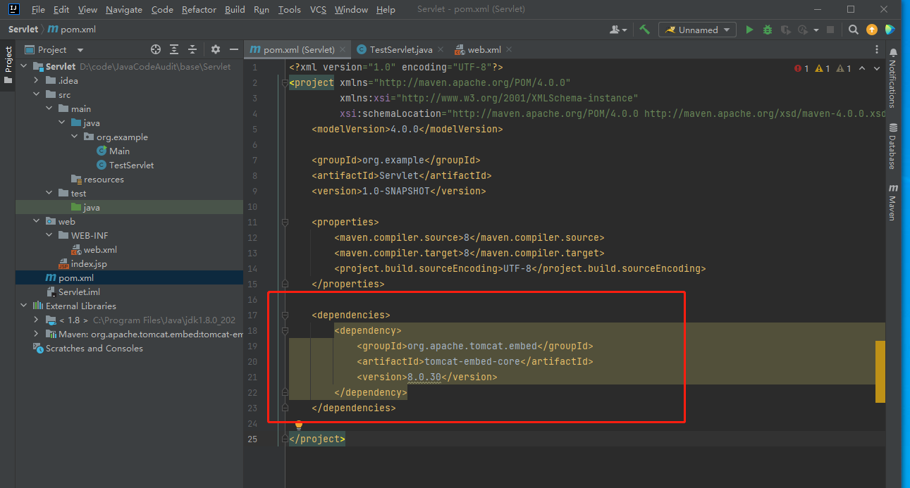

也可以右键单击WEB-INF文件夹，在弹出的对话框中选择New–>Directory命令，创建lib文件夹。将Tomcat安装目录下lib文件夹中的servlet-api.jar文件复制，然后右键项目内的lib文件夹，点击粘贴添加进去。

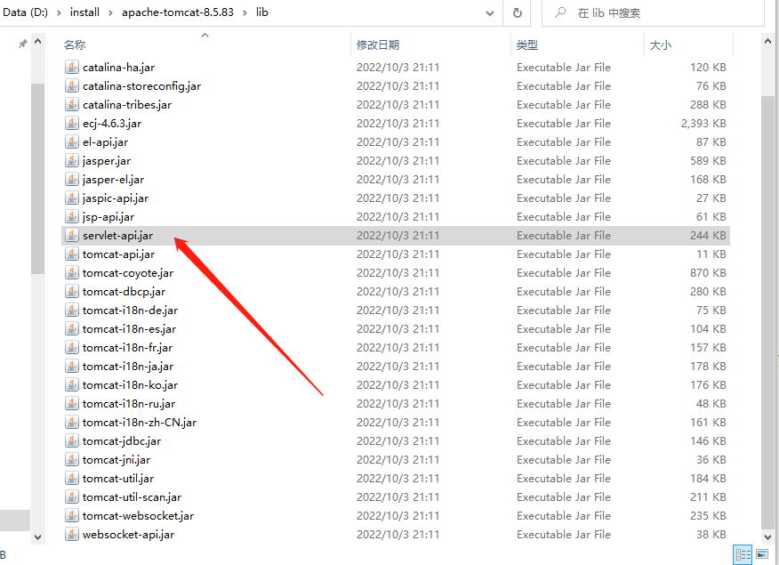

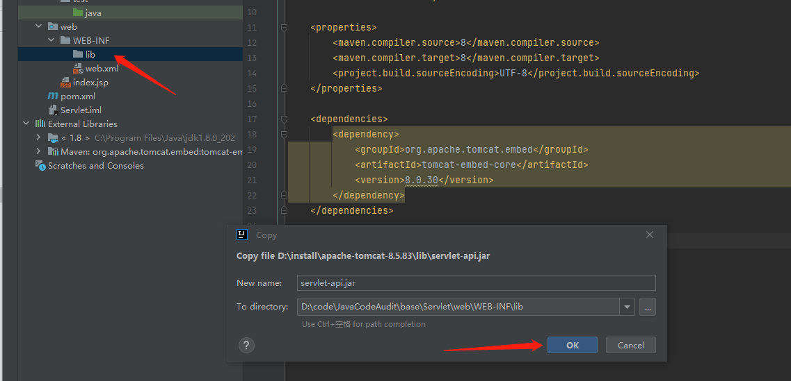

然后在servlet-api.jar文件上右击鼠标，选择Add As Library，将jar包添加到Library中

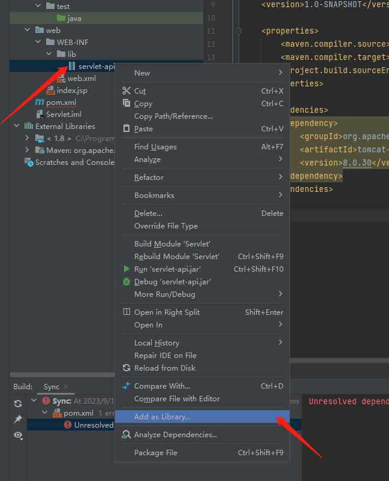

**2. 编写Servlet类**

在src文件夹下新建包和UserServlet类，继承`HttpServlet`类（一般处理http请求都直接继承`HttpServlet`类，它继承了`GenericServlet`类，`GenericServlet`类实现了`Servlet`等接口并重写了接口中的个方法）

```java
package com.sec.servlet;

/**
 * @author : echo0d
 * @date : 2023/9/17 14:29
 * @Description :
 */
import javax.servlet.*;
import javax.servlet.annotation.WebServlet;
import javax.servlet.http.HttpServlet;
import javax.servlet.http.HttpServletRequest;
import javax.servlet.http.HttpServletResponse;
import java.io.IOException;

public class UserServlet extends HttpServlet {

    @Override
    protected void doGet(HttpServletRequest req, HttpServletResponse resp) throws ServletException, IOException {
        resp.getWriter().write("Hello,Servlet");
    }

    @Override
    protected void doPost(HttpServletRequest req, HttpServletResponse resp) throws ServletException, IOException {
        doPost(req, resp);
    }
}

```

**3. 编写web.xml配置文件**

修改WEB-INF文件下下的web.xml，两个`<servlet-name>`注意填写要完全一致，`<servlet-class>`处填写全类名，`<url-pattern>`是路径映射

```xml
<?xml version="1.0" encoding="UTF-8"?>
<web-app xmlns="http://xmlns.jcp.org/xml/ns/javaee"
         xmlns:xsi="http://www.w3.org/2001/XMLSchema-instance"
         xsi:schemaLocation="http://xmlns.jcp.org/xml/ns/javaee http://xmlns.jcp.org/xml/ns/javaee/web-app_4_0.xsd"
         version="4.0">
    <servlet>
        <servlet-name>user</servlet-name>
        <servlet-class>com.sec.servlet.UserServlet</servlet-class>
    </servlet>

    <servlet-mapping>
        <servlet-name>user</servlet-name>
        <url-pattern>/user</url-pattern>
    </servlet-mapping>

</web-app>
```

**4. IDEA集成Tomcat运行该项目**

如下图选择编辑配置

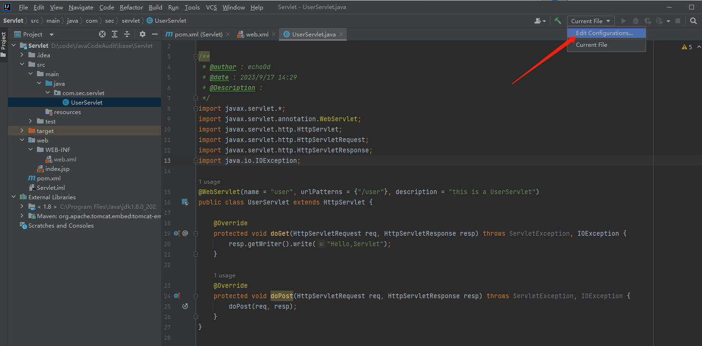

点击左侧加号，选择Smart Tomcat，点击OK

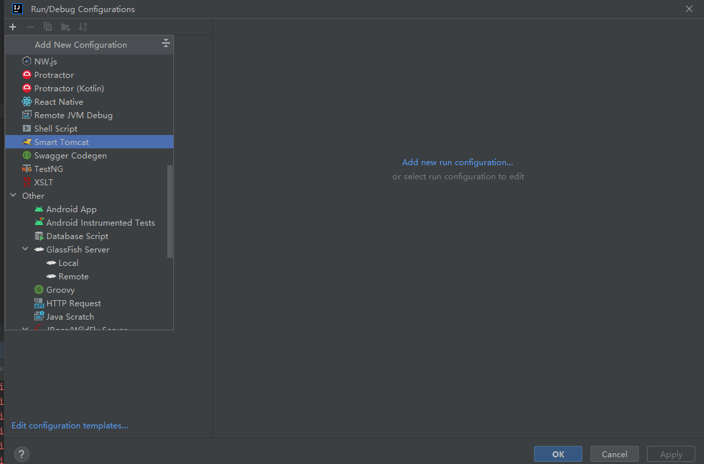

然后在Tomcat server处选择安装好的Tomcat目录，Deployment directory处选择该项目的web目录。

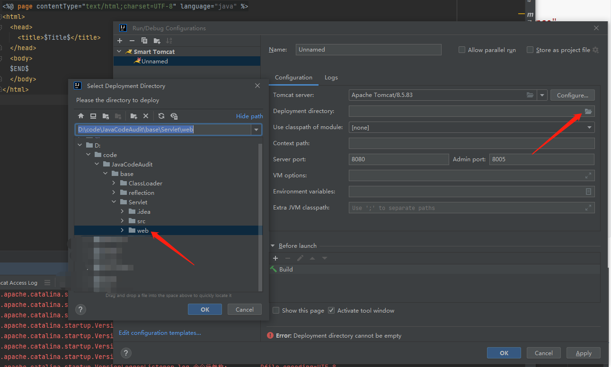

在Context path处填写网站的根目录：

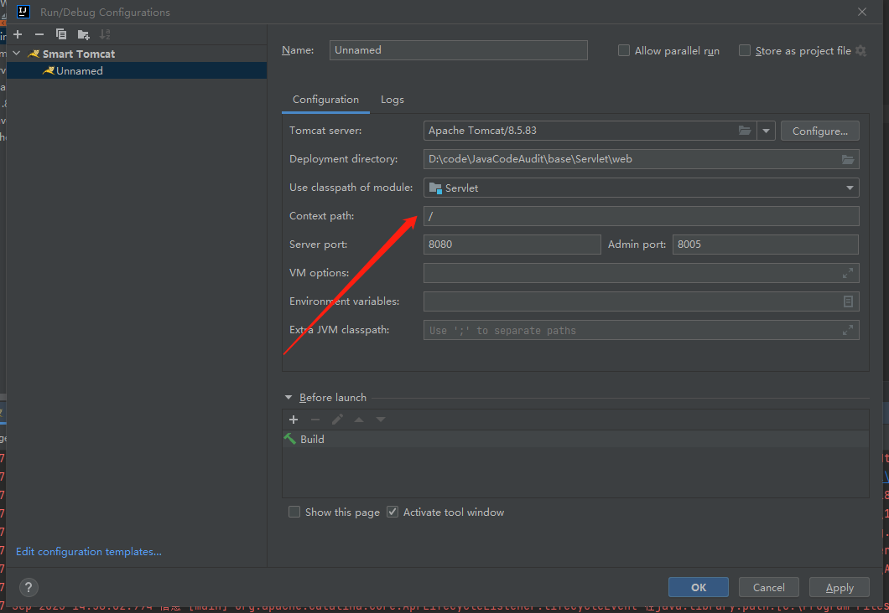

然后点击运行即可：

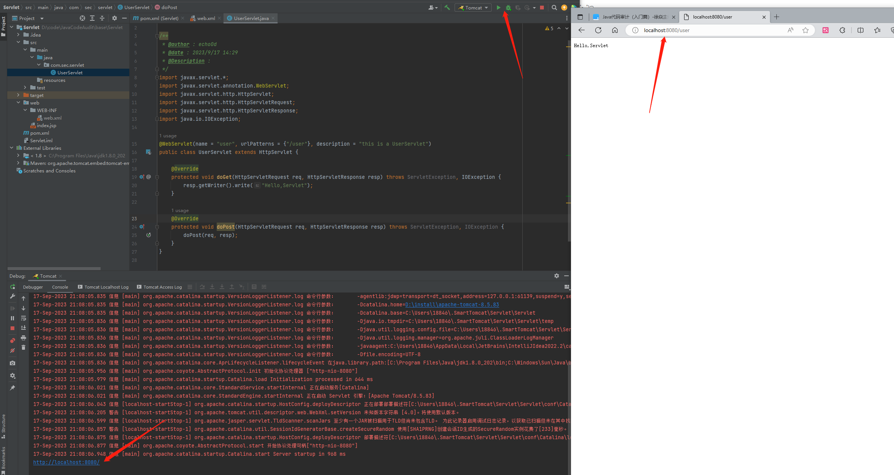


### 1.2 基于注解方式

Servlet 3.0以上的版本中，开发者无须在web.xml里面配置 Servlet，只需要添加@WebServlet 注解即可修改 Servlet 的属性,

上面的例子中，若把web.xml文件删除，用注解的方式修改如下，只需要添加一个@WebServlet注解即可。

```java
package com.sec.servlet;

/**
 * @author : echo0d
 * @date : 2023/9/17 14:29
 * @Description :
 */
import javax.servlet.*;
import javax.servlet.annotation.WebServlet;
import javax.servlet.http.HttpServlet;
import javax.servlet.http.HttpServletRequest;
import javax.servlet.http.HttpServletResponse;
import java.io.IOException;

@WebServlet(name = "user", urlPatterns = {"/user"}, description = "this is a UserServlet")
public class UserServlet extends HttpServlet {

    @Override
    protected void doGet(HttpServletRequest req, HttpServletResponse resp) throws ServletException, IOException {
        resp.getWriter().write("Hello,Servlet");
    }

    @Override
    protected void doPost(HttpServletRequest req, HttpServletResponse resp) throws ServletException, IOException {
        doPost(req, resp);
    }
}


```

@WebServlet的注解参数有description、name及urlPatterns，除此之外还有很多参数，具体如下：

| 属性名         | 类型           | 描述                                                         |
| -------------- | -------------- | ------------------------------------------------------------ |
| name           | String         | 指定Servlet的`name`属性,等价于`<servlet-name>`               |
| value          | String[]       | 等价于 `urPatterns`属性                                      |
| urlPatterns    | String[]       | 指定-组Serlet的URL匹配模式,等价于`<url-pattem>`标签          |
| loadOnStartup  | int            | 指定Servlet的加载顺序,等价于`<load-on-startup>`标签          |
| initParams     | WeblnitParam[] | 指定一组Servlet初始化参数,等价于`<init-param>`标签           |
| asyncSupported | boolean        | 声明Servlet是否支持异步操作模式,等价于`<async-supported>`标签 |
| description    | String[]       | Sevlet的描述信息,等价于`<description>`标签                   |
| displayName    | String[]       | Servlet的显示名,通常配合工具使用,等价于`<display-name>`标签  |

由此可以看出，web.xml可以配置的Servlet属性，都可以通过@WebServlet的方式进行配置。

## 2、Servlet的访问流程

在该 Servlet配置中，其访问流程如图：


首先在浏览器地址栏中输入user，即访问`<url-patterns> `标签中的值；然后浏览器发起请求，服务器通过`<servlet-mapping>`标签中找到文件名为user的`url-pattern`，通过其对应的`<servlet-name>`寻找servlet标签中`servlet-name`相同的servlet；再通过 servlet 标签中的`servlet-name`，获取 `servlet-class`参数；最后得到具体的class文件路径，继而执行`<servlet-class>`标签中class文件的逻辑。

`servlet`和`servlet-mapping`中都含有`<servlet-name> </servlet-name>`标签，其主要原因是通过`servlet-name`作为纽带，将`servlet-class `和 `url-pattern` 构成联系，从而使URL映射到`servlet-class `所指定的类中执行相应逻辑。

## 3、Servlet的接口方法

### 3.1 Servlet的接口方法简介

**1. init() **：在Servlet实例化后，Servlet容器会调用init()方法来初始化该对象，主要是使Servlet 对象在处理客户请求前可以完成一些初始化工作，例如建立数据库的连接，获取配置信息等。init() 方法在第一次创建Servlet 时被调用，在后续每次用户请求时不再被调用。init() 方法的定义如下。

```java
public void init() throws ServletException{
  // 此处内容为开发者定义的初始化代码
}
```

**2. service() 接口**：`service() `方法是执行实际任务的主要方法。Servlet容器（Web服务器）调用service()方法来处理来自客户端（浏览器）的请求，并将格式化的响应写回给客户端，每次服务器接收到一个Servlet请求时，服务器都会产生一个新的线程并调用服务。要注意的是，在service()方法被Servlet 容器调用之前，必须确保`init()`方法正确完成。`Service()`方法的定义如下:

```java
public void service(ServletRequest request, ServletResponse response) throws ServletException, IOException {
    // 此处内容为开发者处理用户请求的代码 
}
```

**3. doGet()/doPost()等接口**：`doGet() `等方法根据HTTP的不同请求调用不同的方法。如果HTTP 得到一个来自URL 的GET请求，就会调用 `doGet() 方法`；如果得到的是一个 POST 请求，就会调用`doPost() `方法。

```java
public void doGet(HttpServletRequest request,
               HttpServletResponse response)
   throws ServletException, IOException 
{
// 此处内容为开发者处理 GET 请求的代码
// 以此类推，若是 POST 请求，则调用 public void doPost方法
}
```

HTTP 有 8 种请求方法，分别为GET、POST、HEAD、OPTIONS、PUT、DELETE、TRACE 以及CONNECT方法。与此类似，Servlet接口中也对应着相应的请求接口（除了CONNECT），这些接口对应着请求类型，`service()`方法会检查 HTTP 请求类型，然后在适当的时候调用 `doGet`、`doPost`、`doPut`，`doDelete`等方法。

**4. destroy() 接口**：当Servlet容器检测到一个Servlet对象应该从服务中被移除时，会调用该对象的`destroy() `方法，以便Servlet对象释放它所使用的资源，保存数据到持久存储设备中。例如将内存中的数据保存到数据库中、关闭数据库连接、停止后台线程、把 Cookie 列表或单击计数器写入磁盘，并执行其他类似的清理活动等。`destroy() `方法与 `init() `方法相同，只会被调用一次。`destroy() `方法定义如下。

```java
public void destroy()
{
   // 此处内容为开发者进行终止操作的代码
}
```

**5. getServletConfig() 接口**：`getServletConfig() `方法返回Servlet容器调用`init()`方法时传递给`Servlet`对象的`ServletConfig`对象，`ServletConfig`对象包含Servlet的初始化参数。开发者可以在Servlet的配置文件`web.xml`中，使用`<init-param>`标签为Servlet配置一些初始化参数：

```xml
<servlet> 
    <servlet-name>servlet</servlet-name> 
    <servlet-class>org.test.TestServlet</servlet-class> 
    <init-param> 
          <param-name>userName</param-name> 
          <param-value>panda</param-value> 
    </init-param> 
    <init-param> 
          <param-name>E-mail</param-name> 
          <param-value>test@test.net</param-value> 
</init-param>
 </servlet>
```

经过上面的配置，即可在Servlet中通过调用`getServletConfig()`，并获得一些初始化的参数。

**6. getServletInfo() 接口**：`getServletInfo() `方法会返回一个 String 类型的字符串，包括关于 Servlet 的信息，如作者、版本及版权等。

### 3.2 使用IDEA创建Servlet

在创建Servlet文件时，IDEA提供了直接创建Servlet的功能

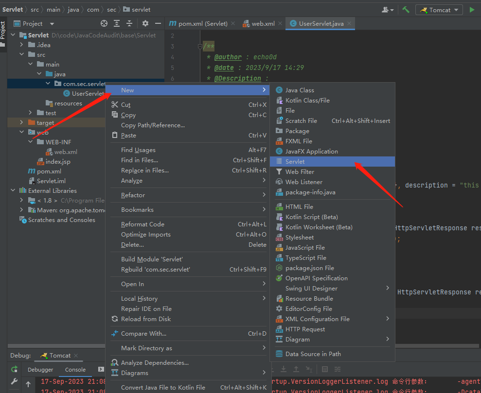

选择创建Servlet，然后填写好名字

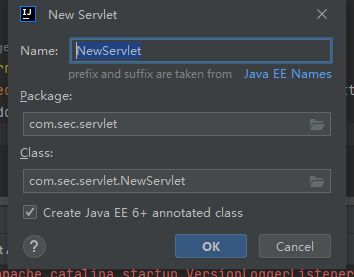

点击OK即可创建好，默认只重写了`doGet`和`doPost`方法，若想要重写其他请求的方法，可以在新创建出的Servlet代码处右键，选择`Generate`


选择`Override Methods`

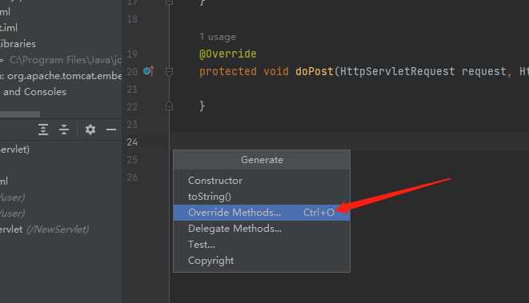

然后选中其他想要的方法，如下图：

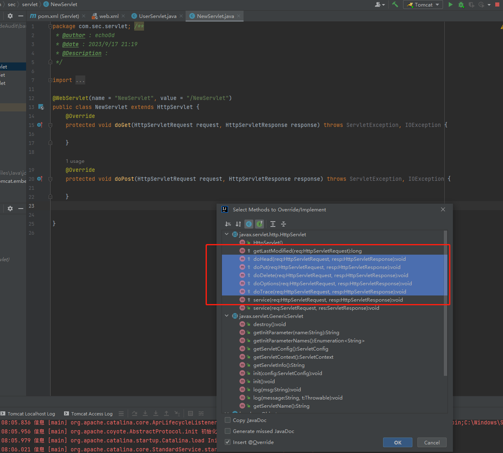

点击OK后结果如下：

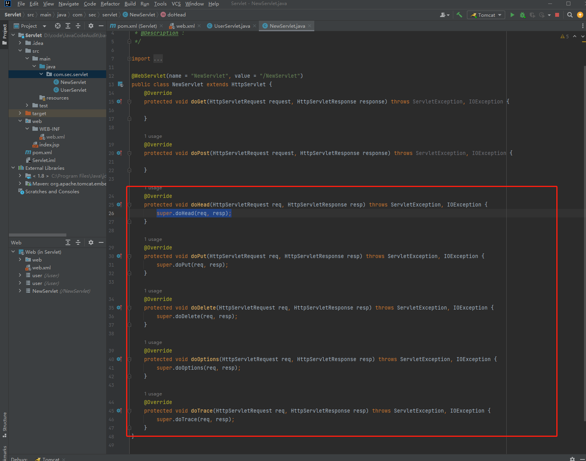

### 3.3 重写doXXX()与service()的区别

在继承了HTTPServlet类后我们在重写`service`方法后重写`doXXX`（如`doGet`）等方法时无法进入，原因是`HTTPServlet`的`service`方法做的请求方式的区分，如下：

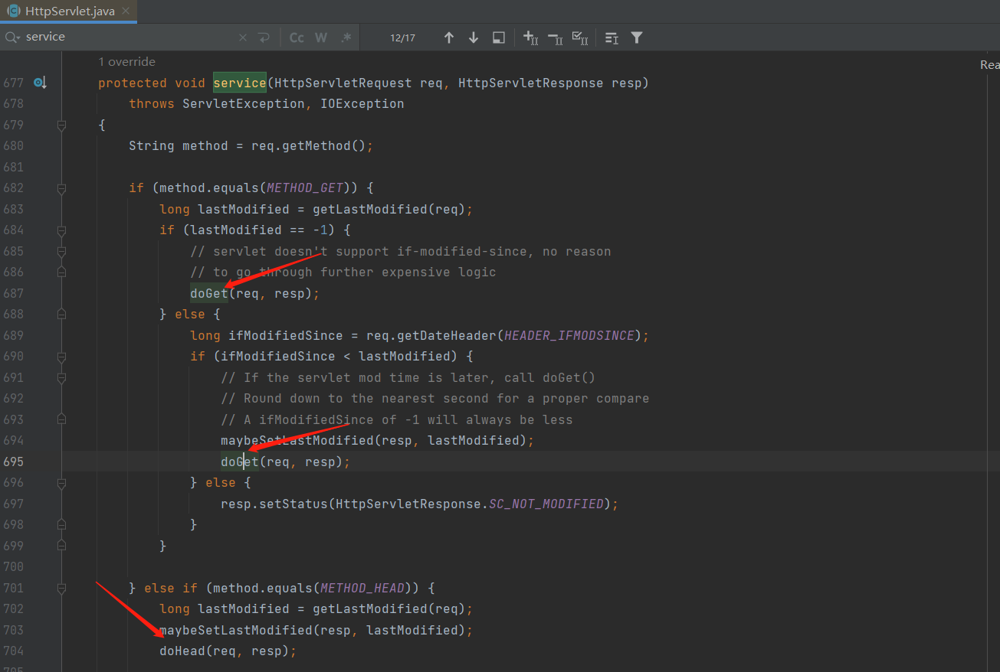

重写`doGet()`方法返回当前时间

```java
package com.sec.servlet;

/**
 * @author : echo0d
 * @date : 2023/9/17 21:19
 * @Description :
 */

import javax.servlet.*;
import javax.servlet.http.*;
import javax.servlet.annotation.*;
import java.io.IOException;
import java.io.PrintWriter;
import java.text.SimpleDateFormat;
import java.util.Date;
import java.util.Enumeration;

@WebServlet(name = "NewServlet", value = "/NewServlet")
public class NewServlet extends HttpServlet {
    @Override
    protected void doGet(HttpServletRequest req, HttpServletResponse resp) throws ServletException, IOException {
        System.out.println("请求方式" + req.getMethod());
        System.out.println("访问路径" + req.getServletPath());
        System.out.println("协议类型" + req.getProtocol());
        //读取消息头，getHeaderNames()返回key的迭代器, 该迭代器是比Iterator更古老的迭代器.
        Enumeration e = req.getHeaderNames();
        while(e.hasMoreElements()){
            String key = (String) e.nextElement();
            String value = req.getHeader(key);
            System.out.println(key + ":" + value);
        }
        //写消息头告诉浏览器给它输出的是什么格式的内容
        resp.setContentType("text/html");

        //获取输出流，该流指向的目标就是浏览器
        PrintWriter out = resp.getWriter();
        //省略代码N行
        Date date = new Date();
        SimpleDateFormat sdf = new SimpleDateFormat("HH:mm:ss");
        String now = sdf.format(date);
        //写实体内容
        out.println("<!DOCTYPE HTML>");
        out.println("<html>");
        out.println("<head>");
        out.println("<title>TimeServlet</title>");
        out.println("<meta charset='utf-8'>");
        out.println("</head>");
        out.println("<body>");
        out.println("<p>"+now+"</p>");
        out.println("</body>");
        out.println("</html>");
        out.close();
    }

}

```

结果如下：

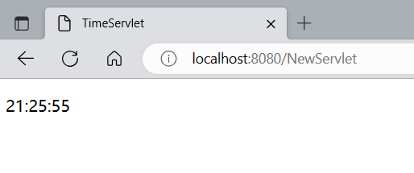

在继承了`HTTPServlet`后，重写`service`方法调用前面的`Newservlet1`返回当前时间：

```java
package com.sec.servlet;

import javax.servlet.ServletException;
import javax.servlet.ServletRequest;
import javax.servlet.ServletResponse;
import javax.servlet.annotation.WebServlet;
import javax.servlet.http.HttpServlet;
import javax.servlet.http.HttpServletRequest;
import javax.servlet.http.HttpServletResponse;
import java.io.IOException;

/**
 * @author : echo0d
 * @date : 2023/9/19 21:42
 * @Description :
 */
@WebServlet(name = "NewServlet2", value = "/NewServlet2")
public class NewServlet2 extends HttpServlet {
    @Override
    public void service(ServletRequest req, ServletResponse res) throws ServletException, IOException {
        // 根据请求方式的不同，进行分别的处理

        HttpServletRequest request = (HttpServletRequest) req;

        //1. 获取请求方式
        String method = request.getMethod();
        //2. 判断
        if ("GET".equals(method)) {
            // get方式的处理逻辑
            NewServlet1 httpServletTest = new NewServlet1();
            httpServletTest.doGet((HttpServletRequest) req, (HttpServletResponse) res);
        } else if ("POST".equals(method)) {
            // post方式的处理逻辑
            doPost(req, res);

        }
    }

    protected void doPost(ServletRequest req, ServletResponse res) {

    }

    protected void doGet(ServletRequest req, ServletResponse res) {
    }
}

```

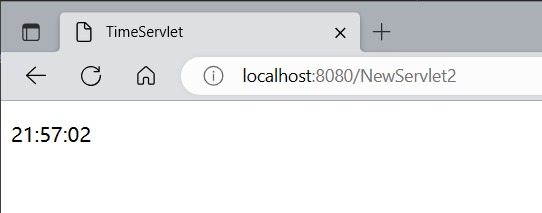

此处若直接实现`Servlet`接口，就需要这样：

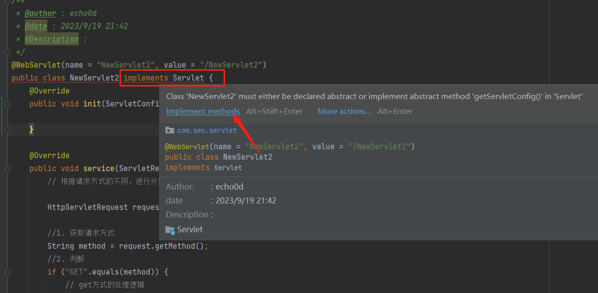


## 4、Servlet的生命周期

在一个生命周期中，Servlet经历了被加载、初始化、接收请求、响应请求以及提供服务的过程（利用的就是`Servlet`接口里的那些方法，见3.1节），如图：


当用户第一次向服务器发起请求时，服务器会解析用户的请求，此时容器会加载Servlet，然后创建Servet实例，再调用`init()`方法初始化Servlet，紧接着调用服务的`service() `方法去处理用户 GET、POST 或者其他类型的请求。当执行完 Servlet 中对应`class`文件的逻辑后，将结果返回给服务器，服务器再响应用户请求。当服务器不再需要Servlet实例或重新载入Servlet时，会调用`destroy() `方法，借助该方法，Servlet可以释放掉所有在`init()`方法中申请的资源。