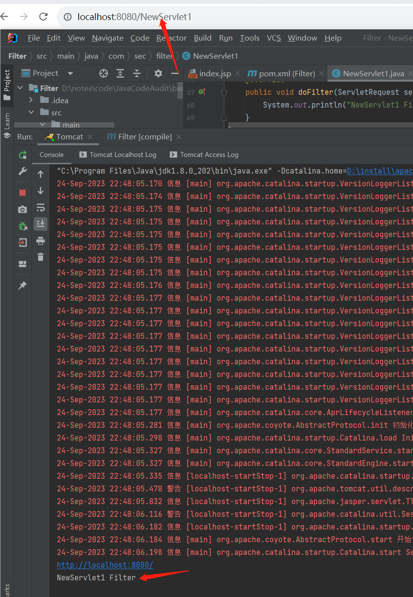
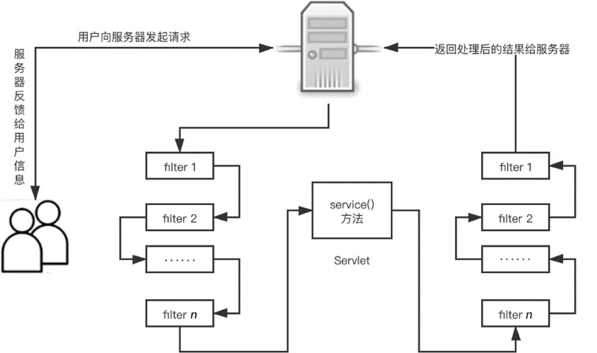
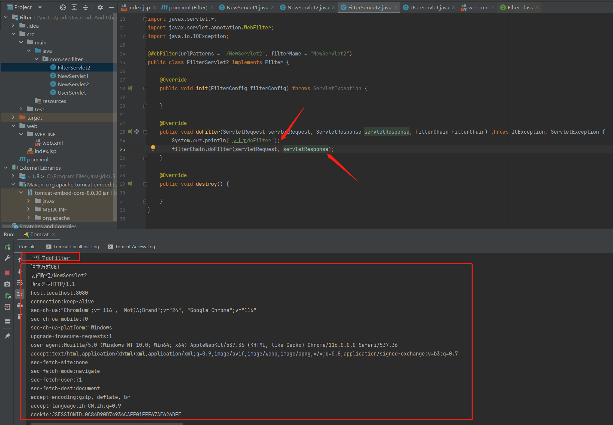

# 4-JavaWeb 审计基础-filter

<!-- more -->

filter 被称为过滤器，是 Servlet 2.3 新增的一个特性，同时它也是 Servlet 技术中最实用的技术。开发人员通过 filter 技术，能够实现对所有 Web 资源的管理，如实现权限访问控制、过滤敏感词汇、压缩响应信息等一些高级功能。

## 1、filter 的配置

filter 的配置类似于 Servlet，由`<filter>`和`<filter-mapping>`两组标签组成，可以使用 web.xml 进行配置，同样，如果 Servlet 版本大于 3.0，也可以使用注解的方式来配置 filter。

### 1.1 基于 web.xml 的配置

filter 同样有很多标签，其中各个标签的含义如下。

`<filter>`：指定一个过滤器。

`<filter-name>`：用于为过滤器指定一个名称，该元素的内容不能为空。

`<filter-class>`：用于指定过滤器的完整的限定类名。

`<init-param>`：用于为过滤器指定初始化参数。

`<param-name>`：为`<init-param>`的子参数，用于指定参数的名称。

`<param-value>`：为`<init-param>`的子参数，用于指定参数的值。

`<filter-mapping>`：用于设置一个 filter 所负责拦截的资源。

`<filter-name>`：为`<filter-mapping>`子元素，用于设置 filter 的注册名称。该值必须是在`<filter>`元素中声明过的过滤器的名称。

`<url-pattern>`：用于设置 filter 所拦截的请求路径（过滤器关联的 URL 样式）。

`<servlet-name>`：用于指定过滤器所拦截的 Servlet 名称。

如下先写一个类，实现 Filter 接口，配置好他的 servlet 信息(下面的代码均延续了上一节 Servlet 部分)：

```java
package com.sec.filter;

/**
 * @author : echo0d
 * @date : 2023/9/17 21:19
 * @Description :
 */

import javax.servlet.*;
import javax.servlet.http.*;
import javax.servlet.annotation.*;
import java.io.IOException;
import java.io.PrintWriter;
import java.text.SimpleDateFormat;
import java.util.Date;
import java.util.Enumeration;
import javax.servlet.Filter;

@WebServlet(name = "NewServlet1", value = "/NewServlet1")
public class NewServlet1 extends HttpServlet implements Filter{
    @Override
    protected void doGet(HttpServletRequest req, HttpServletResponse resp) throws ServletException, IOException {
        System.out.println("请求方式" + req.getMethod());
        System.out.println("访问路径" + req.getServletPath());
        System.out.println("协议类型" + req.getProtocol());
        //读取消息头，getHeaderNames()返回key的迭代器, 该迭代器是比Iterator更古老的迭代器.
        Enumeration e = req.getHeaderNames();
        while(e.hasMoreElements()){
            String key = (String) e.nextElement();
            String value = req.getHeader(key);
            System.out.println(key + ":" + value);
        }
        //写消息头告诉浏览器给它输出的是什么格式的内容
        resp.setContentType("text/html");

        //获取输出流，该流指向的目标就是浏览器
        PrintWriter out = resp.getWriter();
        //省略代码N行
        Date date = new Date();
        SimpleDateFormat sdf = new SimpleDateFormat("HH:mm:ss");
        String now = sdf.format(date);
        //写实体内容
        out.println("<!DOCTYPE HTML>");
        out.println("<html>");
        out.println("<head>");
        out.println("<title>TimeServlet</title>");
        out.println("<meta charset='utf-8'>");
        out.println("</head>");
        out.println("<body>");
        out.println("<p>"+now+"</p>");
        out.println("</body>");
        out.println("</html>");
        out.close();
    }

    @Override
    protected void doPost(HttpServletRequest req, HttpServletResponse resp) throws ServletException, IOException {
        super.doPost(req, resp);
    }

    @Override
    public void init(FilterConfig filterConfig) throws ServletException {

    }

    @Override
    public void doFilter(ServletRequest servletRequest, ServletResponse servletResponse, FilterChain filterChain) throws IOException, ServletException {

    }
}

```

然后修改 web.xml

```xml
<?xml version="1.0" encoding="UTF-8"?>
<web-app xmlns="http://xmlns.jcp.org/xml/ns/javaee"
         xmlns:xsi="http://www.w3.org/2001/XMLSchema-instance"
         xsi:schemaLocation="http://xmlns.jcp.org/xml/ns/javaee http://xmlns.jcp.org/xml/ns/javaee/web-app_4_0.xsd"
         version="4.0">
    <servlet>
        <servlet-name>user</servlet-name>
        <servlet-class>com.sec.filter.UserServlet</servlet-class>
    </servlet>

    <servlet-mapping>
        <servlet-name>user</servlet-name>
        <url-pattern>/user</url-pattern>
    </servlet-mapping>
    <filter>
        <filter-name>NewServlet1</filter-name>
        <filter-class>com.sec.filter.NewServlet1</filter-class>
    </filter>
    <filter-mapping>
        <filter-name>NewServlet1</filter-name>
        <url-pattern>/NewServlet1</url-pattern>
    </filter-mapping>
</web-app>
```

访问对应 url，即可运行`doFilter()`方法中的内容



### 1.2 基于注解方式的配置

> 实例代码见后面 filter 接口部分

因为 Servlet 的关系，在 Servlet 3.0 以后，开发者同样可以不用在 web.xml 里面配置 filter，只需要添加@WebServlet 注解就可以修改 filter 的属性，web.xml 可以配置的 filter 属性都可以通过 @WebServlet 的方式进行配置。

**@WebFilter 常用属性**

| 属性              | 类型             | 是否必需 | 说明                                                                                                              |
| ----------------- | ---------------- | -------- | ----------------------------------------------------------------------------------------------------------------- |
| asyncSupported    | boolean          | 否       | 指定 Filter 是否支持异步模式                                                                                      |
| dispatcherTypes   | DispatcherType[] | 否       | 指定 Filter 对哪种方式的请求进行过滤。支持的属性：ASYNC、ERROR、FORWARD、INCLUDE、REQUEST；默认过滤所有方式的请求 |
| filterName        | String           | 否       | Filter 名称                                                                                                       |
| initParams        | WebInitParam[]   | 否       | 配置参数                                                                                                          |
| displayName       | String           | 否       | Filter 显示名                                                                                                     |
| servletNames      | String[]         | 否       | 指定对哪些 Servlet 进行过滤                                                                                       |
| urlPatterns/value | String[]         | 否       | 两个属性作用相同，指定拦截的路径                                                                                  |

但需要注意的是，一般不推荐使用注解方式来配置 filter，因为如果存在多个过滤器，使用 web.xml 配置 filter 可以控制过滤器的执行顺序；如果使用注解方式来配置 filter，则无法确定过滤器的执行顺序。

### 1.3 拦截配置方式

- 拦截具体的资源：/index.jsp：只有访问 index.jsp 时才会被拦截
- 目录拦截：/user/\*：访问/user 下的所有资源，都会被拦截
- 后缀名拦截：\*.jsp：访问后缀名为 jsp 的资源，都会被拦截
- 拦截所有：/\*：访问所有资源，都会被拦截

## 2、filter 的接口方法

### 2.1 Init()接口

在`init()`方法中完成与构造方法类似的初始化功能，不同之处在于如果初始化代码中要用到`FillerConfig`对象，那这些初始化代码只能在`filler`的`init()`方法中编写，而不能在构造方法中编写。`init()`方法的定义如下：

```java
public void init(FilterConfig fConfig) throws ServletException {
       // 此处内容为开发者定义的初始化代码...
}
```

### 2.1 doFilter()接口

`doFilter()`方法类似于`Servlet`接口的`service()`方法。当客户端请求目标资源时，容器会筛选出符合`<filter-mapping> `标签中`<url-pattern>` 的`filter`，并按照声明 `<filter-mapping>`的顺序依次调用这些 filter 的`doFilter()`方法。

关于`doFilter()`方法的参数：

- 参数`servletRequest`和`servletResponse`为 Web 服务器或 `filter`链中的上一个`filter`传递过来的请求和响应对象。
- 参数`filterChain`代表当前`filter`链的对象，只有在当前`filter`对象中的`doFilter()`方法内部需要调用`FilterChain`对象的`doFilter()`方法时，才能把请求交付给`filter`链中的下一个`filter`或者目标程序处理。

`doFilter()` 方法的定义如下：

```java
public void doFilter(ServletRequest request, ServletResponse response, FilterChain filterChain) throws IOException, ServletException {
     // 此处内容为开发者定义的过滤代码
        ...
     // 传递filter 链
     filterChain.doFilter(request, response);
}
```

### 2.3 destroy()接口

接口`Filter`中的`destroy()`方法与`Servlet`中的`destroy()`作用类似，在 Web 服务器卸载`filter`对象之前被调用，用于释放被`filter`对象打开的资源，如关闭数据库、关闭 I/O 流等。`destroy()`方法的定义如下：

```java
public void destroy() {
       // 此处内容为开发者进行终止操作的代码
}
```

具体的拦截和实现方式见下一节

## 3、filter 的使用流程及实现方式

### 3.1 流程及方式

**基本开发步骤：**

1. 实现`Filter`接口，并重写他的`init`、`doFilter`、`destroy`方法
2. 配置拦截路径，在类上定义`@WebFilter`注解，用`vlaue`属性执行拦截资源，`/*`标识标识拦截所有资源
3. 在 doFilter 方法中执行操作，使用`filterChain.doFilter(request,response);`来放行资源

`filter`接口中的`doFilter()`方法，负责配置对哪个 Web 资源进行拦截、何如拦截后，Web 服务器会在每次调用 Web 资源的`service() `方法之前先调用`doFilter()`方法，如图：



**filter 进行拦截的方式：**

- 在`HttpServletRequest`到达`Servlet`之前，拦截客户的`HttpServletRequest`，根据需要检查`HttpServletRequest`，也可以修改`HttpServletRequest`头和数据。
- 在`HttpServletResponse`到达客户端之前，拦截`HttpServletResponse`，根据需要检查`HttpServletResponse`，也可以修改`HttpServletResponse`头和数据。

**配置多个 filter 时的执行顺序：**

> 优先级是按照过滤器类名(字符串)的自然排序

当用户向服务器发送 request 请求时，服务器接受该请求，并将请求发送到第一个过滤器中进行处理。如果有多个过滤器，则会依次经过 filter 2，filter 3，……，filter _n_。接着调用 Servlet 中 的`service() `方法，调用完毕后，按照与进入时相反的顺序，从过滤器 filter n 开始，依次经过各个过滤器，直到过滤器 filter 1。最终将处理后的结果返回给服务器，服务器再反馈给用户。

### 3.2 代码举例

有个类实现 Filter 接口后，IDEA 会自动提醒要实现的方法，如下：


简单代码如下：有一个 NewServlet1，他会显示时间、请求等信息

```java
package com.sec.filter;

/**
 * @author : echo0d
 * @date : 2023/9/17 21:19
 * @Description :
 */

import javax.servlet.*;
import javax.servlet.http.*;
import javax.servlet.annotation.*
        ;
import java.io.IOException;
import java.io.PrintWriter;
import java.text.SimpleDateFormat;
import java.util.Date;
import java.util.Enumeration;
import javax.servlet.Filter;

@WebServlet(name = "NewServlet1", value = "/NewServlet1")

public class NewServlet1 extends HttpServlet implements Filter{
    @Override
    protected void doGet(HttpServletRequest req, HttpServletResponse resp) throws ServletException, IOException {
        System.out.println("请求方式" + req.getMethod());
        System.out.println("访问路径" + req.getServletPath());
        System.out.println("协议类型" + req.getProtocol());
        //读取消息头，getHeaderNames()返回key的迭代器, 该迭代器是比Iterator更古老的迭代器.
        Enumeration e = req.getHeaderNames();
        while(e.hasMoreElements()){
            String key = (String) e.nextElement();
            String value = req.getHeader(key);
            System.out.println(key + ":" + value);
        }
        //写消息头告诉浏览器给它输出的是什么格式的内容
        resp.setContentType("text/html");

        //获取输出流，该流指向的目标就是浏览器
        PrintWriter out = resp.getWriter();
        //省略代码N行
        Date date = new Date();
        SimpleDateFormat sdf = new SimpleDateFormat("HH:mm:ss");
        String now = sdf.format(date);
        //写实体内容
        out.println("<!DOCTYPE HTML>");
        out.println("<html>");
        out.println("<head>");
        out.println("<title>TimeServlet</title>");
        out.println("<meta charset='utf-8'>");
        out.println("</head>");
        out.println("<body>");
        out.println("<p>"+now+"</p>");
        out.println("</body>");
        out.println("</html>");
        out.close();
    }

    @Override
    protected void doPost(HttpServletRequest req, HttpServletResponse resp) throws ServletException, IOException {
        super.doPost(req, resp);
    }

    @Override
    public void init(FilterConfig filterConfig) throws ServletException {

    }

    @Override
    public void doFilter(ServletRequest servletRequest, ServletResponse servletResponse, FilterChain filterChain) throws IOException, ServletException {
        System.out.println("NewServlet1 Filter");
    }

}

```

还有个 NewServlet2，如果是 GET 请求，他就去调 NewServlet1

```java
package com.sec.filter;

import javax.servlet.*;
import javax.servlet.annotation.WebServlet;
import javax.servlet.http.HttpServlet;
import javax.servlet.http.HttpServletRequest;
import javax.servlet.http.HttpServletResponse;
import java.io.IOException;

/**
 * @author : echo0d
 * @date : 2023/9/19 21:42
 * @Description :
 */
@WebServlet(name = "NewServlet2", value = "/NewServlet2")

public class NewServlet2 extends HttpServlet{
    @Override
    public void init(ServletConfig config) throws ServletException {

    }

    @Override
    public void service(ServletRequest req, ServletResponse res) throws ServletException, IOException {
        // 根据请求方式的不同，进行分别的处理

        HttpServletRequest request = (HttpServletRequest) req;

        //1. 获取请求方式
        String method = request.getMethod();
        //2. 判断
        if ("GET".equals(method)) {
            // get方式的处理逻辑
            NewServlet1 httpServletTest = new NewServlet1();
            httpServletTest.doGet((HttpServletRequest) req, (HttpServletResponse) res);
        } else if ("POST".equals(method)) {
            // post方式的处理逻辑
            doPost(req, res);

        }
    }

    protected void doPost(ServletRequest req, ServletResponse res) {

    }

    protected void doGet(ServletRequest req, ServletResponse res) {

    }

}

```

给 NewServlet2 配置拦截器，再用 filterChain.doFilter 放行

```java
package com.sec.filter;

/**
 * @author : echo0d
 * @date : 2023/9/25 22:37
 * @Description :
 */


import javax.servlet.*;
import javax.servlet.annotation.WebFilter;
import java.io.IOException;

@WebFilter(urlPatterns = "/NewServlet2", filterName = "NewServlet2")
public class FilterServlet2 implements Filter {

    @Override
    public void init(FilterConfig filterConfig) throws ServletException {

    }

    @Override
    public void doFilter(ServletRequest servletRequest, ServletResponse servletResponse, FilterChain filterChain) throws IOException, ServletException {
        System.out.println("这里是doFilter");
        filterChain.doFilter(servletRequest, servletResponse);
    }

    @Override
    public void destroy() {

    }
}

```

访问对应 url(http://localhost:8080/NewServlet2)，即可运行`doFilter()`方法中的内容



## 4、filter 的生命周期

filter 的生命周期与 Servlet 的生命周期比较类似，在一个生命周期中，filter 经历了被加载、初始化、提供服务及销毁的过程。

当 Web 容器启动时，会根据 web.xml(或注解)中声明的 filter 顺序依次实例化这些 filter。然后在 Web 应用程序加载时调用`init()`方法，随即在客户端有请求时调用`doFilter()`方法，并且根据实际情况的不同，`doFilter()`方法可能被调用多次。最后在 Web 应用程序卸载（或关闭）时调用`destroy()`方法。


