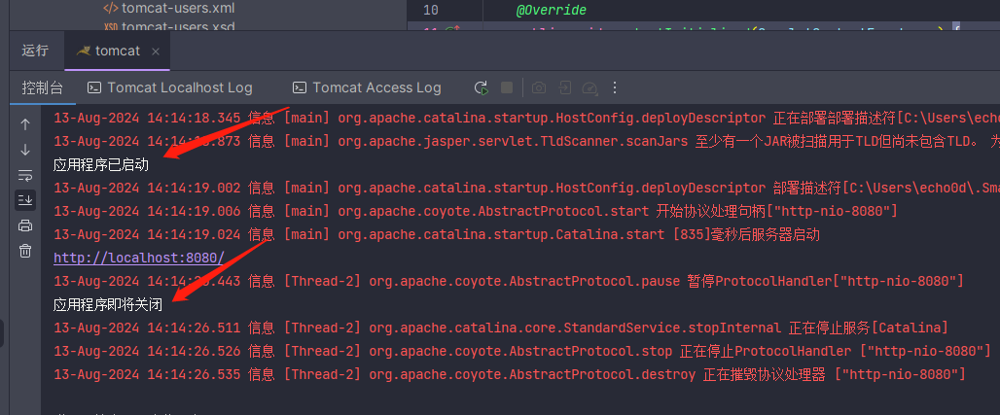

# 5-JavaWeb 审计基础-Listener

<!-- more -->

Listener 表示监听器，可以监听 `application`，`session`，`request` 三个对象创建、销毁或者往其中添加修改删除属性时自动执行代码的功能组件。 `application` 是 `ServletContext` 类型的对象。`ServletContext` 代表整个 web 应用，在服务器启动的时候，tomcat 会自动创建该对象。在服务器关闭时会自动销毁该对象。

## 1. Listener 分类

在 JavaWeb 中提供了 8 个监听器：

```
6个常规监听器
    ServletContext
            ServletContextListener（上下文监听器，监听ServletContext对象的创建和销毁事件，用于监听Web应用程序的启动和关闭事件。）
            ServletContextAttributeListener（属性监听，监听ServletContext中属性的添加、修改和删除事件。）
    HttpSession
            HttpSessionListener（会话监听器，监听HttpSession对象的创建和销毁事件，用于监听会话的创建和销毁事件。）
            HttpSessionAttributeListener（属性监听，监听HttpSession中属性的添加、修改和删除事件。）
    ServletRequest
            ServletRequestListener（请求监听器，监听ServletRequest对象的创建和销毁事件，用于监听请求的创建和销毁事件。）
            ServletRequestAttributeListener（属性监听，监听ServletRequest中属性的添加、修改和删除事件。）

2个感知监听
    HttpSessionBindingListener
    HttpSessionActivationListener
```

## 2. Listener 生命周期

Listener 的生命周期由容器管理，容器会在适当的时机调用监听器的方法。让我们简要了解一下这些生命周期方法。

##### `ServletContextListener` 生命周期

`ServletContextListener` 接口定义了两个方法：

- **`contextInitialized(ServletContextEvent sce)`**：在 Web 应用程序初始化时被调用。
- **`contextDestroyed(ServletContextEvent sce)`**：在 Web 应用程序销毁时被调用。

##### `HttpSessionListener` 生命周期

`HttpSessionListener` 接口也定义了两个方法：

- **`sessionCreated(HttpSessionEvent se)`**：在会话创建时被调用。
- **`sessionDestroyed(HttpSessionEvent se)`**：在会话销毁时被调用。

##### `ServletRequestListener` 生命周期

`ServletRequestListener` 接口同样定义了两个方法：

- **`requestInitialized(ServletRequestEvent sre)`**：在请求创建时被调用。
- **`requestDestroyed(ServletRequestEvent sre)`**：在请求销毁时被调用。

## 3. Listener 实现步骤

以`ServletContextListener`为例，`ServletContextListener` 用于监听 Web 应用程序的启动和关闭事件。

- 定义类，实现`ServletContextListener` 接口
- 重写所有抽象方法，我们可以在 `contextInitialized` 方法中执行一些初始化操作，在 `contextDestroyed` 方法中执行清理操作。
- 使用 `@WebListener` 进行配置（或者使用`web.xml ： <listener></listener>`）
- 启动 tomcat，查看 console 的输出

```java
package com.echo0d;

import javax.servlet.ServletContextEvent;
import javax.servlet.ServletContextListener;
import javax.servlet.annotation.WebListener;

@WebListener
public class MyServletContextListener implements ServletContextListener {

    @Override
    public void contextInitialized(ServletContextEvent sce) {
        // 应用程序启动时执行的初始化操作
        System.out.println("应用程序已启动");
        // 加载配置文件、初始化数据库连接池等
        // ...
    }

    @Override
    public void contextDestroyed(ServletContextEvent sce) {
        // 应用程序关闭时执行的清理操作
        System.out.println("应用程序即将关闭");
        // 关闭数据库连接池、释放资源等
        // ...
    }
}
```


