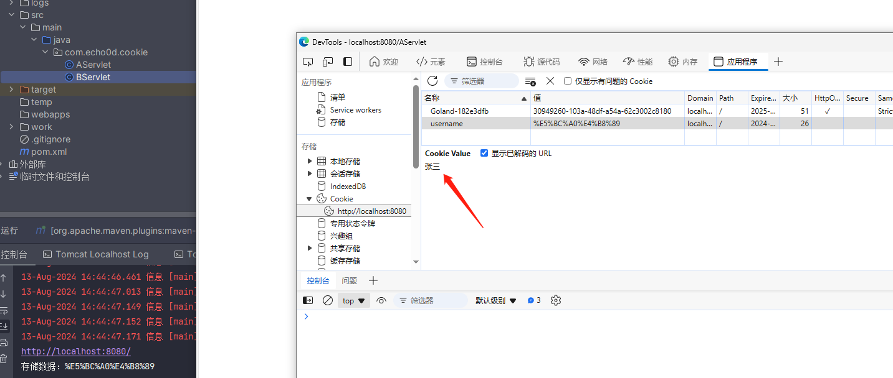
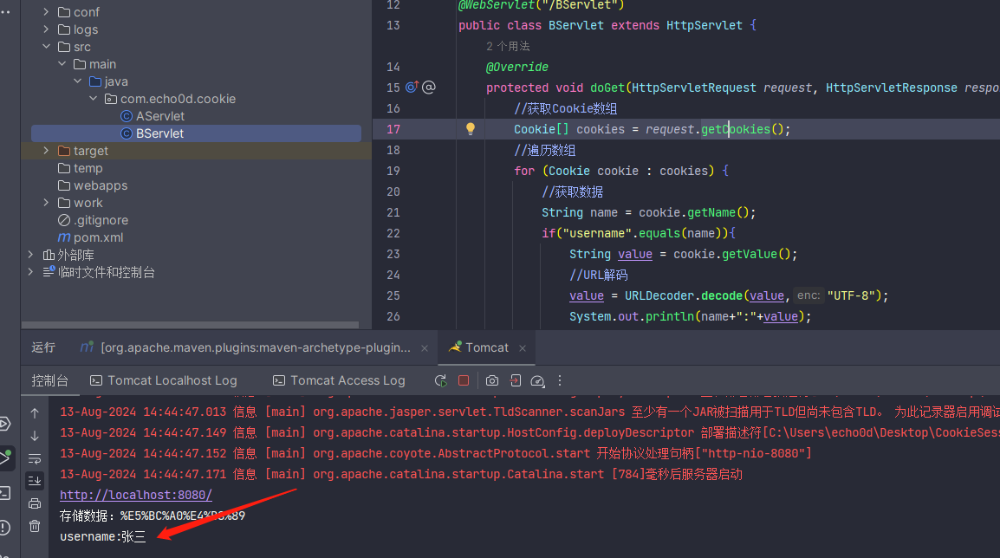
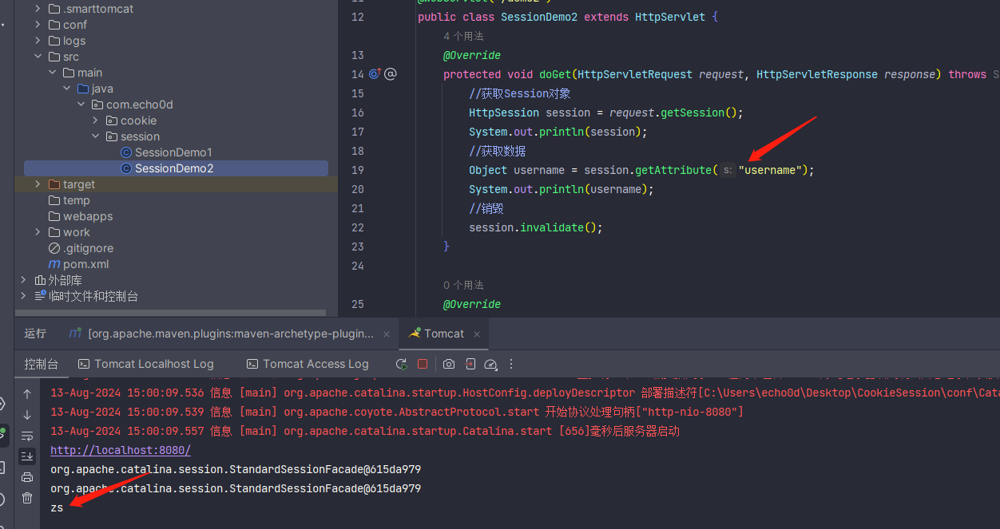
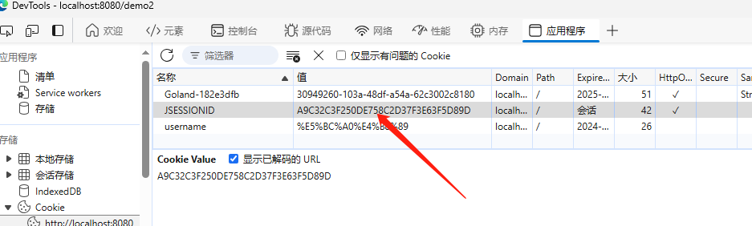
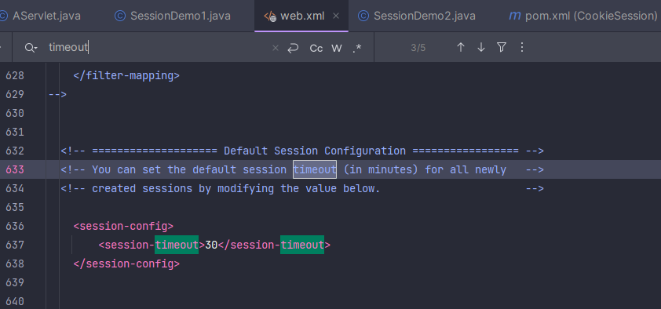

# 6-会话技术

## 1. 概述

用户打开浏览器，访问web服务器的资源，会话建立，直到有一方断开连接，会话结束。在一次会话中可以包含多次请求和响应。

- 从浏览器发出请求到服务端响应数据给前端之后，一次会话(在浏览器和服务器之间)就被建立了
- 会话被建立后，如果浏览器或服务端都没有被关闭，则会话就会持续建立着
- 浏览器和服务器就可以继续使用该会话进行请求发送和响应，上述的整个过程就被称之为会话。

会话跟踪是一种维护浏览器状态的方法，服务器需要识别多次请求是否来自于同一浏览器，以便在同一次会话的多次请求间共享数据。

- 服务器会收到多个请求，这多个请求可能来自多个浏览器，需要识别请求是否来自同一个浏览器，服务器识别浏览器后就可以在同一个会话中多次请求之间来共享数据，服务器用来识别浏览器的过程就是会话跟踪

**实现方案**

- 客户端会话跟踪技术：Cookie
- 服务端会话跟踪技术：Session

## 2. Cookie

**Cookie：**客户端会话技术，将数据保存到客户端，以后每次请求都携带Cookie数据进行访问。

**Cookie的工作流程**

- 服务端提供了两个Servlet，分别是ServletA和ServletB
- 浏览器发送HTTP请求1给服务端，服务端ServletA接收请求并进行业务处理
- 服务端ServletA在处理的过程中可以创建一个Cookie对象并将`name=zs`的数据存入Cookie
- 服务端ServletA在响应数据的时候，会把Cookie对象响应给浏览器
- 浏览器接收到响应数据，会把Cookie对象中的数据存储在浏览器内存中，此时浏览器和服务端就**建立了一次会话**
- **在同一次会话中**浏览器再次发送HTTP请求2给服务端ServletB，浏览器会携带Cookie对象中的所有数据
- ServletB接收到请求和数据后，就可以获取到存储在Cookie对象中的数据，这样同一个会话中的多次请求之间就实现了数据共享

### 2.1. Cookie的基本使用

#### 发送Cookie

* 编写Servlet类，在Servlet中创建Cookie对象

- 创建Cookie对象，并设置数据

```plaintext
Cookie cookie = new Cookie("key","value");
```

- 发送Cookie到客户端：使用**response**对象

```plaintext
response.addCookie(cookie);
```

综上，编写Servlet类，名称为AServlet，在Servlet中创建Cookie对象，存入数据，发送给前端

```java
@WebServlet("/AServlet")
public class AServlet extends HttpServlet {
    @Override
    protected void doGet(HttpServletRequest request, HttpServletResponse response) throws ServletException, IOException {
        //发送Cookie
        //1. 创建Cookie对象
        Cookie cookie = new Cookie("username","张三");
        //2. 发送Cookie，response
        response.addCookie(cookie);
    }

    @Override
    protected void doPost(HttpServletRequest request, HttpServletResponse response) throws ServletException, IOException {
        this.doGet(request, response);
    }
}
```

启动测试，访问`http://localhost:8080/AServlet`在浏览器查看Cookie对象中的值：



#### 获取Cookie

* 编写一个新Servlet类，名称为BServlet，在BServlet中使用request对象获取Cookie数组

- 获取客户端携带的所有Cookie，使用request对象

```java
Cookie[] cookies = request.getCookies();
```

- for遍历数组，获取每一个Cookie对象

```java
for (Cookie cookie : cookies) {}
```

- 使用Cookie对象方法获取数据

```java
cookie.getName();
cookie.getValue();
```

综上，编写一个新Servlet类，名称为BServlet在BServlet中使用request对象获取Cookie数组，遍历数组，从数据中获取指定名称对应的值

```java
@WebServlet("/BServlet")
public class BServlet extends HttpServlet {
    @Override
    protected void doGet(HttpServletRequest request, HttpServletResponse response) throws ServletException, IOException {
        //获取Cookie
        //1. 获取Cookie数组
        Cookie[] cookies = request.getCookies();
        //2. 遍历数组
        for (Cookie cookie : cookies) {
            //3. 获取数据
            String name = cookie.getName();
            if("username".equals(name)){
                String value = cookie.getValue();
                System.out.println(name+":"+value);
                break;
            }
        }
    }
    @Override
    protected void doPost(HttpServletRequest request, HttpServletResponse response) throws ServletException, IOException {
        this.doGet(request, response);
    }
}
```

启动测试，在控制台打印出获取的值访问`http://localhost:8080/BServlet`在IDEA控制台就能看到输出的结果:



### 2.2. Cookie的存活时间

默认情况下，Cookie存储在浏览器内存中，当浏览器关闭，内存释放，则Cookie被销毁

我们可以使用`setMaxAge`设置Cookie存活时间

```plaintext
setMaxAge(int seconds)
```

参数值为:

1.正数：将Cookie写入浏览器所在电脑的硬盘，持久化存储。到时间自动删除

2.负数：默认值，Cookie在当前浏览器内存中，当浏览器关闭，则Cookie被销毁

3.零：删除对应Cookie

修改上面的AServlet如下：

```java
package com.echo0d.cookie;

import javax.servlet.*;
import javax.servlet.http.*;
import javax.servlet.annotation.*;
import java.io.IOException;
import java.net.URLEncoder;

@WebServlet("/AServlet")
public class AServlet extends HttpServlet {
    @Override
    protected void doGet(HttpServletRequest request, HttpServletResponse response) throws ServletException, IOException {
        //创建Cookie对象
        String value = "张三";
        //URL编码
        value = URLEncoder.encode(value, "UTF-8");
        System.out.println("存储数据："+value);
        Cookie cookie = new Cookie("username",value);
        //设置存活时间   ，1周 7天
        cookie.setMaxAge(60*60*24*7);
        //发送Cookie，response
        response.addCookie(cookie);
    }

    @Override
    protected void doPost(HttpServletRequest request, HttpServletResponse response) throws ServletException, IOException {
        this.doGet(request, response);
    }
}


```

## 3. Session

Session：服务端会话跟踪技术：将数据保存到服务端。

- Session是存储在服务端而Cookie是存储在客户端
- 存储在客户端的数据容易被窃取和截获，存在很多不安全的因素
- 存储在服务端的数据相比于客户端来说就更安全

### 3.1. Session的基本使用

获取Session对象,使用的是request对象

```plaintext
HttpSession session = request.getSession();
```

**Session对象提供的功能:**

- 存储数据到 session 域中

  ```plaintext
  void setAttribute(String name, Object o)
  ```

- 根据 key，获取值

  ```plaintext
  Object getAttribute(String name)
  ```

- 根据 key，删除该键值对

  ```plaintext
  void removeAttribute(String name)
  ```

创建SessionDemo1类获取Session对象、存储数据

```java
@WebServlet("/demo1")
public class SessionDemo1 extends HttpServlet {
    @Override
    protected void doGet(HttpServletRequest request, HttpServletResponse response) throws ServletException, IOException {
    	//存储到Session中
        //1. 获取Session对象
        HttpSession session = request.getSession();
        //2. 存储数据
        session.setAttribute("username","zs");
    }
    @Override
    protected void doPost(HttpServletRequest request, HttpServletResponse response) throws ServletException, IOException {
        this.doGet(request, response);
    }
}
```

创建SessionDemo2类获取Session对象、获取数据

```java
@WebServlet("/demo2")
public class SessionDemo2 extends HttpServlet {
    @Override
    protected void doGet(HttpServletRequest request, HttpServletResponse response) throws ServletException, IOException {
        //获取数据，从session中
        //1. 获取Session对象
        HttpSession session = request.getSession();
        //2. 获取数据
        Object username = session.getAttribute("username");
        System.out.println(username);
    }

    @Override
    protected void doPost(HttpServletRequest request, HttpServletResponse response) throws ServletException, IOException {
        this.doGet(request, response);
    }
}
```

启动测试，先访问`http://localhost:8080/demo1`,将数据存入Session然后访问`http://localhost:8080/demo2`,从Session中获取数据，查看控制台



**session的生命周期**

- demo1在第一次获取session对象的时候，session对象会有一个唯一的标识
- demo1在session中存入其他数据并处理完成所有业务后，需要通过Tomcat服务器响应结果给浏览器
- Tomcat服务器发现业务处理中使用了session对象，就会把session的唯一标识当做一个cookie，添加`Set-Cookie:JESSIONID`到响应头中，并响应给浏览器
- 浏览器接收到响应结果后，会把响应头中的coookie数据存储到浏览器的内存中
- 浏览器在同一会话中访问demo2的时候，会把cookie中的数据添加到请求头中并发送给服务器Tomcat
- demo2获取到请求后，从请求头中就读取cookie中的JSESSIONID值，然后就会到服务器内存中寻找他对应的的session对象，如果找到了，就直接返回该对象，如果没有则新创建一个session对象
- 关闭打开浏览器后，因为浏览器的cookie已被销毁，所以就没有JESSIONID的数据，服务端获取到的session就是一个全新的session对象



在服务器正常关闭后Tomcat会自动将Session数据写入硬盘的文件中，这被称为钝化；再次启动服务器后，从文件中加载数据到Session中，数据加载到Session中后原本存储session的文件会被删除掉


**Session销毁**

session的销毁会有两种方式:

- 默认情况下，无操作，30分钟自动销毁,对于这个失效时间，是可以通过配置进行修改的，在项目的web.xml中配置：



- 调用Session对象的invalidate()进行销毁：

  ```java
   session.invalidate();
  ```

## 4. Cookie和Session的区别

存储位置：Cookie 是将数据存储在客户端，Session 将数据存储在服务端

安全性：Cookie不安全，Session安全

数据大小：Cookie最大3KB，Session无大小限制

存储时间：Cookie可以通过`setMaxAge()`长期存储，Session默认30分钟

服务器性能：Cookie不占服务器资源，Session占用服务器资源