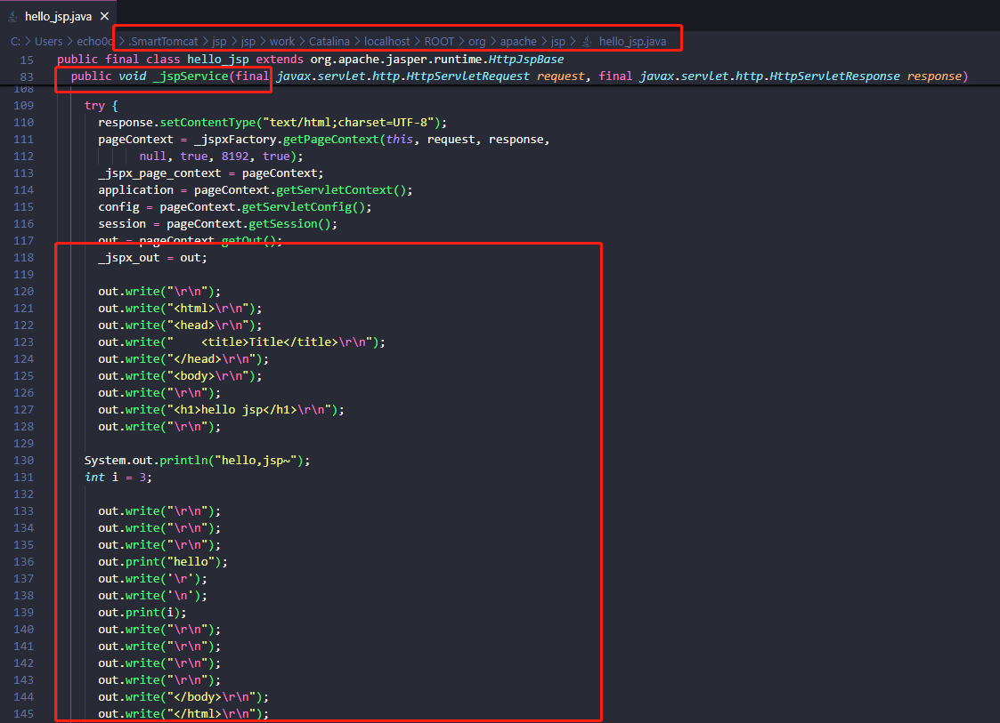
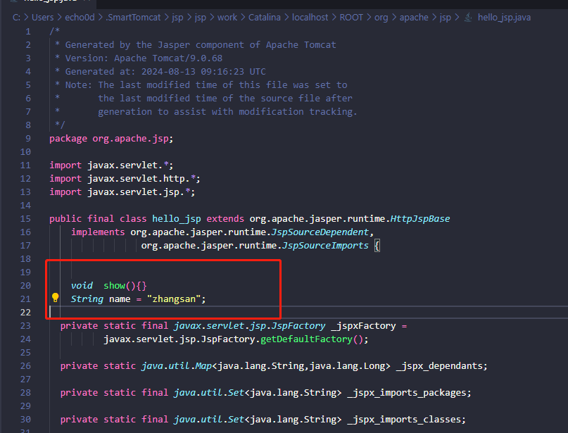
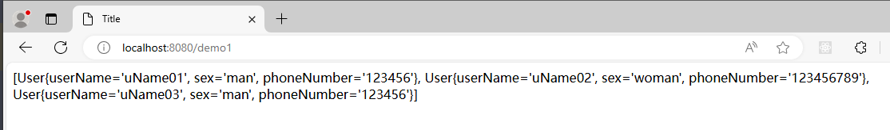

# 7-JSP

## 1. JSP

JSP（全称：Java Server Pages）：Java 服务端页面。是一种动态的网页技术，其中既可以定义 HTML、JS、CSS等静态内容，还可以定义 Java代码的动态内容，也就是 `JSP = HTML + Java`。如下就是jsp代码

```plaintext
 <html>
     <head>
         <title>Title</title>
     </head>
     <body>
         <h1>JSP,Hello World</h1>
         <%
             System.out.println("hello,jsp~");
         %>
     </body>
 </html>
```

JSP 就是一个页面本质上就是一个 Servlet

### **JSP访问流程**

- 浏览器第一次访问 `hello.jsp` 页面
- `tomcat` 会将 `hello.jsp` 转换为名为 `hello_jsp.java` 的一个 `Servlet`
- `tomcat` 再将转换的 `servlet` 编译成字节码文件 `hello_jsp.class`
- `tomcat` 会执行该字节码文件，向外提供服务

此处用了smart tomcat运行的项目，我们可以找到`.SmartTomcat\jsp\jsp\work\Catalina\localhost\ROOT\org\apache\jsp`目录，而这个目录下就能看到转换后的 `servlet`打开 `hello_jsp.java` 文件，可以看到有一个名为 `_jspService()` 的方法，该方法就是每次访问 `jsp` 时自动执行的方法，和 `servlet` 中的 `service` 方法一样 ，并且在 `_jspService()` 方法中可以看到往浏览器写标签的代码：

以前我们自己写 `servlet` 时，这部分代码是由我们自己来写，现在有了 `jsp` 后，由tomcat完成这部分功能。

在 `hello.jsp` 中书写

```plaintext
 <%="hello"%>
 <%=i%>
```

查看转换的 `hello_jsp.java` 文件，该脚本的内容被放在了 `out.print()` 中，作为参数



在 `hello.jsp` 中书写

```plaintext
 <%!
     void  show(){}
     String name = "zhangsan";
 %>
```

通过浏览器访问 `hello.jsp` 后，查看转换的 `hello_jsp.java` 文件，该脚本的内容被放在了成员位置



## 2. EL 表达式

EL（全称Expression Language ）表达式语言，用于简化 JSP 页面内的 Java 代码。EL 表达式的主要作用是 获取数据。其实就是从域对象中获取数据，然后将数据展示在页面上，如：`${brands} `就是获取域中存储的 key 为 brands 的数据。

### 代码演示

- 定义servlet，在 servlet 中封装一些数据并存储到 request 域对象中并转发到 `el-demo.jsp` 页面。

  ```java
  @WebServlet("/demo1")
  public class ServletDemo1 extends HttpServlet {
      @Override
      protected void doGet(HttpServletRequest request, HttpServletResponse response) throws ServletException, IOException {
          //1. 准备数据
          List<User> Users = new ArrayList<User>();
          Users.add(new User("uName01","man","123456"));
          Users.add(new User("uName02","woman","123456789"));
          Users.add(new User("uName03","man","123456"));
          //2. 存储到request域中
          request.setAttribute("Users",Users);
          request.setAttribute("status",1);
          //3. 转发
          request.getRequestDispatcher("/el-demo.jsp").forward(request,response);
      }
  
      @Override
      protected void doPost(HttpServletRequest request, HttpServletResponse response) throws ServletException, IOException {
          this.doGet(request, response);
      }
  }
  ```

- 在 `el-demo.jsp` 中通过 EL表达式 获取数据

  ```jsp
  <%@ page contentType="text/html;charset=UTF-8" language="java" %>
  <html>
  <head>
      <title>Title</title>
  </head>
  <body>
      ${Users}
  </body>
  </html>
  ```

- 在浏览器的地址栏输入 `demo1`这个servlet ，页面效果如下：

  

### 域对象

JavaWeb中有四大域对象，分别是：

- page：

  有效范围pageContext：只在一个页面中保存属性，跳转后无效

  作用：代表jsp中

- request：

  作用：提供对请求数据的访问，提供用于加入特定请求数据访问

  有效范围：只在当前请求中保存，服务器跳转有效，客户端跳转无效

  主要用于处理用户的提交信息

- session：

  作用：用于保存客户端与服务端之间的数据

  有效范围：在一次会话中有效，无论何种跳转都有效。

- application：

  有效范围：整个项目，项目关闭、重启数据会丢失，如果项目不关闭，所有用户访问该项目的所有页面都可以获取application

## 3. JSTL标签

JSP标准标签库(Jsp Standarded Tag Library) ，使用标签取代JSP页面上的Java代码。如下代码就是JSTL标签

```jsp
<c:if test="${flag == 1}">
    男
</c:if>
<c:if test="${flag == 2}">
    女
</c:if>
```

上面代码看起来是不是比 JSP 中嵌套 Java 代码看起来舒服好了。而且前端工程师对标签是特别敏感的，他们看到这段代码是能看懂的。

JSTL 提供了很多标签，如下图

| 标签          | 描述                                                         |
| ------------- | ------------------------------------------------------------ |
| <c:out>       | 用于在JSP中显示数据，就像<%= ... >                           |
| <c:set>       | 用于保存数据                                                 |
| <c:remove>    | 用于删除数据                                                 |
| <c:catch>     | 用来处理产生错误的异常状况，并且将错误信息储存起来           |
| <c:if>        | 与我们在一般程序中用的if一样                                 |
| <c:choose>    | 本身只当做<c:when>和<c:otherwise>的父标签                    |
| <c:when>      | <c:choose>的子标签，用来判断条件是否成立                     |
| <c:otherwise> | <c:choose>的子标签，接在<c:when>标签后，当<c:when>标签判断为false时被执行 |
| <c:import>    | 检索一个绝对或相对 URL，然后将其内容暴露给页面               |
| <c:forEach>   | 基础迭代标签，接受多种集合类型                               |
| <c:forToken>  | 根据指定的分隔符来分隔内容并迭代输出                         |
| <c:param>     | 用来给包含或重定向的页面传递参数                             |
| <c:redirect>  | 重定向至一个新的URL.                                         |
| <c:url>       | 使用可选的查询参数来创造一个URL                              |

### JSTL 使用流程

- 添加maven依赖

  ```xml
  <dependency>
      <groupId>jstl</groupId>
      <artifactId>jstl</artifactId>
      <version>1.2</version>
  </dependency>
  <dependency>
      <groupId>taglibs</groupId>
      <artifactId>standard</artifactId>
      <version>1.1.2</version>
  </dependency>
  ```

- 在JSP页面上引入JSTL标签库

  ```jsp
  <%@ taglib prefix="c" uri="http://java.sun.com/jsp/jstl/core" %> 
  ```

- 使用标签

### if 标签

`<c:if>`：相当于 if 判断

- 属性：test，用于定义条件表达式

```jsp
<c:if test="${flag == 1}">
    男
</c:if>
<c:if test="${flag == 2}">
    女
</c:if>
```

**代码演示：**

- 定义一个 `servlet` ，在该 `servlet` 中向 request 域对象中添加 键是 `status` ，值为 `1` 的数据

  ```java
  @WebServlet("/demo2")
  public class ServletDemo2 extends HttpServlet {
      @Override
      protected void doGet(HttpServletRequest request, HttpServletResponse response) throws ServletException, IOException {
          //1. 存储数据到request域中
          request.setAttribute("status",1);
  
          //2. 转发到 jstl-if.jsp
          数据request.getRequestDispatcher("/jstl-if.jsp").forward(request,response);
      }
  
      @Override
      protected void doPost(HttpServletRequest request, HttpServletResponse response) throws ServletException, IOException {
          this.doGet(request, response);
      }
  }
  ```

- 定义 `jstl-if.jsp` 页面，在该页面使用 `<c:if>` 标签

  ```jsp
  <%@ page contentType="text/html;charset=UTF-8" language="java" %>
  <%@ taglib prefix="c" uri="http://java.sun.com/jsp/jstl/core" %>
  <html>
  <head>
      <title>Title</title>
  </head>
  <body>
      <%--
          c:if：来完成逻辑判断，替换java  if else
      --%>
      <c:if test="${status ==1}">
          启用
      </c:if>
  
      <c:if test="${status ==0}">
          禁用
      </c:if>
  </body>
  </html>
  ```

### forEach 标签

`<c:forEach>`：相当于 for 循环。java中有增强for循环和普通for循环，JSTL 中的 `<c:forEach>` 也有两种用法

**用法一**

类似于 Java 中的增强for循环。涉及到的 `<c:forEach>` 中的属性如下

- items：被遍历的容器
- var：遍历产生的临时变量
- varStatus：遍历状态对象

如下代码，是从域对象中获取名为 brands 数据，该数据是一个集合；遍历遍历，并给该集合中的每一个元素起名为 `brand`，是 Brand对象。在循环里面使用 EL表达式获取每一个Brand对象的属性值

```jsp
<c:forEach items="${Users}" var="User">
    <tr">
        <td>${User.userName}</td>
        <td>${brand.sex}</td>
        <td>${brand.phoneNumber}</td>
    </tr>
</c:forEach>
```

代码演示：

- 新建`JSTLForeachServletDemo` servlet:

  ```java
  @WebServlet("/demo3")
  public class JSTLForeachServletDemo extends HttpServlet {
      @Override
      protected void doGet(HttpServletRequest request, HttpServletResponse response) throws ServletException, IOException {
          //1. 准备数据
          List<User> Users = new ArrayList<User>();
          Users.add(new User("uName01","man","123456"));
          Users.add(new User("uName02","woman","123456789"));
          Users.add(new User("uName03","man","123456"));
          //2. 存储到request域中
          request.setAttribute("Users",Users);
          request.setAttribute("status",1);
          //3. 转发
          request.getRequestDispatcher("/jstl-foreach.jsp").forward(request,response);
      }
  
      @Override
      protected void doPost(HttpServletRequest request, HttpServletResponse response) throws ServletException, IOException {
          this.doGet(request, response);
      }
  }
  ```

- 定义名为 `jstl-foreach.jsp` 页面，内容如下：

  ```jsp
  <%@ page contentType="text/html;charset=UTF-8" language="java" %>
  <%@ taglib prefix="c" uri="http://java.sun.com/jsp/jstl/core" %>
  
  <!DOCTYPE html>
  <html lang="en">
  <head>
      <meta charset="UTF-8">
      <title>Title</title>
  </head>
  <body>
  <hr>
  <table border="1" cellspacing="0" width="800">
      <tr>
          <th>姓名</th>
          <th>性别</th>
          <th>手机号</th>
  
      </tr>
      <c:forEach items="${Users}" var="User">
          <tr>
              <td>${User.userName}</td>
              <td>${User.sex}</td>
              <td>${User.phoneNumber}</td>
          </tr>
      </c:forEach>
  </table>
  </body>
  </html>
  ```

效果：


**用法二**

类似于 Java 中的普通for循环。涉及到的 `<c:forEach>` 中的属性如下

- begin：开始数
- end：结束数
- step：步长

实例代码：

从0循环到10，变量名是 `i` ，每次自增1

```jsp
<c:forEach begin="0" end="10" step="1" var="i">
    ${i}
</c:forEach>
```

效果：

