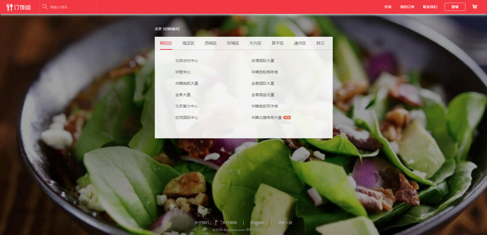
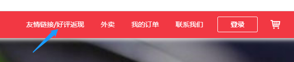
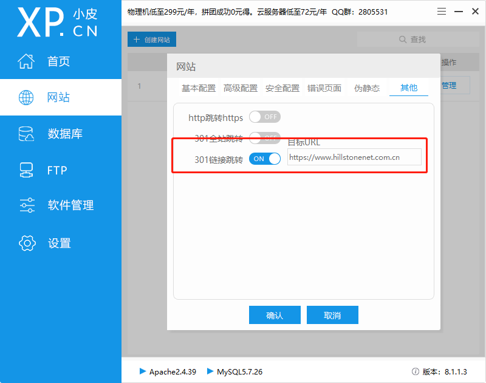

# 网站篡改

以开源的php网站为例：https://github.com/geeeeeeeek/dingfanzu。

将代码下载并解压，放在phpstudy的WWW目录下：




## 1. 网站被植入webshell

网站被植入webshell，意味着网站存在可利用的高危漏洞，攻击者通过利用漏洞入侵网站，写入webshell接管网站的控制权。为了得到权限 ，常规的手段如：前后台任意文件上传，远程命令执行，SQL注入写入文件等。

一般获得webshell是网站篡改的前提。

发现网站被篡改后，想要手动发现webshell文件，可以查看网站被篡改文件的访问日志，发现可疑的IP，确定了篡改网站的IP后，再看该IP访问了哪些文件，其中就有可能包含webshell文件。

## 2. 网站挂黑链

### 2.1 黑链及其危害

黑链是搜索引擎优化（SEO）手法中相当普遍的一种手段， 这种技术正在成为黑客获利的常用手段，简单来说即通过入侵篡改他人网站，植入暗链代码，劫持他人网站流量，用作不法内容宣传，从而获利。

最常见的黑链就是通过各种网站程序漏洞获取搜索引擎权重较高网站的WebShell，进而在被黑网站上链接自己的网站，是一种为高效率提升排名而使用的作弊手法。政府和企业的官方网站、知名媒体平台是黑客最喜欢的植入对象，因为这些网站关注度高，流量劫持成功的收益巨大。

通常来讲，受害主机存在以下两个明显的危害：

* 组织单位社会形象严重受损

存在漏洞的搜索引擎权重或者PR较高的网站容易被植入博彩、色情、游戏等黑链，当访问者点击被挂黑链网站时，会被引导到相关的博彩、色情网站，使组织单位的社会形象受损，网站运营者甚至要承担相应的法律责任。

* 严重影响网站的推广

被挂黑链网站由于存在太多单向链接，会造成网站快照更新慢、网站排名下降等问题。而网站一旦被搜索引擎发现黑链行为，会被降权或者从关键词排名剔除，非常损害网站的推广。

同时，黑链已经被植入受害主机，表明主机很可能已被黑客控制，现有的安全防护体系已经部分甚至完全失效，还存在以下潜在风险：

* 组织单位遭受更进一步的损失

攻击者可以进一步对网站实行挂马、信息篡改、信息窃取和信息监控，严重威胁用户网站的安全，导致企事业单位遭受更进一步的资产损失。

* 遭受监管单位通报

黑客将恶意程序植入受害主机，控制主机作为“肉鸡”攻击互联网上的其他单位，违反网络安全法，遭致网信办、网安等监管单位的通报处罚。

### 2.2 挂黑链方法

黑链一般为暗链，因为明链极易被网站管理员或用户发现。

* **明链**

明链是指顾客在网站页面可以清楚查寻的连接，它一般重要是指网站底部可以看到的**友情链接**，也许网站內部的频道连接、内部链接等可以称之为明链。

例如在订餐网站首页添加好评返现的链接：

```html
<div class="login fl">
    <span class="header-operater">
        <a href="链接">友情链接/好评返现</a>
        <a href="/">外卖</a>
        <a href="https://www.baidu.com">我的订单</a>
        <a href="/about.html?p=lianxiwomen">联系我们</a> 
    </span> 
    <a id="header-login" class="navBtn f-radius f-select n" data-reveal-id="myModal" data-animation="fade">登录</a>
</div>
```

效果如下：




或者直接修改网站原本的跳转链接，例如下面将**我的订单**链接修改为恶意链接：

```html
<div class="login fl">
    <span class="header-operater">
        <a href="/">外卖</a>
        <!-- <a href="/account/order">我的订单</a> -->
        <a href="链接">我的订单</a>    <!-- 修改<a>标签的href -->
        <a href="/about.html?p=lianxiwomen">联系我们</a> 
    </span> 
    <a id="header-login" class="navBtn f-radius f-select n" data-reveal-id="myModal" data-animation="fade">登录</a>
</div>
```

点击**我的订单**即可跳转到恶意网站。

这种方法过于明显，很容易被管理员或网站用户发现。

* **暗链**

暗链是相对于明链来讲的，比如，查看某个网页的源代码，有很多超链接，但在该网页上并没有看见它们。像这种在网站前台看不见，只存在于源代码中的超链接就叫作暗链，它通过各种非正常的手段把链接隐藏了，也叫隐链。

1）链接位于页面可见范围之外。可以将position位置属性设置成负数，则链接无法显示在可见页面之内。

```html
<div style="position: absolute; left: -999px;top: -999px;"><a href="暗链网址/">关键词</a></div>
<div style="position: absolute; top: -999px;right: -999px;"><a herf="暗链网址">关键词</a></div>
```

这样在页面上看不出与篡改前有任何区别。

2）链接块大小设置为0，同样在页面上不显示。

```html
<div style="width: 0px; height: 0px;"><a herf="暗链网址">关键词</a></div>
<a href="暗链网址" style="line-height:0px; font-size:0px;">关键词</a>
```

3）利用跑马灯marquee属性，链接以跑马灯形式迅速闪现，跑马灯的长宽设置很小，同时将闪现的频率设置很大，使得查看页面时不会有任何影响。

```html
<marquee height=1 width=4 scrollamount=3000 scrolldelay=20000><a href= "暗链网址">关键字</a></marquee>
```

4）利用`display:none`和`visibility:hidden`隐藏区域里的内容。

```html
<div style="display:none;"><a href="暗链网址">关键字</a></div>
<div styLe= "visibility:hidden;"><a href= "暗链网址">关键字</a></div>
```

5）链接颜色与背景色相同，链接文字使用低像素。

```html
<a href="暗链网址" style="color:#f63440;">关键词</a>
```

解决方法：及时对比网站源码与备份源码的区别。

## 3. 源网站劫持

1）篡改`<meta>`

```html
<head>
	<!-- <meta http-equiv="Content-Type" content="text/html; charset=UTF-8" /> -->
	<meta http-equiv="refresh" content="1;url=恶意网站链接"> 
			......
			
</head>
```


2）利用JS

方法1：在`<head>`种添加如下代码

```html
<script type="text/javascript">
	window.location.href="https://www.baidu.com";
</script>
```

方法2：加载js文件

修改原来的js文件，或者添加一个新的js文件如下，或者加载远程的：

```
function Redirect(){
    window.location.href="恶意网站链接";
}
Redirect();
// 这个文件可以写的复杂一些，例如设置当手机端访问的时候才会跳转
```

再去原网站加载这个文件：

```
<script src="js文件地址"></script>
```

可以通过抓包查看，是否加载了远程的js文件。对于网站中引入的js文件多注意。

3）篡改网站根目录的`.htaccess`文件

```
Options +FollowSymLinks
RewriteEngine on
RewriteRule ^(.*)$ 恶意网站链接 [L,R=301]
```

经常查看网站的配置文件，若发现被篡改及时修复。

4）篡改Apache配置文件（我这里为`Apache2.4.39\conf\vhosts\0localhost_80.conf`文件）假设公司官网为想要设置的恶意链接：

```
RedirectMatch permanent ^/(.*) https://www.hillstonenet.com.cn
```

就相当于phpstudy配置如下：



```
RedirectMatch permanent ^/(.*) https://www.hillstonenet.com.cn/$1
```

相当于phpstudy：


上面两种效果一样。

## 4. 搜索引擎劫持

`<head>`添加

```html
    <script>
        var s = document.referrer;
        if (s.indexOf("google") != -1 || s.indexOf("baidu") != -1) {
            window.location.href = "恶意链接";
        }
    </script>
```

当对应的搜索引擎访问时，就会跳转到恶意链接。

## 5. 篡改网站源码备份文件

有些攻击者不仅会简单加载JS文件等方法篡改网站，还会篡改网站的的源码备份文件，使得当管理员发现了网站的问题，会使用备份的网站源码重新搭建，网站也会受到影响。例如把webshell文件隐藏在其中，即使网站被重新搭建，攻击者还是能控制网站并篡改。所以备份网站源码时，要异地备份，并尽量备份原生的代码。


## 6. 篡改图片

网站首页被恶意篡改，比如复制原来的图片，PS一下，然后替换上去。一般公司网站会贴上公众号的二维码或客服团队的微信二维码，这种图片一旦被篡改，公司客户就很容易收到诈骗团队，冒充公司客服进行诈骗。


## 7. 篡改管理员账号

某网站存在sql注入等漏洞，攻击者可以利用SQL语句修改管理员的密码，登录到管理员后台，进行各种操作。

