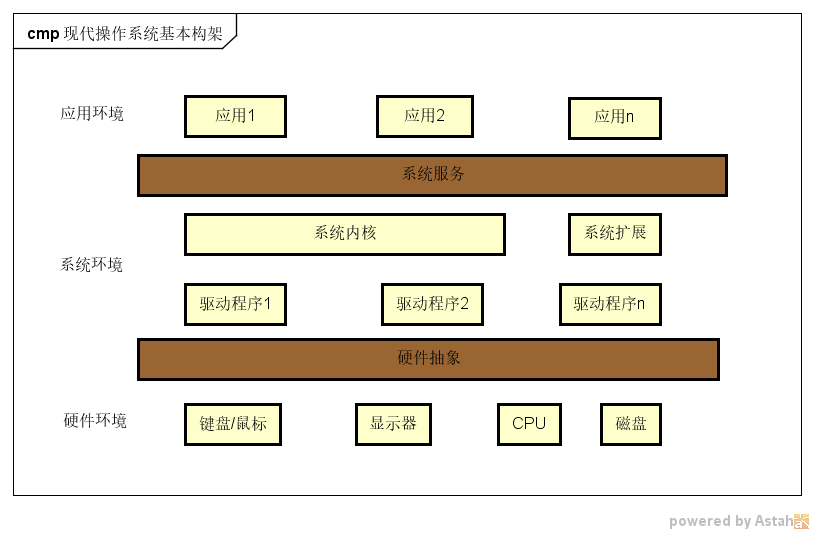
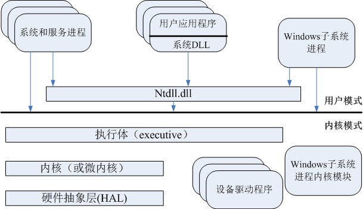

---
tags:
  - 防御规避
  - Windows
category: 网络安全
---
# Windows构架及进程创建总结

## Windows构架

下面是现代操作系统的基本结构示意图，结合示图，可以更好地理解操作系统的作用。

由上图可知，对应的应用通过操作系统提供的系统服务来进行硬件的操作，例如打字，看电影，应用是不需要同硬件直接打交道的，这样可以节省大量的精力，而与硬件打交道的脏活累活由操作系统来做。同时，多个任务在“同时进行”中，操作系统需要保证对应的资源分配，让多个任务正常运行。
  

下图是windows系统结构图，

我们可以看到windows是分为**用户**和**内核**这两种模式，顾名思义，这两种模式之间的主要区别是对系统数据访问权限的不同，内核模式有更高的权限，采取这种做法的一个原因是保护操作系统，避免应用程序错误影响到操作系统本身。操作系统核心运行在内核模式下，应用程序的代码运行在用户模式中下。当应用程序使需要使用系统内核或内核拓展模块(内核驱动程序)所提供的服务事，应用程序会通过硬件指令从用户模式切换到内核模式中，当系统内核完成了所请求的服务后，重新切换到用户模式下。所以，有时候多线程程序不一定高效，是因为线程切换，管理等需要由用户模式切换到内核模式，这类操作会占用很多cpu周期。

### 用户模式

由图可知，用户模式进程可以分为**系统支持进程**、 **服务进程**、 **用户应用程序**、 **子系统**四种基本类型：

- 固定的**系统支持进程**(system support process), 比如登录进程和会话管理器(session manager)。   
- **服务进程**(service process) windows的服务, 例如，任务管理器。windows服务一般独立于用户登录而运行。
- **用户应用程序**(user application),顾名思义，用户写的程序，例如QQ，迅雷等等。    
- **子系统进程**，子系统进程是运行在用户模式下的进程，用于支持特定类型的应用程序或提供特定功能。它们通过调用内核模块提供的服务来完成任务。

Windows 支持的子系统涵盖了从传统的 Windows 应用到 Linux 和 Android 应用的运行环境，主要包括：
- **Win32 子系统**（核心子系统）
- **POSIX 子系统**（历史支持）
- **Windows Subsystem for Linux (WSL)**（现代 Linux 支持）
- **.NET 子系统**（托管代码支持）
- **Windows Subsystem for Android (WSA)**（Android 支持）

	1. Win32 子系统：提供 Windows API，支持大多数 Windows 应用程序，是 Windows 的核心子系统，负责管理窗口、图形、输入设备、文件系统等，支持 32 位和 64 位应用程序，主要用于运行传统的 Windows 桌面应用程序。
	2. POSIX 子系统：支持基于 POSIX 标准的应用程序，提供对 UNIX 风格应用程序的兼容性，在早期版本的 Windows（如 Windows NT）中较为常见，后续被 Windows Subsystem for Linux (WSL) 替代，主要用于运行符合 POSIX 标准的 UNIX 应用程序（较少使用）。
	3. Windows Subsystem for Linux (WSL)：允许用户在 Windows 上运行原生的 Linux 二进制程序，提供一个完整的 Linux 用户模式环境，支持多种 Linux 发行版（如 Ubuntu、Debian、Fedora 等），WSL 2 引入了完整的 Linux 内核，性能更高，主要用于开发人员在 Windows 上运行 Linux 工具和脚本。
	4. OS/2 子系统（已废弃）：支持运行 IBM OS/2 应用程序，在早期的 Windows NT 系列中提供支持，后续版本中逐渐被移除，主要用于运行 OS/2 应用程序（历史遗留功能）。
	5. .NET 子系统：支持基于 .NET Framework 和 .NET Core 的托管代码应用程序，提供跨平台支持（通过 .NET Core 和 .NET 6+），支持多种语言（如 C#、VB.NET、F# 等），主要用于开发和运行现代化的 .NET 应用程序。
	6. DOS 子系统 (NTVDM)：支持运行 16 位的 MS-DOS 应用程序，在 32 位版本的 Windows 中提供支持，但在 64 位版本的 Windows 中已被移除，主要用于运行旧的 DOS 程序（仅限 32 位系统）。
	7. Windows Subsystem for Android (WSA)：支持运行 Android 应用程序，在 Windows 11 中引入，提供一个虚拟化环境运行 Android 应用，主要用于在 Windows 上运行 Android 应用程序。

这些子系统使 Windows 能够兼容多种应用程序环境，涵盖从传统的 Windows 应用到 Linux 和 Android 应用的运行支持。

`ntdll.dll` 是 Windows 系统的核心动态链接库，位于 System32文件夹，提供底层系统调用接口（Native API），用于用户模式程序与内核模式交互。它负责内存管理、线程管理、异常处理等功能，是许多系统组件和应用程序运行的基础。开发者通常通过更高级别的 API 间接使用它。

### 内核模式

内核模式的组成部分包括：

- **Windows 执行体**：提供基本的操作系统服务，例如内存管理、进程和线程管理、安全性、I/O、网络和跨进程通信。
- **Windows 内核**：提供低层次的操作系统功能，例如线程调度、中断和异常分发、多处理器同步等，并为执行体提供基础支持。
- **设备驱动程序 (Device Driver)**：包括硬件设备驱动程序和非硬件设备驱动程序（如文件系统和网络驱动程序），将用户的 I/O 调用转换为硬件 I/O 请求。
- **硬件抽象层 (HAL)**：隔离内核、设备驱动程序和执行体与硬件的差异，使操作系统能够适配不同的硬件平台。

执行体与内核的区别：
Windows 内核负责实现操作系统的基本机制，而所有策略决定则留给执行体。执行体中的对象大多封装了一个或多个内核对象，并通过句柄等方式暴露给应用程序。这种设计体现了机制与策略分离的思想。我们在设计接口时也应考虑这一原则，尽量提供基础功能，具体的变化由这些功能组合实现，从而使接口能够灵活适应不断变化的需求。

## 进程创建过程

在 Windows 操作系统中，进程的创建确实可以在 **Ring 3（用户模式）** 和 **Ring 0（内核模式）** 下进行，具体如下：

1. **Ring 3（用户模式）下的进程创建**
- **方式**：通过调用 Win32 API 函数 `CreateProcess` 或类似的高层次接口。
- **过程**：
  - 用户模式程序调用 `CreateProcess`。
  - `CreateProcess` 会通过系统调用（如 `NtCreateProcess`）将请求传递到内核模式。
  - 内核模式完成实际的进程创建工作（如分配资源、初始化进程对象等）。
- **特点**：
  - 用户模式下的进程创建是通过高层次的 API 完成的，开发者无需直接处理底层细节。
  - 这是大多数应用程序创建进程的常见方式。

**2. Ring 0（内核模式）下的进程创建**
- **方式**：通过调用内核模式函数（如 `PsCreateSystemProcess` 或 `PsCreateProcess`）。
- **过程**：
  - 内核模式代码（如驱动程序或内核组件）直接调用内核函数来创建进程。
  - 内核模式下的进程创建可以绕过用户模式的 API，直接操作内核数据结构。
- **特点**：
  - 通常用于系统级任务，例如驱动程序创建辅助进程或系统服务。
  - 需要更高的权限，且开发者需要对内核机制有深入了解。
  - 如果操作不当，可能导致系统崩溃或安全问题。

**Ring 3 和 Ring 0 的区别**

| **特性**   | **Ring 3（用户模式）**            | **Ring 0（内核模式）**              |
| -------- | --------------------------- | ----------------------------- |
| **权限级别** | 低权限，受内核保护                   | 高权限，完全访问系统资源                  |
| **调用方式** | 通过高层 API（如 `CreateProcess`） | 直接调用内核函数（如 `PsCreateProcess`） |
| **适用场景** | 普通应用程序                      | 系统级任务或驱动程序                    |
| **安全性**  | 更安全，受内核保护                   | 操作不当可能导致系统崩溃                  |

### 进程创建流程

当一个应用程序调用某个进程创建函数，比如`CreateProcess`、`CreateProcessAsUser`、`CreateProcessWithTokenW`、`CreateProcessWithLogonW`时，一个windows进程就被创建起来了。

创建一个windows进程的过程，是由操作系统的三个部分执行一些列步骤来完成的

1. 客户方的windows库Kernel32.dll
2. windows执行体
3. windows子系统进程(Csrss.exe)

由于windows是多环境子系统的体系结构，因此，创建一个windows执行体进程对象(其他的子系统也可以使用)，与创建一个windows进程的工作是分离的。

也就是说windows在创建进程的过程中有两大类的工作要做:

1. windows系统加入的语义
2. 执行体/内核层对象等的创建

下面概括了一下在利用windows的`CreateProcess`函数来创建一个进程时所涉及的主要阶段:

**1. 参数解析和验证**  
`CreateProcess` 函数首先验证传入的参数（如可执行文件路径、命令行参数、环境变量等），检查调用者是否具有足够的权限来创建进程。用户模式下调用 `CreateProcess`，最终通过 `ntdll.dll` 调用 `NtCreateUserProcess` 进入内核模式。

**2. 创建和初始化进程对象**  
内核分配并初始化一个新的进程对象。相关函数包括 `PsCreateProcess`，用于创建并初始化内核中的 `EPROCESS` 结构（进程对象）；`MmCreateProcessAddressSpace`，为新进程分配虚拟地址空间；`ObInsertObject`，将新创建的进程对象插入内核对象管理器，并分配句柄。

**3. 创建初始线程**  
为新进程创建一个主线程。相关函数包括 `PsCreateThread`，用于创建并初始化内核中的 `ETHREAD` 结构（线程对象）；`ObInsertObject`，将新线程对象插入内核对象管理器，并分配句柄。

**4. 加载可执行文件**  
加载器将目标可执行文件（如 `.exe` 文件）加载到新进程的虚拟地址空间。相关函数包括 `MmMapViewOfSection`，将可执行文件映射到新进程的地址空间；`IoCreateFile`（I/O 子系统），打开目标可执行文件并读取内容；`MmCreateProcessAddressSpace`，确保虚拟地址空间中正确加载了可执行文件和所需的动态链接库（如 `ntdll.dll`、`kernel32.dll`）。

**5. 初始化用户模式环境**  
初始化新进程的用户模式环境，包括堆、全局变量和线程本地存储（TLS）。相关函数包括 `MmMapViewOfSection`，用于加载动态链接库（如 `ntdll.dll`）；`PsCreateProcess`，设置进程的用户模式上下文。

**6. 通知父进程**  
如果调用者指定了同步选项（如 `CREATE_SUSPENDED`），新进程会被挂起，直到调用者显式恢复线程。如果未指定挂起选项，线程会立即进入调度队列。相关函数包括 `PsResumeThread`，用于恢复线程执行（如果未指定挂起标志）。

**7. 返回句柄**  
`CreateProcess` 函数返回新进程和主线程的句柄。调用者可以通过这些句柄与新进程交互（如等待进程结束、获取进程状态等）。相关函数包括 `ObInsertObject`，确保进程和线程对象的句柄正确返回给调用者。

**总结**

1. **参数解析和验证**：通过 `NtCreateUserProcess` 进入内核模式。
2. **创建和初始化进程对象**：调用 `PsCreateProcess` 和 `MmCreateProcessAddressSpace`。
3. **创建初始线程**：调用 `PsCreateThread`。
4. **加载可执行文件**：调用 `MmMapViewOfSection` 和 `IoCreateFile`。
5. **初始化用户模式环境**：调用 `MmMapViewOfSection` 加载动态链接库。
6. **通知父进程**：调用 `PsResumeThread` 恢复线程执行。
7. **返回句柄**：通过 `ObInsertObject` 返回进程和线程句柄。

这些内核模式函数共同完成了进程的创建和初始化工作。