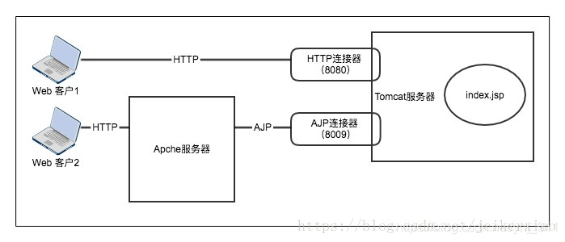
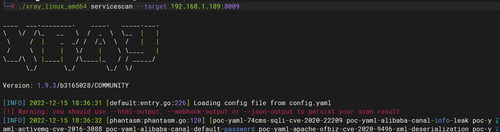
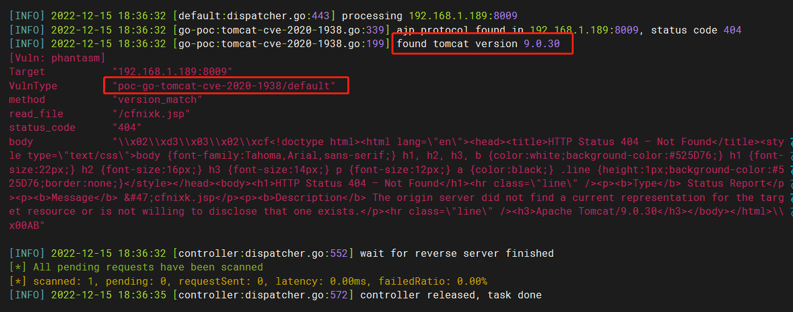
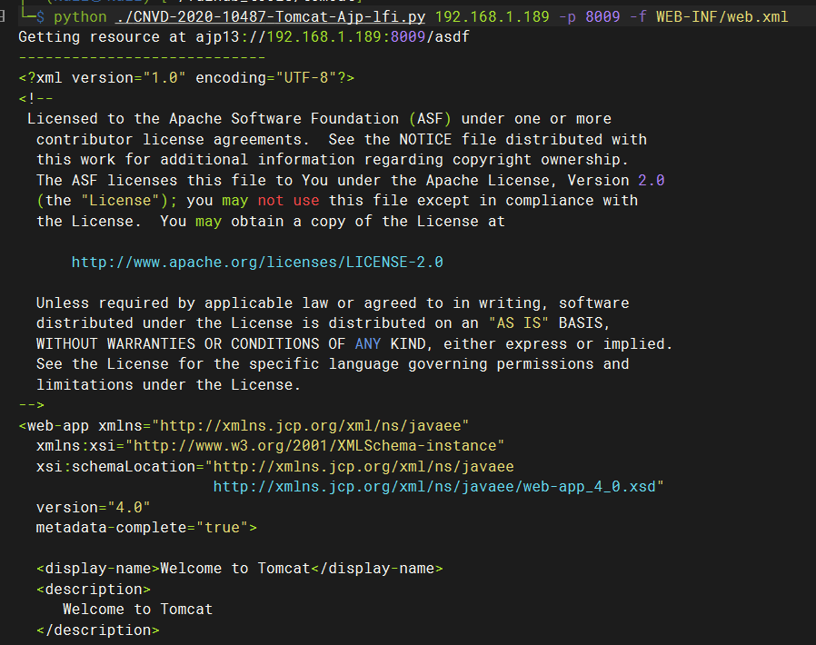

# 漏洞名称：Aapache Tomcat AJP 文件包含漏洞

<!-- more -->

---

## 漏洞介绍

> [国家信息安全漏洞库 (cnnvd.org.cn)](http://www.cnnvd.org.cn/index.html)

[Ghostcat（幽灵猫）](https://www.chaitin.cn/zh/ghostcat) 是由长亭科技安全研究员发现的存在于 Tomcat 中的安全漏洞，由于 Tomcat AJP 协议设计上存在缺陷，攻击者通过 Tomcat AJP Connector 可以读取或包含 Tomcat 上所有 webapp 目录下的任意文件。

---

### 漏洞危害

攻击者有可能实现任意文件读取，例如可以读取 webapp 配置文件或源代码。此外在目标应用有文件上传功能的情况下，配合文件包含的利用还可以达到远程代码执行的危害。

---

### 影响范围

Apache Tomcat 6
Apache Tomcat 7 < 7.0.100
Apache Tomcat 8 < 8.5.51
Apache Tomcat 9 < 9.0.31

---

## 漏洞原理

Tomcat 服务器通过 Connector 连接器组件与客户程序建立连接，Connector 表示接收请求并返回响应的端点。即 Connector 组件负责接收客户的请求，以及把 Tomcat 服务器的响应结果发送给客户。Tomcat 在 server.xml 中配置了两种连接器：HTTP Connector 和 AJP Connector。拥有 HTTP 连接器，Tomcat 才能成为一个 web 服务器，但还额外可处理 Servlet 和 jsp。AJP 连接器可以通过 AJP 协议和另一个 web 容器进行交互。配置如下：

```
<!-- Define a non-SSL/TLS HTTP/1.1 Connector on port 8080 -->
<Connector port="8080" protocol="HTTP/1.1"
           connectionTimeout="20000"
           redirectPort="8443" />

<!-- Define an AJP 1.3 Connector on port 8009 -->
<Connector port="8009" protocol="AJP/1.3" redirectPort="8443" />
```



Tomcat 在接收 AJP 请求的时候调用`org.apache.coyote.ajp.AjpProcessor`来处理 ajp 消息，其中，`prepareRequest`将 AJP 里面的内容取出来设置成`request`对象的属性，因此可以控制`request`对象的三个属性:`javax.servlet.include.request_uri`、`javax.servlet.include.path_info`和`javax.servlet.include.servlet_path`，然后封装成对应的 request 之后，执行相应的操作，例如构造下面参数，实现文件读取

该漏洞主要原因就是：

1.  AJP Connector 暴露给客户端了，AJP 是 Tomcat 和其他 web 服务器之间内部使用的。
2.  AJP 1.3 协议存在缺陷，导致相关参数可控，攻击者利用该漏洞可通过构造特定参数，读取服务器 webapp 下的任意文件。若服务器端同时存在文件上传功能，攻击者可进一步实现远程代码的执行。

---

### 靶机环境

vulhub/tomcat/CVE-2020-1938

---

### 利用方式 1

漏洞探测工具 xray（https://github.com/chaitin/xray）进行探测，探测出tomcat版本为9.0.30

```
./xray_linux_amd64 servicescan --target 192.168.1.189:8009
```





---

### 利用方式 2

使用https://github.com/YDHCUI/CNVD-2020-10487-Tomcat-Ajp-lfi 中的 poc，读取 WEB-INF/web.xml 文件

```
python ./CNVD-2020-10487-Tomcat-Ajp-lfi.py 192.168.1.189 -p 8009 -f WEB-INF/web.xml
```



---

## 威胁防护建议

---

### 用户处置建议

1. 更新到安全版本：Apache Tomcat 7.0.100、8.5.51、9.0.31

2. 关闭 AJP 服务：修改 Tomcat 配置文件 Service.xml 将`<Connector port="8009" protocol="AJP/1.3" redirectPort="8443" />`注释掉
3. 配置 ajp 配置中的 secretRequired 跟 secret 属性来限制认证

---

### 安全产品检测建议

检测`javax.servlet.include.request_uri`、`javax.servlet.include.path_info`和`javax.servlet.include.servlet_path`
