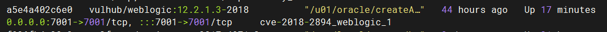
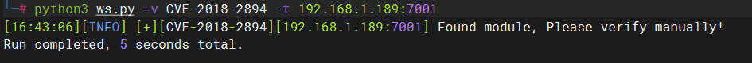
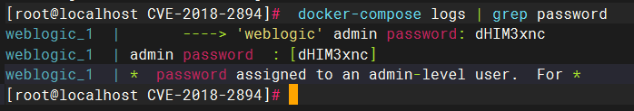
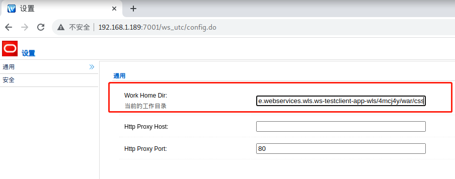
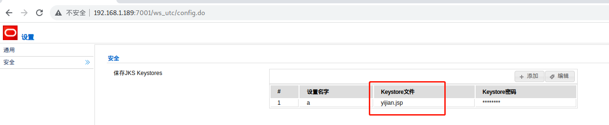
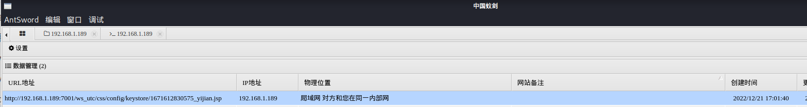
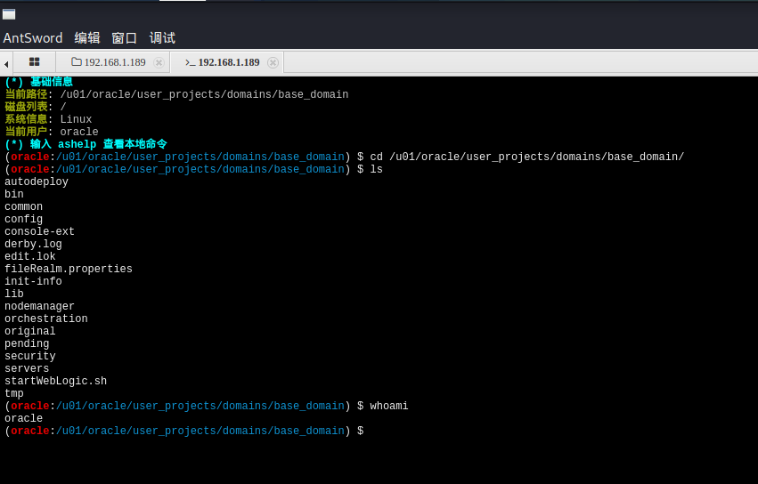

# 漏洞名称：Weblogic 任意文件上传漏洞

---

## 漏洞介绍

[国家信息安全漏洞库 (cnnvd.org.cn)](http://www.cnnvd.org.cn/index.html)

CNCERT发现了Oracle公司出品的基于JavaEE结构的中间件WebLogic产品存在一个远程上传漏洞，并得到了厂商的确认，危害程度评分高达9.8分。WebLogic管理端未授权的两个页面存在任意上传getshell漏洞，可直接获取权限。两个页面分别为`/ws_utc/begin.do`和`/ws_utc/config.do`

### 漏洞危害

WebLogic管理端未授权的两个页面存在任意上传getshell漏洞，可直接获取权限。

------

### 影响范围

* weblogic 10.3.6.0
* weblogic 12.1.3.0
* weblogic 12.2.1.2
* weblogic 12.2.1.3

---

## 漏洞原理

CVE-2020-2894是基于JavaEE结构的中间件WebLogic产品的一个远程上传漏洞，两个页面分为/ws_utc/begin.do和/ws_utc/config.do。访问 [http://IP:7001/ws_utc/config.do](http://ip:7001/ws_utc/config.do) 页面后点击左侧的“安全”菜单，添加一个Keystore，任意设置名字和密码，文件也是任意格式上传。但Web Service Test Page在“生产模式”下默认不开启，所以该漏洞有一定限制。

------

## 漏洞利用


---

### 靶机环境

 vulhub/weblogic/CVE-2018-2894



---

### 利用方式

工具：weblogicScanner https://github.com/0xn0ne/weblogicScanner，vulmap

#### 探测确认

使用 weblogicScanner探测是否存在该漏洞



​	**结果**：发现漏洞

#### 利用过程

* 访问http://your-ip:7001/console页面，因为是靶场环境，且Web Service Test Page在“生产模式”下默认不开启，所以该漏洞有一定限制。在这里通过靶场自带的命令可以获得登录密码，并登录。

```
docker-compose logs | grep password
```



例如我这里用户名为weblogic 密码dHIM3xnc

* 在后台页面左侧“域结构”中点击“base_domain”，在右侧下滑页面中点击“高级”-“启用Web服务测试页”，然后保存。

* 访问http://IP:7001/ws_utc/config.do页面，并修改“Work Home Dir”为如下目录提交

```
/u01/oracle/user_projects/domains/base_domain/servers/AdminServer/tmp/_WL_internal/com.oracle.webservices.wls.ws-testclient-app-wls/4mcj4y/war/css
```

 P.S. 这样设置的目的是将目录设置为“ws_utc”应用的css静态文件目录，而访问这个目录是不需要权限的。这也是该漏洞能够成功利用的关键



* 在上一个页面的左侧点击安全-添加，上传蚁剑jsp木马



* 上传之后，在响应包中查看时间戳

使用蚁剑连接：`http://your_ip:7001/ws_utc/css/config/keystore/[时间戳]_[文件名]`





------

## 威胁防护建议

1.设置Config.do、begin.do页面登录授权后访问；

2.IPS等防御产品可以加入相应的特征；

3.升级到官方最新版本。

