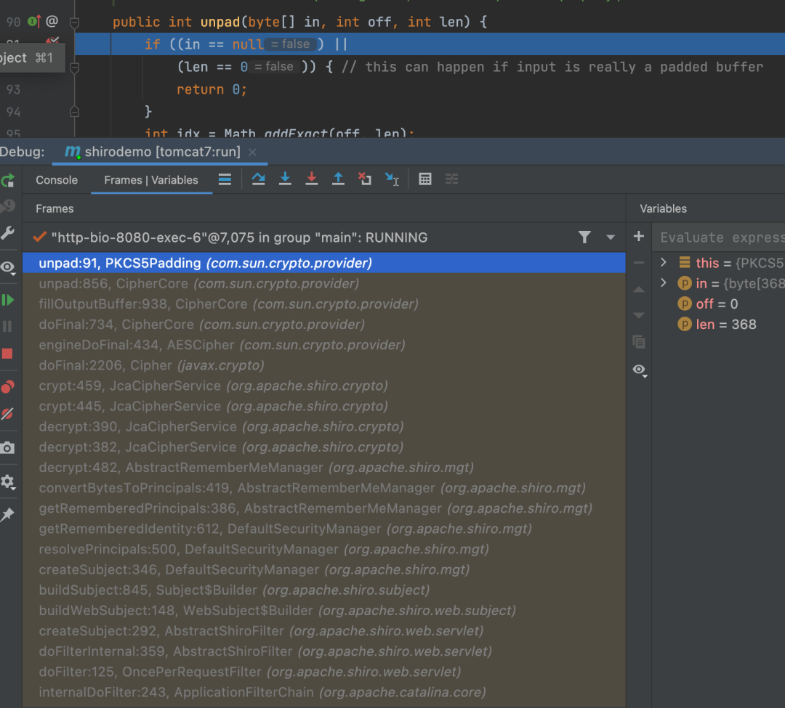
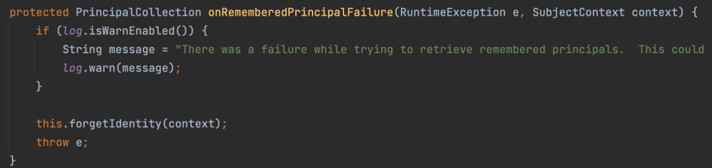
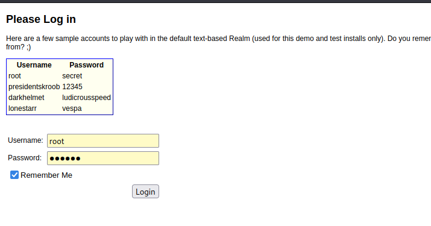
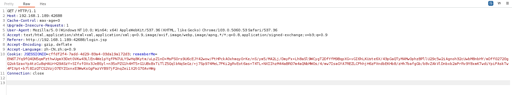
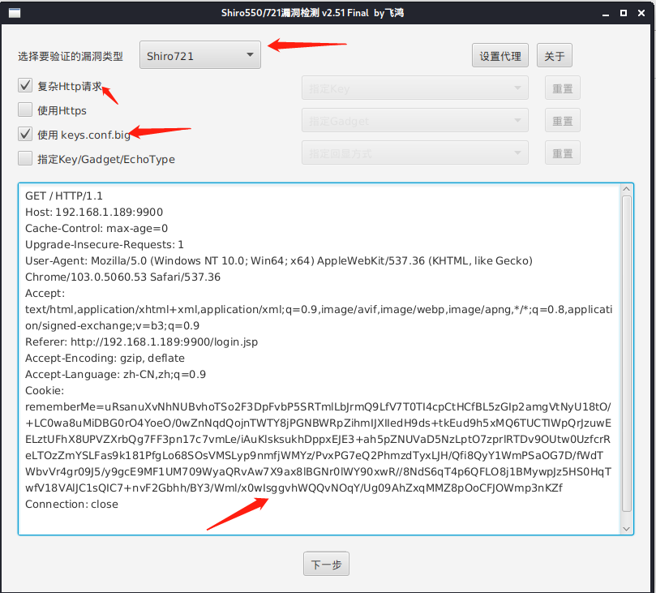
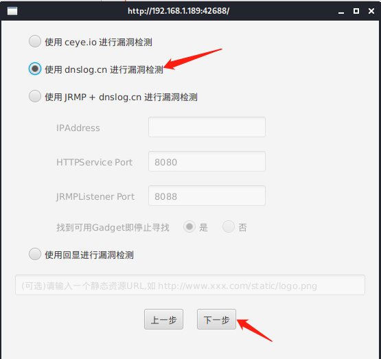
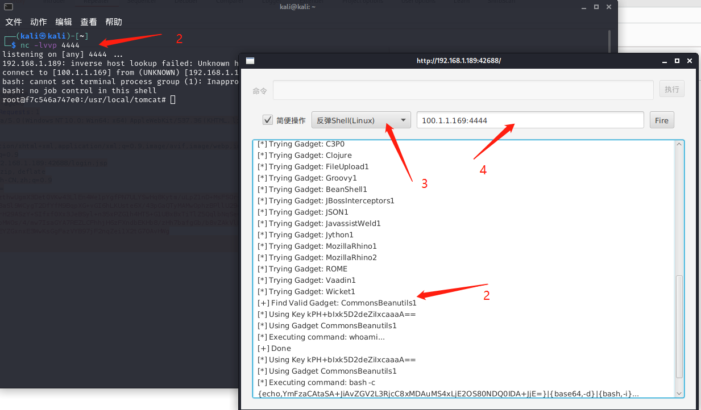

# 反序列化\_shiro_CVE-2019-12422_shiro721 反序列化命令执行漏洞

## <!-- more -->

---

## 漏洞介绍

> [国家信息安全漏洞库 (cnnvd.org.cn)](https://www.cnnvd.org.cn/home/loophole)
>
> [NVD - Search and Statistics (nist.gov)](https://nvd.nist.gov/vuln/search)

---

Apache Shiro™（读作“sheeroh”，即日语“城”）是一个开源安全框架，提供身份验证、授权、密码学和会话管理。Shiro 框架直观、易用，同时也能提供健壮的安全性。Shiro 1.2.4 以下版本代码中使用了默认密钥，造成了 shiro550 漏洞，在后续的版本更新中，修复了之前 shiro-550 的固定 KEY 值，官方移除了代码中的默认密钥，要求开发者自己设置，如果开发者没有设置，则默认动态生成，降低了固定密钥泄漏的风险。然后后续的流程还是没变， 1.2.5 <= Shiro < 1.4.2 版本中仍然存在类似的漏洞，即 shiro-721。

---

### 漏洞危害

利用 java 反序列化造成远程命令执行。

---

### 影响范围

1.2.5 <= Shiro < 1.4.2

---

### 漏洞原理

Shiro 使用了 AES-128-CBC 模式对 cookie 进行加密，导致恶意用户可以通过 Padding Oracle 攻击方式构造序列化数据进行反序列化攻击,例如 SHIRO-550，Shiro-721。攻击者通过已知 RememberMe 密文使用 Padding Oracle Attack 爆破和篡改密文，构造可解密的恶意的反序列化数据，触发反序列化漏洞。

#### 源码分析

Padding Oracle Attack 是利用类似于盲注的思想来判断是否爆破成功的，在验证 Padding 失败时的返回信息应该不同，那我们看一下在 Shiro 中，验证 Padding 失败时的返回值。

AbstractRememberMeManager#getRememberedPrincipals 开始

```
public PrincipalCollection getRememberedPrincipals(SubjectContext subjectContext) {
    PrincipalCollection principals = null;
    try {
        byte[] bytes = getRememberedSerializedIdentity(subjectContext);
        //SHIRO-138 - only call convertBytesToPrincipals if bytes exist:
        if (bytes != null && bytes.length > 0) {
            principals = convertBytesToPrincipals(bytes, subjectContext);
        }
    } catch (RuntimeException re) {
        principals = onRememberedPrincipalFailure(re, subjectContext);
    }
    return principals;
}
12345678910111213
```

负责解密的 convertBytesToPrincipals 方法会调用 CipherService 的 decrypt 方法，调用栈如下所示如下:



其中 PKCS5Padding#unpad 方法对数据的填充格式进行判断，有问题会返回 -1；当返回值小于 0 时，CipherCore#doFinal 方法会抛出 BadPadding-Exception 异常；

接着 JcaCipherService#crypt 方法、 AbstractRe-memberMeManager#getRememberedPrincipals 方法均返回异常，而且 AbstractRemember-MeManager#getRememberedPrincipals 方法还好调用 onRememberedPrincipalFailure 移除 rem-emberMe cookie 并添加 deleteMe。



由此可见，只要 padding 错误，服务端就会返回一个 cookie: rememberMe=deleteMe;攻击者可以借由此特征进行 Padding Oracle Attack。

---

## 漏洞利用

---

### 利用方式 1

---

#### 漏洞利用思路

在 cookie 中使用的是 AES-128-CBC 模式进行的加密，在加密流程中使用了 Padding 填充，这里导致用户可以通过[Padding Oracle 攻击](https://cloud.tencent.com/developer/article/2130129)来生成攻击代码来构造恶意的 rememberMe 字段，然后触发反序列化攻击，最终导致的任意代码执行。本漏洞实际并不是针对 shiro 代码逻辑的漏洞，而是针对 shiro 使用的 AES-128-CBC 加密模式的攻击。

#### 漏洞利用过程

本次漏洞复现使用工具：https://github.com/feihong-cs/ShiroExploit-Deprecated。或者可以参考https://github.com/inspiringz/Shiro-721

登录



抓包



填写到工具中



选择



结果



---

#### 威胁防护建议

拦截 Cookie 中长度过大的 rememberMe 值

---

#### 用户处置建议

升级 Shiro 到最新版
