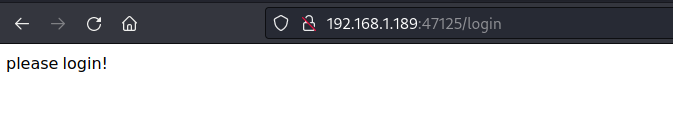
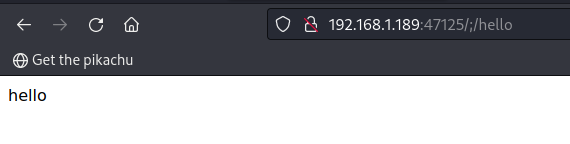

# 权限绕过\_shiro_CVE-2020-11989_Apache Shiro782 权限绕过漏洞

## <!-- more -->

---

## 漏洞介绍

> [国家信息安全漏洞库 (cnnvd.org.cn)](https://www.cnnvd.org.cn/home/loophole)
>
> [NVD - Search and Statistics (nist.gov)](https://nvd.nist.gov/vuln/search)

---

Apache Shiro 是美国阿帕奇（Apache）软件基金会的一套用于执行认证、授权、加密和会话管理的 Java 安全框架。使用 Shiro 的易于理解的 API，可以快速、轻松地获得任何应用程序，从最小的移动应用程序到最大的网络和企业应用程序。

近日，监测发现 Apache Shiro 官网安全更新，其中 Apache Shiro 1.5.3 之前版本中存在认证绕过漏洞（CVE-2020-11989）。当 Apache Shiro 与 Spring 动态控制器一起使用时，特制请求可能会导致身份认证绕过。

---

### 漏洞危害

在 Shiro<1.5.3 的情况下，将 Shiro 与 Spring Controller 一起使用时，相应请求可能会导致身份验证绕过。

---

### 影响范围

shiro < 1.5.3

---

### 漏洞原理

shiro 使用的时候需要先配置拦截规则如下：

```java
 // 配置路径拦截规则
Map<String, String> map = new LinkedHashMap<>();
map.put("/doLogin", "anon");
// map.put("/**", "authc");
map.put("/hello/**", "authc");  //配置成map.put("/hello/*", "authc");也可以
```

1.anon 为匿名拦截器，不需要登录就能访问，一般用于静态资源,或者移动端接口

2.authc 为登录拦截器，需要登录认证才能访问的资源。

使用了 shiro 的项目中，我们请求的 URL(URL1)，经过 shiro 权限检验(URL2)，最后到 springboot 项目找到路由来处理(URL3) 漏洞的出现就在 URL1,URL2 和 URL3 有可能不是同一个 URL，这就导致我们能绕过 shiro 的校验，直接访问后端需要首选的 URL。

#### 源码分析

由于 shiro 先获取的 url，然后会判断分号是否存在，如果存在就会把后面的删除，进入 shiro 匹配，匹配不上默认放行，之后 Spring web 对路径进行规范化从而访问到了相应的页面。

进入 decodeAndCleanUriString 方法，发现此方法会以分号将传入的 URI 进行截断，并将分号以及分号后面的数据进行清空，返回分号前面的 URI 数据，从而让/a/b;/c 变为/a/b。

```java
    private static String decodeAndCleanUriString(HttpServletRequest request, String uri) {
        uri = decodeRequestString(request, uri);
        int semicolonIndex = uri.indexOf(';');
        return (semicolonIndex != -1 ? uri.substring(0, semicolonIndex) : uri);
    }
```

Spring 拦截器的 decodeAndCleanUriString 方法中，Spring 对于分号处理的方式与 Shiro 不同，Spring 会先获取分号的位置，并检测分号后是否存在/，如果有，将/的位置记录在 slashIndex 变量中，并将分号前的数据与/之后的数据进行拼接，从而让/a/b;/c 变为/a/b/c。返回处理后的 requestURI。

```java
    private String decodeAndCleanUriString(HttpServletRequest request, String uri) {
        uri = this.removeSemicolonContent(uri);
        uri = this.decodeRequestString(request, uri);
        uri = this.getSanitizedPath(uri);
        return uri;
    }
```

---

## 漏洞利用

---

### 利用方式 1

---

#### 漏洞利用思路

利用 shiro 对路径中分号的错误处理方式进行绕过。

#### 漏洞利用过程

直接访问历经/hello/1，会被重定向到 login 界面：（vulfocus 中的环境有些错误，需要访问 hello/xxx 才会重定向）



访问/;/hello 即可绕过权限验证访问 hello 页面。



---

#### 威胁防护建议

检测并拦截 url 中的/;字符

---

#### 用户处置建议

升级 Shiro 到最新版本
