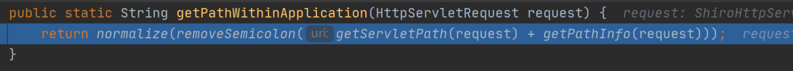
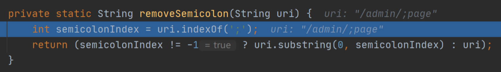
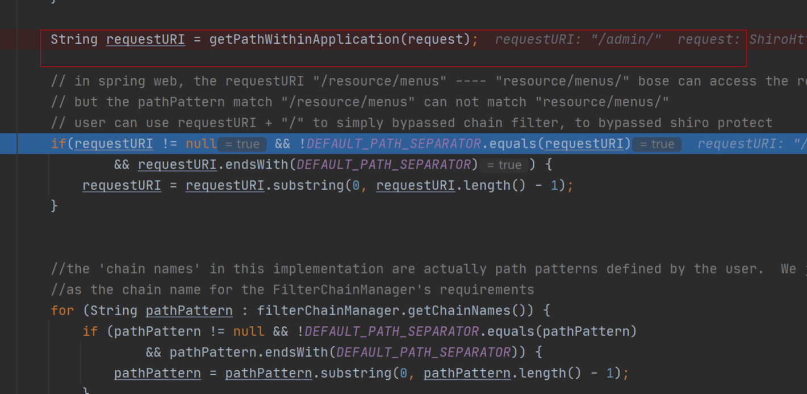
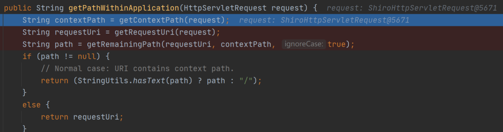
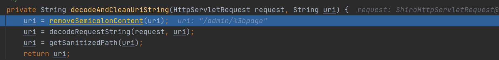
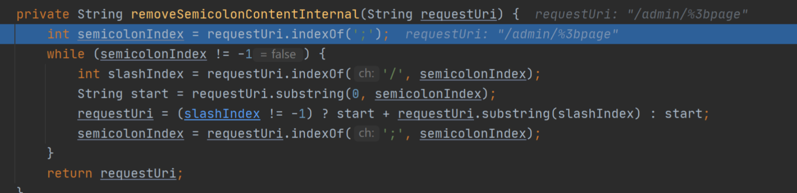
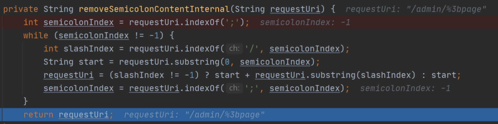
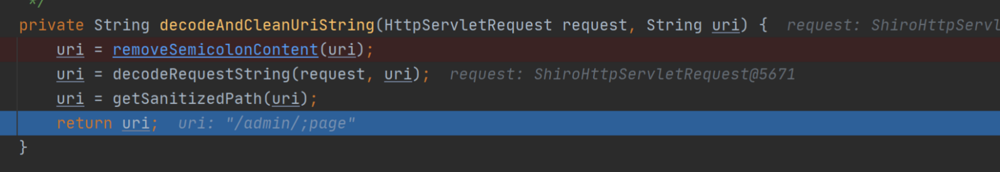
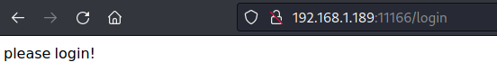

# 权限绕过_shiro_CVE-2020-13933_Apache Shiro权限绕过漏洞

---

## 漏洞介绍

> [国家信息安全漏洞库 (cnnvd.org.cn)](https://www.cnnvd.org.cn/home/loophole)
>
> [NVD - Search and Statistics (nist.gov)](https://nvd.nist.gov/vuln/search)

---

Apache Shiro是一个强大且易用的Java安全框架,执行身份验证、授权、密码和会话管理。2020年6月22日，Apache官方发布公告，修复了一个Apache Shiro身份验证绕过漏洞（CVE-2020-11989），攻击者可通过构造恶意请求利用该漏洞来绕过身份验证，并发布1.5.3版本。但这个修复并不完全，由于shiro在处理url时与spring仍然存在差异，shiro最新版仍然存在身份验证绕过漏洞。2020年8月17日Apache官方再次发布公告，进一步修复Apache Shiro身份验证绕过漏洞（CVE-2020-13933），并发布1.6.0版本。

---

### 漏洞危害

该漏洞源于Apahce Shiro 1.6.0之前版本处理身份验证请求时存在权限绕过漏洞，远程攻击者通过发送特制的HTTP请求，绕过身份验证，从而获取对应用程序的访问权限。

---

### 影响范围

Apache Shiro < 1.6.0

---

### 漏洞原理

shiro使用的时候需要先配置拦截规则如下：

```java
 // 配置路径拦截规则
Map<String, String> map = new LinkedHashMap<>();
map.put("/doLogin/", "anon");
map.put("/admin/*", "authc"); // 这里配置成/**就无法绕过了
```

1.anon为匿名拦截器，不需要登录就能访问，一般用于静态资源,或者移动端接口

2.authc为登录拦截器，需要登录认证才能访问的资源。

使用了shiro的项目中，我们请求的URL(URL1)，经过shiro权限检验(URL2)，最后到springboot项目找到路由来处理(URL3) 漏洞的出现就在URL1,URL2和URL3 有可能不是同一个URL，这就导致我们能绕过shiro的校验，直接访问后端需要首选的URL。


#### 源码分析

> 参考：https://xz.aliyun.com/t/8230

shiro处理URI如下所示：


经过对URI进行解码再去除分号，所以我们传入一个带编码的URI可以得到如下结果：

```
/admin/%3bpage
```




此处因为/admin/没有匹配到具体资源路径，所以通过过滤器到达Spring的处理逻辑。
而Spring的处理逻辑如下：


往下调试，这里得到的URI为解码前的原始URI：


之后在decodeAndCleanUriString方法里对URI进行相关处理。





注意这里Spring的处理逻辑为先去判断URI中是否存在分号，因为是编码过后的URI，所以未能直接识别出分号，所以index为-1，所以未进入if分支，从而仍然返回输入的带编码的URI。


接下来再进行对URI的解码。得到URI如下图：


之后进行匹配从而获取相应资源。

shiro后面的版本中为解决这种权限绕过问题，添加一个一个InvalidRequestFilter类，该类从全局上对分号，反斜杠和非ASCII字符进行了过滤。


---

## 漏洞利用

只适用于shiro权限配置为如下的情况：

```java
map.put("/doLogin/", "anon");
map.put("/admin/*", "authc"); // 这里配置成/**就无法绕过了
```

---

### 利用方式 1

---

#### 漏洞利用思路

利用shiro对路径中分号的错误处理方式进行绕过。

#### 漏洞利用过程

访问/admin/a会被重定向到login界面

尝试访问/admin/;/a 同样结果，说明利用CVE-2020-11989的绕过方法已经没有效果



将url中的分号进行url编码，即可绕过


---

#### 威胁防护建议

检测并拦截访问路径中的/;及其url编码

---

#### 用户处置建议

升级Shiro到最新版本

使用shiro授权时尽量避免使用单*的ant匹配。可以尝试将匹配方式更改为map.put(“hello/**”, “authc”)

