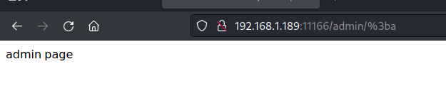

# 权限绕过\_shiro_CVE-2020-13933_Apache Shiro 权限绕过漏洞

## <!-- more -->

## 漏洞介绍

> [国家信息安全漏洞库 (cnnvd.org.cn)](https://www.cnnvd.org.cn/home/loophole)
>
> [NVD - Search and Statistics (nist.gov)](https://nvd.nist.gov/vuln/search)

---

Apache Shiro 是一个强大且易用的 Java 安全框架,执行身份验证、授权、密码和会话管理。2020 年 6 月 22 日，Apache 官方发布公告，修复了一个 Apache Shiro 身份验证绕过漏洞（CVE-2020-11989），攻击者可通过构造恶意请求利用该漏洞来绕过身份验证，并发布 1.5.3 版本。但这个修复并不完全，由于 shiro 在处理 url 时与 spring 仍然存在差异，shiro 最新版仍然存在身份验证绕过漏洞。2020 年 8 月 17 日 Apache 官方再次发布公告，进一步修复 Apache Shiro 身份验证绕过漏洞（CVE-2020-13933），并发布 1.6.0 版本。

---

### 漏洞危害

该漏洞源于 Apahce Shiro 1.6.0 之前版本处理身份验证请求时存在权限绕过漏洞，远程攻击者通过发送特制的 HTTP 请求，绕过身份验证，从而获取对应用程序的访问权限。

---

### 影响范围

Apache Shiro < 1.6.0

---

### 漏洞原理

shiro 使用的时候需要先配置拦截规则如下：

```java
 // 配置路径拦截规则
Map<String, String> map = new LinkedHashMap<>();
map.put("/doLogin/", "anon");
map.put("/admin/*", "authc"); // 这里配置成/**就无法绕过了
```

1.anon 为匿名拦截器，不需要登录就能访问，一般用于静态资源,或者移动端接口

2.authc 为登录拦截器，需要登录认证才能访问的资源。

使用了 shiro 的项目中，我们请求的 URL(URL1)，经过 shiro 权限检验(URL2)，最后到 springboot 项目找到路由来处理(URL3) 漏洞的出现就在 URL1,URL2 和 URL3 有可能不是同一个 URL，这就导致我们能绕过 shiro 的校验，直接访问后端需要首选的 URL。

#### 源码分析

> 参考：https://xz.aliyun.com/t/8230

shiro 处理 URI 如下所示：


经过对 URI 进行解码再去除分号，所以我们传入一个带编码的 URI 可以得到如下结果：

```
/admin/%3bpage
```


此处因为/admin/没有匹配到具体资源路径，所以通过过滤器到达 Spring 的处理逻辑。
而 Spring 的处理逻辑如下：


往下调试，这里得到的 URI 为解码前的原始 URI：


之后在 decodeAndCleanUriString 方法里对 URI 进行相关处理。


注意这里 Spring 的处理逻辑为先去判断 URI 中是否存在分号，因为是编码过后的 URI，所以未能直接识别出分号，所以 index 为-1，所以未进入 if 分支，从而仍然返回输入的带编码的 URI。


接下来再进行对 URI 的解码。得到 URI 如下图：


之后进行匹配从而获取相应资源。

shiro 后面的版本中为解决这种权限绕过问题，添加一个一个 InvalidRequestFilter 类，该类从全局上对分号，反斜杠和非 ASCII 字符进行了过滤。

---

## 漏洞利用

只适用于 shiro 权限配置为如下的情况：

```java
map.put("/doLogin/", "anon");
map.put("/admin/*", "authc"); // 这里配置成/**就无法绕过了
```

---

### 利用方式 1

---

#### 漏洞利用思路

利用 shiro 对路径中分号的错误处理方式进行绕过。

#### 漏洞利用过程

访问/admin/a 会被重定向到 login 界面

尝试访问/admin/;/a 同样结果，说明利用 CVE-2020-11989 的绕过方法已经没有效果


将 url 中的分号进行 url 编码，即可绕过



---

#### 威胁防护建议

检测并拦截访问路径中的/;及其 url 编码

---

#### 用户处置建议

升级 Shiro 到最新版本

使用 shiro 授权时尽量避免使用单\*的 ant 匹配。可以尝试将匹配方式更改为 map.put(“hello/\*\*”, “authc”)
