# 痕迹清理

## 1. 引言

痕迹清理，是清理渗透过程中在目标机器上留下的所有操作痕迹。其主要目的是：避免溯源、隐藏攻击方法。

需要注意的是：

- **痕迹清理这个动作本身也会产生痕迹**，所以不存在完美的痕迹清理。
- 如果目标已经配置，第三方的日志记录平台，本机的痕迹清理作用就不大了，除非可以拿下日志系统的权限。


## 2. Windows痕迹清理

### 2.1 Windows核心日志相关基础知识

##### 1）3类核心日志

Windows的日志文件分为3类核心日志，分别是系统日志，程序日志，和安全日志，如图

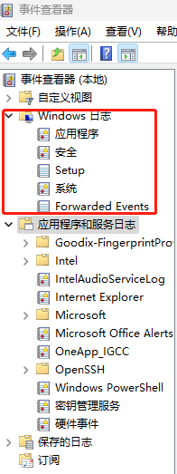

**登录失败：**

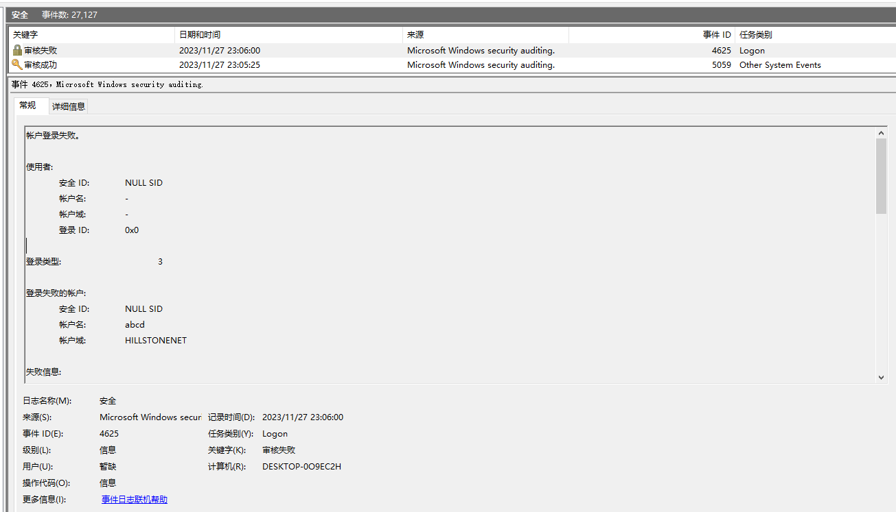

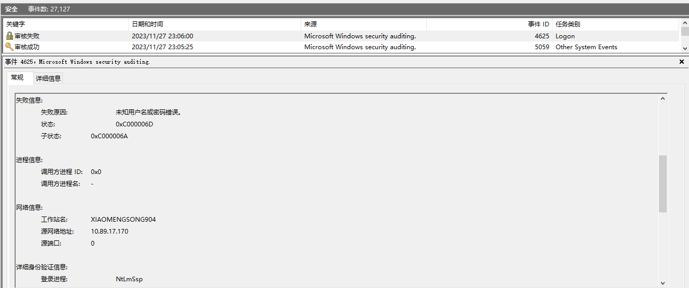

```
帐户登录失败。

使用者:
	安全 ID:		NULL SID
	帐户名:		-
	帐户域:		-
	登录 ID:		0x0

登录类型:			3

登录失败的帐户:
	安全 ID:		NULL SID
	帐户名:		abcd
	帐户域:		HILLSTONENET

失败信息:
	失败原因:		未知用户名或密码错误。
	状态:			0xC000006D
	子状态:		0xC000006A

进程信息:
	调用方进程 ID:	0x0
	调用方进程名:	-

网络信息:
	工作站名:	XIAOMENGSONG904
	源网络地址:	10.89.17.170
	源端口:		0

详细身份验证信息:
	登录进程:		NtLmSsp 
	身份验证数据包:	NTLM
	传递服务:	-
	数据包名(仅限 NTLM):	-
	密钥长度:		0

登录请求失败时在尝试访问的计算机上生成此事件。

“使用者”字段指明本地系统上请求登录的帐户。这通常是一个服务(例如 Server 服务)或本地进程(例如 Winlogon.exe 或 Services.exe)。

“登录类型”字段指明发生的登录的种类。最常见的类型是 2 (交互式)和 3 (网络)。

“进程信息”字段表明系统上的哪个帐户和进程请求了登录。

“网络信息”字段指明远程登录请求来自哪里。“工作站名”并非总是可用，而且在某些情况下可能会留为空白。

“身份验证信息”字段提供关于此特定登录请求的详细信息。
	-“传递服务”指明哪些直接服务参与了此登录请求。
	-“数据包名”指明在 NTLM 协议之间使用了哪些子协议。
	-“密钥长度”指明生成的会话密钥的长度。如果没有请求会话密钥，则此字段为 0。
```


**登录成功：**

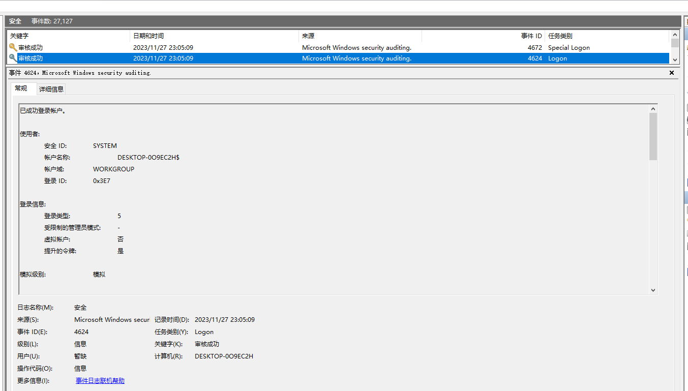

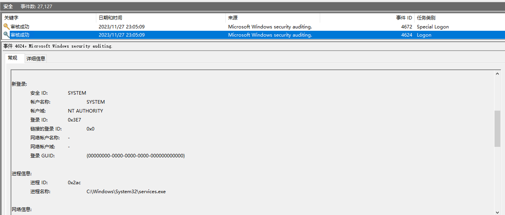

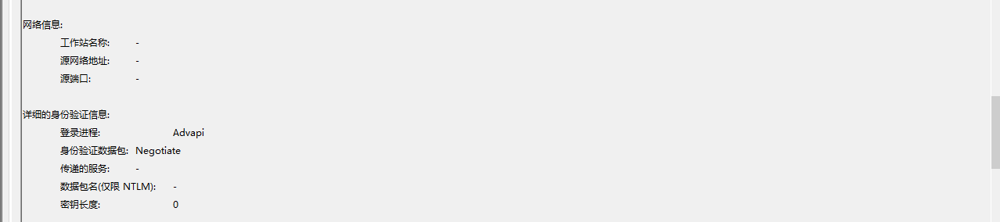

```
已成功登录帐户。

使用者:
	安全 ID:		SYSTEM
	帐户名称:		DESKTOP-0O9EC2H$
	帐户域:		WORKGROUP
	登录 ID:		0x3E7

登录信息:
	登录类型:		5
	受限制的管理员模式:	-
	虚拟帐户:		否
	提升的令牌:		是

模拟级别:		模拟

新登录:
	安全 ID:		SYSTEM
	帐户名称:		SYSTEM
	帐户域:		NT AUTHORITY
	登录 ID:		0x3E7
	链接的登录 ID:		0x0
	网络帐户名称:	-
	网络帐户域:	-
	登录 GUID:		{00000000-0000-0000-0000-000000000000}

进程信息:
	进程 ID:		0x2ac
	进程名称:		C:\Windows\System32\services.exe

网络信息:
	工作站名称:	-
	源网络地址:	-
	源端口:		-

详细的身份验证信息:
	登录进程:		Advapi  
	身份验证数据包:	Negotiate
	传递的服务:	-
	数据包名(仅限 NTLM):	-
	密钥长度:		0

创建登录会话时，将在被访问的计算机上生成此事件。

“使用者”字段指示本地系统上请求登录的帐户。这通常是一个服务(例如 Server 服务)或本地进程(例如 Winlogon.exe 或 Services.exe)。

“登录类型”字段指示发生的登录类型。最常见的类型是 2 (交互式)和 3 (网络)。

“新登录”字段指示新登录是为哪个帐户创建的，即已登录的帐户。

“网络”字段指示远程登录请求源自哪里。“工作站名称”并非始终可用，并且在某些情况下可能会留空。

“模拟级别”字段指示登录会话中的进程可以模拟到的程度。

“身份验证信息”字段提供有关此特定登录请求的详细信息。
	- “登录 GUID”是可用于将此事件与 KDC 事件关联起来的唯一标识符。
	-“传递的服务”指示哪些中间服务参与了此登录请求。
	-“数据包名”指示在 NTLM 协议中使用了哪些子协议。
	-“密钥长度”指示生成的会话密钥的长度。如果没有请求会话密钥，则此字段将为 0。
```


可以查看事件属性：

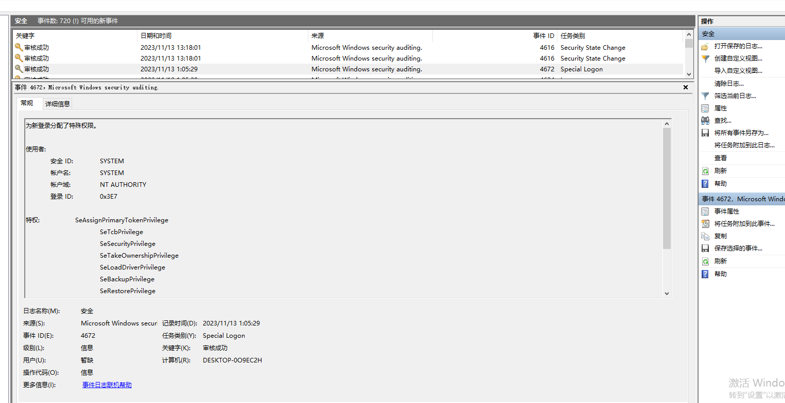

详细信息：

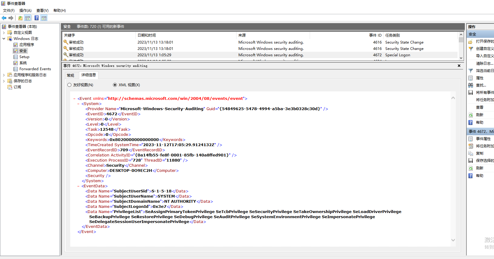

具体含义参见[【Windows日志】记录系统事件的日志_系统访问日志记录-CSDN博客](https://blog.csdn.net/diyiday/article/details/133831752)


**日志在注册表的键：**

```
HKEY_LOCAL_MACHINE\system\CurrentControlSet\Services\Eventlog
```

**系统日志 (SysEvent)：**记录操作系统产生的事件，如设备驱动无法正常启动或停止，系统进程崩溃等，默认位置

```
%SystemRoot%\System32\Winevt\Logs\System.evtx
```

**程序日志 (AppEvent)：**包含操作应用程序软件相关的事件。事件包括了错误、警告及任何应用程序需要报告的信息。默认位置:

```
%SystemRoot%\System32\Winevt\Logs\Application.evtx
```

**安全日志 (SecEvent)：**包含安全性相关的事件。e.g. 用户权限变更，登录及注销，文件 / 文件夹访问等信息。默认位置:

```
%SystemRoot%\System32\Winevt\Logs\Security.evtx
```

常见的安全事件ID：

| 事件ID | 说明                            |
| ------ | ------------------------------- |
| 4624   | 登录成功                        |
| 4625   | 登录失败                        |
| 4634   | 注销成功                        |
| 4647   | 用户启动了注销过程              |
| 4672   | 使用超级用户(如管理员) 进行登录 |
| 4720   | 创建用户                        |
| ...    | ...                             |
|        |                                 |

以上系统内置的3个核心日志文件（System、Security、Application)，默认大小均 20 MB，数据超过20 MB默认系统将优先覆盖过期日志记录。打开事件查看器，选中对应的日志后右键属性，即可修改日志大小。

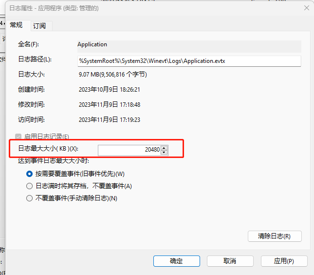

应用程序和服务日志默认最大不确定，不同的应用或服务有自己默认的日志最大值，超过最大限制也优先覆盖过期的日志记录

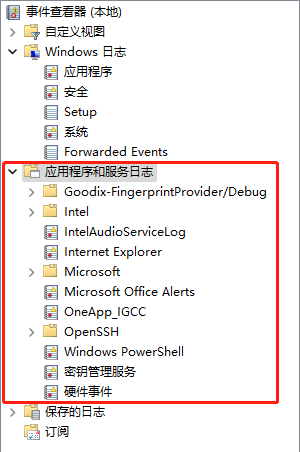

其他系统服务的日志也都储存在`%SystemRoot%\System32\Winevt\Logs\`下

##### 2）svhost&EventLog&Wevtutil

**操作系统日志记录大致流程**：

1. svhost 启动 EventLog 开始记录日志，例如`C:\Windows\System32\svchost.exe -k LocalServiceNetworkRestricted -p`
2. EventLog 将操作记录先缓存为一段内存内容

3. Wevtutil 将内存内容解析为 xml 并且通过 gui 界面可视化的展现给用户


其中 svchost，EventLog，Wevtutil 具体功能说明如下：

**svchost**主要是用来实现服务进程数据共享，以此来减少系统资源消耗，很多系统程序和服务使用 svchost 运行。

windows 系统进程分为独立进程和共享进程两种，`svchost.exe`文件存在于`% systemroot% system32`目录下，它属于共享进程。随着 windows 系统服务不断增多，为了节省系统资源，微软把很多服务做成共享方式，交由`svchost.exe`进程来启动。但`svchost`进程只作为服务宿主，并不能实现任何服务功能，即它只能提供条件让其他服务在这里被启动，而它自己却不能给用户提供任何服务。这些系统服务是以动态链接库（dll）形式实现的，它们把可执行程序指向`svchost`，由`svchost`调用相应服务的动态链接库来启动服务。

**Event Log** 主要是管理 windows 管理事件和事件日志。它支持日志记录事件、查询事件、订阅事件、归档事件日志以及管理事件元数据。它可以用 XML 和纯文本两种格式显示事件。

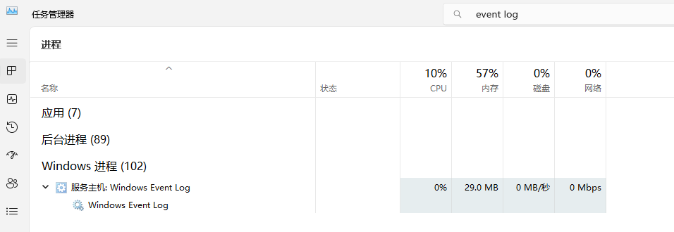

EventLog 的启动需要依赖于 svchost，启动示例如下:

```
C:\Windows\System32\svchost.exe -k LocalServiceNetworkRestricted -p -s EventLog
```

**wevtutil**检索有关事件日志和发布服务器的信息。此外，还可以使用此命令来安装和卸载事件清单，运行查询，以及导出、存档和清除日志。详细可以参考微软官方介绍。

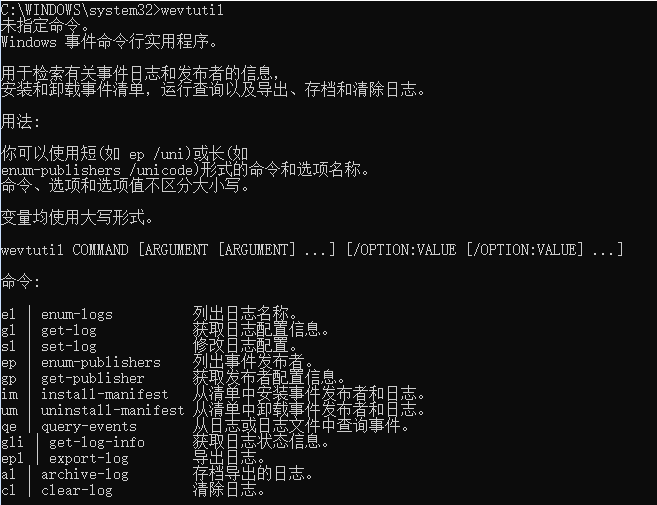

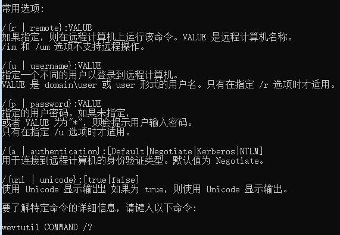

下面列举一些常用读取日志的命令：

```
#获取security的最近十条日志
wevtutil.exe qe Security /f:text /rd:true /c:10
#获取security的前十条日志
wevtutil.exe qe Security /f:text /c:10
#默认视图xml查看（text视图不会输出EventRecordID）
wevtutil.exe qe Security /rd:true /c:10
#导出security所有日志到1.evtx
wevtutil.exe epl security 1.evtx
```


### 2.2 Windwos核心日志清理方法

#### 1）删除日志文件

##### 通过事件查看器删除

```
开始→运⾏,输⼊ eventvwr 进⼊事件查看器，右边栏选择清除⽇志
```

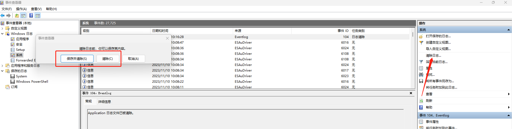

点击清除日志后，会出现选项**保存并清除**/**清除**

如果选择**清除**。效果如下，清除日志的行为会留下一条日志，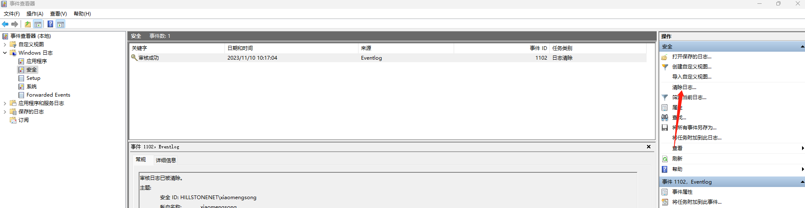

如果选择了**保存并清除**

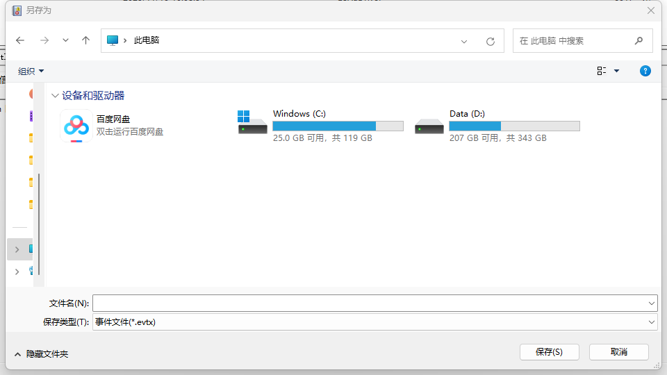

保存后在事件查看器里没有记录，但会留下一个evtx的文件，还需要手动将该文件删除（使用Shift+Delete快捷键直接永久删除）

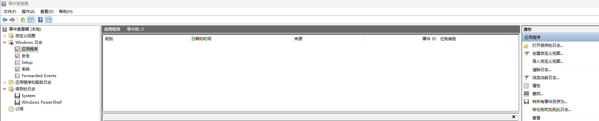

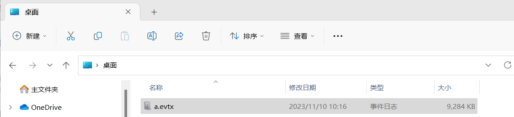


##### 直接删除文件

首先停止Windows Event Log（EventLog）服务

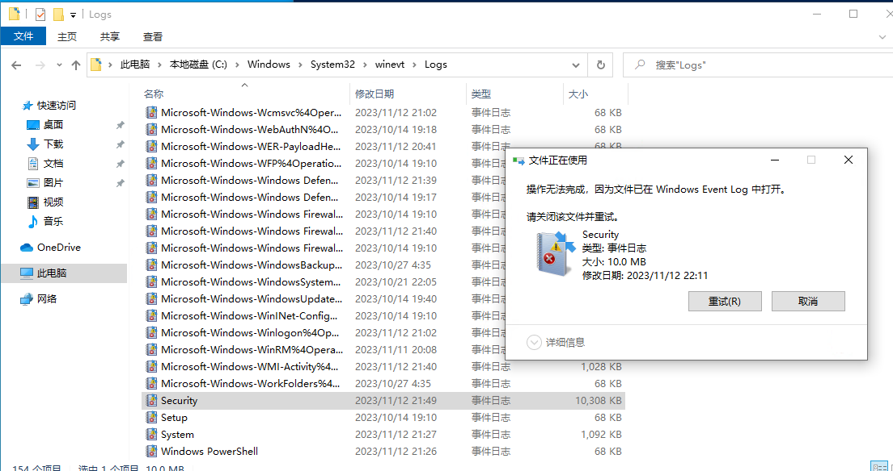

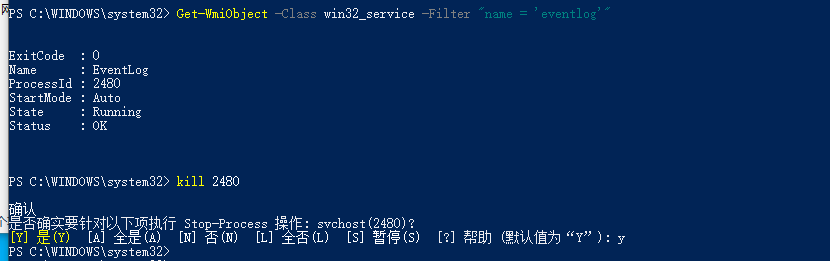

然后直接删除文件即可。删除文件时候可以：

（1）Shift+Delete快捷键永久删除

（2）Cipher 命令多次覆写

利用Cipher 命令通过 /W 参数可反复写入其他数据覆盖已删除文件的硬盘空间，彻底删除数据防止被恢复。

比如删除D:\tools目录下的文件后，执行

```
cipher /w:D:\tools
```


D 盘上未使用空间就会被覆盖三次：一次 0x00、一次 0xFF，一次随机数，所有被删除的文件就都不可能被恢复了。

（3）Format命令覆盖格式化

Format 命令加上 /P 参数后，就会把每个扇区先清零，再用随机数覆盖。而且可以覆盖多次。比如：

```
format D: /P:8
```

这条命令表示把 D 盘用随机数覆盖 8 次。


#### 2）利用wevtutil删除

```
wevtutil el             列出系统中所有日志名称
for /F "tokens=*" %a in ('wevtutil.exe el') DO wevtutil.exe cl "%a"  清除所有日志
wevtutil cl system      清理系统日志
wevtutil cl application 清理应用程序日志
wevtutil cl security    清理安全日志
wevtutil cl “windows powershell”
```

需要管理员权限

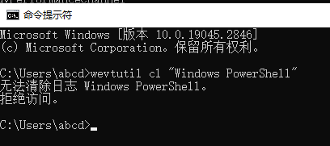

中间有空格的需要加`" "`

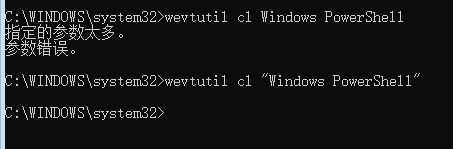


#### 3）通过PowerShell删除

[Clear-EventLog (Microsoft.PowerShell.Management) | Microsoft Learn](https://learn.microsoft.com/zh-cn/previous-versions/powershell/module/microsoft.powershell.management/clear-eventlog?view=powershell-5.0)

```
cmd环境：
PowerShell -Command "& {Clear-Eventlog -Log 要清理的日志(如Application,System,Security)}"
PowerShell -Command "& {Get-WinEvent -ListLog 要清理的日志(如Application,System,Security) -Force | % {Wevtutil.exe cl $_.Logname}}"

powershell环境：
Clear-Eventlog -Log 要清理的日志(如Application,System,Security)
Get-WinEvent -ListLog 要清理的日志(如Application,System,Security) -Force | % {Wevtutil.exe cl $_.Logname}

```

普通用户运行会报如下异常：

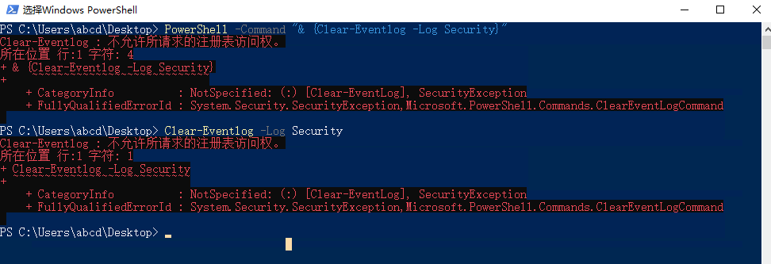

需要管理员权限

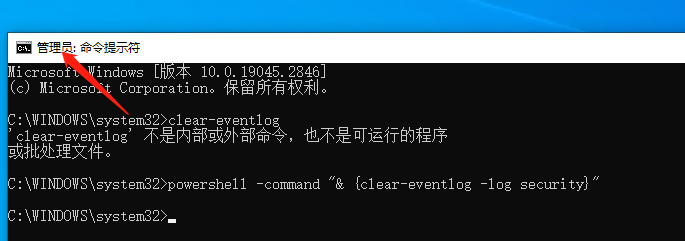

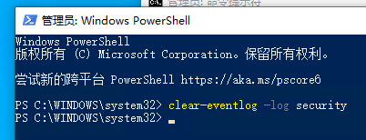


#### 4）停止日志的记录

##### 停止eventlog线程

首先利用powershell命令找出日志记录服务（eventlog）对应的进程PID，`Get-WmiObject`或`Get-CimInstance`命令都可以：

```
Get-WmiObject -Class win32_service -Filter "name = 'eventlog'"

Get-CimInstance -ClassName win32_service -Filter "name = 'eventlog'"
```

运行结果中可以看出eventlog服务对应的PID为8844，

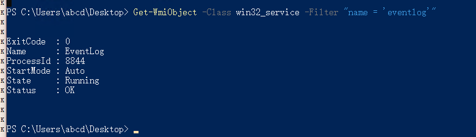

或者用任务管理器查看（截图是后面截的 PID不一样了）

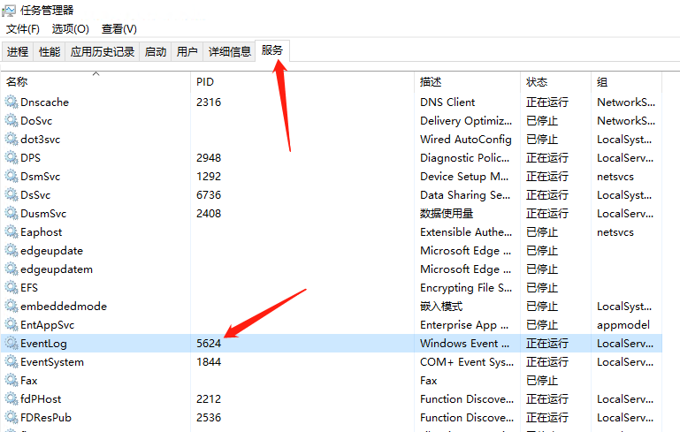

cmd没有这个命令

找到这个进程后可以直接右键停止。

或者利用使用[Sysinternal套件](https://live.sysinternals.com/)中的工具procexp.exe( Process Explorer)，或者[System Informer](https://www.systeminformer.com/)（原来的Process Hacker）也行

**右键-->以管理员身份运行**

找出PID=8844的进程，然后在Process处选择该scvhost.exe，点选`右键->属性`

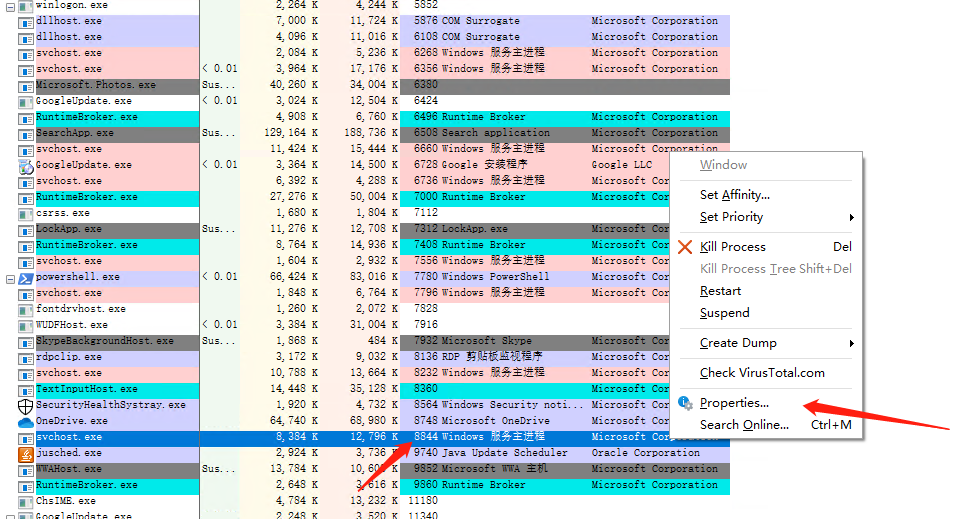

确定一下8844的服务确实是EventLog

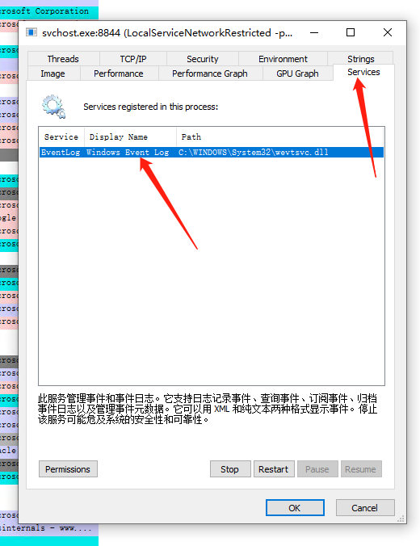

点击`线程`，如下图所示，

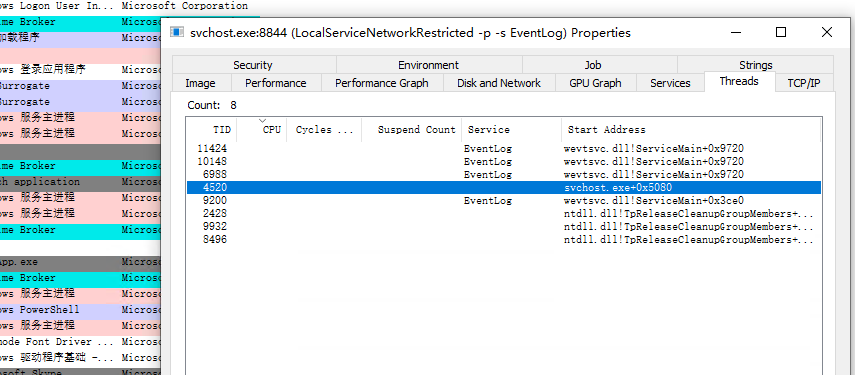

依次选择`Service`为`EventLog`的线程，`Kill`这些线程（如果使用的是System Informer，就选`Terminate`），注意`Suspend`是不行的。

这样日志服务实际上就关闭了，**但由于只是杀掉了其进程下运行的线程，而进程仍然存在，所以服务看起来是没有异样的**

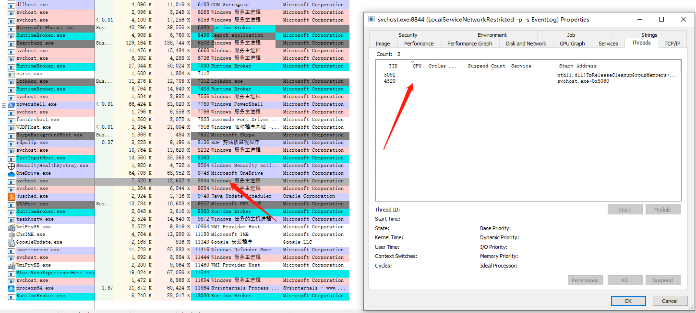

需要恢复日志记录服务时，在进程列表界面选择该scvhost.exe，点选`右键->重新启动`

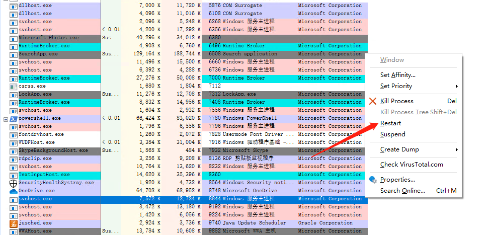

此时状态还是Stopped

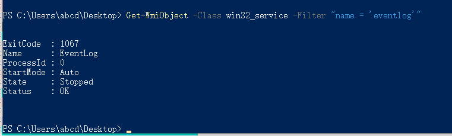

管理员执行命令`net start eventlog`

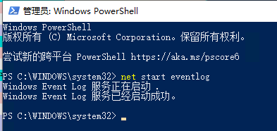

不执行上面的`右键->重新启动`步骤，直接敲命令`net start eventlog`的话，会这样：

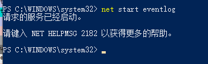

**没有杀死进程，而是杀死了线程。虽然事件日志服务似乎在系统中运行（因为没有终止进程），但它实际上并没有运行（因为终止了线程）并且系统不收集日志。**

以上操作还可以通过脚本实现，遍历事件日志服务进程（专用svchost.exe）的线程堆栈，并标识事件日志线程以杀死事件日志服务线程。

项目地址：[hlldz/Phant0m: Windows Event Log Killer (github.com)](https://github.com/hlldz/Phant0m)

<font color=red>暂时没复现出来，编译出来一运行就报错</font>


##### 修改注册表停用Eventlog

查询要禁用的注册表

```
reg query "HKEY_LOCAL_MACHINE\system\CurrentControlSet\Services\Eventlog\"
```

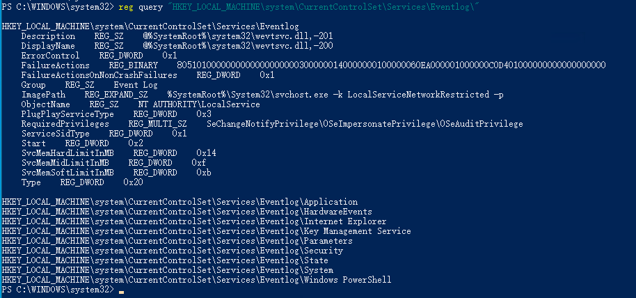

删除注册表

```
reg delete "HKEY_LOCAL_MACHINE\system\CurrentControlSet\Services\Eventlog\****"
reg delete "HKEY_LOCAL_MACHINE\system\CurrentControlSet\Services\Eventlog"
```

#### 5）按条件清理日志

windows的事件查看器只能删除整个日志文件，不能单条删除单条日志

首先可以利用wevtutil查看xml格式获得日志对应的EventRecordID

```text
wevtutil.exe qe Security /f:xml /rd:true /c:10
```

默认视图为xml，所以命令可以简写为：

```text
wevtutil.exe qe Security /rd:true /c:10
```

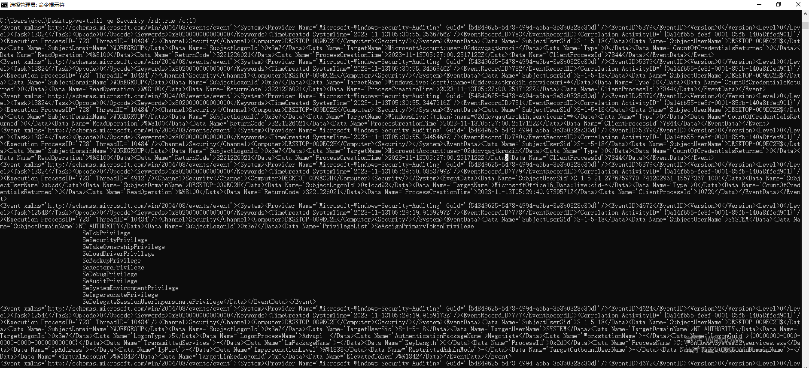

这样看太乱了，想知道EventRecordID还可以通过事件查看器，右键--属性--详细信息

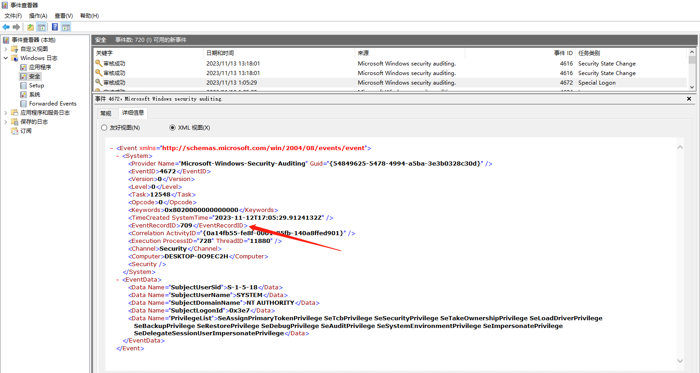

删除Security下的单条日志(EventRecordID=709)，并保存为1.evtx

```
wevtutil epl Security 1.evtx "/q:*[System [(EventRecordID!=709)]]"
```

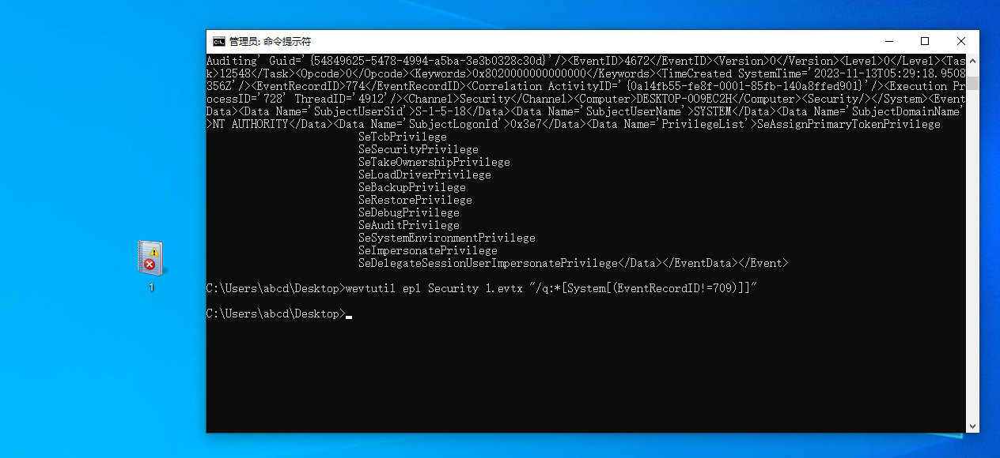

或者删除多条日志

```
wevtutil epl Security 1.evtx "/q:*[System [(EventRecordID>13032) or (EventRecordID<13030)]]"
```

或者按时间段删除日志，删除SystemTime为2023-08-10T03:20:00至2023-08-10T03:21:00之间的日志，结果保存为1.evtx

```
wevtutil epl Security 1.evtx "/q:*[System [TimeCreated[@SystemTime >'2023-08-10T03:21:00' or @SystemTime <'2023-08-10T03:20:00']]]"
```

下面开始将这个文件命名为`Security.evtx`，将修改后的日志文件覆盖系统原文件，但是直接复制过去不行

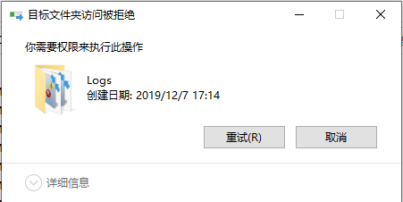

应该先结束日志进程

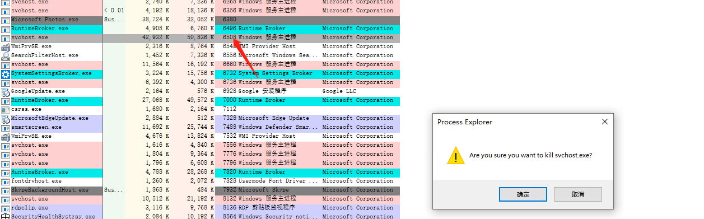

将修改后的日志文件覆盖系统原文件

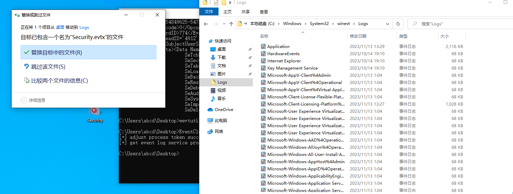

最后重启一下eventlog，重启步骤参见方法4中的停止eventlog线程

如果不想这么麻烦结束进程再重启，使用**EventCleaner**可以实现单条日志清理（项目地址[EventCleaner](https://github.com/QAX-A-Team/EventCleaner)）

```
EventCleaner closehandle   #释放日志文件句柄(security.evtx)
EventCleaner 100           #删除 event record id 为 100 的日志
EventCleaner suspend       #暂停日志线程,停止日志记录
EventCleaner normal        #恢复日志线程
```

<font color=red>（也没有复现成功，目前没找到原因）</font>

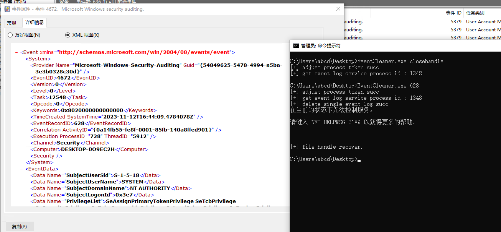

#### 6）Windows日志伪造

使用`eventcreate`这个命令行工具来伪造日志或者使用自定义的大量垃圾信息覆盖现有日志。

```
eventcreate -l system -so administrator -t warning -d "this is a test" -id 500
```

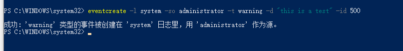

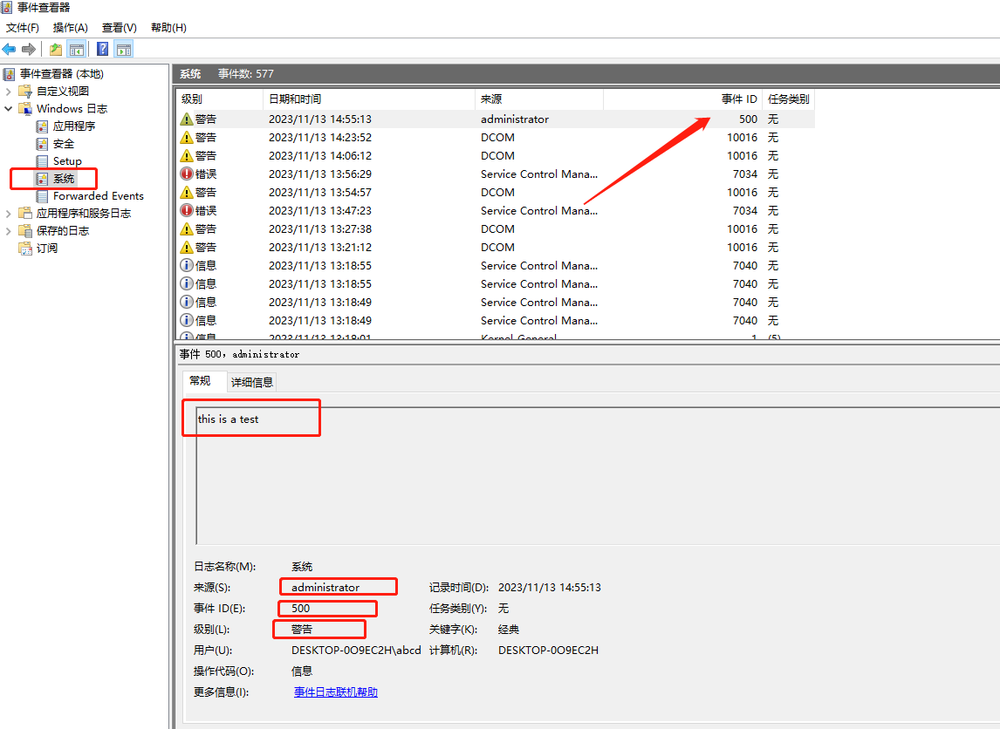

伪造一条特殊的事件ID的日志，骗取蓝队去溯源，浪费溯源时间。

### 2.3 远程桌面连接日志清理

当使用3389端口远程一台机器后会在对应机器上产生对应的记录，其记录只要有两部分组成；

#### 1）应用程序和服务日志中的连接记录

**应用程序和服务日志 > Microsoft > Windows > TerminalServices- RemoteConnectionManager**，右键单击**“Operational”**并选择**“筛选当前日志”**。

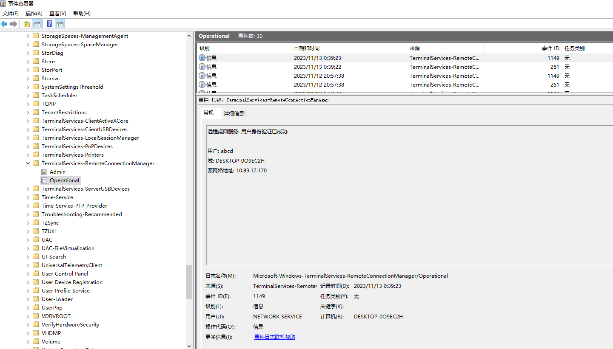

筛选日志

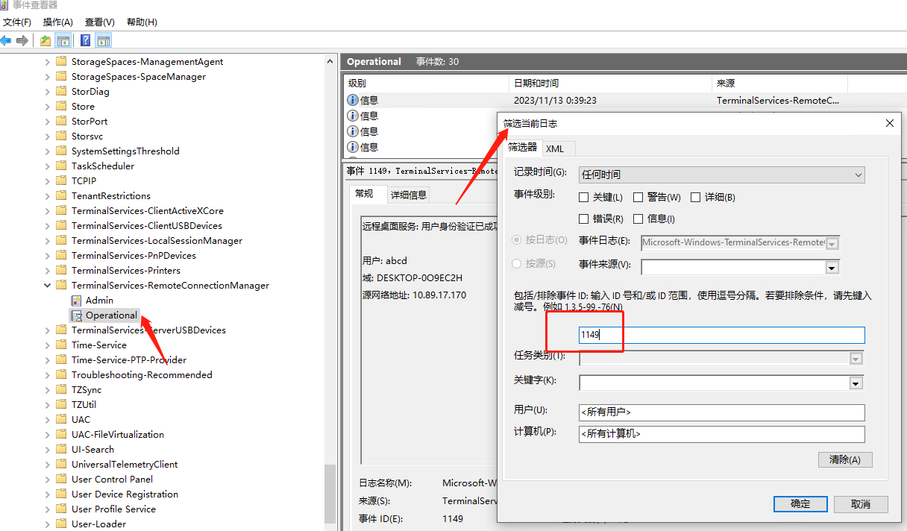

依次点击事件即可查看到哪些IP来连接过

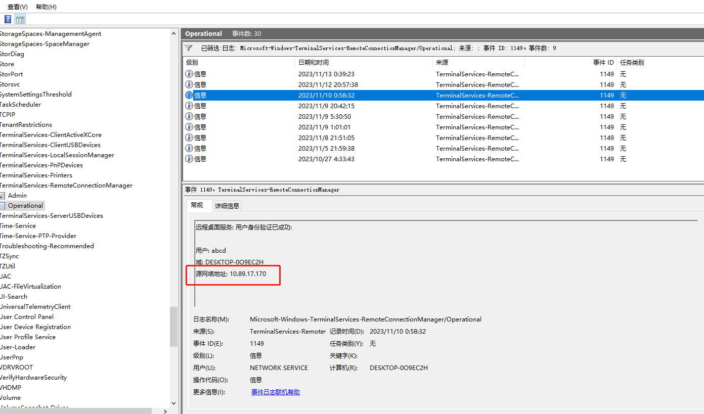

可以像前面删除日志一样，直接点清除日志

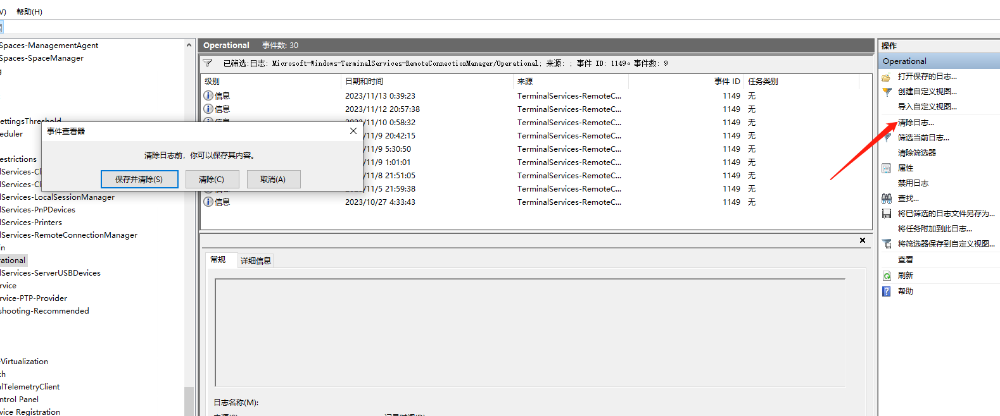

#### 2）Default.rdp 文件 (系统隐藏文件)

删除 Default.rdp 方法

```
cd %userprofile%\documents   # 进入Default.rdp所在路径
attrib Default.rdp -s -h     # 使用attrib去掉Default.rdp文件的系统文件属性(S)和隐藏文件属性(H)
del Default.rdp              # 删除del Default.rdp
```

#### 3）注册表清理方法

主要就是删掉如下部分，Deafult部分是远程主机RDP连接本机的记录，Servers为本地RDP连接远程主机的信息

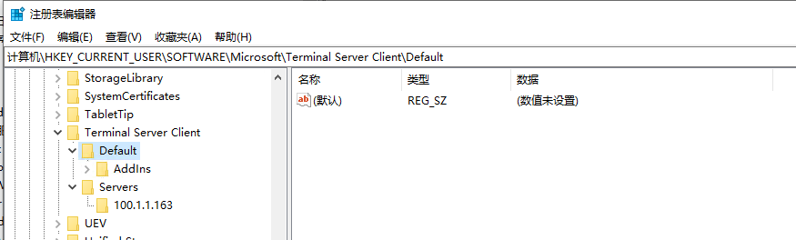

reg delete 参数说明参数说明

```
/v 删除子项下的特定项。如果未指定任何项，则将删除子项下的所有项和子项。
/ve指定仅删除没有值的条目。
/va删除指定子项下的所有条目。不会删除指定子项下的子项。
/f删除现有的注册表子项或条目，而不要求确认。
/?在命令提示符下显示帮助。
```

删除

```
# 查询远程连接在注册表中的键值
reg query "HKEY_CURRENT_USER\Software\Microsoft\Terminal Server Client\Default"
# 删除对应的键值,如删除MRU0 "/v MRU0"
reg delete "HKEY_CURRENT_USER\Software\Microsoft\Terminal Server Client\Default" /f /v MRU0
也可以将deafult全部删掉
reg delete "HKEY_CURRENT_USER\Software\Microsoft\Terminal Server Client\Default" /va /f
```

如使用当前机器作为跳板RDP其他主机的话，需要使用同步骤清理 Servers 下的键值

```
# 查询具体要删除的键值文件夹
reg query "HKEY_CURRENT_USER\Software\Microsoft\Terminal Server Client\Servers"
# 确定要删除的文件夹进行删除
reg delete "HKEY_CURRENT_USER\Software\Microsoft\Terminal Server Client\Servers\192.168.1.123" /f
```

### 2.4 浏览器记录清理

如果使用有隐私模式的浏览器，开启隐私模式可以避免在**本地计算机**留下历史记录、缓存文件和Cookies。

#### 1）IE

| 日志类型 | 默认路径                                                     |
| -------- | ------------------------------------------------------------ |
| 浏览记录 | C:\Users\xxx\AppData\Local\Microsoft\Windows\History\        |
| 缓存文件 | C:\Users\xxx\AppData\Local\Microsoft\Windows\Temporary Internet Files\ |
| Cookies  | C:\Users\xxx\AppData\Roaming\Microsoft\Windows\Cookies\      |

删除方法一：在浏览器搜索下拉栏中，直接选择删除相应的历史记录
删除方法二：在工具->Internet 选项->常规->浏览历史记录中，选择删除所有浏览历史记录、缓存文件、Cookies

#### 2）edge

| 日志类型 | 默认路径                                                     |
| -------- | ------------------------------------------------------------ |
| 浏览记录 | C:\Users\xxx\AppData\Local\Microsoft\Edge\User Data\Default\history |
| 缓存文件 | C:\Users\xxxAppData\Local\Microsoft\Edge\User Data\Default\Cache\ |
| Cookies  | C:\Users\xxx\AppData\Local\Microsoft\Edge\User Data\DefaultCookies |

删除方法：地址栏访问`edge://settings/privacy`，在`清除浏览数据`中选择要清除的内容

#### 2）Chrome

在浏览器搜索栏中输入chrome://version/，可以看到个人资料路径

| 日志类型 | 默认路径                                                     |
| -------- | ------------------------------------------------------------ |
| 浏览记录 | C:\Users\xxx\AppData\Local\Google\Chrome\User Data\Default\history |
| 缓存文件 | C:\Users\xxx\AppData\Local\Google\Chrome\User Data\Default\Cache\ |
| Cookies  | C:\Users\xxx\AppData\Local\Google\Chrome\User Data\Default\Cookies |

删除方法一：在浏览器搜索栏中输入chrome://history/，选择删除单条浏览记录
删除方法二：在设置->隐私设置和安全性中，或在搜索栏输入chrome://history/后选择清除浏览数据，选择删除特定时间范围的浏览历史记录、缓存文件、Cookies

#### 3）Firefox

在浏览器搜索栏中输入about:cache，可以看到缓存文件的磁盘存储路径

| 日志类型 | 默认路径                                                     |
| -------- | ------------------------------------------------------------ |
| 浏览记录 | C:\Users\xxx\AppData\Roaming\Mozilla\Firefox\Profiles\70rs4c5d.default-release\places.sqlite |
| 缓存文件 | C:\Users\xxx\AppData\Local\Mozilla\Firefox\Profiles\70rs4c5d.default-release\cache2\ |
| Cookies  | C:\Users\xxx\AppData\Roaming\Mozilla\Firefox\Profiles\afn7ww6q.default-release\cookies.sqlite |

删除方法一：在Library->History->Recent History栏中右键删除特定的浏览记录
删除方法二：在Library->History->Clear Recent History，或在Options->Privacy & Security中选择Clear History，删除指定时间范围的历史记录

### 2.5 命令行history清理

#### 1）powershell

以5.1.19041.2673版本为例，以下不需要管理员权限：

利用Readline查看历史记录，输入如下命令可以查看历史记录功能：

```
Get-PSReadlineKeyHandler
```

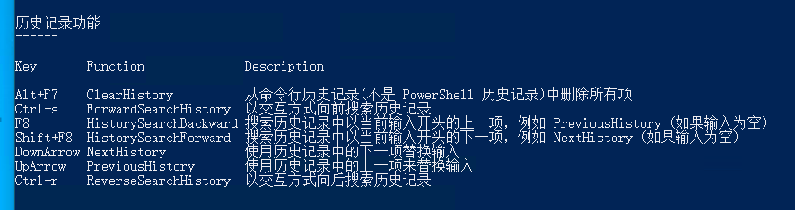

如下命令只能查看到当前窗口的历史命令，

```
Get-History
history
```

可以这样获得PSReadline保存的历史记录

```
Get-Content (Get-PSReadlineOption).HistorySavePath
```

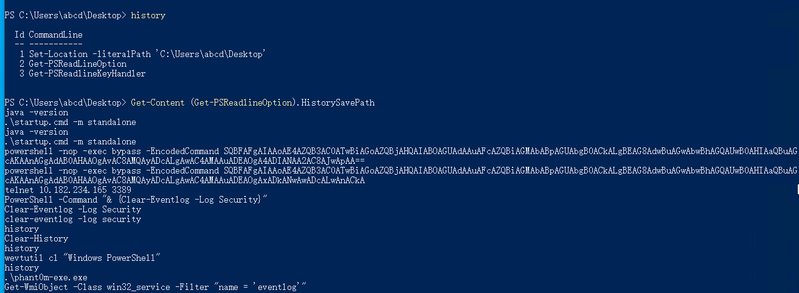

当前窗口的history删掉删除，用`clear-history`即可，`Clear-History` 不会清除 `PSReadLine` 命令历史记录文件。

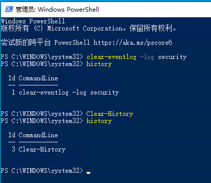

其他 `Clear-History` 命令可参考[Clear-History (Microsoft.PowerShell.Core) - PowerShell | Microsoft Learn](https://learn.microsoft.com/zh-cn/powershell/module/Microsoft.PowerShell.Core/Clear-History?view=powershell-5.1)

 `PSReadLine` 模块存储一个历史记录文件，其中包含每个 PowerShell 会话中的每个 PowerShell 命令。 在 PowerShell 提示符下，使用键盘上的向上和向下箭头滚动命令历史记录。

```
Remove-Item (Get-PSReadlineOption).HistorySavePath
```

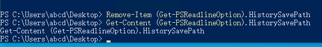

还可以通过如下命令删除history文件

```
del $env:appdata\Microsoft\Windows\PowerShell\PSReadLine\ConsoleHost_history.txt
```


#### 2）cmd

默认情况下，cmd只显示最近使用的命令历史记录。输入如下命令，只能查看到当前窗口的history，新开一个窗口就看不见原来的命令了

```
doskey /history
```

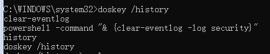


### 2.6 其他

#### 1）文件路径访问记录

在资源管理器中输入一个路径并跳转后

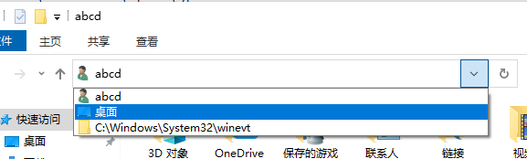

留下这样的注册表

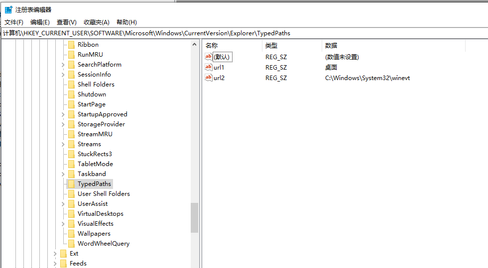

#### 2）最近访问记录

我的电脑或资源管理器中，选择`查看->选项->常规`中，将隐私一栏的“快速访问”两个选项去掉，并选择清除历史记录。（这里以win10举例，win7在我的电脑或资源管理器中，在最近访问位置`右键->删除最近项目列表`）

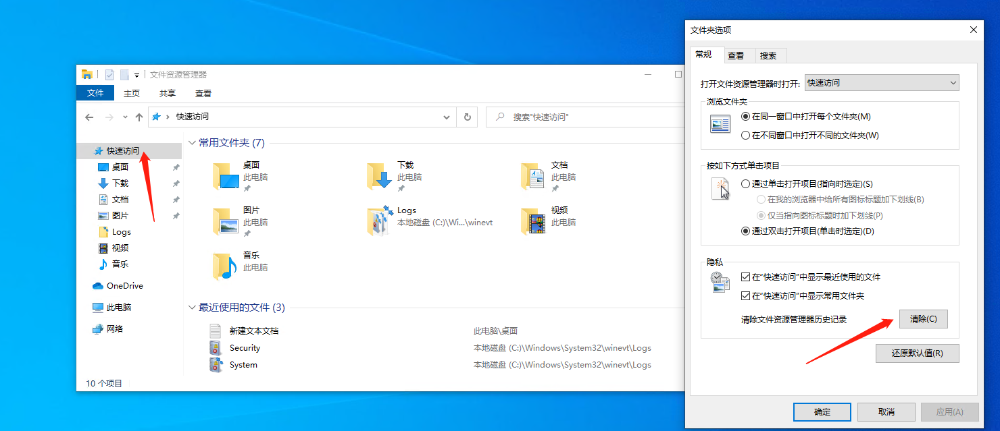

#### 3）Win+R运行记录

对应注册表项为`HKEY_CURRENT_USER\SOFTWARE\Microsoft\Windows\CurrentVersion\Explorer\RunMRU`

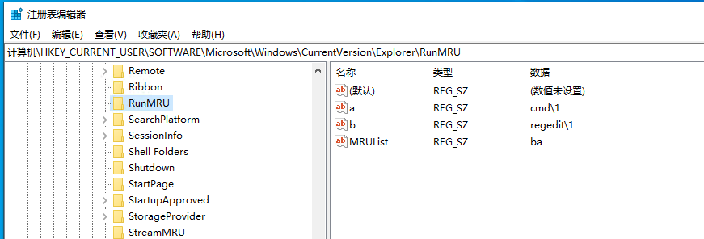


## 3. Linux痕迹清理

> [Linux清理痕迹的一些方法 - 寻梦99 - 博客园 (cnblogs.com)](https://www.cnblogs.com/liulianzhen99/articles/17568498.html)
>
> [Linux痕迹清除技术_Captain_RB的博客-CSDN博客](https://blog.csdn.net/Captain_RB/article/details/111653887)

### 3.1 删除History记录

History记录原理：当前shell执行的命令记录放置在缓存中，`history`命令查看的也是缓存中的命令，当exit退出时系统会将缓存的命令写入history文件`~/.bash_history`，可使用`history -a`命令来将内存中的记录强制写入文件。如果在shell运行过程中kill掉其进程，则缓存命令不会写入history。

个人理解：`~/.bash_history`默认只保存最近的1000条记录，`history`命令执行后看到的是`~/.bash_history`中保存的命令和当前shell执行过的命令，如果不注销或者关机，那么执行`history`看到的记录可能大于1000。

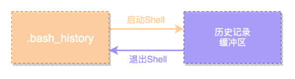

#### 1）部分删除

**方法一**：在执行命令前加上空格，这样命令就不会被记录。这种方法在配置环境变量`$HISTCONTROL=ignoreboth`条件下有效 (缺省配置)，如果没有该项配置，将其加到配置脚本中`echo HISTCONTROL=ignorespace >> ~/.bashrc`，然后运行`source ~/.bashrc`即可。
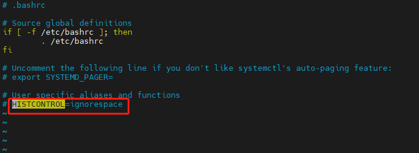

**方法二**：设置当前session不再记录历史命令：`set +o history`，在执行该命令之前的命令仍然会记录，不会删除history文件中的记录，恢复记录历史命令：`set -o history`。

**方法三**：清除当前session缓存的命令记录：`history -c`，history命令本身不会被记录，但执行该命令之后的命令仍然会记录，所以要在退出前运行，不会删除.bash_history文件中的记录。

**方法四**：清除当前session缓存的命令记录：`unset HISTORY HISTFILE HISTSAVE HISTZONE HISTLOG`，无论在执行该命令之前还是之后的命令都不会被记录，且unset命令本身也不会被记录，不会删除.bash_history文件中的记录。

**方法五**：vim修改`.bash_history`文件，可以在执行完`vi/vim`命令后，利用vim分屏修改历史

#### 2）全部删除

**方法一**：删除当前用户history文件`~/.bash_history`中的记录，结合如下命令可完全清理:

```
rm -rf ~.bash_history 
history -c
exit
```

再次登录进来只能看到一条exit的记录

**方法二**：设置环境变量，添加对历史命令记录数量的限制：`HISTSIZE=0`，以及对history文件`.bash_history`行数的限制：`HISTFILESIZE=0。`

在当前shell中直接输入命令`HISTSIZE=0 && HISTFILESIZE=0`，这样会将缓存的history记录和`~/.bash_history`中的记录全部清空；

如果在`~/.bashrc`初始化文件中添加命令：`HISTSIZE=0 && HISTFILESIZE=0`，这样每次开启shell都不会再记录history命令。

### 3.2 删除日志文件

#### 1）Linux日志文件

Linux中的日志一般分**系统日志**和**应用日志**两种

##### 系统日志

Linux中有多种系统日志，记录主机运行和用户登录情况（记录系统日志，老版本操作系统使用syslog，CentOS6、Ubuntu18及以后使用rsyslog）

> rsyslog相关知识可以参考[syslog之一：Linux syslog日志系统详解 - duanxz - 博客园 (cnblogs.com)](https://www.cnblogs.com/duanxz/p/3578194.html)

通过如下命令查看系统日志记录在哪，大部分日志记录在`/var/log/messages`（不想保存在默认位置可以改`/etc/rsyslog.conf`文件）

```
grep -Ev "^$|^#" /etc/rsyslog.conf
```

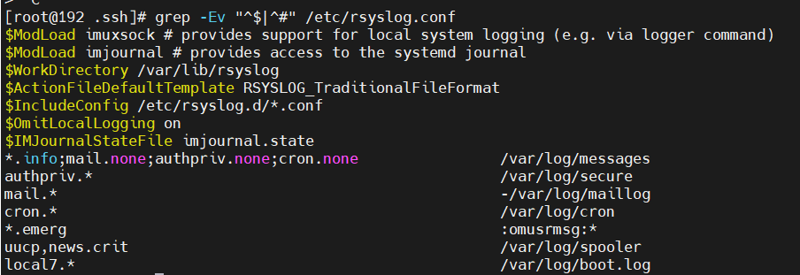

**`/var/log/messages`：记录系统启动后的信息和错误日志**

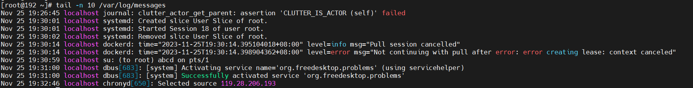

- 时间标签：消息发出的日期时间
- 主机名：生产消息的计算机的名称
- 子系统名称：发出消息的应用程序的名称
- 消息：消息级别的具体内容

rsyslog共有8种日志级别

| 级别 | 英文表示       | 意义                     |
| ---- | -------------- | ------------------------ |
| 0    | EMERG (紧急)   | 导致主机系统不可用的情况 |
| 1    | ALERT (警告)   | 必须马上采取解决措施     |
| 2    | CRIT (严重)    | 比较严重的情况           |
| 3    | ERR (错误)     | 运行出现错误             |
| 4    | WARNING (提醒) | 提醒用户的重要事件       |
| 5    | NOTICE (注意)  | 不会儿影响系统，提醒用户 |
| 6    | INFO (信息)    | 般信息                   |
| 7    | DEBUG (调式)   | 程序调式                 |
| 8    | None (没有)    | 不做记录                 |

例如查看出现的重大的错误

```
grep -E -iw "emerg|alert|critical|error" /var/log/messages
```

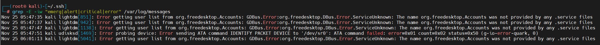

rsyslog日志服务是一个常会被攻击的目标,破坏了它将使运维员很难发现入侵及入侵的痕,因此要特别注意监控其守护进程及配置文件。

**`/var/log/cron` ：Crond周期性计划任务产生的时间信息**

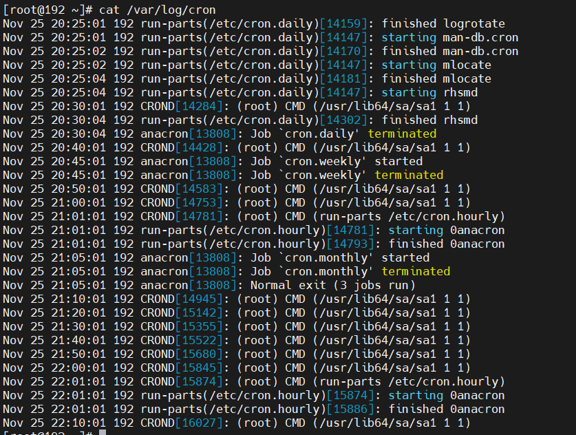

**`/var/log/dmesg` ：引导过程中的各种时间信息**

**`/var/log/secure`  (centos)或 `/var/log/auth.log`  (kali)：记录与安全相关的日志信息，涉及使用账户和密码登录的程序都会记录**

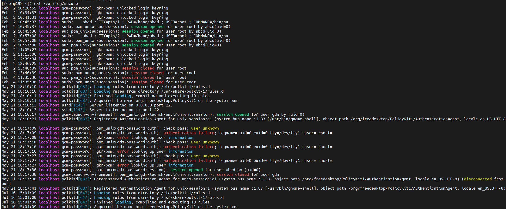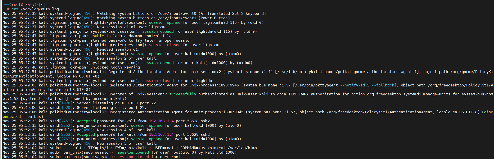

##### 用户日志

**`/var/log/btmp`：记录所有用户错误登录信息，二进制文件， 使用`lastb`命令查看**

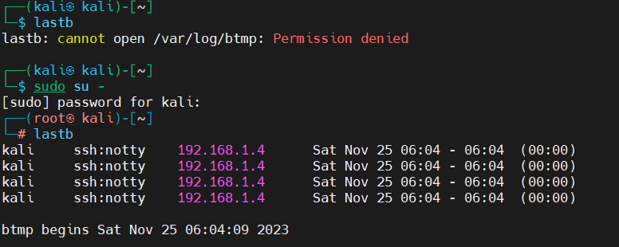

**`/var/log/wtmp`：记录所有用户成功登录、注销信息，二进制文件，使用`last`命令查看**

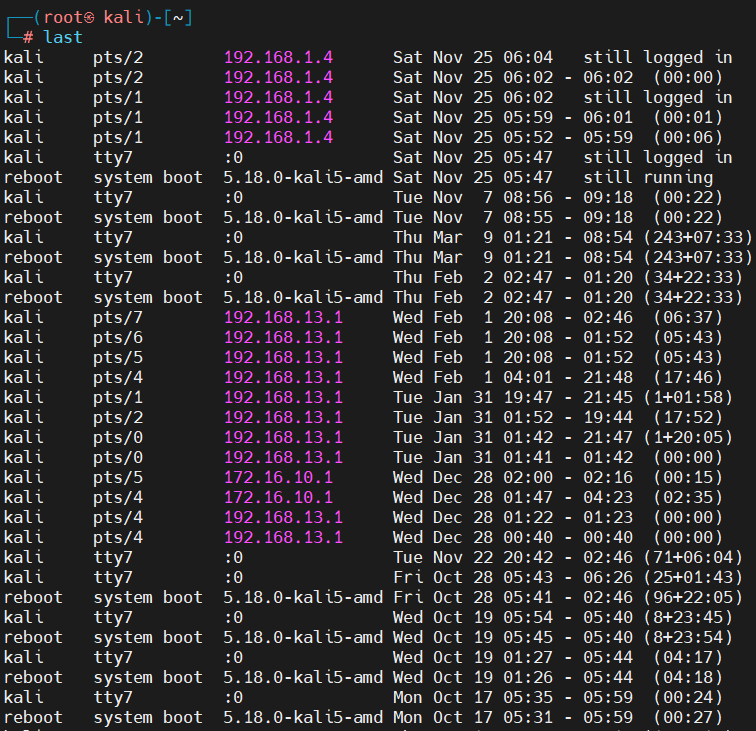

**`/run/utmp`：记录当前已经登录的用户信息，二进制文件，使用`w`、`who`、`users`等命令查看**

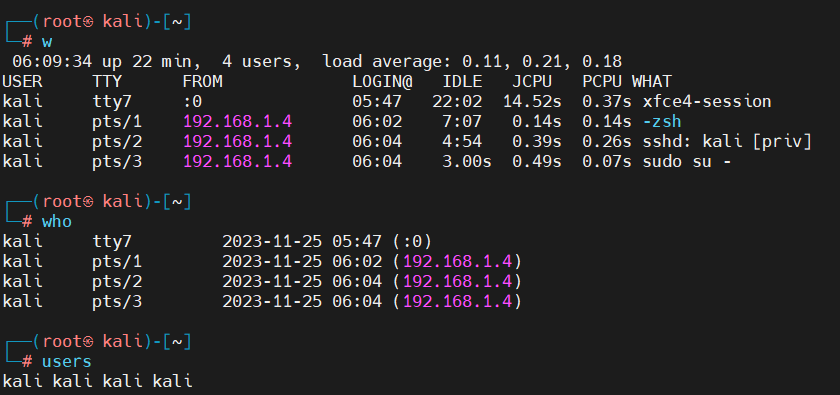

**`/var/log/lastlog`：记录所有用户最后一次的登录时间的曰志，二进制文件，使用`lastlog`命令查看（并不需要root权限）**

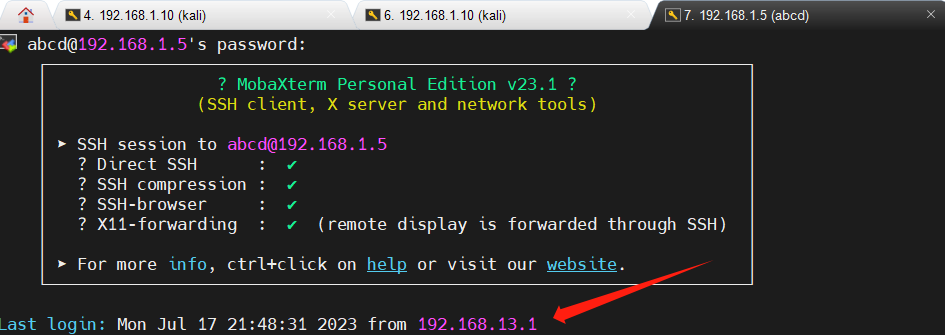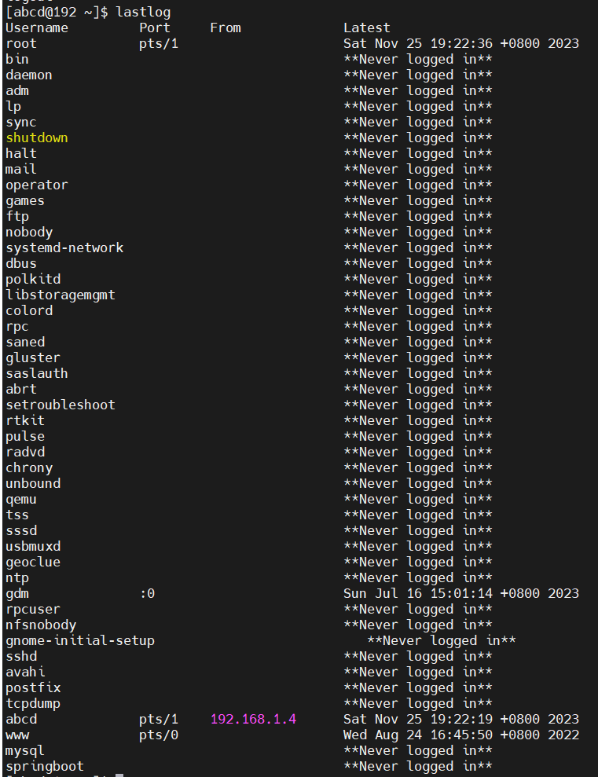

##### 应用日志

Linux中绝大多数应用日志默认路径都在/var/log/目录下，比如：

```
# apache
/var/log/apache2/access.log
/var/log/apache2/error.log
# nginx
/var/log/nginx/access.log
/var/log/nginx/error.log
# mysql
/var/log/mysql/error.log
# es
/var/log/elasticsearch/<cluster name>.log
# mongo
/var/log/mongodb/mongod.log
# postgresql
/var/log/postgresql/postgresql-<version>-main.log
/var/log/postgresql/postgresql-<version>-<database name>.log
```

root权限直接可以查看并删改，而且不需要停止当前应用运行的服务，日志的删改方法都是相同的


#### 2）部分删除

对于**文本格式的日志文件**，可以直接进入文件进行删改，也可以利用流编辑命令sed删除文件中匹配的行：

```
# 删除所有匹配到字符串的行，比如自己的登录ip
sed -i '/ip/'d /var/log/messages
sed -i '/ip/'d .bash_history
# 全局替换登录IP地址：
sed -i 's/ip1/ip2/g' /var/log/auth.log
```

例如`.bash_history`文件中有反弹shell的记录

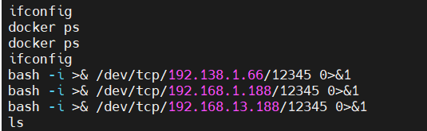

```
sed -i '/192.168.1.188/'d .bash_history
```

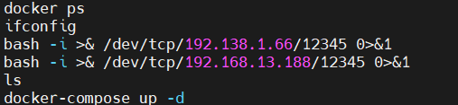

或者可以这样，先通过grep取反把自己的敏感字剔除出去保存个新文件，然后将内容替换到日志文件中

```
cat /var/log/nginx/access.log | grep -v evil.php > tmp.log
cat tmp.log > /var/log/nginx/access.log/
rm tmp.log
```


对于**二进制日志文件**，部分删除需要使用`utmpdump`命令，`utmpdump`可以将`wtmp`和`utmp`转换为文本文件，将文本文件编辑修改后恢复成二进制文件即可，如下面针对`wtmp`进行修改：

```
# 将二进制日志文件转换为可编辑的文本文件
utmpdump /var/log/wtmp >/var/log/wtmp.file
# 对文本文件进行编辑和修改，例如
sed -i '/192.168.1.4/'d /var/log/wtmp.file
# 将编辑修改后的文本文件转换为二进制日志文件
utmpdump -r < /var/log/wtmp.file > /var/log/wtmp
```

#### 3）全部删除

直接`rm -rf `可能有些文件删不掉或影响某些服务的正常运行，可以将日志文件全部删除即将空字符写入日志文件。不留下任何痕迹，但是特征也很明显，容易被察觉，一般不推荐使用。需要root权限，有五种命令可以实现：

```
cat /dev/null > filename
: > filename
>  filename
echo "" > filename
echo > filename
```

区别：前三种命令清空文件后文件大小为0，后两种命令清空文件后会留下一个换行符，文件大小为1byte。

### 3.3 其他

#### 1）ssh隐藏登录

从应用层面通过参数选择隐藏记录，如ssh远程隐藏登录：

登录时不分配伪终端，不会记录在utmp、wtmp、btmp中，不会被w、who、users、last、lastb命令发现：

```
ssh -T root@192.168.126.1 /bin/bash -i
-T：不分配伪终端
-i：bash的参数，表示交互式shell
```

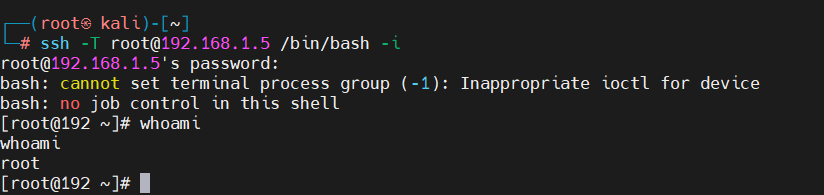

w命令查看当前登录用户，可以看到没有发现上面的root用户，只有ps查看进程才能看到

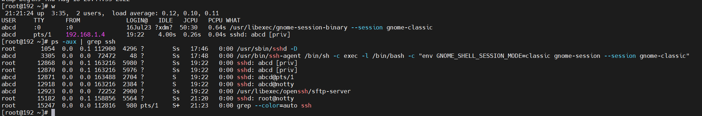

登录时不将ssh公钥保存在本地`.ssh`目录中：

```
ssh -o UserKnownHostsFile=/dev/null -T root@192.168.126.2 /bin/bash –i
-o：options选择信息
```

<font color=red>注：使用ps命令可以查看到ssh隐藏登录的进程</font>

#### 2）文件时间修改

比如一些木马文件或其它文件想修改下时间，防止引起管理员注意，则可以使用touch命令修改，查看一个文件的时间可以用stat命令。

```
stat test.txt
```

这个命令会显示三个时间，一个最近访问时间，一个最近修改时间，一个最近改动时间。**访问时间**用`-a`参数可以改，**修改时间**用`-m`参数可以改，**改动时间**不可以改，因为改动时间是系统自动更新的，包含了元数据的改动。

```
touch -a -d "2023-02-02 11:10:20.000235123" test.txt
touch -m -d "2023-02-02 12:10:20.010242137" test.txt
```
`-d`参数指定你要修改的时间，点后面是时间戳，随意输入就可以，不要为一串零，容易引起怀疑。

> 关于这三个时间的区别[Linux文件最近访问、最近更改、最近改动时间说明_linux最近更改和最近改动_印特的博客-CSDN博客](https://blog.csdn.net/qq_42453713/article/details/125465337#)

至于那个不能修改的**改动时间**，非要改动，思路就是先改动系统时间，然后修改目标文件，最后再恢复系统时间即可。

```
# date修改系统时间，s参数指定时间
date -s "20230201 16:43:53"
# touch还是用来修改文件时间，r是指定参考文件（任意指定就可以），意思是把指定的参考文件时间赋给目标文件
touch -r ~/.bashrc test.txt
# hwclock是指的硬件中的时间，hctosys意思是把硬件时间同步给系统
hwclock --hctosys
```

#### 3）文件擦除

当担心目标利用一些恢复软件来恢复已经删除的文件，则可以去彻底删除，也就是通过多次对一个文件进行写入擦除操作，导致无法还原已有的内容。`shred`示例如下：

```
shred -f -u -z -v -n 8 test.txt
```

`-f`是强制的意思，即使文件只读没权限也会进行覆盖。

`-u`在覆盖完成后进行删除。

`-z`是覆盖完成后进行一次填充操作，避免文件存在信息泄露。

`-v`是显示执行的详细信息。

`-n`指覆盖次数，上面例子是8次。

原理和前面windows的2.2节的删除日志文件部分的[直接删除文件](#####直接删除文件)相同。

