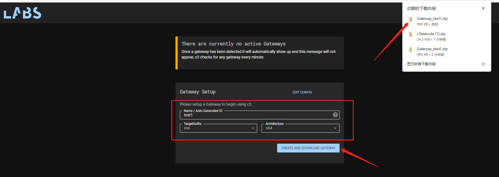
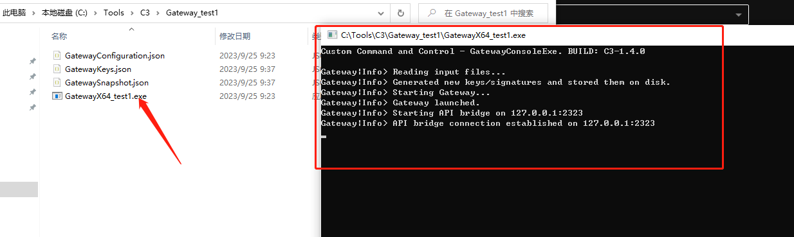
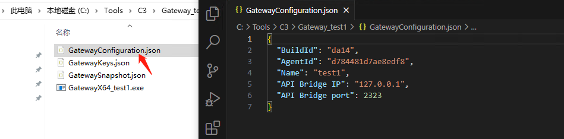
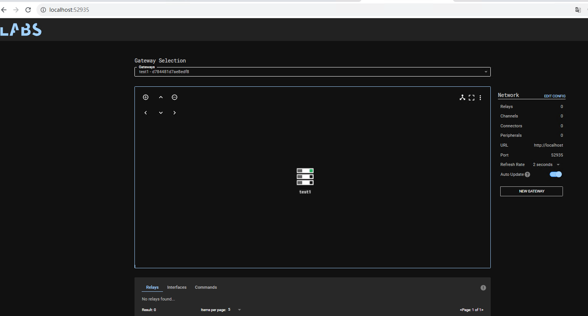
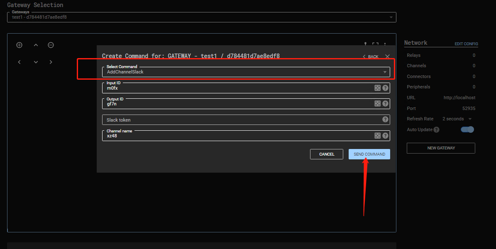
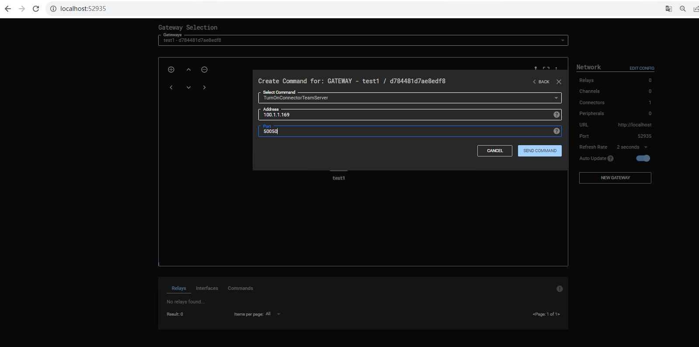
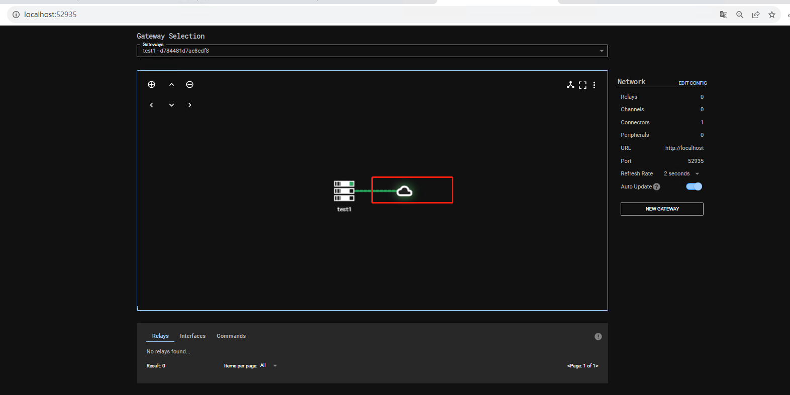
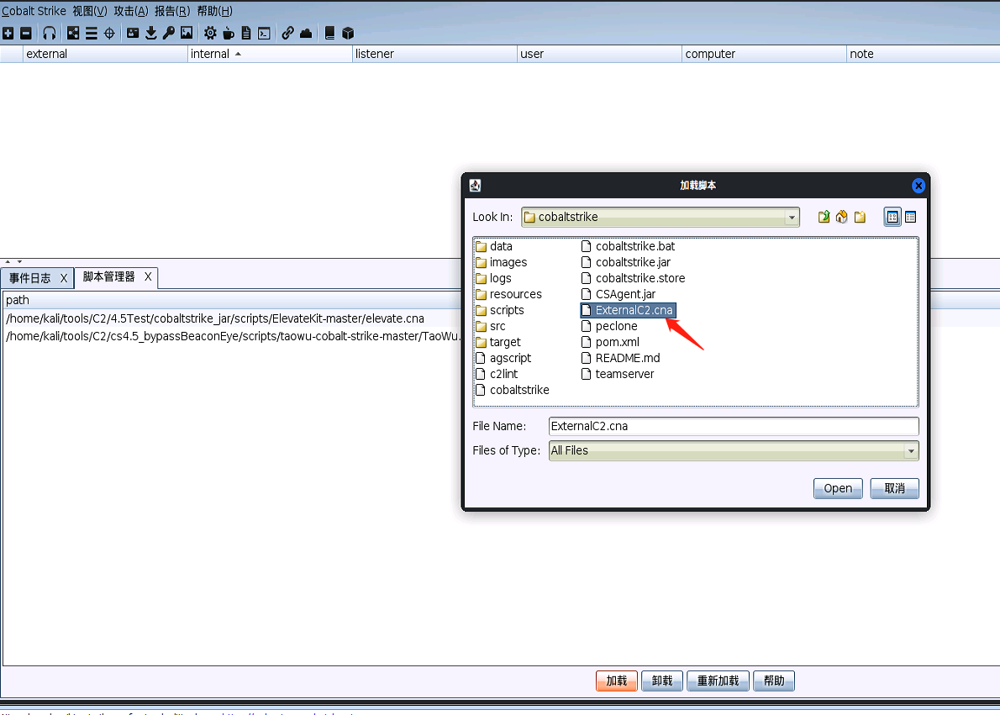
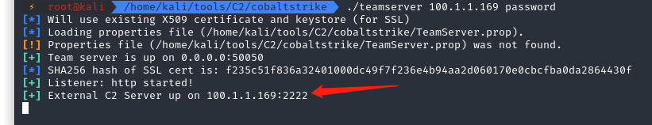

# C3（Custom Command and Control）使用

翻译了官网对一些术语的定义：

- Relays（中继） – 在受感染的主机上启动的可执行文件。中继通过接口在彼此之间或返回到网关进行通信。
- Gateway（网关） – 一种控制一个 C3 网络的特殊继电器。如果没有可运行的网关，C3 网络就无法运行。网关是从中继返回攻击者基础设施的桥梁。网关还负责与第三方 C2 服务器（例如 Cobalt Strike 的 Teamserver）进行通信。
- Channels（通道） - 中继之间传递数据的商定方案。例如 Slack 的 API。
- Gateway Return Channel (网关返回通道 GRC)  - 中继将用于将数据发送回网关的已配置通道。请注意，GRC 可能是经过另一个中继的路由。
- Interfaces（接口）— 一个高级名称，指的是有助于在 C3 网络内发送和接收数据的任何事物。
- Routes（路由） – 跨中继返回网关的预期通信路径。
- Peripheral（外围设备） – 命令和控制框架的第三方植入。外设通过“控制器”与其本机控制器通信。例如，Cobalt Strike 的 SMB 信标。
- Connector（连接器）– 与第三方命令和控制框架的集成。例如，Cobalt Strike 的 Teamserver 通过 externalc2_start 命令公开的“外部 C2”接口。

网管配置：选择好后点击`创建和下载网关`，浏览器会去下载一个名为`Gateway_YourName`的压缩包

解压后双击exe

IP和端口可以再这里改

网关就起来了

**连接CS的Teamserver**

双击网关的图标，选择“命令中心”按钮

- 在“选择命令”下拉列表中，选择一个命令，这里选择了`TurnOnConnectorTeamServer`，填写TeamServer的IP和端口

填写好后点`Send Command`，结果如下（若右侧的Auto Update没打开，需要刷新一下浏览器页面才可以看到）

