# OpenWrt 安装使用

<!-- more -->

### 1. 下载

在阿里或者清华的镜像站，我这里下载的是最新版，链接如下：

```
https://mirrors.tuna.tsinghua.edu.cn/openwrt/releases/22.03.3/targets/x86/64/openwrt-22.03.3-x86-64-generic-ext4-combined-efi.img.gz
https://mirrors.aliyun.com/openwrt/releases/22.03.3/targets/x86/64/openwrt-22.03.3-x86-64-generic-ext4-combined-efi.img.gz
```

### 2. 解压并转格式

下载下来的东西包了一层 gz 压缩壳，先解压它；解压完毕后，会发现解压出来的格式是 img，需要转成 vm 认识的 vmdk 格式。

安装[**StarWind V2V Converter**](https://www.starwindsoftware.com/tmplink/starwindconverter.exe)，启动后默认下一步转换格式为 vmdk 即可。

选择一个安装好的 linux 虚拟机，把原来的硬盘删掉，重新添加后选择上面转换出来的 vmdk 文件。

### 3. 修改 UI 界面

打开虚拟机。等待一会后回车；输入命令`vim /etc/config/network`修改 IP，改成与主机同网段的任意 IP，保证主机能访问到即可（后续配置可以通过 UI 界面修改）；

保存文件后，执行命令 `/etc/init.d/network reload`，这个时候应该可以看到 eth0 网卡和所绑定的 IP。

浏览器输入修改后的 IP 即可访问 openwrt，下载中文包和一些主题，点击系统--软件包--上传软件包，上传后会自动安装（参考https://blog.csdn.net/user1913817/article/details/128674029）。

安装好后点击系统--系统--语言和界面，选择语言和主题。

### 4. 配置网络

点击网络--接口--编辑，将协议修改为 DHCP 后保存并应用，删除原来的网络适配器，重新添加，VMware 就会给这个虚拟机重新分配一个 IP（公司内部选择 NAT 模式，防止 IP 冲突）。

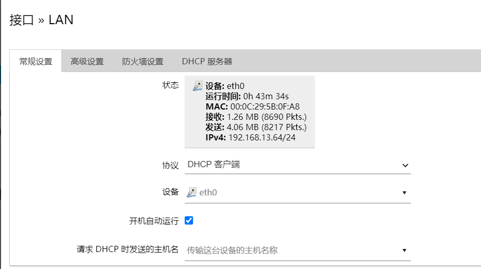

此时查看网络配置`vim /etc/config/network`，如下

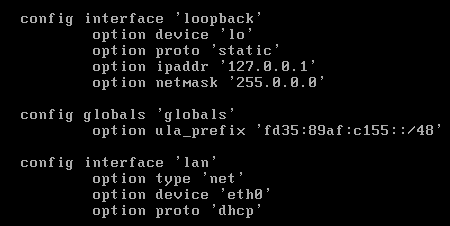

输入`ip a`命令，可以看到给 OpenWrt 分配的 IP 为 192.168.13.64


点击网络--网络诊断，可以测试网络是否配置成功

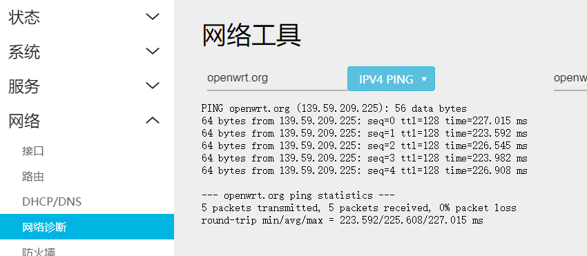

### 5. 安装 OpenClash 插件

github 地址https://github.com/vernesong/OpenClash/releases，先安装依赖：

```
opkg update
opkg install coreutils-nohup bash iptables dnsmasq-full curl ca-certificates ipset ip-full iptables-mod-tproxy iptables-mod-extra libcap libcap-bin ruby ruby-yaml kmod-tun kmod-inet-diag unzip luci-compat luci luci-base
```

下载https://github.com/vernesong/OpenClash/releases/download/v0.45.87-beta/luci-app-openclash_0.45.87-beta_all.ipk，通过系统--软件包--上传软件包，即可安装OpenClash，安装好后重启即可出现如下界面：


### 6. 配置代理

选择配置文件订阅，编辑好名字和订阅地址，勾选在线订阅转换，点击保存；

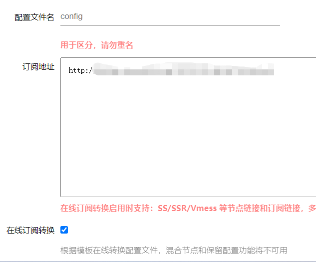

勾选自动更新，然后保存配置---更新配置。

在 OpenClash 的运行状态页，将配置文件切换为刚才填写的配置，点击启动 OpenClash。

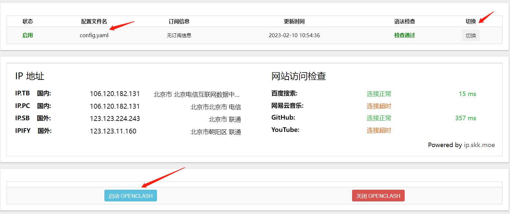

可以在这个页面选择代理模式，也可以打开控制面板。

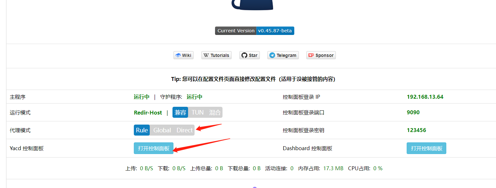

### 7. 使用代理

将需要代理的主机配置网关为 OpenWrt 的 IP，如下：

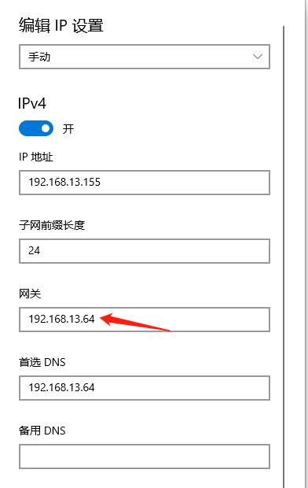

OpenClash 的代理模式选择**全局代理**，并打开控制面板选择合适的代理服务器。


这里选择一个香港的节点，访问一下谷歌成功，就表示代理成功了。


### 8. 配置防火墙

> **目的：**让所有代理服务器支持的流量都走代理，配置防火墙规则让代理不了的流量直接丢掉，防止源 IP 暴露。

iptables 根据功能划分不同的表来处理不同的功能逻辑，当前包含 5 个表，分别为 filter、nat、mangle、raw 和 security。filter 是 iptables 的默认表，主要用于报文过滤，在这里根据报文的内容对报文进行丢弃或者接收。它包含有 3 个内置规则链：

- INPUT 规则用于匹配流量从这个安全域的接口到达路由器本身，即目的地址为路由器 IP 地址的流量
- OUTPUT 规则用于处理从路由器自己产生的报文并通过安全域的接口， 即作用于源地址为路由器地址的报文
- FORWARD 规则用于处理从一个安全域到另外一个 安全域的报文，即经过路由器来转发的报文

这样每一个 IP 报文只经过这 3 个内置链中的一个，便于进行数据报文匹配和处理。 这里是真正实现防火墙处理的地方。

挂代理后，OpenWrt 先判断流量能否能通过代理服务器，代理支持的流量类型会让代理去转发，代理不支持的流量尝试自己转发(走 FORWARD 转发链)，可以通过配置防火墙规则，让所有流量都走代理，不让 OpenWrt 自己转发，当然，也不让 OpenWrt 自己产生流量发出去。

---

可以在 OpenWrt 的网络--防火墙配置流量规则，如下：

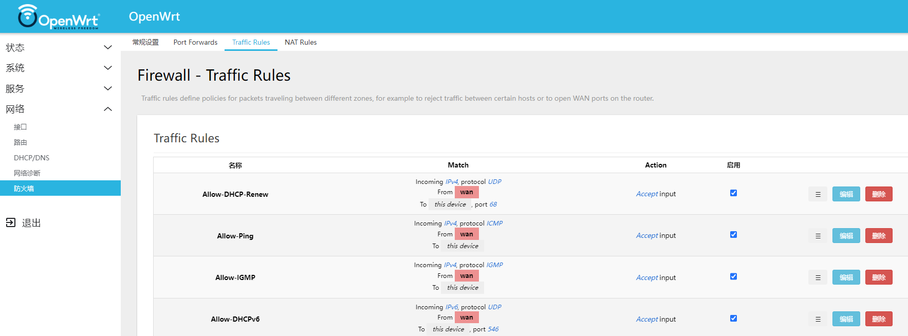

具体如何配置防火墙，需要看代理类型和实际需求。

> **OpenWrt 的防火墙规则优先级：**第一个规则如果没有匹配， 则继续下一个规则匹配，直到数据报文命中 ACCEPT、DROP 或 REJECT 之一。如果直到最后一个仍未匹配，默认规则最后生效，具体的规则首先起作用。 在配置文件中，默认规则在最前面，但最后生效，同级别的规则按照配置文件顺序先后生效。

---

例如，当挂 SOCKS 代理(SOCK4 只支持 TCP 协议；SOCK5 支持 TCP 和 UDP 协议)，可以禁止 ICMP 流量的转发。

配置如下时，可以正常上网，防火墙处理的是代理服务器无法代理的流量。流量会先走 OpenWrt，无法走代理的 ICMP 包会被 OpenWrt 拒绝，其余流量会走代理。

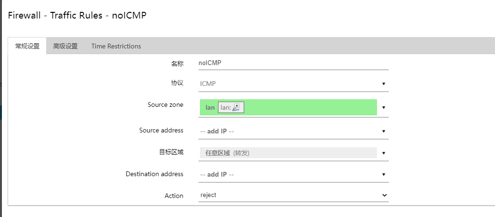

设置 ICMP 协议 reject 后，ping www.baidu.com 不通。


在主机抓包，可以看到从 192.168.13.155 虚拟机上发给 OpenWrt 的 DNS 请求，剩下的 ICMP 包没有响应，被 OpenWrt 拦住了。


> 这里配置成 DROP 也可以，REJECT 和 DROP 一样丢弃报文，但 REJECT 的不同之处在于同时还向发送者返回一 个 ICMP 错误消息，这样发送者将知道报文被丢弃，选择丢弃报文安全优势超过拒绝，因为这样暴露给攻击者的信息较少，然而在调试网络问题时会遇到困难。
>
> 此处参考：[万字讲解 OpenWrt 防火墙 iptables，并使用 UCI 配置防火墙](https://blog.51cto.com/u_15346415/5224158)

配置成 drop 就会：


配置成 drop 后的流量：


修改为 accept 后，可以通。

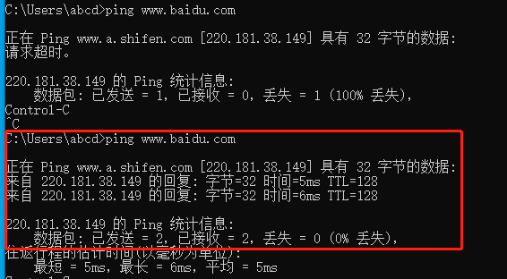

---

为了在挂代理后使用更安全，可以将防火墙 FORWARD 时候的所有协议都选择上（也就是让 OpenWrt 不转发任何流量，全都走代理），防止源 IP 暴露。

下图中的 lan 可以换成 anyzone，因为我这里只有一个 zone,也就是 lan。（防火墙的核心是防火墙规则，所有的规则在一起就是规则集。但是手动维护这些规则集将非常困难，因此 OpenWrt 定义了安全域（Zone）的概念，安全域是一个相同规则的区域，一个安全域根据接口来划分，可以包含一个或多个接口。可以同时定义多个接口的默认规则，以及接口之间的转发规则。）


我的代理服务器 IP：


在公网服务器上起了 http 服务，然后在本地(192.168.13.155)访问，可以看到是代理服务器去请求的，抓包结果如下：


然后尝试 ping，结果不通，因为代理不支持 ICMP，防火墙规则就把 ICMP 流量拦住了。在服务器上抓包，没有发现与本地主机或代理服务器相关的 ICMP 包。


---

**注意：**配置成下面这样，所有对应类型的经过 OpenWrt 的流量都被丢掉了，如下就无法上网了，使用这种方法要选择需要禁用的协议，不能乱选。


由于 OpenWrt 本身也能上网，为了防止 DNS 流量从 OpenWrt 出去，可以把代理服务器的 IP 加到白名单，其余都禁止，如下：


使用 dnslog 测试一下（好像说明不了啥）：

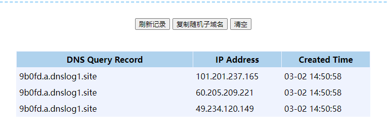

此时就能保证所有 DNS 流量都去走代理了。

对于 ICMP 流量也是可以完全禁止，如下：


**综上：**最简单粗暴且安全的防止 IP 暴露的方法就是，确定一下自己的代理类型，对于代理不支持的流量，直接像后面三条规则一样，直接禁止掉。

---

**注意：**OpenWrt 的**设备输入**配置的时候，不能乱选（尤其是 TCP），配置成下面这样会使得 OpenWrt 的管理界面无法访问了，需要手动敲命令，修改配置文件才能恢复。

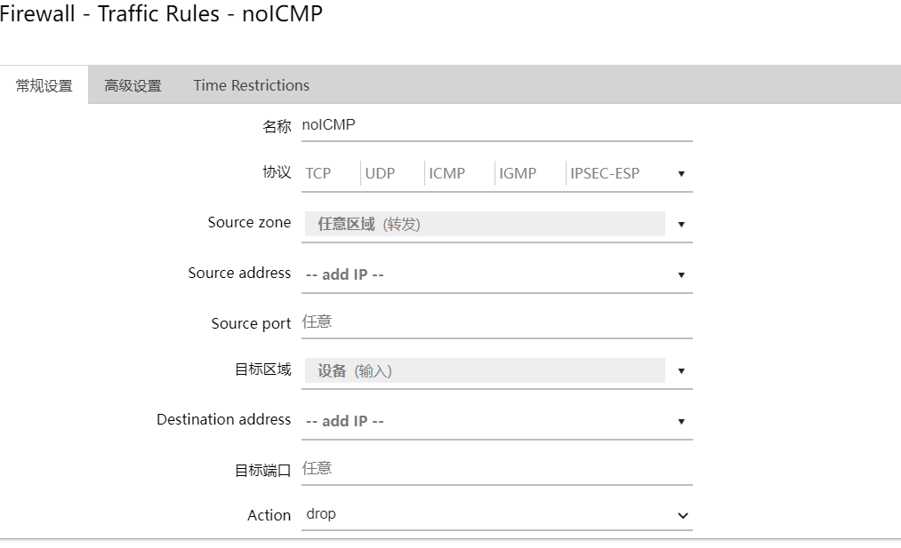

修改配置文件命令：

```
vim /etc/config/firewall   # 把配错的删掉或者修改为ACCEPT

/etc/init.d/firewall reload  # reload一下，再访问web页面就好了
```

**参考**

https://openwrt.org/zh-cn/doc/uci/firewall

https://blog.51cto.com/u_15346415/5224158
