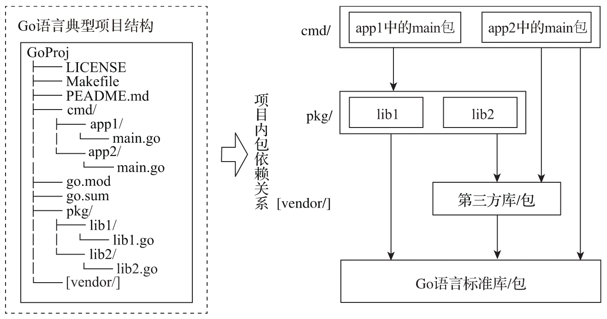
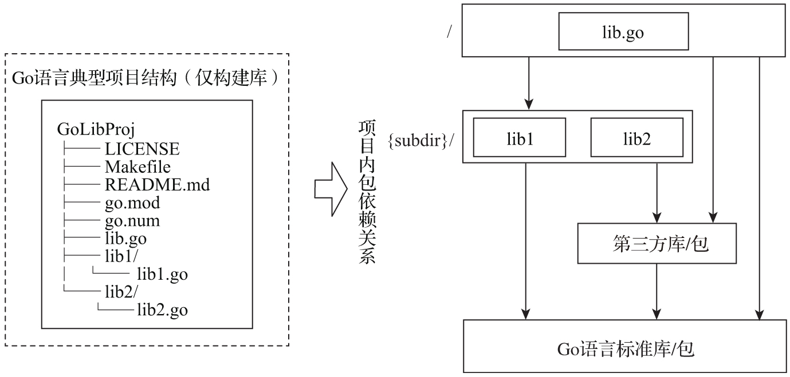

# 2. 项目结构、代码风格与标识符命名

## 2.1. 使用得到公认且广泛使用的项目结构

### Go语言自身的项目结构

commit 1e3ffb0c（2019.5.14），Go项目结构如下：

```
$ tree -LF 1 ~/go/src/github.com/golang/go
./go
├── api/
├── AUTHORS
├── CONTRIBUTING.md
├── CONTRIBUTORS
├── doc/
├── favicon.ico
├── lib/
├── LICENSE
├── misc/
├── PATENTS
├── README.md
├── robots.txt
├── src/
└── test/
```

作为Go语言的创世项目，Go的项目结构的布局对后续的Go语言项目具有重要的参考意义，尤其是早期Go项目中src目录下面的结构，更是在后续被Go社区作为Go应用项目结构的模板广泛使用。

```
$ tree -LF 1 ./src
./src
├── all.bash*
├── all.bat
├── all.rc*
├── clean.bash*
├── clean.bat
├── clean.rc*
├── cmd/
├── lib9/
├── libbio/
├── liblink/
├── make.bash*
├── make.bat
├── Make.dist
├── make.rc*
├── nacltest.bash*
├── pkg/
├── race.bash*
├── race.bat
├── run.bash*
├── run.bat
├── run.rc*
└── sudo.bash*
```

关于上面src目录下的结构，

1）代码构建的脚本源文件放在src下面的顶层目录下。

2）src下的二级目录cmd下面存放着Go工具链相关的可执行文件（比如go、gofmt等）的主目录以及它们的main包源文件。

```
$ tree -LF 1 ./cmd
./cmd
...
├── 6a/
├── 6c/
├── 6g/
...
├── cc/
├── cgo/
├── dist/
├── fix/
├── gc/
├── go/
├── gofmt/
├── ld/
├── nm/
├── objdump/
├── pack/
└── yacc/
```

3）src下的二级目录pkg下面存放着上面cmd下各工具链程序依赖的包、Go运行时以及Go标准库的源文件。Go 1.4版本删除了Go源码树中`src/pkg/xxx`中的pkg这一层级目录，改为直接使用`src/xxx`。

```
$ tree -LF 1 ./pkg
./pkg
...
├── flag/
├── fmt/
├── go/
├── io/
├── log/
├── math/
...
├── syscall/
├── testing/
├── text/
├── time/
├── unicode/
└── unsafe/
```


### Go项目结构的最小标准布局

作为Go语言项目的技术负责人，Russ Cox在一个开源项目的issue中给出了他关于Go项目结构的最小标准布局的想法。他认为Go项目的最小标准布局应该是这样的：

```
// 在Go项目仓库根路径下

- go.mod
- LICENSE
- xx.go
- yy.go
...
```

或

```
- go.mod
- LICENSE
- package1
        - package1.go
- package2
        - package2.go
...
```

pkg、cmd、docs这些目录不应该成为Go项目标准结构的一部分，至少不是必需的。

### 以构建可执行文件为目的的Go项目结构

基于Go语言项目自身的早期结构以及后续演进，Go社区在多年的Go语言实践积累后逐渐形成了一种典型项目结构，这种结构与Russ Cox的最小标准布局是兼容的



就是一个支持（在cmd下）构建二进制可执行文件的典型Go项目的结构，我们分别来看一下各个重要目录的用途。

cmd目录：存放项目要构建的可执行文件对应的main包的源文件。如果有多个可执行文件需要构建，则将每个可执行文件的main包单独放在一个子目录中，比如图中的app1、app2。cmd目录下的各app的main包将整个项目的依赖连接在一起，并且通常来说，main包应该很简洁。我们会在main包中做一些命令行参数解析、资源初始化、日志设施初始化、数据库连接初始化等工作，之后就会将程序的执行权限交给更高级的执行控制对象。有一些Go项目将cmd这个名字改为app，但其功用并没有变。

pkg目录：存放项目自身要使用并且同样也是可执行文件对应main包要依赖的库文件。该目录下的包可以被外部项目引用，算是项目导出包的一个聚合。有些项目将pkg这个名字改为lib，但该目录的用途不变。由于Go语言项目自身在1.4版本中去掉了pkg这一层目录，因此有一些项目直接将包平铺到项目根路径下，但笔者认为对于一些规模稍大的项目，过多的包会让项目顶层目录不再简洁，显得很拥挤，因此个人建议对于复杂的Go项目保留pkg目录。

go.mod和go.sum：Go语言包依赖管理使用的配置文件。Go 1.11版本引入Go module机制，Go 1.16版本中，Go module成为默认的依赖包管理和构建机制。因此对于新的Go项目，建议基于Go module进行包依赖管理。对于没有使用Go module进行包管理的项目（可能主要是一些使用Go 1.11以前版本的Go项目），这里可以换为dep的Gopkg.toml和Gopkg.lock，或者glide的glide.yaml和glide.lock等。

vendor目录（可选）：vendor是Go 1.5版本引入的用于在项目本地缓存特定版本依赖包的机制。在引入Go module机制之前，基于vendor可以实现可重现的构建（reproducible build），保证基于同一源码构建出的可执行程序是等价的。Go module本身就可以实现可重现的构建而不需要vendor，当然Go module机制也保留了vendor目录（通过go mod vendor可以生成vendor下的依赖包；通过go build -mod=vendor可以实现基于vendor的构建），因此这里将vendor目录视为一个可选目录。一般我们仅保留项目根目录下的vendor目录，否则会造成不必要的依赖选择的复杂性。

### 以只构建库为目的的Go项目结构

Go 1.4发布时，Go语言项目自身去掉了src下的pkg这一层目录，这个结构上的改变对那些以只构建库为目的的Go库类型项目结构有一定的影响。我们来看一个典型的Go语言库类型项目的结构布局



去除了cmd和pkg两个子目录：由于仅构建库，没必要保留存放二进制文件main包源文件的cmd目录；由于Go库项目的初衷一般都是对外部（开源或组织内部公开）暴露API，因此也没有必要将其单独聚合到pkg目录下面了。

vendor不再是可选目录：对于库类型项目而言，不推荐在项目中放置vendor目录去缓存库自身的第三方依赖，库项目仅通过go.mod（或其他包依赖管理工具的manifest文件）明确表述出该项目依赖的模块或包以及版本要求即可。

### 关于internal目录

无论是上面哪种类型的Go项目，对于不想暴露给外部引用，仅限项目内部使用的包，在项目结构上可以通过Go 1.4版本中引入的internal包机制来实现。以库项目为例，最简单的方式就是在顶层加入一个internal目录，将不想暴露到外部的包都放在该目录下，比如下面项目结构中的ilib1、ilib2：

```
// 带internal的Go库项目结构

$tree -F ./chapter2/sources/GoLibProj
GoLibProj
├── LICENSE
├── Makefile
├── README.md
├── go.mod
├── internal/
│  ├── ilib1/
│  └── ilib2/
├── lib.go
├── lib1/
│  └── lib1.go
└── lib2/
      └── lib2.go
```

这样，根据Go internal机制的作用原理，internal目录下的ilib1、ilib2可以被以GoLibProj目录为根目录的其他目录下的代码（比如`lib.go`、`lib1/lib1.go`等）所导入和使用，但是却不可以为GoLibProj目录以外的代码所使用，从而实现选择性地暴露API包。

