# 1. 入门

## 1.1 Hello, World

### GOPROXY设置

windows下载安装包，直接默认安装。此处版本go1.15.15

```
PS C:\Users\echo0d\Desktop\gopl.io-master\ch1\helloworld> go env
set GO111MODULE=on
set GOARCH=amd64                                  
set GOBIN=                                        
set GOCACHE=C:\Users\echo0d\AppData\Local\go-build
set GOENV=C:\Users\echo0d\AppData\Roaming\go\env  
set GOEXE=.exe                                    
set GOFLAGS=
set GOHOSTARCH=amd64
set GOHOSTOS=windows
set GOINSECURE=
set GOMODCACHE=C:\Users\echo0d\go\pkg\mod
set GONOPROXY=
set GONOSUMDB=
set GOOS=windows
set GOPATH=C:\Users\echo0d\go
set GOPRIVATE=
set GOPROXY=https://proxy.golang.org,direct
set GOROOT=C:\Program Files\Go
set GOSUMDB=sum.golang.org
set GOTMPDIR=
set GOTOOLDIR=C:\Program Files\Go\pkg\tool\windows_amd64
set GCCGO=gccgo
set AR=ar
set GOMOD=C:\Users\echo0d\Desktop\gopl.io-master\go.mod
set CGO_CFLAGS=-g -O2
set CGO_CPPFLAGS=
set CGO_CXXFLAGS=-g -O2
set CGO_FFLAGS=-g -O2
set CGO_LDFLAGS=-g -O2
set PKG_CONFIG=pkg-config
set GOGCCFLAGS=-m64 -mthreads -fno-caret-diagnostics -Qunused-arguments -fmessage-length=0 -fdebug-prefix-map=C:\Users\echo0d\AppData\Local\Temp\go-build967739482=/tmp/go-build -gno-record-gcc-switches
```

编译程序会报错

```
PS C:\Users\echo0d\Desktop\gopl.io-master\ch1\helloworld> go run main.go
go: golang.org/x/net@v0.0.0-20210929193557-e81a3d93ecf6: Get "https://proxy.golang.org/golang.org/x/net/@v/v0.0.0-20210929193557-e81a3d93ecf6.mod": dial tcp [2404:6800:4003:c04::8d]:443: connectex: A connection attempt failed because the connected party did not properly respond after a period of time, or established connection failed because connected host has failed to respond.
```

原因：从 `Go 1.11` 版本开始，官方支持了 `go module` 包依赖管理工具。还新增了 `GOPROXY` 环境变量。

如果设置了该变量，下载源代码时将会通过这个环境变量设置的代理地址，而不再是以前的直接从代码库下载。也就是这个变量

```cmd
go env -w GO111MODULE=on
go env -w GOPROXY=https://goproxy.cn,direct
```

powershell执行，https://goproxy.io这个项目看起来非常不错

```powershell
# 启用 Go Modules 功能
$env:GO111MODULE="on"
# 配置 GOPROXY 环境变量
$env:GOPROXY="https://goproxy.io"
```

cmd执行

```cmd
set GOPROXY=https://proxy.golang.org,direct
```

如果使用的 Go 版本>=1.13, 你可以通过设置 GOPRIVATE 环境变量来控制哪些私有仓库和依赖(公司内部仓库)不通过 proxy 来拉取，直接走本地，设置如下：

```powershell
# 配置 GOPROXY 环境变量
$env:GOPROXY = "https://goproxy.io,direct"
# 设置不走 proxy 的私有仓库或组，多个用逗号相隔（可选）
$env:GOPRIVATE = "git.mycompany.com,github.com/my/private"
```

除此之外还有

七牛云：https://goproxy.cn

aliyun：https://mirrors.aliyun.com/goproxy/

> 后面感觉go1.15版本有点低，改成 go1.21.8

### Hello, World

初始化，新建一个文件夹，例如ch2

```cmd
cd ch2
go mod init ch2
# 生成一个go.mod文件，内容如下
module ch2
go 1.22.1

```

示例代码*gopl.io/ch1/helloworld*

```go
package main

import "fmt"

func main() {
    fmt.Println("Hello, 世界")
}
```

> Go语言的函数名首字母一定要大写，上面如果写成fmt.println就不对

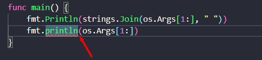

Go是一门编译型语言，Go语言提供的工具都通过一个单独的命令`go`调用，`go`命令有一系列子命令。最简单的一个子命令就是run。这个命令编译一个或多个以.go结尾的源文件，链接库文件，并运行最终生成的可执行文件。

```
$ go run helloworld.go
```

这个命令会输出：

```
Hello, 世界
```

Go语言原生支持Unicode，它可以处理全世界任何语言的文本。

单独编译这个程序，保存编译结果以备将来之用。可以用build子命令：

```
$ go build helloworld.go
```

这个命令生成一个名为helloworld的可执行的二进制文件，Windows系统下生成的可执行文件是helloworld.exe，增加了.exe后缀名

```
.\helloworld.exe
Hello, 世界
```

### package/import

* Go代码结构

Go语言的代码通过`包（package）`组织，包类似于其它语言里的库（libraries）或者模块（modules）。一个包由位于`单个目录`下的一个或多个.go源代码文件组成

> 也就是说，一个文件夹下的go文件应该属于同一个包

`main`包比较特殊。它定义了一个独立可执行的程序，而不是一个库。在`main`里的`main` 函数也很特殊，它是整个程序执行时的入口（译注：C系语言差不多都这样）。

每个源文件都以一条`package`声明语句开始，例子里的`package main`，表示该文件属于哪个包，紧跟着一系列导入（`import`）的包，**`import` 声明必须跟在文件的 `package` 声明之后**。

> :warning: 必须恰当导入需要的包，**缺少了必要的包或者导入了不需要的包，程序都无法编译通过**。这项严格要求避免了程序开发过程中引入未使用的包:exclamation:

之后是这个文件里的其他程序语句，是组成程序的函数、变量、常量、类型的声明语句（分别由关键字 `func`、`var`、`const`、`type` 定义）。

* Go 语言不需要在语句或者声明的末尾添加分号，除非一行上有多条语句。编译器会主动把特定符号后的换行符转换为分号

  例子，函数的左括号 `{` 必须和 `func` 函数声明在同一行上，且位于末尾，不能独占一行，而在表达式 `x+y` 中，可在 `+` 后换行，不能在 `+` 前换行（译注：以+结尾的话不会被插入分号分隔符，但是以 x 结尾的话则会被分号分隔符，从而导致编译错误）。

* Go 语言在代码格式上采取了很强硬的态度。`gofmt`工具把代码格式化为标准格式

  很多文本编辑器都可以配置为保存文件时自动执行 `gofmt`，这样你的源代码总会被恰当地格式化。还有个相关的工具：`goimports`，可以根据代码需要，自动地添加或删除 `import` 声明。这个工具并没有包含在标准的分发包中，可以用下面的命令安装：

  ```shell
  go install golang.org/x/tools/cmd/goimports@latest
  ```

## 1.2 命令行参数

示例代码

```go
package main

import (
	"fmt"
	"os"
)

func main() {
	var s, sep string
	// var 声明定义了两个 string 类型的变量 s 和 sep。变量会在声明时直接初始化。
	// 如果变量没有显式初始化，则被隐式地赋予其类型的零值，数值类型是0，字符串类型是空字符串""

	for i := 1; i < len(os.Args); i++ {
		s += sep + os.Args[i]
		// 对 string 类型，+ 运算符连接字符串
		// 等价于：s=s+sep+os.Args[i]。
		sep = " "
	}
	fmt.Println(s)
}

```

### 切片

* 程序的命令行参数可从 `os` 包的 `Args` 变量获取；`os` 包外部使用 `os.Args` 访问该变量。`os.Args` 变量是一个字符串（string）的`切片（slice）`。

* `os.Args` 的第一个元素：`os.Args[0]`，是命令本身的名字；其它的元素则是程序启动时传给它的参数。

* `s[m:n]` 形式的切片表达式，产生从第 `m` 个元素到第 `n-1` 个元素的切片，如果省略切片表达式的索引，会默认传入 `0` 或 `len(s)`。（区间索引时，Go 语言里也采用左闭右开形式）`os.Args[1:len(os.Args)]` 切片，可以简写成 `os.Args[1:]`

> 注释语句以 `//` 开头。

### s+=  i++

上面`s += sep + os.Args[i]`等价于：`s=s+sep+os.Args[i]`。看起来和其他语言一样的，但是

> 自增语句 `i++` 给 `i` 加 `1`；这和 `i+=1` 以及 `i=i+1` 都是等价的。对应的还有 `i--` 给 `i` 减 `1`。它们是语句，而不像 C 系的其它语言那样是表达式。所以 `j=i++` 非法，而且 `++` 和 `--` 都只能放在变量名后面，因此 `--i` 也非法。

### for循环

Go 语言只有 `for` 循环这一种循环语句。`for` 循环有多种形式，

**for循环1**

其中一种如下所示：

```go
for initialization; condition; post {
    // zero or more statements
}
```

`for` 循环三个部分不需括号包围。大括号强制要求，左大括号必须和 *`post`* 语句在同一行。

* `initialization` 语句是可选的，在循环开始前执行。`initalization`如果存在，必须是一条 *简单语句*（simple statement），即，短变量声明、自增语句、赋值语句或函数调用。
* `condition` 是一个布尔表达式（boolean expression），其值在每次循环迭代开始时计算。如果为 `true` 则执行循环体语句。
* `post` 语句在循环体执行结束后执行，之后再次对 `condition` 求值。`condition` 值为 `false` 时，循环结束。

for 循环的这三个部分**每个都可以省略**，如果省略 `initialization` 和 `post`，分号也可以省略：

```go
// a traditional "while" loop
for condition {
    // ...
}
```

如果连 `condition` 也省略了，像下面这样：

```go
// a traditional infinite loop
for {
    // ...
}
```

这就变成一个无限循环，尽管如此，还可以用其他方式终止循环，如一条 `break` 或 `return` 语句。

**for循环2**

在某种数据类型的区间（range）上遍历，如字符串或切片。例如

```go
// Echo2 prints its command-line arguments.
package main

import (
    "fmt"
    "os"
)

func main() {
    s, sep := "", ""
    for _, arg := range os.Args[1:] {
        s += sep + arg
        sep = " "
    }
    fmt.Println(s)
}
```

### 空标识符

上面for循环2中，每次循环迭代，`range` 产生一对值（索引以及在该索引处的元素值）。这个例子不需要索引，一种思路是把索引赋值给一个临时变量（如 `temp`）然后忽略它的值，但 Go 语言不允许使用无用的局部变量（local variables），因为这会导致编译错误。

Go 语言中这种情况的解决方法是用 `空标识符（blank identifier）`，即 `_`（下划线）。空标识符可用于在任何语法需要变量名但程序逻辑不需要的时候。

### 声明&初始化

使用一条短变量声明来声明并初始化 `s` 和 `seps`

```go
s, sep := "", ""
```

声明一个变量有好几种方式，下面这些都等价：实践中一般使用前两种形式中的某个，初始值重要的话就显式地指定变量的值，否则指定类型使用隐式初始化。

```go
s := ""
var s string
var s = ""
var s string = ""
```

第一种形式，是一条短变量声明，最简洁，但只能用在函数内部，而不能用于包变量。

第二种形式依赖于字符串的默认初始化零值机制，被初始化为 `""`。

第三种形式用得很少，除非同时声明多个变量。

第四种形式显式地标明变量的类型，当变量类型与初值类型相同时，类型冗余，但如果两者类型不同，变量类型就必须了。

### `strings` 包的 `Join` 函数

*gopl.io/ch1/echo3*

```go
func main() {
    fmt.Println(strings.Join(os.Args[1:], " "))
}
```

最后，如果不关心输出格式，只想看看输出值，或许只是为了调试，可以用 `Println` 为我们格式化输出。

```go
fmt.Println(os.Args[1:])
```

这条语句的输出结果跟 `strings.Join` 得到的结果很像，只是被放到了一对方括号里。切片都会被打印成这种格式。

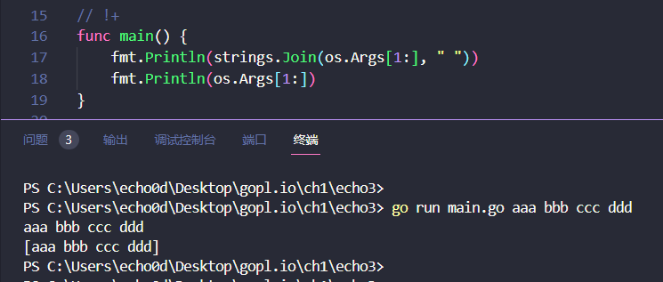

### 练习1.1&1.2

修改 `echo` 程序，使其打印每个参数的索引和值，每个一行。

```go
// 练习 1.1： 修改 echo 程序，使其能够打印 os.Args[0]，即被执行命令本身的名字。
// 练习 1.2： 修改 echo 程序，使其打印每个参数的索引和值，每个一行。
package main

import (
	"fmt"
	"os"
)

func main() {
	s, sep := "", ""
	for _, arg := range os.Args[1:] {
		s += sep + arg
		sep = " "
	}
	fmt.Println("只输出值")
	fmt.Println(s)

	fmt.Println("输出值和索引1：index, arg := range os.Args[1:]")
	for index, arg := range os.Args[1:] {
		fmt.Println("参数", index, "是", arg)
	}
	fmt.Println("输出值和索引2：index, arg := range os.Args")
	// 练习 1.1： 修改 echo 程序，使其能够打印 os.Args[0]，即被执行命令本身的名字。
	// Args[0:]的[0:]可以省略
	// for index, arg := range os.Args {
	for index, arg := range os.Args[0:] {
		fmt.Println("参数", index, "是", arg)
	}
}

```

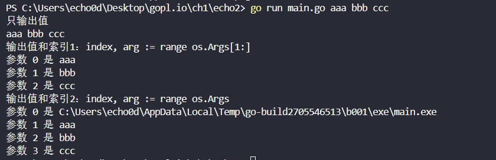

### 练习 1.3

 做实验测量潜在低效的版本和使用了 `strings.Join` 的版本的运行时间差异。

```go
package main

import (
	"fmt"
	"os"
	"strings"
	"time"
)

// !+
func main() {
	now1 := time.Now()
	s, sep := "", ""
	for _, arg := range os.Args[1:] {
		s += sep + arg
		sep = " "
	}
	fmt.Println(s)
	end1 := time.Now()
	fmt.Println("for range运行时间", end1.Sub(now1))
	now2 := time.Now()
	fmt.Println(strings.Join(os.Args[1:], " "))
	end2 := time.Now()
	fmt.Println("strings.Join运行时间", end2.Sub(now2))
	now3 := time.Now()
	fmt.Println(os.Args[1:])
	end3 := time.Now()
	fmt.Println("Println(os.Args[1:])运行时间", end3.Sub(now3))
}

```

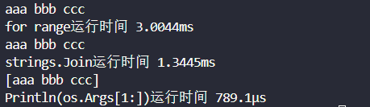

## 1.3 查找重复的行

例

```go

package main

import (
	"bufio"
	"fmt"
	"os"
)

func main() {
	counts := make(map[string]int) // 键是字符串，值是整数
	input := bufio.NewScanner(os.Stdin)
	for input.Scan() {
		counts[input.Text()]++
		// line := input.Text()
		// counts[line] = counts[line] + 1
	}
	// NOTE: ignoring potential errors from input.Err()
	for line, n := range counts {
		// if 语句条件两边也不加括号。if 语句的 else 部分是可选的
		if n > 1 {
			fmt.Printf("%d\t%s\n", n, line)
		}
	}
}

```

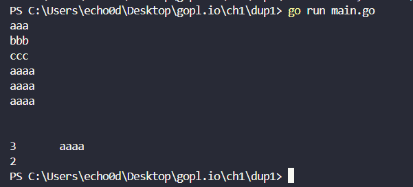

### if语句

正如 `for` 循环一样，`if` 语句条件两边也不加括号，但是主体部分需要加。`if` 语句的 `else` 部分是可选的，在 `if` 的条件为 `false` 时执行。

### map

**map** 存储了键/值（key/value）的集合，对集合元素，提供常数时间的存、取或测试操作。键可以是任意类型，只要其值能用 `==` 运算符比较，最常见的例子是字符串；值则可以是任意类型。

从功能和实现上说，`Go` 的 `map` 类似于 `Java` 语言中的 `HashMap`，Python 语言中的 `dict`，`Lua` 语言中的 `table`，通常使用 `hash` 实现。

每次 `dup` 读取一行输入，该行被当做键存入 `map`，其对应的值递增。`counts[input.Text()]++` 语句等价下面两句：

```go
line := input.Text()
counts[line] = counts[line] + 1
```

`map` 中不含某个键（首次读到新行时），等号右边的表达式 `counts[line]` 的值将被计算为其类型的零值，对于 `int` 即 `0`。

我们使用了基于 `range` 的循环，并在 `counts` 这个 `map` 上迭代。跟之前类似，每次迭代得到两个结果，键和其在 `map` 中对应的值。`map` 的迭代顺序并不确定，从实践来看，该顺序随机，每次运行都会变化。

### `bufio` 包

`bufio` 包，它使处理输入和输出方便又高效。`Scanner` 类型是该包最有用的特性之一，它读取输入并将其拆成行或单词；通常是处理行形式的输入最简单的方法。

程序使用短变量声明创建 `bufio.Scanner` 类型的变量 `input`。

```go
input := bufio.NewScanner(os.Stdin)
```

该变量从程序的标准输入中读取内容。每次调用 `input.Scan()`，即读入下一行，并移除行末的换行符；读取的内容可以调用 `input.Text()` 得到。`Scan` 函数在读到一行时返回 `true`，不再有输入时返回 `false`。

### `fmt.Printf` 

对一些表达式产生格式化输出。该函数的首个参数是个格式字符串，指定后续参数被如何格式化，默认情况下，`Printf` 不会换行。

- 关于 Printf 格式化输出:

  ```
  %d          十进制整数
  %x, %o, %b  十六进制，八进制，二进制整数。
  %f, %g, %e  浮点数： 3.141593 3.141592653589793 3.141593e+00
  %t          布尔：true或false
  %c          字符(rune)  (Unicode码点)
  %s          字符串
  %q          带双引号的字符串"abc"或带单引号的字符'c'
  %v          变量的自然形式(natural format) 
  %T          变量的类型
  %%          字面上的百分号标志(无操作数) 
  ```

按照惯例，以字母 `f` 结尾的格式化函数，如 `log.Printf` 和 `fmt.Errorf`，都采用 `fmt.Printf` 的格式化准则。而以 `ln` 结尾的格式化函数，则遵循 `Println` 的方式，以跟 `%v` 差不多的方式格式化参数，并在最后添加一个换行符。（译注：后缀 `f` 指 `format`，`ln` 指 `line`。）

### `os.open`

例

```go
package main

import (
	"bufio"
	"fmt"
	"os"
)

func main() {
	counts := make(map[string]int)
	files := os.Args[1:]
	if len(files) == 0 {
		countLines(os.Stdin, counts)
	} else {
		for _, arg := range files {
			f, err := os.Open(arg)
			if err != nil {
				fmt.Fprintf(os.Stderr, "dup2: %v\n", err)
				continue
			}
			countLines(f, counts)
			f.Close()
		}
	}
	for line, n := range counts {
		if n > 1 {
			fmt.Printf("%d\t%s\n", n, line)
		}
	}
}

func countLines(f *os.File, counts map[string]int) {
	input := bufio.NewScanner(f)
	for input.Scan() {
		counts[input.Text()]++
	}
	// NOTE: ignoring potential errors from input.Err()
}

//!-

```

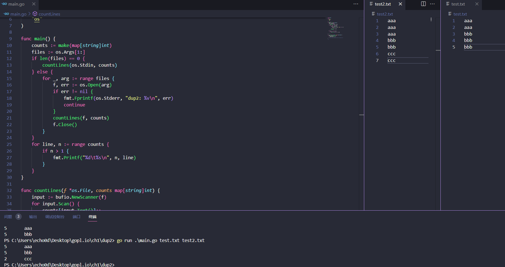

`os.Open` 函数返回两个值：

第一个值是被打开的文件（`*os.File`），其后被 `Scanner` 读取。

第二个值是内置 `error` 类型的值。

* 如果 `err` 等于内置值`nil`（其它语言里的 `NULL`），那么文件被成功打开。读取文件，直到文件结束，然后调用 `Close` 关闭该文件，并释放占用的所有资源。
* 如果 `err` 的值不是 `nil`，说明打开文件时出错了。这种情况下，错误值描述了所遇到的问题。使用 `Fprintf` 与表示任意类型默认格式值的动词 `%v`，向标准错误流打印一条信息，然后 `dup` 继续处理下一个文件；`continue` 语句直接跳到 `for` 循环的下个迭代开始执行。

注意 `countLines` 函数在其声明前被调用。

> 函数和包级别的变量（package-level entities）可以任意顺序声明，并不影响其被调用。

### `ReadFile` 

`dup` 的前两个版本以"流”模式读取输入，并根据需要拆分成多个行。理论上，这些程序可以处理任意数量的输入数据。还有另一个方法，就是一口气把全部输入数据读到内存中，一次分割为多行，然后处理它们。

引入了 `ReadFile` 函数（来自于`io/ioutil`包）。但是由于这个包已经在 Go 1.16 之后弃用，下面直接写成了 `os.ReadFile`。

 `os.ReadFile`读取指定文件的全部内容，`strings.Split` 函数把字符串分割成子串的切片。（`Split` 的作用与前文提到的 `strings.Join` 相反。）

> 下面代码有修正，由于windows中的换行默认使用的是`\r\n`，所以不能只靠\n分割

```go
func Dup3() {
	counts := make(map[string]int)
	for _, filename := range os.Args[1:] {
		// ReadFile 函数返回一个字节切片（byte slice），必须把它转换为 string，才能用 strings.Split 分割
		data, err := os.ReadFile(filename)
		if err != nil {
			fmt.Fprintf(os.Stderr, "dup3: %v\n", err)
			continue
		}
		// ReadFile 函数读取指定文件的全部内容，strings.Split 函数把字符串分割成子串的切片。
		for _, line := range strings.Split(string(data), "\r\n") {
			counts[line]++
		}
	}
	for line, n := range counts {
		if n > 1 {
			fmt.Printf("%d\t%s\r\n", n, line)
		}
	}
}

```

`ReadFile` 函数返回一个字节切片（byte slice），必须把它转换为 `string`，才能用 `strings.Split` 分割。我们会在3.5.4 节详细讲解字符串和字节切片。

实现上，`bufio.Scanner`、`ioutil.ReadFile` 和 `ioutil.WriteFile` 都使用 `*os.File` 的 `Read` 和 `Write` 方法，但是，大多数程序员很少需要直接调用那些低级（lower-level）函数。高级（higher-level）函数，像 `bufio` 和 `io/ioutil` 包中所提供的那些，用起来要容易点。

### 练习 1.4

 修改 `dup2`，出现重复的行时打印文件名称。

```go
package main

import (
	"bufio"
	"fmt"
	"os"
)

func main() {
	counts := make(map[string]int)
	// 用于记录文件名的hash表,每一行对应的文件名存到一个数组中
	fileHash := make(map[string][]string)
	// 获取命令行参数
	files := os.Args[1:]
	// 如果为空，则在控制台上输入
	if len(files) == 0 {
		fmt.Print("随便填,输入0终止\r\n")
		newcountlines(os.Stdin, counts, fileHash)
	} else {
		// 不为空，遍历文件列表
		fmt.Println("你输入的文件是:", files)
		for _, file := range files {
			// 打开文件
			f, err := os.Open(file)
			// 判断文件路径等是否出错
			if err != nil {
				fmt.Println(err)
				continue
			}
			// 传入contlines进行处理
			newcountlines(f, counts, fileHash)
			f.Close()
		}
	}

	for k, count := range counts {
		fmt.Println(k, count)
		// 打印出现的文件
		if count > 1 {
			for _, fname := range fileHash[k] {
				fmt.Printf("%s ", fname)
			}
			fmt.Println()
		}
	}
}
func newcountlines(f *os.File, counts map[string]int, fileHash map[string][]string) {
	// 创建读入流
	input := bufio.NewScanner(f)
	// 一行一行读取
	for input.Scan() {
		if input.Text() == "0" {
			break
		}
		counts[input.Text()]++
		// 按照每行内容，将文件名加到[]string{value}里
		fileHash[input.Text()] = append(fileHash[input.Text()], f.Name())
	}
}

```


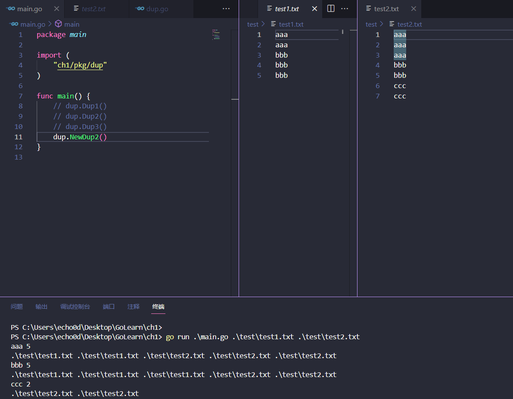

## 1.4 GIF动画

例

```go
package lissajous

import (
	"image"
	"image/color"
	"image/gif"
	"io"
	"math"
	"math/rand"
	"os"
	"time"
)

var palette = []color.Color{color.White, color.Black}

const (
	whiteIndex = 0 // first color in palette
	blackIndex = 1 // next color in palette
)

func Lissajous(out io.Writer) { // out 这个变量是 io.Writer 类型，这个类型支持把输出结果写到很多目标
	const (
		cycles  = 5     // number of complete x oscillator revolutions
		res     = 0.001 // angular resolution
		size    = 100   // image canvas covers [-size..+size]
		nframes = 64    // number of animation frames
		delay   = 8     // delay between frames in 10ms units
	)

	freq := rand.Float64() * 3.0 // relative frequency of y oscillator
	anim := gif.GIF{LoopCount: nframes}
	phase := 0.0 // phase difference
	for i := 0; i < nframes; i++ {
		rect := image.Rect(0, 0, 2*size+1, 2*size+1)
		img := image.NewPaletted(rect, palette)
		for t := 0.0; t < cycles*2*math.Pi; t += res {
			x := math.Sin(t)
			y := math.Sin(t*freq + phase)
            // 每一步它都会调用 SetColorIndex 来为(x,y)点来染黑色。
			img.SetColorIndex(size+int(x*size+0.5), size+int(y*size+0.5),
				blackIndex)
		}
		phase += 0.1
		anim.Delay = append(anim.Delay, delay)
		anim.Image = append(anim.Image, img)
	}
	gif.EncodeAll(out, &anim) // NOTE: ignoring encoding errors
}

func LissajousMain() {
	rand.Seed(time.Now().UTC().UnixNano())
	Lissajous(os.Stdout)
}

```

当我们import了一个包路径包含有多个单词的package时，比如image/color（image和color两个单词），后面调用的时候，只写最后那个单词就可以。所以当我们写color.White时，这个变量指向的是image/color包里的变量。

### 常量

常量是指在程序编译后运行时始终都不会变化的值。

常量声明和变量声明一般都会出现在包级别，所以这些常量在整个包中都是可以共享的，或者你也可以把常量声明定义在函数体内部，那么这种常量就只能在函数体内用。

常量声明的值必须是一个**数字值**、**字符串**或者**固定的boolean值**。

### 复合声明

`[]color.Color{...}` 和 `gif.GIF{...}` 这两个表达式是复合声明(4.2 和 4.4.1 节有说明) 。这是实例化 Go 语言里的复合类型的一种写法。

前者生成的是一个 slice 切片，后者生成的是一个 struct 结构体。

> 后面再看吧


### 踩坑

 powershell 重定向管道 `go run main.go > out.gif` 生成的 gif 图片将会出错无法打开。

 powershell 的标准输出流如果进行管道重定向会进行转换。参考[image - Go-generated animated GIFs didn't work in windows - Stack Overflow](https://stackoverflow.com/questions/56323293/go-generated-animated-gifs-didnt-work-in-windows)

下面使用cmd运行，结果：

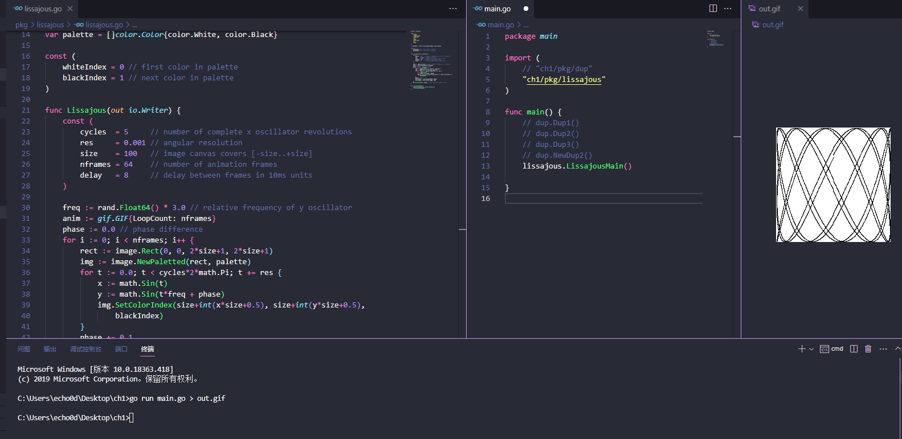

### 练习 1.5

 修改前面的Lissajous程序里的调色板，由黑色改为绿色。我们可以用`color.RGBA{0xRR, 0xGG, 0xBB, 0xff}`来得到`#RRGGBB`这个色值，三个十六进制的字符串分别代表红、绿、蓝像素。改成这样就行了

```go
var palette = []color.Color{color.White, color.RGBA{0x00, 0xff, 0x00, 0xff}}
```

### 练习1.6

修改Lissajous程序，修改其调色板来生成更丰富的颜色，然后修改SetColorIndex的第三个参数，

```go
package lissajousPractice

import (
	"image"
	"image/color"
	"image/gif"
	"io"
	"math"
	"math/rand"
	"os"
	"time"
)

// 练习1.5 调色板由黑色变成绿色
// var palette = []color.Color{color.White, color.RGBA{0x00, 0xff, 0x00, 0xff}}

// 练习1.6 颜色增多
var palette = []color.Color{color.White, color.Black, color.RGBA{0xff, 0x00, 0x00, 0xff}, color.RGBA{0x00, 0xff, 0x00, 0xff}, color.RGBA{0x00, 0x00, 0xff, 0xff}}

func Lissajousemain() {
	// The sequence of images is deterministic unless we seed
	// the pseudo-random number generator using the current time.
	// Thanks to Randall McPherson for pointing out the omission.
	rand.Seed(time.Now().UTC().UnixNano())
	Lissajous(os.Stdout)
}

func Lissajous(out io.Writer) {
	const (
		cycles  = 5     // number of complete x oscillator revolutions
		res     = 0.001 // angular resolution
		size    = 100   // image canvas covers [-size..+size]
		nframes = 64    // number of animation frames
		delay   = 8     // delay between frames in 10ms units
	)
	colorIndex := uint8(0)
	freq := rand.Float64() * 3.0 // relative frequency of y oscillator
	anim := gif.GIF{LoopCount: nframes}
	phase := 0.0 // phase difference
	for i := 0; i < nframes; i++ {
		rect := image.Rect(0, 0, 2*size+1, 2*size+1)
		img := image.NewPaletted(rect, palette)
		for t := 0.0; t < cycles*2*math.Pi; t += res {
			x := math.Sin(t)
			y := math.Sin(t*freq + phase)
			img.SetColorIndex(size+int(x*size+0.5), size+int(y*size+0.5), colorIndex)
		}
		colorIndex = (colorIndex + 1) % uint8(len(palette))
		phase += 0.1
		anim.Delay = append(anim.Delay, delay)
		anim.Image = append(anim.Image, img)
	}
	gif.EncodeAll(out, &anim) // NOTE: ignoring encoding errors
}

```

## 1.5 获取URL

### net/http

这个程序将获取对应的url，并将其源文本打印出来；类似curl工具

```go
// Fetch prints the content found at a URL.
package fetch

import (
	"fmt"
	"io"
	"net/http"
	"os"
)

func Fetch() {
	for _, url := range os.Args[1:] {
		resp, err := http.Get(url)
		if err != nil {
			fmt.Fprintf(os.Stderr, "fetch: %v\n", err)
			os.Exit(1)
		}
		b, err := io.ReadAll(resp.Body)
		resp.Body.Close()
		if err != nil {
			fmt.Fprintf(os.Stderr, "fetch: reading %s: %v\n", url, err)
			os.Exit(1)
		}
		fmt.Printf("%s", b)
	}
}

```

* http.Get函数是创建HTTP请求的函数，如果获取过程没有出错，那么会在resp这个结构体中得到访问的请求结果。resp的Body字段包括一个可读的服务器响应流。
* io.ReadAll函数从response中读取到全部内容；将其结果保存在变量b中。
* resp.Body.Close关闭resp的Body流，防止资源泄露
* Printf函数会将结果b写出到标准输出流中。

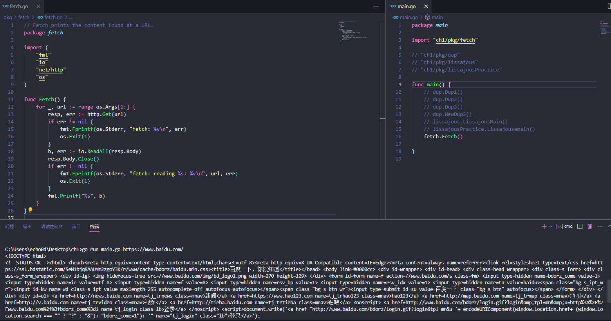

错误输出如图：

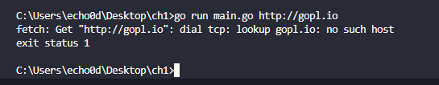

无论哪种失败原因，我们的程序都用了os.Exit函数来终止进程，并且返回一个status错误码，其值为1。

### 练习 1.7

 函数调用io.Copy(dst, src)会从src中读取内容，并将读到的结果写入到dst中，使用这个函数替代掉例子中的ioutil.ReadAll来拷贝响应结构体到os.Stdout，避免申请一个缓冲区（例子中的b）来存储。记得处理io.Copy返回结果中的错误。

```go
func IoCopy() {
	for _, url := range os.Args[1:] {
		resp, err := http.Get(url)
		if err != nil {
			fmt.Fprintf(os.Stderr, "fetch: %v\n", err)
			os.Exit(1)
		}
		_, err = io.Copy(os.Stdout, resp.Body)
		resp.Body.Close()
		if err != nil {
			fmt.Fprintf(os.Stderr, "fetch: reading %s: %v\n", url, err)
			os.Exit(1)
		}
	}
}
```


### 练习 1.8

修改fetch这个范例，如果输入的url参数没有 `http://` 前缀的话，为这个url加上该前缀。你可能会用到strings.HasPrefix这个函数。

```go
func HasPrefix() {
	for _, url := range os.Args[1:] {
        // 加个判断
		if !strings.HasPrefix(url, "https://") {
            //这里必须Fprint，允许输入的不是字符串
			fmt.Fprint(os.Stderr, "前缀不对哦", url)
			os.Exit(1)
		}
		resp, err := http.Get(url)
		if err != nil {
            
			fmt.Fprintf(os.Stderr, "fetch: %v\n", err)
			os.Exit(1)
		}
		_, err = io.Copy(os.Stdout, resp.Body)
		resp.Body.Close()
		if err != nil {
			fmt.Fprintf(os.Stderr, "fetch: reading %s: %v\n", url, err)
			os.Exit(1)
		}
	}
}
```


### 练习 1.9

修改fetch打印出HTTP协议的状态码，可以从resp.Status变量得到该状态码。

```go
func RespStatus() {
	for _, url := range os.Args[1:] {
		resp, err := http.Get(url)
		if err != nil {
			fmt.Fprintf(os.Stderr, "fetch: %v\n", err)
			os.Exit(1)
		}
		_, err = io.Copy(os.Stdout, resp.Body)
		resp.Body.Close()
		if err != nil {
			fmt.Fprintf(os.Stderr, "fetch: reading %s: %v\n", url, err)
			os.Exit(1)
		}
		fmt.Printf("状态码：%d", resp.StatusCode)
	}
}

```

## 1.6 并发获取多个URL

例子

```go
package fetchall

import (
	"fmt"
	"io"
	"io/ioutil"
	"net/http"
	"os"
	"time"
)

func Fetching() {
	start := time.Now()
	ch := make(chan string)
	for _, url := range os.Args[1:] {
		go fetch(url, ch) // start a goroutine
	}
	for range os.Args[1:] {
		fmt.Println(<-ch) // receive from channel ch
	}
	fmt.Printf("%.2fs elapsed\n", time.Since(start).Seconds())
}

func fetch(url string, ch chan<- string) {
	start := time.Now()
	resp, err := http.Get(url)
	if err != nil {
		ch <- fmt.Sprint(err) // send to channel ch
		return
	}
	nbytes, err := io.Copy(ioutil.Discard, resp.Body)
	resp.Body.Close() // don't leak resources
	if err != nil {
		ch <- fmt.Sprintf("while reading %s: %v", url, err)
		return
	}
	secs := time.Since(start).Seconds()
	ch <- fmt.Sprintf("%.2fs  %7d  %s", secs, nbytes, url)
}

```

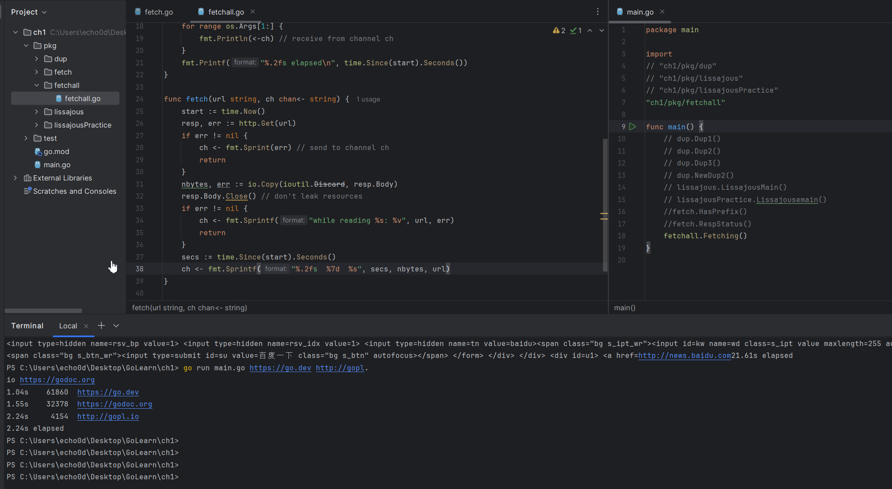

### goroutine

```go
    ch := make(chan string)
	for _, url := range os.Args[1:] {
        go fetch(url, ch) // start a goroutine
    }
    for range os.Args[1:] {
        fmt.Println(<-ch) // receive from channel ch
    }
```

`goroutine`是一种函数的并发执行方式，而`channel`是用来在`goroutine`之间进行参数传递。

上面的`Fetching`函数本身也运行在一个`goroutine`中，而`go function`则表示创建一个新的`goroutine`（也就是上面2-4行，把函数`fetch`放在`goroutine`中），并在这个新的`goroutine`中执行这个函数。

### make

```go
ch := make(chan string)
```

`make`函数创建了一个传递`string`类型参数的`channel`，也就是`ch chan<- string`，对每一个命令行参数，我们都用`go`这个关键字来创建一个`goroutine`，并且让函数在这个`goroutine`异步执行`http.Get`方法。

### ioutil.Discard

```go
nbytes, err := io.Copy(ioutil.Discard, resp.Body)
```

这个程序里的`io.Copy`会把响应的Body内容拷贝到`ioutil.Discard`输出流中（译注：可以把这个变量看作一个垃圾桶，可以向里面写一些不需要的数据），因为我们需要这个方法返回的字节数，但是又不想要其内容。

每当请求返回内容时，`fetch`函数都会往`ch`这个`channel`里写入一个字符串，由`Fetching`函数里的第二个for循环来处理并打印`channel`里的这个字符串。

### 分两个函数的原因

当一个`goroutine`尝试在一个`channel`上做`send`或者`receive`操作时，这个`goroutine`会阻塞在调用处，直到另一个`goroutine`从这个`channel`里接收或者写入值，这样两个`goroutine`才会继续执行`channel`操作之后的逻辑。在这个例子中，每一个fetch函数在执行时都会往channel里发送一个值（ch <- expression），`Fetching`函数负责接收这些值（<-ch）。这个程序中我们用`Fetching`函数来完整地处理/接收所有`fetch`函数传回的字符串，可以避免因为有两个`goroutine`同时完成而使得其输出交错在一起的危险。

### 练习 1.10

修改本节中的程序，将响应结果输出到文件，以便于进行对比。

```go
package main

import (
	"fmt"
	"io"
	"net/http"
	"os"
	"strings"
	"time"
)

func main() {
	start := time.Now()
	ch := make(chan string)
	for _, url := range os.Args[1:] {
		go saveFile(url, ch) // start a goroutine
	}
	for range os.Args[1:] {
		fmt.Println(<-ch) // receive from channel ch
	}
	fmt.Printf("total %.2fs elapsed\n", time.Since(start).Seconds())
}

func saveFile(url string, ch chan<- string) {
	start := time.Now()
	resp, err := http.Get(url)
	if err != nil {
		// 这里必须fmt.Sprintf
		ch <- fmt.Sprint(err) // send to channel ch
		return
	}
	//拿到域名做文件名
	domain := strings.Split(url, "//")
	// 创建文件
	outFile, err := os.Create(domain[1] + ".txt")
	if err != nil {
		ch <- fmt.Sprint(err)
		return
	}
	nbytes, err := io.Copy(outFile, resp.Body)
	// resp.Body.Close()
	if err != nil {
		ch <- fmt.Sprintf("while reading %s: %v", url, err)
		return
	}
	secs := time.Since(start).Seconds()

	ch <- fmt.Sprintf("%.2fs  %7d  %s", secs, nbytes, url)
}


```

## 1.7 Web服务

例子，一个服务器，返回当前用户正在访问的URL。比如用户访问的是 http://localhost:8000/hello ，那么响应是URL.Path = "hello"。

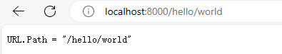

```go
func HandlerMain() {
	http.HandleFunc("/", handler) // each request calls handler
	log.Fatal(http.ListenAndServe("localhost:8000", nil))
}

func handler(w http.ResponseWriter, r *http.Request) {
	fmt.Fprintf(w, "URL.Path = %q\n", r.URL.Path)
}
```

### handler

`HandlerMain`函数将所有发送到`/`路径下的请求和`handler`函数关联起来，`/`开头的请求其实就是所有发送到当前站点上的请求，服务监听8000端口。

发送到这个服务的“请求”是一个`http.Request`类型的对象，这个对象中包含了请求中的一系列相关字段，其中就包括我们需要的URL。

当请求到达服务器时，这个请求会被传给`handler`函数来处理，这个函数会将/hello这个路径从请求的URL中解析出来，然后把其发送到响应中，这里我们用的是标准输出流的`fmt.Fprintf`。

### handler&count

为访问的url添加某种状态。比如，下面这个版本输出了同样的内容，但是会对请求的次数进行计算，计算各种URL被访问的总次数，访问/count的时候显示出来。

```go
var mu sync.Mutex
var count int

func CountHandlerMain() {
	http.HandleFunc("/", countHandler)
	http.HandleFunc("/count", counter)
	log.Fatal(http.ListenAndServe("localhost:8000", nil))
}

// handler echoes the Path component of the requested URL.
func countHandler(w http.ResponseWriter, r *http.Request) {
	mu.Lock()
	count++
	mu.Unlock()
	fmt.Fprintf(w, "URL.Path = %q\n", r.URL.Path)
}

// counter echoes the number of calls so far.
func counter(w http.ResponseWriter, r *http.Request) {
	mu.Lock()
	fmt.Fprintf(w, "Count %d\n", count)
	mu.Unlock()
}

```

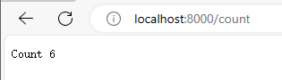

这个服务器有两个请求处理函数，根据请求的url不同会调用不同的函数：对/count这个url的请求会调用到counter这个函数，其它的url都会调用默认的处理函数。

### 竞态条件

服务器每一次接收请求处理时都会另起一个goroutine，这样服务器就可以同一时间处理多个请求。然而在并发情况下，假如真的有两个请求同一时刻去更新count，那么这个值可能并不会被正确地增加；这个程序可能会引发一个严重的bug：竞态条件（参见9.1）。为了避免这个问题，我们必须保证每次修改变量的最多只能有一个goroutine，这也就是代码里的`mu.Lock()`和`mu.Unlock()`调用将修改count的所有行为包在中间的目的（第九章再看）。

### if嵌套ParseForm()

handler函数会把请求的http头和请求的form数据都打印出来

```go
func HandlerMoreMain() {
	http.HandleFunc("/", handlerMore) // each request calls handler
	log.Fatal(http.ListenAndServe("localhost:8000", nil))
}
func handlerMore(w http.ResponseWriter, r *http.Request) {
	fmt.Fprintf(w, "%s %s %s\n", r.Method, r.URL, r.Proto)
	for k, v := range r.Header {
		fmt.Fprintf(w, "Header[%q] = %q\n", k, v)
	}
	fmt.Fprintf(w, "Host = %q\n", r.Host)
	fmt.Fprintf(w, "RemoteAddr = %q\n", r.RemoteAddr)
	if err := r.ParseForm(); err != nil {
		log.Print(err)
	}
	for k, v := range r.Form {
		fmt.Fprintf(w, "Form[%q] = %q\n", k, v)
	}
}
```

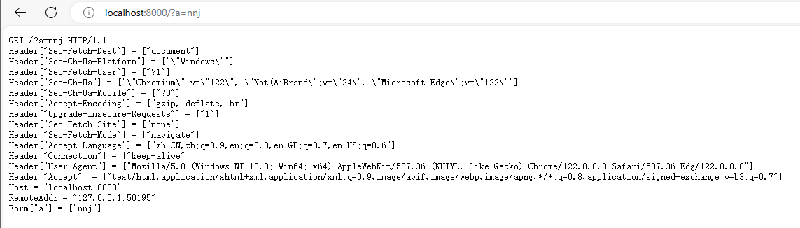

这里的ParseForm被嵌套在了if语句中

```go
	if err := r.ParseForm(); err != nil {
		log.Print(err)
	}
```

Go语言允许这样的一个简单的语句结果作为局部的变量声明出现在if语句的最前面，这一点对错误处理很有用处。我们还可以像下面这样写（当然看起来就长了一些）：

```go
err := r.ParseForm()
if err != nil {
    log.Print(err)
}
```

用if和ParseForm结合可以让代码更加简单，并且可以限制err这个变量的作用域，这么做是很不错的。2.7节中讲解作用域。

------

### 标准输出流

在这些程序中，我们看到了很多不同的类型被输出到标准输出流中。比如

* 前面的fetch程序，把HTTP的响应数据拷贝到了os.Stdout，
* lissajous程序里我们输出的是一个文件。
* fetchall程序则计算了一下响应Body的大小，这个程序中把响应Body拷贝到了ioutil.Discard。
* 在本节的web服务器程序中则是用fmt.Fprintf直接写到了http.ResponseWriter中。

尽管三种具体的实现流程并不太一样，他们都实现一个共同的接口，即当它们被调用需要一个标准流输出时都可以满足。这个接口叫作io.Writer，在7.1节中会详细讨论。

### 接口

Go语言的接口机制会在第7章中讲解，为了在这里简单说明接口能做什么，让我们简单地将这里的web服务器和之前写的lissajous函数结合起来，这样GIF动画可以被写到HTTP的客户端，而不是之前的标准输出流。只要在web服务器的代码里加入下面这几行。

```Go
handler := func(w http.ResponseWriter, r *http.Request) {
    lissajous(w)
}
http.HandleFunc("/", handler)
```

或者另一种等价形式：

```Go
http.HandleFunc("/", func(w http.ResponseWriter, r *http.Request) {
    lissajous(w)
})
```

HandleFunc函数的第二个参数是一个函数的字面值，也就是一个在使用时定义的匿名函数。这些内容我们会在5.6节中讲解。

效果：

```go
import "ch1/pkg/lissajous"

func Handlerlissajous() {
	http.HandleFunc("/", func(w http.ResponseWriter, r *http.Request) {
		lissajous.Lissajous(w)
	})
	log.Fatal(http.ListenAndServe("localhost:8000", nil))

}
```

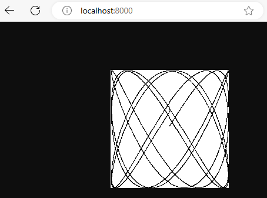

### 练习 1.12

修改Lissajour服务，从URL读取变量，比如你可以访问 http://localhost:8000/?cycles=20 这个URL，这样访问可以将程序里的cycles默认的5修改为20。字符串转换为数字可以调用strconv.Atoi函数。

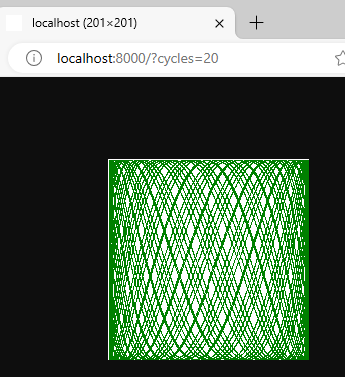

```go
package main

import (
	"image"
	"image/color"
	"image/gif"
	"io"
	"log"
	"math"
	"math/rand"
	"net/http"
	"strconv"
)

func main() {
	handler := func(w http.ResponseWriter, r *http.Request) {
		if err := r.ParseForm(); err != nil {
			log.Print(err)
		}
		cycles, err := strconv.Atoi(r.Form.Get("cycles")) // 字符串转int
		if err != nil {
			log.Print(err)
		}
		// 函数里比较的时候有math.Pi，就要求cycles float64，直接用int不对strconv.Atoi的结果是不对的
		lissajousNew(w, float64(cycles))
	}
	http.HandleFunc("/", handler)
	log.Fatal(http.ListenAndServe("localhost:8000", nil))
}

func lissajousNew(out io.Writer, cycles float64) {
	var palette = []color.Color{color.White, color.Black}

	const (
		whiteIndex = 0 // first color in palette
		blackIndex = 1 // next color in palette
		res        = 0.001
		size       = 100
		nframes    = 64
		delay      = 8
	)

	freq := rand.Float64() * 3.0 // relative frequency of y oscillator
	anim := gif.GIF{LoopCount: nframes}
	phase := 0.0 // phase difference
	for i := 0; i < nframes; i++ {
		rect := image.Rect(0, 0, 2*size+1, 2*size+1)
		img := image.NewPaletted(rect, palette)
		// 这里比较
		for t := 0.0; t < cycles*2*math.Pi; t += res {
			x := math.Sin(t)
			y := math.Sin(t*freq + phase)
			img.SetColorIndex(size+int(x*size+0.5), size+int(y*size+0.5),
				blackIndex)
		}
		phase += 0.1
		anim.Delay = append(anim.Delay, delay)
		anim.Image = append(anim.Image, img)
	}
	gif.EncodeAll(out, &anim) // NOTE: ignoring encoding errors
}

```

## 1.8 本章要点

### 控制流

**控制流：** 这里是一个简单的switch的例子：

```go
switch coinflip() {
case "heads":
    heads++
case "tails":
    tails++
default:
    fmt.Println("landed on edge!")
}
```

* 例子里的coinflip函数返回几种不同的结果，每一个case都会对应一个返回结果，这里需要注意，Go语言并不需要显式地在每一个case后写break，语言默认执行完case后的逻辑语句会自动退出。

* 如果你想要相邻的几个case都执行同一逻辑的话，需要自己显式地写上一个fallthrough语句来覆盖这种默认行为。不过fallthrough语句在一般的程序中很少用到。

* Go语言里的switch还可以不带操作对象（译注：switch不带操作对象时默认用true值代替，然后将每个case的表达式和true值进行比较）；可以直接罗列多种条件，像其它语言里面的多个if else一样，下面是一个例子：

```go
func Signum(x int) int {
    switch {
    case x > 0:
        return +1
    default:
        return 0
    case x < 0:
        return -1
    }
}
```

这种形式叫做无tag switch(tagless switch)；这和switch true是等价的。

* 像for和if控制语句一样，switch也可以紧跟一个简短的变量声明，一个自增表达式、赋值语句，或者一个函数调用（译注：比其它语言丰富）。
* break和continue语句会改变控制流。和其它语言中的break和continue一样，break会中断当前的循环，并开始执行循环之后的内容，而continue会跳过当前循环，并开始执行下一次循环。这两个语句除了可以控制for循环，还可以用来控制switch和select语句（之后会讲到）

* 在1.3节中我们看到，continue会跳过内层的循环，如果我们想跳过的是更外层的循环的话，我们可以在相应的位置加上label，这样break和continue就可以根据我们的想法来continue和break任意循环。点像goto语句。


### 命名类型

 类型声明使得我们可以很方便地给一个特殊类型一个名字。因为struct类型声明通常非常地长，所以我们总要给这种struct取一个名字。本章中就有这样一个例子，二维点类型：

```go
type Point struct {
    X, Y int
}
var p Point
```

类型声明和命名类型会在第二章中介绍。

### 指针

* 在其它语言中，比如C语言，指针操作是完全不受约束的。在另外一些语言中，指针一般被处理为“引用”，除了到处传递这些指针之外，并不能对这些指针做太多事情。

* Go语言在这两种范围中取了一种平衡。指针是可见的内存地址，&操作符可以返回一个变量的内存地址，并且*操作符可以获取指针指向的变量内容
* 但是在Go语言里没有指针运算，也就是不能像c语言里可以对指针进行加或减操作。我们会在2.3.2中进行详细介绍。

### 方法和接口

方法是和命名类型关联的一类函数。Go语言里比较特殊的是方法可以被关联到任意一种命名类型。在第六章我们会详细地讲方法。接口是一种抽象类型，这种类型可以让我们以同样的方式来处理不同的固有类型，不用关心它们的具体实现，而只需要关注它们提供的方法。第七章中会详细说明这些内容。

### 包（packages）

 Go语言提供了一些很好用的package，并且这些package是可以扩展的。Go语言社区已经创造并且分享了很多很多。所以Go语言编程大多数情况下就是用已有的package来写我们自己的代码。

### 注释

在源文件的开头写的注释是这个源文件的文档。在每一个函数之前写一个说明函数行为的注释也是一个好习惯。这些惯例很重要，因为这些内容会被像godoc这样的工具检测到，并且在执行命令时显示这些注释。具体可以参考10.7.4。

多行注释可以用 `/* ... */` 来包裹，和其它大多数语言一样。在文件一开头的注释一般都是这种形式，或者一大段的解释性的注释文字也会被这符号包住，来避免每一行都需要加//。在注释中//和/*是没什么意义的，所以不要在注释中再嵌入注释。

