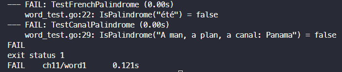
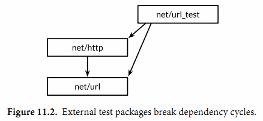
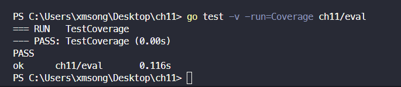
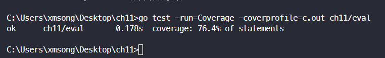
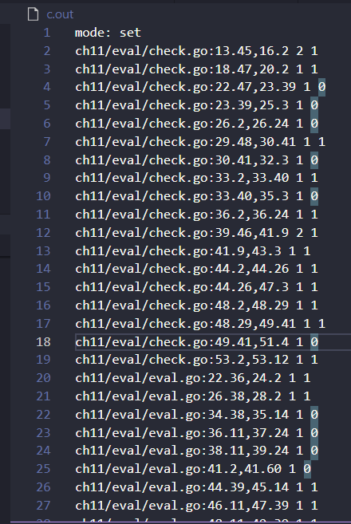
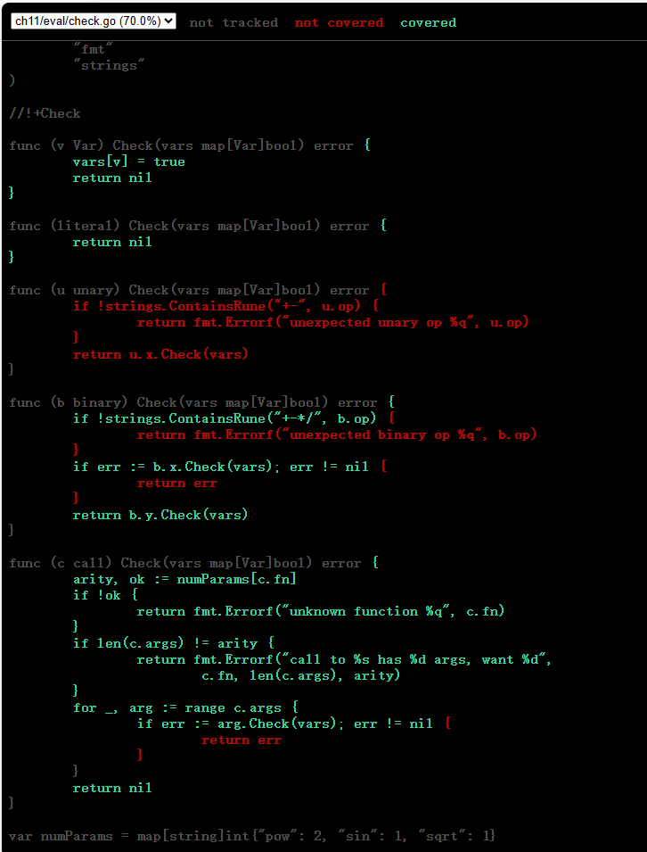
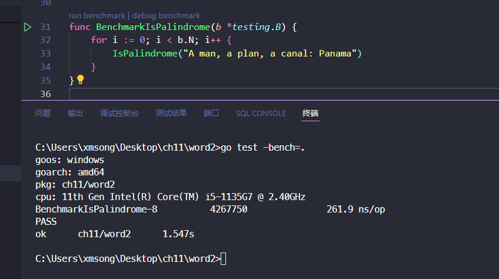

# 11. 测试
## 11.1. go test
在包目录内，所有以`_test.go`为后缀名的源文件在执行`go build`时不会被构建成包的一部分，它们是`go test`测试的一部分。
在`*_test.go`文件中，有三种类型的函数：测试函数、基准测试（benchmark）函数、示例函数。

- 一个测试函数是以Test为函数名前缀的函数，用于测试程序的一些逻辑行为是否正确；go test命令会调用这些测试函数并报告测试结果是PASS或FAIL。
- 基准测试函数是以Benchmark为函数名前缀的函数，它们用于衡量一些函数的性能；go test命令会多次运行基准测试函数以计算一个平均的执行时间。
- 示例函数是以Example为函数名前缀的函数，提供一个由编译器保证正确性的示例文档。

`go test`命令会遍历所有的`*_test.go`文件中符合上述命名规则的函数，生成一个临时的main包用于调用相应的测试函数，接着构建并运行、报告测试结果，最后清理测试中生成的临时文件。

## 11.2. 测试函数
每个测试函数必须导入testing包。测试函数有如下的签名：
```go
func TestName(t *testing.T) {
    // ...
}
```
测试函数的名字必须以Test开头，可选的后缀名必须以大写字母开头：
```go
func TestSin(t *testing.T) { /* ... */ }
func TestCos(t *testing.T) { /* ... */ }
func TestLog(t *testing.T) { /* ... */ }
```
其中`t`参数用于报告测试失败和附加的日志信息。让我们定义一个实例包gopl.io/ch11/word1，其中只有一个函数IsPalindrome用于检查一个字符串是否从前向后和从后向前读都是一样的。
_gopl.io/ch11/word1_
```go
// Package word provides utilities for word games.
package word

// IsPalindrome reports whether s reads the same forward and backward.
// (Our first attempt.)
func IsPalindrome(s string) bool {
    for i := range s {
        if s[i] != s[len(s)-1-i] {
            return false
        }
    }
    return true
}
```
在相同的目录下，word_test.go测试文件中包含了TestPalindrome和TestNonPalindrome两个测试函数。每一个都是测试IsPalindrome是否给出正确的结果，并使用t.Error报告失败信息：
```go
package word

import "testing"

func TestPalindrome(t *testing.T) {
    if !IsPalindrome("detartrated") {
        t.Error(`IsPalindrome("detartrated") = false`)
    }
    if !IsPalindrome("kayak") {
        t.Error(`IsPalindrome("kayak") = false`)
    }
}

func TestNonPalindrome(t *testing.T) {
    if IsPalindrome("palindrome") {
        t.Error(`IsPalindrome("palindrome") = true`)
    }
}
```
go test命令如果没有参数指定包那么将默认采用当前目录对应的包（和go build命令一样）。我们可以用下面的命令构建和运行测试。
```bash
$ cd $GOPATH/src/gopl.io/ch11/word1
$ go test
ok   gopl.io/ch11/word1  0.008s
```
结果还比较满意，我们运行了这个程序， 不过没有提前退出是因为还没有遇到BUG报告。不过一个法国名为“Noelle Eve Elleon”的用户会抱怨IsPalindrome函数不能识别“été”。另外一个来自美国中部用户的抱怨则是不能识别“A man, a plan, a canal: Panama.”。执行特殊和小的BUG报告为我们提供了新的更自然的测试用例。
```go
func TestFrenchPalindrome(t *testing.T) {
    if !IsPalindrome("été") {
        t.Error(`IsPalindrome("été") = false`)
    }
}

func TestCanalPalindrome(t *testing.T) {
    input := "A man, a plan, a canal: Panama"
    if !IsPalindrome(input) {
        t.Errorf(`IsPalindrome(%q) = false`, input)
    }
}
```
为了避免两次输入较长的字符串，我们使用了提供了有类似Printf格式化功能的 Errorf函数来汇报错误结果。
当添加了这两个测试用例之后，go test返回了测试失败的信息。

先编写测试用例并观察到测试用例触发了和用户报告的错误相同的描述是一个好的测试习惯。只有这样，我们才能定位我们要真正解决的问题。
参数-v可用于打印每个测试函数的名字和运行时间：

```bash

$ go test -v
=== RUN TestPalindrome
--- PASS: TestPalindrome (0.00s)
=== RUN TestNonPalindrome
--- PASS: TestNonPalindrome (0.00s)
=== RUN TestFrenchPalindrome
--- FAIL: TestFrenchPalindrome (0.00s)
    word_test.go:28: IsPalindrome("été") = false
=== RUN TestCanalPalindrome
--- FAIL: TestCanalPalindrome (0.00s)
    word_test.go:35: IsPalindrome("A man, a plan, a canal: Panama") = false
FAIL
exit status 1
FAIL    gopl.io/ch11/word1  0.017s
```
参数-run对应一个正则表达式，只有测试函数名被它正确匹配的测试函数才会被go test测试命令运行：
```bash
$ go test -v -run="French|Canal"
=== RUN TestFrenchPalindrome
--- FAIL: TestFrenchPalindrome (0.00s)
    word_test.go:28: IsPalindrome("été") = false
=== RUN TestCanalPalindrome
--- FAIL: TestCanalPalindrome (0.00s)
    word_test.go:35: IsPalindrome("A man, a plan, a canal: Panama") = false
FAIL
exit status 1
FAIL    gopl.io/ch11/word1  0.014s
```
当然，一旦我们已经修复了失败的测试用例，在我们提交代码更新之前，我们应该以不带参数的go test命令运行全部的测试用例，以确保修复失败测试的同时没有引入新的问题。
我们现在的任务就是修复这些错误。简要分析后发现第一个BUG的原因是我们采用了`byte`而不是`rune`序列，所以像`été`中的`é`等非ASCII字符不能正确处理。第二个BUG是因为没有忽略空格和字母的大小写导致的。

```go
// Package word provides utilities for word games.
package word

import "unicode"

// IsPalindrome reports whether s reads the same forward and backward.
// Letter case is ignored, as are non-letters.
func IsPalindrome(s string) bool {
    var letters []rune
    for _, r := range s {
        if unicode.IsLetter(r) {
            letters = append(letters, unicode.ToLower(r))
        }
    }
    for i := range letters {
        if letters[i] != letters[len(letters)-1-i] {
            return false
        }
    }
    return true
}

```
同时我们也将之前的所有测试数据合并到了一个测试中的表格中。
```go
func TestIsPalindrome(t *testing.T) {
    var tests = []struct {
        input string
        want  bool
    }{
        {"", true},
        {"a", true},
        {"aa", true},
        {"ab", false},
        {"kayak", true},
        {"detartrated", true},
        {"A man, a plan, a canal: Panama", true},
        {"Evil I did dwell; lewd did I live.", true},
        {"Able was I ere I saw Elba", true},
        {"été", true},
        {"Et se resservir, ivresse reste.", true},
        {"palindrome", false}, // non-palindrome
        {"desserts", false},   // semi-palindrome
    }
    for _, test := range tests {
        if got := IsPalindrome(test.input); got != test.want {
            t.Errorf("IsPalindrome(%q) = %v", test.input, got)
        }
    }
}

```
失败测试的输出并不包括调用`t.Errorf`时刻的堆栈调用信息。和其他编程语言或测试框架的assert断言不同，`t.Errorf`调用也没有引起panic异常或停止测试的执行。即使表格中前面的数据导致了测试的失败，表格后面的测试数据依然会运行测试，因此在一个测试中我们可能了解多个失败的信息。
如果我们真的需要停止测试，或许是因为初始化失败或可能是早先的错误导致了后续错误等原因，我们可以使用`t.Fatal`或`t.Fatalf`停止当前测试函数。它们必须在和测试函数同一个goroutine内调用。
测试失败的信息一般的形式是`f(x) = y, want z`，其中`f(x)`解释了失败的操作和对应的输入，`y`是实际的运行结果，`z`是期望的正确的结果。
**练习 11.1**
为4.3节中的charcount程序编写测试。
```go
package main

import (
	"bufio"
	"strings"
	"testing"
	"unicode/utf8"
)

func TestCharcount(t *testing.T) {
	input := "Hello, 世界！"
	reader := strings.NewReader(input)
	bufReader := bufio.NewReader(reader)
	expectedCounts := map[rune]int{
		'H': 1,
		'e': 1,
		'l': 2,
		'o': 1,
		',': 1,
		' ': 1,
		'世': 1,
		'界': 1,
		'！': 1,
	}
	expectedUTFlen := [utf8.UTFMax + 1]int{1: 7, 2: 0, 3: 3, 4: 0}

	counts, utflen, invalid := Charcount(bufReader)

	// Verify counts of Unicode characters
	for c, expectedCount := range expectedCounts {
		if counts[c] != expectedCount {
			t.Errorf("Unexpected count for character %q. Expected: %d, Got: %d", c, expectedCount, counts[c])
		}
	}

	// Verify lengths of UTF-8 encodings
	for i, expectedLen := range expectedUTFlen {
		if utflen[i] != expectedLen {
			t.Errorf("Unexpected count for length %d. Expected: %d, Got: %d", i, expectedLen, utflen[i])
		}
	}

	// Verify count of invalid UTF-8 characters
	if invalid != 0 {
		t.Errorf("Unexpected count of invalid UTF-8 characters. Expected: 3, Got: %d", invalid)
	}
}

```
**练习 11.2:** 为（§6.5）的IntSet编写一组测试，用于检查每个操作后的行为和基于内置map的集合等价，后面练习11.7将会用到。

### 11.2.1. 随机测试
表格驱动的测试便于构造基于精心挑选的测试数据的测试用例。另一种测试思路是随机测试，也就是通过构造更广泛的随机输入来测试探索函数的行为。
那么对于一个随机的输入，我们如何能知道希望的输出结果呢？这里有两种处理策略。

- 第一个是编写另一个对照函数，使用简单和清晰的算法，虽然效率较低但是行为和要测试的函数是一致的，然后针对相同的随机输入检查两者的输出结果。
- 第二种是生成的随机输入的数据遵循特定的模式，这样我们就可以知道期望的输出的模式。

下面的例子使用的是第二种方法：`randomPalindrome`函数用于随机生成回文字符串。
```go
import "math/rand"

// randomPalindrome returns a palindrome whose length and contents
// are derived from the pseudo-random number generator rng.
func randomPalindrome(rng *rand.Rand) string {
    n := rng.Intn(25) // random length up to 24
    runes := make([]rune, n)
    for i := 0; i < (n+1)/2; i++ {
        r := rune(rng.Intn(0x1000)) // random rune up to '\u0999'
        runes[i] = r
        runes[n-1-i] = r
    }
    return string(runes)
}

func TestRandomPalindromes(t *testing.T) {
    // Initialize a pseudo-random number generator.
    seed := time.Now().UTC().UnixNano()
    t.Logf("Random seed: %d", seed)
    rng := rand.New(rand.NewSource(seed))

    for i := 0; i < 1000; i++ {
        p := randomPalindrome(rng)
        if !IsPalindrome(p) {
            t.Errorf("IsPalindrome(%q) = false", p)
        }
    }
}
```
虽然随机测试会有不确定因素，但是它也是至关重要的，我们可以从失败测试的日志获取足够的信息。在我们的例子中，输入`IsPalindrome`的`p`参数将告诉我们真实的数据，但是对于函数将接受更复杂的输入，不需要保存所有的输入，只要日志中简单地记录随机数种子即可（像上面的方式）。有了这些随机数初始化种子，我们可以很容易修改测试代码以重现失败的随机测试。
**练习 11.3:** TestRandomPalindromes测试函数只测试了回文字符串。编写新的随机测试生成器，用于测试随机生成的非回文字符串。
```go
// 生成一个非回文串
func randomNotPalindrome(rng *rand.Rand) string {
	n := rng.Intn(25) + 2
	runes := make([]rune, n)
	for {
		for i := range runes {
			// result[i] = charset[rand.Intn(len(charset))]
			runes[i] = rune(rng.Intn(0x1000)) // random rune up to '\u0999'
		}
		if !IsPalindrome(string(runes)) {
			return string(runes)
		}
	}

}


// 非回文字符串测试
func TestRandomNotPalindrome(t *testing.T) {
	seed := time.Now().UTC().UnixNano()
	t.Logf("Random seed: %d", seed)
	rng := rand.New(rand.NewSource(seed))
	for i := 0; i < 1000; i++ {
		q := randomNotPalindrome(rng)
		if IsPalindrome(q) {
			t.Errorf("IsPalindrome(%q) = true", q)
		}
	}

}

```
**练习 11.4:** 修改randomPalindrome函数，以探索IsPalindrome是否对标点和空格做了正确处理。
译者注：**拓展阅读**感兴趣的读者可以再了解一下go-fuzz
```go
func randomPalindrome(rng *rand.Rand) string {
	n := rng.Intn(25) + 1 // random length up to 24
	charcter := []rune(",.!@#$%^&*()_+{}[]|\\:;\"'<>,.?/~`")
	runes := make([]rune, n)
	for i := 0; i < (n+1)/2; i++ {
		r := rune(rng.Intn(0x1000)) // random rune up to '\u0999'
		runes[i] = r
		runes[n-1-i] = r
	}
	// 随机一个位置
	m := rng.Intn((n + 1) / 2)
	c := charcter[rng.Intn(len(charcter))]
	// 从标点符号中随机一个出来，替换
	runes[m] = c
	runes[n-1-m] = c
	return string(runes)
}
```
### 11.2.2. 测试一个命令

如果一个包的名字是`main`，那么在构建时会生成一个可执行程序，不过`main`包可以作为一个包被测试器代码导入。

让我们为2.3.2节的echo程序编写一个测试。我们先将程序拆分为两个函数：`echo`函数完成真正的工作，`main`函数用于处理命令行输入参数和`echo`可能返回的错误。

```go
// Echo prints its command-line arguments.
package main

import (
	"flag"
	"fmt"
	"io"
	"os"
	"strings"
)

var (
	n = flag.Bool("n", false, "omit trailing newline")
	s = flag.String("s", " ", "separator")
)

var out io.Writer = os.Stdout // modified during testing

func main() {
	flag.Parse()
	if err := echo(!*n, *s, flag.Args()); err != nil {
		fmt.Fprintf(os.Stderr, "echo: %v\n", err)
		os.Exit(1)
	}
}

func echo(newline bool, sep string, args []string) error {
	fmt.Fprint(out, strings.Join(args, sep))
	if newline {
		fmt.Fprintln(out)
	}
	return nil
}

```

在测试中我们可以用各种参数和标志调用`echo`函数，然后检测它的输出是否正确，我们通过增加参数来减少`echo`函数对全局变量的依赖。我们还增加了一个全局名为out的变量来替代直接使用`os.Stdout` ，这样测试代码可以根据需要将`out`修改为不同的对象以便于检查。

> 要注意的是测试代码和产品代码在同一个包。虽然是main包，也有对应的main入口函数，但是在测试的时候main包只是TestEcho测试函数导入的一个普通包，里面main函数并没有被导出，而是被忽略的。

下面就是`echo_test.go`文件中的测试代码：

```go
package main

import (
	"bytes"
	"fmt"
	"testing"
)

func TestEcho(t *testing.T) {
	var tests = []struct {
		newline bool
		sep     string
		args    []string
		want    string
	}{
		{true, "", []string{}, "\n"},
		{false, "", []string{}, ""},
		{true, "\t", []string{"one", "two", "three"}, "one\ttwo\tthree\n"},
		{true, ",", []string{"a", "b", "c"}, "a,b,c\n"},
		{false, ":", []string{"1", "2", "3"}, "1:2:3"},
	}
	for _, test := range tests {
		descr := fmt.Sprintf("echo(%v, %q, %q)",
			test.newline, test.sep, test.args)

		out = new(bytes.Buffer) // captured output
		if err := echo(test.newline, test.sep, test.args); err != nil {
			t.Errorf("%s failed: %v", descr, err)
			continue
		}
		got := out.(*bytes.Buffer).String()
		if got != test.want {
			t.Errorf("%s = %q, want %q", descr, got, test.want)
		}
	}
}

```

通过将测试放到表格中，我们很容易添加新的测试用例。让我通过增加下面的测试用例来看看失败的情况是怎么样的：

```Go
{true, ",", []string{"a", "b", "c"}, "a b c\n"}, // NOTE: wrong expectation!
```

`go test`输出如下：

```
--- FAIL: TestEcho (0.00s)
    echo_test.go:31: echo(true, ",", ["a" "b" "c"]) = "a,b,c", want "a b c\n"
FAIL
FAIL        gopl.io/ch11/echo         0.006s
```

错误信息描述了尝试的操作（使用Go类似语法），实际的结果和期望的结果。通过这样的错误信息，你可以在检视代码之前就很容易定位错误的原因。

要注意的是在测试代码中并没有调用`log.Fatal`或`os.Exit`，因为调用这类函数会导致程序提前退出；调用这些函数的特权应该放在main函数中。如果真的有意外的事情导致函数发生panic异常，测试驱动应该尝试用`recover`捕获异常，然后将当前测试当作失败处理。如果是可预期的错误，例如非法的用户输入、找不到文件或配置文件不当等应该通过返回一个非空的`error`的方式处理。

### 11.2.3. 白盒测试

黑盒测试只需要测试包公开的文档和API行为，内部实现对测试代码是透明的。相反，白盒测试有访问包内部函数和数据结构的权限，因此可以做到一些普通客户端无法实现的测试。例如，一个白盒测试可以在每个操作之后检测不变量的数据类型。（白盒测试只是一个传统的名称，其实称为clear box测试会更准确。）

黑盒和白盒这两种测试方法是互补的。黑盒测试一般更健壮，随着软件实现的完善测试代码很少需要更新。它们可以帮助测试者了解真实客户的需求，也可以帮助发现API设计的一些不足之处。相反，白盒测试则可以对内部一些棘手的实现提供更多的测试覆盖。

我们已经看到两种测试的例子。`TestIsPalindrome`测试仅仅使用导出的`IsPalindrome`函数，因此这是一个黑盒测试。`TestEcho`测试则调用了内部的echo函数，并且更新了内部的`out`包级变量，这两个都是未导出的，因此这是白盒测试。

当我们准备`TestEcho`测试的时候，我们修改了`echo`函数使用包级的`out`变量作为输出对象，因此测试代码可以用另一个实现代替标准输出，这样可以方便对比echo输出的数据。使用类似的技术，我们可以将产品代码的其他部分也替换为一个容易测试的伪对象。使用伪对象的好处是我们可以方便配置，容易预测，更可靠，也更容易观察。同时也可以避免一些不良的副作用，例如更新生产数据库或信用卡消费行为。

下面的代码演示了为用户提供网络存储的web服务中的配额检测逻辑。当用户使用了超过90%的存储配额之后将发送提醒邮件。（译注：一般在实现业务机器监控，包括磁盘、cpu、网络等的时候，需要类似的到达阈值=>触发报警的逻辑，所以是很实用的案例。）

```go
package storage

import (
	"fmt"
	"log"
	"net/smtp"
)

var usage = make(map[string]int64)

func bytesInUse(username string) int64 { return usage[username] }

// E-mail sender configuration.
// NOTE: never put passwords in source code!
const sender = "notifications@example.com"
const password = "correcthorsebatterystaple"
const hostname = "smtp.example.com"

const template = `Warning: you are using %d bytes of storage,
%d%% of your quota.`

// !+factored
var notifyUser = func(username, msg string) {
	auth := smtp.PlainAuth("", sender, password, hostname)
	err := smtp.SendMail(hostname+":587", auth, sender,
		[]string{username}, []byte(msg))
	if err != nil {
		log.Printf("smtp.SendMail(%s) failed: %s", username, err)
	}
}

func CheckQuota(username string) {
	used := bytesInUse(username)
	const quota = 1000000000 // 1GB
	percent := 100 * used / quota
	if percent < 90 {
		return // OK
	}
	msg := fmt.Sprintf(template, used, percent)
	notifyUser(username, msg)
}

```

我们想测试这段代码，但是我们并不希望发送真实的邮件。我们可以在测试中用伪邮件发送函数替代真实的邮件发送函数。它只是简单记录要通知的用户和邮件的内容。

```go
package storage

import (
	"strings"
	"testing"
)

func TestCheckQuotaNotifiesUser(t *testing.T) {
	var notifiedUser, notifiedMsg string
	notifyUser = func(user, msg string) {
		notifiedUser, notifiedMsg = user, msg
	}

	const user = "joe@example.org"
	usage[user] = 980000000 // simulate a 980MB-used condition

	CheckQuota(user)
	if notifiedUser == "" && notifiedMsg == "" {
		t.Fatalf("notifyUser not called")
	}
	if notifiedUser != user {
		t.Errorf("wrong user (%s) notified, want %s",
			notifiedUser, user)
	}
	const wantSubstring = "98% of your quota"
	if !strings.Contains(notifiedMsg, wantSubstring) {
		t.Errorf("unexpected notification message <<%s>>, "+
			"want substring %q", notifiedMsg, wantSubstring)
	}
}

```

这里有一个问题：当测试函数返回后，`CheckQuota`将不能正常工作，因为`notifyUsers`依然使用的是测试函数的伪发送邮件函数（当更新全局对象的时候总会有这种风险）。 我们必须修改测试代码恢复`notifyUsers`原先的状态以便后续其他的测试没有影响，要确保所有的执行路径后都能恢复，包括测试失败或panic异常的情形。在这种情况下，我们建议使用defer语句来延后执行处理恢复的代码。

```Go
func TestCheckQuotaNotifiesUser(t *testing.T) {
    // Save and restore original notifyUser.
    saved := notifyUser
    defer func() { notifyUser = saved }()

    // Install the test's fake notifyUser.
    var notifiedUser, notifiedMsg string
    notifyUser = func(user, msg string) {
        notifiedUser, notifiedMsg = user, msg
    }
    // ...rest of test...
}
```

### 11.2.4. 外部测试包

考虑下这两个包：net/url包，提供了URL解析的功能；net/http包，提供了web服务和HTTP客户端的功能。如我们所料，上层的net/http包依赖下层的net/url包。然后，net/url包中的一个测试是演示不同URL和HTTP客户端的交互行为。也就是说，一个下层包的测试代码导入了上层的包。


这样的行为在net/url包的测试代码中会导致包的循环依赖，正如图11.1中向上箭头所示，同时正如我们在10.1节所讲的，Go语言规范是禁止包的循环依赖的。

不过我们可以通过外部测试包的方式解决循环依赖的问题，也就是在net/url包所在的目录声明一个独立的url_test测试包。其中包名的`_test`后缀告诉go test工具它应该建立一个额外的包来运行测试。我们将这个外部测试包的导入路径视作是net/url_test会更容易理解，但实际上它并不能被其他任何包导入。

因为外部测试包是一个独立的包，所以能够导入那些`依赖待测代码本身`的其他辅助包；包内的测试代码就无法做到这点。在设计层面，外部测试包是在所有它依赖的包的上层，正如图11.2所示。



通过避免循环的导入依赖，外部测试包可以更灵活地编写测试，特别是集成测试（需要测试多个组件之间的交互），可以像普通应用程序那样自由地导入其他包。

我们可以用go list命令查看包对应目录中哪些Go源文件是产品代码，哪些是包内测试，还有哪些是外部测试包。我们以fmt包作为一个例子：GoFiles表示产品代码对应的Go源文件列表；也就是go build命令要编译的部分。

```
$ go list -f={{.GoFiles}} fmt
[doc.go format.go print.go scan.go]
```

TestGoFiles表示的是fmt包内部测试代码，以_test.go为后缀文件名，不过只在测试时被构建：

```
$ go list -f={{.TestGoFiles}} fmt
[export_test.go]
```

包的测试代码通常都在这些文件中，不过fmt包并非如此；稍后我们再解释export_test.go文件的作用。

XTestGoFiles表示的是属于外部测试包的测试代码，也就是fmt_test包，因此它们必须先导入fmt包。同样，这些文件也只是在测试时被构建运行：

```
$ go list -f={{.XTestGoFiles}} fmt
[fmt_test.go scan_test.go stringer_test.go]
```

后面没看懂 不知道要说啥

### 11.2.5. 编写有效的测试

很多其它语言的测试框架都提供了识别测试函数的机制（通常使用反射或元数据），通过设置一些“setup”和“teardown”的钩子函数来执行测试用例运行的初始化和之后的清理操作，同时测试工具箱还提供了很多类似assert断言、值比较函数、格式化输出错误信息和停止一个失败的测试等辅助函数（通常使用异常机制）。虽然这些机制可以使得测试非常简洁，但是测试输出的日志却会像火星文一般难以理解。此外，虽然测试最终也会输出PASS或FAIL的报告，但是它们提供的信息格式却非常不利于代码维护者快速定位问题，因为失败信息的具体含义非常隐晦，比如“assert: 0 == 1”或成页的海量跟踪日志。

Go语言的测试风格则形成鲜明对比。它期望测试者自己完成大部分的工作，定义函数避免重复，就像普通编程那样。

下面的断言函数比较两个值，然后生成一个通用的错误信息，并停止程序。它很好用也确实有效，但是当测试失败的时候，打印的错误信息却几乎是没有价值的。它并没有为快速解决问题提供一个很好的入口。

```Go
import (
    "fmt"
    "strings"
    "testing"
)
// A poor assertion function.
func assertEqual(x, y int) {
    if x != y {
        panic(fmt.Sprintf("%d != %d", x, y))
    }
}
func TestSplit(t *testing.T) {
    words := strings.Split("a:b:c", ":")
    assertEqual(len(words), 3)
    // ...
}
```

从这个意义上说，断言函数犯了过早抽象的错误：仅仅测试两个整数是否相同，而没能根据上下文提供更有意义的错误信息。我们可以根据具体的错误打印一个更有价值的错误信息，就像下面例子那样。只有在测试中出现重复模式时才采用抽象。

```Go
func TestSplit(t *testing.T) {
    s, sep := "a:b:c", ":"
    words := strings.Split(s, sep)
    if got, want := len(words), 3; got != want {
        t.Errorf("Split(%q, %q) returned %d words, want %d",
            s, sep, got, want)
    }
    // ...
}
```

现在的测试不仅报告了调用的具体函数、它的输入和结果的意义；并且打印的真实返回的值和期望返回的值；并且即使断言失败依然会继续尝试运行更多的测试。一旦我们写了这样结构的测试，下一步自然不是用更多的if语句来扩展测试用例，我们可以用像IsPalindrome的表驱动测试那样来准备更多的s和sep测试用例。

**练习11.5:** 用表格驱动的技术扩展TestSplit测试，并打印期望的输出结果。

```go
package work115

import (
	"strings"
	"testing"
)

func TestSplit(t *testing.T) {
	// s, sep := "a:b:c", ":"
	// words := strings.Split(s, sep)
	tests := []struct {
		s    string
		sep  string
		want []string
	}{
		{"a:b:c", ":", []string{"a", "b", "c"}},
		{"a:b:c", ",", []string{"a:b:c"}},
		{"a:b:c", " ", []string{"a:b:c"}},
		{"abc", "", []string{"a", "b", "c"}},
		{"a b c ", " ", []string{"a", "b", "c", ""}},
		{"::::,,,", ",", []string{"::::", "", "", ""}},
	}

	for _, test := range tests {
		got := strings.Split(test.s, test.sep)
		want := test.want
		if len(got) != len(want) {

			t.Errorf("Split(%q, %q) returned %q words, want %q", test.s, test.sep, got, want)
		}
	}
}

```

## 11.3. 测试覆盖率

对待测程序执行的测试的程度称为测试的覆盖率。测试覆盖率并不能量化——即使最简单的程序的动态也是难以精确测量的——但是有启发式方法来帮助我们编写有效的测试代码。

这些启发式方法中，语句的覆盖率是最简单和最广泛使用的。语句的覆盖率是指在测试中至少被运行一次的代码占总代码数的比例。在本节中，我们使用`go test`命令中集成的测试覆盖率工具，来度量下面代码的测试覆盖率，帮助我们识别测试和我们期望间的差距。

下面的代码是一个表格驱动的测试，用于测试第七章的表达式求值程序：

```go
func TestCoverage(t *testing.T) {
    var tests = []struct {
        input string
        env   Env
        want  string // expected error from Parse/Check or result from Eval
    }{
        {"x % 2", nil, "unexpected '%'"},
        {"!true", nil, "unexpected '!'"},
        {"log(10)", nil, `unknown function "log"`},
        {"sqrt(1, 2)", nil, "call to sqrt has 2 args, want 1"},
        {"sqrt(A / pi)", Env{"A": 87616, "pi": math.Pi}, "167"},
        {"pow(x, 3) + pow(y, 3)", Env{"x": 9, "y": 10}, "1729"},
        {"5 / 9 * (F - 32)", Env{"F": -40}, "-40"},
    }

    for _, test := range tests {
        expr, err := Parse(test.input)
        if err == nil {
            err = expr.Check(map[Var]bool{})
        }
        if err != nil {
            if err.Error() != test.want {
                t.Errorf("%s: got %q, want %q", test.input, err, test.want)
            }
            continue
        }
        got := fmt.Sprintf("%.6g", expr.Eval(test.env))
        if got != test.want {
            t.Errorf("%s: %v => %s, want %s",
                test.input, test.env, got, test.want)
        }
    }
}

```



下面这个命令可以显示测试覆盖率工具的使用用法：

```
$ go tool cover
Usage of 'go tool cover':
Given a coverage profile produced by 'go test':
    go test -coverprofile=c.out

Open a web browser displaying annotated source code:
    go tool cover -html=c.out
...
```

`go tool`命令运行Go工具链的底层可执行程序。这些底层可执行程序放在$GOROOT/pkg/tool/${GOOS}_${GOARCH}目录。因为有`go build`命令的原因，我们很少直接调用这些底层工具。





为了收集数据，我们运行了测试覆盖率工具，打印了测试日志，生成一个HTML报告，然后在浏览器中打开（图11.3）。

```
$ go tool cover -html=c.out
```



## 11.4. 基准测试

基准测试是测量一个程序在固定工作负载下的性能。在Go语言中，基准测试函数和普通测试函数写法类似，但是以Benchmark为前缀名，并且带有一个`*testing.B`类型的参数；`*testing.B`参数除了提供和`*testing.T`类似的方法，还有额外一些和性能测量相关的方法。它还提供了一个整数N，用于指定操作执行的循环次数。

下面是IsPalindrome函数的基准测试，其中循环将执行N次。

```Go
import "testing"

func BenchmarkIsPalindrome(b *testing.B) {
    for i := 0; i < b.N; i++ {
        IsPalindrome("A man, a plan, a canal: Panama")
    }
}
```


我们用下面的命令运行基准测试。和普通测试不同的是，默认情况下不运行任何基准测试。我们需要通过`-bench`命令行标志参数手工指定要运行的基准测试函数。该参数是一个正则表达式，用于匹配要执行的基准测试函数的名字，默认值是空的。其中“.”模式将可以匹配所有基准测试函数，但因为这里只有一个基准测试函数，因此和`-bench=IsPalindrome`参数是等价的效果。

```
$ cd  ch11/word2
$ go test -bench=.
BenchmarkIsPalindrome-8          4267750               261.9 ns/op
PASS
ok      ch11/word2      1.547s
```

结果中基准测试名的数字后缀部分，这里是8，表示运行时对应的GOMAXPROCS的值，这对于一些与并发相关的基准测试是重要的信息。

