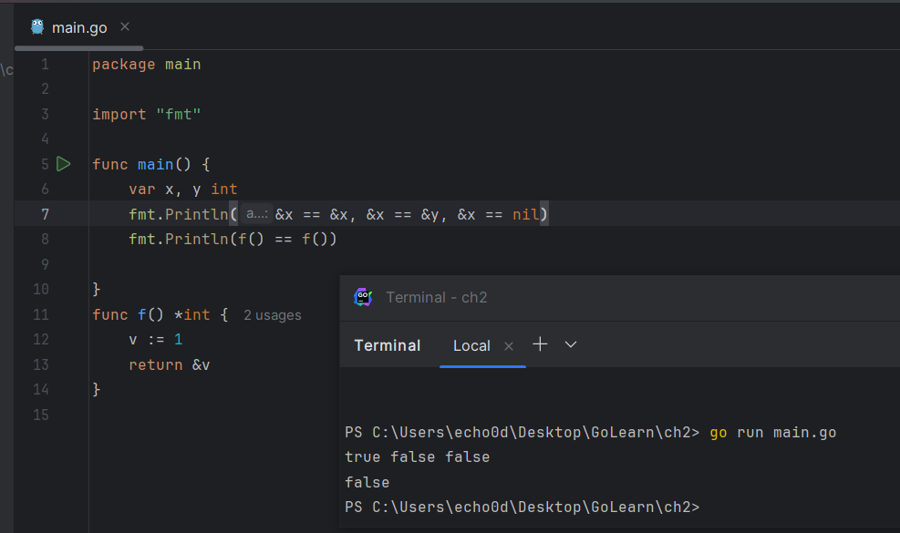

# 2. 程序结构


## 2.1. 命名

### 关键字

Go语言中类似if和switch的关键字有25个；关键字不能用于自定义名字，只能在特定语法结构中使用。

```
break      default       func     interface   select
case       defer         go       map         struct
chan       else          goto     package     switch
const      fallthrough   if       range       type
continue   for           import   return      var
```

此外，还有大约30多个预定义的名字，比如int和true等，主要对应内建的常量、类型和函数。

```
内建常量: true false iota nil

内建类型: int int8 int16 int32 int64
          uint uint8 uint16 uint32 uint64 uintptr
          float32 float64 complex128 complex64
          bool byte rune string error

内建函数: make len cap new append copy close delete
          complex real imag
          panic recover
```

这些内部预先定义的名字并不是关键字，你可以在定义中重新使用它们。在一些特殊的场景中重新定义它们也是有意义的，但是也要注意避免过度而引起语义混乱。

### 命名规则

Go语言中的函数名、变量名、常量名、类型名、语句标号和包名等所有的命名，都遵循如下命名规则：

* 一个名字必须以一个字母（Unicode字母）或下划线开头，后面可以跟任意数量的字母、数字或下划线。
* 大写字母和小写字母是不同的：heapSort和Heapsort是两个不同的名字。

* 如果一个名字是在函数内部定义，那么它就只在函数内部有效。如果是在函数外部定义，那么将在当前包的所有文件中都可以访问。

* 名字的开头字母的大小写决定了名字在包外的可见性。如果一个名字是大写字母开头的，那么它将是导出的，也就是说可以被外部的包访问，例如fmt包的Printf函数就是导出的，可以在fmt包外部访问。
* 包本身的名字一般总是用小写字母。
* 名字的长度没有逻辑限制，但是Go语言的风格是尽量使用短小的名字，对于局部变量尤其是这样；你会经常看到i之类的短名字，而不是冗长的theLoopIndex命名。通常来说，如果一个名字的作用域比较大，生命周期也比较长，那么用长的名字将会更有意义。
* 在习惯上，Go语言程序员推荐使用 **驼峰式** 命名，当名字由几个单词组成时优先使用大小写分隔，而不是优先用下划线分隔。
* 像ASCII和HTML这样的缩略词则避免使用大小写混合的写法，它们可能被称为htmlEscape、HTMLEscape或escapeHTML，但不会是escapeHtml。

## 2.2. 声明

声明语句定义了程序的各种实体对象以及部分或全部的属性。Go语言主要有四种类型的声明语句：var、const、type和func，分别对应变量、常量、类型和函数实体对象的声明。

一个Go语言编写的程序对应一个或多个以.go为文件后缀名的源文件。

* 每个源文件中以包的声明语句开始，说明该源文件是属于哪个包
* 包声明语句之后是import语句导入依赖的其它包
* 然后是包一级的类型、变量、常量、函数的声明语句，包一级的各种类型的声明语句的顺序无关紧要（译注：函数内部的名字则必须先声明之后才能使用）。

### 变量&常量声明

例如，下面的例子中声明了一个常量、一个函数和两个变量：

*gopl.io/ch2/boiling*

```Go
// Boiling prints the boiling point of water.
package main

import "fmt"

const boilingF = 212.0

func main() {
    var f = boilingF
    var c = (f - 32) * 5 / 9
    fmt.Printf("boiling point = %g°F or %g°C\n", f, c)
    // Output:
    // boiling point = 212°F or 100°C
}
```

其中常量boilingF是在包一级范围声明语句声明的，然后f和c两个变量是在main函数内部声明的声明语句声明的。在包一级声明语句声明的名字可在整个包对应的每个源文件中访问，而不是仅仅在其声明语句所在的源文件中访问。相比之下，局部声明的名字就只能在函数内部很小的范围被访问。

### 函数声明

* 一个函数的声明由一个函数名字、参数列表（由函数的调用者提供参数变量的具体值）、一个可选的返回值列表和包含函数定义的函数体组成。
* 如果函数没有返回值，那么返回值列表是省略的。
* 执行函数从函数的第一个语句开始，依次顺序执行直到遇到return返回语句，如果没有返回语句则是执行到函数末尾，然后返回到函数调用者。

在这个例子中，main函数就调用了两次fToC函数，分别使用在局部定义的两个常量作为调用函数的参数。

*gopl.io/ch2/ftoc*

```Go
// Ftoc prints two Fahrenheit-to-Celsius conversions.
package main

import "fmt"

func main() {
    const freezingF, boilingF = 32.0, 212.0
    fmt.Printf("%g°F = %g°C\n", freezingF, fToC(freezingF)) // "32°F = 0°C"
    fmt.Printf("%g°F = %g°C\n", boilingF, fToC(boilingF))   // "212°F = 100°C"
}

func fToC(f float64) float64 {
    return (f - 32) * 5 / 9
}
```

## 2.3. 变量

### var声明语句

var声明语句可以创建一个特定类型的变量，然后给变量附加一个名字，并且设置变量的初始值。变量声明的一般语法如下：

```Go
var 变量名字 类型 = 表达式
```

其中`类型`或`= 表达式`两个部分可以省略其中的一个。

* 如果省略的是类型信息，那么将根据初始化表达式来推导变量的类型信息。
* 如果初始化表达式被省略，那么将用零值初始化该变量。 

### 零值

数值类型变量对应的零值是0，布尔类型变量对应的零值是false，字符串类型对应的零值是空字符串，接口或引用类型（包括slice、指针、map、chan和函数）变量对应的零值是nil。数组或结构体等聚合类型对应的零值是每个元素或字段都是对应该类型的零值。

零值初始化机制可以确保每个声明的变量总是有一个良好定义的值，因此在Go语言中不存在未初始化的变量。这个特性可以简化很多代码，而且可以在没有增加额外工作的前提下确保边界条件下的合理行为。例如：

```Go
var s string
fmt.Println(s) // ""
```

这段代码将打印一个空字符串，而不是导致错误或产生不可预知的行为。Go语言程序员应该让一些聚合类型的零值也具有意义，这样可以保证不管任何类型的变量总是有一个合理有效的零值状态。

也可以在一个声明语句中同时声明一组变量，或用一组初始化表达式声明并初始化一组变量。如果省略每个变量的类型，将可以声明多个类型不同的变量（类型由初始化表达式推导）：

```Go
var i, j, k int                 // int, int, int
var b, f, s = true, 2.3, "four" // bool, float64, string
```

初始化表达式可以是字面量或任意的表达式。

在包级别声明的变量会在main入口函数执行前完成初始化（§2.6.2），局部变量将在声明语句被执行到的时候完成初始化。

一组变量也可以通过调用一个函数，由函数返回的多个返回值初始化：

```Go
var f, err = os.Open(name) // os.Open returns a file and an error
```

### 2.3.1. 简短变量声明

在函数内部，有一种称为简短变量声明语句的形式可用于声明和初始化局部变量。它以`名字 := 表达式`形式声明变量，变量的类型根据表达式来自动推导。下面是lissajous函数中的三个简短变量声明语句（§1.4）：

```Go
anim := gif.GIF{LoopCount: nframes}
freq := rand.Float64() * 3.0
t := 0.0
```

因为简洁和灵活的特点，简短变量声明被广泛用于大部分的局部变量的声明和初始化。

var形式的声明语句往往是用于需要显式指定变量类型的地方，或者因为变量稍后会被重新赋值而初始值无关紧要的地方。

```Go
i := 100                  // an int
var boiling float64 = 100 // a float64
var names []string
var err error
var p Point
```

和var形式声明语句一样，简短变量声明语句也可以用来声明和初始化一组变量：

```Go
i, j := 0, 1
```

但是这种同时声明多个变量的方式应该限制只在可以提高代码可读性的地方使用，比如for语句的循环的初始化语句部分。

> 请记住`:=`是一个变量声明语句，而`=`是一个变量赋值操作。
>
> 也不要混淆多个变量的声明和元组的多重赋值（§2.4.1），后者是将右边各个表达式的值赋值给左边对应位置的各个变量：

```Go
i, j = j, i // 交换 i 和 j 的值
```

和普通var形式的变量声明语句一样，简短变量声明语句也可以用函数的返回值来声明和初始化变量，像下面的os.Open函数调用将返回两个值：

```Go
f, err := os.Open(name)
if err != nil {
    return err
}
// ...use f...
f.Close()
```

这里有一个比较微妙的地方：简短变量声明左边的变量可能并不是全部都是刚刚声明的。

> 如果有一些已经在相同的词法域声明过了（§2.7），那么简短变量声明语句对这些已经声明过的变量就只有赋值行为了。

在下面的代码中，第一个语句声明了in和err两个变量。在第二个语句只声明了out一个变量，然后对已经声明的err进行了赋值操作。

```Go
in, err := os.Open(infile)
// ...
out, err := os.Create(outfile)
```

> 简短变量声明语句中必须至少要声明一个新的变量

下面的代码将不能编译通过：

```Go
f, err := os.Open(infile)
// ...
f, err := os.Create(outfile) // compile error: no new variables
```

解决的方法是第二个简短变量声明语句改用普通的多重赋值语句。

> 简短变量声明语句只有对已经在同级词法域声明过的变量才和赋值操作语句等价，如果变量是在外部词法域声明的，那么简短变量声明语句将会在当前词法域重新声明一个新的变量。

### 2.3.2. 指针

一个变量对应一个保存了变量对应类型值的内存空间。一个指针的值是另一个变量的地址，一个指针对应变量在内存中的存储位置。并不是每一个值都会有一个内存地址，但是对于每一个变量必然有对应的内存地址。通过指针，我们可以直接读或更新对应变量的值，而不需要知道该变量的名字（如果变量有名字的话）。

* 如果用`var x int`声明语句声明一个x变量，那么`&x`表达式（取x变量的内存地址）将产生一个指向该整数变量的指针，指针对应的数据类型是`*int`，指针被称之为“指向int类型的指针”。
* 如果指针名字为p，那么可以说“p指针指向变量x”，或者说“p指针保存了x变量的内存地址”。
* `*p`表达式对应p指针指向的变量的值。一般`*p`表达式读取指针指向的变量的值，这里为int类型
* 因为`*p`对应一个变量，所以该表达式也可以出现在赋值语句的左边，表示更新指针所指向的变量的值。

```Go
x := 1
p := &x         // p, of type *int, points to x
fmt.Println(*p) // "1"
*p = 2          // equivalent to x = 2
fmt.Println(x)  // "2"
```

对于聚合类型每个成员（比如结构体的每个字段）、或者是数组的每个元素，都是**对应一个变量，因此可以被取地址。**

**变量有时候被称为可寻址的值**。即使变量由表达式临时生成，那么表达式也必须能接受`&`取地址操作。

任何类型的指针的零值都是nil。如果p指向某个有效变量，那么`p != nil`测试为真。指针之间也是可以进行相等测试的，只有当它们指向同一个变量或全部是nil时才相等。

```Go
var x, y int
fmt.Println(&x == &x, &x == &y, &x == nil) // "true false false"
```

在Go语言中，返回函数中局部变量的地址也是安全的。例如下面的代码，调用f函数时创建局部变量v，在局部变量地址被返回之后依然有效，因为指针p依然引用这个变量。

```Go
var p = f()

func f() *int {
    v := 1
    return &v
}
```

每次调用f函数都将返回不同的结果：

```Go
fmt.Println(f() == f()) // "false"
```



因为指针包含了一个变量的地址，因此如果将指针作为参数调用函数，那将可以在函数中通过该指针来更新变量的值。例如下面

```Go
func incr(p *int) int {
    *p++ // 非常重要：只是增加p指向的变量的值，并不改变p指针！！！
    return *p
}

v := 1
incr(&v)              // side effect: v is now 2
fmt.Println(incr(&v)) // "3" (and v is 3)
```


每次我们对一个变量取地址，或者复制指针，我们都是为原变量创建了新的别名。例如，`*p`就是变量v的别名。

指针特别有价值的地方在于我们可以不用名字而访问一个变量，但是这是一把双刃剑：要找到一个变量的所有访问者并不容易，我们必须知道变量全部的别名（译注：这是Go语言的垃圾回收器所做的工作）。

不仅仅是指针会创建别名，很多其他引用类型也会创建别名，例如slice、map和chan，甚至结构体、数组和接口都会创建所引用变量的别名。

指针是实现标准库中flag包的关键技术，它使用命令行参数来设置对应变量的值，而这些对应命令行标志参数的变量可能会零散分布在整个程序中。为了说明这一点，在早些的echo版本中，就包含了两个可选的命令行参数：`-n`用于忽略行尾的换行符，`-s sep`用于指定分隔字符（默认是空格）。

```go
// Echo4 prints its command-line arguments.
package main

import (
    "flag"
    "fmt"
    "strings"
)

var n = flag.Bool("n", false, "omit trailing newline")
var sep = flag.String("s", " ", "separator")

func main() {
    flag.Parse()
    fmt.Print(strings.Join(flag.Args(), *sep))
    if !*n {
        fmt.Println()
    }
}

```

调用`flag.Bool`函数会创建一个新的对应布尔型标志参数的变量。它有三个属性：第一个是命令行标志参数的名字“n”，然后是该标志参数的默认值（这里是false），最后是该标志参数对应的描述信息。如果用户在命令行输入了一个无效的标志参数，或者输入`-h`或`-help`参数，那么将打印所有标志参数的名字、默认值和描述信息。

调用`flag.String`函数将创建一个对应字符串类型的标志参数变量，同样包含命令行标志参数对应的参数名、默认值、和描述信息。程序中的`sep`和`n`变量分别是指向对应命令行标志参数变量的指针，因此必须用`*sep`和`*n`形式的指针语法间接引用它们。

当程序运行时，必须在使用标志参数对应的变量之前先调用`flag.Parse`函数，用于更新每个标志参数对应变量的值（之前是默认值）。对于非标志参数的普通命令行参数可以通过调用`flag.Args()`函数来访问，返回值对应一个字符串类型的slice。如果在flag.Parse函数解析命令行参数时遇到错误，默认将打印相关的提示信息，然后调用os.Exit(2)终止程序。


### 2.3.3. new函数

另一个创建变量的方法是调用内建的`new`函数。表达式`new(T)`将创建一个`T`类型的匿名变量，初始化为`T`类型的零值，然后返回变量地址，返回的指针类型为`*T`。

用new创建变量和普通变量声明语句方式创建变量没有什么区别，除了不需要声明一个临时变量的名字外，我们还可以在表达式中使用new(T)。

```go
p := new(int)   // p, *int 类型, 指向匿名的 int 变量
fmt.Println(*p) // "0"
*p = 2          // 设置 int 匿名变量的值为 2
fmt.Println(*p) // "2"
```

下面的两个newInt函数有着相同的行为：

```Go
func newInt() *int {
    return new(int)
}

func newInt() *int {
    var dummy int
    return &dummy
}
```

每次调用new函数都是返回一个新的变量的地址，因此下面两个地址是不同的：

```Go
p := new(int)
q := new(int)
fmt.Println(p == q) // "false"
```

当然也可能有特殊情况：如果两个类型都是空的，也就是说类型的大小是0，例如`struct{}`和`[0]int`，有可能有相同的地址（依赖具体的语言实现）

new函数使用通常相对比较少，因为对于结构体来说，直接用字面量语法创建新变量的方法会更灵活（§4.4.1）。

由于new只是一个预定义的函数，它并不是一个关键字，因此我们可以将new名字重新定义为别的类型。例如下面的例子：

```Go
func delta(old, new int) int { return new - old }
```

由于new被定义为int类型的变量名，因此在delta函数内部是无法使用内置的new函数的。

### 2.3.4. 变量的生命周期

* 对于在包一级声明的变量来说，它们的生命周期和整个程序的运行周期是一致的。

* 局部变量的生命周期则是动态的：每次从创建一个新变量的声明语句开始，直到该变量不再被引用为止，然后变量的存储空间可能被回收。函数的参数变量和返回值变量都是局部变量。它们在函数每次被调用的时候创建。

那么Go语言的自动垃圾收集器是如何知道一个变量是何时可以被回收的呢？基本的实现思路是：

* 从每个包级的变量和每个当前运行函数的每一个局部变量开始，通过指针或引用的访问路径遍历，是否可以找到该变量。如果不存在这样的访问路径，那么说明该变量是不可达的，也就是说它是否存在并不会影响程序后续的计算结果。
* 因为一个变量的有效周期只取决于是否可达，因此一个循环迭代内部的局部变量的生命周期可能超出其局部作用域。同时，局部变量可能在函数返回之后依然存在。

编译器会自动选择在栈上还是在堆上分配局部变量的存储空间：

```Go
var global *int

func f() {
    var x int
    x = 1
    global = &x
}

func g() {
    y := new(int)
    *y = 1
}
```

* f函数里的x变量必须在堆上分配，因为它在函数退出后依然可以通过包一级的global变量找到，虽然它是在函数内部定义的；用Go语言的术语说，这个x局部变量从函数f中逃逸了。

* 相反，当g函数返回时，变量`*y`将是不可达的，也就是说可以马上被回收的。因此，`*y`并没有从函数g中逃逸，编译器可以选择在栈上分配`*y`的存储空间（译注：也可以选择在堆上分配，然后由Go语言的GC回收这个变量的内存空间），虽然这里用的是new方式。
* 要记住的是，逃逸的变量需要额外分配内存，同时对性能的优化可能会产生细微的影响。

## 2.4. 赋值

 使用赋值语句可以更新一个变量的值，最简单的赋值语句是将要被赋值的变量放在=的左边，新值的表达式放在=的右边。

```Go
x = 1                       // 命名变量的赋值
*p = true                   // 通过指针间接赋值
person.name = "bob"         // 结构体字段赋值
count[x] = count[x] * scale // 数组、slice或map的元素赋值
```

特定的二元算术运算符和赋值语句的复合操作有一个简洁形式，例如上面最后的语句可以重写为：

```Go
count[x] *= scale
```

这样可以省去对变量表达式的重复计算。

数值变量也可以支持`++`递增和`--`递减语句（译注：自增和自减是语句，而不是表达式，因此`x = i++`之类的表达式是错误的）：

```Go
v := 1
v++    // 等价方式 v = v + 1；v 变成 2
v--    // 等价方式 v = v - 1；v 变成 1
```

### 2.4.1. 元组赋值

元组赋值是另一种形式的赋值语句，它允许同时更新多个变量的值。在赋值之前，赋值语句右边的所有表达式将会先进行求值，然后再统一更新左边对应变量的值。这对于处理有些同时出现在元组赋值语句左右两边的变量很有帮助，例如我们可以这样交换两个变量的值：

```Go
x, y = y, x

a[i], a[j] = a[j], a[i]
```

或者是计算两个整数值的的最大公约数（GCD）（译注：GCD不是那个敏感字，而是greatest common divisor的缩写，欧几里德的GCD是最早的非平凡算法）：

```Go
func gcd(x, y int) int {
    for y != 0 {
        x, y = y, x%y
    }
    return x
}
```

或者是计算斐波纳契数列（Fibonacci）的第N个数：

```Go
func fib(n int) int {
    x, y := 0, 1
    for i := 0; i < n; i++ {
        x, y = y, x+y
    }
    return x
}
```

元组赋值也可以使一系列琐碎赋值更加紧凑（译注: 特别是在for循环的初始化部分），

```Go
i, j, k = 2, 3, 5
```

但如果表达式太复杂的话，应该尽量避免过度使用元组赋值；因为每个变量单独赋值语句的写法可读性会更好。

#### 多个返回值

有些表达式会产生多个值，比如调用一个有多个返回值的函数。当这样一个函数调用出现在元组赋值右边的表达式中时（译注：右边不能再有其它表达式），左边变量的数目必须和右边一致。

```Go
f, err = os.Open("foo.txt") // function call returns two values
```

通常，这类函数会用额外的返回值来表达某种错误类型，例如os.Open是用额外的返回值返回一个error类型的错误，还有一些是用来返回布尔值，通常被称为ok。在稍后我们将看到的三个操作都是类似的用法。如果map查找（§4.3）、类型断言（§7.10）或通道接收（§8.4.2）出现在赋值语句的右边，它们都可能会产生两个结果，有一个额外的布尔结果表示操作是否成功：

```Go
v, ok = m[key]             // map lookup
v, ok = x.(T)              // type assertion
v, ok = <-ch               // channel receive
```

译注：map查找（§4.3）、类型断言（§7.10）或通道接收（§8.4.2）出现在赋值语句的右边时，并不一定是产生两个结果，也可能只产生一个结果。对于只产生一个结果的情形，map查找失败时会返回零值，类型断言失败时会发生运行时panic异常，通道接收失败时会返回零值（阻塞不算是失败）。例如下面的例子：

```Go
v = m[key]                // map查找，失败时返回零值
v = x.(T)                 // type断言，失败时panic异常
v = <-ch                  // 管道接收，失败时返回零值（阻塞不算是失败）

_, ok = m[key]            // map返回2个值
_, ok = mm[""], false     // map返回1个值
_ = mm[""]                // map返回1个值
```

和变量声明一样，我们可以用下划线空白标识符`_`来丢弃不需要的值。

```Go
_, err = io.Copy(dst, src) // 丢弃字节数
_, ok = x.(T)              // 只检测类型，忽略具体值
```

### 2.4.2. 可赋值性

隐式的赋值：

* 函数调用会隐式地将调用参数的值赋值给函数的参数变量
* 一个返回语句会隐式地将返回操作的值赋值给结果变量
* 一个复合类型的字面量（§4.2）也会产生赋值行为。例如下面的语句：

```Go
medals := []string{"gold", "silver", "bronze"}
```

隐式地对slice的每个元素进行赋值操作，类似这样写的行为：

```Go
medals[0] = "gold"
medals[1] = "silver"
medals[2] = "bronze"
```

map和chan的元素，虽然不是普通的变量，但是也有类似的隐式赋值行为。

不管是隐式还是显式地赋值，在赋值语句左边的变量和右边最终的值必须有相同的数据类型。更直白地说，只有右边的值对于左边的变量是可赋值的，赋值语句才是允许的。

除一些特殊情况外，可赋值的规则：类型必须完全匹配，nil可以赋值给任何指针或引用类型的变量。常量（§3.6）则有更灵活的赋值规则，因为这样可以避免不必要的显式的类型转换。

对于任何类型的值的相等比较（==`或`!=），第二个值必须是对第一个值类型对应的变量是可赋值的，反之亦然。

## 2.5. 类型

一个类型声明语句创建了一个新的类型名称，和现有类型具有相同的底层结构。新命名的类型提供了一个方法，用来分隔不同概念的类型，这样即使它们底层类型相同也是不兼容的。

```Go
type 类型名字 底层类型
```

类型声明语句一般出现在包一级，因此如果新创建的类型名字的首字符大写，则在包外部也可以使用。

我们将不同温度单位分别定义为不同的类型：

```Go
// Package tempconv performs Celsius and Fahrenheit temperature computations.
package tempconv

import "fmt"

type Celsius float64    // 摄氏温度
type Fahrenheit float64 // 华氏温度

const (
    AbsoluteZeroC Celsius = -273.15 // 绝对零度
    FreezingC     Celsius = 0       // 结冰点温度
    BoilingC      Celsius = 100     // 沸水温度
)

func CToF(c Celsius) Fahrenheit { return Fahrenheit(c*9/5 + 32) }

func FToC(f Fahrenheit) Celsius { return Celsius((f - 32) * 5 / 9) }
```

我们在这个包声明了两种类型：Celsius和Fahrenheit分别对应不同的温度单位。它们虽然有着相同的底层类型float64，但是它们是不同的数据类型，因此它们不可以被相互比较或混在一个表达式运算。

Celsius(t)和Fahrenheit(t)是类型转换操作，它们并不是函数调用。类型转换不会改变值本身，但是会使它们的语义发生变化。另一方面，CToF和FToC两个函数则是对不同温度单位下的温度进行换算，它们会返回不同的值。

对于每一个类型T，都有一个对应的类型转换操作`T(x)`，用于将x转为T类型（译注：如果T是指针类型，可能会需要用小括弧包装T，比如`(*int)(0)`）。只有当两个类型的底层基础类型相同时，才允许这种转型操作，或者是两者都是指向相同底层结构的指针类型，这些转换只改变类型而不会影响值本身。

数值类型之间的转型也是允许的，并且在字符串和一些特定类型的slice之间也是可以转换的，在下一章我们会看到这样的例子。这类转换可能改变值的表现。例如，将一个浮点数转为整数将丢弃小数部分，将一个字符串转为`[]byte`类型的slice将拷贝一个字符串数据的副本。在任何情况下，运行时不会发生转换失败的错误（译注: 错误只会发生在编译阶段）。

底层数据类型决定了内部结构和表达方式，也决定是否可以像底层类型一样对内置运算符的支持。这意味着，Celsius和Fahrenheit类型的算术运算行为和底层的float64类型是一样的，正如我们所期望的那样。

```Go
fmt.Printf("%g\n", BoilingC-FreezingC) // "100" °C
boilingF := CToF(BoilingC)
fmt.Printf("%g\n", boilingF-CToF(FreezingC)) // "180" °F
fmt.Printf("%g\n", boilingF-FreezingC)       // compile error: type mismatch
```


比较运算符`==`和`<`也可以用来比较一个命名类型的变量和另一个有相同类型的变量，或有着相同底层类型的未命名类型的值之间做比较。但是如果两个值有着不同的类型，则不能直接进行比较：

```Go
var c Celsius
var f Fahrenheit
fmt.Println(c == 0)          // "true"
fmt.Println(f >= 0)          // "true"
fmt.Println(c == f)          // compile error: type mismatch
fmt.Println(c == Celsius(f)) // "true"!
```

注意最后那个语句。尽管看起来像函数调用，但是Celsius(f)是类型转换操作，它并不会改变值，仅仅是改变值的类型而已。测试为真的原因是因为c和f都是零值。


命名类型还可以为该类型的值定义新的行为。这些行为表示为一组关联到该类型的函数集合，我们称为类型的方法集。

下面的声明语句，Celsius类型的参数c出现在了函数名的前面，表示声明的是Celsius类型的一个名叫String的方法，该方法返回该类型对象c带着°C温度单位的字符串：

```Go
func (c Celsius) String() string { return fmt.Sprintf("%g°C", c) }
```

许多类型都会定义一个String方法，因为当使用fmt包的打印方法时，将会优先使用该类型对应的String方法返回的结果打印，我们将在7.1节讲述。

```Go
c := FToC(212.0)
fmt.Println(c.String()) // "100°C"
fmt.Printf("%v\n", c)   // "100°C"; no need to call String explicitly
fmt.Printf("%s\n", c)   // "100°C"
fmt.Println(c)          // "100°C"
fmt.Printf("%g\n", c)   // "100"; does not call String
fmt.Println(float64(c)) // "100"; does not call String
```


## 2.6. 包和文件

Go语言中的包和其他语言的库或模块的概念类似，目的都是为了支持模块化、封装、单独编译和代码重用。一个包的源代码保存在一个或多个以.go为文件后缀名的源文件中，通常一个包所在目录路径的后缀是包的导入路径；例如包`gopl.io/ch1/helloworld`对应的目录路径是`$GOPATH/src/gopl.io/ch1/helloworld`。

每个包都对应一个独立的名字空间。例如，在image包中的Decode函数和在unicode/utf16包中的 Decode函数是不同的。要在外部引用该函数，必须显式使用image.Decode或utf16.Decode形式访问。

包还可以让我们通过控制哪些名字是外部可见的来隐藏内部实现信息。在Go语言中，一个简单的规则是：如果一个名字是大写字母开头的，那么该名字是导出的（译注：因为汉字不区分大小写，因此汉字开头的名字是没有导出的）。

包代码存储在两个源文件中，用来演示如何在一个源文件声明然后在其他的源文件访问：

我们把变量的声明、对应的常量，还有方法都放到tempconv.go源文件中：

*gopl.io/ch2/tempconv*

```Go
// Package tempconv performs Celsius and Fahrenheit conversions.
package tempconv

import "fmt"

type Celsius float64
type Fahrenheit float64

const (
    AbsoluteZeroC Celsius = -273.15
    FreezingC     Celsius = 0
    BoilingC      Celsius = 100
)

func (c Celsius) String() string    { return fmt.Sprintf("%g°C", c) }
func (f Fahrenheit) String() string { return fmt.Sprintf("%g°F", f) }
```

转换函数则放在另一个conv.go源文件中：

```Go
package tempconv

// CToF converts a Celsius temperature to Fahrenheit.
func CToF(c Celsius) Fahrenheit { return Fahrenheit(c*9/5 + 32) }

// FToC converts a Fahrenheit temperature to Celsius.
func FToC(f Fahrenheit) Celsius { return Celsius((f - 32) * 5 / 9) }
```

每个源文件都是以包的声明语句开始，用来指明包的名字。当包被导入的时候，包内的成员将通过类似tempconv.CToF的形式访问。而包级别的名字，例如在一个文件声明的类型和常量，在同一个包的其他源文件也是可以直接访问的，就好像所有代码都在一个文件一样。要注意的是tempconv.go源文件导入了fmt包，但是conv.go源文件并没有，因为这个源文件中的代码并没有用到fmt包。

因为包级别的常量名都是以大写字母开头，它们可以像tempconv.AbsoluteZeroC这样被外部代码访问：

```Go
fmt.Printf("Brrrr! %v\n", tempconv.AbsoluteZeroC) // "Brrrr! -273.15°C"
```

要将摄氏温度转换为华氏温度，需要先用import语句导入gopl.io/ch2/tempconv包，然后就可以使用下面的代码进行转换了：

```Go
fmt.Println(tempconv.CToF(tempconv.BoilingC)) // "212°F"
```

在每个源文件的包声明前的注释是包注释（§10.7.4）。通常，包注释的第一句应该先是包的功能概要说明。一个包通常只有一个源文件有包注释（译注：如果有多个包注释，目前的文档工具会根据源文件名的先后顺序将它们链接为一个包注释）。如果包注释很大，通常会放到一个独立的doc.go文件中。

**练习 2.1：** 向tempconv包添加类型、常量和函数用来处理Kelvin绝对温度的转换，Kelvin 绝对零度是−273.15°C，Kelvin绝对温度1K和摄氏度1°C的单位间隔是一样的。

```go
// Package tempconv performs Celsius and Fahrenheit conversions.
package tempconv

import "fmt"

type Celsius float64
type Fahrenheit float64
type Kelvin float64

const (
	AbsoluteZeroC Celsius = -273.15
	FreezingC     Celsius = 0
	BoilingC      Celsius = 100
)

func (c Celsius) String() string    { return fmt.Sprintf("%g°C", c) }
func (f Fahrenheit) String() string { return fmt.Sprintf("%g°F", f) }
func (k Kelvin) String() string     { return fmt.Sprintf("%gK", k) }
```

conv.go

```Go
package tempconv

// CToF converts a Celsius temperature to Fahrenheit.
func CToF(c Celsius) Fahrenheit { return Fahrenheit(c*9/5 + 32) }

// FToC converts a Fahrenheit temperature to Celsius.
func FToC(f Fahrenheit) Celsius { return Celsius((f - 32) * 5 / 9) }

func KToC(k Kelvin) Celsius { return Celsius(k - 273.15) }

```


### 2.6.1. 导入包

在Go语言程序中，每个包都有一个全局唯一的导入路径。导入语句中类似"gopl.io/ch2/tempconv"的字符串对应包的导入路径。Go语言的规范并没有定义这些字符串的具体含义或包来自哪里，它们是由构建工具来解释的。当使用Go语言自带的go工具箱时（第十章），一个导入路径代表一个目录中的一个或多个Go源文件。

除了包的导入路径，每个包还有一个包名，包名一般是短小的名字（并不要求包名是唯一的），包名在包的声明处指定。按照惯例，一个包的名字和包的导入路径的最后一个字段相同，例如	ch2/pkg/tempconv包的名字一般是tempconv。

```Go
// Cf converts its numeric argument to Celsius and Fahrenheit.
package main

import (
    "fmt"
    "os"
    "strconv"

    "ch2/pkg/tempconv"
)

func main() {
    for _, arg := range os.Args[1:] {
        t, err := strconv.ParseFloat(arg, 64)
        if err != nil {
            fmt.Fprintf(os.Stderr, "cf: %v\n", err)
            os.Exit(1)
        }
        f := tempconv.Fahrenheit(t)
        c := tempconv.Celsius(t)
        fmt.Printf("%s = %s, %s = %s\n",
            f, tempconv.FToC(f), c, tempconv.CToF(c))
    }
}

```


导入语句将导入的包绑定到一个短小的名字，然后通过该短小的名字就可以引用包中导出的全部内容。上面的导入声明将允许我们以tempconv.CToF的形式来访问ch2/pkg/tempconv包中的内容。

如果导入了一个包，但是又没有使用该包将被当作一个编译错误处理。我们可以使用golang.org/x/tools/cmd/goimports导入工具，它可以根据需要自动添加或删除导入的包；许多编辑器都可以集成goimports工具，然后在保存文件的时候自动运行。类似的还有gofmt工具，可以用来格式化Go源文件。

**练习 2.2：** 写一个通用的单位转换程序，用类似cf程序的方式从命令行读取参数，如果缺省的话则是从标准输入读取参数，然后做类似Celsius和Fahrenheit的单位转换，长度单位可以对应英尺和米，重量单位可以对应磅和公斤等。
