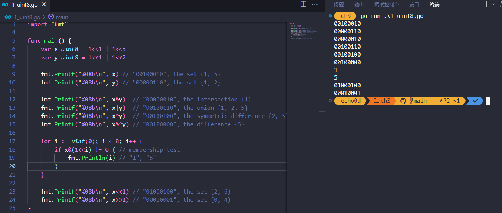
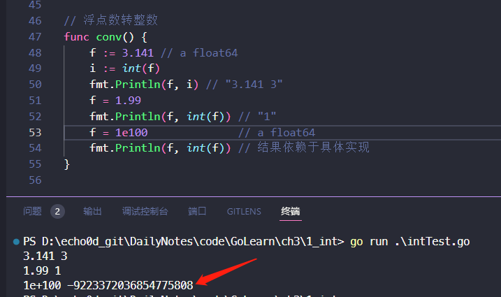

# 3. 基础数据类型

Go语言将数据类型分为四类：基础类型、复合类型、引用类型和接口类型。

* 本章介绍基础类型，包括：数字、字符串和布尔型。
* 复合数据类型——数组（§4.1）和结构体（§4.2）——是通过组合简单类型，来表达更加复杂的数据结构。
* 引用类型包括指针（§2.3.2）、切片（§4.2)）、字典（§4.3）、函数（§5）、通道（§8）
* 将在第7章介绍接口类型

虽然数据种类很多，但它们都是对程序中一个变量或状态的间接引用。这意味着对任一引用类型数据的修改都会影响所有该引用的拷贝。

Go语言的数值类型包括几种不同大小的整数、浮点数和复数。每种数值类型都决定了对应的大小范围和是否支持正负符号。

## 3.1. 整型

### 不同的整型&值域

Go语言同时提供了有符号和无符号类型的整数运算。

* int8、int16、int32和int64四种截然不同大小的有符号整数类型，分别对应8、16、32、64bit大小的有符号整数，与此对应的是uint8、uint16、uint32和uint64四种无符号整数类型。
* 两种一般对应特定CPU平台机器字大小的有符号和无符号整数int和uint；其中int是应用最广泛的数值类型。不同的编译器即使在相同的硬件平台上可能产生不同的大小。
* Unicode字符rune类型是和int32等价的类型，通常用于表示一个Unicode码点。这两个名称可以互换使用。
* byte也是uint8类型的等价类型，byte类型一般用于强调数值是一个原始的数据而不是一个小的整数。
* 无符号的整数类型uintptr，没有指定具体的bit大小但是足以容纳指针。uintptr类型只有在底层编程时才需要，特别是Go语言和C语言函数库或操作系统接口相交互的地方。

不管它们的具体大小，int、uint和uintptr是不同类型的兄弟类型。其中int和int32也是不同的类型，即使int的大小也是32bit，在需要将int当作int32类型的地方需要一个显式的类型转换操作，反之亦然。

**值域**

其中有符号整数采用2的补码形式表示，也就是最高bit位用来表示符号位，一个n-bit的有符号数的值域是从-2n-1到2n-1-1。无符号整数的所有bit位都用于表示非负数，值域是0到2n-1。例如，int8类型整数的值域是从-128到127，而uint8类型整数的值域是从0到255。

### 二元运算符

下面是Go语言中关于算术运算、逻辑运算和比较运算的二元运算符，它们按照优先级递减的顺序排列：

```
*      /      %      <<       >>     &       &^
+      -      |      ^
==     !=     <      <=       >      >=
&&
||
```

二元运算符有五种优先级。在同一个优先级，使用左优先结合规则，但是使用括号可以明确优先顺序，使用括号也可以用于提升优先级，例如 `mask & (1 << 28)`。对于上表中前两行的运算符，例如+运算符还有一个与赋值相结合的对应运算符+=，可以用于简化赋值语句。

#### 算数运算符

* 算术运算符 `+`、`-`、`*`和 `/`可以适用于整数、浮点数和复数，但是取模运算符%仅用于整数间的运算。
* 对于不同编程语言，%取模运算的行为可能并不相同。在Go语言中，%取模运算符的符号和被取模数的符号总是一致的，因此 `-5%3`和 `-5%-3`结果都是-2。
* 除法运算符 `/`的行为则依赖于操作数是否全为整数，比如 `5.0/4.0`的结果是1.25，但是5/4的结果是1，因为整数除法会向着0方向截断余数。

**结果溢出**

一个算术运算的结果，不管是有符号或者是无符号的，如果需要更多的bit位才能正确表示的话，就说明计算结果是溢出了。超出的高位的bit位部分将被丢弃。如果原始的数值是有符号类型，而且最左边的bit位是1的话，那么最终结果可能是负的，例如int8的例子：

```Go
var u uint8 = 255
fmt.Println(u, u+1, u*u) // "255 0 1"

var i int8 = 127
fmt.Println(i, i+1, i*i) // "127 -128 1"
```

#### 比较运算符

两个相同的整数类型可以使用下面的二元比较运算符进行比较；比较表达式的结果是布尔类型。

```
==    等于
!=    不等于
<     小于
<=    小于等于
>     大于
>=    大于等于
```

事实上，布尔型、数字类型和字符串等基本类型都是可比较的，也就是说两个相同类型的值可以用==和!=进行比较。此外，整数、浮点数和字符串可以根据比较结果排序。许多其它类型的值可能是不可比较的，因此也就可能是不可排序的。对于我们遇到的每种类型，我们需要保证规则的一致性。

### 其他运算符

#### 一元的加减法运算符

这里是一元的加法和减法运算符：

```
+      一元加法（无效果）
-      负数
```

对于整数，+x是0+x的简写，-x则是0-x的简写；对于浮点数和复数，+x就是x，-x则是x 的负数。

#### bit位操作运算符

Go语言还提供了以下的bit位操作运算符，前面4个操作运算符并不区分是有符号还是无符号数：

```
&      位运算 AND
|      位运算 OR
^      位运算 XOR
&^     位清空 AND(a, NOT(b))
<<     左移
>>     右移
```

位操作运算符 `^`作为二元运算符时是按位异或（XOR），当用作一元运算符时表示按位取反；也就是说，它返回一个每个bit位都取反的数。

位操作运算符 `&^`用于按位置零（AND NOT）：如果对应y中bit位为1的话，表达式 `z = x &^ y`结果z的对应的bit位为0，否则z对应的bit位等于x相应的bit位的值。

### 无符号&有符号

下面的代码演示了如何使用位操作解释uint8类型值的8个独立的bit位。

使用Printf函数的%b参数打印二进制格式的数字；其中%08b中08表示打印至少8个字符宽度，不足的前缀部分用0填充。

```go
var x uint8 = 1<<1 | 1<<5
var y uint8 = 1<<1 | 1<<2

fmt.Printf("%08b\n", x) // "00100010", the set {1, 5}
fmt.Printf("%08b\n", y) // "00000110", the set {1, 2}

fmt.Printf("%08b\n", x&y)  // "00000010", the intersection {1}
fmt.Printf("%08b\n", x|y)  // "00100110", the union {1, 2, 5}
fmt.Printf("%08b\n", x^y)  // "00100100", the symmetric difference {2, 5}
fmt.Printf("%08b\n", x&^y) // "00100000", the difference {5}

for i := uint(0); i < 8; i++ {
    if x&(1<<i) != 0 { // membership test
        fmt.Println(i) // "1", "5"
    }
}

fmt.Printf("%08b\n", x<<1) // "01000100", the set {2, 6}
fmt.Printf("%08b\n", x>>1) // "00010001", the set {0, 4}

```



在x<<n和x>>n移位运算中，n必须是无符号数，x均可。例如上面用i := int(-1)就编不过

```go
for i := int(-1); i < 8; i++ {
		// NOTE: 此处i是无符号整型，才能实现1<<i，例如上面用i := int(-1)就编不过
		if x&(1<<i) != 0 { // membership test
			fmt.Println(i) // "1", "5"
		}
	}
```

算术上，一个x<<n左移运算等价于乘以$2^n$，一个x>>n右移运算等价于除以$2^n$。

左移运算用零填充右边空缺的bit位，无符号数的右移运算也是用0填充左边空缺的bit位，但是有符号数的右移运算会用符号位的值填充左边空缺的bit位。因为这个原因，最好用无符号运算，这样你可以将整数完全当作一个bit位模式处理。

尽管Go语言提供了无符号数的运算，但即使数值本身不可能出现负数，我们还是倾向于使用有符号的int类型，就像数组的长度那样，虽然使用uint无符号类型似乎是一个更合理的选择。事实上，内置的len函数返回一个有符号的int，我们可以像下面例子那样处理逆序循环。

```go
	medals := []string{"gold", "silver", "bronze"}
	// NOTE: 此处len(medals)返回的有符号int类型，要不然i--总>=0，就死循环了
	for i := len(medals) - 1; i >= 0; i-- {
		fmt.Println(medals[i]) // "bronze", "silver", "gold"
	}
```

在三次迭代之后，也就是i == 0时，i--语句将不会产生-1，而是变成一个uint类型的最大值（可能是$2^64-1$），然后medals[i]表达式运行时将发生panic异常（§5.9），也就是试图访问一个slice范围以外的元素。

> 无符号数往往只有在位运算或其它特殊的运算场景才会使用，就像bit集合、分析二进制文件格式或者是哈希和加密操作等。它们通常并不用于仅仅是表达非负数量的场合。

### 数值类型转换

需要一个显式的转换将一个值从一种类型转化为另一种类型，并且算术和逻辑运算的二元操作中必须是相同的类型。类似下面代码的常见的错误：

```Go
var apples int32 = 1
var oranges int16 = 2
var compote int = apples + oranges // compile error
```

当尝试编译这三个语句时，将产生一个错误信息：

```
invalid operation: apples + oranges (mismatched types int32 and int16)
```

这种类型不匹配的问题可以有几种不同的方法修复，最常见方法是将它们都显式转型为一个常见类型：

```Go
var compote = int(apples) + int(oranges)
```

如2.5节所述，对于每种类型T，如果转换允许的话，类型转换操作T(x)将x转换为T类型。许多整数之间的相互转换并不会改变数值；它们只是告诉编译器如何解释这个值。但是对于将一个大尺寸的整数类型转为一个小尺寸的整数类型，或者是将一个浮点数转为整数，可能会改变数值或丢失精度：

```Go
f := 3.141 // a float64
i := int(f)
fmt.Println(f, i) // "3.141 3"
f = 1.99
fmt.Println(int(f)) // "1"
```

浮点数到整数的转换将丢失任何小数部分，然后向数轴零方向截断。你应该避免对可能会超出目标类型表示范围的数值做类型转换，因为截断的行为可能依赖于具体的实现：

```Go
f := 1e100  // a float64
i := int(f) // 结果依赖于具体实现
```



* 任何大小的整数字面值都可以用以0开始的八进制格式书写，例如0666，八进制数据通常用于POSIX操作系统上的文件访问权限标志；
* 或用以0x或0X开头的十六进制格式书写，例如0xdeadbeef，（大小写都可），十六进制数字则更强调数字值的bit位模式。

### 格式化输出整型

当使用fmt包打印一个数值时，我们可以用 `%d`、`%o`或 `%x`参数控制输出的进制格式

```Go
o := 0666
fmt.Printf("%d %[1]o %#[1]o\n", o) // "438 666 0666"
x := int64(0xdeadbeef)
fmt.Printf("%d %[1]x %#[1]x %#[1]X\n", x)
// Output:
// 3735928559 deadbeef 0xdeadbeef 0XDEADBEEF
```

意义：
1. %d 是格式化占位符，表示按照十进制格式输出一个整数。
2. %[1]o 是格式化占位符的扩展用法，[1] 表示引用第一个参数，o 表示按照八进制格式输出一个整数。
3. %#[1]o 是格式化占位符的扩展用法，# 表示输出格式带有前缀，[1] 表示引用第一个参数，o 表示按照八进制格式输出一个整数。
4. %[1]x类似%[1]o，x表示十六进制
5. %#[1]x带前缀，十六进制，前缀为0x
6. %#[1]X带前缀，十六进制，前缀为0X

字符也可以转成整型，也就是转成他的Unicode，字符使用 `%c`参数打印，或者是用 `%q`参数打印带单引号的字符：

```go
ascii := 'a'
unicode := '国'
newline := '\n'
fmt.Printf("%d %[1]c %[1]q\n", ascii)   // "97 a 'a'"
fmt.Printf("%d %[1]c %[1]q\n", unicode) // "22269 国 '国'"
fmt.Printf("%d %[1]q\n", newline)       // "10 '\n'"
```


## 3.2. 浮点数

### 浮点数精度

Go提供两种精度的浮点数，float32和float64。浮点数的范围极限可以在math包中找到。常量math.MaxFloat32表示float32能表示的最大数值，大约是 3.4e38；对应的math.MaxFloat64常量大约是1.8e308。它们分别能表示的最小值近似为1.4e-45和4.9e-324。一个float32类型的浮点数可以提供大约6个十进制数的精度，而float64则可以提供约15个十进制数的精度；

通常应该优先使用float64类型，因为float32类型的累计计算误差很容易扩散，float32的有效bit位只有23个，其它的bit位用于指数和符号；当整数大于23bit能表达的范围时，float32的表示将出现误差：

```go
var f float32 = 16777216 // 1 << 24
fmt.Println(f == f+1)    // "true"!
```
浮点数的字面值可以直接写小数部分，像这样：
```go
const e = 2.71828 // (approximately)
```
小数点前面或后面的数字都可能被省略（例如.707或1.）。很小或很大的数最好用科学计数法书写，通过e或E来指定指数部分：
```go
const Avogadro = 6.02214129e23  // 阿伏伽德罗常数
const Planck   = 6.62606957e-34 // 普朗克常数\
```
用Printf函数的%g参数打印浮点数，将采用更紧凑的表示形式打印，并提供足够的精度，但是对应表格的数据，使用%e（带指数）或%f的形式打印可能更合适。所有的这三个打印形式都可以指定打印的宽度和控制打印精度。
