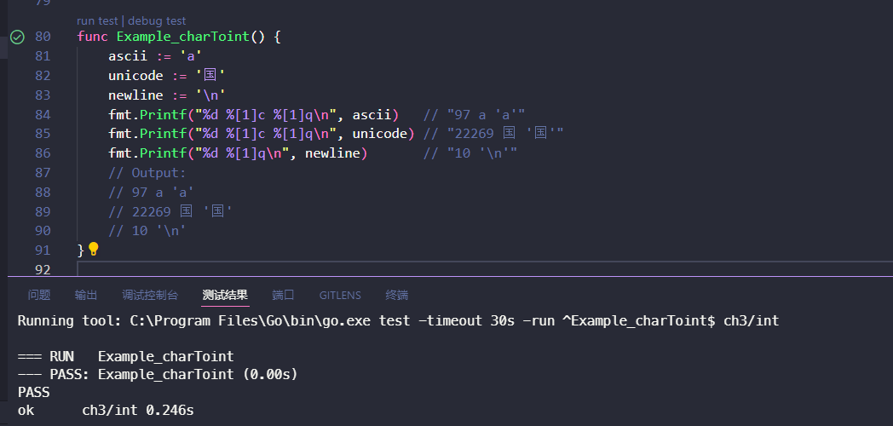
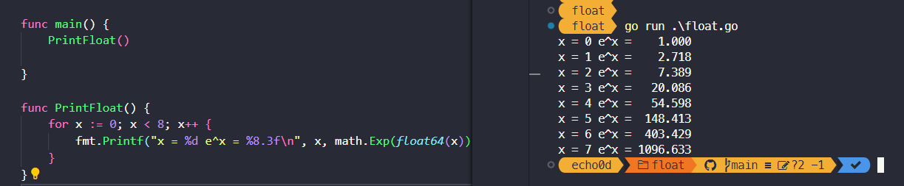
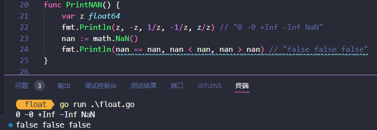
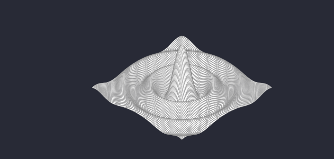
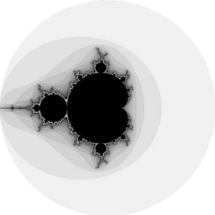
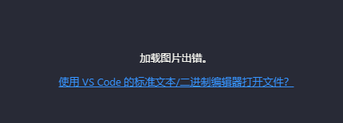

# 3. 基础数据类型

Go语言将数据类型分为四类：基础类型、复合类型、引用类型和接口类型。

* 本章介绍基础类型，包括：数字、字符串和布尔型。
* 复合数据类型——数组（§4.1）和结构体（§4.2）——是通过组合简单类型，来表达更加复杂的数据结构。
* 引用类型包括指针（§2.3.2）、切片（§4.2)）、字典（§4.3）、函数（§5）、通道（§8）
* 将在第7章介绍接口类型

虽然数据种类很多，但它们都是对程序中一个变量或状态的间接引用。这意味着对任一引用类型数据的修改都会影响所有该引用的拷贝。

Go语言的数值类型包括几种不同大小的整数、浮点数和复数。每种数值类型都决定了对应的大小范围和是否支持正负符号。

## 3.1. 整型

### 不同的整型&值域

Go语言同时提供了有符号和无符号类型的整数运算。

* int8、int16、int32和int64四种截然不同大小的有符号整数类型，分别对应8、16、32、64bit大小的有符号整数，与此对应的是uint8、uint16、uint32和uint64四种无符号整数类型。
* 两种一般对应特定CPU平台机器字大小的有符号和无符号整数int和uint；其中int是应用最广泛的数值类型。不同的编译器即使在相同的硬件平台上可能产生不同的大小。
* Unicode字符rune类型是和int32等价的类型，通常用于表示一个Unicode码点。这两个名称可以互换使用。
* byte也是uint8类型的等价类型，byte类型一般用于强调数值是一个原始的数据而不是一个小的整数。
* 无符号的整数类型uintptr，没有指定具体的bit大小但是足以容纳指针。uintptr类型只有在底层编程时才需要，特别是Go语言和C语言函数库或操作系统接口相交互的地方。

不管它们的具体大小，int、uint和uintptr是不同类型的兄弟类型。其中int和int32也是不同的类型，即使int的大小也是32bit，在需要将int当作int32类型的地方需要一个显式的类型转换操作，反之亦然。

**值域**

其中有符号整数采用2的补码形式表示，也就是最高bit位用来表示符号位，一个n-bit的有符号数的值域是从-2n-1到2n-1-1。无符号整数的所有bit位都用于表示非负数，值域是0到2n-1。例如，int8类型整数的值域是从-128到127，而uint8类型整数的值域是从0到255。

### 二元运算符

下面是Go语言中关于算术运算、逻辑运算和比较运算的二元运算符，它们按照优先级递减的顺序排列：

```
*      /      %      <<       >>     &       &^
+      -      |      ^
==     !=     <      <=       >      >=
&&
||
```

二元运算符有五种优先级。在同一个优先级，使用左优先结合规则，但是使用括号可以明确优先顺序，使用括号也可以用于提升优先级，例如 `mask & (1 << 28)`。对于上表中前两行的运算符，例如+运算符还有一个与赋值相结合的对应运算符+=，可以用于简化赋值语句。

#### 算数运算符

* 算术运算符 `+`、`-`、`*`和 `/`可以适用于整数、浮点数和复数，但是取模运算符%仅用于整数间的运算。
* 对于不同编程语言，%取模运算的行为可能并不相同。在Go语言中，%取模运算符的符号和被取模数的符号总是一致的，因此 `-5%3`和 `-5%-3`结果都是-2。
* 除法运算符 `/`的行为则依赖于操作数是否全为整数，比如 `5.0/4.0`的结果是1.25，但是5/4的结果是1，因为整数除法会向着0方向截断余数。

**结果溢出**

一个算术运算的结果，不管是有符号或者是无符号的，如果需要更多的bit位才能正确表示的话，就说明计算结果是溢出了。超出的高位的bit位部分将被丢弃。如果原始的数值是有符号类型，而且最左边的bit位是1的话，那么最终结果可能是负的，例如int8的例子：

```Go
var u uint8 = 255
fmt.Println(u, u+1, u*u) // "255 0 1"

var i int8 = 127
fmt.Println(i, i+1, i*i) // "127 -128 1"
```

#### 比较运算符

两个相同的整数类型可以使用下面的二元比较运算符进行比较；比较表达式的结果是布尔类型。

```
==    等于
!=    不等于
<     小于
<=    小于等于
>     大于
>=    大于等于
```

事实上，布尔型、数字类型和字符串等基本类型都是可比较的，也就是说两个相同类型的值可以用==和!=进行比较。此外，整数、浮点数和字符串可以根据比较结果排序。许多其它类型的值可能是不可比较的，因此也就可能是不可排序的。对于我们遇到的每种类型，我们需要保证规则的一致性。

### 其他运算符

#### 一元的加减法运算符

这里是一元的加法和减法运算符：

```
+      一元加法（无效果）
-      负数
```

对于整数，+x是0+x的简写，-x则是0-x的简写；对于浮点数和复数，+x就是x，-x则是x 的负数。

#### bit位操作运算符

Go语言还提供了以下的bit位操作运算符，前面4个操作运算符并不区分是有符号还是无符号数：

```
&      位运算 AND
|      位运算 OR
^      位运算 XOR
&^     位清空 AND(a, NOT(b))
<<     左移
>>     右移
```

位操作运算符 `^`作为二元运算符时是按位异或（XOR），当用作一元运算符时表示按位取反；也就是说，它返回一个每个bit位都取反的数。

位操作运算符 `&^`用于按位置零（AND NOT）：如果对应y中bit位为1的话，表达式 `z = x &^ y`结果z的对应的bit位为0，否则z对应的bit位等于x相应的bit位的值。

### 无符号&有符号

下面的代码演示了如何使用位操作解释uint8类型值的8个独立的bit位。

使用Printf函数的%b参数打印二进制格式的数字；其中%08b中08表示打印至少8个字符宽度，不足的前缀部分用0填充。

```go
var x uint8 = 1<<1 | 1<<5
var y uint8 = 1<<1 | 1<<2

fmt.Printf("%08b\n", x) // "00100010", the set {1, 5}
fmt.Printf("%08b\n", y) // "00000110", the set {1, 2}

fmt.Printf("%08b\n", x&y)  // "00000010", the intersection {1}
fmt.Printf("%08b\n", x|y)  // "00100110", the union {1, 2, 5}
fmt.Printf("%08b\n", x^y)  // "00100100", the symmetric difference {2, 5}
fmt.Printf("%08b\n", x&^y) // "00100000", the difference {5}

for i := uint(0); i < 8; i++ {
    if x&(1<<i) != 0 { // membership test
        fmt.Println(i) // "1", "5"
    }
}

fmt.Printf("%08b\n", x<<1) // "01000100", the set {2, 6}
fmt.Printf("%08b\n", x>>1) // "00010001", the set {0, 4}

```


在x<<n和x>>n移位运算中，n必须是无符号数，x均可。例如上面用i := int(-1)就编不过

```go
for i := int(-1); i < 8; i++ {
		// NOTE: 此处i是无符号整型，才能实现1<<i，例如上面用i := int(-1)就编不过
		if x&(1<<i) != 0 { // membership test
			fmt.Println(i) // "1", "5"
		}
	}
```

算术上，一个x<<n左移运算等价于乘以$2^n$，一个x>>n右移运算等价于除以$2^n$。

左移运算用零填充右边空缺的bit位，无符号数的右移运算也是用0填充左边空缺的bit位，但是有符号数的右移运算会用符号位的值填充左边空缺的bit位。因为这个原因，最好用无符号运算，这样你可以将整数完全当作一个bit位模式处理。

尽管Go语言提供了无符号数的运算，但即使数值本身不可能出现负数，我们还是倾向于使用有符号的int类型，就像数组的长度那样，虽然使用uint无符号类型似乎是一个更合理的选择。事实上，内置的len函数返回一个有符号的int，我们可以像下面例子那样处理逆序循环。

```go
	medals := []string{"gold", "silver", "bronze"}
	// NOTE: 此处len(medals)返回的有符号int类型，要不然i--总>=0，就死循环了
	for i := len(medals) - 1; i >= 0; i-- {
		fmt.Println(medals[i]) // "bronze", "silver", "gold"
	}
```

在三次迭代之后，也就是i == 0时，i--语句将不会产生-1，而是变成一个uint类型的最大值（可能是$2^64-1$），然后medals[i]表达式运行时将发生panic异常（§5.9），也就是试图访问一个slice范围以外的元素。

> 无符号数往往只有在位运算或其它特殊的运算场景才会使用，就像bit集合、分析二进制文件格式或者是哈希和加密操作等。它们通常并不用于仅仅是表达非负数量的场合。

### 数值类型转换

需要一个显式的转换将一个值从一种类型转化为另一种类型，并且算术和逻辑运算的二元操作中必须是相同的类型。类似下面代码的常见的错误：

```Go
var apples int32 = 1
var oranges int16 = 2
var compote int = apples + oranges // compile error
```

当尝试编译这三个语句时，将产生一个错误信息：

```
invalid operation: apples + oranges (mismatched types int32 and int16)
```

这种类型不匹配的问题可以有几种不同的方法修复，最常见方法是将它们都显式转型为一个常见类型：

```Go
var compote = int(apples) + int(oranges)
```

如2.5节所述，对于每种类型T，如果转换允许的话，类型转换操作T(x)将x转换为T类型。许多整数之间的相互转换并不会改变数值；它们只是告诉编译器如何解释这个值。但是对于将一个大尺寸的整数类型转为一个小尺寸的整数类型，或者是将一个浮点数转为整数，可能会改变数值或丢失精度：

```Go
f := 3.141 // a float64
i := int(f)
fmt.Println(f, i) // "3.141 3"
f = 1.99
fmt.Println(int(f)) // "1"
```

浮点数到整数的转换将丢失任何小数部分，然后向数轴零方向截断。你应该避免对可能会超出目标类型表示范围的数值做类型转换，因为截断的行为可能依赖于具体的实现：

```Go
f := 1e100  // a float64
i := int(f) // 结果依赖于具体实现
```


* 任何大小的整数字面值都可以用以0开始的八进制格式书写，例如0666，八进制数据通常用于POSIX操作系统上的文件访问权限标志；
* 或用以0x或0X开头的十六进制格式书写，例如0xdeadbeef，（大小写都可），十六进制数字则更强调数字值的bit位模式。

### 格式化输出整型

当使用fmt包打印一个数值时，我们可以用 `%d`、`%o`或 `%x`参数控制输出的进制格式

```Go
o := 0666
fmt.Printf("%d %[1]o %#[1]o\n", o) // "438 666 0666"
x := int64(0xdeadbeef)
fmt.Printf("%d %[1]x %#[1]x %#[1]X\n", x)
// Output:
// 3735928559 deadbeef 0xdeadbeef 0XDEADBEEF
```

意义：

1. %d 是格式化占位符，表示按照十进制格式输出一个整数。
2. %[1]o 是格式化占位符的扩展用法，[1] 表示引用第一个参数，o 表示按照八进制格式输出一个整数。
3. %#[1]o 是格式化占位符的扩展用法，# 表示输出格式带有前缀，[1] 表示引用第一个参数，o 表示按照八进制格式输出一个整数。
4. %[1]x类似%[1]o，x表示十六进制
5. %#[1]x带前缀，十六进制，前缀为0x
6. %#[1]X带前缀，十六进制，前缀为0X

字符也可以转成整型，也就是转成他的Unicode，字符使用 `%c`参数打印，或者是用 `%q`参数打印带单引号的字符：

```go
ascii := 'a'
unicode := '国'
newline := '\n'
fmt.Printf("%d %[1]c %[1]q\n", ascii)   // "97 a 'a'"
fmt.Printf("%d %[1]c %[1]q\n", unicode) // "22269 国 '国'"
fmt.Printf("%d %[1]q\n", newline)       // "10 '\n'"
```



## 3.2. 浮点数

### 浮点数精度

Go提供两种精度的浮点数，float32和float64。浮点数的范围极限可以在math包中找到。常量math.MaxFloat32表示float32能表示的最大数值，大约是 3.4e38；对应的math.MaxFloat64常量大约是1.8e308。它们分别能表示的最小值近似为1.4e-45和4.9e-324。一个float32类型的浮点数可以提供大约6个十进制数的精度，而float64则可以提供约15个十进制数的精度；

通常应该优先使用float64类型，因为float32类型的累计计算误差很容易扩散，float32的有效bit位只有23个，其它的bit位用于指数和符号；当整数大于23bit能表达的范围时，float32的表示将出现误差：

```go
var f float32 = 16777216 // 1 << 24
fmt.Println(f == f+1)    // "true"!
```

浮点数的字面值可以直接写小数部分，像这样：

```go
const e = 2.71828 // (approximately)
```

小数点前面或后面的数字都可能被省略（例如.707或1.）。很小或很大的数最好用科学计数法书写，通过e或E来指定指数部分：

```go
const Avogadro = 6.02214129e23  // 阿伏伽德罗常数
const Planck   = 6.62606957e-34 // 普朗克常数\
```

用Printf函数的%g参数打印浮点数，将采用更紧凑的表示形式打印，并提供足够的精度，但是对应表格的数据，使用%e（带指数）或%f的形式打印可能更合适。所有的这三个打印形式都可以指定打印的宽度和控制打印精度。

```go
for x := 0; x < 8; x++ {
	fmt.Printf("x = %d e^x = %8.3f\n", x, math.Exp(float64(x)))
}
```

上面代码打印e的幂，打印精度是小数点后三个小数精度和8个字符宽度：



<<<<<<< HEAD
### 浮点数特殊值

=======
>>>>>>> 96567323cfc2043fbd664cc254d198a3cc1f5994
math包中除了提供大量常用的数学函数外，还提供了IEEE754浮点数标准中定义的特殊值的创建和测试：正无穷大和负无穷大，分别用于表示太大溢出的数字和除零的结果；还有NaN非数，一般用于表示无效的除法操作结果0/0或Sqrt(-1).

```go
var z float64
fmt.Println(z, -z, 1/z, -1/z, z/z) // "0 -0 +Inf -Inf NaN"
```


函数`math.IsNaN`用于测试一个数是否是非数NaN，`math.NaN`则返回非数对应的值。虽然可以用`math.NaN`来表示一个非法的结果，但是测试一个结果是否是非数NaN则是充满风险的，因为NaN和任何数都是不相等的（译注：在浮点数中，NaN、正无穷大和负无穷大都不是唯一的，每个都有非常多种的bit模式表示）：

```go
nan := math.NaN()
fmt.Println(nan == nan, nan < nan, nan > nan) // "false false false"
```



如果一个函数返回的浮点数结果可能失败，最好的做法是用单独的标志报告失败，像这样：

```go
func compute() (value float64, ok bool) {
    // ...
    if failed {
        return 0, false
    }
    return result, true
}
```

<<<<<<< HEAD
接下来的程序演示了通过浮点计算生成的图形。它是带有两个参数的z = f(x, y)函数的三维形式，使用了可缩放矢量图形（SVG）格式输出，SVG是一个用于矢量线绘制的XML标准。图3.1显示了sin(r)/r函数的输出图形，其中r是`sqrt(x*x+y*y)`。



```go
// Surface computes an SVG rendering of a 3-D surface function.
package main

import (
    "fmt"
    "math"
)

const (
    width, height = 600, 320            // canvas size in pixels
    cells         = 100                 // number of grid cells
    xyrange       = 30.0                // axis ranges (-xyrange..+xyrange)
    xyscale       = width / 2 / xyrange // pixels per x or y unit
    zscale        = height * 0.4        // pixels per z unit
    angle         = math.Pi / 6         // angle of x, y axes (=30°)
)

var sin30, cos30 = math.Sin(angle), math.Cos(angle) // sin(30°), cos(30°)

func main() {
    fmt.Printf("<svg xmlns='http://www.w3.org/2000/svg' "+
        "style='stroke: grey; fill: white; stroke-width: 0.7' "+
        "width='%d' height='%d'>", width, height)
    for i := 0; i < cells; i++ {
        for j := 0; j < cells; j++ {
            ax, ay := corner(i+1, j)
            bx, by := corner(i, j)
            cx, cy := corner(i, j+1)
            dx, dy := corner(i+1, j+1)
            fmt.Printf("<polygon points='%g,%g %g,%g %g,%g %g,%g'/>\n",
                ax, ay, bx, by, cx, cy, dx, dy)
        }
    }
    fmt.Println("</svg>")
}

func corner(i, j int) (float64, float64) {
    // Find point (x,y) at corner of cell (i,j).
    x := xyrange * (float64(i)/cells - 0.5)
    y := xyrange * (float64(j)/cells - 0.5)

    // Compute surface height z.
    z := f(x, y)

    // Project (x,y,z) isometrically onto 2-D SVG canvas (sx,sy).
    sx := width/2 + (x-y)*cos30*xyscale
    sy := height/2 + (x+y)*sin30*xyscale - z*zscale
    return sx, sy
}

func f(x, y float64) float64 {
    r := math.Hypot(x, y) // distance from (0,0)
    return math.Sin(r) / r
}

```

### 练习 3.1

如果f函数返回的是无限制的float64值，那么SVG文件可能输出无效的多边形元素（虽然许多SVG渲染器会妥善处理这类问题）。修改程序跳过无效的多边形。

在for循环里处理一下corner函数的返回值：

```go
	for i := 0; i < cells; i++ {
		for j := 0; j < cells; j++ {
			ax, ay := corner(i+1, j)
			bx, by := corner(i, j)
			cx, cy := corner(i, j+1)
			dx, dy := corner(i+1, j+1)
			// NOTE: 跳过无效的多边形
			if math.IsNaN(ax) || math.IsNaN(ay) || math.IsNaN(bx) || math.IsNaN(by) || math.IsNaN(cx) || math.IsNaN(cy) || math.IsNaN(dx) || math.IsNaN(dy) {
				continue
			}

			fmt.Printf("<polygon points='%g,%g %g,%g %g,%g %g,%g'/>\n",
				ax, ay, bx, by, cx, cy, dx, dy)

		}
```


### 练习 3.2

试验math包中其他函数的渲染图形。你是否能输出一个egg box、moguls或a saddle图案?

把原本的f(x)改成别的函数

```go
func f(x, y float64) float64 {
	r := math.Hypot(x, y) // distance from (0,0)
	return math.Sin(r) / r
}

func eggbox(x, y float64) float64 { //鸡蛋盒
	r := 0.2 * (math.Cos(x) + math.Cos(y))
	return r
}

func saddle(x, y float64) float64 { //马鞍
	a := 25.0 * 25.0
	b := 17.0 * 17.0
	r := math.Pow(x, 2) / a * math.Pow(y, 2) / b
	return r
}
```

### 练习 3.3

根据高度给每个多边形上色，那样峰值部将是红色（#ff0000），谷部将是蓝色（#0000ff）。

感觉不难 但我不会

### 练习 3.4

参考1.7节Lissajous例子的函数，构造一个web服务器，用于计算函数曲面然后返回SVG数据给客户端。允许客户端通过HTTP请求参数设置高度、宽度和颜色等参数。

服务器必须设置Content-Type头部：（因为服务器使用标准的PNG图像格式，可以根据前面的512个字节自动输出对应的头部。

```go
w.Header().Set("Content-Type", "image/svg+xml")
```

打印异常的时候还得把"Content-Type"转成text，要不然：


```go
package main

import (
	"fmt"
	"log"
	"math"
	"net/http"
	"strconv"
)

const (
	cells   = 100         // number of grid cells
	xyrange = 30.0        // axis ranges (-xyrange .....+xyrange)
	angle   = math.Pi / 6 // angle of x,y axes (=30˚)
)

var sin30, cos30 = math.Sin(angle), math.Cos(angle)

func main() {
	http.HandleFunc("/", handler)
	err := http.ListenAndServe("localhost:8888", nil)
	log.Fatal(err)
}

func handler(w http.ResponseWriter, r *http.Request) {
	// NOTE: 不加Content-Type，浏览器显示的是svg文件内容，而不是解析显示为图片
	w.Header().Set("Content-Type", "image/svg+xml")
	width := r.FormValue("width")
	widthInt, err := strconv.ParseInt(width, 10, 64)
	if err != nil {
		// 这里打印异常，要把Content-Type转成text，要不然
		// This page contains the following errors: error on line 1 at column 75: EntityRef: expecting ';'
		w.Header().Set("Content-Type", "text/html; charset=utf-8")
		fmt.Fprintf(w, "<html><body>请按要求填写参数'width'!!!例如: http://localhost:8888/?width=2160&height=1280&color=red</body></html>")
		return
	}
	height := r.FormValue("height")
	heightInt, err := strconv.ParseInt(height, 10, 64)
	if err != nil {
		w.Header().Set("Content-Type", "text/html; charset=utf-8")
		fmt.Fprintf(w, "<html><body>请按要求填写参数'height'!!!例如: http://localhost:8888/?width=2160&height=1280&color=red</body></html>")
		return
	}
	color := r.FormValue("color")
	surface(w, widthInt, heightInt, color)
}

func surface(out http.ResponseWriter, width int64, height int64, color string) {
	// NOTE: Header.Set(.... image/svg+xml)填这也行
	// out.Header().Set("Content-Type", "image/svg+xml")
	fmt.Fprintf(out, "<svg xmlns='http://www.w3.org/2000/svg'"+
		" style='stroke: %s;fill:white;stroke-width:0.7'"+
		" width='%d' height='%d'>", color, width, height)
	for i := 0; i < cells; i++ {
		for j := 0; j < cells; j++ {
			ax, ay := corner(i+1, j, width, height)
			bx, by := corner(i, j, width, height)
			cx, cy := corner(i, j+1, width, height)
			dx, dy := corner(i+1, j+1, width, height)

			if math.IsNaN(ax) || math.IsNaN(ay) || math.IsNaN(bx) || math.IsNaN(by) || math.IsNaN(cx) || math.IsNaN(cy) || math.IsNaN(dx) || math.IsNaN(dy) {
				// 跳过无效的多边形
				continue
			}

			fmt.Fprintf(out, "<polygon points='%g,%g %g,%g %g,%g %g,%g'/>\n",
				ax, ay, bx, by, cx, cy, dx, dy)
		}
	}
	fmt.Fprintln(out, "</svg>")
}

func corner(i, j int, width int64, height int64) (float64, float64) {
	// Find Point (x, y) at corner of cell(i, j)
	x := xyrange * (float64(i)/cells - 0.5)
	y := xyrange * (float64(j)/cells - 0.5)

	zscale := float64(height) * 0.4         // pixels per z unit
	xyscale := float64(width) / 2 / xyrange // pixels per x or y unit

	// compute surface height z
	z := f(x, y)

	// project (x,y,z) isometrically onto 2-D SVG canvas (sx, sy)
	sx := float64(width/2) + (x-y)*cos30*xyscale
	sy := float64(height/2) + (x+y)*sin30*xyscale - z*zscale
	return sx, sy
}

func f(x, y float64) float64 {
	r := math.Hypot(x, y) // distance from (0,0)
	return math.Sin(r) / r
}

```


## 3.3. 复数

### 复数表达式

Go语言提供了两种精度的复数类型：complex64和complex128，分别对应float32和float64两种浮点数精度。内置的complex函数用于构建复数，内建的real和imag函数分别返回复数的实部和虚部：

```go
var x complex128 = complex(1, 2) // 1+2i
var y complex128 = complex(3, 4) // 3+4i
fmt.Println(x*y)                 // "(-5+10i)"
fmt.Println(real(x*y))           // "-5"
fmt.Println(imag(x*y))           // "10"
```

如果一个浮点数面值或一个十进制整数面值后面跟着一个i，例如3.141592i或2i，它将构成一个复数的虚部，复数的实部是0：

```go
fmt.Println(1i * 1i) // "(-1+0i)", i^2 = -1
```


在常量算术规则下，一个复数常量可以加到另一个普通数值常量（整数或浮点数、实部或虚部），我们可以用自然的方式书写复数，就像1+2i或与之等价的写法2i+1。上面x和y的声明语句还可以简化：

```go
x := 1 + 2i
y := 3 + 4i
```

复数也可以用==和!=进行相等比较。只有两个复数的实部和虚部都相等的时候它们才是相等的（译注：浮点数的相等比较是危险的，需要特别小心处理精度问题）。

### math/cmplx包

math/cmplx包提供了复数处理的许多函数，例如求复数的平方根函数和求幂函数。

```go
fmt.Println(cmplx.Sqrt(-1)) // "(0+1i)"
```

下面的程序使用complex128复数算法来生成一个Mandelbrot图像。

    // Mandelbrot emits a PNG image of the Mandelbrot fractal.
    package main
    
    import (
        "image"
        "image/color"
        "image/png"
        "math/cmplx"
        "os"
    )


​    
    func main() {
        const (
            xmin, ymin, xmax, ymax = -2, -2, +2, +2
            width, height          = 1024, 1024
        )
    img := image.NewRGBA(image.Rect(0, 0, width, height))
    for py := 0; py < height; py++ {
        y := float64(py)/height*(ymax-ymin) + ymin
        for px := 0; px < width; px++ {
            x := float64(px)/width*(xmax-xmin) + xmin
            z := complex(x, y)
            // Image point (px, py) represents complex value z.
            img.Set(px, py, mandelbrot(z))
        }
    }
    png.Encode(os.Stdout, img) // NOTE: ignoring errors
    }
    
    func mandelbrot(z complex128) color.Color {
        const iterations = 200
        const contrast = 15
        var v complex128
    for n := uint8(0); n < iterations; n++ {
        v = v*v + z
        if cmplx.Abs(v) > 2 {
            return color.Gray{255 - contrast*n}
        }
    }
    return color.Black
    }
用于遍历1024x1024图像每个点的两个嵌套的循环对应-2到+2区间的复数平面。程序反复测试每个点对应复数值平方值加一个增量值对应的点是否超出半径为2的圆。如果超过了，通过根据预设置的逃逸迭代次数对应的灰度颜色来代替。如果不是，那么该点属于Mandelbrot集合，使用黑色颜色标记。最终程序将生成的PNG格式分形图像输出到标准输出。



> [!NOTE]
>
> 此处要用cmd执行go run mandelbrot.go > out.png ，要不然powershell会出问题：
>
> 

### 练习 3.5

实现一个彩色的Mandelbrot图像，使用image.NewRGBA创建图像，使用color.RGBA或color.YCbCr生成颜色。

添加一个选择颜色的函数，替换原来的灰度，颜色参考https://stackoverflow.com/questions/16500656/which-color-gradient-is-used-to-color-mandelbrot-in-wikipedia

```go
func mandelbrot(z complex128) color.Color {
	const iterations = 200
	// const contrast = 15

	var v complex128
	for n := uint8(0); n < iterations; n++ {
		v = v*v + z
		if cmplx.Abs(v) > 2 {
			// return color.Gray{255 - contrast*n}
			// NOTE: 原本return灰度的地方，改成返回一个颜色
			return getColor(n)
		}
	}
	return color.Black
}

func getColor(n uint8) color.Color {
	paletted := [16]color.Color{
		// NOTE: type RGBA struct {R, G, B, A uint8}
		color.RGBA{66, 30, 15, 255},    // brown 3
		color.RGBA{25, 7, 26, 255},     // dark violett
		color.RGBA{9, 1, 47, 255},      //darkest blue
		color.RGBA{4, 4, 73, 255},      //blue 5
		color.RGBA{0, 7, 100, 255},     //blue 4
		color.RGBA{12, 44, 138, 255},   //blue 3
		color.RGBA{24, 82, 177, 255},   //blue 2
		color.RGBA{57, 125, 209, 255},  //blue 1
		color.RGBA{134, 181, 229, 255}, // blue 0
		color.RGBA{211, 236, 248, 255}, // lightest blue
		color.RGBA{241, 233, 191, 255}, // lightest yellow
		color.RGBA{248, 201, 95, 255},  // light yellow
		color.RGBA{255, 170, 0, 255},   // dirty yellow
		color.RGBA{204, 128, 0, 255},   // brown 0
		color.RGBA{153, 87, 0, 255},    // brown 1
		color.RGBA{106, 52, 3, 255},    // brown 2
	}
	return paletted[n%16]

}
```

### 练习 3.6

升采样技术可以降低每个像素对计算颜色值和平均值的影响。简单的方法是将每个像素分成四个子像素，实现它。

原本使用坐标x,y直接算个颜色出来，现在是取坐标x,y四周的四个点，算出颜色的平均值（将r、g、b、a四个的值求平均）

```go
package main

import (
	"image"
	"image/color"
	"image/png"
	"math/cmplx"
	"os"
)

// go command:
// go run ./src/chapter3/work3_6/work3_6.go > ./src/chapter3/work3_6/out.png
func main() {
	const (
		xmin, ymin, xmax, ymax = -2, -2, +2, +2
		width, height          = 1024, 1024
		epsX                   = (xmax - xmin) / width
		epsY                   = (ymax - ymin) / height
	)
	// 升采样的间隔
	offX := []float64{-epsX, epsX}
	offY := []float64{-epsY, epsY}

	img := image.NewRGBA(image.Rect(0, 0, width, height)) // create a 1024 * 1024 canvas
	for py := 0; py < height; py++ {
		y := float64(py)/height*(ymax-ymin) + ymin
		for px := 0; px < width; px++ {
			x := float64(px)/width*(xmax-xmin) + xmin
			// NOTE: 原本使用坐标x,y直接算个颜色出来，现在是取坐标x,y四周的四个点，算出颜色的平均值。
			subPixels := []color.Color{}
			for i := 0; i < 2; i++ {
				for j := 0; j < 2; j++ {
					z := complex(x+offX[i], y+offY[j])
					subPixels = append(subPixels, mandelbrot(z))
				}
			}
			img.Set(px, py, avg(subPixels)) // loop every pixels set a specific color
		}
	}
	png.Encode(os.Stdout, img)
}

func mandelbrot(z complex128) color.Color {
	const iterations = 200
	// const contrast = 15
	var v complex128
	for n := uint8(0); n < iterations; n++ {
		v = v*v + z
		if cmplx.Abs(v) > 2 {
			// return color.Gray{255 - contrast*n} // gray version use this
			return getColor(n)
		}
	}
	return color.Black
}

// 根据维基百科的图片，定义了16个颜色
func getColor(n uint8) color.Color {
	paletted := [16]color.Color{
		color.RGBA{66, 30, 15, 255},    // # brown 3
		color.RGBA{25, 7, 26, 255},     // # dark violett
		color.RGBA{9, 1, 47, 255},      //# darkest blue
		color.RGBA{4, 4, 73, 255},      //# blue 5
		color.RGBA{0, 7, 100, 255},     //# blue 4
		color.RGBA{12, 44, 138, 255},   //# blue 3
		color.RGBA{24, 82, 177, 255},   //# blue 2
		color.RGBA{57, 125, 209, 255},  //# blue 1
		color.RGBA{134, 181, 229, 255}, // # blue 0
		color.RGBA{211, 236, 248, 255}, // # lightest blue
		color.RGBA{241, 233, 191, 255}, // # lightest yellow
		color.RGBA{248, 201, 95, 255},  // # light yellow
		color.RGBA{255, 170, 0, 255},   // # dirty yellow
		color.RGBA{204, 128, 0, 255},   // # brown 0
		color.RGBA{153, 87, 0, 255},    // # brown 1
		color.RGBA{106, 52, 3, 255},    // # brown 2
	}
	return paletted[n%16]
}

// NOTE: 计算颜色平均值，将r、g、b、a四个的值求平均
func avg(colors []color.Color) color.Color {
	var r, g, b, a uint16
	n := len(colors)
	// 这里的uint32(n)=4，其实就是像素值相加除以4，也就是算平均
	for _, c := range colors {
		tr, tg, tb, ta := c.RGBA()
		r += uint16(tr / uint32(n))
		g += uint16(tg / uint32(n))
		b += uint16(tb / uint32(n))
		a += uint16(ta / uint32(n))
	}
	// NOTE: type RGBA64 struct {R, G, B, A uint16}
	return color.RGBA64{r, g, b, a}
}

```

### 练习 3.7

另一个生成分形图像的方式是使用牛顿法来求解一个复数方程，例如$z^4-1=0$。每个起点到四个根的迭代次数对应阴影的灰度。方程根对应的点用颜色表示。

=======

接下来的程序演示了通过浮点计算生成的图形。它是带有两个参数的z = f(x, y)函数的三维形式，使用了可缩放矢量图形（SVG）格式输出，SVG是一个用于矢量线绘制的XML标准。图3.1显示了sin(r)/r函数的输出图形，其中r是`sqrt(x*x+y*y)`。

>>>>>>> 96567323cfc2043fbd664cc254d198a3cc1f5994
